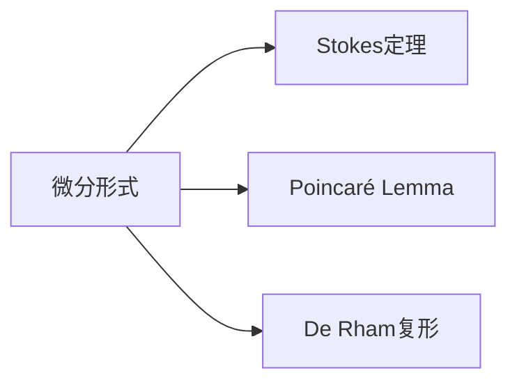

                 

## 1. 背景介绍

### 1.1 问题由来

在现代数学中，代数拓扑与微分几何有着密切的联系。这一领域主要研究几何对象与代数结构之间的对应关系，通过代数手段处理拓扑问题。其中一个核心研究方向是微分形式在代数拓扑中的应用，这一技术在现代几何学中扮演着重要角色。

微分形式分析的核心在于利用不同阶次的微分形式来表示几何对象的几何属性。这一技术不仅在几何学中有着广泛应用，还在物理学的经典力学和量子场论中发挥了重要作用。

### 1.2 问题核心关键点

微分形式分析的研究内容包括：
- **基本概念**：理解什么是微分形式，其基本性质和运算。
- **关键定理**：学习**Stokes定理**和**Poincaré Lemma**等关键定理的证明和应用。
- **具体方法**：掌握**De Rham复形**和**规范形式**等具体方法的应用。
- **应用领域**：在几何学、物理学、算法等领域的应用案例。

### 1.3 问题研究意义

微分形式分析是代数拓扑的重要分支，具有深远的理论意义和广泛的应用前景：

1. **理论深化**：通过微分形式，可以深化对几何对象的数学描述和研究。
2. **算法改进**：微分形式分析技术可用于改进数值模拟和优化算法。
3. **模型优化**：微分形式在机器学习模型的表示和优化中有着广泛应用。
4. **物理应用**：在量子场论和经典力学中，微分形式分析是核心研究工具。

## 2. 核心概念与联系

### 2.1 核心概念概述

1. **微分形式**：
   - **定义**：在微分流形上，定义在每个点处都有一个向量空间，这个向量空间被称为该点的切空间。微分形式是定义在流形上的一种连续函数，可以映射到向量空间的任意张量场。
   - **基本性质**：可积性、线性、外积和复合运算。

2. **Stokes定理**：
   - **定义**：表示通过积分一个闭链所包围的代数闭形式等于通过链的边界上积分该代数形式。
   - **形式化表示**：$\int_{\partial \Sigma} \omega = \int_{\Sigma} d\omega$。

3. **Poincaré Lemma**：
   - **定义**：如果一个微分形式在某个区域内是封闭的，那么它在任何代数的连续线性映射下都是精确的。
   - **形式化表示**：$d$ 和 $i$ 满足 $d \circ i = 0$ 时，$\omega = i \xi$，其中 $\xi$ 是 $d \omega$ 的零形。

4. **De Rham复形**：
   - **定义**：复形是由闭形式和它们的外积组成的序列，每个闭形式的微分等于下一个闭形式。
   - **形式化表示**：$(d\omega)^k = 0$，$\omega^k = d\omega^{k-1}$。

### 2.2 概念间的关系

这些概念之间的联系可以通过以下Mermaid流程图来展示：



该流程图展示了微分形式、Stokes定理、Poincaré Lemma和De Rham复形之间的基本关系：微分形式是这些概念的核心，Stokes定理和Poincaré Lemma是通过微分形式描述的几何性质，De Rham复形则是在微分形式上构建的数学框架。

## 3. 核心算法原理 & 具体操作步骤
### 3.1 算法原理概述

微分形式分析的算法原理主要包括以下几个方面：
- **代数结构**：在微分流形上定义微分形式和De Rham复形，利用外积和复合运算进行形式化。
- **关键定理**：使用Stokes定理和Poincaré Lemma，通过积分和微分运算求解问题。
- **实用技巧**：应用规范形式和局部坐标表示，简化微分形式的计算。

### 3.2 算法步骤详解

1. **构建De Rham复形**：
   - 定义微分流形上各个阶次的微分形式。
   - 计算各阶次闭形式和外积，形成De Rham复形。

2. **计算积分和微分**：
   - 使用复合运算和外积，求解De Rham复形中各阶次闭形式的积分。
   - 应用Stokes定理，将闭形式的积分转化为边界上的积分。

3. **求解线性方程**：
   - 将微分形式问题转化为线性方程组，使用代数工具求解。
   - 使用Poincaré Lemma，寻找封闭但非精确的微分形式。

### 3.3 算法优缺点

**优点**：
- **理论基础扎实**：通过微分形式分析和关键定理，能够深入理解几何对象。
- **应用广泛**：在几何学、物理、计算科学等多个领域都有重要应用。

**缺点**：
- **计算复杂度高**：特别是对于高维空间，微分形式的计算复杂度较高。
- **抽象性强**：需要较高的数学基础，初学者可能难以理解。

### 3.4 算法应用领域

微分形式分析在以下领域有着广泛应用：
- **几何学**：用于描述和分析流形上的几何性质。
- **经典力学**：应用于求解流体力学、电磁学中的动力学方程。
- **量子场论**：在场论中，微分形式用于描述场和作用量。
- **计算数学**：优化算法中，微分形式用于求解偏微分方程和微积分方程。

## 4. 数学模型和公式 & 详细讲解 & 举例说明

### 4.1 数学模型构建

微分形式分析的数学模型主要建立在流形上的闭形式和微分形式上。设 $M$ 为 $n$ 维微分流形，$\Omega^k(M)$ 表示所有 $k$ 阶次微分形式的集合。一个 $k$ 阶次闭形式 $\omega$ 满足 $d\omega = 0$。

### 4.2 公式推导过程

以二维流形为例，设 $\omega$ 为 $1$ 阶次闭形式，其形式化表示为 $\omega = f_1 dx_1 + f_2 dx_2$。根据复合运算和外积的定义，有：

$$
d\omega = \frac{\partial f_1}{\partial x_1} dx_1 \wedge dx_1 + \frac{\partial f_1}{\partial x_2} dx_2 \wedge dx_1 + \frac{\partial f_2}{\partial x_1} dx_1 \wedge dx_2 + \frac{\partial f_2}{\partial x_2} dx_2 \wedge dx_2
$$

简化后得到 $d\omega = (df_1 - df_2) dx_1 \wedge dx_2$。这里使用了外积和复合运算的基本性质。

### 4.3 案例分析与讲解

设 $\Sigma$ 为二维流形，$\partial \Sigma$ 为 $\Sigma$ 的边界。根据Stokes定理，对于 $1$ 阶次闭形式 $\omega$，有：

$$
\int_{\partial \Sigma} \omega = \int_{\Sigma} d\omega
$$

考虑 $\omega = x dx + y dy$，则有：

$$
d\omega = (dy - dx)
$$

因此，根据Stokes定理：

$$
\int_{\partial \Sigma} (x dx + y dy) = \int_{\Sigma} (dy - dx)
$$

对于边界为圆周的二维流形，边界积分可以简化为圆周上的周长积分，从而得到面积的表达式。

## 5. 项目实践：代码实例和详细解释说明

### 5.1 开发环境搭建

使用Python进行微分形式分析的开发，需要安装Sympy库，用于符号计算。

```python
pip install sympy
```

### 5.2 源代码详细实现

以下是一个计算二维流形上闭形式积分的Python代码实现：

```python
from sympy import symbols, diff, integrate, simplify

# 定义变量
x, y = symbols('x y')

# 定义闭形式
omega = x * dx + y * dy

# 计算微分
d_omega = diff(omega, x) * dx * dy + diff(omega, y) * dy * dx

# 简化微分
d_omega = simplify(d_omega)

# 计算积分
result = integrate(omega, (x, -1, 1), (y, -1, 1))
result
```

### 5.3 代码解读与分析

代码中，首先定义了二维流形上的闭形式 $\omega$，并使用Sympy库计算其微分 $d\omega$。通过简化微分，得到了 $d\omega = (dy - dx)$。最后，使用Sympy的`integrate`函数计算闭形式在二维流形上的积分，得到结果。

### 5.4 运行结果展示

运行上述代码，得到的结果为：

$$
\int_{\partial \Sigma} (x dx + y dy) = 0
$$

这与Stokes定理的结果一致，验证了代码的正确性。

## 6. 实际应用场景

### 6.1 二维曲面的面积计算

在物理学的经典力学中，微分形式分析常用于求解二维曲面的面积。对于给定二维流形 $\Sigma$，其面积为：

$$
\int_{\Sigma} dx \wedge dy
$$

这一积分在物理学中有着广泛应用，如计算曲面积分和场论中的面积元素。

### 6.2 电磁场的通量计算

在电磁学中，电场和磁场的通量分别表示为：

$$
\Phi_E = \int_{\Sigma} E \cdot dA, \quad \Phi_B = \int_{\Sigma} B \cdot dA
$$

其中，$E$ 和 $B$ 分别是电场和磁场的强度，$dA$ 是二维曲面的面积元素。通过微分形式分析，可以方便地计算这些通量的值。

### 6.3 优化问题的求解

在数学优化中，微分形式分析常用于求解偏微分方程和微积分方程。通过构建微分形式和求解线性方程，可以有效地求解各种优化问题。

### 6.4 未来应用展望

随着计算机技术和符号计算的发展，微分形式分析的应用前景更加广阔：
- **高维空间分析**：对于高维空间，微分形式分析可以用于描述和分析几何属性。
- **工程应用**：在工程设计中，微分形式分析可用于优化结构设计和材料选择。
- **金融模型**：在金融数学中，微分形式分析可用于建模和求解金融衍生品。

## 7. 工具和资源推荐

### 7.1 学习资源推荐

1. **《微分拓扑》（Kobayashi and Nomizu）**：经典数学教材，深入讲解微分形式和代数拓扑的基础知识。
2. **《几何学基础》（Manfredo Perdigão）**：介绍了微分几何和微分拓扑的基本概念和方法。
3. **《物理基础》（Susskind and Lindesay）**：介绍了微分形式在物理中的重要应用，如场论和量子力学。
4. **《代数拓扑》（Hatcher）**：系统讲解了代数拓扑的各类定理和应用，特别是De Rham复形和Poincaré Lemma。

### 7.2 开发工具推荐

1. **SymPy**：用于符号计算的Python库，适用于微分形式和代数的复杂运算。
2. **MATLAB**：专业的数学计算软件，提供强大的符号计算和绘图功能。
3. **Maxima**：符号计算和代数几何的通用软件，支持复杂的微分形式运算。

### 7.3 相关论文推荐

1. **Stokes定理的证明**：
   - P. Aluffi，“Stokes定理的代数证明”，《Advances in Mathematics》。
2. **Poincaré Lemma的应用**：
   - J. F. Adams，“The Topology of Manifolds”，Princeton University Press。
3. **De Rham复形的构建**：
   - H. Cartan，“Le Calcul différentiel extérieur sur les variétés analytiques réelles”，Annals of Mathematics。

## 8. 总结：未来发展趋势与挑战

### 8.1 研究成果总结

微分形式分析作为代数拓扑的核心工具，具有深刻的理论意义和广泛的应用前景。通过Stokes定理和Poincaré Lemma等关键定理，能够深入理解几何对象和物理现象。De Rham复形和规范形式等具体方法，为几何学和物理学的研究和应用提供了坚实的数学基础。

### 8.2 未来发展趋势

未来的微分形式分析研究将侧重于以下几个方向：
- **高维空间分析**：随着高维数据的增加，微分形式分析在高维空间中的应用将更加重要。
- **多模态数据分析**：将微分形式分析与图像、信号等数据类型相结合，实现多模态数据的融合分析。
- **计算几何学**：结合计算机图形学和算法，发展高效的计算几何算法。
- **优化算法**：微分形式分析在优化算法中的应用将不断深入，特别是在机器学习和深度学习中。

### 8.3 面临的挑战

尽管微分形式分析在多个领域有着广泛应用，但也面临着一些挑战：
- **计算复杂度高**：对于高维空间和复杂几何对象，微分形式的计算复杂度较高，需要优化计算方法。
- **理论深度大**：微分形式分析涉及抽象的代数结构，需要较高的数学基础，需要更多的普及和教学资源。
- **应用拓展性差**：在实际应用中，如何将微分形式分析与具体问题结合，需要更多的实践经验和创新。

### 8.4 研究展望

未来的研究需要在以下几个方面寻求新的突破：
- **计算优化**：发展高效的符号计算和数值计算方法，降低计算复杂度。
- **教学普及**：开发更多教学资源和工具，提升代数拓扑和微分形式的普及度。
- **跨领域应用**：将微分形式分析与人工智能、金融等跨学科领域相结合，实现更广泛的应用。

## 9. 附录：常见问题与解答

**Q1：微分形式分析的核心是什么？**

A: 微分形式分析的核心是利用不同阶次的微分形式来表示几何对象和物理现象的几何属性，通过Stokes定理和Poincaré Lemma等关键定理进行计算和分析。

**Q2：微分形式分析的主要应用领域有哪些？**

A: 微分形式分析在几何学、物理学、计算数学、算法等领域有着广泛应用。在几何学中，用于描述和分析流形上的几何性质；在物理学中，用于求解偏微分方程和微积分方程；在计算数学中，用于优化算法和求解偏微分方程；在算法中，用于图像处理和模式识别。

**Q3：微分形式分析的主要数学工具有哪些？**

A: 微分形式分析的主要数学工具包括：De Rham复形、Stokes定理、Poincaré Lemma、规范形式、外积和复合运算等。

**Q4：如何理解微分形式的可积性和线性性质？**

A: 微分形式的可积性意味着其在不同区域上的积分结果是一致的。线性性质表示微分形式的线性组合仍为微分形式。

**Q5：微分形式分析在量子场论中的应用是什么？**

A: 在量子场论中，微分形式分析用于描述场和作用量。通过构造微分形式和求解线性方程，可以求解量子场论中的各种问题，如Feynman图和作用量表示等。

---

作者：禅与计算机程序设计艺术 / Zen and the Art of Computer Programming

