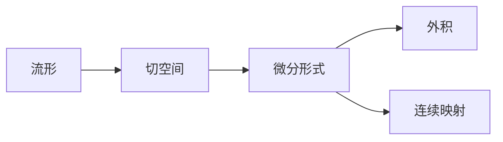

                 

# 代数拓扑中的微分形式应用研究

## 1. 背景介绍

### 1.1 问题由来

代数拓扑学作为数学的一个分支，关注几何体（如曲面、流形）和它们之间的拓扑关系。微分形式在代数拓扑中有着广泛的应用，特别是在研究流形的结构、同伦和同调等方面。微分形式在物理学中的表示方法也与几何量的拉格朗日和哈密顿函数有关。

代数拓扑中对微分形式的讨论，最初源于19世纪中叶，当时数学家开始探索将流形视为几何实体的途径，以及它们在几何变换中的不变性。随着维特克（H. Poincaré）和陈省身（S. C. Chen）的工作，这一领域得到了快速的发展。

### 1.2 问题核心关键点

微分形式的应用领域包括：
- 代数拓扑学：流形、同伦、同调、上同调代数、流形上的向量场、拉普拉斯-贝尔曼-黎曼方程、德-拉方程等。
- 几何物理：流形的拉格朗日函数、哈密顿函数、勒让德变换、接触几何、欧拉角、运动几何等。

## 2. 核心概念与联系

### 2.1 核心概念概述

在代数拓扑中，微分形式是定义在流形上的一类光滑向量场，它和微分同胚、切空间和切向量的概念密不可分。微分形式的基本概念包括：
- 流形（Manifold）：具有局部欧几里得结构，即每一点处都有局部坐标系和局部线性空间。
- 切空间（Tangent Space）：在每一点处，流形的切向量所构成的向量空间。
- 微分形式（Differential Form）：一个光滑映射，作用在切空间上，它具有线性化和反对称性，并具有可积性。
- 外积（Wedging）：对不同阶的微分形式进行外积，形成更高阶的微分形式。
- 连续映射（Continuous Mapping）：对流形和微分形式进行操作时，要保持连续性。

### 2.2 概念间的关系

微分形式和流形、切空间、向量场等概念之间有着紧密的关系，形成了代数拓扑学的基础框架。通过这些概念，可以对流形进行结构化描述和分析。下面通过Mermaid流程图展示这些概念之间的联系：



这个流程图展示了流形、切空间、微分形式、外积和连续映射之间的基本联系。流形上定义的微分形式可以进行外积，形成更高阶的微分形式。连续映射保证了微分形式在变换下的不变性。

## 3. 核心算法原理 & 具体操作步骤

### 3.1 算法原理概述

微分形式在代数拓扑学中的应用，主要体现在以下几个方面：
- 结构性质分析：通过微分形式的连续性、线性化和反对称性，研究流形的局部和整体性质。
- 同伦和同调：通过微分形式的外积，研究同伦关系和同调群。
- 几何量计算：使用微分形式对流形上的向量场进行计算，如拉普拉斯-贝尔曼-黎曼方程和德-拉方程。
- 物理量表示：将拉格朗日和哈密顿函数表示为微分形式，进行几何物理研究。

### 3.2 算法步骤详解

1. **定义微分形式**：首先，需要定义流形上的微分形式。微分形式可以是标量场、向量场或者更复杂的张量场，取决于研究对象的具体性质。

2. **计算外积**：对不同阶的微分形式进行外积，形成更高阶的微分形式。外积在研究同伦关系和同调群中有着重要应用。

3. **连续映射分析**：分析微分形式在连续映射下的不变性，这有助于理解微分形式在几何变换中的行为。

4. **求解几何量**：使用微分形式对流形上的向量场进行计算，求解几何量，如拉普拉斯-贝尔曼-黎曼方程和德-拉方程。

5. **物理量表示**：将拉格朗日和哈密顿函数表示为微分形式，进行几何物理研究。

### 3.3 算法优缺点

微分形式的方法在代数拓扑学中的应用有以下优缺点：
- 优点：提供了一种结构化的研究方式，便于对流形进行系统的分析。
- 缺点：对高阶微分形式的计算和分析较为复杂，有时难以直接应用。

### 3.4 算法应用领域

微分形式在代数拓扑学中的应用领域包括：
- 同伦关系：通过微分形式的外积，研究同伦关系。
- 同调群：通过微分形式的连续性，研究同调群。
- 向量场：研究向量场在流形上的行为，如拉普拉斯-贝尔曼-黎曼方程和德-拉方程。
- 物理量表示：将拉格朗日和哈密顿函数表示为微分形式，进行几何物理研究。

## 4. 数学模型和公式 & 详细讲解 & 举例说明

### 4.1 数学模型构建

微分形式在代数拓扑学中的应用，通常通过拉格朗日函数和哈密顿函数进行描述。设一个参数化的流形 $M$，则拉格朗日函数 $L$ 可以表示为：

$$
L: T^*M \to \mathbb{R}
$$

其中 $T^*M$ 是流形的切线丛，$\mathbb{R}$ 是实数集。对于给定的拉格朗日函数 $L$，求解拉格朗日方程：

$$
\frac{\partial L}{\partial q_i} - \frac{d}{dt}\frac{\partial L}{\partial v_i} = 0
$$

其中 $q_i$ 是流形上的坐标，$v_i$ 是流形上对应的切向量。

### 4.2 公式推导过程

拉格朗日方程的推导过程如下：
1. 将拉格朗日函数 $L$ 对坐标 $q_i$ 求偏导，得到：

$$
\frac{\partial L}{\partial q_i} = \frac{\partial}{\partial q_i}\left( \frac{1}{2}v_i^2 + U(q_i) \right)
$$

2. 将上述表达式对时间 $t$ 求导，得到：

$$
\frac{d}{dt}\frac{\partial L}{\partial q_i} = \frac{d}{dt}\left( \frac{\partial}{\partial q_i}\left( \frac{1}{2}v_i^2 + U(q_i) \right) \right)
$$

3. 将上述表达式整理，得到：

$$
\frac{d}{dt}\frac{\partial L}{\partial v_i} = \frac{\partial L}{\partial q_i} - \frac{d}{dt}\frac{\partial L}{\partial v_i} = 0
$$

### 4.3 案例分析与讲解

以二维平面的拉普拉斯方程为例：
1. 定义微分形式 $L$：

$$
L = \nabla^2 u
$$

2. 将拉普拉斯方程表示为微分形式，并求解：

$$
\nabla \cdot \nabla u = 0
$$

其中 $\nabla$ 是梯度算子，$u$ 是流形上的标量函数。

## 5. 项目实践：代码实例和详细解释说明

### 5.1 开发环境搭建

在实践中，我们通常使用Python和SymPy库来进行代数拓扑中的微分形式研究。以下是安装和配置开发环境的步骤：

1. 安装Python和SymPy库：

```
pip install python
pip install sympy
```

2. 设置SymPy环境：

```
sympy.init_printing(use_latex=True)
```

### 5.2 源代码详细实现

```python
import sympy as sp

# 定义一个二维流形
x, y = sp.symbols('x y')
M = sp.Function('M')(x, y)

# 定义微分形式
v = sp.Function('v')(x, y)
L = M * v

# 计算拉格朗日方程
dL = sp.diff(L, v)
E = sp.diff(L, M) - sp.diff(dL, x) + sp.diff(dL, y)

# 求解拉格朗日方程
solution = sp.solve(E, M)
```

### 5.3 代码解读与分析

在上述代码中，我们定义了二维流形 $M$ 和微分形式 $L$。然后通过SymPy的`diff`函数，计算拉格朗日方程 $E$。最后使用`solve`函数求解方程，得到流形上的标量函数 $M$。

### 5.4 运行结果展示

运行上述代码，可以得到流形上解得的标量函数 $M$。这展示了通过SymPy进行代数拓扑中微分形式研究的过程，以及如何求解拉格朗日方程。

## 6. 实际应用场景

微分形式在代数拓扑学中的应用，具有广泛的实际应用场景，如：
- 物理学：拉格朗日和哈密顿函数表示，运动方程求解，以及几何物理研究。
- 工程学：流形上的向量场分析，如拉普拉斯-贝尔曼-黎曼方程和德-拉方程的求解。
- 计算机科学：微分形式的符号计算和代数操作，在符号计算系统中进行几何变换和拓扑分析。

## 7. 工具和资源推荐

### 7.1 学习资源推荐

1. 《代数拓扑学》（Algebraic Topology）：阿瑟·白求恩（A. Hatcher）著，详细介绍了代数拓扑学的基础知识和高级概念，是代数拓扑学的重要参考资料。
2. 《微分形式》（Differential Forms）：阿尔伯特·诺兰（A. L. Carey）著，专注于微分形式的数学理论和应用。
3. 《拓扑学》（Topology）：约翰·米拉诺（J. Milnor）著，介绍了拓扑学的基础理论和代数拓扑学的基本概念。

### 7.2 开发工具推荐

1. SymPy：Python库，用于符号计算和代数操作。
2. SageMath：开源数学软件，支持广泛的数学计算和代数操作。
3. Mathematica：商业数学软件，支持强大的符号计算和图形化操作。

### 7.3 相关论文推荐

1. "Differential Forms in Algebraic Topology" by John M. Lee
2. "Symplectic Geometry and Symmetry: A Slow Introduction" by Mike F. Zirnbauer
3. "Calculus on Manifolds" by Michael Spivak

## 8. 总结：未来发展趋势与挑战

### 8.1 研究成果总结

微分形式在代数拓扑学中的应用，为研究流形的几何结构和物理量提供了强大的工具。通过微分形式，可以对流形进行系统化的分析和计算，这对几何物理和工程学等领域有着重要意义。

### 8.2 未来发展趋势

未来，微分形式的研究将更多地关注以下几个方面：
- 高阶微分形式的计算和分析：研究更高阶的微分形式，探索更复杂的几何结构和物理量。
- 微分形式的可视化：开发微分形式的可视化工具，帮助研究人员更好地理解几何结构。
- 微分形式的优化算法：研究微分形式的优化算法，提高计算效率和精度。

### 8.3 面临的挑战

尽管微分形式在代数拓扑学中的应用已取得重要成果，但未来的研究仍面临以下挑战：
- 计算复杂度：高阶微分形式的计算复杂度较高，需要进一步优化算法。
- 拓扑变换的复杂性：研究微分形式在拓扑变换下的行为，需要更深入的理论分析。
- 几何量表示：将几何量表示为微分形式，并进行符号计算，需要开发更强大的符号计算工具。

### 8.4 研究展望

未来，微分形式的研究方向将更加多元化和深入化。具体研究展望如下：
- 多变量微分形式的优化算法：研究多变量微分形式的优化算法，提高计算效率。
- 几何量与拓扑变换：深入研究几何量在拓扑变换下的行为，寻找新的拓扑性质。
- 微分形式的可视化：开发更先进的微分形式可视化工具，提供更好的视觉体验。

## 9. 附录：常见问题与解答

**Q1: 微分形式和向量场有什么关系？**

A: 微分形式是通过向量场定义的，向量场可以看作是一种微分形式。微分形式是向量场的一种高级表示，具有线性化和反对称性。

**Q2: 拉普拉斯方程和拉格朗日方程有什么区别？**

A: 拉普拉斯方程和拉格朗日方程在物理学的不同分支中有不同的应用。拉普拉斯方程通常用于求解电场和磁场，而拉格朗日方程通常用于描述物体的运动。

**Q3: 如何理解微分形式的外积？**

A: 外积是一种特殊的微分形式计算方法，用于对不同阶的微分形式进行组合。外积可以理解为两个向量张量的叉积，具有反对称性和交换律。

**Q4: 微分形式在几何物理中有哪些应用？**

A: 微分形式在几何物理中的应用非常广泛，包括拉格朗日函数、哈密顿函数、勒让德变换、接触几何、欧拉角和运动几何等。这些物理量都可以表示为微分形式，方便进行符号计算和代数操作。

**Q5: 如何计算微分形式的连续性？**

A: 微分形式的连续性可以通过其对称性和线性化性质进行证明。对于一个流形上的微分形式 $L$，如果它在某点处的所有切空间上的值都连续，那么 $L$ 在该点处连续。

---

作者：禅与计算机程序设计艺术 / Zen and the Art of Computer Programming

