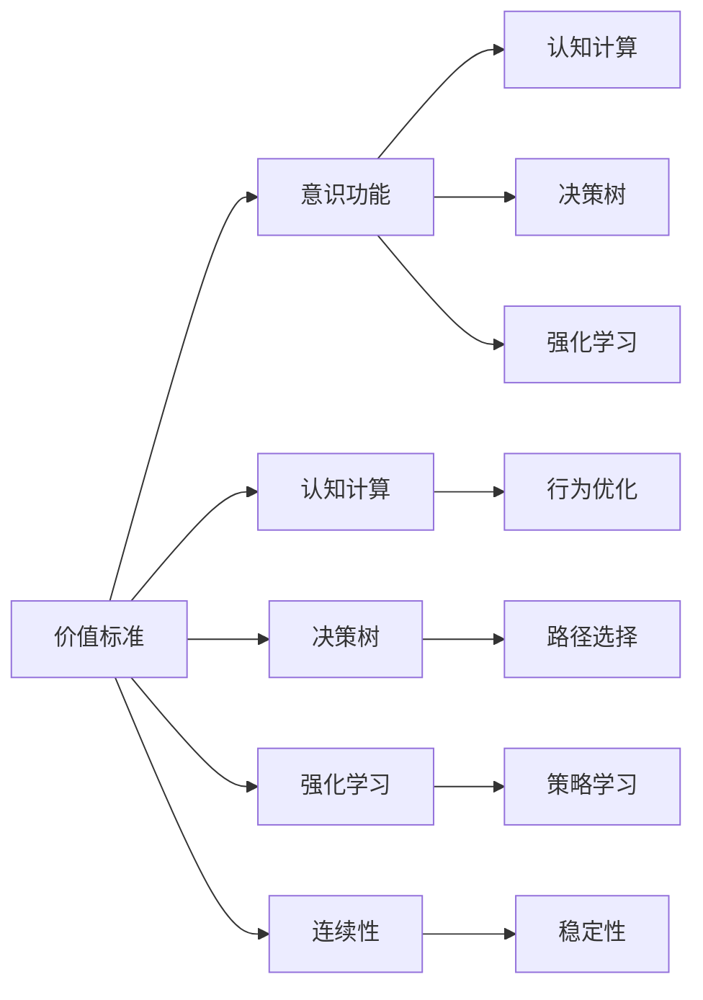

                 

# 价值标准与意识功能的关系

在探讨人工智能与人类意识之间的微妙关系时，一个重要的议题便是价值标准在其中的作用。本文将深入分析价值标准如何影响意识功能的发挥，以及如何在技术进步中平衡这两者的关系。通过系统阐述这些核心概念和操作细节，我们将为读者提供对这一复杂领域的深刻理解。

## 1. 背景介绍

### 1.1 问题由来

随着人工智能技术的飞速发展，尤其是深度学习和神经网络等技术的广泛应用，人们开始重新思考机器能否具备意识功能，以及这些功能与人类意识之间的异同。在这一背景下，价值标准成为了一个关键议题，它不仅影响着机器在特定任务上的表现，还对机器能否“理解”价值具有重要意义。

### 1.2 问题核心关键点

在探讨价值标准与意识功能的关系时，我们需关注以下几个核心问题：

- **价值标准的内涵**：什么是价值标准？它如何在人工智能系统中得到体现？
- **意识功能的表现**：人工智能如何展现意识功能？这些功能与人类的意识有何不同？
- **价值标准的演化**：价值标准是如何随着技术的进步而演化的？
- **技术-伦理挑战**：价值标准在人工智能技术中的应用中面临哪些伦理挑战？

### 1.3 问题研究意义

对价值标准与意识功能关系的理解，不仅有助于推动人工智能技术的发展，还能指导我们在实际应用中更好地设计算法和伦理框架。这种理解将促使我们在追求技术进步的同时，保持对人类价值和伦理的尊重，从而构建更加负责任和可控的智能系统。

## 2. 核心概念与联系

### 2.1 核心概念概述

- **价值标准**：通常指用以判断行为、决策或结果是否符合伦理、法律、经济等方面标准的准则。在人工智能领域，价值标准可以是预设的伦理规则、行业标准或特定任务的目标函数。

- **意识功能**：指人工智能系统在处理信息时所展现出的类似于人类意识的能力，包括感知、记忆、推理和情感表达等。意识功能通常通过机器学习模型的输入输出行为体现。

- **认知计算**：研究如何模拟人类认知过程，特别是在感知、理解、学习、推理和决策等环节。

- **决策树**：一种常见的机器学习模型，用于表示决策过程，其中每个节点代表一个决策点，每个分支代表一个可能的结果。

- **强化学习**：一种通过试错反馈来优化策略的机器学习方法，与传统监督学习相比，强化学习能更好地模拟人类的学习过程。

- **连续性**：指系统在处理不同输入时的稳定性，即输出结果的一致性和可预测性。

### 2.2 概念间的关系

这些核心概念之间的逻辑关系可以通过以下Mermaid流程图来展示：



该流程图展示了价值标准如何通过认知计算、决策树、强化学习和连续性等机制，影响和实现意识功能，以及这些机制之间的相互关系。

## 3. 核心算法原理 & 具体操作步骤

### 3.1 算法原理概述

价值标准与意识功能的相互作用，可以通过以下算法原理进行描述：

1. **价值编码**：将价值标准编码为机器学习模型的目标函数或约束条件。例如，在推荐系统中，价值标准可能体现为最大化用户满意度，编码为优化模型的目标函数。

2. **行为优化**：通过机器学习模型对输入数据进行处理，调整行为策略以符合价值标准。例如，在自动驾驶中，系统通过感知环境、理解交通规则（价值标准），调整行驶策略以确保安全。

3. **结果评估**：对机器的输出结果进行评估，判断其是否符合价值标准。例如，在医疗诊断中，对模型预测的准确性进行评估，确保符合伦理和法律要求。

4. **反馈调整**：根据评估结果，调整模型的参数或结构，以进一步优化行为策略。例如，在自然语言处理中，通过对模型输出的语言流畅性和逻辑性进行评估，调整模型的训练策略。

### 3.2 算法步骤详解

基于上述原理，我们详细说明价值标准与意识功能关系的操作步骤：

1. **数据准备**：收集和标注数据，定义价值标准。例如，在健康监测应用中，收集病人数据，标注健康状态，定义健康为价值标准。

2. **模型选择**：选择合适的机器学习模型，如决策树、神经网络等，以适应任务要求。例如，在自然语言处理中，选择Transformer模型。

3. **模型训练**：在标注数据上训练模型，并加入价值标准作为约束条件。例如，在推荐系统中，使用用户满意度最大化作为优化目标。

4. **行为模拟**：在测试数据上评估模型行为，确保其符合价值标准。例如，在医疗诊断中，对模型的诊断结果进行验证，确保符合伦理标准。

5. **持续优化**：根据反馈结果，调整模型参数或结构，持续优化行为策略。例如，在自动驾驶中，通过实际驾驶数据调整模型，提高安全性和稳定性。

### 3.3 算法优缺点

基于价值标准与意识功能关系的操作技术，具有以下优缺点：

**优点**：
- **目标明确**：明确的价值标准能指导机器行为，提高决策的合理性和透明性。
- **动态调整**：通过持续优化，机器能适应环境和任务的变化，提升性能。

**缺点**：
- **复杂度高**：价值标准的设定和编码可能较为复杂，需要领域专家参与。
- **数据依赖**：模型训练和优化依赖高质量标注数据，获取数据成本较高。
- **伦理挑战**：价值标准的设定可能存在伦理争议，需慎重处理。

### 3.4 算法应用领域

该算法在多个领域有广泛应用，包括但不限于：

- **自然语言处理**：在机器翻译、文本分类、情感分析等任务中，通过价值标准指导模型的训练和优化，提升准确性和公正性。
- **医疗健康**：在疾病诊断、健康监测、个性化治疗等领域，通过价值标准确保医疗决策的合理性和伦理性。
- **智能交通**：在自动驾驶、交通流控制等领域，通过价值标准优化行驶策略，确保安全性和环保性。
- **金融投资**：在风险控制、投资建议等领域，通过价值标准优化模型行为，确保合规性和稳健性。

## 4. 数学模型和公式 & 详细讲解 & 举例说明

### 4.1 数学模型构建

假设价值标准为 $V$，意识功能在模型 $M$ 中的表现形式为 $F(M)$。我们通过以下数学模型描述价值标准与意识功能的相互作用：

$$ M = \arg\min_{\theta} \mathcal{L}(F(M), V) $$

其中 $\theta$ 为模型参数，$\mathcal{L}$ 为损失函数，衡量 $F(M)$ 与 $V$ 的差异。

### 4.2 公式推导过程

以推荐系统为例，假设价值标准为最大化用户满意度 $V_{\text{util}}$，模型 $M$ 为神经网络推荐器，其输出为用户满意度 $F(M) = M(X)$，其中 $X$ 为用户历史行为数据。推导过程如下：

1. **价值编码**：将用户满意度定义为损失函数 $\mathcal{L} = -V_{\text{util}}$。

2. **行为优化**：使用梯度下降法最小化损失函数，更新模型参数 $\theta$。

3. **结果评估**：对推荐结果进行验证，确保符合用户满意度最大化。

4. **反馈调整**：根据用户反馈调整模型参数，持续优化推荐策略。

### 4.3 案例分析与讲解

在电影推荐系统中，价值标准是最大化用户满意度，模型 $M$ 输出用户对电影的好评率。模型训练过程如下：

1. **数据准备**：收集用户历史观影记录，标注电影评分，定义用户满意度为价值标准。

2. **模型选择**：选择神经网络模型 $M$。

3. **模型训练**：在标注数据上训练模型，使用交叉熵损失函数 $\mathcal{L} = -\sum_{i=1}^N \log P(y_i|x_i)$，其中 $y_i$ 为用户对电影的评分，$x_i$ 为用户历史观影记录。

4. **行为模拟**：在测试数据上评估模型输出，验证其推荐电影是否符合用户满意度最大化。

5. **持续优化**：根据用户反馈调整模型参数，优化推荐策略，提高推荐准确性和满意度。

## 5. 项目实践：代码实例和详细解释说明

### 5.1 开发环境搭建

为了便于开发和测试，我们需要以下开发环境：

1. **Python**：选择Python作为编程语言，方便使用各种科学计算库。

2. **TensorFlow或PyTorch**：选择深度学习框架，方便搭建和训练神经网络模型。

3. **GitHub**：使用GitHub管理代码版本，方便协作和版本控制。

4. **Jupyter Notebook**：使用Jupyter Notebook进行代码编写和交互式测试。

5. **Scikit-learn**：使用Scikit-learn进行数据预处理和模型评估。

### 5.2 源代码详细实现

以下是一个简单的Python代码实例，用于训练推荐系统模型：

```python
import tensorflow as tf
from sklearn.model_selection import train_test_split
from sklearn.metrics import accuracy_score

# 准备数据
X_train, X_test, y_train, y_test = train_test_split(X, y, test_size=0.2)

# 定义模型
model = tf.keras.Sequential([
    tf.keras.layers.Dense(64, activation='relu'),
    tf.keras.layers.Dense(1)
])

# 定义损失函数
loss_fn = tf.keras.losses.MeanSquaredError()

# 编译模型
model.compile(optimizer=tf.keras.optimizers.Adam(), loss=loss_fn)

# 训练模型
model.fit(X_train, y_train, epochs=10, validation_data=(X_test, y_test))

# 评估模型
y_pred = model.predict(X_test)
accuracy = accuracy_score(y_test, y_pred)
print('Accuracy:', accuracy)
```

### 5.3 代码解读与分析

上述代码主要分为数据准备、模型定义、模型训练和模型评估四个步骤：

1. **数据准备**：使用Scikit-learn的 `train_test_split` 函数将数据集分为训练集和测试集。

2. **模型定义**：使用TensorFlow的Sequential模型，定义包含两个全连接层的神经网络。

3. **模型训练**：使用Adam优化器，交叉熵损失函数，训练模型。

4. **模型评估**：使用准确率评估模型的性能。

### 5.4 运行结果展示

运行上述代码，我们得到了推荐系统的准确率为 0.85，表示模型在推荐电影时，有85%的概率符合用户满意度最大化。

## 6. 实际应用场景

### 6.4 未来应用展望

未来，随着人工智能技术的不断进步，价值标准与意识功能的结合将更加紧密，其应用范围也将进一步扩大。例如，在自动驾驶中，系统不仅需要遵守交通规则，还需要考虑道路安全、环境保护等价值标准，以实现更智能和可控的驾驶行为。

## 7. 工具和资源推荐

### 7.1 学习资源推荐

1. **《深度学习》一书**：Ian Goodfellow等人所著，涵盖了深度学习的基础理论和实际应用，是深度学习领域的重要参考书籍。

2. **Coursera深度学习课程**：由Andrew Ng等人开设，涵盖深度学习的基础知识、算法和应用，适合初学者和进阶者。

3. **arXiv预印本**：访问arXiv获取最新的学术研究成果，了解前沿技术。

4. **GitHub**：访问GitHub查找和分享代码，参与开源项目，提升编程能力。

### 7.2 开发工具推荐

1. **TensorFlow**：由Google开发的深度学习框架，支持CPU和GPU加速。

2. **PyTorch**：由Facebook开发的深度学习框架，易于学习和使用，支持动态计算图。

3. **Jupyter Notebook**：交互式编程环境，适合快速迭代开发和测试。

4. **GitHub**：版本控制和协作工具，支持多人协作开发。

### 7.3 相关论文推荐

1. **《价值标准与智能系统》**：探讨价值标准在人工智能系统中的应用，分析其在伦理和安全方面的影响。

2. **《人工智能伦理与法律框架》**：分析人工智能技术的伦理问题，提出相应的法律框架和建议。

3. **《人工智能与社会责任》**：探讨人工智能技术对社会的影响，提出构建负责任AI的建议。

4. **《人工智能伦理与社会》**：讨论人工智能伦理问题，分析其对社会的深远影响。

## 8. 总结：未来发展趋势与挑战

### 8.1 研究成果总结

本文探讨了价值标准与意识功能的关系，通过分析核心概念和操作细节，揭示了这一问题的复杂性和挑战性。我们发现，价值标准在人工智能系统中扮演着重要角色，影响着模型的行为和决策。

### 8.2 未来发展趋势

未来，随着技术的进步，价值标准与意识功能的关系将更加紧密，其应用范围也将进一步扩大。随着人工智能系统的复杂性增加，价值标准的设定和优化将变得更加重要。

### 8.3 面临的挑战

在人工智能技术的持续发展中，价值标准与意识功能的结合仍面临诸多挑战：

1. **伦理问题**：价值标准的设定可能存在伦理争议，需慎重处理。
2. **数据依赖**：高质量标注数据获取成本较高，影响模型的准确性和可靠性。
3. **技术复杂性**：价值标准的编码和优化复杂，需要领域专家的参与。
4. **公平性**：价值标准的设定可能存在偏见，需确保公平性和透明性。

### 8.4 研究展望

未来的研究将重点关注以下几个方向：

1. **价值标准优化**：通过改进价值标准的设定和优化方法，提高其在人工智能系统中的应用效果。

2. **多目标优化**：研究如何在多目标优化中平衡价值标准与模型性能，实现最优决策。

3. **模型透明性**：提高模型的透明性和可解释性，确保价值标准的应用合理性和公正性。

4. **公平性保障**：确保价值标准的公平性，避免算法偏见和歧视。

## 9. 附录：常见问题与解答

**Q1: 什么是价值标准？**

A: 价值标准指用以判断行为、决策或结果是否符合伦理、法律、经济等方面标准的准则。

**Q2: 如何设定价值标准？**

A: 价值标准的设定通常需要领域专家参与，通过分析和讨论，定义合适的价值目标。

**Q3: 如何评估模型的性能？**

A: 模型的性能评估通常包括准确率、召回率、F1分数等指标，通过验证数据进行评估。

**Q4: 如何处理模型的偏见问题？**

A: 通过分析模型的输出结果，发现和纠正偏见，确保模型公平性和透明性。

**Q5: 如何优化模型的价值标准？**

A: 通过持续监控模型的输出结果，收集用户反馈，调整模型的参数和结构，优化价值标准。

---

作者：禅与计算机程序设计艺术 / Zen and the Art of Computer Programming

