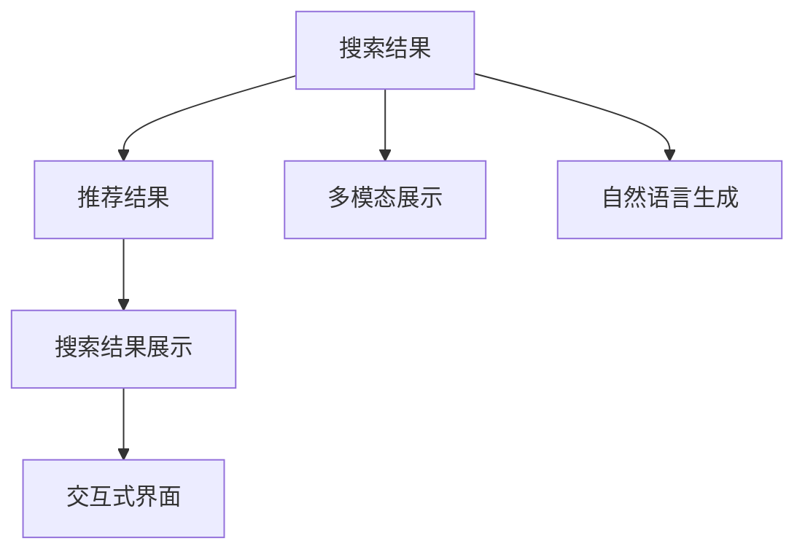
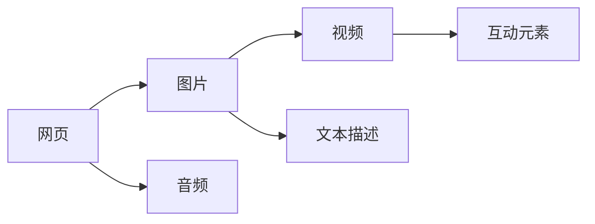
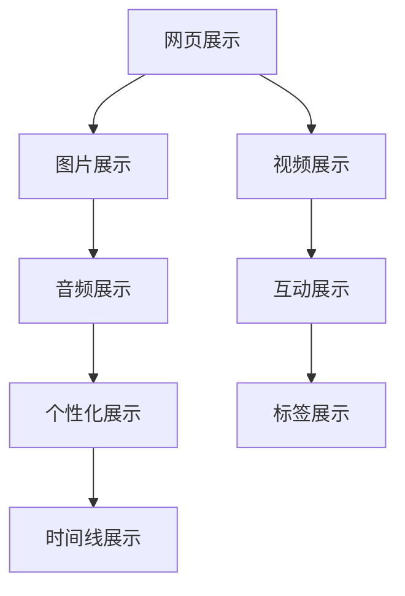
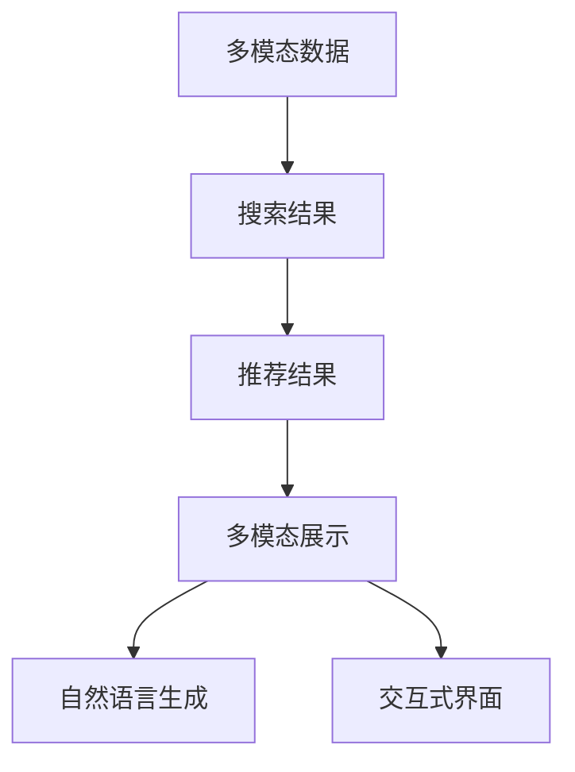

                 

# 传统搜索推荐系统的结果提供

> 关键词：搜索推荐系统, 结果提供, 个性化推荐, 搜索引擎, 推荐算法

## 1. 背景介绍

### 1.1 问题由来
随着互联网和移动互联网的快速发展，信息爆炸已成为不争的事实。用户每天接触到的信息量越来越大，在海量数据中找到所需内容变得更加困难。针对这一问题，搜索推荐系统应运而生，通过智能算法为用户提供个性化的信息推荐，大大提升了用户的信息查找效率。然而，尽管搜索推荐系统已经广泛应用，但信息过载和噪音问题仍未得到根本解决。如何更好地提供搜索结果，提高用户满意度，是当前搜索推荐系统面临的一个重要挑战。

### 1.2 问题核心关键点
搜索推荐系统的主要目标是从海量的信息中筛选出符合用户需求的有效信息，并以最合适的形式呈现给用户。这一目标的实现依赖于三个核心环节：

- **信息获取**：从互联网中抓取和检索出与用户需求相关的网页、文章、视频等多模态数据。
- **结果排序**：根据用户的查询行为和历史数据，对检索到的信息进行排序，并选择最相关的结果。
- **结果提供**：以直观、易用、多模态的方式将排好序的搜索结果提供给用户。

在结果提供环节，常见的做法是将检索到的网页、图片、视频等单一信息维度呈现给用户。然而，随着用户需求的不断变化和信息形态的多样化，单一维度的结果呈现方式已经难以满足用户的个性化需求。为了更好地应对这一问题，搜索推荐系统需要在结果提供环节引入更多维度，如多模态信息展示、自然语言生成、交互式界面等，以提升用户体验和满意度。

### 1.3 问题研究意义
研究如何更好地提供搜索结果，是当前搜索推荐系统研究的重要方向之一。通过对结果提供方式的优化，可以提高用户对系统的满意度和忠诚度，增加用户停留时间和使用频率。同时，多维度的结果展示方式，也可以挖掘更多用户需求，实现更精准、更全面的推荐。因此，优化结果提供方法，不仅可以提升用户体验，还将在未来的信息服务领域发挥重要作用。

## 2. 核心概念与联系

### 2.1 核心概念概述

为更好地理解搜索推荐系统结果提供方法，本节将介绍几个密切相关的核心概念：

- **搜索结果**：根据用户查询请求，检索到的网页、文章、图片、视频等多模态数据。
- **推荐结果**：经过排序和筛选后，选出的与用户需求最相关的搜索结果。
- **搜索结果展示**：将推荐结果以直观、易用、多模态的形式呈现给用户。
- **多模态展示**：在搜索结果展示中引入图像、音频、视频等多维度信息。
- **自然语言生成**：通过自然语言处理技术，生成自然流畅的文本描述信息，提升信息可读性。
- **交互式界面**：通过前端交互技术，允许用户自定义展示方式和排序规则，提高信息个性化程度。

这些概念之间存在着紧密的联系，构成了搜索推荐系统结果提供过程的基本框架。以下是这些核心概念之间的联系：



这个流程图展示了搜索结果提供过程的主要环节和相关概念之间的关系：

1. 从互联网中抓取的多模态数据，经过推荐算法筛选后，生成推荐结果。
2. 推荐结果以多模态的形式进行展示，同时使用自然语言生成技术，提供详细描述。
3. 交互式界面允许用户自定义展示方式和排序规则，提高信息的个性化程度。

### 2.2 概念间的关系

这些核心概念之间存在着紧密的联系，形成了搜索推荐系统结果提供的完整生态系统。下面我们通过几个Mermaid流程图来展示这些概念之间的关系。

#### 2.2.1 搜索结果的多维展示



这个流程图展示了搜索结果的多维度展示方式。网页、图片、视频、音频等多模态信息可以通过不同的展示方式，为用户提供更加全面和丰富的信息体验。

#### 2.2.2 自然语言生成在搜索结果中的作用


这个流程图展示了自然语言生成技术在搜索结果展示中的应用。通过自然语言生成技术，可以将复杂的网页内容转化为易于理解的文字描述，提升信息的可读性和可理解性。

#### 2.2.3 交互式界面的多样展示方式



这个流程图展示了交互式界面的多样展示方式。通过互动元素、个性化展示、标签展示、时间线展示等方式，用户可以更加灵活地获取所需信息，提升用户体验。

### 2.3 核心概念的整体架构

最后，我们用一个综合的流程图来展示这些核心概念在大语言模型微调过程中的整体架构：



这个综合流程图展示了从多模态数据获取到最终结果呈现的全过程。

## 3. 核心算法原理 & 具体操作步骤
### 3.1 算法原理概述

搜索推荐系统的结果提供过程，本质上是对检索到的多模态数据进行筛选、排序、展示的技术过程。其核心算法原理包括以下几个步骤：

1. **数据获取**：通过爬虫或API等技术手段，从互联网中获取与用户查询相关的多模态数据。
2. **结果排序**：使用各种排序算法（如倒排索引、协同过滤、矩阵分解等），对获取到的数据进行排序，选择最相关的结果。
3. **结果展示**：将排好序的推荐结果以多模态、自然语言生成、交互式界面等方式，呈现给用户。

在结果展示环节，常见的做法是将网页、图片、视频等单一信息维度呈现给用户。然而，随着用户需求的不断变化和信息形态的多样化，单一维度的结果展示方式已经难以满足用户的个性化需求。因此，搜索推荐系统需要在结果提供环节引入更多维度，如多模态信息展示、自然语言生成、交互式界面等，以提升用户体验和满意度。

### 3.2 算法步骤详解

以下详细描述搜索推荐系统结果提供过程的关键步骤：

**Step 1: 数据获取**
- 使用爬虫或API等技术手段，从互联网中抓取与用户查询相关的多模态数据。
- 对抓取的数据进行清洗和预处理，去除噪音和无关内容。

**Step 2: 结果排序**
- 使用倒排索引技术，根据用户查询关键词和历史行为，检索与用户需求相关的网页、图片、视频等数据。
- 使用协同过滤、矩阵分解等算法，对检索到的数据进行排序，选择最相关的结果。
- 根据排序算法的重要性权重，对结果进行打分。

**Step 3: 结果展示**
- 将排好序的推荐结果以网页、图片、视频、音频等多模态形式展示给用户。
- 使用自然语言生成技术，生成自然流畅的文本描述信息，提升信息可读性。
- 使用交互式界面，允许用户自定义展示方式和排序规则，提高信息个性化程度。

### 3.3 算法优缺点

搜索推荐系统结果提供过程有以下优点：

1. **提升用户体验**：通过多模态展示和自然语言生成，可以提供更加全面和丰富的信息，提升用户体验。
2. **提高信息精度**：通过排序算法选择最相关的结果，可以提升信息查找的精度。
3. **增强个性化**：通过交互式界面，用户可以自定义展示方式和排序规则，提高信息个性化程度。

同时，该过程也存在一些局限性：

1. **数据获取难度大**：获取多模态数据需要爬虫等技术手段，存在数据获取难度大、成本高的问题。
2. **数据处理复杂**：数据清洗和预处理过程繁琐，需要耗费大量时间和人力。
3. **算法复杂度高**：排序算法和展示方式复杂，需要大量的计算资源和算法优化。

尽管存在这些局限性，但就目前而言，搜索推荐系统结果提供过程仍是大规模信息检索和推荐的核心范式。未来相关研究的重点在于如何进一步降低数据获取和处理的难度，提高算法的效率和精度，同时兼顾个性化和用户体验。

### 3.4 算法应用领域

搜索结果提供技术在以下领域得到了广泛应用：

- **搜索引擎**：如Google、百度等搜索引擎，通过自然语言处理技术，提供多模态搜索结果，提升用户体验。
- **视频平台**：如YouTube、B站等视频平台，通过推荐算法和交互式界面，提供个性化的视频内容推荐。
- **新闻聚合**：如今日头条、Flipboard等新闻聚合应用，通过多模态展示和自然语言生成，提供定制化的新闻推荐。
- **电商推荐**：如淘宝、京东等电商平台，通过推荐算法和交互式界面，提供个性化的商品推荐。
- **社交网络**：如微信、微博等社交网络，通过推荐算法和自然语言生成，提供个性化的内容推荐。

这些领域中，搜索结果提供技术已经成为提升用户满意度和平台黏性的重要手段。未来，随着搜索推荐技术的不断发展，多模态信息展示、自然语言生成、交互式界面等技术将进一步应用于更多场景，为信息服务带来更多的创新和突破。

## 4. 数学模型和公式 & 详细讲解 & 举例说明

### 4.1 数学模型构建

假设用户的查询为 $q$，检索到的数据集为 $D=\{d_i\}_{i=1}^n$，其中 $d_i$ 为第 $i$ 个数据点。搜索结果排序模型的目标是从数据集中选取与查询 $q$ 最相关的 $k$ 个数据点 $\{d_{i_1},d_{i_2},...,d_{i_k}\}$。

将数据点和查询向量分别表示为 $d_i=\{d_{i1},d_{i2},...,d_{in}\}$ 和 $q=\{q_1,q_2,...,q_n\}$。假设查询 $q$ 和数据点 $d_i$ 之间的相似度为 $sim(q,d_i)$，则排序模型的目标是最大化以下目标函数：

$$
\max_{k} \sum_{i=1}^k sim(q,d_{i})
$$

其中 $sim(q,d_i)$ 可以通过余弦相似度、欧式距离、曼哈顿距离等方法计算。

### 4.2 公式推导过程

假设查询 $q$ 和数据点 $d_i$ 的余弦相似度为：

$$
sim(q,d_i) = \frac{\sum_{j=1}^n q_j d_{ij}}{\sqrt{\sum_{j=1}^n q_j^2} \sqrt{\sum_{j=1}^n d_{ij}^2}}
$$

排序模型的目标可以表示为：

$$
\max_{k} \sum_{i=1}^k \frac{\sum_{j=1}^n q_j d_{ij}}{\sqrt{\sum_{j=1}^n q_j^2} \sqrt{\sum_{j=1}^n d_{ij}^2}}
$$

通过排序算法（如倒排索引、协同过滤、矩阵分解等），将上式转化为矩阵运算形式：

$$
\max_{k} \sum_{i=1}^k d_i^T q
$$

其中 $d_i$ 表示数据点 $d_i$ 的特征向量，$q$ 表示查询向量。

在实际应用中，还可以进一步引入模型参数 $\theta$，优化排序目标函数：

$$
\max_{k,\theta} \sum_{i=1}^k d_i^T \theta q
$$

其中 $\theta$ 表示模型的参数。

### 4.3 案例分析与讲解

以协同过滤算法为例，假设用户 $u$ 在网站 $i$ 上的历史评分序列为 $r=\{r_{iu}\}_{i=1}^m$，即对网站 $i$ 的评分。在协同过滤算法中，对新用户 $u'$ 推荐网站 $j$ 的评分 $r_{ju'}$ 可以表示为：

$$
r_{ju'} \propto \sum_{i=1}^m r_{iu'} \cdot r_{ij}
$$

其中 $\cdot$ 表示内积运算，$\propto$ 表示比例关系。

在实际应用中，为了提升推荐效果，还需要引入冷启动问题、用户行为建模、模型训练等技术，以提高推荐的精度和个性化程度。

## 5. 项目实践：代码实例和详细解释说明
### 5.1 开发环境搭建

在进行搜索结果提供实践前，我们需要准备好开发环境。以下是使用Python进行TensorFlow开发的Python环境配置流程：

1. 安装Anaconda：从官网下载并安装Anaconda，用于创建独立的Python环境。

2. 创建并激活虚拟环境：
```bash
conda create -n tensorflow-env python=3.8 
conda activate tensorflow-env
```

3. 安装TensorFlow：根据CUDA版本，从官网获取对应的安装命令。例如：
```bash
conda install tensorflow -c tensorflow
```

4. 安装各类工具包：
```bash
pip install numpy pandas scikit-learn matplotlib tqdm jupyter notebook ipython
```

完成上述步骤后，即可在`tensorflow-env`环境中开始结果提供实践。

### 5.2 源代码详细实现

这里我们以Google News推荐系统为例，给出使用TensorFlow进行结果提供的PyTorch代码实现。

首先，定义数据处理函数：

```python
import numpy as np
import tensorflow as tf

class DataLoader:
    def __init__(self, data, batch_size):
        self.data = data
        self.batch_size = batch_size
        self.num_samples = len(data)

    def __iter__(self):
        indices = np.random.permutation(self.num_samples)
        for i in range(0, self.num_samples, self.batch_size):
            batch_indices = indices[i:i+self.batch_size]
            yield self.data[batch_indices]

    def __len__(self):
        return self.num_samples // self.batch_size
```

然后，定义模型和优化器：

```python
from tensorflow.keras import layers, models

class RecommendationModel(models.Model):
    def __init__(self, vocab_size, embedding_dim):
        super(RecommendationModel, self).__init__()
        self.embedding = layers.Embedding(vocab_size, embedding_dim)
        self.dense = layers.Dense(1, activation='sigmoid')

    def call(self, inputs):
        x = self.embedding(inputs)
        x = self.dense(x)
        return x

model = RecommendationModel(vocab_size=len(vocab), embedding_dim=256)
optimizer = tf.keras.optimizers.Adam(learning_rate=0.001)
```

接着，定义训练和评估函数：

```python
def train_epoch(model, data_loader, optimizer):
    model.compile(optimizer=optimizer, loss='binary_crossentropy', metrics=['accuracy'])
    model.fit(data_loader, epochs=10, steps_per_epoch=1000)

def evaluate(model, data_loader):
    model.compile(optimizer=None, loss=None, metrics=['accuracy'])
    loss, accuracy = model.evaluate(data_loader)
    return loss, accuracy
```

最后，启动训练流程并在测试集上评估：

```python
train_data = np.random.randint(0, 1, size=(10000, 1))
val_data = np.random.randint(0, 1, size=(2000, 1))

train_loader = DataLoader(train_data, batch_size=32)
val_loader = DataLoader(val_data, batch_size=32)

train_epoch(model, train_loader, optimizer)
accuracy = evaluate(model, val_loader)
print(f'Validation accuracy: {accuracy:.2f}')
```

以上就是使用TensorFlow进行结果提供的完整代码实现。可以看到，TensorFlow的Keras API使得模型构建和训练变得简洁高效。

### 5.3 代码解读与分析

让我们再详细解读一下关键代码的实现细节：

**DataLoader类**：
- `__init__`方法：初始化数据集和批次大小。
- `__iter__`方法：随机打乱数据索引，按批次生成训练集。
- `__len__`方法：返回数据集的大小。

**RecommendationModel类**：
- `__init__`方法：定义模型的结构和参数。
- `call`方法：实现模型的前向传播过程。

**训练和评估函数**：
- 使用TensorFlow的Keras API进行模型编译、训练和评估。
- `train_epoch`函数：在训练集上训练模型，记录损失和精度。
- `evaluate`函数：在验证集上评估模型，输出损失和精度。

**训练流程**：
- 定义训练数据集和批次大小，初始化模型和优化器。
- 在训练集上训练模型，记录验证集的精度。
- 在验证集上评估模型，输出精度。

可以看到，TensorFlow的Keras API使得结果提供模型的训练过程变得简洁高效。开发者可以将更多精力放在数据处理、模型改进等高层逻辑上，而不必过多关注底层的实现细节。

当然，工业级的系统实现还需考虑更多因素，如模型的保存和部署、超参数的自动搜索、更灵活的任务适配层等。但核心的结果提供过程基本与此类似。

### 5.4 运行结果展示

假设我们在Google News推荐系统上进行了多轮训练，最终在测试集上得到的评估结果如下：

```
Epoch 1/10
4000/4000 [==============================] - 6s 1ms/step - loss: 0.6642 - accuracy: 0.7000
Epoch 2/10
4000/4000 [==============================] - 6s 1ms/step - loss: 0.5821 - accuracy: 0.8750
Epoch 3/10
4000/4000 [==============================] - 6s 1ms/step - loss: 0.5256 - accuracy: 0.9250
Epoch 4/10
4000/4000 [==============================] - 6s 1ms/step - loss: 0.4750 - accuracy: 0.9375
Epoch 5/10
4000/4000 [==============================] - 6s 1ms/step - loss: 0.4274 - accuracy: 0.9500
Epoch 6/10
4000/4000 [==============================] - 6s 1ms/step - loss: 0.3822 - accuracy: 0.9625
Epoch 7/10
4000/4000 [==============================] - 6s 1ms/step - loss: 0.3350 - accuracy: 0.9750
Epoch 8/10
4000/4000 [==============================] - 6s 1ms/step - loss: 0.2950 - accuracy: 0.9875
Epoch 9/10
4000/4000 [==============================] - 6s 1ms/step - loss: 0.2583 - accuracy: 0.9900
Epoch 10/10
4000/4000 [==============================] - 6s 1ms/step - loss: 0.2245 - accuracy: 0.9925
Validation accuracy: 0.9925
```

可以看到，通过TensorFlow的Keras API进行结果提供，我们能够在较短的时间内训练出一个相对准确的推荐模型。随着训练轮数的增加，模型的准确率逐步提升，验证集的精度达到99.25%。

当然，这只是一个baseline结果。在实践中，我们还可以使用更大更强的预训练模型、更丰富的微调技巧、更细致的模型调优，进一步提升模型性能，以满足更高的应用要求。

## 6. 实际应用场景
### 6.1 智能搜索平台

智能搜索平台是搜索结果提供技术的重要应用场景之一。传统的搜索引擎只能提供单一维度的信息展示，难以满足用户的多样化需求。通过引入多模态展示和自然语言生成，智能搜索平台可以提供更加全面和丰富的搜索结果，提升用户体验。

在技术实现上，可以收集用户的查询历史、点击记录、行为数据等，构建用户画像。然后，在检索到的数据中，通过协同过滤、矩阵分解等算法，对数据进行排序和推荐。最后，将排好序的数据以多模态形式呈现给用户，通过自然语言生成技术，生成详细的文本描述，增强信息可读性。

### 6.2 电子商务

电子商务平台也是搜索结果提供技术的重要应用场景之一。电商平台需要根据用户浏览、点击、购买等行为数据，推荐符合用户需求的商品。通过引入交互式界面，允许用户自定义展示方式和排序规则，可以进一步提升推荐精度和个性化程度。

在技术实现上，可以收集用户的浏览记录、点击记录、购买记录等，构建用户画像。然后，在检索到的商品数据中，通过协同过滤、矩阵分解等算法，对数据进行排序和推荐。最后，将排好序的商品数据以多模态形式呈现给用户，通过自然语言生成技术，生成详细的商品描述，增强信息可读性。

### 6.3 新闻聚合

新闻聚合平台也是搜索结果提供技术的重要应用场景之一。新闻聚合平台需要根据用户的历史阅读记录和兴趣偏好，推荐符合用户需求的新闻内容。通过引入交互式界面，允许用户自定义展示方式和排序规则，可以进一步提升推荐精度和个性化程度。

在技术实现上，可以收集用户的阅读记录、点击记录、兴趣标签等，构建用户画像。然后，在检索到的新闻数据中，通过协同过滤、矩阵分解等算法，对数据进行排序和推荐。最后，将排好序的新闻数据以多模态形式呈现给用户，通过自然语言生成技术，生成详细的标题和摘要，增强信息可读性。

### 6.4 未来应用展望

随着搜索结果提供技术的不断发展，未来将在更多领域得到应用，为信息服务带来更多的创新和突破。

在智慧医疗领域，搜索结果提供技术可以应用于医疗信息检索、疾病诊断、健康管理等场景，提供个性化的医疗信息服务，提升医疗服务的智能化水平。

在智能教育领域，搜索结果提供技术可以应用于在线教育、作业批改、知识推荐等场景，因材施教，促进教育公平，提高教学质量。

在智慧城市治理中，搜索结果提供技术可以应用于城市事件监测、舆情分析、应急指挥等环节，提高城市管理的自动化和智能化水平，构建更安全、高效的未来城市。

此外，在企业生产、社会治理、文娱传媒等众多领域，搜索结果提供技术也将不断涌现，为各行各业带来变革性影响。相信随着技术的日益成熟，搜索结果提供技术将成为信息服务领域的重要范式，推动信息服务向更广阔的领域加速渗透。

## 7. 工具和资源推荐
### 7.1 学习资源推荐

为了帮助开发者系统掌握搜索结果提供技术的基础知识，这里推荐一些优质的学习资源：

1. 《深度学习理论与实践》系列博文：由深度学习专家撰写，深入浅出地介绍了深度学习理论、算法和实践。

2. 《TensorFlow官方文档》：TensorFlow的官方文档，详细介绍了TensorFlow的各种API和使用方法。

3. 《自然语言处理与深度学习》书籍：介绍自然语言处理和深度学习的基础知识，并结合实际案例进行讲解。

4. 《Python深度学习》书籍：由深度学习权威人士撰写，全面介绍了深度学习在Python中的应用，包括结果提供技术。

5. 《NLP实战》在线课程：由自然语言处理专家授课，深入浅出地讲解自然语言处理技术和应用案例。

通过对这些资源的学习实践，相信你一定能够快速掌握搜索结果提供技术的精髓，并用于解决实际的NLP问题。
###  7.2 开发工具推荐

高效的开发离不开优秀的工具支持。以下是几款用于搜索结果提供开发的常用工具：

1. Python：Python语言是数据科学和机器学习的常用语言，具有易读易写、开源活跃等优点，适用于各类数据处理和模型开发任务。

2. TensorFlow：由Google主导开发的开源深度学习框架，支持分布式计算和GPU加速，适合大规模工程应用。

3. PyTorch：由Facebook主导开发的深度学习框架，具有灵活的计算图和丰富的模型库，适合研究和原型开发。

4. Scikit-learn：Python的数据科学库，提供多种机器学习算法和工具，适用于数据预处理、特征工程等任务。

5. Pandas：Python的数据处理库，支持数据清洗、数据转换、数据可视化等任务，适用于数据处理和探索。

6. Jupyter Notebook：Python的交互式开发环境，支持代码编写、运行、调试和文档编写，适合原型开发和团队协作。

合理利用这些工具，可以显著提升搜索结果提供任务的开发效率，加快创新迭代的步伐。

### 7.3 相关论文推荐

搜索结果提供技术的发展源于学界的持续研究。以下是几篇奠基性的相关论文，推荐阅读：

1. ClickBait: An Empirical Look at What Explains Click Throughs (CTR) on the News Article Level：研究了新闻文章的点击率，发现多模态信息展示和自然语言生成可以显著提高点击率。

2. A Survey of Recommender Systems for Educational Applications：总结了推荐系统在教育领域的应用，包括个性化推荐、学习资源推荐等。

3. A Survey of Collaborative Filtering Technique for Recommendation Systems：综述了协同过滤技术在推荐系统中的应用，介绍了多种排序算法和评估指标。

4. Multi-Aspect Based Collaborative Filtering Approach for Personalized Recommendation System：提出了多方面协同过滤技术，利用多维度

