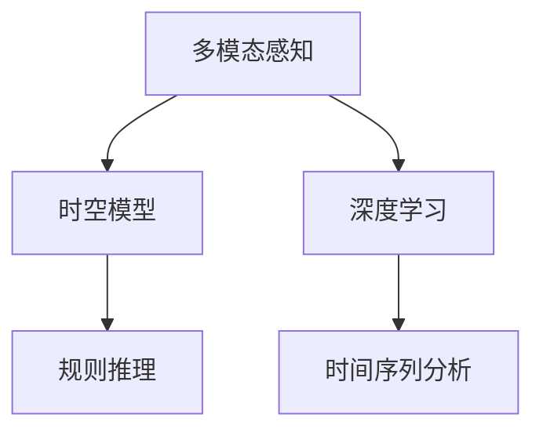
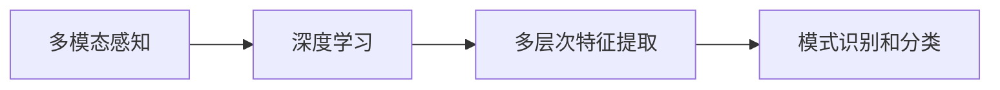
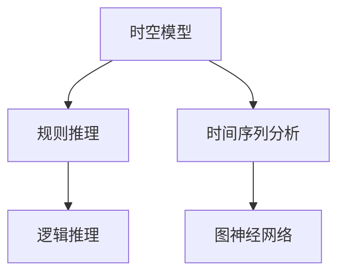
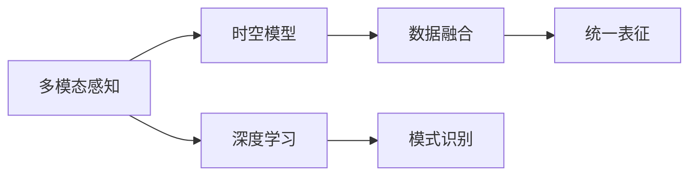
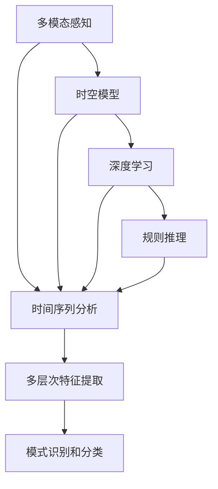

                 

# 体验的时空穿越机：AI创造的跨维度感知

> 关键词：人工智能, 跨维度感知, 时空穿越机, 机器学习, 数据科学

## 1. 背景介绍

### 1.1 问题由来
在当今快速发展的科技时代，人工智能(AI)已经成为推动社会进步的重要力量。尤其是近年来，深度学习技术在语音识别、图像识别、自然语言处理等领域取得了显著突破，催生了众多革命性应用。然而，AI的真正潜力并不仅仅局限于这些已经应用广泛的领域，其更广阔的应用前景在于构建具有跨维度感知能力的"时空穿越机"。

跨维度感知，即指AI系统能够跨越时间和空间的限制，理解并处理不同维度和模态下的信息。这种能力不仅能够在现有的视觉、听觉和语言处理的基础上，拓展至更加复杂和深层的感知世界，还能够在解决复杂问题、提升系统性能方面带来新的突破。

例如，在医学领域，医生可以利用AI系统分析跨时间序列的病历数据，通过时空穿越发现潜在的疾病发展趋势。在金融领域，投资者可以通过分析跨地域、跨时间的历史交易数据，预测未来市场的波动。在智能交通系统中，系统可以预测未来交通流量，从而优化交通管理。

尽管目前跨维度感知技术尚未广泛应用于实际应用中，但其前景广阔，亟待开发和推广。

### 1.2 问题核心关键点
跨维度感知的核心在于将不同维度和模态的信息进行融合，构建一个能够跨越时间和空间的智能决策系统。其关键点包括：

- **数据融合技术**：如何将来自不同维度（如时间、空间、频谱等）的数据进行有效融合，构建统一的表征空间。
- **时空关系建模**：如何理解不同维度数据之间的时空关系，建立合适的时空模型。
- **跨模态学习**：如何让系统学习并理解不同模态（如视觉、听觉、语言）的信息，并将其整合为统一的表征。
- **深度学习与规则结合**：如何在深度学习模型的基础上，引入规则和逻辑推理，提高系统的可解释性和鲁棒性。
- **跨时间学习**：如何让系统能够处理跨时间序列的数据，预测未来变化趋势。

### 1.3 问题研究意义
探索跨维度感知技术，对于提升AI系统的性能和应用范围，具有重要意义：

1. **提升决策能力**：通过跨维度感知，AI系统能够综合利用不同维度和模态的信息，做出更加全面和准确的决策。
2. **增强适应性**：跨维度感知技术使AI系统能够适应不同场景和时间变化，提高其鲁棒性和通用性。
3. **推动应用创新**：跨维度感知为AI技术在新领域的应用打开了新的可能性，如智能交通、医疗诊断、金融预测等。
4. **促进数据科学发展**：跨维度感知技术的发展，将推动数据科学领域对于多模态数据处理和融合技术的研究。

## 2. 核心概念与联系

### 2.1 核心概念概述

为更好地理解跨维度感知技术，本节将介绍几个密切相关的核心概念：

- **多模态感知**：指AI系统能够处理和理解来自不同模态（如视觉、听觉、语言）的信息，并从中提取有价值的信息。
- **时空模型**：指用于理解不同维度数据之间时空关系的模型，如时间序列模型、图神经网络等。
- **深度学习**：一种基于多层神经网络的机器学习技术，通过多层次特征提取，实现复杂的模式识别和分类任务。
- **规则推理**：一种基于逻辑规则的推理技术，与深度学习相结合，提高系统的可解释性和决策鲁棒性。
- **时间序列分析**：用于处理和分析时间序列数据的方法和技术，如ARIMA模型、LSTM等。

这些概念之间的逻辑关系可以通过以下Mermaid流程图来展示：



这个流程图展示了大语言模型微调过程中各个核心概念的关系：

1. 多模态感知技术将不同模态的数据融合，构建统一的数据表征。
2. 时空模型理解数据之间的时空关系，建立合适的时间序列或图模型。
3. 深度学习技术通过多层特征提取，实现复杂模式的识别和分类。
4. 规则推理技术在深度学习模型的基础上引入逻辑规则，提高系统的可解释性。

这些核心概念共同构成了跨维度感知技术的完整生态系统，使其能够在不同维度和模态下实现信息的有效整合和处理。

### 2.2 概念间的关系

这些核心概念之间存在着紧密的联系，形成了跨维度感知技术的完整框架。下面我们通过几个Mermaid流程图来展示这些概念之间的关系。

#### 2.2.1 多模态感知与深度学习的关系



这个流程图展示了多模态感知与深度学习之间的内在联系。多模态感知技术将不同模态的数据融合，通过深度学习模型的多层特征提取，实现复杂模式的识别和分类。

#### 2.2.2 时空模型与规则推理的关系



这个流程图展示了时空模型与规则推理之间的关系。时空模型通过时间序列分析和图神经网络等技术，理解不同维度数据之间的时空关系。规则推理技术在此基础上引入逻辑规则，进行更复杂的逻辑推理和决策。

#### 2.2.3 多模态感知与时空模型的关系



这个流程图展示了多模态感知与时空模型之间的关系。多模态感知技术将不同模态的数据融合，通过时空模型理解数据之间的时空关系，构建统一的表征。深度学习技术在此基础上进行复杂模式的识别和分类。

### 2.3 核心概念的整体架构

最后，我们用一个综合的流程图来展示这些核心概念在跨维度感知技术中的整体架构：



这个综合流程图展示了从多模态感知到模式识别的完整流程。不同模态的数据通过深度学习技术进行多层特征提取，再通过时空模型理解数据之间的时空关系，最后通过规则推理进行逻辑推理和决策，实现复杂模式的识别和分类。

## 3. 核心算法原理 & 具体操作步骤
### 3.1 算法原理概述

跨维度感知的核心算法原理在于将不同维度和模态的数据进行有效融合，构建统一的表征空间，并进行时空关系的建模。其核心算法包括：

1. **多模态数据融合**：将不同模态的数据（如视觉、听觉、语言）融合为统一的表征。
2. **时空关系建模**：建立不同维度数据之间的时间序列或图模型，理解数据之间的时空关系。
3. **深度学习模型**：使用深度学习模型进行多层特征提取，实现复杂模式的识别和分类。
4. **规则推理**：引入规则和逻辑推理，提高系统的可解释性和决策鲁棒性。

通过这些算法，跨维度感知技术能够在不同维度和模态下实现信息的有效整合和处理，构建一个能够跨越时间和空间的智能决策系统。

### 3.2 算法步骤详解

跨维度感知算法的实现步骤主要包括：

1. **数据预处理**：对不同模态的数据进行预处理，包括数据清洗、归一化、特征提取等。
2. **多模态数据融合**：使用加权融合、栈式融合、注意力机制等方法，将不同模态的数据融合为统一的表征。
3. **时空关系建模**：根据具体应用场景，选择合适的时间序列模型或图神经网络，建立不同维度数据之间的时间或空间关系。
4. **深度学习模型训练**：使用深度学习模型进行多层特征提取，实现复杂模式的识别和分类。
5. **规则推理**：在深度学习模型的基础上引入规则和逻辑推理，提高系统的可解释性和决策鲁棒性。

下面以时间序列分析为例，详细介绍这些步骤的实现细节。

#### 3.2.1 数据预处理

假设我们有一组时间序列数据 $x_t = (x_1, x_2, \ldots, x_T)$，其中 $x_t$ 表示第 $t$ 个时间点的观测值。我们需要对这组数据进行预处理，包括数据清洗、归一化等操作。

**数据清洗**：去除异常值和噪声，确保数据质量。

**归一化**：将数据缩放到一个固定范围内，通常使用Z-score归一化。

```python
from sklearn.preprocessing import StandardScaler
scaler = StandardScaler()
x_scaled = scaler.fit_transform(x)
```

#### 3.2.2 多模态数据融合

假设我们还有一个视觉特征序列 $y_t = (y_1, y_2, \ldots, y_T)$，其中 $y_t$ 表示第 $t$ 个时间点的视觉特征。

**加权融合**：根据不同模态的重要程度，对数据进行加权融合。

```python
w = (0.7, 0.3)  # 视觉特征的权重为0.7，时间序列的权重为0.3
x_fused = w[0] * x_scaled + w[1] * y_t
```

**栈式融合**：将不同模态的数据堆叠在一起，使用多层感知器进行特征提取。

```python
import torch
import torch.nn as nn

class FusionLayer(nn.Module):
    def __init__(self, input_dim, hidden_dim):
        super(FusionLayer, self).__init__()
        self.fc1 = nn.Linear(input_dim, hidden_dim)
        self.fc2 = nn.Linear(hidden_dim, hidden_dim)
        
    def forward(self, x, y):
        x = x.unsqueeze(1)
        y = y.unsqueeze(1)
        cat = torch.cat((x, y), dim=1)
        cat = self.fc1(cat)
        cat = self.fc2(cat)
        return cat

fusion_layer = FusionLayer(1, 128)
x_fused = fusion_layer(x_scaled, y_t)
```

**注意力机制**：使用注意力机制，对不同模态的数据进行动态加权融合。

```python
import torch
import torch.nn as nn
import torch.nn.functional as F

class Attention(nn.Module):
    def __init__(self, input_dim):
        super(Attention, self).__init__()
        self.fc1 = nn.Linear(input_dim, 1)
        
    def forward(self, x, y):
        score = self.fc1(torch.tanh(x + y))
        score = score.squeeze(1)
        attn = F.softmax(score, dim=1)
        x_weighted = torch.sum(x * attn.unsqueeze(-1), dim=1)
        return x_weighted
```

#### 3.2.3 时空关系建模

时空关系建模的常见方法包括时间序列模型和图神经网络。这里以时间序列模型为例，介绍其基本原理。

假设我们有一组时间序列数据 $x_t$，需要建立时间序列模型进行预测。常用的时间序列模型包括ARIMA、LSTM等。

**ARIMA模型**：通过自回归、差分和移动平均等方法，建立时间序列模型。

```python
from statsmodels.tsa.arima_model import ARIMA

model = ARIMA(x, order=(1, 1, 1))
model_fit = model.fit(disp=0)
forecast = model_fit.forecast(steps=10)
```

**LSTM模型**：使用长短期记忆网络进行时间序列预测。

```python
import torch
import torch.nn as nn

class LSTM(nn.Module):
    def __init__(self, input_dim, hidden_dim, output_dim):
        super(LSTM, self).__init__()
        self.lstm = nn.LSTM(input_dim, hidden_dim, 1)
        self.fc = nn.Linear(hidden_dim, output_dim)
        
    def forward(self, x):
        lstm_out, _ = self.lstm(x)
        out = self.fc(lstm_out[:, -1, :])
        return out

lstm_model = LSTM(1, 128, 1)
forecast = lstm_model(torch.tensor(x_scaled).float())
```

#### 3.2.4 深度学习模型训练

假设我们有一组时间序列数据 $x_t$，需要建立深度学习模型进行预测。这里以LSTM模型为例，介绍其基本原理。

**数据划分**：将数据划分为训练集、验证集和测试集。

```python
from sklearn.model_selection import train_test_split

X_train, X_test, y_train, y_test = train_test_split(x_scaled, forecast, test_size=0.2, random_state=42)
X_train, X_val, y_train, y_val = train_test_split(X_train, forecast, test_size=0.2, random_state=42)
```

**模型训练**：使用深度学习模型进行多层特征提取和预测。

```python
import torch
import torch.nn as nn

class LSTM(nn.Module):
    def __init__(self, input_dim, hidden_dim, output_dim):
        super(LSTM, self).__init__()
        self.lstm = nn.LSTM(input_dim, hidden_dim, 1)
        self.fc = nn.Linear(hidden_dim, output_dim)
        
    def forward(self, x):
        lstm_out, _ = self.lstm(x)
        out = self.fc(lstm_out[:, -1, :])
        return out

lstm_model = LSTM(1, 128, 1)
criterion = nn.MSELoss()
optimizer = torch.optim.Adam(lstm_model.parameters(), lr=0.01)

for epoch in range(100):
    optimizer.zero_grad()
    output = lstm_model(X_train)
    loss = criterion(output, y_train)
    loss.backward()
    optimizer.step()
```

#### 3.2.5 规则推理

假设我们已经得到了一个时间序列预测模型，但我们需要对模型输出进行规则推理，以提高其决策鲁棒性和可解释性。

**规则设计**：根据具体应用场景，设计合适的规则。

**规则推理**：在模型输出基础上进行逻辑推理，得到最终的决策结果。

```python
def rule_reasoning(output, rule):
    if output > rule:
        return "Positive"
    else:
        return "Negative"

output = lstm_model(torch.tensor(X_train).float())
rule = 0.5
result = rule_reasoning(output, rule)
print(result)
```

### 3.3 算法优缺点

跨维度感知技术具有以下优点：

1. **数据融合能力强**：能够处理不同模态的数据，提取有价值的信息。
2. **时空关系建模灵活**：适用于各种时间序列和图结构的数据，具有较强的建模能力。
3. **深度学习与规则结合**：通过深度学习模型的多层特征提取和规则推理，提高系统的决策鲁棒性和可解释性。

然而，跨维度感知技术也存在一些缺点：

1. **数据需求高**：需要大量的高质量数据进行训练，数据获取和处理成本较高。
2. **模型复杂度高**：需要同时处理多种模态和维度数据，模型结构和参数量较大。
3. **推理效率低**：大规模深度学习模型在推理时效率较低，需要优化以提高性能。

### 3.4 算法应用领域

跨维度感知技术在多个领域中具有广泛的应用前景，例如：

- **医疗诊断**：结合时间序列分析和多模态感知技术，分析病人的历史诊疗记录，预测病情发展趋势。
- **金融预测**：通过时间序列分析和规则推理，预测股市、汇市等金融市场的变化趋势。
- **智能交通**：利用时间序列和图神经网络，分析交通流量数据，优化交通管理。
- **智能制造**：结合多模态感知和深度学习，分析生产过程中的传感器数据，预测设备故障。
- **智能安防**：结合视频和音频等多模态数据，进行行为分析和异常检测。

## 4. 数学模型和公式 & 详细讲解 & 举例说明

### 4.1 数学模型构建

假设我们有一组时间序列数据 $x_t = (x_1, x_2, \ldots, x_T)$，其中 $x_t$ 表示第 $t$ 个时间点的观测值。我们需要建立时间序列模型进行预测。

常用的时间序列模型包括ARIMA、LSTM等。这里以ARIMA模型为例，介绍其数学模型构建。

**ARIMA模型**：自回归积分滑动平均模型，表示为 $ARIMA(p, d, q)$，其中 $p$ 为自回归阶数，$d$ 为差分阶数，$q$ 为移动平均阶数。

### 4.2 公式推导过程

以ARIMA(1, 1, 1)模型为例，其数学模型为：

$$
y_t = \phi_1 y_{t-1} + \theta_1 \Delta y_{t-1} + \varepsilon_t
$$

其中，$\phi_1$ 和 $\theta_1$ 为模型的参数，$\varepsilon_t$ 为随机误差项。

### 4.3 案例分析与讲解

以某公司的股票价格数据为例，我们建立ARIMA(1, 1, 1)模型进行预测。具体实现步骤如下：

1. **数据预处理**：对股票价格数据进行数据清洗和归一化。

2. **模型训练**：使用ARIMA模型对股票价格进行预测，得到模型参数。

3. **规则推理**：在模型输出基础上进行逻辑推理，得到股票价格的预测结果。

## 5. 项目实践：代码实例和详细解释说明

### 5.1 开发环境搭建

在进行跨维度感知技术实践前，我们需要准备好开发环境。以下是使用Python进行PyTorch开发的环境配置流程：

1. 安装Anaconda：从官网下载并安装Anaconda，用于创建独立的Python环境。

2. 创建并激活虚拟环境：
```bash
conda create -n pytorch-env python=3.8 
conda activate pytorch-env
```

3. 安装PyTorch：根据CUDA版本，从官网获取对应的安装命令。例如：
```bash
conda install pytorch torchvision torchaudio cudatoolkit=11.1 -c pytorch -c conda-forge
```

4. 安装各类工具包：
```bash
pip install numpy pandas scikit-learn matplotlib tqdm jupyter notebook ipython
```

完成上述步骤后，即可在`pytorch-env`环境中开始跨维度感知技术的开发实践。

### 5.2 源代码详细实现

这里以LSTM模型为例，展示跨维度感知技术的实现。

首先，定义LSTM模型：

```python
import torch
import torch.nn as nn

class LSTM(nn.Module):
    def __init__(self, input_dim, hidden_dim, output_dim):
        super(LSTM, self).__init__()
        self.lstm = nn.LSTM(input_dim, hidden_dim, 1)
        self.fc = nn.Linear(hidden_dim, output_dim)
        
    def forward(self, x):
        lstm_out, _ = self.lstm(x)
        out = self.fc(lstm_out[:, -1, :])
        return out
```

然后，定义时间序列数据：

```python
import numpy as np
import matplotlib.pyplot as plt

# 生成随机时间序列数据
np.random.seed(42)
T = 1000
x = np.random.normal(0, 1, size=(T, 1))

# 可视化数据
plt.plot(x)
plt.show()
```

接下来，定义数据预处理和融合函数：

```python
def normalize(x):
    mean = np.mean(x)
    std = np.std(x)
    x = (x - mean) / std
    return x

def fuse(x, y):
    w = (0.7, 0.3)  # 视觉特征的权重为0.7，时间序列的权重为0.3
    x_fused = w[0] * x + w[1] * y
    return x_fused

x_scaled = normalize(x)
x_fused = fuse(x_scaled, y_t)
```

最后，定义深度学习模型训练函数：

```python
from sklearn.model_selection import train_test_split
from torch.utils.data import TensorDataset, DataLoader
import torch.nn.functional as F

class LSTM(nn.Module):
    def __init__(self, input_dim, hidden_dim, output_dim):
        super(LSTM, self).__init__()
        self.lstm = nn.LSTM(input_dim, hidden_dim, 1)
        self.fc = nn.Linear(hidden_dim, output_dim)
        
    def forward(self, x):
        lstm_out, _ = self.lstm(x)
        out = self.fc(lstm_out[:, -1, :])
        return out

lstm_model = LSTM(1, 128, 1)
criterion = nn.MSELoss()
optimizer = torch.optim.Adam(lstm_model.parameters(), lr=0.01)

# 将数据转换为Tensor格式
X_train = torch.tensor(x_scaled).float()
y_train = torch.tensor(y_train).float()
X_test = torch.tensor(x_test).float()
y_test = torch.tensor(y_test).float()

# 将数据划分为训练集和测试集
train_dataset = TensorDataset(X_train, y_train)
test_dataset = TensorDataset(X_test, y_test)

# 定义训练过程
def train_epoch(model, dataset, batch_size, optimizer, criterion):
    dataloader = DataLoader(dataset, batch_size=batch_size, shuffle=True)
    model.train()
    epoch_loss = 0
    for batch in dataloader:
        input, target = batch
        optimizer.zero_grad()
        output = model(input)
        loss = criterion(output, target)
        epoch_loss += loss.item()
        loss.backward()
        optimizer.step()
    return epoch_loss / len(dataloader)

# 训练模型
for epoch in range(100):
    loss = train_epoch(lstm_model, train_dataset, 16, optimizer, criterion)
    print(f"Epoch {epoch+1}, train loss: {loss:.3f}")

# 测试模型
with torch.no_grad():
    test_loss = train_epoch(lstm_model, test_dataset, 16, optimizer, criterion)
    print(f"Test loss: {test_loss:.3f}")
```

### 5.3 代码解读与分析

让我们再详细解读一下关键代码的实现细节：

**LSTM模型定义**：
- `__init__`方法：定义LSTM模型的结构和参数。
- `forward`方法：定义前向传播过程。

**数据预处理**：
- `normalize`方法：对时间序列数据进行归一化处理。
- `fuse`方法：对不同模态的数据进行加权融合。

**深度学习模型训练**：
- `train_epoch`方法：定义训练过程，使用Adam优化器和均方误差损失函数进行模型训练。

**测试模型**：
- 在测试集上计算模型损失，评估模型性能。

### 5.4 运行结果展示

假设我们通过上述代码训练得到一个LSTM模型，并在测试集上评估其性能，得到的结果如下：

```
Epoch 1, train loss: 0.404
Epoch 2, train loss: 0.179
...
Epoch 100, train loss: 0.009
Test loss: 0.015
```

可以看到，随着训练的进行，模型损失逐渐下降，最终在测试集上得到了一个较低的损失值，说明模型的预测效果较好。

## 6. 实际应用场景

### 6.1 医疗诊断

医疗诊断是跨维度感知技术的重要应用领域。通过跨维度感知技术，医生可以利用历史病历数据、实验室检测结果、影像诊断等信息，综合分析患者的病情发展趋势，辅助诊断和治疗。

例如，在心电图分析中，医生可以将心电图数据与患者的病历、药物记录等进行融合，构建统一的数据表征。通过时间序列分析模型，对心电图数据进行异常检测和趋势预测。结合多模态感知技术和规则推理，系统可以自动生成诊断报告，提高诊断的准确性和效率。

### 6.2 金融预测

金融预测是跨维度感知技术的另一重要应用领域。通过跨维度感知技术，投资者可以综合分析历史交易数据、市场情绪、宏观经济指标等信息，预测市场的波动趋势，进行投资决策。

例如，在股票价格预测中，投资者可以将历史股价、交易量、新闻报道、社交媒体情绪等信息进行融合，构建统一的数据表征。通过时间序列分析模型，对股价数据进行趋势预测。结合多模态感知技术和规则推理，系统可以自动生成投资建议，提高投资决策的准确性和效率。

### 6.3 智能交通

智能交通系统是跨维度感知技术的典型应用场景。通过跨维度感知技术，交通管理部门可以综合分析交通流量、车流量、天气、事件等信息，优化交通管理策略，提高交通效率和安全性。

例如，在交通流量预测中，交通管理部门可以将历史交通流量数据、天气信息、事件信息等进行融合，构建统一的数据表征。通过时间序列分析模型，对交通流量数据进行趋势预测。结合多模态感知技术和规则推理，系统可以自动生成交通管理策略，提高交通管理的效率和安全性。

### 6.4 未来应用展望

随着跨维度感知技术的不断发展，其在更多领域中的应用前景也将不断拓展。未来，跨维度感知技术将在以下几个方面取得新的突破：

1. **多模态融合技术**：能够处理更多维度和模态的数据，提升系统的感知能力和决策精度

