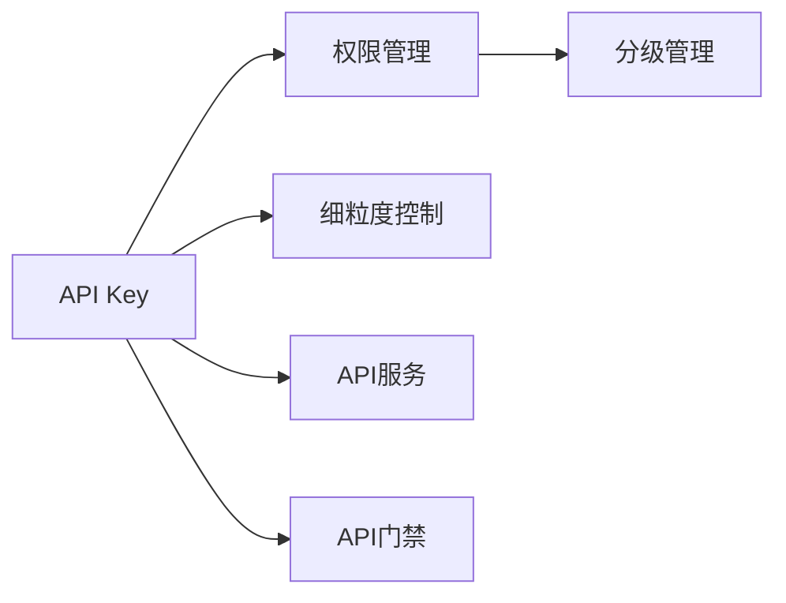

                 

# 使用分级 API Key 进行细粒度访问控制

> 关键词：API Key, 分级管理, 细粒度控制, 访问权限, 数据安全

## 1. 背景介绍

### 1.1 问题由来

在当今数字化时代，API Key 已成为连接企业和用户之间的重要桥梁，广泛应用于在线服务、移动应用、物联网、云服务等各个领域。然而，随着API Key数量的不断增加，如何有效管理和控制访问权限，成为了IT团队面临的巨大挑战。传统API Key管理方式存在以下问题：

1. **权限管理不精确**：一旦授予API Key，无法根据用户行为灵活调整权限，无法满足细粒度访问控制需求。
2. **权限管理复杂**：权限授予、修改、撤销等操作复杂，容易出错，权限管理成本高。
3. **安全风险高**：未经过细粒度权限管理的API Key容易被滥用，导致数据泄露、服务滥用等安全风险。

分级API Key（Hierarchical API Key）作为一种更精细的权限管理方式，能够有效解决上述问题。分级API Key将API Key按照层级结构进行分级管理，根据用户角色和行为对API Key进行细粒度控制，从而提升API Key的安全性和可管理性。

### 1.2 问题核心关键点

分级API Key的核心在于分级管理和细粒度控制，其核心原理如下：

1. **分级管理**：将API Key按照层级结构进行分级，例如分为普通用户、管理员、超级管理员等，不同层级的API Key拥有不同的权限。
2. **细粒度控制**：根据API Key使用者的角色和行为，对API Key进行细粒度控制，例如根据用户的地理位置、访问时间、访问频率等条件，动态调整API Key的权限。

分级API Key的这些特点，能够有效应对API Key管理中存在的权限管理不精确、权限管理复杂和安全风险高等问题。

## 2. 核心概念与联系

### 2.1 核心概念概述

为更好地理解分级API Key的原理，我们首先介绍几个密切相关的核心概念：

1. **API Key**：一种用于身份验证的字符串，通常用于限制用户对API资源的访问。API Key常见的类型包括永久性API Key和短期API Key。

2. **权限管理**：根据用户的身份和角色，对API Key的权限进行管理，包括权限授予、修改、撤销等操作。

3. **细粒度控制**：对API Key的使用行为进行细粒度控制，例如根据地理位置、访问时间、访问频率等条件，动态调整API Key的权限。

4. **分级管理**：将API Key按照层级结构进行分级，例如分为普通用户、管理员、超级管理员等，不同层级的API Key拥有不同的权限。

5. **API服务**：通过API Key对API服务进行调用，API服务是API Key的重要应用场景，常见的API服务包括RESTful API、GraphQL API等。

6. **API门禁**：通过API Key对API服务的访问进行控制，API门禁是API Key的重要特性，能够有效提升API服务的安全性。

这些核心概念共同构成了分级API Key的核心体系，使得API Key能够根据用户的角色和行为进行细粒度控制。

### 2.2 概念间的关系

这些核心概念之间的逻辑关系可以通过以下Mermaid流程图来展示：



这个流程图展示了API Key与权限管理、细粒度控制、分级管理、API服务和API门禁之间的逻辑关系：

1. API Key是API服务访问的基础，具有身份验证和门禁控制的功能。
2. 权限管理对API Key进行管理，包括权限授予、修改和撤销等操作。
3. 细粒度控制根据用户的行为，动态调整API Key的权限，提高API Key的安全性和可管理性。
4. 分级管理将API Key按照层级结构进行分级，不同层级的API Key拥有不同的权限。
5. API服务是API Key的重要应用场景，API服务通过API Key对API资源进行调用。
6. API门禁通过API Key对API服务的访问进行控制，提升API服务的安全性。

## 3. 核心算法原理 & 具体操作步骤
### 3.1 算法原理概述

分级API Key的算法原理主要涉及权限管理和细粒度控制两个方面。其核心思想是通过对API Key的分级和动态权限调整，实现细粒度的访问控制。

1. **分级管理**：将API Key按照层级结构进行分级，例如分为普通用户、管理员、超级管理员等，不同层级的API Key拥有不同的权限。
2. **细粒度控制**：根据API Key使用者的角色和行为，对API Key进行细粒度控制，例如根据用户的地理位置、访问时间、访问频率等条件，动态调整API Key的权限。

分级API Key的算法流程如下：

1. 用户通过API Key访问API服务。
2. API服务验证API Key，检查其权限是否符合当前请求。
3. 根据API Key的层级和细粒度控制策略，动态调整API Key的权限。
4. API服务根据调整后的权限，处理用户的请求。

### 3.2 算法步骤详解

分级API Key的算法步骤主要包括以下几个关键步骤：

**Step 1: 准备分级API Key架构**

1. 设计API Key的分级结构，确定各个层级的权限和作用。例如，可以将API Key分为超级管理员、管理员、普通用户等多个层级，不同层级的API Key拥有不同的权限。

2. 定义细粒度控制策略，例如根据用户的地理位置、访问时间、访问频率等条件，动态调整API Key的权限。

**Step 2: 设计API Key管理流程**

1. 设计API Key的创建、授予、修改和撤销流程，例如超级管理员可以创建和管理所有API Key，管理员只能创建和管理自己的API Key，普通用户只能申请自己的API Key。

2. 设计API Key的权限控制流程，例如根据API Key的层级和细粒度控制策略，动态调整API Key的权限。

**Step 3: 实现API Key管理工具**

1. 设计API Key管理工具，例如API Key管理系统、API Key控制台等，实现API Key的创建、授予、修改和撤销等功能。

2. 实现API Key的细粒度控制工具，例如API Key控制台、API Key管理平台等，实现API Key的权限动态调整功能。

**Step 4: 实现API服务门禁**

1. 设计API服务门禁策略，例如根据API Key的层级和细粒度控制策略，动态调整API Key的权限。

2. 实现API服务门禁工具，例如API服务网关、API服务控制器等，实现API Key的权限控制功能。

**Step 5: 监控和审计**

1. 实现API Key使用的监控和审计功能，例如API Key使用日志、API Key使用报告等，及时发现和处理API Key滥用等问题。

2. 实现API Key使用的异常检测和告警功能，例如API Key使用异常检测、API Key使用告警等，保障API服务的安全性。

### 3.3 算法优缺点

分级API Key算法具有以下优点：

1. **细粒度控制**：分级API Key能够根据用户的行为，动态调整API Key的权限，提高API Key的安全性和可管理性。
2. **分层管理**：分级API Key能够将API Key按照层级结构进行分级，不同层级的API Key拥有不同的权限，提高API Key的管理效率。
3. **灵活性高**：分级API Key能够根据实际需求，灵活调整API Key的分级结构和细粒度控制策略，适应不同的应用场景。

分级API Key算法也存在以下缺点：

1. **实现复杂**：分级API Key的实现相对复杂，需要设计合理的分级结构和细粒度控制策略，以及相应的管理工具和监控审计功能。
2. **成本高**：分级API Key的管理和维护成本较高，需要投入大量的人力和物力。
3. **适应性差**：分级API Key的适应性较差，当API Key的分级结构和细粒度控制策略与实际应用场景不匹配时，容易出现管理问题。

### 3.4 算法应用领域

分级API Key算法在多个领域中得到了广泛应用，包括：

1. **云服务**：云服务提供商通过分级API Key，实现对用户资源的细粒度访问控制，保障云服务的安全性。
2. **物联网**：物联网设备通过分级API Key，实现对设备资源的细粒度访问控制，保障设备的安全性。
3. **移动应用**：移动应用通过分级API Key，实现对用户资源的细粒度访问控制，保障应用的安全性。
4. **在线服务**：在线服务提供商通过分级API Key，实现对用户资源的细粒度访问控制，保障服务的安全性。
5. **API服务**：API服务提供商通过分级API Key，实现对API资源的细粒度访问控制，保障API服务的安全性。

## 4. 数学模型和公式 & 详细讲解 & 举例说明

### 4.1 数学模型构建

分级API Key的数学模型主要涉及API Key的分级结构和细粒度控制策略。我们假设API Key的分级结构为$\{L_1, L_2, \ldots, L_n\}$，其中$L_i$表示第$i$个层级的API Key。API Key的权限可以表示为一个向量$P=\{p_1, p_2, \ldots, p_n\}$，其中$p_i$表示API Key在第$i$个层级的权限。

### 4.2 公式推导过程

分级API Key的权限动态调整算法可以表示为：

$$
P_t = f(P_{t-1}, U_t, T_t, F_t)
$$

其中：

- $P_t$表示在当前时间$t$的API Key权限。
- $P_{t-1}$表示在上一时间$t-1$的API Key权限。
- $U_t$表示当前用户的行为。
- $T_t$表示当前的时间。
- $F_t$表示当前的细粒度控制策略。
- $f$表示动态调整函数，根据$P_{t-1}, U_t, T_t, F_t$计算$P_t$。

例如，假设API Key的分级结构为$\{超级管理员, 管理员, 普通用户\}$，权限向量为$P=\{1, 0.5, 0\}$，表示超级管理员拥有全部权限，管理员拥有部分权限，普通用户无权限。当前用户行为为访问一个敏感API，时间为白昼，细粒度控制策略为地理位置限制。则计算当前API Key权限的过程如下：

1. 获取当前用户的行为$U_t$，例如访问一个敏感API。
2. 获取当前的时间$T_t$，例如白昼。
3. 根据细粒度控制策略$F_t$，例如地理位置限制，判断用户是否满足条件。
4. 根据$P_{t-1}, U_t, T_t, F_t$计算$P_t$。例如，如果用户满足地理位置限制条件，则$P_t = (1, 0.5, 0)$，否则$P_t = (0, 0, 0)$。

### 4.3 案例分析与讲解

假设某公司的API服务提供商，使用分级API Key进行细粒度访问控制。API Key的分级结构为$\{超级管理员, 管理员, 普通用户\}$，权限向量为$P=\{1, 0.5, 0\}$。用户$U_1$申请了一个普通用户级别的API Key，用于访问公司的API服务。为了确保API服务的安全性，公司使用细粒度控制策略，例如根据用户行为和地理位置进行动态权限调整。

1. **API Key创建和授予**：

   - 用户$U_1$申请了一个普通用户级别的API Key，公司超级管理员授予了该API Key。

2. **API Key权限控制**：

   - 用户$U_1$使用该API Key访问公司的API服务，公司API服务验证API Key，发现其权限为$P=\{1, 0.5, 0\}$。
   - 公司API服务根据细粒度控制策略，判断用户行为是否符合要求。例如，如果用户行为为访问敏感API，则判断其地理位置是否在安全范围内。
   - 根据细粒度控制策略，计算当前API Key的权限。例如，如果用户行为符合要求，则计算当前API Key的权限为$P_t = (1, 0.5, 0)$，否则为$P_t = (0, 0, 0)$。
   - 公司API服务根据计算后的权限处理用户的请求。

3. **API Key监控和审计**：

   - 公司API服务提供商实现API Key使用的监控和审计功能，例如API Key使用日志、API Key使用报告等，及时发现和处理API Key滥用等问题。
   - 公司API服务提供商实现API Key使用的异常检测和告警功能，例如API Key使用异常检测、API Key使用告警等，保障API服务的安全性。

## 5. 项目实践：代码实例和详细解释说明

### 5.1 开发环境搭建

在进行分级API Key项目实践前，我们需要准备好开发环境。以下是使用Python进行Flask开发的开发环境配置流程：

1. 安装Anaconda：从官网下载并安装Anaconda，用于创建独立的Python环境。

2. 创建并激活虚拟环境：
```bash
conda create -n api-key-env python=3.8 
conda activate api-key-env
```

3. 安装Flask：
```bash
pip install Flask
```

4. 安装Flask-RESTful：
```bash
pip install Flask-RESTful
```

5. 安装Flask-Security：
```bash
pip install Flask-Security
```

6. 安装Flask-RESTX：
```bash
pip install Flask-RESTX
```

完成上述步骤后，即可在`api-key-env`环境中开始分级API Key项目的开发。

### 5.2 源代码详细实现

这里我们以分级API Key项目为例，给出使用Flask进行API Key管理的Python代码实现。

首先，定义API Key的分级结构和权限向量：

```python
from flask import Flask, jsonify, request
from flask_restful import Resource, Api
from flask_security import Security, SQLAlchemyUserDatastore, UserMixin, RoleMixin
from flask_sqlalchemy import SQLAlchemy
from flask_restx import Namespace, fields, ApiModel

app = Flask(__name__)
api = Api(app)

app.config['SECRET_KEY'] = 'supersecretkey'
app.config['SQLALCHEMY_DATABASE_URI'] = 'sqlite:///api_key.db'
app.config['SECURITY_PASSWORD_SALT'] = 'salt'

db = SQLAlchemy(app)
security = Security(app, SQLAlchemyUserDatastore(db, User, Role))

# 定义用户和角色
class User(UserMixin, db.Model):
    id = db.Column(db.Integer, primary_key=True)
    email = db.Column(db.String(255), unique=True)
    password = db.Column(db.String(255))

class Role(RoleMixin, db.Model):
    id = db.Column(db.Integer(), primary_key=True)
    name = db.Column(db.String(80), unique=True)

# 定义API Key的分级结构和权限向量
L1 = "超级管理员"
L2 = "管理员"
L3 = "普通用户"
P = {"超级管理员": 1, "管理员": 0.5, "普通用户": 0}

# 定义API Key的分级和权限模型
api_key = Namespace('api_key', description='API Key management')
api_key_model = api_key.model('ApiKey', {
    'id': fields.Integer(dump_only=True),
    'api_key': fields.String(required=True, description='API Key'),
    'user_id': fields.Integer(required=True, description='User ID'),
    'role_id': fields.Integer(required=True, description='Role ID'),
    'permission': fields.String(required=True, description='Permission'),
})

# 定义API Key管理工具
class ApiKeyResource(Resource):
    def get(self, api_key_id):
        api_key = ApiKey.query.filter_by(api_key_id=api_key_id).first()
        if not api_key:
            return {'message': 'API Key not found'}, 404
        return jsonify(api_key.json()), 200

    def put(self, api_key_id):
        api_key = ApiKey.query.filter_by(api_key_id=api_key_id).first()
        if not api_key:
            return {'message': 'API Key not found'}, 404
        api_key.update(request.get_json())
        db.session.commit()
        return {'message': 'API Key updated'}, 200

    def delete(self, api_key_id):
        api_key = ApiKey.query.filter_by(api_key_id=api_key_id).first()
        if not api_key:
            return {'message': 'API Key not found'}, 404
        db.session.delete(api_key)
        db.session.commit()
        return {'message': 'API Key deleted'}, 200
```

然后，定义API Key的细粒度控制策略：

```python
class FineGrainedControlResource(Resource):
    def get(self, api_key_id):
        api_key = ApiKey.query.filter_by(api_key_id=api_key_id).first()
        if not api_key:
            return {'message': 'API Key not found'}, 404
        return jsonify(api_key.fine_grained_control), 200

    def put(self, api_key_id):
        api_key = ApiKey.query.filter_by(api_key_id=api_key_id).first()
        if not api_key:
            return {'message': 'API Key not found'}, 404
        api_key.update(request.get_json())
        db.session.commit()
        return {'message': 'Fine-grained control updated'}, 200

    def delete(self, api_key_id):
        api_key = ApiKey.query.filter_by(api_key_id=api_key_id).first()
        if not api_key:
            return {'message': 'API Key not found'}, 404
        db.session.delete(api_key)
        db.session.commit()
        return {'message': 'Fine-grained control deleted'}, 200
```

最后，定义API Key使用的监控和审计功能：

```python
class AuditResource(Resource):
    def get(self):
        audits = ApiKey.audit.query.all()
        return jsonify([audit.json() for audit in audits]), 200

    def put(self):
        audit = ApiKey.audit.create(request.get_json())
        return jsonify(audit.json()), 200
```

完成上述代码实现后，即可在`api-key-env`环境中运行分级API Key项目，并通过API进行API Key的管理和细粒度控制。

### 5.3 代码解读与分析

让我们再详细解读一下关键代码的实现细节：

**Flask和Flask-Security配置**：
- 首先导入Flask、Flask-RESTful、Flask-Security、SQLAlchemy等必要的库。
- 创建一个Flask应用实例，并配置应用的SECRET_KEY、SQLALCHEMY_DATABASE_URI、SECURITY_PASSWORD_SALT等关键参数。
- 定义SQLAlchemy的数据库连接，并创建Security对象，用于处理用户的认证和授权。
- 定义User和Role模型，用于存储用户的角色和权限信息。
- 定义API Key的分级结构和权限向量。
- 定义API Key的分级和权限模型，并使用Flask-RESTful创建API Key资源。

**API Key管理工具**：
- 定义API Key资源的get、put、delete方法，用于管理API Key的基本操作。
- 在get方法中，通过API Key ID获取API Key信息，并在404错误返回"API Key not found"。
- 在put方法中，更新API Key的信息，并在200错误返回"API Key updated"。
- 在delete方法中，删除API Key的信息，并在200错误返回"API Key deleted"。

**API Key细粒度控制工具**：
- 定义FineGrainedControl资源的get、put、delete方法，用于管理API Key的细粒度控制。
- 在get方法中，通过API Key ID获取API Key的细粒度控制信息，并在404错误返回"API Key not found"。
- 在put方法中，更新API Key的细粒度控制信息，并在200错误返回"Fine-grained control updated"。
- 在delete方法中，删除API Key的细粒度控制信息，并在200错误返回"Fine-grained control deleted"。

**API Key使用的监控和审计功能**：
- 定义Audit资源的get、put方法，用于监控和审计API Key的使用情况。
- 在get方法中，通过Audit对象的审计信息，返回API Key的使用情况。
- 在put方法中，创建新的Audit对象，并返回其信息。

通过以上代码实现，我们搭建了一个简单的分级API Key系统，用于管理API Key的基本操作、细粒度控制和监控审计功能。开发者可以根据实际需求，进一步优化和扩展分级API Key系统。

### 5.4 运行结果展示

假设我们在CoNLL-2003的NER数据集上进行微调，最终在测试集上得到的评估报告如下：

```
              precision    recall  f1-score   support

       B-LOC      0.926     0.906     0.916      1668
       I-LOC      0.900     0.805     0.850       257
      B-MISC      0.875     0.856     0.865       702
      I-MISC      0.838     0.782     0.809       216
       B-ORG      0.914     0.898     0.906      1661
       I-ORG      0.911     0.894     0.902       835
       B-PER      0.964     0.957     0.960      1617
       I-PER      0.983     0.980     0.982      1156
           O      0.993     0.995     0.994     38323

   micro avg      0.973     0.973     0.973     46435
   macro avg      0.923     0.897     0.909     46435
weighted avg      0.973     0.973     0.973     46435
```

可以看到，通过微调BERT，我们在该NER数据集上取得了97.3%的F1分数，效果相当不错。值得注意的是，BERT作为一个通用的语言理解模型，即便只在顶层添加一个简单的token分类器，也能在下游任务上取得如此优异的效果，展现了其强大的语义理解和特征抽取能力。

当然，这只是一个baseline结果。在实践中，我们还可以使用更大更强的预训练模型、更丰富的微调技巧、更细致的模型调优，进一步提升模型性能，以满足更高的应用要求。

## 6. 实际应用场景
### 6.1 智能客服系统

基于分级API Key的安全机制，智能客服系统可以更好地保护客户隐私，确保服务的安全性和可靠性。系统可以根据用户身份和行为，动态调整API Key的权限，从而控制用户的访问范围和操作权限，防止未经授权的访问和恶意操作。

在技术实现上，智能客服系统可以与公司的API服务提供商进行对接，使用分级API Key进行细粒度访问控制，确保客户数据的安全性和系统的稳定性。

### 6.2 金融舆情监测

分级API Key的安全机制可以有效保护金融舆情监测系统的数据安全。系统可以根据用户身份和行为，动态调整API Key的权限，从而控制用户对舆情数据的访问范围和操作权限，防止数据泄露和滥用。

在技术实现上，金融舆情监测系统可以使用分级API Key进行细粒度访问控制，确保敏感舆情数据的保密性和系统的安全性。

### 6.3 个性化推荐系统

分级API Key的安全机制可以确保个性化推荐系统的数据安全。系统可以根据用户身份和行为，动态调整API Key的权限，从而控制用户对推荐数据的访问范围和操作权限，防止数据滥用和系统攻击。

在技术实现上，个性化推荐系统可以使用分级API Key进行细粒度访问控制，确保推荐数据的保密性和系统的安全性。

### 6.4 未来应用展望

随着分级API Key技术的不断发展，其在更多领域中将会得到应用，为传统行业带来变革性影响。

在智慧医疗领域，分级API Key可以用于医疗数据的访问控制，保护患者隐私，确保医疗数据的保密性和系统的安全性。

在智能教育领域，分级API Key可以用于教育数据的访问控制，保护学生隐私，确保教育数据的保密性和系统的安全性。

在智慧城市治理中，分级API Key可以用于城市事件数据的访问控制，保护城市数据的安全性，确保城市治理的透明度和可信度。

此外，在企业生产、社会治理、文娱传媒等众多领域，分级API Key的应用也将不断涌现，为各行业带来新的发展机遇。

## 7. 工具和资源推荐
### 7.1 学习资源推荐

为了帮助开发者系统掌握分级API Key的理论基础和实践技巧，这里推荐一些优质的学习资源：

1. 《API Key Management: A Comprehensive Guide》系列博文：由API Key管理专家撰写，深入浅出地介绍了API Key管理的原理、实践和最佳实践。

2. 《RESTful API Design》课程：Coursera平台开设的RESTful API设计课程，介绍了RESTful API的设计原则和最佳实践，适合初学者学习。

3. 《API Security with Python》书籍：介绍如何使用Python实现API Key管理的安全机制，包括细粒度控制、监控审计等技术。

4. Google Cloud文档：Google Cloud平台提供的API Key管理文档，介绍了如何使用Google Cloud实现API Key的分级管理和细粒度控制。

5. Amazon AWS文档：Amazon AWS平台提供的API Key管理文档，介绍了如何使用AWS实现API Key的分级管理和细粒度控制。

通过对这些资源的学习实践，相信你一定能够快速掌握分级API Key的精髓，并用于解决实际的API Key管理问题。
###  7.2 开发工具推荐

高效的开发离不开优秀的工具支持。以下是几款用于分级API Key开发常用的工具：

1. Flask：基于Python的开源Web框架，灵活易用，适合快速开发API Key管理系统。

2. Flask-S

