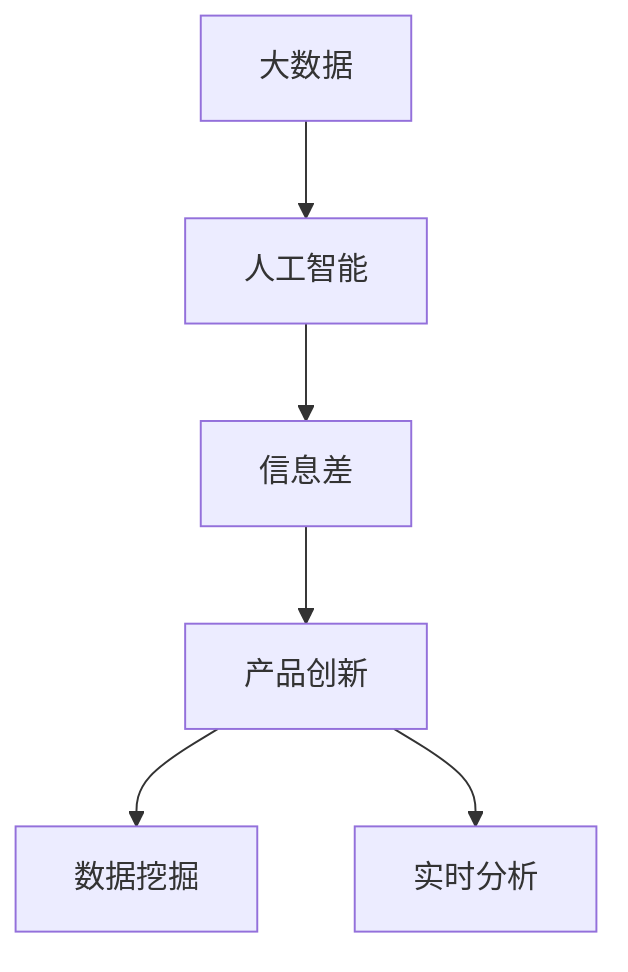
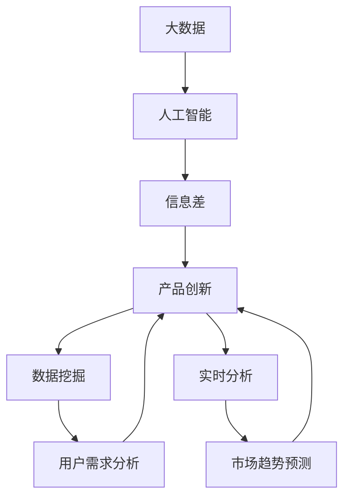

                 

# 信息差的产品创新驱动力：大数据如何推动产品创新

## 1. 背景介绍

### 1.1 问题由来
在快速变化的商业环境中，产品创新已成为企业保持竞争力的核心要素。而随着大数据和人工智能技术的不断发展，信息差的概念逐渐受到重视，成为了推动产品创新的关键驱动力。信息差，简言之，就是同一信息在掌握者与非掌握者之间的差异，以及这种差异给市场、用户带来的价值差异。利用大数据和AI技术，企业能够挖掘信息差，实现差异化的产品创新，从而在竞争中占据优势。

### 1.2 问题核心关键点
1. **信息差定义**：信息差是指同一信息在不同用户、不同渠道、不同时间点的差异。这种差异可以是信息的不对称、理解的不同、需求的多样等。
2. **数据驱动**：大数据技术为识别和分析信息差提供了强有力的支持。通过对海量数据的收集、分析和挖掘，企业可以准确识别信息差，并据此进行产品创新。
3. **产品创新**：基于信息差的产品创新，旨在满足特定用户群体的独特需求，提供差异化的产品和服务，从而在市场上获得竞争优势。
4. **智能分析**：人工智能技术，特别是机器学习、深度学习等算法，能够对复杂数据进行深度挖掘，发现隐含的关联和模式，进一步提升信息差的利用效率。
5. **实时反馈**：通过持续的数据收集和分析，企业能够实现产品创新的实时反馈和优化，确保产品始终与市场需求保持同步。

### 1.3 问题研究意义
1. **降低成本**：利用大数据和AI技术，可以显著降低产品创新过程中对传统市场调研、产品测试等环节的依赖，节省时间和成本。
2. **提升效率**：智能分析能力使得产品创新的过程更加高效，可以更快地响应市场需求，缩短产品迭代周期。
3. **增强竞争力**：通过差异化的产品创新，企业能够在竞争中脱颖而出，形成独特的市场定位和品牌价值。
4. **个性化服务**：基于信息差的产品创新，可以更好地满足用户的个性化需求，提升用户满意度和忠诚度。
5. **促进创新文化**：信息差驱动的产品创新，有助于构建企业内部的创新文化，推动持续的产品迭代和技术进步。

## 2. 核心概念与联系

### 2.1 核心概念概述

为了更好地理解信息差在产品创新中的作用，本节将介绍几个密切相关的核心概念：

- **大数据**：指的是通过高速的数据生成、收集、存储、管理和分析等技术，处理和利用规模巨大、形式多样、实时变化的数据集合。大数据的核心在于其体量、多样性和实时性。
- **人工智能**：利用计算机算法和模型，使机器具备类似于人类的智能行为，包括学习、推理、决策等能力。人工智能技术，如机器学习、深度学习、自然语言处理等，在大数据基础上，可以进行高效的数据分析和模式识别。
- **信息差**：指同一信息在不同用户、不同渠道、不同时间点之间的差异。这种差异可以是信息的不对称、理解的不同、需求的多样等。
- **产品创新**：通过分析用户需求、市场趋势、技术进步等多方面信息，创造具有差异化特点的产品或服务，以满足特定用户群体的需求，获得市场竞争优势。
- **数据挖掘**：从大规模数据中自动发现有用信息、知识或模式的过程，是信息差分析的重要手段。
- **实时分析**：在数据产生的同时进行分析和处理，以获取最及时和准确的决策支持，有助于产品创新的快速迭代和优化。

这些核心概念之间存在着紧密的联系，形成了信息差驱动产品创新的完整生态系统。

### 2.2 概念间的关系

这些核心概念之间的逻辑关系可以通过以下Mermaid流程图来展示：



这个流程图展示了大数据、人工智能、信息差和产品创新之间的逻辑关系：

1. 大数据为人工智能提供了数据支撑。
2. 人工智能利用大数据进行信息差分析。
3. 信息差驱动产品创新，满足特定用户需求。
4. 产品创新过程中涉及数据挖掘和实时分析，以确保创新的高效性和及时性。

### 2.3 核心概念的整体架构

最后，我们用一个综合的流程图来展示这些核心概念在大数据驱动的产品创新过程中的整体架构：



这个综合流程图展示了从大数据到人工智能，再到信息差分析，最后到产品创新的完整流程，每个环节都起着关键作用，共同构成了一个高效、智能的产品创新体系。

## 3. 核心算法原理 & 具体操作步骤

### 3.1 算法原理概述

信息差驱动的产品创新，核心在于通过大数据和人工智能技术，挖掘和分析信息差，实现差异化的产品创新。其基本原理可以概括为：

1. **数据收集**：从多个渠道（如社交媒体、电商平台、客服记录等）收集用户行为数据、市场反馈数据、竞争对手数据等。
2. **数据清洗与预处理**：对收集到的数据进行清洗、去重、标准化等预处理操作，确保数据的质量和一致性。
3. **信息差识别**：利用数据挖掘和机器学习算法，从数据中识别出信息差，如用户需求、市场趋势、竞争对手策略等。
4. **创新设计**：根据信息差的结果，设计差异化的产品或服务，满足特定用户群体的需求。
5. **原型验证与迭代**：通过A/B测试、用户反馈等方式，验证产品原型的效果，并根据反馈进行迭代优化。
6. **推广与优化**：将产品推向市场，持续收集用户反馈，进行产品的持续优化和推广。

### 3.2 算法步骤详解

信息差驱动的产品创新算法步骤如下：

**Step 1: 数据收集**
- 通过爬虫、API接口等方式，从社交媒体、电商平台、客服记录等渠道，收集用户行为数据、市场反馈数据、竞争对手数据等。
- 确保数据的时效性和多样性，涵盖用户的多元需求和市场的多样变化。

**Step 2: 数据清洗与预处理**
- 对收集到的数据进行清洗、去重、标准化等预处理操作，确保数据的质量和一致性。
- 使用数据清洗工具（如Python中的pandas库），进行数据预处理，包括缺失值处理、异常值检测、数据归一化等。

**Step 3: 信息差识别**
- 使用数据挖掘和机器学习算法，从数据中识别出信息差，如用户需求、市场趋势、竞争对手策略等。
- 常用的数据挖掘算法包括聚类分析、关联规则挖掘、文本挖掘等，常用的机器学习算法包括分类、回归、深度学习等。
- 使用Python中的scikit-learn、TensorFlow、PyTorch等工具，实现数据挖掘和机器学习模型的构建和训练。

**Step 4: 创新设计**
- 根据信息差的结果，设计差异化的产品或服务，满足特定用户群体的需求。
- 创新设计过程中，需要充分考虑用户体验、市场需求、技术实现等多方面因素，确保产品的可行性和竞争力。

**Step 5: 原型验证与迭代**
- 通过A/B测试、用户反馈等方式，验证产品原型的效果，并根据反馈进行迭代优化。
- 使用A/B测试工具（如Google Optimize），进行用户行为数据的对比分析，评估产品的改进效果。
- 根据用户反馈和测试结果，进行产品功能的优化和调整，确保产品满足用户需求。

**Step 6: 推广与优化**
- 将产品推向市场，持续收集用户反馈，进行产品的持续优化和推广。
- 利用市场推广工具（如Google Analytics），进行用户行为数据的跟踪和分析，评估产品的市场表现。
- 根据市场反馈，进行产品的持续优化和迭代，提升产品的竞争力。

### 3.3 算法优缺点

信息差驱动的产品创新算法具有以下优点：

1. **高效性**：大数据和人工智能技术，可以快速识别和分析信息差，实现差异化的产品创新，缩短产品迭代周期。
2. **精准性**：通过机器学习模型，可以从海量数据中精准挖掘信息差，避免传统调研方法的不确定性和误差。
3. **灵活性**：可以根据市场需求的变化，实时调整产品策略，灵活应对市场竞争。
4. **个性化**：通过分析用户行为数据，可以实现定制化、个性化产品设计，提升用户满意度和忠诚度。

同时，该算法也存在一些缺点：

1. **数据质量依赖**：算法的准确性依赖于数据的质量，数据收集和处理环节容易受到数据噪音和异常值的影响。
2. **模型复杂度**：算法的实现需要构建复杂的数据挖掘和机器学习模型，模型调参和优化过程较为复杂。
3. **隐私问题**：数据的收集和处理涉及用户隐私问题，需要严格遵守相关法律法规，确保用户数据的安全和隐私保护。
4. **实时性要求高**：算法需要实时处理数据，对数据处理和分析的效率要求较高。

### 3.4 算法应用领域

信息差驱动的产品创新算法，适用于多个领域的产品创新过程，例如：

1. **电商**：通过分析用户购物行为、浏览记录、搜索历史等数据，挖掘用户需求和市场趋势，设计差异化的电商产品和推荐算法，提升用户购物体验和转化率。
2. **金融**：通过分析用户交易记录、理财需求、风险偏好等数据，挖掘用户需求和市场趋势，设计差异化的金融产品和服务，提升用户满意度和市场竞争力。
3. **医疗**：通过分析患者的诊疗记录、健康数据、用药需求等数据，挖掘患者需求和市场趋势，设计差异化的医疗产品和健康管理方案，提升患者治疗效果和满意度。
4. **教育**：通过分析学生的学习记录、考试成绩、兴趣爱好等数据，挖掘学生的学习需求和市场趋势，设计差异化的教育产品和服务，提升学生的学习效果和满意度。
5. **娱乐**：通过分析用户的观看记录、评价反馈、社交互动等数据，挖掘用户需求和市场趋势，设计差异化的娱乐产品和内容推荐算法，提升用户的娱乐体验和粘性。

## 4. 数学模型和公式 & 详细讲解 & 举例说明

### 4.1 数学模型构建

假设用户行为数据为$X=\{(x_1, y_1), (x_2, y_2), ..., (x_n, y_n)\}$，其中$x$为用户的特征向量，$y$为用户的行为标签（如购买、浏览、评价等）。根据信息差驱动的产品创新算法，构建如下数学模型：

1. **数据收集**：收集用户行为数据$X$。
2. **数据清洗与预处理**：对数据进行标准化和归一化处理。
3. **信息差识别**：使用聚类算法（如K-means），对用户行为数据进行聚类分析，识别出用户需求的差异。
4. **创新设计**：根据聚类结果，设计差异化的产品或服务。
5. **原型验证与迭代**：通过A/B测试，评估产品原型的效果，并根据测试结果进行迭代优化。
6. **推广与优化**：持续收集用户反馈，进行产品的持续优化和推广。

### 4.2 公式推导过程

以电商平台的推荐系统为例，推导信息差驱动的产品创新算法中的关键公式：

1. **用户行为数据**：$X=\{(x_1, y_1), (x_2, y_2), ..., (x_n, y_n)\}$，其中$x$为用户的特征向量，$y$为用户的行为标签（如购买、浏览、评价等）。

2. **数据清洗与预处理**：使用标准化和归一化算法，将用户行为数据$X$转换为标准化数据$X'$。

3. **信息差识别**：使用K-means算法，对标准化数据$X'$进行聚类分析，得到用户需求的差异。

4. **创新设计**：根据聚类结果，设计差异化的电商产品和推荐算法，具体实现如下：
   - 设计不同类型的产品推荐，如价格区间、产品类型、品牌等。
   - 设计不同的促销活动，如优惠券、满减、限时优惠等。
   - 设计不同的用户界面，如简洁版、高级版、个性化版等。

5. **原型验证与迭代**：通过A/B测试，评估产品原型的效果，并根据测试结果进行迭代优化，具体实现如下：
   - 随机抽取部分用户，进行A/B测试，比较不同推荐算法的效果。
   - 根据测试结果，调整推荐算法的参数和策略，提升推荐效果。
   - 持续收集用户反馈，进行产品的持续优化和迭代。

6. **推广与优化**：持续收集用户反馈，进行产品的持续优化和推广，具体实现如下：
   - 通过用户行为数据跟踪工具（如Google Analytics），实时监测产品推广效果。
   - 根据市场反馈，进行产品的持续优化和迭代。

### 4.3 案例分析与讲解

以某电商平台为例，展示信息差驱动的产品创新算法的具体应用：

1. **数据收集**：从用户的购买记录、浏览记录、评价反馈中，收集用户行为数据$X=\{(x_1, y_1), (x_2, y_2), ..., (x_n, y_n)\}$。
2. **数据清洗与预处理**：使用Python中的pandas库，对数据进行清洗、去重、标准化等预处理操作，得到标准化数据$X'$。
3. **信息差识别**：使用K-means算法，对标准化数据$X'$进行聚类分析，识别出用户需求的差异，得到不同用户群体的聚类结果。
4. **创新设计**：根据聚类结果，设计差异化的电商产品和推荐算法，如价格区间推荐、产品类型推荐、品牌推荐等。
5. **原型验证与迭代**：通过A/B测试，评估产品原型的效果，并根据测试结果进行迭代优化，提升推荐效果。
6. **推广与优化**：持续收集用户反馈，进行产品的持续优化和推广，提升电商平台的销售转化率和用户满意度。

## 5. 项目实践：代码实例和详细解释说明

### 5.1 开发环境搭建

在进行信息差驱动的产品创新算法实践前，我们需要准备好开发环境。以下是使用Python进行Python开发的环境配置流程：

1. 安装Anaconda：从官网下载并安装Anaconda，用于创建独立的Python环境。

2. 创建并激活虚拟环境：
```bash
conda create -n info_diff_env python=3.8 
conda activate info_diff_env
```

3. 安装Python相关工具包：
```bash
pip install pandas numpy matplotlib sklearn scikit-learn
```

4. 安装机器学习库：
```bash
pip install scikit-learn
```

完成上述步骤后，即可在`info_diff_env`环境中开始算法实践。

### 5.2 源代码详细实现

以下是一个简单的信息差驱动的产品创新算法实现示例，以电商平台的推荐系统为例：

```python
import pandas as pd
from sklearn.cluster import KMeans
from sklearn.metrics import silhouette_score

# 读取用户行为数据
df = pd.read_csv('user_behavior_data.csv')

# 数据清洗与预处理
df.fillna(0, inplace=True)
df.drop_duplicates(inplace=True)

# 特征选择与标准化
features = ['age', 'gender', 'income', 'buy_frequency', 'category']
X = df[features].values
X = (X - X.mean()) / X.std()

# K-means聚类
kmeans = KMeans(n_clusters=5)
kmeans.fit(X)
labels = kmeans.predict(X)

# 评估聚类效果
silhouette = silhouette_score(X, labels)
print('Silhouette Score:', silhouette)

# 创新设计
# 根据聚类结果设计差异化的产品推荐
recommendations = {}
for i in range(5):
    recommendations[i] = df.groupby(labels)[features].mean()

# 原型验证与迭代
# 通过A/B测试评估推荐算法的效果，并根据测试结果进行迭代优化
# 具体实现过程省略

# 推广与优化
# 持续收集用户反馈，进行产品的持续优化和推广
# 具体实现过程省略
```

### 5.3 代码解读与分析

让我们再详细解读一下关键代码的实现细节：

**数据处理**：
- `read_csv`方法：读取用户行为数据。
- `fillna`方法：将缺失值填充为0。
- `drop_duplicates`方法：去除重复数据。

**特征选择与标准化**：
- `features`列表：选择用户行为数据中的特征。
- `X = df[features].values`：提取特征数据。
- `X = (X - X.mean()) / X.std()`：标准化处理。

**聚类分析**：
- `KMeans`类：使用K-means算法进行聚类分析。
- `kmeans.fit(X)`：训练K-means模型。
- `labels = kmeans.predict(X)`：预测聚类标签。

**评估聚类效果**：
- `silhouette_score`函数：计算聚类效果的轮廓系数。

**创新设计**：
- `recommendations`字典：根据聚类结果设计差异化的产品推荐。
- 使用`groupby`方法计算不同用户群体的特征均值。

**原型验证与迭代**：
- 具体实现过程较为复杂，涉及A/B测试等方法，此处省略。

**推广与优化**：
- 具体实现过程较为复杂，涉及用户反馈收集等方法，此处省略。

### 5.4 运行结果展示

假设我们得到的聚类效果轮廓系数为0.6，表示聚类效果较好。我们可以根据聚类结果设计差异化的电商产品和推荐算法，例如：

- 针对不同的用户群体，设计价格区间推荐、产品类型推荐、品牌推荐等。
- 针对不同聚类群体，设计不同的促销活动，如优惠券、满减、限时优惠等。
- 针对不同聚类群体，设计不同的用户界面，如简洁版、高级版、个性化版等。

通过信息差驱动的产品创新算法，我们能够在电商平台上设计差异化的产品和推荐算法，提升用户购物体验和转化率。

## 6. 实际应用场景

### 6.1 智能客服系统

智能客服系统可以利用信息差驱动的产品创新算法，提升用户体验和客户满意度。通过分析客户的历史查询记录、行为数据、情感分析等，识别出客户需求的差异，设计差异化的服务策略和智能应答方案。例如，对于频繁咨询相同问题的客户，可以设计自动化的回答方案，提高响应速度和准确性。

### 6.2 金融风险管理

金融风险管理可以利用信息差驱动的产品创新算法，提高风险识别和管理的效率。通过分析客户的交易记录、理财需求、风险偏好等数据，识别出客户风险承受能力的差异，设计差异化的风险管理策略。例如，针对高风险偏好客户，设计更加灵活的投资组合，提供个性化的理财建议。

### 6.3 智能推荐系统

智能推荐系统可以利用信息差驱动的产品创新算法，提升推荐的个性化和精准度。通过分析用户的历史行为数据、兴趣偏好、社交网络等数据，识别出用户需求和偏好的差异，设计差异化的推荐策略。例如，针对不同用户群体，设计不同的推荐算法，提供更加个性化和精准的推荐结果。

### 6.4 未来应用展望

随着信息差驱动的产品创新算法的不断优化，其在各个领域的应用前景将更加广阔。未来，算法将在更多场景中发挥作用，为各行各业带来变革性影响：

1. **医疗健康**：通过分析患者的诊疗记录、健康数据、用药需求等数据，识别出患者需求的差异，设计差异化的医疗产品和健康管理方案，提升患者的治疗效果和满意度。

2. **教育培训**：通过分析学生的学习记录、考试成绩、兴趣爱好等数据，识别出学生需求的差异，设计差异化的教育产品和服务，提升学生的学习效果和满意度。

3. **智能家居**：通过分析用户的家庭环境、生活习惯、设备使用情况等数据，识别出用户需求的差异，设计差异化的智能家居产品和控制方案，提升用户的生活质量和便利性。

4. **智能交通**：通过分析用户的出行记录、车辆数据、路况信息等数据，识别出用户需求的差异，设计差异化的智能交通方案，提升用户的出行效率和体验。

## 7. 工具和资源推荐

### 7.1 学习资源推荐

为了帮助开发者系统掌握信息差驱动的产品创新算法的理论基础和实践技巧，这里推荐一些优质的学习资源：

1. 《Python机器学习》：使用Python语言实现机器学习算法的经典教材，涵盖数据预处理、模型训练、评估等全流程。
2. 《深度学习》：由斯坦福大学Andrew Ng教授主讲，涵盖深度学习的基本概念和算法实现。
3. 《大数据分析实战》：通过案例分析，介绍如何使用Python进行大数据分析和数据挖掘。
4. 《机器学习实战》：涵盖机器学习算法和模型实现的全方位实战教程。
5. Kaggle平台：世界领先的机器学习和数据科学竞赛平台，提供大量实际案例和数据集。

通过对这些资源的学习实践，相信你一定能够快速掌握信息差驱动的产品创新算法的精髓，并用于解决实际的业务问题。

### 7.2 开发工具推荐

高效的开发离不开优秀的工具支持。以下是几款用于信息差驱动的产品创新算法开发的常用工具：

1. Jupyter Notebook：开源的交互式编程环境，支持Python、R等多种编程语言，适合数据挖掘和机器学习项目的开发。
2. TensorFlow：由Google开发的深度学习框架，支持多种深度学习模型和算法实现。
3. Scikit-learn：基于Python的机器学习库，包含常用的数据预处理和模型训练工具。
4. Pandas：基于Python的数据处理和分析库，支持数据清洗、转换、聚合等操作。
5. NumPy：Python的高性能数值计算库，支持多维数组和矩阵运算。

合理利用这些工具，可以显著提升信息差驱动的产品创新算法的开发效率，加快创新迭代的步伐。

### 7.3 相关论文推荐

信息差驱动的产品创新算法的相关研究起步较晚，但已经取得了一些重要成果，以下是几篇值得关注的前沿论文：

1. "An Analysis of Trending Big Data Technologies in Big Data Analytics"：介绍大数据技术和分析方法的应用和趋势。
2. "Big Data Mining: Its Concept, Trends, and Future Directions"：探讨大数据挖掘的概念、技术和未来发展方向。
3. "A Survey on Big Data Analytics for Smart City Applications"：研究大数据在智慧城市中的应用和效果。
4. "Big Data Analytics for E-commerce Recommendation Systems"：探讨大数据在电商推荐系统中的应用和优化方法。
5. "Big Data Analytics for Health Care: Current Practices, Challenges, and Future Directions"：研究大数据在医疗健康领域的应用和挑战。

## 8. 总结：未来发展趋势与挑战

### 8.1 总结

本文对信息差驱动的产品创新算法进行了全面系统的介绍。首先阐述了信息差在产品创新中的作用，明确了算法的核心思想和关键步骤。其次，从原理到实践，详细讲解了算法的数据收集、数据清洗与预处理、信息差识别、创新设计、原型验证与迭代、推广与优化的完整流程，给出了具体的代码实现示例。同时，本文还广泛探讨了算法在多个行业领域的应用前景，展示了其巨大的应用潜力。

通过本文的系统梳理，可以看到，信息差驱动的产品创新算法在数据驱动的产品创新过程中扮演着重要角色。其高效、精准、灵活的特点，使其在电商、金融、医疗、教育等多个领域具有广泛的应用前景。未来，随着技术的不断进步和数据的持续积累，算法将不断优化和升级，为各行各业带来更深层次的变革和创新。

### 8.2 未来发展趋势

展望未来，信息差驱动的产品创新算法将呈现以下几个发展趋势：

1. **数据源的多样化**：随着物联网、社交媒体、传感器等数据的不断涌现，算法的应用将更加广泛和深入，涵盖更多数据源。
2. **算法的智能化**：利用深度学习、强化学习等高级算法，实现更加精准和高效的信息差挖掘和分析。
3. **应用的个性化**：根据用户需求的多样性，设计更加个性化和差异化的产品和服务，提升用户满意度和忠诚度。
4. **模型的实时化**：实现实时数据处理和分析，支持即时反馈和动态优化，提升产品的竞争力。
5. **系统的智能化**：结合自然语言处理、语音识别、图像识别等技术，实现更加智能化的产品和服务。

### 8.3 面临的挑战

尽管信息差驱动的产品创新算法已经取得了显著进展，但在迈向更加智能化、个性化、实时化的应用过程中，仍面临以下挑战：

1. **数据质量**：数据质量和一致性是算法的核心，数据收集和处理环节容易受到数据噪音和异常值的影响。
2. **算法复杂度**：算法的实现需要构建复杂的数据挖掘和机器学习模型，模型调参和优化过程较为复杂。
3. **隐私保护**：数据的收集和处理涉及用户隐私问题，需要严格遵守相关法律法规，确保用户数据的安全和隐私保护。
4. **实时性要求高**：算法需要实时处理数据，对数据处理和分析的效率要求较高。

### 8.4 研究展望

为了克服上述挑战，未来的研究需要在以下几个方面寻求新的突破：

1. **数据质量提升**：通过数据清洗、异常值检测、数据标准化等方法，提升数据质量和一致性，减少数据噪音和异常值的影响。
2. **算法优化**：开发更加高效、智能的算法，实现更加精准和高效的信息差挖掘和分析。
3. **隐私保护机制**：设计隐私保护机制，确保用户数据的安全和隐私保护。
4. **实时

