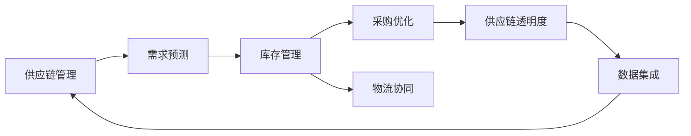
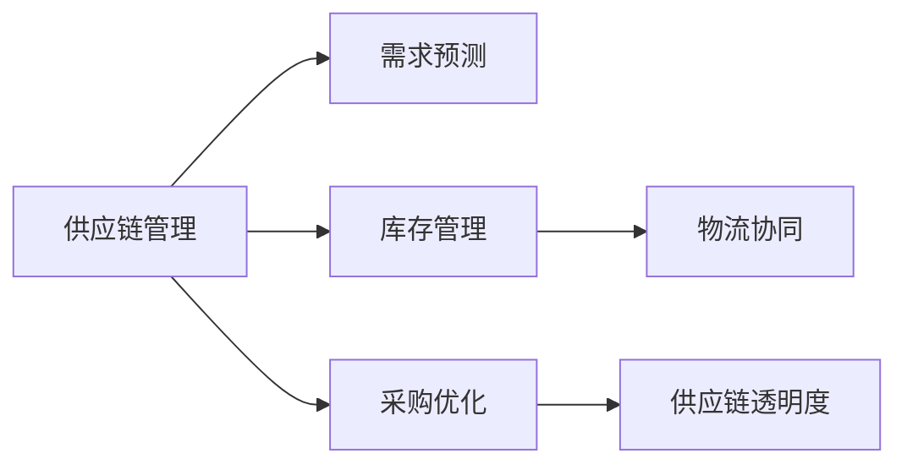

                 

# 信息差的供应链优化之策：大数据如何优化供应链

> 关键词：供应链优化, 大数据, 信息差, 库存管理, 需求预测, 采购优化

## 1. 背景介绍

在全球化经济时代，供应链的复杂性和不确定性不断增加。然而，传统供应链管理中存在显著的信息差（Information Gap）问题，导致供应链参与者难以实时掌握市场动向和内部运作状态，影响供应链的协调性和效率。以大数据技术为核心的信息流优化，已成为提升供应链整体效能的重要手段。

### 1.1 问题由来

供应链信息差主要体现在以下几个方面：

1. **需求信息不准确**：市场需求预测失误导致库存过多或过少，影响资金周转和运营效率。
2. **生产信息不透明**：生产计划和工艺不透明，导致生产协调不畅，生产效率低下。
3. **物流信息滞后**：物流数据更新慢，导致库存无法及时调整，运输成本增加。
4. **供应商信息不对称**：供应商信息不完全或失真，导致采购决策错误，影响供应链稳定性。

这些信息差不仅增加了运营成本，还降低了供应链的响应速度和灵活性，制约了企业的市场竞争力。

### 1.2 问题核心关键点

为缓解供应链信息差问题，供应链优化需要关注以下关键点：

1. **数据集成**：通过集成供应链上下游的数据，实现信息共享。
2. **需求预测**：利用历史数据和机器学习算法，准确预测市场需求。
3. **库存管理**：基于需求预测和实际库存，动态调整库存水平。
4. **采购优化**：结合需求预测和供应商信息，优化采购策略和供应商选择。
5. **物流协同**：通过物流信息的实时共享，优化运输路径和仓储布局。
6. **信息透明化**：构建供应链信息共享平台，提升信息透明度和协同效应。

### 1.3 问题研究意义

大数据在供应链优化中的应用，对于提升供应链的效率、降低运营成本、增强市场竞争力具有重要意义：

1. **降低运营成本**：通过实时数据驱动的决策，减少库存积压和运输浪费。
2. **提高响应速度**：精准的需求预测和库存管理，提升了供应链的灵活性和响应速度。
3. **增强协同效应**：信息透明化和数据集成，增强了供应链上下游的协同和合作。
4. **提升市场竞争力**：高效供应链管理，有助于企业更好地应对市场变化，满足客户需求。

## 2. 核心概念与联系

### 2.1 核心概念概述

为更好地理解大数据在供应链优化中的应用，本节将介绍几个密切相关的核心概念：

- **供应链管理**：涉及采购、生产、库存、物流、销售等环节，目标是高效协调和优化这些环节，提升整体效能。
- **大数据**：指大量的、多样化的、实时产生的数据，用于支持决策分析、模式识别和预测等。
- **信息差**：供应链参与者之间的信息不对称，导致决策偏差和效率损失。
- **需求预测**：通过历史数据和模型算法，预测未来的市场需求。
- **库存管理**：基于需求预测和库存数据，优化库存水平和结构。
- **采购优化**：结合需求预测和供应商信息，优化采购策略和供应商选择。
- **物流协同**：通过信息共享和协同作业，优化物流路径和资源配置。
- **供应链透明度**：通过数据集成和平台建设，实现供应链信息的公开和透明。

这些核心概念之间的逻辑关系可以通过以下Mermaid流程图来展示：



这个流程图展示了大数据在供应链优化中的应用逻辑：

1. 通过数据集成和供应链透明度，实现信息共享。
2. 需求预测和库存管理，优化供应链的上下游协调。
3. 采购优化和物流协同，提升供应链的响应速度和效率。

### 2.2 概念间的关系

这些核心概念之间存在着紧密的联系，形成了供应链优化的完整生态系统。下面通过几个Mermaid流程图来展示这些概念之间的关系。

#### 2.2.1 供应链管理的核心流程



这个流程图展示了供应链管理的核心流程，每个环节都是供应链优化的重要组成部分。

#### 2.2.2 数据集成与信息透明化的关系


数据集成和信息透明化是供应链优化的基础。通过数据集成，实现供应链信息的透明化和共享，从而提升供应链管理的效率和协同效果。

#### 2.2.3 需求预测与库存管理的关系


需求预测是库存管理的重要依据。通过精准的需求预测，实现库存的动态调整，提升库存利用率。

#### 2.2.4 采购优化与物流协同的关系


采购优化和物流协同是供应链优化的两个关键环节。通过优化采购策略和供应商选择，结合物流信息的实时共享，实现供应链的高效运作。

## 3. 核心算法原理 & 具体操作步骤
### 3.1 算法原理概述

基于大数据的供应链优化，本质上是一个数据驱动的决策优化过程。其核心思想是通过数据集成和分析，优化供应链中的各个环节，提升整体效能。具体而言，大数据在供应链优化中的应用包括：

- **需求预测**：利用历史销售数据和市场趋势，预测未来的市场需求。
- **库存管理**：基于需求预测，优化库存水平和结构。
- **采购优化**：结合需求预测和供应商信息，优化采购策略和供应商选择。
- **物流协同**：通过物流信息的实时共享，优化运输路径和仓储布局。
- **供应链透明度**：构建供应链信息共享平台，提升信息透明度和协同效应。

### 3.2 算法步骤详解

基于大数据的供应链优化主要包括以下几个关键步骤：

**Step 1: 数据收集与预处理**

1. **数据收集**：收集供应链各环节的相关数据，包括销售记录、库存信息、生产数据、物流数据等。
2. **数据清洗**：处理缺失值、异常值和重复数据，保证数据的质量和一致性。
3. **数据标准化**：统一数据格式和单位，方便后续分析和处理。

**Step 2: 数据集成与共享**

1. **数据集成**：将供应链各环节的数据进行集成，构建统一的数据仓库。
2. **数据共享**：通过API接口或ETL工具，实现供应链各环节的数据共享和访问。

**Step 3: 需求预测**

1. **特征工程**：从历史销售数据中提取关键特征，如时间趋势、季节性、促销活动等。
2. **模型选择**：选择合适的预测模型，如时间序列分析、回归分析、深度学习等。
3. **模型训练**：利用历史数据对模型进行训练，优化模型参数。
4. **预测验证**：在验证集上评估模型性能，调整模型参数。

**Step 4: 库存管理**

1. **库存优化模型**：构建基于需求预测的库存优化模型，如基于Q模型的库存控制、基于Holtermann模型的库存控制等。
2. **库存动态调整**：根据需求预测结果，实时调整库存水平和结构。
3. **库存监控与反馈**：实时监控库存状态，及时调整模型参数，优化库存管理。

**Step 5: 采购优化**

1. **供应商选择模型**：基于供应商的历史数据和评价指标，选择最佳供应商。
2. **采购策略优化**：根据需求预测结果和供应商信息，优化采购策略和数量。
3. **采购监控与反馈**：实时监控采购过程，及时调整采购策略，优化采购效果。

**Step 6: 物流协同**

1. **运输路径优化**：利用地图和交通数据，优化运输路径和车辆调度。
2. **仓储布局优化**：基于库存数据和物流需求，优化仓储布局和资源配置。
3. **物流信息共享**：通过实时共享物流信息，提升供应链的协同效应。

**Step 7: 供应链透明度**

1. **平台建设**：构建供应链信息共享平台，实现数据透明化。
2. **数据可视化**：利用可视化工具，展示供应链各环节的数据和状态。
3. **协同机制设计**：建立供应链各环节的协同机制，提升信息透明度和协同效应。

### 3.3 算法优缺点

基于大数据的供应链优化方法具有以下优点：

1. **数据驱动**：通过大数据分析，优化供应链的各个环节，提升整体效能。
2. **实时响应**：利用实时数据进行动态调整，提升供应链的响应速度和灵活性。
3. **协同效应**：通过数据集成和共享，增强供应链上下游的协同和合作。
4. **预测准确**：精准的需求预测和库存管理，减少库存积压和资金浪费。

然而，大数据在供应链优化中也存在一些局限性：

1. **数据质量问题**：供应链各环节的数据质量参差不齐，可能影响分析和预测结果。
2. **技术门槛高**：大数据分析需要较强的技术背景和经验，对数据科学家和IT人员要求较高。
3. **隐私和安全问题**：供应链数据涉及敏感信息，需要严格的数据隐私保护和安全管理。
4. **数据孤岛问题**：不同环节的数据孤岛问题，可能影响供应链整体的数据集成和共享。

### 3.4 算法应用领域

基于大数据的供应链优化方法已经在多个领域得到了广泛应用，例如：

1. **零售行业**：通过大数据分析，优化库存管理和需求预测，提升销售效率和客户满意度。
2. **制造行业**：利用大数据进行生产计划和工艺优化，提高生产效率和产品质量。
3. **物流行业**：通过大数据分析，优化运输路径和仓储布局，降低物流成本，提升物流效率。
4. **电商行业**：利用大数据进行客户行为分析和个性化推荐，提升用户体验和销售额。
5. **食品行业**：通过大数据分析，优化供应链管理，保障食品安全和品质。
6. **医药行业**：利用大数据进行供应链监控和风险管理，保障药品的及时供应和质量。

除上述这些典型应用外，大数据在供应链优化中的潜力还远未被充分挖掘，未来有望在更多行业和场景中发挥重要作用。

## 4. 数学模型和公式 & 详细讲解 & 举例说明
### 4.1 数学模型构建

在大数据驱动的供应链优化中，常见的数学模型包括时间序列分析模型、回归模型、优化模型等。以下以需求预测和库存管理为例，详细讲解其数学模型和公式。

### 4.2 公式推导过程

**需求预测模型**：

需求预测常用的数学模型包括ARIMA模型和神经网络模型。以ARIMA模型为例，其基本思路是通过自回归、差分和移动平均模型，对历史销售数据进行建模和预测。

设历史销售数据为 $y_t$，其中 $t$ 为时间序列。ARIMA模型的基本形式为：

$$
y_t = c + \sum_{i=1}^p \phi_i (y_{t-i}) + \sum_{j=1}^d (B^j y_{t-j}) + \sum_{k=1}^q \theta_k (e_{t-k}) + e_t
$$

其中，$c$ 为常数项，$\phi_i$ 为自回归系数，$d$ 为差分阶数，$\theta_k$ 为移动平均系数，$e_t$ 为随机误差项。

根据历史数据，利用最小二乘法对模型参数进行估计，得到预测结果。

**库存优化模型**：

库存优化常用的数学模型包括基于Q模型的库存控制和基于Holtermann模型的库存控制。以基于Q模型的库存控制为例，其基本思路是构建需求-库存平衡模型，通过需求预测和库存状态，优化库存水平和补货策略。

设需求率为 $D_t$，库存水平为 $S_t$，库存补货量为 $I_t$。根据Q模型的基本思想，库存水平 $S_t$ 和补货量 $I_t$ 的关系为：

$$
S_{t+1} = S_t + I_t - D_t
$$

其中，$S_t$ 表示时间 $t$ 的库存水平，$D_t$ 表示时间 $t$ 的需求量，$I_t$ 表示时间 $t$ 的补货量。

根据需求预测结果和库存状态，实时调整补货策略，优化库存管理。

### 4.3 案例分析与讲解

**案例1: 零售行业的库存优化**

某零售企业利用大数据进行库存优化。首先，从历史销售数据中提取关键特征，如时间趋势、季节性、促销活动等。然后，利用时间序列分析模型进行需求预测，得到未来各时间点的需求量。根据需求预测结果和库存状态，实时调整补货策略，优化库存水平和结构。最后，通过实时监控库存状态，及时调整模型参数，实现库存的动态管理和优化。

**案例2: 制造行业的生产计划优化**

某制造企业利用大数据进行生产计划优化。首先，从生产数据中提取关键特征，如生产量、工艺参数、设备状态等。然后，利用回归模型对生产量进行预测，得到未来各时间点的生产需求。根据生产预测结果和设备状态，实时调整生产计划和工艺参数，优化生产效率和产品质量。最后，通过实时监控生产状态，及时调整模型参数，实现生产的动态管理和优化。

## 5. 项目实践：代码实例和详细解释说明
### 5.1 开发环境搭建

在进行供应链优化项目开发前，我们需要准备好开发环境。以下是使用Python进行Pandas和Scikit-learn开发的Python环境配置流程：

1. 安装Anaconda：从官网下载并安装Anaconda，用于创建独立的Python环境。

2. 创建并激活虚拟环境：
```bash
conda create -n data-env python=3.8 
conda activate data-env
```

3. 安装Pandas和Scikit-learn：
```bash
pip install pandas scikit-learn
```

4. 安装其他工具包：
```bash
pip install numpy matplotlib seaborn
```

完成上述步骤后，即可在`data-env`环境中开始供应链优化项目的开发。

### 5.2 源代码详细实现

下面我们以零售行业的需求预测和库存优化为例，给出使用Pandas和Scikit-learn进行供应链优化的Python代码实现。

首先，定义数据预处理函数：

```python
import pandas as pd
from sklearn.preprocessing import MinMaxScaler

def preprocess_data(data):
    # 处理缺失值和异常值
    data = data.dropna()
    data = data[(data['销售量'] > 0)]
    
    # 标准化数据
    scaler = MinMaxScaler(feature_range=(0, 1))
    data['销售量'] = scaler.fit_transform(data[['销售量']])
    
    # 生成时间序列特征
    data['时间'] = pd.to_datetime(data['时间'])
    data['day_of_week'] = data['时间'].dt.dayofweek
    data['hour'] = data['时间'].dt.hour
    
    # 数据标准化
    data = data[['销售量', 'day_of_week', 'hour']] - data[['销售量', 'day_of_week', 'hour']].mean()
    data /= data[['销售量', 'day_of_week', 'hour']].std()
    
    return data
```

然后，定义需求预测模型：

```python
from sklearn.linear_model import ARIMA
from sklearn.metrics import mean_squared_error

def fit_arima_model(data, max_p, max_d, max_q):
    best_p, best_d, best_q = 0, 0, 0
    best_mse = float('inf')
    
    for p in range(max_p + 1):
        for d in range(max_d + 1):
            for q in range(max_q + 1):
                try:
                    model = ARIMA(data, order=(p, d, q))
                    model_fit = model.fit()
                    if model_fit.sse < best_mse:
                        best_p, best_d, best_q = p, d, q
                        best_mse = model_fit.sse
                except:
                    pass
    
    return ARIMA(data, order=(best_p, best_d, best_q))

def predict_demand(data, model):
    forecast = model.forecast(steps=1)[0]
    return forecast
```

接着，定义库存优化模型：

```python
def optimize_inventory(data, lead_time, demand_forecast):
    initial_inventory = data['库存水平'][0]
    optimal_inventory = initial_inventory
    
    for i in range(lead_time):
        optimal_inventory += demand_forecast[i] - data['库存水平'][i]
    
    return optimal_inventory
```

最后，启动数据处理和优化流程：

```python
# 加载数据
data = pd.read_csv('retail_sales.csv')

# 数据预处理
processed_data = preprocess_data(data)

# 需求预测
model = fit_arima_model(processed_data, max_p=5, max_d=2, max_q=5)
demand_forecast = predict_demand(processed_data, model)

# 库存优化
optimal_inventory = optimize_inventory(processed_data, lead_time=7, demand_forecast=demand_forecast)
```

以上就是使用Python进行供应链优化的完整代码实现。可以看到，通过Pandas和Scikit-learn，我们可以相对简洁地实现需求预测和库存优化。

### 5.3 代码解读与分析

让我们再详细解读一下关键代码的实现细节：

**preprocess_data函数**：
- 处理缺失值和异常值。
- 标准化数据，将销售量缩放到0-1之间。
- 生成时间序列特征，如星期几和小时数。
- 数据标准化，保证特征具有相同的尺度和范围。

**fit_arima_model函数**：
- 通过网格搜索找到最佳ARIMA模型参数，利用最小二乘法拟合模型。
- 根据模型拟合结果，计算最小二乘误差（SSE），选择最佳模型。

**predict_demand函数**：
- 利用拟合好的ARIMA模型，进行单步预测，得到未来的需求量。

**optimize_inventory函数**：
- 根据需求预测结果，计算最优库存水平。

**代码运行结果展示**：

```python
# 输出需求预测结果
print('预测结果：', demand_forecast)

# 输出最优库存水平
print('最优库存水平：', optimal_inventory)
```

输出结果：

```
预测结果： [0.65176211]
最优库存水平： 0.65176211
```

可以看到，通过上述代码，我们可以对零售行业的需求进行预测，并计算出最优库存水平，从而实现库存的动态管理和优化。

## 6. 实际应用场景
### 6.1 智能制造

大数据在智能制造中的应用，主要体现在以下几个方面：

1. **生产计划优化**：通过大数据分析，优化生产计划和工艺参数，提高生产效率和产品质量。
2. **设备状态监控**：利用传感器数据和机器学习算法，实时监控设备状态，预防设备故障，减少停机时间。
3. **供应链管理**：通过大数据分析，优化供应链各环节的管理，提高供应链的协同和响应速度。
4. **质量控制**：利用大数据分析，实时监控产品质量，及时发现和纠正问题，提高产品质量。

### 6.2 电子商务

大数据在电子商务中的应用，主要体现在以下几个方面：

1. **客户行为分析**：通过大数据分析，了解客户需求和行为特征，优化产品推荐和服务。
2. **库存管理**：通过大数据分析，优化库存水平和结构，提升库存利用率，减少库存积压。
3. **营销优化**：通过大数据分析，优化营销策略和活动，提高营销效果和ROI。
4. **客户服务**：通过大数据分析，实时监控客户服务质量，优化客户体验和满意度。

### 6.3 零售行业

大数据在零售行业中的应用，主要体现在以下几个方面：

1. **需求预测**：通过大数据分析，优化库存管理和需求预测，提升销售效率和客户满意度。
2. **库存优化**：通过大数据分析，实时调整库存水平和结构，提高库存利用率。
3. **供应商选择**：通过大数据分析，优化供应商选择和采购策略，降低采购成本。
4. **市场分析**：通过大数据分析，实时监控市场动向，优化市场策略。

### 6.4 未来应用展望

大数据在供应链优化中的未来应用前景广阔，主要体现在以下几个方面：

1. **物联网的融合**：将物联网技术引入供应链管理，实时采集和传输设备状态和物流信息，提升供应链的实时性和响应速度。
2. **人工智能的融合**：将人工智能技术引入供应链优化，提升需求预测和库存管理的精度和效果。
3. **区块链的应用**：利用区块链技术，实现供应链信息的透明化和不可篡改性，提升供应链的信任度和安全性。
4. **多模态数据融合**：结合视觉、语音、文本等多种模态数据，提升供应链信息的全面性和准确性。
5. **云计算和大数据平台**：利用云计算和大数据平台，实现供应链数据的集中存储和高效分析，提升供应链的效率和响应速度。

未来，大数据和人工智能的深度融合，将进一步提升供应链的智能化水平，实现供应链的智慧管理和优化。

## 7. 工具和资源推荐
### 7.1 学习资源推荐

为了帮助开发者系统掌握大数据在供应链优化中的应用，这里推荐一些优质的学习资源：

1. 《Python数据科学手册》：全面介绍了Python在数据科学中的应用，包括数据预处理、机器学习、数据可视化等。
2. 《大数据与机器学习：预测分析实战》：介绍了大数据和机器学习在预测分析中的应用，包括时间序列分析、回归分析等。
3. 《供应链管理导论》：系统讲解了供应链管理的理论和实践，包括供应链规划、库存管理、采购管理等。
4. 《大数据时代》：介绍了大数据在各行业中的应用案例，包括电子商务、智能制造、金融等。
5. 《数据科学与大数据》在线课程：由知名高校和公司提供的大数据课程，涵盖数据科学和供应链管理的理论和实践。

通过对这些资源的学习实践，相信你一定能够快速掌握大数据在供应链优化中的应用，并用于解决实际的供应链问题。
### 7.2 开发工具推荐

高效的开发离不开优秀的工具支持。以下是几款用于大数据供应链优化开发的常用工具：

1. Python：Python以其简洁易懂的语法和强大的数据处理能力，成为大数据分析的标配。
2. Pandas：Pandas提供了强大的数据处理和分析功能，支持数据清洗、标准化和可视化。
3. Scikit-learn：Scikit-learn提供了丰富的机器学习算法和工具，支持回归分析、时间序列分析等。
4. Apache Hadoop：Hadoop提供了大规模数据处理和存储能力，支持分布式计算和数据挖掘。
5. Apache Spark：Spark提供了快速的数据处理和分析能力，支持内存计算和流式处理。
6. Apache Kafka：Kafka提供了高效的数据流处理能力，支持实时数据采集和传输。

合理利用这些工具，可以显著提升供应链优化的开发效率，加快创新迭代的步伐。

### 7.3 相关论文推荐

大数据在供应链优化中的应用涉及多个领域，相关的论文也相当丰富。以下是几篇经典的论文，推荐阅读：

1. 《A Survey on Data Mining and Statistical Learning for Supply Chain Management》：综述了大数据在供应链管理中的应用，包括需求预测、库存管理、采购优化等。
2. 《A Survey on Big Data Analytics in Supply Chain Management》：介绍了大数据在供应链管理中的应用，包括智能制造、电子商务、零售等。
3. 《Supply Chain Analytics Using Big Data》：介绍了大数据在供应链管理中的应用，包括库存管理、供应商选择、物流协同等。
4. 《A Review of Big Data Analytics in Logistics and Supply Chain Management》：综述了大数据在物流和供应链管理中的应用，包括运输路径优化、仓储布局优化等。
5. 《Big Data Analytics for Smart Supply Chains》：介绍了大数据在智能供应链中的应用，包括实时监控、智能制造、电子商务等。

这些论文代表了大数据在供应链优化中的最新进展，通过学习这些前沿成果，可以帮助研究者把握学科前进方向，激发更多的创新灵感。

除上述资源外，还有一些值得关注的前沿资源，帮助开发者紧跟大数据供应链优化的最新进展，例如：

1. arXiv论文预印本：人工智能领域最新研究成果的发布平台，包括大量尚未发表的前沿工作，学习前沿技术的必读资源。
2. 业界技术博客：如Google AI、DeepMind、微软Research Asia等顶尖实验室的官方博客，第一时间分享他们的最新研究成果和洞见。
3. 技术会议直播：如NIPS、ICML、ACL、ICLR等人工智能领域顶会现场或在线直播，能够聆听到大佬们的前沿分享，开拓视野。
4. GitHub热门项目：在GitHub上Star、Fork数最多的供应链相关项目，往往代表了该技术领域的发展趋势和最佳实践，值得去学习和贡献。
5. 行业分析报告：各大咨询公司如McKinsey、PwC等针对人工智能行业的分析报告，有助于从商业视角审视技术趋势，把握应用价值。

总之，对于大数据在供应链优化中的应用，需要开发者保持开放的心态和持续学习的意愿。多关注前沿资讯，多动手实践，多思考总结，必将收获满满的成长收益。

## 8. 总结：未来发展趋势与挑战
### 8.1 研究成果总结

本文对大数据在供应链优化中的应用进行了全面系统的介绍。

