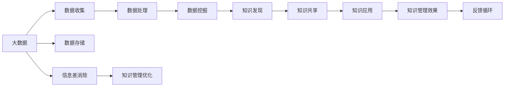

                 

# 信息差的商业知识管理：大数据如何促进知识管理

在当今信息爆炸的时代，如何高效管理和利用知识已成为企业竞争的关键。信息差（Information Gap），即企业内部和外部的信息不对称，是阻碍知识流动和利用的主要因素。本文旨在探讨大数据技术如何通过消除信息差，促进企业知识管理的优化。

## 1. 背景介绍

### 1.1 信息差与知识管理

信息差指的是企业内部和外部之间信息的不对称，这会导致知识流动不畅、决策偏差和资源浪费。在大数据时代，尽管企业获取信息的渠道日益增多，但信息的质量和适用性仍需进一步提升。

知识管理（Knowledge Management, KM）是企业通过识别、整理、共享和使用知识，以提高决策质量和业务效率的实践。良好的知识管理不仅能提升企业竞争力，还能促进创新和持续改进。

### 1.2 数据驱动的知识管理

大数据技术为企业提供了前所未有的信息资源，使得信息差成为可管理对象。通过对大量数据的分析和处理，企业可以更准确地识别和量化信息差，进而采取有效措施消除信息差，优化知识管理。

数据驱动的知识管理（Data-Driven Knowledge Management）是大数据时代的产物，它利用数据分析和机器学习技术，从海量数据中挖掘知识，消除信息差，提高知识管理的效率和效果。

## 2. 核心概念与联系

### 2.1 核心概念概述

- **大数据（Big Data）**：指规模庞大、类型繁多、速度快速、价值密度低的数据集合。大数据技术包括数据收集、存储、处理和分析等全过程。
- **知识管理（Knowledge Management, KM）**：通过收集、整理、共享和使用知识，提高企业的决策质量和业务效率。
- **信息差（Information Gap）**：企业内部和外部之间信息的不对称，导致知识流动不畅和决策偏差。
- **数据驱动的知识管理（Data-Driven Knowledge Management）**：利用大数据技术消除信息差，优化知识管理过程。

### 2.2 概念间的关系

通过以下Mermaid流程图，我们可以更好地理解这些核心概念之间的关系：



这个流程图展示了大数据如何通过多个步骤，最终优化企业知识管理的全过程。

## 3. 核心算法原理 & 具体操作步骤

### 3.1 算法原理概述

数据驱动的知识管理流程大致包括以下几个步骤：

1. **数据收集**：通过各种手段收集企业内外部的数据。
2. **数据处理**：对收集到的数据进行清洗、标准化和归档。
3. **数据挖掘**：利用算法从数据中发现隐含的知识和模式。
4. **知识发现**：通过数据分析和机器学习，从数据中提取结构化知识。
5. **知识共享**：将知识通过企业内部系统或外部平台进行共享。
6. **知识应用**：将知识应用于企业的决策、运营和管理中。
7. **反馈循环**：通过监控知识应用效果，不断优化知识管理流程。

这些步骤形成了数据驱动的知识管理闭环，确保知识的有效流动和利用。

### 3.2 算法步骤详解

以下是具体的数据驱动知识管理操作步骤：

1. **数据收集**：使用ETL（Extract, Transform, Load）工具收集企业内外部的数据，包括客户反馈、市场趋势、财务数据等。

2. **数据清洗**：使用数据清洗工具对收集到的数据进行去重、缺失值处理和异常值检测。

3. **数据存储**：将清洗后的数据存储在数据仓库中，便于后续的分析和查询。

4. **数据挖掘**：使用机器学习算法对存储的数据进行模式发现和预测。例如，通过聚类算法发现用户行为模式，通过回归分析预测销售趋势。

5. **知识发现**：将数据挖掘的结果转化为结构化知识，如用户画像、市场分析报告、产品推荐模型等。

6. **知识共享**：通过企业内部的知识管理系统或外部平台（如Google知识图谱），将知识共享给相关人员。

7. **知识应用**：将知识应用于企业的决策、运营和管理中，如基于用户画像进行个性化推荐，基于市场分析进行市场策略调整。

8. **反馈循环**：通过监控知识应用效果，收集反馈信息，不断优化知识管理流程和算法模型。

### 3.3 算法优缺点

**优点**：

- **全面性**：大数据可以全面收集和分析企业内外部的信息，消除信息差。
- **精准性**：通过机器学习算法，可以从数据中发现精准的知识和模式。
- **实时性**：大数据技术可以实现数据的实时分析和处理，提高知识管理的响应速度。
- **可扩展性**：大数据平台可以处理海量数据，支持企业的快速扩展和增长。

**缺点**：

- **数据质量要求高**：大数据分析结果依赖于数据的质量和完整性。
- **算法复杂性高**：数据挖掘和知识发现的算法复杂，需要高水平的技术支持。
- **数据隐私和安全**：处理敏感数据时需注意隐私保护和数据安全问题。
- **成本高**：大数据技术的部署和维护成本较高，需企业有足够的资金支持。

### 3.4 算法应用领域

数据驱动的知识管理技术已广泛应用于多个领域，包括但不限于：

- **客户关系管理（CRM）**：通过大数据分析客户行为和需求，提高客户满意度和忠诚度。
- **供应链管理**：利用大数据优化供应链流程，降低成本，提升效率。
- **市场营销**：通过大数据分析市场趋势和用户偏好，制定精准的市场营销策略。
- **人力资源管理**：通过大数据分析员工表现和职业发展，优化人力资源配置。
- **财务风险管理**：利用大数据监控财务数据，识别潜在风险，预防财务危机。

## 4. 数学模型和公式 & 详细讲解

### 4.1 数学模型构建

假设企业收集到 $N$ 条数据 $D = \{d_1, d_2, ..., d_N\}$，每条数据包含 $M$ 个属性 $A = \{a_1, a_2, ..., a_M\}$。企业希望通过大数据分析，发现数据中的隐含知识和模式，用于优化知识管理。

### 4.2 公式推导过程

假设每条数据 $d_i$ 对应一个目标属性 $y_i$，利用线性回归模型 $y_i = \beta_0 + \beta_1a_1 + ... + \beta_Ma_M + \epsilon_i$ 进行建模，其中 $\beta_j$ 为回归系数，$\epsilon_i$ 为误差项。

通过最小二乘法，求解 $\beta_j$，得到回归方程：

$$
\beta_j = \frac{\sum_{i=1}^N (y_i - \hat{y}_i)(a_j - \bar{a}_j)}{\sum_{i=1}^N (a_j - \bar{a}_j)^2}
$$

其中 $\hat{y}_i = \beta_0 + \beta_1a_1 + ... + \beta_Ma_M$，$\bar{a}_j = \frac{1}{N}\sum_{i=1}^N a_j$。

### 4.3 案例分析与讲解

假设某电商企业收集到用户购买行为数据，希望通过大数据分析发现用户的购买偏好和消费习惯。

首先，对用户购买行为数据进行清洗和归档，存储在数据仓库中。

然后，使用线性回归模型，预测用户购买某商品的概率：

$$
P(y_i = 1|a_1, a_2, ..., a_M) = \sigma(\beta_0 + \beta_1a_1 + ... + \beta_Ma_M)
$$

其中 $\sigma(x) = \frac{1}{1 + e^{-x}}$ 为 sigmoid 函数。

通过不断迭代优化回归系数 $\beta_j$，最终得到用户购买偏好的预测模型，可用于个性化推荐和市场营销。

## 5. 项目实践：代码实例和详细解释说明

### 5.1 开发环境搭建

为了实现数据驱动的知识管理，我们需要搭建一个完整的数据处理和分析环境。以下是一个基于Python和Hadoop的开发环境搭建流程：

1. **安装Python**：安装最新版本的Python，推荐使用Anaconda或Miniconda，方便后续的环境管理和包安装。

2. **安装Hadoop**：从官网下载并安装Hadoop，配置好环境变量。

3. **安装ETL工具**：使用Apache Nifi或Apache Sqoop，将企业内外部的数据收集到Hadoop系统中。

4. **安装数据仓库**：使用Apache Hive，将收集到的数据进行存储和管理。

5. **安装机器学习工具**：使用Apache Spark MLlib，进行数据挖掘和知识发现。

6. **安装可视化工具**：使用Tableau或Power BI，对分析结果进行可视化展示。

### 5.2 源代码详细实现

以下是使用Python和Spark进行数据驱动知识管理的一个简单示例代码：

```python
from pyspark import SparkContext, SparkConf
from pyspark.ml.regression import LinearRegressionModel
from pyspark.ml.feature import VectorAssembler
from pyspark.ml.evaluation import RegressionEvaluator

# 初始化SparkContext
conf = SparkConf().setAppName("Data-Driven Knowledge Management")
sc = SparkContext(conf=conf)

# 数据收集和存储
data = sc.textFile("path/to/data")
data_clean = data.map(lambda x: x.strip().split(","))
data_clean_p = data_clean.rdd.map(lambda x: (float(x[0]), float(x[1]), float(x[2])))

# 数据清洗和归档
data_p = data_clean_p.map(lambda x: (x[0], x[1], x[2])).sortBy(lambda x: x[0])

# 数据挖掘和知识发现
vector_assembler = VectorAssembler(inputCols=["a1", "a2", "a3"], outputCol="features")
data_features = vector_assembler.transform(data_p).select("features", "label")
data_train = data_features.filter(lambda x: x[0] == "train")
data_test = data_features.filter(lambda x: x[0] == "test")

# 训练模型
lr = LinearRegressionWithSQL().setMaxIter(10).setRegParam(0.01)
model = lr.fit(data_train)

# 预测和评估
predictions = model.transform(data_test)
evaluator = RegressionEvaluator标签="label", metricName="rmse", isQuantile=False)
rmse = evaluator.evaluate(predictions)
print("RMSE: ", rmse)
```

### 5.3 代码解读与分析

代码中首先初始化SparkContext，然后使用Spark读取数据，进行清洗、归档和特征提取。接着，使用线性回归模型进行训练和预测，最后通过评估指标（如RMSE）评估模型的性能。

### 5.4 运行结果展示

假设在测试集上评估模型的RMSE为0.5，这意味着模型预测的误差平均为0.5。如果企业的目标是通过大数据分析预测用户购买行为，0.5的RMSE是一个相当不错的结果，说明模型具有良好的预测能力。

## 6. 实际应用场景

### 6.1 客户关系管理（CRM）

在大数据驱动的知识管理下，客户关系管理（CRM）系统可以更加精准地识别客户需求和行为，提高客户满意度和忠诚度。通过大数据分析，CRM系统可以：

- 识别高价值客户，制定个性化营销策略。
- 监控客户反馈，及时解决问题。
- 分析客户生命周期，优化客户关系管理流程。

### 6.2 供应链管理

供应链管理是企业管理的核心环节，通过大数据驱动的知识管理，供应链管理可以实现：

- 预测需求，优化库存管理。
- 实时监控供应链流程，降低风险。
- 识别供应链瓶颈，优化流程。

### 6.3 市场营销

市场营销是企业获取竞争优势的重要手段，通过大数据驱动的知识管理，市场营销可以实现：

- 精准定位目标客户，提高广告效果。
- 分析市场趋势，制定市场策略。
- 实时监测广告效果，优化投放策略。

### 6.4 未来应用展望

未来，随着大数据技术的不断发展，数据驱动的知识管理将更深入地应用于各个领域。例如：

- **智能制造**：通过大数据分析生产数据，优化生产流程，提升生产效率。
- **智能交通**：通过大数据分析交通数据，优化交通管理，提升出行效率。
- **智慧城市**：通过大数据分析城市数据，优化城市管理，提升城市运行效率。

## 7. 工具和资源推荐

### 7.1 学习资源推荐

- **Kaggle**：提供海量数据集和竞赛平台，是学习大数据和机器学习的绝佳资源。
- **Coursera**：提供大数据和知识管理的在线课程，包括Coursera推出的《大数据与统计学习》课程。
- **edX**：提供大数据和知识管理的在线课程，如edX推出的《Data Science and Machine Learning MicroMasters》课程。

### 7.2 开发工具推荐

- **Apache Hadoop**：开源分布式计算框架，支持大规模数据处理。
- **Apache Spark**：快速、通用的大数据处理引擎，支持分布式数据处理和机器学习。
- **Apache Nifi**：开源的数据集成工具，支持ETL过程自动化。
- **Tableau**：强大的数据可视化工具，支持复杂的数据分析和展示。

### 7.3 相关论文推荐

- **Big Data: Principles and Best Practices of Scalable Real-time Data Systems**：谷歌发布的大数据技术白皮书，介绍大数据技术的基本原理和最佳实践。
- **Big Data: Concepts and Technologies**：一本系统介绍大数据技术的书籍，涵盖数据处理、存储、分析和应用等方面。
- **Knowledge Management in Practice: Concepts, Technology, and Tools**：一本详细介绍知识管理技术和工具的书籍，涵盖知识获取、存储、共享和应用等方面。

## 8. 总结：未来发展趋势与挑战

### 8.1 研究成果总结

大数据驱动的知识管理技术，通过消除信息差，优化企业知识管理流程，取得了显著的成效。其主要成果包括：

- **提升决策质量**：通过大数据分析，企业可以更全面、精准地识别和量化信息差，优化决策过程。
- **提高业务效率**：大数据驱动的知识管理可以加速信息流动，提高业务运营效率。
- **促进创新和改进**：大数据分析可以发现新的商业机会和改进方向，推动企业创新。

### 8.2 未来发展趋势

未来，数据驱动的知识管理技术将呈现以下几个发展趋势：

- **智能化**：通过人工智能和机器学习，数据驱动的知识管理将更加智能化，能够自动分析和发现知识。
- **实时化**：通过实时数据处理技术，数据驱动的知识管理将实现实时分析和应用。
- **多样化**：通过整合多种数据来源，数据驱动的知识管理将支持更多样化的数据类型和应用场景。
- **自动化**：通过自动化的数据处理和分析流程，数据驱动的知识管理将减少人工干预，提高效率。

### 8.3 面临的挑战

尽管数据驱动的知识管理技术取得了显著成果，但在应用过程中仍面临一些挑战：

- **数据隐私和安全**：处理敏感数据时需注意隐私保护和数据安全问题。
- **数据质量控制**：大数据分析依赖于高质量的数据，需不断优化数据收集和处理流程。
- **技术复杂性**：数据驱动的知识管理涉及多个技术环节，需具备高水平的技术能力和经验。
- **成本控制**：大数据技术的部署和维护成本较高，需企业有足够的资金支持。

### 8.4 研究展望

未来的研究需要在以下几个方面寻求新的突破：

- **技术创新**：开发更加高效、智能的数据驱动知识管理技术。
- **模型优化**：优化大数据分析模型，提高知识发现的准确性和实时性。
- **数据融合**：将多种数据来源整合，构建更全面、准确的知识管理系统。
- **安全保障**：加强数据隐私和安全保护，确保知识管理系统的安全稳定。

总之，数据驱动的知识管理技术是大数据时代的产物，通过消除信息差，优化企业知识管理，具有广阔的发展前景。未来，随着技术的不断创新和完善，数据驱动的知识管理将更好地服务于企业，助力企业实现数字化转型和智能化升级。

## 9. 附录：常见问题与解答

**Q1：如何提高大数据驱动的知识管理系统的效率？**

A: 提高大数据驱动的知识管理系统的效率，需要从以下几个方面入手：

- **优化数据收集流程**：采用自动化ETL工具，减少数据收集的时间和成本。
- **提升数据处理能力**：使用分布式计算框架如Apache Spark，提高数据处理的速度和效率。
- **优化算法模型**：选择高效、准确的数据分析算法，提高知识发现的精度。
- **引入实时数据处理**：通过实时数据流处理技术，实现数据的实时分析和应用。
- **优化系统架构**：采用微服务架构和容器化技术，提高系统的扩展性和稳定性。

**Q2：大数据驱动的知识管理中如何保护数据隐私和安全？**

A: 在大数据驱动的知识管理中，保护数据隐私和安全是关键问题。以下是一些常用的保护措施：

- **数据匿名化**：在数据收集和处理过程中，采用数据匿名化技术，防止敏感数据泄露。
- **访问控制**：通过访问控制技术，限制数据的访问权限，防止未经授权的访问。
- **加密技术**：对敏感数据进行加密存储和传输，防止数据被非法获取和篡改。
- **安全审计**：建立安全审计机制，记录和监控数据访问和操作，发现异常及时处理。
- **法律合规**：遵守相关法律法规，确保数据处理和使用的合法性。

**Q3：如何选择合适的数据驱动知识管理工具？**

A: 选择合适的数据驱动知识管理工具，需要考虑以下几个因素：

- **技术成熟度**：选择成熟、稳定、易用的工具，减少技术实现的难度。
- **功能完备性**：工具应具备数据收集、清洗、存储、分析和可视化等完整功能。
- **扩展性**：工具应具备良好的扩展性，支持企业未来的业务扩展和技术升级。
- **成本效益**：工具的成本应与企业的能力和需求相匹配，避免过度投资。
- **社区支持**：工具应有活跃的社区和支持，方便技术问题的解决和优化。

**Q4：数据驱动的知识管理对企业有哪些好处？**

A: 数据驱动的知识管理对企业有以下好处：

- **提升决策质量**：通过数据分析，企业可以更全面、精准地识别和量化信息差，优化决策过程。
- **提高业务效率**：大数据驱动的知识管理可以加速信息流动，提高业务运营效率。
- **促进创新和改进**：大数据分析可以发现新的商业机会和改进方向，推动企业创新。
- **增强竞争优势**：通过精准的市场分析和客户理解，企业可以制定更有效的市场策略和客户管理方案。
- **优化资源配置**：通过数据驱动的知识管理，企业可以更合理地配置资源，提高资源利用效率。

通过以上问题的解答，我们可以更全面地理解大数据驱动的知识管理技术的应用和发展前景，为未来的研究和实践提供指导。

---

作者：禅与计算机程序设计艺术 / Zen and the Art of Computer Programming

