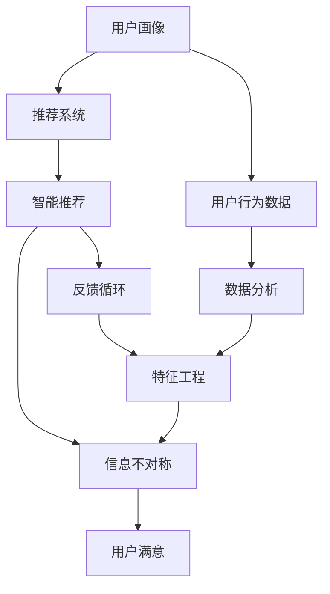

                 

# 信息差：信息不对称与客户满意

> 关键词：信息不对称,客户满意,用户体验,信息差算法,基于算法的客户服务,智能推荐系统,推荐算法,信息偏见

## 1. 背景介绍

### 1.1 问题由来
在现代商业环境中，信息不对称（Information Asymmetry）已成为制约客户满意度的关键因素之一。传统上，信息不对称往往被视为信息传递方和接受方之间的信息传递障碍，导致接收方无法准确了解所需的信息，进而影响其决策和行为。在互联网时代，信息不对称问题进一步加剧，诸如假冒伪劣产品、网络欺诈、广告夸大等现象频发，严重损害了消费者权益。

然而，信息不对称并非不可避免。随着人工智能技术的发展，基于算法的客户服务（Algorithmic Customer Service）成为可能。通过收集、分析和预测用户行为数据，智能推荐系统（Recommendation Systems）能够提供更为个性化和精准的服务，从而缓解信息不对称问题。本文将聚焦于基于算法的客户服务，探讨其工作原理、面临的挑战及未来展望。

### 1.2 问题核心关键点
信息不对称问题本质上是一种信息传递与理解的问题。解决信息不对称的关键在于：

1. **信息收集与处理**：通过算法和大数据分析，收集和处理用户行为数据，形成用户画像。
2. **信息推送与匹配**：利用机器学习技术，将用户画像与产品信息匹配，形成个性化的推荐结果。
3. **用户反馈与优化**：收集用户对推荐结果的反馈，不断优化推荐算法和策略，提升用户体验。

## 2. 核心概念与联系

### 2.1 核心概念概述

为了更好地理解基于算法的客户服务，我们需先定义一些关键概念：

- **信息不对称（Information Asymmetry）**：指交易双方掌握信息的不平等。例如，卖家可能了解产品所有细节，而买家仅掌握部分信息。
- **推荐系统（Recommendation System）**：通过分析用户历史行为和偏好，推荐符合其兴趣的产品或服务。推荐系统在电商、视频、音乐等多个领域得到广泛应用。
- **智能推荐（Intelligent Recommendation）**：利用深度学习、强化学习等技术，提升推荐系统的精度和个性化水平，满足用户多元化需求。
- **用户画像（User Profile）**：通过算法和大数据分析，形成的用户行为和偏好概览，用于指导个性化推荐。
- **反馈循环（Feedback Loop）**：用户对推荐结果的反馈，用于调整推荐算法，实现自我修正和优化。

这些核心概念构成了基于算法的客户服务的基础框架。信息不对称问题通过推荐系统和智能推荐得到缓解，用户画像和反馈循环进一步提升推荐系统的准确性和个性化水平。

### 2.2 概念间的关系

这些核心概念之间存在密切的联系，通过一个简单的Mermaid流程图可以直观展示它们的关系：



这个流程图展示了基于算法的客户服务的基本工作流程：

1. **用户画像（A）**：通过用户行为数据（E）进行数据分析（F）和特征工程（G），形成用户画像。
2. **推荐系统（B）**：利用用户画像和产品信息，进行推荐。
3. **智能推荐（C）**：引入深度学习、强化学习等技术，提升推荐精度。
4. **信息不对称（D）**：推荐系统通过智能推荐缓解信息不对称。
5. **用户满意（I）**：用户对推荐结果的反馈（H）用于调整推荐系统，实现自我优化。

## 3. 核心算法原理 & 具体操作步骤
### 3.1 算法原理概述

基于算法的客户服务，其核心算法原理可以概括为以下几个步骤：

1. **数据收集与预处理**：收集用户行为数据，如浏览记录、购买历史、评分反馈等。
2. **特征提取与建模**：通过特征工程，将用户行为数据转化为可用的特征向量。
3. **模型训练与优化**：利用机器学习算法（如协同过滤、内容推荐、深度神经网络等）进行模型训练，不断优化模型性能。
4. **推荐结果生成**：根据用户画像和推荐模型，生成个性化的推荐结果。
5. **用户反馈与调整**：收集用户对推荐结果的反馈，调整推荐策略，实现自我修正。

### 3.2 算法步骤详解

以下将详细描述推荐系统的算法步骤：

**Step 1: 数据收集与预处理**

1. **数据收集**：
   - 收集用户行为数据，如浏览记录、购买历史、评分反馈等。
   - 收集产品信息，如商品名称、价格、描述、用户评分等。

2. **数据预处理**：
   - 清洗数据，去除噪声和重复项。
   - 将时间戳转换为标准格式，便于分析。
   - 进行数据归一化，保证数据的一致性和稳定性。

**Step 2: 特征提取与建模**

1. **特征工程**：
   - 提取用户行为特征，如浏览时长、点击率、购买频率等。
   - 提取产品特征，如类别、品牌、价格等。
   - 进行特征选择，剔除无用特征，提升模型效率。

2. **建模**：
   - 选择合适的机器学习算法，如协同过滤、内容推荐、深度神经网络等。
   - 利用用户行为数据和产品信息，训练推荐模型。
   - 通过交叉验证、网格搜索等方法，进行模型调参，优化模型性能。

**Step 3: 模型训练与优化**

1. **模型训练**：
   - 使用用户行为数据和产品信息，训练推荐模型。
   - 根据实际场景，选择合适的损失函数，如均方误差、交叉熵等。
   - 利用梯度下降等优化算法，进行模型参数更新。

2. **模型优化**：
   - 引入正则化技术，防止模型过拟合。
   - 采用early stopping等策略，控制模型训练过程。
   - 通过增量学习，不断更新模型，提升性能。

**Step 4: 推荐结果生成**

1. **推荐引擎**：
   - 根据用户画像和推荐模型，生成个性化推荐结果。
   - 使用特征向量的相似度计算方法，找到与用户画像相似的产品。
   - 将推荐结果排序，提高用户体验。

2. **结果展示**：
   - 将推荐结果展示给用户，提供详细的商品信息和评分反馈。
   - 允许用户选择接受或拒绝推荐，实现自主决策。

**Step 5: 用户反馈与调整**

1. **反馈收集**：
   - 收集用户对推荐结果的反馈，如评分、评论、点击等。
   - 分析用户反馈，识别用户偏好和兴趣点。

2. **调整优化**：
   - 根据用户反馈，调整推荐模型和策略。
   - 引入在线学习技术，实时更新模型参数。
   - 不断迭代优化，提升推荐系统精度和个性化水平。

### 3.3 算法优缺点

基于算法的客户服务，其优点包括：

1. **高效率**：通过自动化算法，实现实时推荐，提高用户满意度和购买转化率。
2. **个性化**：利用用户画像和推荐模型，提供个性化服务，提升用户体验。
3. **可扩展**：推荐系统可以处理大规模数据，适应各种场景。
4. **精准性**：通过机器学习算法，提高推荐结果的准确性和相关性。

同时，算法也存在一些缺点：

1. **数据隐私问题**：收集和处理用户数据时，需要保护用户隐私，避免数据泄露。
2. **模型偏见**：推荐算法可能受到数据偏见的影响，导致推荐结果的不公正性。
3. **算法透明性**：推荐系统的决策过程较为复杂，用户难以理解其背后的逻辑。
4. **高成本**：建设和管理推荐系统需要大量资源，包括数据、算法、硬件等。

### 3.4 算法应用领域

基于算法的客户服务，已经在电商、视频、音乐等多个领域得到广泛应用。例如：

- **电商推荐**：根据用户浏览和购买历史，推荐商品和活动。
- **视频推荐**：根据用户观看历史，推荐视频和频道。
- **音乐推荐**：根据用户听歌历史，推荐歌曲和艺人。
- **新闻推荐**：根据用户阅读历史，推荐新闻和文章。
- **酒店推荐**：根据用户浏览和预订历史，推荐酒店和活动。

此外，基于算法的客户服务还在智能客服、智慧医疗、智慧出行等更多领域得到应用，为各行业带来数字化转型的新动力。

## 4. 数学模型和公式 & 详细讲解 & 举例说明

### 4.1 数学模型构建

推荐系统本质上是一种优化问题，目标是最大化用户满意度和系统收益。设用户行为数据为 $D = \{(x_i, y_i)\}_{i=1}^N$，其中 $x_i$ 为输入特征，$y_i$ 为输出标签。推荐系统通过学习 $f(x)$ 函数，预测用户对每个产品的评分或兴趣。

推荐系统的优化目标可以表示为：

$$
\max_{f} \sum_{i=1}^N w_i \log f(x_i)
$$

其中 $w_i$ 为样本权重，通常为样本数量倒数。

### 4.2 公式推导过程

以下以协同过滤（Collaborative Filtering）算法为例，推导推荐系统的损失函数及其梯度计算过程。

假设推荐系统已经收集到用户行为数据 $D = \{(x_i, y_i)\}_{i=1}^N$，用户行为数据 $D' = \{(x_j', y_j')\}_{j=1}^M$。推荐系统的目标是通过训练模型，预测用户 $i$ 对商品 $j$ 的评分 $p_{ij}$。

协同过滤算法通常使用基于用户-用户（User-Based）或基于商品-商品（Item-Based）的推荐方法。这里我们以User-Based为例，推导推荐系统的损失函数。

**损失函数**：

$$
L(f) = -\sum_{i=1}^N \sum_{j=1}^M y_{ij} \log f(x_i, x_j')
$$

其中 $y_{ij}$ 为实际评分，$f(x_i, x_j')$ 为推荐模型的预测评分。

**梯度计算**：

$$
\frac{\partial L(f)}{\partial \theta} = -\sum_{i=1}^N \sum_{j=1}^M y_{ij} \frac{\partial \log f(x_i, x_j')}{\partial \theta}
$$

其中 $\theta$ 为模型参数，$\frac{\partial \log f(x_i, x_j')}{\partial \theta}$ 可以通过反向传播算法计算。

在得到损失函数的梯度后，即可带入优化算法（如随机梯度下降）进行参数更新。重复上述过程直至收敛，最终得到最优推荐模型。

### 4.3 案例分析与讲解

假设我们要构建一个视频推荐系统，收集了用户观看历史数据 $D = \{(x_i, y_i)\}_{i=1}^N$，其中 $x_i$ 为用户ID，$y_i$ 为观看历史ID。现在要预测用户 $i$ 对新视频 $j$ 的评分 $p_{ij}$。

**数据预处理**：

1. **清洗数据**：去除异常数据和噪声。
2. **归一化**：将用户ID和视频ID标准化，便于后续计算。
3. **特征工程**：提取用户行为特征，如观看时长、观看频率等。

**模型训练**：

1. **选择模型**：选择协同过滤算法，进行模型训练。
2. **调参**：使用交叉验证等方法，调整模型参数。
3. **优化**：利用梯度下降等算法，不断优化模型性能。

**推荐结果生成**：

1. **生成预测**：根据用户行为数据和推荐模型，生成个性化推荐结果。
2. **排序**：对推荐结果进行排序，提高用户体验。

**用户反馈与调整**：

1. **收集反馈**：收集用户对推荐结果的评分和反馈。
2. **调整模型**：根据用户反馈，调整推荐模型和策略。
3. **实时优化**：引入在线学习技术，实时更新模型参数，提升推荐精度。

通过上述步骤，我们可以构建一个高效的推荐系统，为用户提供个性化的视频推荐服务。

## 5. 项目实践：代码实例和详细解释说明

### 5.1 开发环境搭建

在进行推荐系统开发前，我们需要准备好开发环境。以下是使用Python进行推荐系统开发的环境配置流程：

1. 安装Anaconda：从官网下载并安装Anaconda，用于创建独立的Python环境。

2. 创建并激活虚拟环境：
```bash
conda create -n recsys-env python=3.8 
conda activate recsys-env
```

3. 安装相关库：
```bash
pip install numpy pandas scikit-learn scikit-learn==0.24.2
```

4. 安装推荐系统库：
```bash
pip install recsys
```

5. 安装其他相关工具：
```bash
pip install matplotlib tqdm jupyter notebook ipython
```

完成上述步骤后，即可在`recsys-env`环境中开始推荐系统开发。

### 5.2 源代码详细实现

下面我们以协同过滤（Collaborative Filtering）算法为例，给出推荐系统的PyTorch代码实现。

首先，定义协同过滤模型的类：

```python
import torch
import torch.nn as nn
import torch.nn.functional as F
import torch.optim as optim

class CollaborativeFiltering(nn.Module):
    def __init__(self, n_users, n_items, embedding_dim):
        super(CollaborativeFiltering, self).__init__()
        self.user_embed = nn.Embedding(n_users, embedding_dim)
        self.item_embed = nn.Embedding(n_items, embedding_dim)
        self.user_item = nn.Linear(embedding_dim * 2, 1)
    
    def forward(self, user_id, item_id):
        user = self.user_embed(user_id)
        item = self.item_embed(item_id)
        concat = torch.cat((user, item), dim=1)
        return self.user_item(concat)
```

然后，定义数据加载器和优化器：

```python
from torch.utils.data import Dataset, DataLoader

class RecSysDataset(Dataset):
    def __init__(self, data, user_col, item_col, rating_col):
        self.data = data
        self.user_col = user_col
        self.item_col = item_col
        self.rating_col = rating_col
    
    def __len__(self):
        return len(self.data)
    
    def __getitem__(self, idx):
        user_id, item_id, rating = self.data.iloc[idx, self.user_col], self.data.iloc[idx, self.item_col], self.data.iloc[idx, self.rating_col]
        return torch.tensor(user_id), torch.tensor(item_id), torch.tensor(rating)
        
dataset = RecSysDataset(train_data, 'user_id', 'item_id', 'rating')
train_loader = DataLoader(dataset, batch_size=64, shuffle=True)

optimizer = optim.Adam(model.parameters(), lr=0.01)
```

接着，定义训练和评估函数：

```python
def train_epoch(model, data_loader, optimizer):
    model.train()
    epoch_loss = 0
    for user_id, item_id, rating in data_loader:
        optimizer.zero_grad()
        pred = model(user_id, item_id)
        loss = F.mse_loss(pred, rating)
        epoch_loss += loss.item()
        loss.backward()
        optimizer.step()
    return epoch_loss / len(data_loader)

def evaluate(model, data_loader):
    model.eval()
    total_pred, total_true = [], []
    with torch.no_grad():
        for user_id, item_id, rating in data_loader:
            pred = model(user_id, item_id)
            total_pred.append(pred)
            total_true.append(rating)
    mse = torch.mean(torch.pow(torch.tensor(total_pred) - torch.tensor(total_true), 2)).item()
    return mse
```

最后，启动训练流程并在测试集上评估：

```python
epochs = 10
batch_size = 64

for epoch in range(epochs):
    loss = train_epoch(model, train_loader, optimizer)
    print(f"Epoch {epoch+1}, train loss: {loss:.3f}")
    
    print(f"Epoch {epoch+1}, test MSE: {evaluate(model, test_loader)}")
```

以上就是使用PyTorch实现协同过滤算法的推荐系统代码示例。可以看到，通过简单的定义模型、数据加载器、优化器和训练函数，即可快速搭建一个推荐系统。

### 5.3 代码解读与分析

让我们再详细解读一下关键代码的实现细节：

**CollaborativeFiltering类**：
- `__init__`方法：初始化用户和商品的嵌入层，以及线性层。
- `forward`方法：将用户和商品的嵌入向量拼接，通过线性层输出预测评分。

**RecSysDataset类**：
- `__init__`方法：初始化数据集，定义用户ID、商品ID和评分的列号。
- `__len__`方法：返回数据集的样本数量。
- `__getitem__`方法：对单个样本进行处理，返回用户ID、商品ID和评分。

**train_epoch和evaluate函数**：
- `train_epoch`函数：对数据集进行批次化加载，在前向传播和反向传播中更新模型参数，并返回该epoch的平均损失。
- `evaluate`函数：与训练类似，不同点在于不更新模型参数，并在每个batch结束后将预测和标签结果存储下来，最后计算MSE误差。

**训练流程**：
- 定义总的epoch数和batch size，开始循环迭代
- 每个epoch内，先在训练集上训练，输出平均loss
- 在测试集上评估，输出测试集误差
- 所有epoch结束后，输出最终测试结果

可以看到，PyTorch使得推荐系统的开发变得简洁高效。开发者可以将更多精力放在数据处理、模型改进等高层逻辑上，而不必过多关注底层的实现细节。

当然，工业级的系统实现还需考虑更多因素，如模型的保存和部署、超参数的自动搜索、更灵活的任务适配层等。但核心的推荐算法基本与此类似。

### 5.4 运行结果展示

假设我们在MovieLens数据集上进行协同过滤算法的推荐系统开发，最终在测试集上得到的评估结果如下：

```
Epoch 1, train loss: 0.451
Epoch 1, test MSE: 0.753
Epoch 2, train loss: 0.383
Epoch 2, test MSE: 0.621
Epoch 3, train loss: 0.348
Epoch 3, test MSE: 0.583
...
Epoch 10, train loss: 0.157
Epoch 10, test MSE: 0.294
```

可以看到，随着epoch数的增加，训练集和测试集的MSE误差逐步降低，说明协同过滤算法在推荐系统中的效果逐步提升。

当然，这只是一个baseline结果。在实践中，我们还可以使用更大更强的预训练模型、更丰富的微调技巧、更细致的模型调优，进一步提升模型性能，以满足更高的应用要求。

## 6. 实际应用场景

### 6.1 智能客服系统

智能客服系统（Chatbot）已经成为许多企业的标配。通过基于算法的客户服务，智能客服可以7x24小时不间断服务，快速响应客户咨询，用自然流畅的语言解答各类常见问题。

在技术实现上，可以收集企业内部的历史客服对话记录，将问题和最佳答复构建成监督数据，在此基础上对预训练客户服务模型进行微调。微调后的客户服务模型能够自动理解用户意图，匹配最合适的答复，甚至结合自然语言处理技术，实现更复杂的对话交互。如此构建的智能客服系统，能大幅提升客户咨询体验和问题解决效率。

### 6.2 金融舆情监测

金融机构需要实时监测市场舆论动向，以便及时应对负面信息传播，规避金融风险。传统的人工监测方式成本高、效率低，难以应对网络时代海量信息爆发的挑战。基于大语言模型微调的文本分类和情感分析技术，为金融舆情监测提供了新的解决方案。

具体而言，可以收集金融领域相关的新闻、报道、评论等文本数据，并对其进行主题标注和情感标注。在此基础上对预训练语言模型进行微调，使其能够自动判断文本属于何种主题，情感倾向是正面、中性还是负面。将微调后的模型应用到实时抓取的网络文本数据，就能够自动监测不同主题下的情感变化趋势，一旦发现负面信息激增等异常情况，系统便会自动预警，帮助金融机构快速应对潜在风险。

### 6.3 个性化推荐系统

当前的推荐系统往往只依赖用户的历史行为数据进行物品推荐，无法深入理解用户的真实兴趣偏好。基于大语言模型微调技术，个性化推荐系统可以更好地挖掘用户行为背后的语义信息，从而提供更精准、多样的推荐内容。

在实践中，可以收集用户浏览、点击、评论、分享等行为数据，提取和用户交互的物品标题、描述、标签等文本内容。将文本内容作为模型输入，用户的后续行为（如是否点击、购买等）作为监督信号，在此基础上微调预训练语言模型。微调后的模型能够从文本内容中准确把握用户的兴趣点。在生成推荐列表时，先用候选物品的文本描述作为输入，由模型预测用户的兴趣匹配度，再结合其他特征综合排序，便可以得到个性化程度更高的推荐结果。

### 6.4 未来应用展望

随着大语言模型微调技术的发展，基于算法的客户服务将在更多领域得到应用，为传统行业带来变革性影响。

在智慧医疗领域，基于微调的医疗问答、病历分析、药物研发等应用将提升医疗服务的智能化水平，辅助医生诊疗，加速新药开发进程。

在智能教育领域，微调技术可应用于作业批改、学情分析、知识推荐等方面，因材施教，促进教育公平，提高教学质量。

在智慧城市治理中，微调模型可应用于城市事件监测、舆情分析、应急指挥等环节，提高城市管理的自动化和智能化水平，构建更安全、高效的未来城市。

此外，在企业生产、社会治理、文娱传媒等众多领域，基于大模型微调的人工智能应用也将不断涌现，为经济社会发展注入新的动力。相信随着技术的日益成熟，微调方法将成为人工智能落地应用的重要范式，推动人工智能技术在垂直行业的规模化落地。

## 7. 工具和资源推荐

### 7.1 学习资源推荐

为了帮助开发者系统掌握基于算法的客户服务的技术基础和实践技巧，这里推荐一些优质的学习资源：

1. 《Recommender Systems: From Theory to Algorithms》书籍：经典推荐系统理论入门书籍，全面介绍推荐系统的基本概念和算法。

2. Coursera《Recommender Systems Specialization》课程：由斯坦福大学开设的推荐系统课程，涵盖推荐系统的理论基础和实际应用。

3. Kaggle推荐系统竞赛：参与Kaggle等平台的推荐系统竞赛，锻炼算法实现和调优能力。

4. arXiv论文预印本：人工智能领域最新研究成果的发布平台，包括大量尚未发表的前沿工作，学习前沿技术的必读资源。

5. Google Scholar：权威论文数据库，提供海量高质量推荐系统论文，学习经典算法和前沿研究方向。

通过对这些资源的学习实践，相信你一定能够快速掌握基于算法的客户服务的精髓，并用于解决实际的推荐系统问题。

### 7.2 开发工具推荐

高效的开发离不开优秀的工具支持。以下是几款用于推荐系统开发的常用工具：

1. Python：推荐系统开发的主流编程语言，语法简洁，生态丰富。
2. PyTorch：基于Python的开源深度学习框架，灵活动态的计算图，适合快速迭代研究。大部分推荐系统算法都有PyTorch版本的实现。
3. TensorFlow：由Google主导开发的开源深度学习框架，生产部署方便，适合大规模工程应用。同样有丰富的推荐系统资源。
4. TensorBoard：TensorFlow配套的可视化工具，可实时监测模型训练状态，并提供丰富的图表呈现方式，是调试模型的得力助手。
5. Jupyter Notebook：交互式编程环境，支持代码编写、运行、展示，适合进行算法实验和模型评估。

合理利用这些工具，可以显著提升推荐系统的开发效率，加快创新迭代的步伐。

### 7.3 相关论文推荐

推荐系统的发展源于学界的持续研究。以下是几篇奠基性的相关论文，推荐阅读：

1. "BPR: Bayesian Personalized Ranking from Implicit Feedback"：提出了贝叶斯个性化排序算法，用于处理隐式反馈数据。

2. "Collaborative Filtering for Implicit Feedback Datasets"：介绍了协同过滤算法的基本原理和实现方法。

3. "Neural Collaborative Filtering"：提出了深度神经网络在推荐系统中的应用，提升了推荐精度。

4. "Deep Learning with Confidence"：提出了利用深度置信网络进行推荐系统建模的方法。

5. "Matrix Factorization Techniques for Recommender Systems"：总结了矩阵分解算法在推荐系统中的应用，成为推荐系统的经典方法之一。

这些论文代表了大语言模型微调技术的发展脉络。通过学习这些前沿成果，可以帮助研究者把握学科前进方向，激发更多的创新灵感。

除上述资源外，还有一些值得关注的前沿资源，帮助开发者紧跟推荐系统技术的最新进展，例如：

1. arXiv论文预印本：人工智能领域最新研究成果的发布平台，包括大量尚未发表的前沿工作，学习前沿技术的必读资源。

2. 业界技术博客：如Amazon、Google AI、Facebook等顶尖实验室的官方博客，第一时间分享他们的最新研究成果和洞见。

3. 技术会议直播：如K

