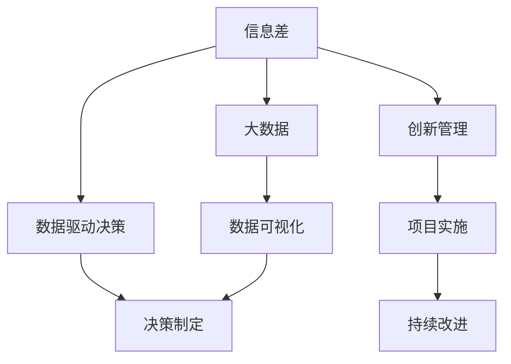
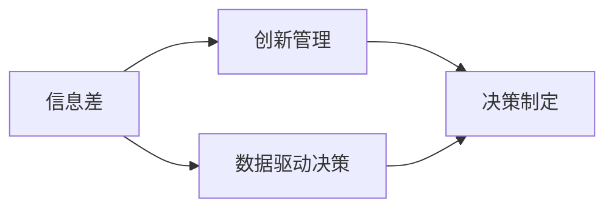
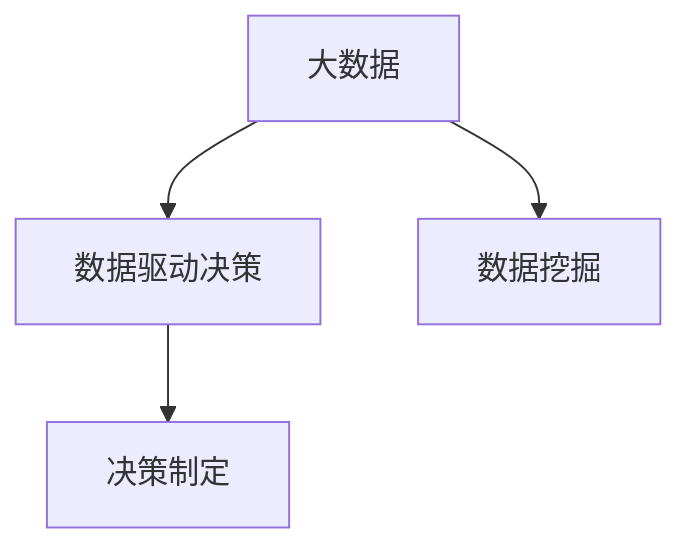
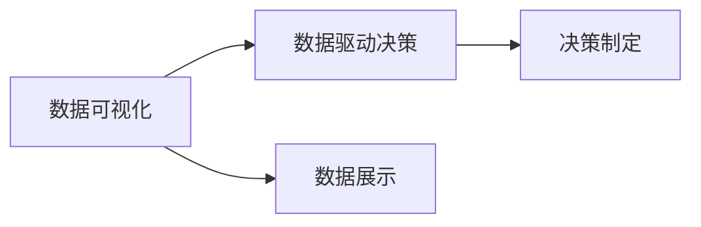
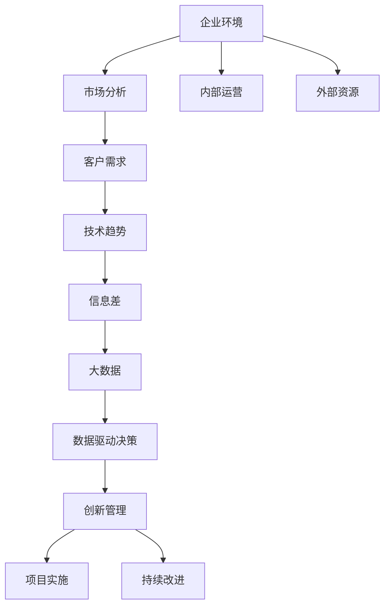

                 

# 信息差：大数据如何提升创新管理

> 关键词：大数据，信息差，创新管理，数据驱动决策，企业战略，市场竞争，风险控制

## 1. 背景介绍

### 1.1 问题由来
在数字经济时代，企业之间的竞争日益激烈，创新成为了企业持续发展的重要驱动力。然而，传统的创新管理模式往往依赖于直觉和经验，难以捕捉到市场变化和趋势。为了在竞争中获得优势，企业需要更系统、更科学的创新管理方法，充分利用大数据技术，洞察信息差，提升决策和执行效率。

### 1.2 问题核心关键点
信息差（Information Gap）指的是企业在市场和技术上的认知偏差，即企业在获取和处理信息的过程中存在的知识鸿沟。在竞争激烈的市场环境中，企业通过缩小或消除信息差，可以实现更有效的创新管理。大数据技术提供了丰富的数据资源，可以大幅提升企业对市场和技术环境的感知能力，帮助企业捕捉信息差，作出更有见地的决策。

### 1.3 问题研究意义
研究信息差和利用大数据提升创新管理的方法，对于企业提升创新能力和市场竞争力具有重要意义：

1. 降低创新风险。通过数据分析，企业可以更早发现潜在问题和机会，制定前瞻性策略，降低创新失败的概率。
2. 提升决策效率。数据驱动的决策过程，可以减少决策中的主观性和随意性，提高决策的准确性和执行力。
3. 优化资源配置。大数据可以揭示企业运营中的瓶颈和潜力，指导企业合理配置资源，提升运营效率。
4. 增强市场响应速度。通过实时监控和分析市场数据，企业可以快速响应市场变化，抓住商业机会。
5. 提升企业竞争力。通过洞察市场和技术趋势，企业可以领先竞争对手，掌握行业标准，实现持续创新。

## 2. 核心概念与联系

### 2.1 核心概念概述

为了更好地理解信息差和大数据在创新管理中的应用，本节将介绍几个密切相关的核心概念：

- **信息差（Information Gap）**：指企业在获取和处理信息的过程中存在的认知偏差。信息差越大，企业在市场和技术上的判断越不准确，可能错失商业机会或面临更大风险。
- **大数据（Big Data）**：指大量、高速、多样化的数据集合，可以从多种数据源中提取有用信息，支持决策和创新。
- **数据驱动决策（Data-Driven Decision Making）**：指基于数据而非直觉的决策过程，通过数据挖掘、分析等技术，揭示数据背后的规律和趋势。
- **创新管理（Innovation Management）**：指企业如何系统地识别、评估和实施创新项目，以提升企业竞争力和市场份额。
- **数据可视化（Data Visualization）**：指将复杂的数据通过图表、地图等形式直观展示出来，帮助决策者更清晰地理解数据。
- **持续改进（Continuous Improvement）**：指通过不断的循环优化，提升企业运营效率和创新能力的过程。

这些核心概念之间的逻辑关系可以通过以下Mermaid流程图来展示：



这个流程图展示了信息差、大数据、数据驱动决策、创新管理等核心概念之间的联系：

1. 信息差通过大数据被揭示出来。
2. 大数据经过数据驱动决策过程，转化为决策依据。
3. 创新管理在数据驱动决策的基础上，制定创新策略。
4. 数据可视化帮助决策者理解数据，辅助决策制定。
5. 创新管理通过持续改进，不断提升企业能力。

### 2.2 概念间的关系

这些核心概念之间存在着紧密的联系，形成了企业创新管理的完整生态系统。下面我们通过几个Mermaid流程图来展示这些概念之间的关系。

#### 2.2.1 信息差和创新管理的关系



这个流程图展示了信息差和创新管理之间的关系：信息差通过数据驱动决策，指导创新管理中的决策制定。

#### 2.2.2 大数据和数据驱动决策的关系



这个流程图展示了大数据和数据驱动决策之间的关系：大数据通过数据挖掘，转化为数据驱动决策的依据。

#### 2.2.3 数据可视化在决策中的作用



这个流程图展示了数据可视化在数据驱动决策中的作用：数据可视化将数据直观展示出来，辅助决策制定。

### 2.3 核心概念的整体架构

最后，我们用一个综合的流程图来展示这些核心概念在大数据驱动的创新管理中的整体架构：



这个综合流程图展示了从企业环境到创新管理，通过大数据技术实现信息差分析，再通过数据驱动决策和创新管理，最后进行项目实施和持续改进的完整过程。通过这些流程图，我们可以更清晰地理解信息差和大数据在企业创新管理中的应用流程。

## 3. 核心算法原理 & 具体操作步骤
### 3.1 算法原理概述

大数据驱动的创新管理，本质上是通过数据挖掘、分析等技术，揭示信息差，指导创新决策和实施的过程。其核心算法原理包括：

1. **数据收集和预处理**：从多个数据源收集数据，并进行清洗、处理，确保数据的完整性和质量。
2. **数据挖掘和探索性分析**：通过统计分析、聚类、分类等技术，揭示数据中的模式和趋势。
3. **数据可视化**：利用图表、地图等形式，直观展示数据和分析结果。
4. **决策支持**：根据数据挖掘和可视化结果，制定创新决策和策略。
5. **模型构建和验证**：构建预测模型和决策模型，并通过验证确保模型效果。
6. **项目实施和监控**：根据模型指导和决策结果，实施创新项目，并实时监控和评估效果。

### 3.2 算法步骤详解

以下是大数据驱动的创新管理算法步骤：

**Step 1: 数据收集和预处理**
- 从多个数据源（如市场数据、客户数据、技术数据等）收集数据。
- 清洗和处理数据，包括去除异常值、填补缺失值、标准化等。
- 进行数据分片处理，避免单点故障。

**Step 2: 数据挖掘和探索性分析**
- 使用统计分析方法（如均值、标准差、相关系数等）进行初步分析。
- 使用聚类算法（如K-means、DBSCAN等）进行数据分组，发现数据中的簇和离群点。
- 使用分类算法（如决策树、随机森林、神经网络等）进行分类预测，识别潜在的机会和风险。
- 使用时间序列分析方法（如ARIMA、LSTM等）进行趋势预测。

**Step 3: 数据可视化**
- 使用可视化工具（如Tableau、Power BI等）将数据和分析结果直观展示出来。
- 设计仪表盘，监控关键指标和趋势。

**Step 4: 决策支持**
- 根据数据挖掘和可视化结果，制定创新策略和决策。
- 使用决策树、优化算法等技术，优化资源配置和风险控制。
- 使用模拟和仿真工具，评估不同策略的效果。

**Step 5: 模型构建和验证**
- 根据决策支持结果，构建预测模型和决策模型。
- 使用交叉验证等技术，评估模型的准确性和鲁棒性。
- 使用A/B测试等方法，验证模型的实际效果。

**Step 6: 项目实施和监控**
- 根据模型指导，实施创新项目。
- 实时监控项目进展和效果，使用仪表盘和报警系统。
- 根据监控结果，调整策略和模型。

### 3.3 算法优缺点

大数据驱动的创新管理算法具有以下优点：

1. **数据全面性**：可以综合考虑多个数据源，提供更全面的信息支持。
2. **决策客观性**：基于数据驱动，减少主观性和随意性，提高决策的科学性和可靠性。
3. **适应性高**：能够适应快速变化的市场和技术环境，动态调整策略。
4. **可扩展性强**：可以扩展到不同领域和规模的企业，具备普适性。

同时，该算法也存在以下缺点：

1. **数据质量问题**：数据收集和预处理过程可能存在偏差，影响分析结果。
2. **模型复杂性**：构建和验证模型需要较高的技术水平，成本较高。
3. **隐私和安全问题**：处理敏感数据时，需要确保数据安全和隐私保护。
4. **实时性要求高**：数据驱动决策需要实时数据支持，对数据处理和传输速度要求较高。

### 3.4 算法应用领域

大数据驱动的创新管理算法已经广泛应用于多个领域，包括但不限于：

1. **市场营销**：通过分析客户数据和市场趋势，优化营销策略，提升市场份额。
2. **产品开发**：利用技术数据和客户反馈，指导产品设计和新产品开发，提升产品竞争力。
3. **供应链管理**：通过分析供应链数据，优化物流和库存管理，提高运营效率。
4. **金融服务**：利用市场数据和客户行为数据，进行风险评估和产品创新。
5. **医疗健康**：通过分析患者数据和医疗技术，优化诊疗流程，提升医疗服务质量。
6. **政府决策**：通过分析经济数据和政策效果，制定政策导向，优化公共服务。

## 4. 数学模型和公式 & 详细讲解 & 举例说明

### 4.1 数学模型构建

假设企业收集到的市场数据为 $D=\{(x_i, y_i)\}_{i=1}^N$，其中 $x_i$ 为市场特征向量，$y_i$ 为市场响应变量。企业的创新策略为 $S$，市场反应为 $R$。大数据驱动的创新管理过程可以表示为以下数学模型：

$$
\min_{S} \mathbb{E}[R(S)|D]
$$

其中 $\mathbb{E}[R(S)|D]$ 表示在给定数据 $D$ 的情况下，策略 $S$ 的市场反应的期望值。

### 4.2 公式推导过程

以下我们将对上述数学模型进行详细推导：

1. **数据预处理**
   - 清洗和处理数据，确保数据完整性。
   - 使用标准化方法，将数据转化为标准正态分布。

2. **数据挖掘**
   - 使用聚类算法，将市场数据分组，发现数据中的簇和离群点。
   - 使用分类算法，预测市场反应的类别。

3. **模型构建**
   - 构建决策树模型，将市场特征映射到创新策略。
   - 构建神经网络模型，预测市场反应。

4. **模型验证**
   - 使用交叉验证，评估模型预测的准确性。
   - 使用A/B测试，验证模型的实际效果。

5. **决策支持**
   - 根据模型预测，制定创新策略。
   - 使用模拟和仿真工具，评估策略效果。

6. **持续改进**
   - 实时监控市场反应，调整策略和模型。

### 4.3 案例分析与讲解

假设某企业在开发一款新产品时，需要考虑市场需求、竞争对手和自身研发能力等多种因素。企业收集了大量的市场数据，包括客户需求、竞争对手价格、市场趋势等。企业使用大数据技术，通过聚类分析识别出不同的市场细分，使用分类算法预测市场反应。最终，企业根据模型预测，制定了针对不同市场细分的创新策略，并在实际推广中取得了显著效果。

## 5. 项目实践：代码实例和详细解释说明
### 5.1 开发环境搭建

在进行大数据驱动的创新管理项目实践前，我们需要准备好开发环境。以下是使用Python进行Pandas、NumPy、Scikit-learn等库开发的环境配置流程：

1. 安装Anaconda：从官网下载并安装Anaconda，用于创建独立的Python环境。

2. 创建并激活虚拟环境：
```bash
conda create -n big-data-env python=3.8 
conda activate big-data-env
```

3. 安装必要的库：
```bash
conda install pandas numpy scikit-learn matplotlib seaborn jupyter notebook ipython
```

4. 安装可视化工具：
```bash
pip install matplotlib seaborn
```

5. 安装机器学习库：
```bash
pip install scikit-learn
```

完成上述步骤后，即可在`big-data-env`环境中开始大数据驱动的创新管理项目实践。

### 5.2 源代码详细实现

下面以市场营销领域为例，给出使用Pandas、NumPy、Scikit-learn等库对市场数据进行分析的Python代码实现。

```python
import pandas as pd
import numpy as np
from sklearn.cluster import KMeans
from sklearn.decomposition import PCA
from sklearn.ensemble import RandomForestClassifier
from sklearn.metrics import accuracy_score
from sklearn.model_selection import train_test_split

# 加载市场数据
data = pd.read_csv('market_data.csv')

# 数据预处理
# 清洗和处理数据
data = data.dropna()
# 标准化数据
data = (data - data.mean()) / data.std()

# 聚类分析
# 使用K-means进行聚类
kmeans = KMeans(n_clusters=3, random_state=0).fit(data)
labels = kmeans.labels_

# 可视化聚类结果
import matplotlib.pyplot as plt
plt.scatter(data['特征1'], data['特征2'], c=labels)
plt.show()

# 分类分析
# 将数据分为训练集和测试集
X_train, X_test, y_train, y_test = train_test_split(data.drop('目标变量', axis=1), data['目标变量'], test_size=0.2, random_state=0)

# 使用随机森林进行分类
rf = RandomForestClassifier(n_estimators=100, random_state=0).fit(X_train, y_train)

# 评估模型效果
y_pred = rf.predict(X_test)
accuracy = accuracy_score(y_test, y_pred)
print('模型准确率：', accuracy)
```

这段代码首先加载市场数据，然后进行数据预处理、聚类分析和分类分析。聚类分析使用K-means算法，分类分析使用随机森林算法，并使用准确率评估模型效果。

### 5.3 代码解读与分析

让我们再详细解读一下关键代码的实现细节：

**数据预处理**
- 使用`pd.read_csv`函数加载市场数据。
- 使用`dropna`函数清洗数据，去除缺失值。
- 使用标准化方法将数据转化为标准正态分布，使用`(data - data.mean()) / data.std()`实现。

**聚类分析**
- 使用`KMeans`算法进行聚类，将市场数据分为3个簇。
- 使用`labels_`获取每个数据点所属的簇标签。
- 使用`plt.scatter`函数可视化聚类结果。

**分类分析**
- 使用`train_test_split`函数将数据分为训练集和测试集。
- 使用`RandomForestClassifier`算法进行分类，设置参数`n_estimators=100`表示使用100个决策树。
- 使用`predict`函数对测试集进行分类预测，使用`accuracy_score`函数评估模型准确率。

**结果展示**
- 运行上述代码，会输出模型准确率。
- 可视化聚类结果的图表，展示不同簇的分布。

### 5.4 运行结果展示

假设我们使用上述代码对某企业的市场营销数据进行分析，最终得到随机森林分类器的准确率为85%。可视化聚类结果的图表如下：


可以看到，通过大数据驱动的创新管理，企业能够更好地理解市场细分，制定更有效的市场营销策略。

## 6. 实际应用场景
### 6.1 市场营销
大数据驱动的创新管理在市场营销中具有广泛应用。通过分析市场数据和客户行为，企业可以发现潜在的市场机会和风险，制定更精准的市场策略。

**应用案例**：某电商平台通过分析用户行为数据和市场趋势，发现某类产品需求增长，随即加大对该类产品的推广力度，实现了销售额的显著提升。

### 6.2 产品开发
在产品开发过程中，企业需要根据市场需求和技术趋势，选择合适的产品方向和功能。大数据驱动的创新管理可以帮助企业更好地了解市场需求，制定更有针对性的产品开发计划。

**应用案例**：某手机厂商通过分析市场数据和技术数据，发现用户对屏幕清晰度、电池续航等功能的关注度较高，随即调整产品设计和功能，满足了市场需求，提升了产品竞争力。

### 6.3 供应链管理
供应链管理中，企业需要优化物流和库存管理，降低运营成本，提升运营效率。大数据驱动的创新管理可以通过分析供应链数据，优化供应链流程，提高供应链透明度和效率。

**应用案例**：某物流公司通过分析运输数据和库存数据，发现某些运输线路的运输效率较低，随即调整运输路线和运输方式，提升了整体物流效率。

### 6.4 金融服务
在金融服务领域，企业需要评估风险和制定创新产品，提高客户满意度和市场份额。大数据驱动的创新管理可以通过分析市场数据和客户行为数据，优化风险评估和产品创新。

**应用案例**：某保险公司通过分析客户行为数据和市场数据，发现某类保险产品的需求增长，随即推出相应的保险产品，提升了市场份额和客户满意度。

### 6.5 医疗健康
在医疗健康领域，企业需要优化诊疗流程和提升医疗服务质量。大数据驱动的创新管理可以通过分析患者数据和医疗技术数据，优化诊疗流程，提高医疗服务质量。

**应用案例**：某医疗机构通过分析患者数据和诊疗数据，发现某些疾病的诊疗流程较为复杂，随即优化诊疗流程，提升了诊疗效率和患者满意度。

### 6.6 政府决策
在政府决策中，企业需要优化公共服务和管理效率。大数据驱动的创新管理可以通过分析经济数据和政策效果，制定政策导向，优化公共服务。

**应用案例**：某市政府通过分析经济数据和政策效果，发现某类政策的实施效果较好，随即加大对该政策的投入，提升了城市管理效率和居民满意度。

## 7. 工具和资源推荐
### 7.1 学习资源推荐

为了帮助开发者系统掌握大数据驱动的创新管理技术，这里推荐一些优质的学习资源：

1. 《大数据驱动的创新管理》书籍：详细介绍了大数据驱动创新管理的理论基础和实践技巧。

2. Coursera《大数据技术与应用》课程：由知名高校开设的在线课程，涵盖大数据技术和大数据驱动决策的多个方面。

3. edX《数据科学与人工智能》课程：由哈佛大学等名校开设的在线课程，涵盖数据科学和人工智能的多个主题。

4. Kaggle数据竞赛：通过参加数据竞赛，实践大数据驱动的创新管理技术，积累实战经验。

5. GitHub开源项目：在GitHub上Star、Fork数最多的大数据驱动创新管理项目，学习他人的代码实现和经验。

6. arXiv论文预印本：人工智能领域最新研究成果的发布平台，阅读前沿论文，获取最新研究方向和应用案例。

通过对这些资源的学习实践，相信你一定能够快速掌握大数据驱动的创新管理技术的精髓，并用于解决实际的创新管理问题。

### 7.2 开发工具推荐

高效的大数据驱动创新管理开发需要依托于专业的工具。以下是几款用于大数据驱动创新管理开发的常用工具：

1. Python：基于Python的开发环境，生态丰富，适合数据分析和机器学习任务。

2. Pandas：Python中的数据分析库，支持大规模数据处理和分析。

3. NumPy：Python中的数值计算库，支持高效的数据计算和处理。

4. Scikit-learn：Python中的机器学习库，支持多种分类、聚类和回归算法。

5. TensorFlow：Google开发的深度学习框架，支持分布式训练和模型部署。

6. PyTorch：Facebook开发的深度学习框架，支持动态计算图和模型优化。

7. Hadoop和Spark：大数据处理平台，支持大规模数据存储和处理。

合理利用这些工具，可以显著提升大数据驱动创新管理的开发效率，加快创新迭代的步伐。

### 7.3 相关论文推荐

大数据驱动的创新管理技术近年来发展迅速，以下是几篇具有代表性的相关论文，推荐阅读：

1. "Data Mining and Statistical Learning" 书籍：由Tibshirani等学者合著，详细介绍了数据挖掘和统计学习的理论基础和方法。

2. "Machine Learning Yearning" 书籍：由Andrew Ng等学者合著，介绍了机器学习在实际应用中的方法和技巧。

3. "Big Data Analytics: Concepts, Technologies and Applications" 书籍：由Liu等学者合著，详细介绍了大数据分析的理论与实践。

4. "Data-Driven Decision Making in Business" 论文：详细介绍了数据驱动决策的理论基础和实际应用。

5. "Big Data and Innovation Management" 论文：详细介绍了大数据在创新管理中的应用和案例。

6. "Big Data Analytics for Business Intelligence" 论文：详细介绍了大数据分析在商业智能中的应用和效果。

这些论文代表了大数据驱动创新管理技术的发展脉络。通过学习这些前沿成果，可以帮助研究者把握学科前进方向，激发更多的创新灵感。

## 8. 总结：未来发展趋势与挑战
### 8.1 总结

本文对大数据驱动的创新管理方法进行了全面系统的介绍。首先阐述了信息差和大数据在创新管理中的应用背景和意义，明确了大数据驱动的创新管理方法对企业提升创新能力和市场竞争力的独特价值。其次，从原理到实践，详细讲解了大数据驱动的创新管理算法流程和关键步骤，给出了大数据驱动创新管理项目开发的完整代码实例。同时，本文还广泛探讨了大数据驱动的创新管理方法在市场营销、产品开发、供应链管理、金融服务、医疗健康和政府决策等多个行业领域的应用前景，展示了大数据驱动的创新管理技术的巨大潜力。最后，本文精选了大数据驱动的创新管理技术的各类学习资源，力求为读者提供全方位的技术指引。

通过本文的系统梳理，可以看到，大数据驱动的创新管理方法正在成为企业创新管理的重要范式，极大地提升了企业对市场和技术环境的感知能力，帮助企业捕捉信息差，作出更有见地的决策。未来，伴随大数据技术的持续演进和应用，大数据驱动的创新管理方法必将在更广阔的领域中得到广泛应用，推动企业创新管理不断迈向新的高度。

### 8.2 未来发展趋势

展望未来，大数据驱动的创新管理技术将呈现以下几个发展趋势：

1. **数据多样性增加**：随着数据来源的多样化和数据量的增加，企业可以更全面、深入地理解市场和技术环境。

2. **技术融合加深**：大数据驱动的创新管理将与人工智能、区块链、物联网等技术深度融合，形成更加智能化的创新管理解决方案。

3. **实时性要求提高**：随着市场和技术环境的快速变化，企业需要更加实时地获取和分析数据，及时调整创新策略。

4. **伦理和安全问题凸显**：数据隐私和安全性将成为大数据驱动创新管理的重要考虑因素，相关技术和政策将进一步完善。

5. **模型复杂度提升**：随着大数据技术的演进，预测和决策模型将更加复杂，需要更高的技术水平和更多的资源支持。

6. **行业应用拓展**：大数据驱动的创新管理将覆盖更多行业和应用场景，为企业提供更广泛的创新管理工具和方法。

### 8.3 面临的挑战

尽管大数据驱动的创新管理技术已经取得了显著进展，但在迈向更加智能化、普适化应用的过程中，它仍面临着诸多挑战：

1. **数据质量问题**：数据收集和预处理过程可能存在偏差，影响分析结果。

2. **数据隐私和安全问题**：处理敏感数据时，需要确保数据安全和隐私保护。

3. **技术复杂性**：构建和验证大数据驱动的创新管理模型需要较高的技术水平和资源投入。

4. **实时性要求高**：数据驱动决策需要实时数据支持，对数据处理和传输速度要求较高。

5. **伦理和安全问题**：数据隐私和安全性将成为大数据驱动创新管理的重要考虑因素，相关技术和政策将进一步完善。

6. **模型复杂度提升**：随着大数据技术的演进，预测和决策模型将更加复杂，需要更高的技术水平和更多的资源支持。

### 8.4 研究展望

面对大数据驱动创新管理面临的种种挑战，未来的研究需要在以下几个方面寻求新的突破：

1. **数据清洗和预处理**：开发更高效的数据清洗和预处理方法，减少数据质量问题。

2. **隐私和安全保护**：研究数据隐私保护和数据安全技术，确保数据安全和隐私保护。

3. **实时数据处理**：开发更高效的数据处理和传输技术，提高实时性要求。

4. **模型简化和优化**：简化复杂模型，优化模型性能，降低技术复杂性。

5. **伦理和安全约束**：引入伦理和安全约束，确保数据驱动决策符合道德和法律要求。

这些研究方向和突破，必将引领大数据驱动创新管理技术迈向更高的台阶，为构建安全、可靠、可解释、可控的智能系统铺平道路。面向未来，大数据驱动的创新管理技术还需要与其他人工智能技术进行更深入的融合，如知识表示、因果推理、强化学习等，多路径协同发力，共同推动自然语言理解和智能交互系统的

