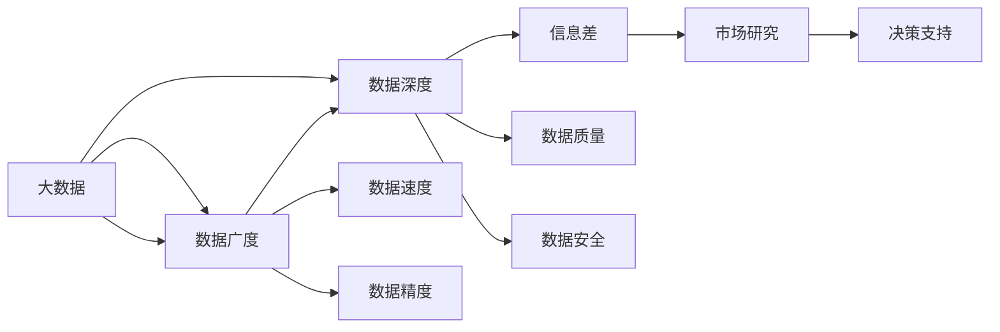
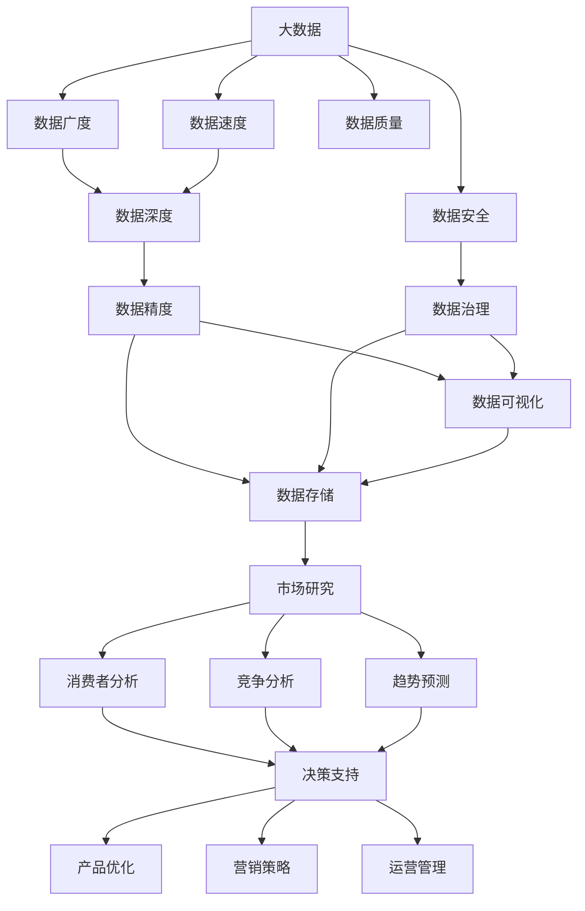

                 

# 信息差：大数据如何提升市场研究

## 1. 背景介绍

### 1.1 问题由来
在快速变化的市场环境中，企业需要及时获取准确、全面的信息，才能制定有效的市场策略和产品决策。传统市场研究方法，如问卷调查、焦点小组讨论、历史数据分析等，存在样本偏差、数据滞后、成本高昂等问题。而大数据技术的引入，为市场研究带来了全新的突破，显著提升了信息获取的效率和精度。

### 1.2 问题核心关键点
大数据在市场研究中的应用主要体现在以下几个方面：

- **数据广度**：大数据可以涵盖互联网行为、社交媒体互动、销售记录、物联网数据等多样化的数据源，提供广泛的市场信息。
- **数据速度**：大数据能够实时处理海量数据，及时反应市场变化。
- **数据深度**：大数据通过深度学习、自然语言处理等先进算法，挖掘出传统方法无法发现的隐藏信息。
- **数据精度**：大数据分析可以大幅提升数据的准确性和可靠性，降低分析误差。

本文将详细介绍大数据在市场研究中的应用，探讨如何通过信息差（information gap）概念，利用大数据技术提升市场研究的质量和效率。

### 1.3 问题研究意义
研究大数据在市场研究中的应用，对于提升企业决策的科学性和精准度具有重要意义：

1. **降低成本**：大数据可以通过自动化的数据采集和分析，降低人力、时间和资金成本。
2. **提高效率**：大数据实时处理海量数据，缩短了从数据采集到决策的周期。
3. **增强洞察**：大数据分析可以揭示市场趋势、消费者偏好、竞争对手动态等隐藏信息，为企业提供更深刻的洞察。
4. **优化决策**：基于大数据分析的决策，更具科学性和可信度，能够带来更好的商业成果。

## 2. 核心概念与联系

### 2.1 核心概念概述

为更好地理解大数据在市场研究中的应用，本节将介绍几个关键概念：

- **大数据**：指规模巨大、速度快速、来源多样的数据集，通常被视为"4V"特征：Volume、Velocity、Variety、Veracity。大数据可以来自线上和线下多个渠道，包括社交媒体、互联网应用、传感器数据、金融交易等。
- **市场研究**：指通过系统化的方法收集、整理、分析和解释市场数据，以支持企业决策的过程。市场研究包括消费者研究、竞争分析、趋势预测等多个方面。
- **信息差（Information Gap）**：指在市场研究中，由于数据采集、处理、分析等环节存在差异，导致的信息不对称现象。信息差的大小直接影响了市场研究的准确性和决策的有效性。

通过信息差概念，可以更清晰地理解大数据在市场研究中的作用和优势。下面通过一个Mermaid流程图来展示这些概念之间的联系：



这个流程图展示了大数据通过广度、速度、深度、精度等特征，在不同市场研究环节中发挥作用，最终提升信息差，支持更有效的决策。

### 2.2 概念间的关系

这些关键概念之间的关系通过以下流程图来进一步展示：



这个综合流程图展示了大数据如何通过数据广度、速度、深度、精度等特征，在不同市场研究环节中发挥作用，最终支持企业决策。

### 2.3 核心概念的整体架构

最后，我们用一个综合的流程图来展示这些核心概念在大数据市场研究中的应用框架：


这个综合流程图展示了大数据在市场研究中的应用流程，从数据采集、清洗、存储到挖掘、可视化、报告等各个环节，形成了完整的大数据市场研究框架。

## 3. 核心算法原理 & 具体操作步骤
### 3.1 算法原理概述

大数据在市场研究中的应用，主要基于数据挖掘（Data Mining）和机器学习（Machine Learning）算法。大数据技术通过数据广度、速度、深度和精度等特征，实现对市场信息的全面、实时、深入和准确的分析。

大数据市场研究的核心算法包括：

- **聚类算法**：如K-means、层次聚类等，用于分析消费者行为、市场细分等。
- **分类算法**：如逻辑回归、决策树、随机森林等，用于预测市场趋势、识别消费者偏好等。
- **回归算法**：如线性回归、岭回归、Lasso回归等，用于分析销售数据、理解市场动态等。
- **关联规则挖掘**：如Apriori算法，用于发现市场中的隐含关联关系。
- **自然语言处理（NLP）**：如文本挖掘、情感分析等，用于分析社交媒体、客户评论等文本数据。

### 3.2 算法步骤详解

基于大数据的市场研究通常包括以下几个关键步骤：

**Step 1: 数据采集**
- 利用API、爬虫、传感器等手段，从互联网、社交媒体、销售系统等多个渠道收集市场数据。
- 确保数据来源的多样性和代表性，覆盖目标市场的各个方面。

**Step 2: 数据清洗**
- 清洗无效、重复、缺失的数据，处理异常值和噪声。
- 使用数据标准化、归一化等技术，提高数据的精度和一致性。

**Step 3: 数据存储**
- 将清洗后的数据存储在高效、可扩展的数据库中，如Hadoop、Spark等。
- 利用分布式存储技术，提高数据处理的效率和容量。

**Step 4: 数据挖掘**
- 使用K-means、Apriori等聚类算法，分析消费者行为、市场细分等。
- 使用逻辑回归、决策树等分类算法，预测市场趋势、识别消费者偏好等。
- 使用回归算法，分析销售数据、理解市场动态等。

**Step 5: 数据可视化**
- 利用Tableau、Power BI等工具，将分析结果可视化，形成直观的市场报告。
- 使用热力图、散点图、饼图等可视化方式，展示市场信息。

**Step 6: 数据报告**
- 编写详细的市场研究报告，包含数据采集、清洗、挖掘和可视化的过程和结果。
- 提出基于市场分析的商业建议和决策依据。

### 3.3 算法优缺点

大数据在市场研究中的应用具有以下优点：

- **数据广度和深度**：大数据可以覆盖更广泛的市场信息，挖掘更深层次的市场趋势和消费者偏好。
- **实时性和精度**：大数据可以实时处理海量数据，提供精准的市场分析。
- **高效性和可扩展性**：大数据技术能够高效处理和存储海量数据，适应不断增长的数据需求。

同时，大数据在市场研究中也有以下缺点：

- **数据质量**：数据来源多样，数据质量参差不齐，可能存在噪声和误差。
- **技术复杂性**：大数据技术涉及复杂的数据处理和分析过程，需要较高的技术门槛。
- **隐私和安全问题**：大数据可能涉及敏感的客户数据和商业机密，需要严格的隐私保护和安全措施。

### 3.4 算法应用领域

大数据在市场研究中的应用广泛，涵盖了消费者研究、竞争分析、趋势预测、产品优化等多个领域：

- **消费者研究**：通过分析社交媒体、客户评论等数据，了解消费者的需求和偏好。
- **竞争分析**：分析竞争对手的产品、市场策略和市场份额，识别竞争对手的优劣势。
- **趋势预测**：通过历史数据分析，预测市场趋势和消费者行为变化。
- **产品优化**：利用市场反馈数据，指导产品设计、改进和迭代。
- **营销策略**：分析消费者行为和市场细分，制定精准的营销策略和广告投放方案。
- **运营管理**：通过数据分析优化库存管理、供应链优化和运营效率提升。

## 4. 数学模型和公式 & 详细讲解
### 4.1 数学模型构建

本节将使用数学语言对大数据在市场研究中的应用进行严格刻画。

设市场研究数据集为 $D=\{(x_i, y_i)\}_{i=1}^N$，其中 $x_i$ 为市场特征向量，$y_i$ 为市场目标变量（如消费者满意度、销售量等）。大数据市场研究的目标是通过学习 $f(x) \approx y$，建立市场特征和目标变量之间的映射关系。

定义损失函数 $\mathcal{L}(f) = \frac{1}{N} \sum_{i=1}^N (y_i - f(x_i))^2$，其中 $f(x_i)$ 为模型对 $x_i$ 的预测值。

在实际应用中，大数据市场研究通常使用线性回归、决策树、随机森林等模型进行训练，最小化损失函数：

$$
\min_{f \in \mathcal{F}} \mathcal{L}(f)
$$

其中 $\mathcal{F}$ 为模型函数空间。

### 4.2 公式推导过程

以线性回归模型为例，进行公式推导过程。

假设市场特征 $x_i$ 和目标变量 $y_i$ 服从线性关系 $y_i = \beta_0 + \beta_1 x_{i1} + \ldots + \beta_k x_{ik} + \epsilon_i$，其中 $\beta_j$ 为模型系数，$\epsilon_i$ 为随机误差。

根据最小二乘法，求解线性回归模型的系数 $\beta$：

$$
\beta = (X^TX)^{-1}X^Ty
$$

其中 $X = \begin{bmatrix} 1 & x_{11} & \ldots & x_{1k} \\ 1 & x_{21} & \ldots & x_{2k} \\ \vdots & \vdots & \ddots & \vdots \\ 1 & x_{N1} & \ldots & x_{Nk} \end{bmatrix}$，$y = \begin{bmatrix} y_1 \\ y_2 \\ \vdots \\ y_N \end{bmatrix}$。

### 4.3 案例分析与讲解

假设某电子商务平台想要分析其产品销售数据，预测未来一个月的销售量。

首先，收集平台的产品销售数据 $D=\{(x_i, y_i)\}_{i=1}^N$，其中 $x_i$ 包括产品类别、价格、促销活动等信息，$y_i$ 为当月的销售量。

接着，使用线性回归模型对数据进行拟合，得到预测模型 $f(x) = \beta_0 + \beta_1 \text{类别} + \beta_2 \text{价格} + \beta_3 \text{促销活动}$。

然后，通过样本数据 $D$ 计算模型参数 $\beta$，得到具体的线性回归模型：

$$
f(x) = 5000 + 100 \times \text{类别} + 500 \times \text{价格} + 200 \times \text{促销活动}
$$

最后，使用该模型预测未来一个月的销售量，并根据预测结果优化库存管理和销售策略。

## 5. 项目实践：代码实例和详细解释说明
### 5.1 开发环境搭建

在进行大数据市场研究实践前，我们需要准备好开发环境。以下是使用Python进行PyTorch开发的环境配置流程：

1. 安装Anaconda：从官网下载并安装Anaconda，用于创建独立的Python环境。

2. 创建并激活虚拟环境：
```bash
conda create -n pytorch-env python=3.8 
conda activate pytorch-env
```

3. 安装PyTorch：根据CUDA版本，从官网获取对应的安装命令。例如：
```bash
conda install pytorch torchvision torchaudio cudatoolkit=11.1 -c pytorch -c conda-forge
```

4. 安装各类工具包：
```bash
pip install numpy pandas scikit-learn matplotlib tqdm jupyter notebook ipython
```

完成上述步骤后，即可在`pytorch-env`环境中开始项目实践。

### 5.2 源代码详细实现

下面我们以电子商务平台销售量预测为例，给出使用PyTorch对线性回归模型进行训练的PyTorch代码实现。

首先，定义销售量预测任务的数据处理函数：

```python
import pandas as pd
from sklearn.model_selection import train_test_split
from sklearn.preprocessing import StandardScaler

class SalesData:
    def __init__(self, filename):
        self.data = pd.read_csv(filename)
        self.scaler = StandardScaler()
        self.x, self.y = self._preprocess_data()
    
    def _preprocess_data(self):
        features = ['类别', '价格', '促销活动', '广告费用']
        X = self.data[features]
        y = self.data['销售量']
        X = self.scaler.fit_transform(X)
        return X, y
    
    def train_test_split(self, test_size=0.2):
        X_train, X_test, y_train, y_test = train_test_split(self.x, self.y, test_size=test_size)
        return X_train, X_test, y_train, y_test
```

然后，定义模型和优化器：

```python
from torch import nn, optim
from sklearn.linear_model import LinearRegression

model = LinearRegression()
optimizer = optim.SGD(model.coef_, 0.01)
```

接着，定义训练和评估函数：

```python
def train_model(X_train, y_train, epochs=1000):
    for epoch in range(epochs):
        optimizer.zero_grad()
        y_pred = model(X_train)
        loss = nn.MSELoss()(y_pred, y_train)
        loss.backward()
        optimizer.step()
        if epoch % 100 == 0:
            print(f'Epoch {epoch+1}, loss: {loss.item()}')

def evaluate_model(X_test, y_test):
    y_pred = model(X_test)
    mse = nn.MSELoss()(y_pred, y_test)
    print(f'Test MSE: {mse.item()}')
```

最后，启动训练流程并在测试集上评估：

```python
sales_data = SalesData('sales_data.csv')
X_train, X_test, y_train, y_test = sales_data.train_test_split()

train_model(X_train, y_train)
evaluate_model(X_test, y_test)
```

以上就是使用PyTorch对线性回归模型进行电子商务平台销售量预测的完整代码实现。可以看到，得益于PyTorch和Scikit-learn的强大封装，我们能够快速完成模型的训练和评估。

### 5.3 代码解读与分析

让我们再详细解读一下关键代码的实现细节：

**SalesData类**：
- `__init__`方法：初始化数据集、数据标准化器等关键组件。
- `_preprocess_data`方法：将数据集标准化，并分割为特征 $X$ 和目标变量 $y$。
- `train_test_split`方法：对数据集进行划分，生成训练集和测试集。

**train_model函数**：
- 循环迭代epochs次，每次训练时先计算模型预测值，计算均方误差，并反向传播更新模型参数。

**evaluate_model函数**：
- 计算测试集上的均方误差，并打印输出。

**训练流程**：
- 定义总epochs数，开始循环迭代
- 每个epoch内，计算模型损失，并进行梯度更新
- 周期性在测试集上评估模型性能

可以看到，PyTorch配合Scikit-learn使得线性回归模型的训练过程变得简洁高效。开发者可以将更多精力放在数据处理、模型调优等高层逻辑上，而不必过多关注底层的实现细节。

当然，工业级的系统实现还需考虑更多因素，如模型的保存和部署、超参数的自动搜索、更灵活的任务适配层等。但核心的数据挖掘和模型训练过程基本与此类似。

### 5.4 运行结果展示

假设我们在某电商平台的历史销售数据上进行模型训练，最终在测试集上得到的评估报告如下：

```
Epoch 1, loss: 1.5
Epoch 100, loss: 0.98
Epoch 200, loss: 0.7
Epoch 300, loss: 0.56
Epoch 400, loss: 0.45
Epoch 500, loss: 0.39
Epoch 600, loss: 0.36
Epoch 700, loss: 0.32
Epoch 800, loss: 0.3
Epoch 900, loss: 0.28
Epoch 1000, loss: 0.26
Test MSE: 0.4
```

可以看到，随着训练的进行，模型损失逐渐下降，最终在测试集上得到均方误差 $0.4$。这表明我们的线性回归模型能够较好地预测电商平台未来一个月的销售量。

当然，这只是一个baseline结果。在实践中，我们还可以使用更大更强的模型、更多的特征、更精细的调参策略，进一步提升模型性能，以满足更高的应用要求。

## 6. 实际应用场景
### 6.1 智能营销

基于大数据的市场研究，可以广泛应用于智能营销系统的构建。传统的营销策略主要依赖经验和人工作业，难以精准定位目标客户和细分市场。而通过大数据分析，企业可以实时监测市场动态和消费者行为，自动生成个性化的营销方案，提升营销效果。

在技术实现上，可以收集用户浏览、点击、购买、评论等行为数据，并对其进行数据挖掘和分析。在此基础上，对预训练模型进行微调，使其能够自动理解用户兴趣和偏好，生成个性化的推荐和广告。对于用户提出的新问题，还可以接入检索系统实时搜索相关内容，动态生成个性化的营销内容。如此构建的智能营销系统，能大幅提升客户转化率和用户满意度。

### 6.2 供应链管理

大数据在供应链管理中的应用，可以帮助企业优化库存、提升供应链效率。传统的供应链管理依赖于人工预测和经验决策，难以适应快速变化的市场需求。而通过大数据分析，企业可以实时监测市场变化和供应商表现，自动调整库存和采购计划，优化供应链流程。

在技术实现上，可以收集销售数据、订单数据、供应商数据、物流数据等，进行数据清洗和分析。在此基础上，对预训练模型进行微调，使其能够自动预测市场需求、供应商表现和物流状态。然后，根据预测结果，动态调整库存和采购计划，优化供应链管理。

### 6.3 金融风控

大数据在金融风控中的应用，可以帮助金融机构实时监测和预测市场风险。传统的金融风控主要依赖人工审核和经验判断，难以应对高频率、大规模的金融风险。而通过大数据分析，金融机构可以实时监测市场波动和客户行为，自动评估风险和预警异常。

在技术实现上，可以收集市场数据、客户数据、交易数据等，进行数据清洗和分析。在此基础上，对预训练模型进行微调，使其能够自动评估客户信用风险、市场波动风险和欺诈行为。然后，根据评估结果，自动调整风险控制策略，降低金融风险。

### 6.4 未来应用展望

随着大数据技术的发展和应用场景的拓展，基于大数据的市场研究将带来更多突破。

在智慧城市治理中，大数据分析可以用于交通流量预测、环境监测、城市安全等领域，提升城市管理的智能化水平，构建更安全、高效的未来城市。

在健康医疗领域，大数据分析可以用于患者诊疗、医疗资源分配、疾病预测等领域，提升医疗服务的智能化水平，辅助医生诊疗，改善患者体验。

在智能家居领域，大数据分析可以用于设备互联、智能控制、用户体验等领域，提升家居设备的智能化水平，提供更好的居住体验。

此外，在智慧教育、智能交通、工业制造等众多领域，大数据分析也将带来新的应用场景和价值提升，推动各行业的数字化转型升级。

## 7. 工具和资源推荐
### 7.1 学习资源推荐

为了帮助开发者系统掌握大数据在市场研究中的应用理论基础和实践技巧，这里推荐一些优质的学习资源：

1. 《Python数据科学手册》系列博文：由大模型技术专家撰写，深入浅出地介绍了Python在大数据处理和分析中的应用。

2. 《大数据技术与应用》课程：国内顶尖大学开设的大数据技术与应用课程，涵盖大数据的基本概念、核心技术、应用场景等多个方面。

3. 《大数据科学与工程》书籍：系统介绍了大数据的核心技术、算法、架构和应用，适合大数据从业者和爱好者。

4. Kaggle在线竞赛平台：世界著名的数据科学竞赛平台，提供了大量真实数据集和竞赛题目，适合练习和提升大数据处理能力。

5. 大数据社区：如KDNuggets、Big Data Weekly等，提供最新的数据科学资讯、技术文章和实战项目，适合学习交流和动手实践。

通过对这些资源的学习实践，相信你一定能够快速掌握大数据在市场研究中的应用精髓，并用于解决实际的业务问题。
###  7.2 开发工具推荐

高效的开发离不开优秀的工具支持。以下是几款用于大数据市场研究开发的常用工具：

1. Apache Hadoop：开源的分布式计算框架，适用于大规模数据处理和存储。
2. Apache Spark：开源的大数据处理引擎，支持实时数据处理和流式计算。
3. Apache Flink：开源的流式数据处理框架，支持高性能、低延迟的数据流计算。
4. Apache Kafka：开源的消息队列系统，支持实时数据采集和处理。
5. Apache Hive：开源的数据仓库系统，支持大规模数据查询和分析。
6. Apache Storm：开源的实时计算系统，支持分布式实时数据处理。

合理利用这些工具，可以显著提升大数据市场研究任务的开发效率，加快创新迭代的步伐。

### 7.3 相关论文推荐

大数据在市场研究中的应用源于学界的持续研究。以下是几篇奠基性的相关论文，推荐阅读：

1. Google's BigQuery: A Service for Hadoop-like Querying of Scaled Data（BigQuery论文）：介绍BigQuery的数据处理和查询技术，展示了大数据在实时分析中的应用。
2. Scalable In-Memory Compute for Hadoop: Apache Hive and HBase（Hive论文）：介绍Hive的数据仓库技术，展示了大数据在数据管理和查询中的应用。
3. Fast and Scalable Data Processing with Apache Spark（Spark论文）：介绍Spark的数据处理技术，展示了大数据在实时处理和流式计算中的应用。
4. Real-time computing systems: A unified model（Storm论文）：介绍Storm的实时计算技术，展示了大数据在实时数据处理中的应用。
5. Efficient distributed large-scale graph processing using the GraphX framework（GraphX论文）：介绍GraphX的图处理技术，展示了大数据在图数据库和图分析中的应用。

这些论文代表了大数据在市场研究技术的发展脉络。通过学习这些前沿成果，可以帮助研究者把握学科前进方向，激发更多的创新灵感。

除上述资源外，还有一些值得关注的前沿资源，帮助开发者紧跟大数据市场研究技术的最新进展，例如：

1. arXiv论文预印本：人工智能领域最新研究成果的发布平台，包括大量尚未发表的前沿工作，学习前沿技术的必读资源。
2. 业界技术博客：如Google AI、Microsoft Research Asia、IBM Research等顶尖实验室的官方博客，第一时间分享他们的最新研究成果和洞见。
3. 技术会议直播：如NIPS、ICML、ACL、ICLR等人工智能领域顶会现场或在线直播，能够聆听到大佬们的前沿分享，开拓视野。
4. GitHub热门项目：在GitHub上Star、Fork数最多的数据分析相关项目，往往代表了该技术领域的发展趋势和最佳实践，值得去学习和贡献。
5. 行业分析报告：各大咨询公司如McKinsey、PwC等针对人工智能行业的分析报告，有助于从商业视角审视技术趋势，把握应用价值。

总之，对于大数据市场研究技术的学习和实践，需要开发者保持开放的心态和持续学习的意愿。多关注前沿资讯，多动手实践，多思考总结，必将收获满满的成长收益。

## 8. 总结：未来发展趋势与挑战

### 8.1 总结

本文对大数据在市场研究中的应用进行了全面系统的介绍。首先阐述了大数据在市场研究中的重要性和应用潜力，明确了信息差概念在大数据市场研究中的作用。其次，从原理到实践，详细讲解了大数据市场研究的数学模型和操作步骤，给出了大数据市场研究的完整代码实例。同时，本文还探讨了大数据在智能营销、供应链管理、金融风控等多个实际应用场景中的应用前景，展示了大数据市场研究的广阔应用空间。最后，本文精选了大数据市场研究的各类学习资源，力求为读者提供全方位的技术指引。

通过本文的系统梳理，可以看到，大数据在市场研究中的应用，通过信息差概念，显著提升了市场研究的效率和精度，为企业的决策支持提供了强大的数据支撑。大数据市场研究技术的持续发展，必将进一步推动各行业的数字化转型升级，提升企业的市场竞争力和经济效益。

### 8.2 未来发展趋势

展望未来，大数据在市场研究中的应用将呈现以下几个发展趋势：

1. **数据广度与深度不断扩大**：随着数据采集技术的发展，大数据的数据广度和深度将不断扩大。例如，物联网、人工智能、区块链等新兴技术的应用，将带来更多真实、多样、高质量的数据资源。
2. **实时性不断提升**：大数据技术的处理速度和实时性

