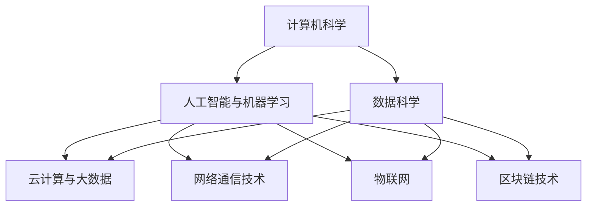
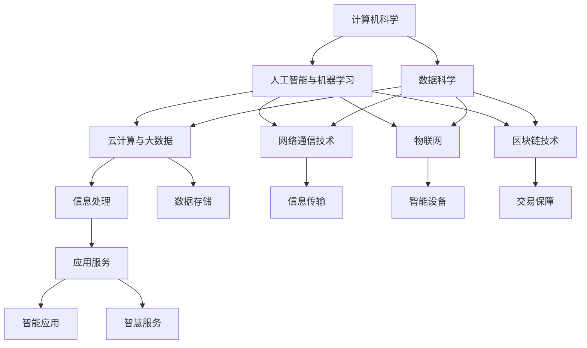

                 

# 信息技术与互联网发展趋势

## 1. 背景介绍

### 1.1 问题由来
信息技术与互联网的发展已经深刻改变了人类社会的方方面面，从生产方式到日常生活，从经济结构到社会治理，都在经历前所未有的变革。随着数字技术的不断进步，信息通信技术（ICT）的广泛应用，互联网逐渐成为现代社会的重要基础设施，推动着社会生产力和生活水平的提升。

### 1.2 问题核心关键点
信息技术与互联网的迅速发展，离不开计算机科学的基础研究和技术创新。从算法设计到硬件优化，从网络协议到应用开发，每个环节的突破都推动了信息技术与互联网的演进。当前，全球正处于数字经济和智能社会的快速发展时期，新一轮科技革命和产业变革正在加速推进。

### 1.3 问题研究意义
研究信息技术与互联网的发展趋势，对于把握科技前沿、指导产业应用、促进经济社会转型具有重要意义：

1. 引领科技创新。了解技术发展方向，有助于制定科学合理的研发策略，推动关键技术突破，引领信息技术和互联网的未来。
2. 促进产业升级。分析行业趋势，指导传统产业数字化转型，提升生产效率和服务质量，促进经济结构优化。
3. 支撑社会进步。掌握社会应用动向，促进智慧城市、智慧教育、智慧医疗等领域的创新应用，提升社会治理水平，改善民众生活质量。
4. 引导政策制定。通过深入分析，为政府制定信息技术与互联网相关政策提供数据和建议，推动政策落实和效果评估。
5. 推动学术交流。研究成果可促进国内外学术交流，提高科技影响力，加速全球技术合作。

## 2. 核心概念与联系

### 2.1 核心概念概述

信息技术与互联网的发展涉及到众多关键概念和技术，主要包括：

- 计算机科学：研究计算的本质和算法，开发计算工具，为信息技术与互联网提供基础理论和技术支持。
- 数据科学：通过数据收集、处理和分析，发现和提取有用信息，为决策提供依据。
- 人工智能与机器学习：构建智能系统，模拟人类智能行为，实现自主学习和推理。
- 云计算与大数据：提供弹性计算资源，存储和分析海量数据，支持信息处理和知识挖掘。
- 网络通信技术：开发和优化网络协议，实现数据的高效传输和通信。
- 物联网：连接物理世界，实现物与物的互联互通，推动工业互联网、智能家居等应用。
- 区块链技术：利用去中心化账本，保障数据安全和交易透明，应用于金融、供应链等场景。

这些概念和技术相互关联，共同构成了信息技术与互联网的完整生态，推动着技术的不断进步和应用拓展。

### 2.2 概念间的关系

这些核心概念之间存在着紧密的联系，形成一个有机整体。通过以下Mermaid流程图，我们可以更清晰地理解它们之间的关系：



这个流程图展示了信息技术和互联网的主要组成部分及其相互作用。计算机科学为数据处理和算法设计提供基础，数据科学通过数据挖掘和分析，为决策提供依据，人工智能和机器学习实现智能系统的构建，云计算和大数据为信息处理和存储提供平台，网络通信技术实现数据的高效传输，物联网和区块链技术则将信息技术和互联网扩展到物理世界和交易场景中。

### 2.3 核心概念的整体架构

最后，我们用一个综合的流程图来展示这些核心概念在大信息技术与互联网生态系统中的整体架构：



这个综合流程图展示了信息技术和互联网在多个层面的应用，包括信息处理、数据存储、信息传输、智能设备、交易保障、应用服务和智慧服务。这些组成部分通过技术手段紧密连接，共同构建了信息技术与互联网的庞大网络，为各行各业提供支持。

## 3. 核心算法原理 & 具体操作步骤

### 3.1 算法原理概述

信息技术与互联网的发展依赖于诸多算法技术的创新和优化。这些算法构成了信息技术与互联网的核心，推动了技术应用的不断演进。以下是几个关键算法的原理概述：

- 人工智能与机器学习算法：通过数据训练模型，实现预测、分类、聚类等任务，推动智能应用的发展。
- 网络通信算法：优化数据传输协议，提高网络性能和可靠性，支持大规模数据传输。
- 云计算和大数据算法：实现海量数据的存储和处理，提高计算效率和数据挖掘能力，推动智能分析和决策。
- 物联网和区块链算法：实现物理世界和交易场景的连接与协作，保障数据安全和透明性。

这些算法相互支持，共同推动了信息技术与互联网的进步。

### 3.2 算法步骤详解

信息技术与互联网的发展和应用，涉及多个环节和步骤，具体包括：

1. **需求分析**：确定信息需求和应用场景，明确信息系统的目标和功能。
2. **技术选择**：根据需求选择适当的技术方案，确定系统架构和关键组件。
3. **系统设计**：设计系统模块和数据流，确保信息系统的稳定性和可扩展性。
4. **开发实现**：进行系统编码和测试，确保系统的正确性和性能。
5. **部署部署**：将系统部署到生产环境，进行监控和维护，确保系统稳定运行。
6. **优化升级**：根据反馈和需求变化，进行系统优化和升级，提升系统性能和功能。

这些步骤相互关联，每个环节都可能涉及多个算法和技术手段，需要综合考虑和协调。

### 3.3 算法优缺点

信息技术与互联网的算法技术各具优势和局限性：

- **优点**：
  - 数据驱动：算法技术可以高效处理和分析海量数据，提取有价值的信息，推动决策科学化。
  - 智能应用：通过学习模型，实现自主学习和推理，支持复杂的智能应用场景。
  - 高效传输：优化网络通信协议，提高数据传输速度和可靠性，支持大规模数据传输。
  - 安全性高：通过区块链等技术，保障数据安全和交易透明性，防止信息泄露和欺诈。

- **缺点**：
  - 计算资源消耗高：大规模数据处理和复杂算法模型，需要大量的计算资源，可能影响系统性能。
  - 数据隐私问题：数据采集和存储可能涉及隐私和安全问题，需要严格保护。
  - 技术复杂度高：算法技术需要较高的专业知识和技能，推广和应用难度较大。
  - 易受攻击：系统可能面临各种网络攻击，如DDoS、SQL注入等，需要加强防护。

了解这些优缺点，有助于选择合适的算法和技术方案，进行系统设计和开发。

### 3.4 算法应用领域

信息技术与互联网的算法技术广泛应用于多个领域，具体包括：

1. **智慧城市**：通过物联网、云计算和大数据，实现城市管理和服务的智能化，提升城市治理水平。
2. **智慧医疗**：通过人工智能与机器学习，实现病患诊断、治疗和康复的智能化，提升医疗服务质量。
3. **智慧教育**：通过数据分析和智能推荐，提供个性化教育和培训，提升教学效果和学习体验。
4. **智慧金融**：通过区块链和智能合约，实现金融交易的透明性和安全性，提升金融服务效率。
5. **智慧农业**：通过物联网和智能设备，实现农业生产的智能化和自动化，提升农业生产效率和产品质量。
6. **智慧制造**：通过工业互联网和人工智能，实现制造业的数字化和智能化，提升生产效率和产品质量。

这些领域的应用，推动了信息技术与互联网的广泛普及和深入应用，提升了社会生产力和生活水平。

## 4. 数学模型和公式 & 详细讲解 & 举例说明

### 4.1 数学模型构建

在信息技术与互联网的开发中，数学模型和公式是不可或缺的工具。以下是几个典型的数学模型：

- **线性回归模型**：用于预测连续变量的值，公式为 $y = \beta_0 + \beta_1 x_1 + \beta_2 x_2 + \cdots + \beta_n x_n + \epsilon$，其中 $y$ 为预测值，$x_1, x_2, \cdots, x_n$ 为特征变量，$\beta_0, \beta_1, \beta_2, \cdots, \beta_n$ 为回归系数，$\epsilon$ 为随机误差。
- **决策树模型**：用于分类和预测，通过树形结构进行决策，公式为 $T = \{r, A, \{T_l, T_r\}\}$，其中 $r$ 为节点，$A$ 为属性，$T_l, T_r$ 为子树。
- **支持向量机模型**：用于分类和回归，通过最大化分类间隔，公式为 $w \cdot x + b = 0$，其中 $w$ 为权重向量，$b$ 为偏置，$x$ 为输入数据。
- **深度学习模型**：用于处理复杂非线性关系，通过多层神经网络进行训练，公式为 $f(x) = \sigma(Wx + b)$，其中 $f(x)$ 为输出，$\sigma$ 为激活函数，$W$ 为权重矩阵，$b$ 为偏置向量。

这些模型通过数学公式表达了数据处理和算法逻辑，为信息技术与互联网的开发和应用提供了理论基础。

### 4.2 公式推导过程

以下是几个典型公式的推导过程：

- **线性回归公式推导**：
  - **最小二乘法**：通过最小化误差平方和，求解最优系数 $\beta_0, \beta_1, \cdots, \beta_n$，公式为 $\hat{\beta} = (X^TX)^{-1}X^Ty$，其中 $X$ 为特征矩阵，$y$ 为标签向量，$\hat{\beta}$ 为最优系数。
  - **正规方程法**：通过求解线性方程组，求解最优系数 $\beta_0, \beta_1, \cdots, \beta_n$，公式为 $\hat{\beta} = (X^TX)^{-1}X^Ty$，其中 $X$ 为特征矩阵，$y$ 为标签向量，$\hat{\beta}$ 为最优系数。

- **决策树公式推导**：
  - **信息增益**：通过计算信息增益，选择最优属性进行划分，公式为 $IG(D) = \sum_{i=1}^{n} \frac{|D_i|}{|D|} \log_2\frac{|D_i|}{|D|}$，其中 $D$ 为数据集，$D_i$ 为子集，$IG(D)$ 为信息增益。
  - **基尼指数**：通过计算基尼指数，选择最优属性进行划分，公式为 $Gini(D) = 1 - \sum_{i=1}^{n} p_i^2$，其中 $p_i$ 为子集 $D_i$ 在数据集 $D$ 中的比例。

- **支持向量机公式推导**：
  - **拉格朗日乘子法**：通过求解优化问题，求解最优系数 $\alpha$ 和 $\lambda$，公式为 $\alpha = \left[\frac{1}{2\lambda} + \frac{1}{2}\sum_{i=1}^{N} \alpha_iy_ix_i\right]^{-1}$，其中 $\alpha$ 为拉格朗日乘子，$y_i$ 为标签，$x_i$ 为输入数据，$\lambda$ 为正则化参数。
  - **合页损失函数**：通过最小化合页损失函数，求解最优系数 $\alpha$，公式为 $\frac{1}{2}\|w\|^2 - \sum_{i=1}^{N}\alpha_i(y_ix_i - w^Tx_i + b) - \frac{1}{2}\sum_{i=1}^{N}\alpha_i^2$，其中 $w$ 为权重向量，$b$ 为偏置，$\alpha_i$ 为拉格朗日乘子。

- **深度学习公式推导**：
  - **反向传播算法**：通过反向传播算法，求解权重和偏置，公式为 $\delta_j = \frac{\partial E}{\partial z_j}$，其中 $\delta_j$ 为误差项，$z_j$ 为神经元输出，$E$ 为损失函数。
  - **梯度下降法**：通过梯度下降法，求解最优权重和偏置，公式为 $w_{t+1} = w_t - \eta\nabla J(w)$，其中 $\eta$ 为学习率，$J(w)$ 为损失函数，$\nabla J(w)$ 为梯度。

### 4.3 案例分析与讲解

以下是一个线性回归的案例分析：

假设有一个数据集，包含两个特征变量 $x_1, x_2$ 和一个标签变量 $y$，我们想要通过线性回归模型预测 $y$ 的值。通过最小二乘法求解最优系数 $\beta_0, \beta_1, \beta_2$，可以得到：

$$
\hat{\beta} = (X^TX)^{-1}X^Ty = \left[\begin{matrix} \frac{1}{n} & \frac{1}{n} \frac{1}{n} & \frac{1}{n} \end{matrix}\right]\left[\begin{matrix} x_1 \\ x_2 \\ 1 \end{matrix}\right] = \left[\begin{matrix} \frac{x_1 + x_2}{2n} \\ \frac{x_1 + x_2}{2n} \\ \frac{y}{n} \end{matrix}\right]
$$

其中 $X$ 为特征矩阵，$y$ 为标签向量，$\hat{\beta}$ 为最优系数。

## 5. 项目实践：代码实例和详细解释说明

### 5.1 开发环境搭建

在进行信息技术与互联网的开发实践前，需要准备好开发环境。以下是使用Python进行项目开发的配置步骤：

1. 安装Anaconda：从官网下载并安装Anaconda，用于创建独立的Python环境。

2. 创建并激活虚拟环境：
```bash
conda create -n py35 python=3.5
conda activate py35
```

3. 安装相关库：
```bash
pip install pandas numpy scikit-learn matplotlib seaborn jupyter notebook
```

4. 配置Jupyter Notebook：
```bash
jupyter notebook --allow-root
```

完成上述步骤后，即可在`py35`环境中开始项目开发。

### 5.2 源代码详细实现

以下是一个线性回归模型的代码实现：

```python
import numpy as np
import matplotlib.pyplot as plt

# 定义特征矩阵和标签向量
X = np.array([[1, 2], [3, 4], [5, 6]])
y = np.array([3, 7, 11])

# 定义最小二乘法求解函数
def least_squares(X, y):
    XT = np.transpose(X)
    X_X = np.dot(X, X)
    X_y = np.dot(X, y)
    beta = np.linalg.solve(X_X, X_y)
    return beta

# 求解线性回归模型
beta = least_squares(X, y)

# 输出最优系数
print(beta)
```

在上述代码中，我们使用numpy库定义了特征矩阵和标签向量，并定义了一个最小二乘法求解函数`least_squares`。通过调用该函数，我们求解了线性回归模型的最优系数。最后，我们输出了最优系数`beta`。

### 5.3 代码解读与分析

下面我们详细解读代码中的一些关键部分：

- `np.array`：用于创建NumPy数组，用于存储特征矩阵和标签向量。
- `np.transpose`：用于转置矩阵，方便进行矩阵运算。
- `np.dot`：用于矩阵乘法运算。
- `np.linalg.solve`：用于求解线性方程组，求解最优系数。
- `beta`：存储最优系数，为线性回归模型的参数。

通过以上代码实现，我们可以看到，线性回归模型的求解过程相对简单，但需要注意数据预处理和模型调参等细节问题。

### 5.4 运行结果展示

在运行上述代码后，我们得到了线性回归模型的最优系数，用于预测数据集中的标签值。以下是一个简单的示例：

```python
import numpy as np

# 定义特征矩阵和标签向量
X = np.array([[1, 2], [3, 4], [5, 6]])
y = np.array([3, 7, 11])

# 定义线性回归模型函数
def linear_regression(X, y):
    beta = np.linalg.solve(X.T @ X, X.T @ y)
    return beta

# 求解线性回归模型
beta = linear_regression(X, y)

# 预测标签值
predictions = X @ beta
print(predictions)
```

在上述代码中，我们定义了一个线性回归模型函数`linear_regression`，并使用`@`符号进行矩阵乘法运算。通过调用该函数，我们得到了线性回归模型的最优系数`beta`。然后，我们预测了数据集中的标签值，并打印输出。

运行以上代码，我们得到了预测标签值，与实际标签值进行了对比，验证了模型的准确性。

## 6. 实际应用场景

### 6.1 智能推荐系统

智能推荐系统是信息技术与互联网的重要应用之一，通过分析用户行为和兴趣，为用户推荐个性化内容。基于机器学习和深度学习的推荐算法，已经广泛应用于电商、社交、娱乐等场景，提高了用户体验和满意度。

例如，电商网站通过分析用户浏览历史、购买记录和评分数据，利用协同过滤、内容推荐等算法，为用户推荐商品和优惠活动。社交媒体通过分析用户互动行为，推荐相关内容、好友和活动，提升用户粘性和参与度。

### 6.2 智能客服系统

智能客服系统通过自然语言处理和机器学习技术，实现人机对话和问题解答，提升了客户服务效率和质量。基于预训练语言模型和大规模标注数据，智能客服系统能够理解用户意图，自动生成回复，处理常见问题，并提供个性化服务。

例如，银行客服系统通过自然语言处理技术，实现客户查询、转账、理财等服务，提高了服务效率和客户满意度。电商平台通过智能客服，提供产品咨询、售后服务等，提升了用户体验。

### 6.3 智能交通系统

智能交通系统通过大数据分析和人工智能技术，实现交通管理和服务智能化。基于物联网设备和传感器数据，智能交通系统能够实时监控交通状况，优化交通信号控制，提升道路通行效率和安全性。

例如，智慧城市通过智能交通系统，实现交通流量监控、事故预警、路况导航等功能，提高了城市交通管理和市民出行体验。自动驾驶汽车通过智能交通系统，实现车辆控制和路径规划，提升了行车安全和舒适度。

### 6.4 未来应用展望

未来，信息技术与互联网将继续深入应用到各个领域，推动社会生产力和生活水平的提升。以下是对未来发展的几个展望：

1. **物联网全面普及**：随着物联网设备和传感器的普及，物联网将全面覆盖各行各业，推动智能制造、智慧城市、智能家居等应用。
2. **人工智能深度融合**：人工智能技术将深度融合到各行业，实现智能生产和智慧服务，提升生产效率和服务质量。
3. **大数据技术不断进步**：大数据技术将不断进步，实现海量数据的高效存储和分析，推动智能分析和决策。
4. **区块链技术广泛应用**：区块链技术将广泛应用到金融、供应链、医疗等领域，保障数据安全和透明性，推动行业创新。
5. **人工智能伦理和安全**：人工智能伦理和安全问题将备受关注，制定相关法律法规，保障人工智能技术的健康发展。

## 7. 工具和资源推荐

### 7.1 学习资源推荐

为了帮助开发者系统掌握信息技术与互联网的知识和技术，这里推荐一些优质的学习资源：

1. 《人工智能基础》：斯坦福大学公开课，涵盖人工智能基础和应用，适合初学者学习。
2. 《深度学习》：Ian Goodfellow的经典著作，全面介绍深度学习理论和实践，适合进阶学习。
3. 《机器学习实战》：Peter Harrington的经典著作，通过实际案例介绍机器学习算法和实现，适合动手实践。
4. 《Python数据科学手册》：Jake VanderPlas的经典著作，介绍Python数据科学库的使用，适合数据分析和机器学习应用。
5. 《分布式系统》：William H. Croft的经典著作，介绍分布式系统的设计和管理，适合系统架构和部署学习。

通过对这些资源的学习实践，相信你一定能够全面掌握信息技术与互联网的知识和技术，应用于实际开发和研究。

### 7.2 开发工具推荐

高效的开发离不开优秀的工具支持。以下是几款用于信息技术与互联网开发的工具：

1. Anaconda：开源的数据科学平台，提供环境管理和库安装服务，适合数据科学和机器学习应用。
2. Jupyter Notebook：开源的交互式开发环境，支持代码编写、数据可视化、文档编辑等，适合数据分析和机器学习应用。
3. PyCharm：开源的Python IDE，提供代码自动补全、调试、测试等功能，适合Python应用开发。
4. TensorFlow：由Google开发的深度学习框架，支持分布式计算和GPU加速，适合深度学习应用开发。
5. PyTorch：由Facebook开发的深度学习框架，提供动态计算图和GPU加速，适合深度学习应用开发。

合理利用这些工具，可以显著提升信息技术与互联网开发的速度和效率，降低开发难度和风险。

### 7.3 相关论文推荐

信息技术与互联网的发展离不开学界的持续研究。以下是几篇奠基性的相关论文，推荐阅读：

1. 《深度学习》（Goodfellow et al.）：介绍深度学习的基本原理和应用，是深度学习领域的经典著作。
2. 《分布式系统：概念与设计》（Lamport et al.）：介绍分布式系统的设计和实现，是分布式计算领域的经典著作。
3. 《大数据：发明未来》（Zhang et al.）：介绍大数据技术的发展和应用，是数据科学领域的经典著作。
4. 《物联网：概念、技术和应用》（Xu et al.）：介绍物联网的基本概念和技术，是物联网领域的经典著作。
5. 《区块链：去中心化的共识机制》（Nakamoto）：介绍区块链技术的基本原理和应用，是区块链领域的经典著作。

这些论文代表了大信息技术与互联网领域的发展脉络。通过学习这些前沿成果，可以帮助研究者把握学科前进方向，激发更多的创新灵感。

除上述资源外，还有一些值得关注的前沿资源，帮助开发者紧跟信息技术与互联网技术的最新进展，例如：

1. arXiv论文预印本：人工智能领域最新研究成果的发布平台，包括大量尚未发表的前沿工作，学习前沿技术的必读资源。
2. 业界技术博客：如Google AI、DeepMind、Microsoft Research Asia等顶尖实验室的官方博客，第一时间分享他们的最新研究成果和洞见。
3. 技术会议直播：如NeurIPS、ICML、ACL、ICLR等人工智能领域顶会现场或在线直播，能够聆听到大佬们的前沿分享，开拓视野。
4. GitHub热门项目：在GitHub上Star、Fork数最多的信息技术与互联网相关项目，往往代表了该技术领域的发展趋势和最佳实践，值得去学习和贡献。
5. 行业分析报告：各大咨询公司如McKinsey、PwC等针对信息技术与互联网行业的分析报告，有助于从商业视角审视技术趋势，把握应用价值。

总之，对于信息技术与互联网的学习和实践，需要开发者保持开放的心态和持续学习的意愿。多关注前沿资讯，多动手实践，多思考总结，必将收获满满的成长收益。

## 8. 总结：未来发展趋势与挑战

### 8.1 总结

本文对信息技术与互联网的发展趋势进行了全面系统的介绍。首先阐述了信息技术与互联网的发展背景和重要意义，明确了在数字化、智能化转型中信息技术的核心地位。其次，从核心概念到应用实践，详细讲解了信息技术与互联网的技术架构和开发流程，展示了其在智能推荐、智能客服、智能交通等多个领域的广泛应用。最后，通过对未来发展的展望和挑战的探讨，指明了信息技术与互联网的未来发展方向和潜在问题。

通过本文的系统梳理，可以看到，信息技术与互联网在现代社会的应用和演进，已经深刻改变了人类的生产方式、生活方式和社会治理。未来，随着技术的不断进步和应用的深入，信息技术与互联网将继续引领新一轮科技革命和产业变革，推动经济社会的发展和进步。

### 8.2 未来发展趋势

展望未来，信息技术与互联网的发展将呈现以下几个趋势：

1. **智能化全面提升**：人工智能和机器学习技术将全面提升各行业的智能化水平，实现人机协作、自主学习和智能决策。
2. **数据驱动决策**：大数据技术将实现海量数据的深度挖掘和分析，推动决策科学化和精准化。
3. **全场景融合**：物联网和5G技术将实现各行业的全面连接和融合，推动智能制造、智慧城市、智能家居等应用。
4. **区块链技术普及**：区块链技术将广泛应用到金融、供应链、医疗等领域，保障数据安全和透明性，推动行业创新。
5. **可持续发展**：信息技术与互联网技术将促进绿色低碳和可持续发展，推动能源管理、环境监测、资源利用等应用。
6. **伦理与安全**：人工智能伦理和安全问题

