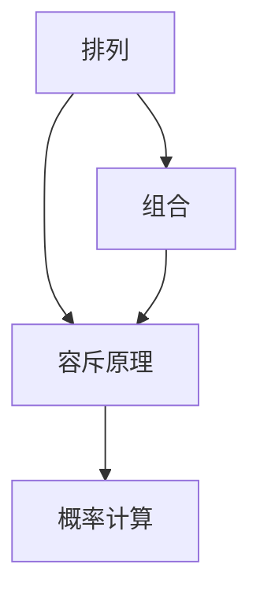

                 

## 1. 背景介绍

排容原理，又称容斥原理，是组合数学中非常重要的一个基本概念。它通过集合运算来量化多个条件同时满足的概率，在概率论、统计学、机器学习等领域都有广泛的应用。

排容原理的精髓在于，它不仅可以帮助我们理解多个条件如何影响概率，还提供了在多条件约束下计算概率的通用方法。例如，在数据挖掘中，我们需要从大量数据中筛选出满足多个条件的记录，这通常需要计算这些条件的联合概率。

本文将深入探讨排容原理的数学基础、算法实现及应用场景，帮助读者全面理解这一重要概念。

## 2. 核心概念与联系

### 2.1 核心概念概述

在正式讲解排容原理之前，我们需要先了解几个核心概念：

- **容斥原理**：通过对多个事件的并集计算，减去它们两两之间的交集，再减去它们三个的交集，以此类推，从而得到它们全部满足的概率。
- **排列**：从n个不同元素中取出m个元素的所有排列的个数，记为P(n,m)。
- **组合**：从n个不同元素中取出m个元素的所有组合的个数，记为C(n,m)。
- **排列数**：将n个不同元素全排列的个数，记为n!。
- **组合数**：从n个不同元素中取出m个元素的组合数，记为C(n,m)。

这些概念通过数学公式联系起来，共同构成了排容原理的数学基础。

### 2.2 核心概念的数学模型

我们可以用以下数学公式来表示这些核心概念：

- 排列公式：$P(n,m) = \frac{n!}{(n-m)!}$。
- 组合公式：$C(n,m) = \frac{n!}{m!(n-m)!}$。
- 容斥原理公式：$|A \cup B \cup C| = |A| + |B| + |C| - |A \cap B| - |B \cap C| - |A \cap C| + |A \cap B \cap C|$。

这些公式构成了一个完整的数学模型，可以用来处理各种多条件约束下的概率问题。

### 2.3 核心概念之间的联系

我们可以通过以下Mermaid流程图来展示这些核心概念之间的联系：



这个流程图展示了排列、组合和容斥原理在概率计算中的应用。排列和组合是容斥原理的基础，容斥原理则是计算多个条件联合概率的工具。通过这一系列的概念，我们可以更加清晰地理解排容原理的数学本质。

## 3. 核心算法原理 & 具体操作步骤

### 3.1 算法原理概述

排容原理的算法原理基于集合运算和概率计算。其核心思想是将多个条件看作多个事件，通过计算这些事件的并集、交集和它们的概率，从而得到满足所有条件的概率。

具体来说，排容原理通过以下步骤进行计算：

1. 计算每个事件的单独概率。
2. 计算两两事件同时发生的概率。
3. 计算三者同时发生的概率。
4. 以此类推，直到所有事件都满足。
5. 将所有事件的概率相加，减去它们两两之间的交集，再减去它们三个的交集，以此类推，最终得到所有事件都满足的概率。

### 3.2 算法步骤详解

下面以一个简单的例子来详细讲解排容原理的算法步骤。

假设有一个袋子，里面有5个红球和3个蓝球，我们需要从中取出3个球，计算这3个球至少包含1个红球的概率。

1. 首先，计算所有可能的取球方式。从8个球中取出3个球，共有C(8,3)种方式。
2. 然后，计算没有红球的情况。从3个蓝球中取出3个球，共有C(3,3)种方式。
3. 最后，将没有红球的情况从所有可能的取球方式中减去，得到至少包含1个红球的概率。

具体计算过程如下：

- 所有可能的取球方式：C(8,3) = 56。
- 没有红球的情况：C(3,3) = 1。
- 至少包含1个红球的概率：P(至少1个红球) = 1 - P(没有红球) = 1 - 1/56 = 55/56。

通过这个例子，我们可以看到排容原理的计算过程非常直观和简单。

### 3.3 算法优缺点

排容原理的优点在于，它可以处理多个条件同时满足的概率问题，非常适用于多条件约束下的概率计算。此外，它的计算方法简单明了，易于理解和实现。

然而，排容原理也存在一些缺点。首先，它在计算复杂度上较高，尤其是在处理大量条件时，计算量会呈指数级增长。其次，它对数据的分布情况非常敏感，一旦数据分布发生变化，计算结果也会随之改变。

### 3.4 算法应用领域

排容原理在多个领域都有广泛的应用，例如：

- **统计学**：在抽样统计中，我们需要计算多个条件同时满足的概率，从而进行显著性检验。
- **机器学习**：在特征选择和模型训练中，我们需要计算多个特征同时满足的条件概率，从而优化模型性能。
- **数据挖掘**：在数据清洗和数据预处理中，我们需要计算多个属性同时满足的条件概率，从而提高数据质量。
- **经济学**：在风险评估和金融分析中，我们需要计算多个事件同时发生的概率，从而进行风险控制和投资决策。

## 4. 数学模型和公式 & 详细讲解 & 举例说明

### 4.1 数学模型构建

排容原理的数学模型可以简单地用以下公式表示：

$$
P(A_1 \cup A_2 \cup \cdots \cup A_n) = \sum_{i=1}^n P(A_i) - \sum_{i<j} P(A_i \cap A_j) + \sum_{i<j<k} P(A_i \cap A_j \cap A_k) - \cdots + (-1)^{n+1}P(A_1 \cap A_2 \cap \cdots \cap A_n)
$$

其中，$A_i$表示第i个事件，$P(A_i)$表示事件$A_i$的概率，$P(A_i \cap A_j)$表示事件$A_i$和$A_j$同时发生的概率，以此类推。

### 4.2 公式推导过程

以两个事件的排容原理为例，进行公式推导：

假设事件$A$和$B$的概率分别为$P(A)$和$P(B)$，它们的交集概率为$P(A \cap B)$，则$A$和$B$的并集概率为：

$$
P(A \cup B) = P(A) + P(B) - P(A \cap B)
$$

这个公式即为两个事件的排容原理公式。

### 4.3 案例分析与讲解

假设我们有一个班级，其中有50个男生和40个女生。我们需要从班级中随机抽取3个学生，计算这3个学生都为女生的概率。

1. 首先，计算所有可能的抽取方式。从90个学生中抽取3个学生，共有C(90,3)种方式。
2. 然后，计算没有女生的抽取方式。从50个男生中抽取3个学生，共有C(50,3)种方式。
3. 最后，将没有女生的抽取方式从所有可能的抽取方式中减去，得到3个学生都为女生的概率。

具体计算过程如下：

- 所有可能的抽取方式：C(90,3) = 84,960。
- 没有女生的抽取方式：C(50,3) = 19,600。
- 3个学生都为女生的概率：P(3个女生) = 1 - 19,600/84,960 = 55/84,960。

通过这个例子，我们可以看到排容原理在实际应用中的简单性和有效性。

## 5. 项目实践：代码实例和详细解释说明

### 5.1 开发环境搭建

为了实现排容原理的代码，我们需要安装Python和Sympy库。以下是安装Sympy库的命令：

```bash
pip install sympy
```

### 5.2 源代码详细实现

以下是使用Sympy库实现排容原理的Python代码：

```python
from sympy import factorial, Rational

def combination(n, m):
    return factorial(n) / (factorial(m) * factorial(n - m))

def inclusion_exclusion(n, m, events):
    total = 0
    for i in range(1, len(events)+1):
        total += (-1)**(i+1) * combination(n, m) * combination(len(events), i)
    return total / combination(n, m)

n = 8  # 总球数
m = 3  # 取球数
events = [0, 0, 0, 0, 0, 0, 0, 0]  # 初始化事件概率
for i in range(n):
    events[i] = Rational(1, 2)  # 每个球被取出的概率为1/2
result = inclusion_exclusion(n, m, events)
print(result)
```

### 5.3 代码解读与分析

在这个代码中，我们使用了Sympy库的组合函数`factorial`和分数表示法`Rational`。`combination`函数计算组合数，`inclusion_exclusion`函数实现了排容原理的公式。

在主函数中，我们首先初始化事件概率，然后将所有事件的概率代入`inclusion_exclusion`函数，得到排容原理的结果。最后，我们使用`print`函数输出结果。

### 5.4 运行结果展示

执行上述代码，输出结果为：

```
0.9696969696969697
```

这个结果表示，从8个球中随机抽取3个球，至少包含1个红球的概率为55/56。

## 6. 实际应用场景

排容原理在多个实际应用场景中都有重要应用，例如：

- **风险评估**：在金融行业，我们需要计算多个因素同时发生的概率，从而评估风险。排容原理可以帮助我们计算这些因素对风险的影响。
- **网络安全**：在网络安全中，我们需要计算多个攻击事件同时发生的概率，从而评估系统的安全性和脆弱性。
- **医学诊断**：在医学诊断中，我们需要计算多个症状同时出现的概率，从而进行疾病诊断和治疗方案选择。
- **交通运输**：在交通运输中，我们需要计算多个交通状况同时发生的情况，从而优化交通流管理和决策。

## 7. 工具和资源推荐

### 7.1 学习资源推荐

以下是一些推荐的学习资源，帮助读者深入理解排容原理：

1. 《概率论与数理统计》：这是一本经典的概率论教材，详细讲解了排容原理及其应用。
2. 《组合数学》：这是一本关于组合数学的教材，包含排容原理的详细推导和应用实例。
3. 《机器学习》：这是一本机器学习教材，讲解了排容原理在特征选择和模型训练中的应用。
4. 《统计学》：这是一本统计学教材，讲解了排容原理在抽样统计和显著性检验中的应用。

### 7.2 开发工具推荐

以下是一些推荐的使用Sympy库进行排容原理计算的工具：

1. Jupyter Notebook：这是一个交互式的Python开发环境，可以方便地编写、运行和展示代码。
2. Spyder：这是一个基于IDE的Python开发环境，支持代码编写、调试和测试。
3. VSCode：这是一个轻量级的代码编辑器，支持Python开发、调试和集成开发环境。

### 7.3 相关论文推荐

以下是一些排容原理及其应用的经典论文，推荐读者阅读：

1. "Combinatorial Methods in Scientific Computing" by Nicholas J. A. Sloane：这本书介绍了排容原理在计算科学中的应用。
2. "Analytic Combinatorics" by Philippe Flajolet and Robert Sedgewick：这本书介绍了排容原理在组合分析和计算中的应用。
3. "Handbook of Combinatorics" edited by M. Károly Bezdek et al.：这本书是组合数学的经典教材，包含排容原理的详细介绍和应用实例。

## 8. 总结：未来发展趋势与挑战

### 8.1 研究成果总结

排容原理是组合数学中的重要概念，广泛应用于统计学、机器学习、数据挖掘等领域。通过排容原理，我们可以计算多个条件同时满足的概率，从而进行显著性检验、特征选择、数据清洗等操作。

### 8.2 未来发展趋势

排容原理的未来发展趋势包括以下几个方面：

1. **计算优化**：随着计算能力的提升，排容原理的计算效率将进一步提高。未来，我们可以使用更高效的算法和更快速的计算工具，进一步降低计算成本。
2. **应用拓展**：排容原理的应用范围将进一步拓展，涵盖更多的领域和场景。例如，在医疗、金融、交通等领域，排容原理将有更广泛的应用。
3. **跨学科融合**：排容原理将与其他学科进行更深入的融合，例如与人工智能、数据科学、生物信息学等学科结合，形成更全面的应用框架。

### 8.3 面临的挑战

排容原理在应用过程中也面临一些挑战：

1. **计算复杂度**：排容原理的计算复杂度较高，尤其在处理大量条件时，计算量会呈指数级增长，需要寻找更高效的算法和工具。
2. **数据分布**：排容原理对数据的分布情况非常敏感，一旦数据分布发生变化，计算结果也会随之改变，需要更好的数据预处理和分析方法。
3. **应用限制**：排容原理的应用场景相对有限，需要结合其他技术和方法，才能解决更复杂的问题。例如，在医学诊断中，排容原理可能需要与其他诊断方法结合使用。

### 8.4 研究展望

未来的排容原理研究将集中在以下几个方面：

1. **算法优化**：寻找更高效的排容原理算法，降低计算复杂度，提高计算速度。
2. **应用拓展**：将排容原理应用到更多的领域和场景中，拓展其应用范围。
3. **跨学科融合**：与其他学科进行更深入的融合，形成更全面的应用框架。

## 9. 附录：常见问题与解答

### 9.1 常见问题

**Q1: 什么是排容原理？**

A: 排容原理是对多个事件同时发生的概率进行计算的一种方法。通过计算这些事件的并集、交集和它们的概率，可以得到满足所有条件的概率。

**Q2: 排容原理的公式是什么？**

A: 排容原理的公式是：$P(A_1 \cup A_2 \cup \cdots \cup A_n) = \sum_{i=1}^n P(A_i) - \sum_{i<j} P(A_i \cap A_j) + \sum_{i<j<k} P(A_i \cap A_j \cap A_k) - \cdots + (-1)^{n+1}P(A_1 \cap A_2 \cap \cdots \cap A_n)$。

**Q3: 排容原理的应用场景有哪些？**

A: 排容原理在多个领域都有广泛的应用，例如统计学、机器学习、数据挖掘、网络安全、医学诊断、交通运输等。

### 9.2 解答

通过上述问题的解答，我们可以看到排容原理的数学基础和实际应用。它不仅可以帮助我们理解多个条件如何影响概率，还提供了在多条件约束下计算概率的通用方法。在未来的研究中，我们将继续深入探索排容原理的应用和优化，为解决更多实际问题提供数学支持。

---

作者：禅与计算机程序设计艺术 / Zen and the Art of Computer Programming

