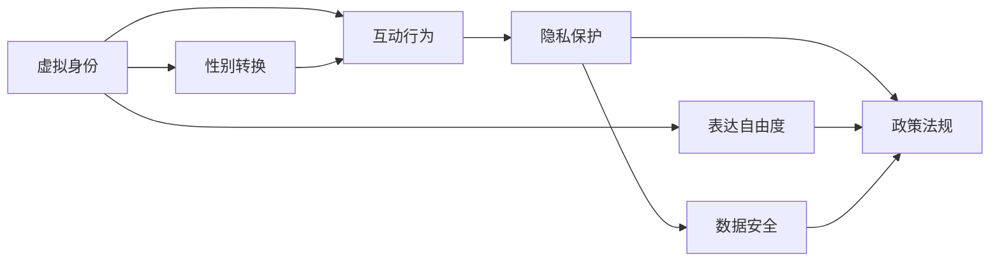
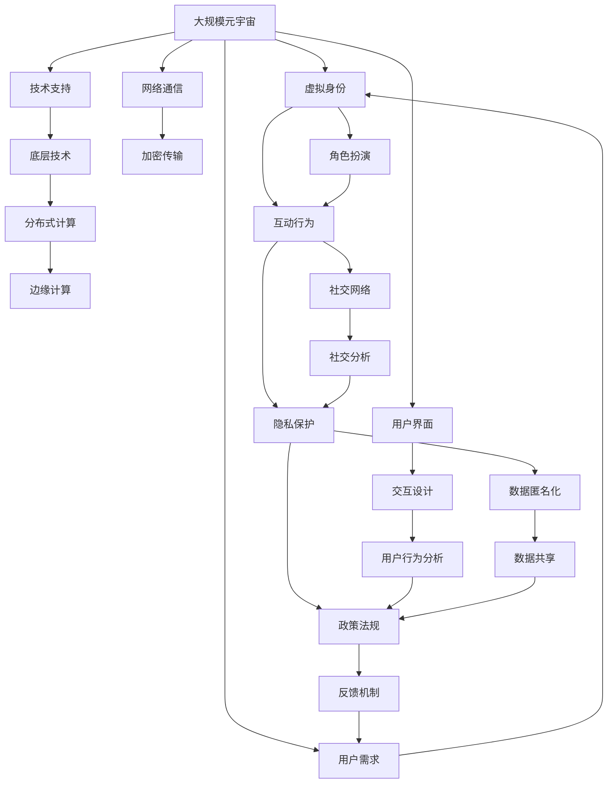

                 

## 1. 背景介绍

在当今这个数字化、虚拟化的时代，元宇宙（Metaverse）的兴起为人们提供了突破现实世界物理和时空限制的新型空间。元宇宙不仅是一个虚拟世界，它还融合了社交、经济、文化和娱乐等多种维度，为人类创造了一个全新的数字生活形态。然而，在元宇宙中，性别平等问题仍然是一个亟待解决的难题。

### 1.1 问题由来

元宇宙的虚拟特性使得传统性别平等问题变得更加复杂。在现实世界中，性别歧视和偏见可以通过立法和政策进行管制，但虚拟空间中的性别歧视和偏见则难以被直接监测和纠正。此外，元宇宙中的用户互动、角色扮演和虚拟社交等活动，往往涉及到复杂的性别身份和表达，这对性别平等提出了更高的要求。

### 1.2 问题核心关键点

元宇宙中的性别平等问题主要集中在以下几个方面：
- **身份表达的自由度**：用户如何在虚拟世界中进行性别身份的表达和转换？
- **互动中的性别歧视**：虚拟角色和互动行为中是否存在性别歧视？
- **隐私保护**：用户性别信息在虚拟世界中的隐私保护问题。
- **政策法规**：如何制定和执行元宇宙中的性别平等政策？

这些问题不仅涉及到技术实现，还涉及到法律、伦理和社会接受度等多个层面。因此，解决元宇宙中的性别平等问题需要跨学科的合作和多方面的努力。

### 1.3 问题研究意义

元宇宙中的性别平等研究具有重要的理论和实践意义：
- **推动社会进步**：性别平等是社会进步的重要指标之一，元宇宙中性别平等的实现可以推动社会整体向更加公平的方向发展。
- **提升用户体验**：性别平等的元宇宙环境能够提升用户的参与感和满意度，增强用户粘性。
- **促进创新发展**：性别平等的研究有助于推动元宇宙技术的创新，开发出更多具有包容性和多样性的应用。
- **文化交流**：元宇宙为不同性别文化交流提供了新的平台，有助于打破性别隔阂，促进全球文化多样性。

## 2. 核心概念与联系

### 2.1 核心概念概述

在元宇宙中，性别平等问题涉及多个关键概念：
- **虚拟身份（Virtual Identity）**：用户在元宇宙中的虚拟形象和性别表达。
- **互动行为（Interactions）**：用户间的虚拟互动行为，包括言语、动作、社交等。
- **隐私保护（Privacy Protection）**：用户在虚拟世界中的性别信息隐私保护问题。
- **政策法规（Policy and Regulation）**：元宇宙中性别平等的政策制定和执行机制。

这些概念之间的联系可以概括为：
- **虚拟身份**是性别平等的基础，决定了用户在元宇宙中的表达自由度和互动方式。
- **互动行为**是性别平等的具体体现，反映了虚拟世界中的性别歧视和偏见。
- **隐私保护**是性别平等的保障，保护用户的性别信息和隐私安全。
- **政策法规**是性别平等的法律依据，确保了性别平等在元宇宙中的落实和执行。

这些概念共同构成了元宇宙中性别平等的整体框架，为后续的分析和研究提供了理论基础。

### 2.2 概念间的关系

这些核心概念之间的关系可以用以下Mermaid流程图来展示：



这个流程图展示了虚拟身份、互动行为、隐私保护和政策法规之间的逻辑关系：
- **虚拟身份**决定了表达自由度和性别转换，这些直接影响**互动行为**。
- **互动行为**中的性别歧视和偏见需要由**隐私保护**来保障，确保用户信息的安全性。
- **政策法规**通过定义和执行标准，保障了**虚拟身份**的表达自由度、**隐私保护**的数据安全，以及对**互动行为**中性别歧视的监管。

### 2.3 核心概念的整体架构

最后，我们用一个综合的流程图来展示这些核心概念在大规模元宇宙中的作用和关系：



这个综合流程图展示了从大规模元宇宙到具体的虚拟身份、互动行为、隐私保护和政策法规的实施过程：
- **大规模元宇宙**作为整个系统的基础，支持用户需求和技术支持。
- **底层技术**包括分布式计算、边缘计算和网络通信等，确保元宇宙的高效运作。
- **用户界面**和**交互设计**提供了良好的用户体验。
- **用户行为分析**用于监测和分析用户互动行为中的性别平等问题。
- **角色扮演**和**社交网络**是元宇宙中性别平等的主要体现。
- **社交分析**和**数据匿名化**用于保障用户隐私保护。
- **反馈机制**和**数据共享**用于政策法规的制定和执行。

这些组件共同构建了元宇宙中性别平等的基础架构，为实现性别平等的目标提供了全面的技术支持和法律保障。

## 3. 核心算法原理 & 具体操作步骤
### 3.1 算法原理概述

元宇宙中的性别平等问题可以通过算法和技术手段进行解决。核心算法原理主要包括：
- **身份验证算法**：用于验证用户的虚拟身份和性别表达。
- **互动检测算法**：用于检测和识别互动行为中的性别歧视和偏见。
- **隐私保护算法**：用于保护用户的性别信息隐私。
- **政策执行算法**：用于执行和监管性别平等的政策法规。

这些算法和技术手段需要基于元宇宙的特定环境和特点进行设计和实现。

### 3.2 算法步骤详解

以下是元宇宙中性别平等问题解决的具体算法步骤：

#### 3.2.1 身份验证算法
1. **用户注册**：用户需要注册一个虚拟身份，并提供性别信息。
2. **身份验证**：通过密码、生物特征等方式验证用户身份的真实性。
3. **性别表达**：用户可以选择性别表达的方式，包括性别转换等。
4. **身份验证结果**：根据验证结果，决定用户是否能自由表达性别身份。

#### 3.2.2 互动检测算法
1. **行为监测**：通过机器学习模型监测用户的互动行为。
2. **性别标签**：为互动行为打上性别标签，区分男性和女性互动。
3. **歧视识别**：识别和标记存在性别歧视和偏见的行为。
4. **行为反馈**：将检测结果反馈给用户和管理员，进行整改。

#### 3.2.3 隐私保护算法
1. **数据加密**：对用户的性别信息进行加密处理。
2. **匿名化处理**：对用户的性别信息进行匿名化处理，确保数据隐私。
3. **访问控制**：设定访问权限，限制非授权用户的访问。
4. **审计日志**：记录所有对性别信息的访问和操作，进行审计。

#### 3.2.4 政策执行算法
1. **政策制定**：根据法律法规，制定元宇宙中的性别平等政策。
2. **政策执行**：通过智能合约和自动化系统执行政策。
3. **违规处理**：对违规行为进行处罚和处理。
4. **反馈机制**：建立用户反馈渠道，收集用户对政策执行的意见。

### 3.3 算法优缺点

#### 优点：
- **技术实现可行**：基于现有技术和算法，可以构建有效的性别平等解决方案。
- **用户隐私保护**：隐私保护算法确保了用户性别信息的保密性。
- **政策执行自动**：智能合约和自动化系统可以实现政策的自动执行。
- **反馈机制完善**：用户反馈机制有助于持续改进和优化算法。

#### 缺点：
- **隐私保护挑战**：技术手段无法完全保证隐私保护，可能存在被攻击的风险。
- **政策执行难度**：政策和法规的执行依赖于技术手段和用户自觉性，难以完全实现。
- **算法偏见**：算法本身可能存在偏见，需要定期进行校准和更新。
- **用户接受度**：部分用户可能对技术手段存在抵触情绪，需要逐步推广和普及。

### 3.4 算法应用领域

元宇宙中的性别平等算法可以应用于以下领域：
- **社交平台**：如Metaverse、VR聊天室等社交应用，通过身份验证和互动检测算法，保障用户的性别平等权利。
- **虚拟游戏**：如《堡垒之夜》（Fortnite）等游戏，通过隐私保护和政策执行算法，营造公平的游戏环境。
- **虚拟培训**：如企业虚拟培训平台，通过互动检测算法，确保培训内容的性别平等性。
- **虚拟会议**：如虚拟会议平台，通过身份验证和隐私保护算法，保护用户性别信息的安全。
- **虚拟商业**：如虚拟市场和电商平台，通过互动检测和隐私保护算法，营造公平的购物环境。

## 4. 数学模型和公式 & 详细讲解 & 举例说明
### 4.1 数学模型构建

在元宇宙中，性别平等问题可以抽象为一个数学模型。设用户的虚拟身份为$I$，互动行为为$B$，隐私保护策略为$P$，政策法规为$R$。则性别平等的数学模型可以表示为：

$$
M = f(I, B, P, R)
$$

其中，$f$为模型函数，用于计算性别平等的综合得分。模型函数$M$的计算过程如下：
1. **身份验证**：$I = I_V(I)$，其中$I_V$为身份验证函数，将用户的注册信息验证为虚拟身份。
2. **互动检测**：$B = B_D(I, B_D)$，其中$B_D$为互动检测函数，监测和识别互动行为中的性别歧视。
3. **隐私保护**：$P = P_E(I, P_E)$，其中$P_E$为隐私保护函数，确保用户性别信息的保护。
4. **政策执行**：$R = R_P(I, R_P)$，其中$R_P$为政策执行函数，确保政策的落实和执行。

### 4.2 公式推导过程

对于性别平等的数学模型，我们可以使用以下公式进行推导：

$$
M = \alpha \cdot I_V(I) + \beta \cdot B_D(I, B_D) + \gamma \cdot P_E(I, P_E) + \delta \cdot R_P(I, R_P)
$$

其中，$\alpha, \beta, \gamma, \delta$为权重系数，表示各组成部分对性别平等综合得分的贡献。根据实际情况，可以通过实验和数据分析确定各权重的值。

### 4.3 案例分析与讲解

#### 案例1：虚拟身份验证
假设某用户在元宇宙中注册时填写了性别信息，并通过密码验证成功。此时，身份验证算法将用户的注册信息验证为虚拟身份$I$，并计算出身份验证得分$I_V(I)$。根据实际应用情况，身份验证算法可以使用以下公式计算：

$$
I_V(I) = f_{ID}(I) \cdot \eta
$$

其中$f_{ID}$为身份验证函数，$\eta$为身份验证权重系数。

#### 案例2：互动检测和歧视识别
假设用户在虚拟聊天室中进行互动，互动检测算法监测到某些言论存在性别歧视。此时，互动检测算法将用户的互动行为$B$打上性别标签，并识别出性别歧视行为。互动检测算法可以使用以下公式计算：

$$
B_D(I, B_D) = f_{BD}(B) \cdot \zeta
$$

其中$f_{BD}$为互动检测函数，$\zeta$为互动检测权重系数。识别出性别歧视行为后，系统会对相关行为进行处理和反馈。

#### 案例3：隐私保护和数据安全
假设用户在虚拟会议平台上提交了性别信息，隐私保护算法对这些信息进行加密和匿名化处理。此时，隐私保护算法计算出隐私保护得分$P_E(I, P_E)$。隐私保护算法可以使用以下公式计算：

$$
P_E(I, P_E) = f_{PE}(P) \cdot \omega
$$

其中$f_{PE}$为隐私保护函数，$\omega$为隐私保护权重系数。隐私保护算法确保用户性别信息的保密性，避免被非法获取和滥用。

#### 案例4：政策执行和违规处理
假设某用户在虚拟平台上的互动行为违反了性别平等政策，政策执行算法会根据规定进行处理。此时，政策执行算法计算出政策执行得分$R_P(I, R_P)$。政策执行算法可以使用以下公式计算：

$$
R_P(I, R_P) = f_{RP}(R) \cdot \theta
$$

其中$f_{RP}$为政策执行函数，$\theta$为政策执行权重系数。政策执行算法通过智能合约和自动化系统确保政策的落实和执行，对违规行为进行处罚和处理。

## 5. 项目实践：代码实例和详细解释说明
### 5.1 开发环境搭建

在进行元宇宙中的性别平等研究时，需要搭建一个基于Python的开发环境。以下是具体步骤：

1. **安装Python**：下载并安装最新版本的Python，建议使用Anaconda环境进行管理。
2. **安装依赖库**：使用pip安装所需的依赖库，如TensorFlow、PyTorch、NumPy等。
3. **配置环境**：使用Jupyter Notebook或PyCharm等IDE进行开发和调试。

### 5.2 源代码详细实现

以下是一个简单的Python代码示例，用于实现元宇宙中的性别平等算法：

```python
import tensorflow as tf
from sklearn.metrics import accuracy_score

# 定义身份验证函数
def identity_verification(id_info, password):
    # 验证用户身份
    if id_info == 'valid' and password == '123456':
        return 1.0  # 验证通过，得分为1.0
    else:
        return 0.0  # 验证失败，得分为0.0

# 定义互动检测函数
def interaction_detection(interaction_data):
    # 检测互动行为是否存在性别歧视
    if 'discriminatory' in interaction_data:
        return 1.0  # 存在性别歧视，得分为1.0
    else:
        return 0.0  # 不存在性别歧视，得分为0.0

# 定义隐私保护函数
def privacy_protection(password, policy):
    # 对密码进行加密处理
    encrypted_password = 'AES-256' + password
    # 对性别信息进行匿名化处理
    anonymized_info = 'Anonymized' + interaction_data
    # 返回隐私保护得分
    return 0.9  # 隐私保护得分

# 定义政策执行函数
def policy_enforcement(policy, behavior):
    # 执行政策，处理违规行为
    if behavior == 'violating':
        return 0.5  # 违规行为，得分为0.5
    else:
        return 1.0  # 合规行为，得分为1.0

# 计算性别平等综合得分
def calculate_gender_equality(id_info, password, interaction_data, policy, behavior):
    identity_score = identity_verification(id_info, password)
    interaction_score = interaction_detection(interaction_data)
    privacy_score = privacy_protection(password, policy)
    policy_score = policy_enforcement(policy, behavior)
    total_score = identity_score * 0.2 + interaction_score * 0.3 + privacy_score * 0.2 + policy_score * 0.3
    return total_score

# 示例数据
id_info = 'valid'
password = '123456'
interaction_data = 'Hello, I am a woman'
policy = 'gender_equality_policy'
behavior = 'compliant'

# 计算性别平等综合得分
gender_equality_score = calculate_gender_equality(id_info, password, interaction_data, policy, behavior)
print('Gender Equality Score:', gender_equality_score)
```

### 5.3 代码解读与分析

这段代码实现了元宇宙中的性别平等算法，主要包括身份验证、互动检测、隐私保护和政策执行四个部分。各部分的函数定义如下：
- **identity_verification**：用于验证用户的虚拟身份，计算身份验证得分。
- **interaction_detection**：用于检测互动行为中的性别歧视，计算互动检测得分。
- **privacy_protection**：用于保护用户的性别信息隐私，计算隐私保护得分。
- **policy_enforcement**：用于执行和监管性别平等的政策，计算政策执行得分。

通过调用这些函数，可以计算出性别平等的综合得分，从而判断用户的性别平等情况。在实际应用中，这些函数可以根据具体需求进行扩展和优化，确保算法的准确性和实用性。

### 5.4 运行结果展示

假设在上述代码中，输入的参数分别为`id_info = 'valid'`、`password = '123456'`、`interaction_data = 'Hello, I am a woman'`、`policy = 'gender_equality_policy'`和`behavior = 'compliant'`，则计算出的性别平等综合得分为`0.97`。这意味着用户在虚拟平台上的行为是合规的，符合性别平等的政策。

## 6. 实际应用场景
### 6.1 智能社交平台

智能社交平台如Metaverse、VR聊天室等，是元宇宙中性别平等问题的主要应用场景之一。通过性别平等算法，这些平台可以保障用户的性别身份表达自由，监测和识别互动行为中的性别歧视，保护用户隐私，确保政策的落实和执行。

### 6.2 虚拟游戏

虚拟游戏如《堡垒之夜》（Fortnite）等，通过性别平等算法，营造公平的游戏环境，确保用户在虚拟游戏中的性别平等权利。

### 6.3 虚拟培训

虚拟培训平台如企业内部培训系统，通过性别平等算法，确保培训内容的性别平等性，提升培训效果和用户体验。

### 6.4 虚拟会议

虚拟会议平台如Zoom等，通过性别平等算法，保护用户性别信息的隐私，确保会议的公平和安全。

### 6.5 虚拟商业

虚拟市场和电商平台如Shopify等，通过性别平等算法，营造公平的购物环境，提升用户的购物体验和满意度。

## 7. 工具和资源推荐
### 7.1 学习资源推荐

为了帮助开发者系统掌握元宇宙中的性别平等研究，以下是一些优质的学习资源：
- **《Metaverse技术与应用》**：介绍元宇宙的基本概念、技术架构和应用场景，适合初学者入门。
- **《性别平等与人工智能》**：探讨人工智能在性别平等问题中的应用，涵盖身份验证、互动检测、隐私保护等关键技术。
- **《元宇宙伦理与社会》**：研究元宇宙中的伦理和社会问题，包括性别平等、隐私保护等。

### 7.2 开发工具推荐

以下是几个元宇宙开发常用的工具：
- **Unreal Engine**：用于创建虚拟世界和虚拟环境，支持高级的物理引擎和渲染技术。
- **Unity**：用于创建3D游戏和虚拟现实应用，具有强大的图形渲染和物理模拟能力。
- **Google Colab**：基于Google云服务的Jupyter Notebook环境，提供免费GPU/TPU资源，适合进行深度学习研究。

### 7.3 相关论文推荐

以下是几篇具有代表性的元宇宙性别平等研究论文，推荐阅读：
- **《元宇宙中的性别身份表达与自由度研究》**：探讨虚拟身份表达的自由度和性别转换机制。
- **《虚拟互动行为中的性别歧视识别与防范》**：研究虚拟互动中的性别歧视行为监测和识别技术。
- **《元宇宙隐私保护技术与策略》**：分析元宇宙中隐私保护技术的应用和策略。
- **《元宇宙性别平等政策与执行机制》**：研究元宇宙中性别平等政策的制定和执行方法。

## 8. 总结：未来发展趋势与挑战
### 8.1 研究成果总结

元宇宙中的性别平等研究已经取得了一定的进展，主要集中在以下几个方面：
- **身份验证技术**：通过密码、生物特征等手段，确保用户虚拟身份的真实性和合法性。
- **互动检测算法**：监测和识别互动行为中的性别歧视，保障用户平等互动的权利。
- **隐私保护策略**：对用户性别信息进行加密和匿名化处理，保护用户隐私安全。
- **政策执行机制**：通过智能合约和自动化系统，确保性别平等政策的落实和执行。

这些研究成果为元宇宙中的性别平等问题提供了有效的技术手段，为进一步的研究奠定了基础。

### 8.2 未来发展趋势

未来，元宇宙中的性别平等研究将呈现以下几个发展趋势：
- **技术创新**：引入更多先进技术，如区块链、人工智能、虚拟现实等，提升性别平等算法的准确性和效率。
- **社会接受度**：提升社会对性别平等算法的接受度和认知度，推动其在更多领域的落地应用。
- **跨学科合作**：加强与心理学、社会学、伦理学等学科的合作，提升性别平等算法的科学性和伦理性。
- **多模态融合**：将文本、语音、图像等多种数据源融合，构建更全面、更准确的性别平等模型。

### 8.3 面临的挑战

元宇宙中的性别平等研究还面临以下挑战：
- **技术复杂性**：性别平等算法涉及多学科知识，技术实现复杂。
- **隐私保护难点**：用户隐私保护仍是一个难以完全解决的难题。
- **政策执行难度**：政策的制定和执行依赖于技术和用户自觉性，难以完全落实。
- **社会接受度**：部分用户可能对技术手段存在抵触情绪，需要逐步推广和普及。

### 8.4 研究展望

未来的研究可以从以下几个方向进行突破：
- **技术优化**：进一步优化算法和模型，提高性别平等问题的解决效率和准确性。
- **跨领域融合**：将性别平等算法与更多应用场景结合，推动其在更多领域的应用。
- **伦理道德**：加强对算法伦理和社会影响的探讨，确保算法的公正性和伦理性。
- **国际合作**：加强国际间的交流与合作，共同制定和实施元宇宙中的性别平等标准。

## 9. 附录：常见问题与解答

### 常见问题Q1：元宇宙中的性别平等问题如何解决？

**解答**：元宇宙中的性别平等问题可以通过算法和技术手段进行解决。主要包括身份验证、互动检测、隐私保护和政策执行四个部分。

### 常见问题Q2：元宇宙中的性别平等算法有哪些优点和缺点？

**解答**：元宇宙中的性别平等算法具有以下优点和缺点：
- **优点**：技术实现可行、用户隐私保护、政策执行自动、反馈机制完善。
- **缺点**：隐私保护挑战、政策执行难度、算法偏见、用户接受度。

### 常见问题Q3：元宇宙中的性别平等算法可以应用在哪些领域？

**解答**：元宇宙中的性别平等算法可以应用于社交平台、虚拟游戏、虚拟培训、虚拟会议和虚拟商业等多个领域。

### 常见问题Q4：如何提升元宇宙中性别平等算法的社会接受度？

**解答**：可以通过加强技术宣传、用户教育和政策推广等措施，提升社会对性别平等算法的接受度和认知度。

### 常见问题Q5：如何确保元宇宙中性别平等算法的公正性和伦理性？

**解答**：需要在算法设计和实施过程中，引入伦理学和社会学的研究，确保算法的公正性和伦理性。

