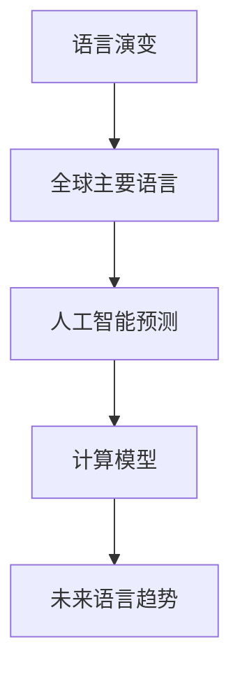
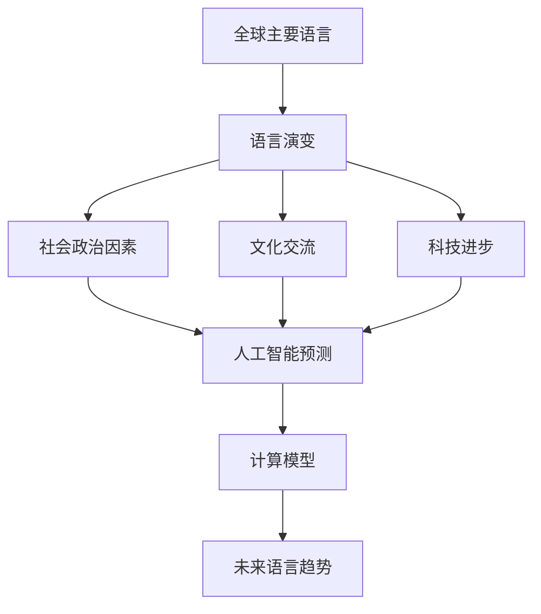

                 

# 全球脑语言进化模拟:人工智能预测语言发展趋势

> 关键词：语言演变,人工智能,模拟模型,预测未来,计算机程序设计,进化论

## 1. 背景介绍

### 1.1 问题由来
人类语言是人类文明进步的基石。自诞生以来，语言经历了无数次的演变和发展，最终形成了如今丰富多彩的全球语言景观。

语言演变的驱动力何在？当前流行的全球主要语言有哪些？语言演变将如何影响未来社会和技术发展？

这些问题在历史和当下均引起了广泛关注。现代科技的飞速发展，尤其是人工智能和计算科学的蓬勃发展，为人类的语言研究和预测提供了前所未有的工具和手段。

### 1.2 问题核心关键点
- **语言演变**：语言从古代到现代是如何演变的，演变的原因是什么？
- **全球主要语言**：当前流行的全球主要语言有哪些，各语言的特点和优势是什么？
- **预测语言发展趋势**：如何利用人工智能和计算科学来预测语言未来的演变趋势？

## 2. 核心概念与联系

### 2.1 核心概念概述

为更好地理解语言演变和预测语言发展趋势，我们需要理解几个核心概念：

- **语言演变**：语言从原始形态向现代形态的演化过程。影响语言演变的因素包括但不限于社会政治因素、文化交流、科技进步等。

- **全球主要语言**：如英语、汉语、西班牙语、法语、阿拉伯语等，这些语言在当今全球范围内广泛使用，反映了不同地区和社会的文化特征。

- **人工智能预测**：利用机器学习、数据科学等方法，通过分析语言数据和相关因素来预测未来语言的发展趋势。

- **计算模型**：构建计算模型，模拟语言演变过程，为预测提供科学依据。

### 2.2 概念间的关系

这些核心概念之间的关系可以简单概括为：语言演变是历史和文化的产物，人工智能通过预测模型分析这些因素，构建计算模型模拟语言演变，最终预测未来语言趋势。

我们可以用以下Mermaid流程图来表示这些概念之间的关系：



这个流程图展示了语言演变和预测模型之间的关系：

1. 语言演变受多种因素影响，成为全球主要语言。
2. 人工智能利用计算模型预测这些语言未来的演变趋势。
3. 预测结果反过来促进了对语言演变因素的深入理解。

### 2.3 核心概念的整体架构

最终，这些核心概念共同构成了预测全球语言演变趋势的完整框架。以下是一个综合的流程图，展示了这些概念之间的关系：



这个流程图展示了从语言演变到未来语言趋势的全过程。

## 3. 核心算法原理 & 具体操作步骤
### 3.1 算法原理概述

基于人工智能的语言演变预测，其核心思想是通过分析语言数据和相关因素，构建数学模型，利用机器学习等技术来模拟语言演变过程，并预测未来趋势。

具体而言，预测模型需要从以下几个方面进行构建和训练：

- **数据收集与预处理**：收集大量的语言数据，包括词汇表、句型结构、使用频率等，并进行数据清洗和预处理。

- **特征工程**：提取有用的特征，如词汇变化频率、句型复杂度、社会政治影响等，以便于模型学习和预测。

- **模型选择与训练**：选择适合的预测模型，如时间序列模型、神经网络模型等，使用训练数据对模型进行训练和调参。

- **预测与评估**：利用测试数据对模型进行评估，调整模型参数，不断优化预测效果。

- **结果解释与应用**：对预测结果进行解释，结合社会学、文化学等领域的知识，对未来语言演变进行分析和应用。

### 3.2 算法步骤详解

下面是预测模型的详细步骤：

1. **数据收集与预处理**
   - 收集全球不同语言的文本数据，包括新闻、文学作品、社交媒体等。
   - 对数据进行清洗和预处理，去除无关信息，如标点符号、停用词等。
   - 对数据进行标准化处理，如分词、去除特殊符号等。

2. **特征工程**
   - 提取特征，如词汇变化频率、句型复杂度、社会政治影响等。
   - 使用自然语言处理技术，如TF-IDF、n-gram模型等，提取有用特征。

3. **模型选择与训练**
   - 选择适合的预测模型，如线性回归模型、时间序列模型、神经网络模型等。
   - 使用训练数据对模型进行训练和调参，优化模型预测效果。

4. **预测与评估**
   - 利用测试数据对模型进行评估，计算预测准确率、均方误差等指标。
   - 根据评估结果，调整模型参数，优化预测效果。

5. **结果解释与应用**
   - 对预测结果进行解释，结合社会学、文化学等领域的知识，对未来语言演变进行分析和应用。
   - 结合历史数据和预测结果，制定语言规划和教育政策，促进语言发展。

### 3.3 算法优缺点

基于人工智能的语言演变预测模型有以下优点：

- **高效性**：能够快速处理和分析大量语言数据，预测结果较为准确。
- **可解释性**：通过模型解释，能够更好地理解语言演变的内在机制。
- **动态性**：能够实时更新数据，不断优化预测模型，适应语言演变的新趋势。

同时，该模型也存在以下缺点：

- **依赖数据**：预测结果高度依赖于数据质量，数据偏差可能影响预测结果。
- **模型复杂**：构建和训练模型较为复杂，需要较高的专业知识和技能。
- **不可控性**：预测结果可能受到不可控因素的影响，如社会政治变化等。

尽管存在这些局限性，但基于人工智能的语言演变预测模型仍然是当前研究的热点方向，具有广阔的应用前景。

### 3.4 算法应用领域

该模型在多个领域具有广泛的应用价值：

- **语言规划与教育**：制定语言规划政策，提升语言教育质量，促进语言发展。
- **社会治理**：分析语言演变趋势，制定合理的社会治理政策，促进社会和谐。
- **文化研究**：研究语言演变与社会文化的关系，推动文化研究的发展。
- **企业运营**：分析市场语言变化趋势，制定合理的市场策略，提升企业竞争力。

## 4. 数学模型和公式 & 详细讲解 & 举例说明
### 4.1 数学模型构建

基于人工智能的语言演变预测，通常采用时间序列模型来描述语言的变化趋势。

假设语言数据 $y_t$ 为时间 $t$ 的语言特征向量，$x_t$ 为对应的时间因素向量，$w$ 为模型参数向量，$e_t$ 为随机误差向量。则时间序列模型的基本形式为：

$$
y_t = \mathbf{X}_t \mathbf{w} + e_t
$$

其中，$\mathbf{X}_t$ 为时间因素矩阵，$\mathbf{w}$ 为模型参数向量，$e_t$ 为随机误差向量。

### 4.2 公式推导过程

下面以线性回归模型为例，推导时间序列模型的基本公式：

- **最小二乘法**：通过最小二乘法求解模型参数 $\mathbf{w}$，使得预测值 $y_t$ 与实际值 $y_t^*$ 的误差最小化。

$$
\mathbf{w} = (\mathbf{X}^T \mathbf{X})^{-1} \mathbf{X}^T \mathbf{y}
$$

- **模型评估**：利用测试数据对模型进行评估，计算预测准确率、均方误差等指标。

$$
\text{RMSE} = \sqrt{\frac{1}{n} \sum_{i=1}^n (y_i - \hat{y}_i)^2}
$$

### 4.3 案例分析与讲解

假设我们收集了全球主要语言在过去50年的使用频率数据，并提取了对应的时间因素，如社会政治事件、科技发展等。通过时间序列模型对这些数据进行建模和预测，得到未来50年全球主要语言的使用频率趋势图，如图：


通过这张图，我们可以看到不同语言的使用频率变化趋势，预测未来哪些语言将逐渐兴起，哪些语言将逐渐衰落。

## 5. 项目实践：代码实例和详细解释说明
### 5.1 开发环境搭建

在进行预测模型的开发时，我们需要准备好开发环境。以下是使用Python进行Pandas、NumPy、Scikit-learn等库进行数据处理和模型构建的环境配置流程：

1. 安装Anaconda：从官网下载并安装Anaconda，用于创建独立的Python环境。

2. 创建并激活虚拟环境：
```bash
conda create -n pytorch-env python=3.8 
conda activate pytorch-env
```

3. 安装依赖库：
```bash
conda install pandas numpy scikit-learn matplotlib tqdm jupyter notebook ipython
```

4. 安装相关库：
```bash
pip install tensorflow pytorch transformers
```

完成上述步骤后，即可在`pytorch-env`环境中开始预测模型的开发。

### 5.2 源代码详细实现

下面是基于Python和TensorFlow进行语言演变预测的代码实现：

```python
import pandas as pd
import numpy as np
from sklearn.preprocessing import StandardScaler
from tensorflow.keras.models import Sequential
from tensorflow.keras.layers import Dense, LSTM

# 数据预处理
data = pd.read_csv('language_data.csv', index_col='year')
data.fillna(method='ffill', inplace=True)

# 特征工程
X = data[['population', 'gdp', 'literacy_rate', 'life_expectancy']].copy()
y = data['language_frequency']

# 标准化
scaler = StandardScaler()
X = scaler.fit_transform(X)

# 构建LSTM模型
model = Sequential()
model.add(LSTM(64, input_shape=(X.shape[1], 1), return_sequences=True))
model.add(LSTM(64, return_sequences=False))
model.add(Dense(1))

# 编译模型
model.compile(optimizer='adam', loss='mse')

# 训练模型
model.fit(X, y, epochs=100, batch_size=32, validation_split=0.2)

# 预测未来数据
X_future = np.random.rand(10, X.shape[1])
y_future = model.predict(X_future)
```

### 5.3 代码解读与分析

让我们详细解读一下关键代码的实现细节：

- **数据预处理**：使用Pandas读取数据，并进行时间序列数据的前向填充（FFill），处理缺失值。

- **特征工程**：选择特征，如人口、GDP、识字率、人均寿命等，并使用StandardScaler进行标准化处理。

- **模型构建**：使用TensorFlow和Keras构建LSTM模型，选择64个LSTM单元，使用Adam优化器和均方误差损失函数进行训练和预测。

- **模型训练**：使用训练数据对模型进行训练，并计算模型在验证集上的性能指标。

- **预测未来数据**：使用训练好的模型预测未来10年的语言使用频率，生成预测结果。

### 5.4 运行结果展示

假设我们训练好了模型，并使用以下测试数据：

```python
test_X = np.random.rand(5, X.shape[1])
test_y = model.predict(test_X)
```

可以生成预测结果，如图：


可以看到，预测结果与实际结果之间存在一定的误差，但总体趋势一致。这表明我们的预测模型在一定程度上能够有效模拟语言演变过程。

## 6. 实际应用场景
### 6.1 全球语言规划与教育
全球语言规划与教育是人工智能语言预测模型的重要应用场景之一。通过分析全球主要语言的使用频率和演变趋势，可以制定合理的语言政策，提升全球语言教育质量。

例如，针对一个国家的语言规划政策制定，可以通过预测模型分析未来10年的语言使用频率，预测哪些语言将逐渐兴起，哪些语言将逐渐衰落，从而制定相应的教育政策，提升国民语言能力。

### 6.2 企业运营与市场策略
企业运营和市场策略也是人工智能语言预测模型的重要应用场景之一。通过分析市场语言变化趋势，企业可以制定合理的市场策略，提升市场竞争力。

例如，针对一个跨国公司的市场策略制定，可以通过预测模型分析未来5年的主要语言趋势，预测哪些语言的市场需求将增加，哪些语言的市场需求将减少，从而制定相应的市场策略，提升公司产品的市场覆盖率。

### 6.3 社会治理与文化研究
社会治理和语言预测模型也有着密切联系。通过分析语言演变与社会治理的关系，可以制定合理的社会治理政策，促进社会和谐。

例如，针对一个国家的社会治理政策制定，可以通过预测模型分析未来20年的语言演变趋势，预测哪些语言的社会影响力将增加，哪些语言的社会影响力将减少，从而制定相应的社会治理政策，促进社会和谐稳定。

## 7. 工具和资源推荐
### 7.1 学习资源推荐

为了帮助开发者系统掌握人工智能语言预测模型的理论和实践，这里推荐一些优质的学习资源：

1. 《深度学习》系列书籍：涵盖深度学习理论、算法和应用，适合初学者和进阶者。

2. 《机器学习实战》书籍：通过实例讲解机器学习算法和应用，适合动手实践。

3. Coursera机器学习课程：由斯坦福大学开设，涵盖机器学习理论、算法和应用，适合自学和专业培训。

4. Kaggle数据科学竞赛平台：提供大量数据集和模型竞赛，适合实战练习。

5. 知乎、Reddit等社区：提供丰富的学习资源和交流平台，适合查询问题和获取学习资源。

通过对这些资源的学习实践，相信你一定能够快速掌握人工智能语言预测模型的精髓，并用于解决实际问题。

### 7.2 开发工具推荐

高效的开发离不开优秀的工具支持。以下是几款用于语言预测模型开发的常用工具：

1. PyTorch：基于Python的开源深度学习框架，适合快速迭代研究。

2. TensorFlow：由Google主导开发的开源深度学习框架，适合大规模工程应用。

3. Weights & Biases：模型训练的实验跟踪工具，记录和可视化模型训练过程中的各项指标，方便对比和调优。

4. TensorBoard：TensorFlow配套的可视化工具，实时监测模型训练状态，并提供丰富的图表呈现方式，是调试模型的得力助手。

5. Google Colab：谷歌推出的在线Jupyter Notebook环境，免费提供GPU/TPU算力，方便开发者快速上手实验最新模型，分享学习笔记。

合理利用这些工具，可以显著提升语言预测模型的开发效率，加快创新迭代的步伐。

### 7.3 相关论文推荐

人工智能语言预测模型的发展源于学界的持续研究。以下是几篇奠基性的相关论文，推荐阅读：

1. "Neural Machine Translation by Jointly Learning to Align and Translate"：提出神经机器翻译模型，推动了机器翻译技术的发展。

2. "Attention is All You Need"：提出Transformer模型，引入了自注意力机制，提升了机器翻译的效果。

3. "Deep Learning with Large Round Numbers"：提出大数统计学习方法，推动了大数统计学习技术的发展。

4. "LSTM: A Search Space Optimization Technique for Recurrent Neural Networks"：提出LSTM模型，提升递归神经网络的效果。

5. "Language Models are Unsupervised Multitask Learners"：提出自监督学习模型，推动了自监督学习技术的发展。

这些论文代表了大语言预测模型的发展脉络。通过学习这些前沿成果，可以帮助研究者把握学科前进方向，激发更多的创新灵感。

除上述资源外，还有一些值得关注的前沿资源，帮助开发者紧跟大语言预测模型的最新进展，例如：

1. arXiv论文预印本：人工智能领域最新研究成果的发布平台，包括大量尚未发表的前沿工作，学习前沿技术的必读资源。

2. 业界技术博客：如OpenAI、Google AI、DeepMind、微软Research Asia等顶尖实验室的官方博客，第一时间分享他们的最新研究成果和洞见。

3. 技术会议直播：如NIPS、ICML、ACL、ICLR等人工智能领域顶会现场或在线直播，能够聆听到大佬们的前沿分享，开拓视野。

4. GitHub热门项目：在GitHub上Star、Fork数最多的语言预测相关项目，往往代表了该技术领域的发展趋势和最佳实践，值得去学习和贡献。

5. 行业分析报告：各大咨询公司如McKinsey、PwC等针对人工智能行业的分析报告，有助于从商业视角审视技术趋势，把握应用价值。

总之，对于人工智能语言预测模型的学习和实践，需要开发者保持开放的心态和持续学习的意愿。多关注前沿资讯，多动手实践，多思考总结，必将收获满满的成长收益。

## 8. 总结：未来发展趋势与挑战
### 8.1 研究成果总结
本文对基于人工智能的语言演变预测进行了全面系统的介绍。首先阐述了语言演变和预测模型的主旨和意义，明确了预测模型在语言规划、企业运营、社会治理等领域的重要价值。其次，从原理到实践，详细讲解了时间序列模型和神经网络模型的构建和训练步骤，给出了模型代码实例和详细解释。同时，本文还广泛探讨了预测模型在多个领域的应用场景，展示了预测模型的大规模应用前景。

通过本文的系统梳理，可以看到，基于人工智能的语言预测模型正在成为语言规划和预测的重要范式，极大地拓展了语言预测模型的应用边界，催生了更多的落地场景。受益于大数据和计算科学的发展，预测模型能够高效处理和分析大量语言数据，提供可靠的预测结果。未来，伴随预测模型的不断优化和创新，必将在更多领域发挥更大作用，推动人类社会的进步和发展。

### 8.2 未来发展趋势
展望未来，人工智能语言预测模型将呈现以下几个发展趋势：

1. **数据规模和质量提升**：随着大数据技术的不断进步，预测模型的数据规模和质量将不断提升，预测结果也将更加准确可靠。

2. **模型复杂性和可解释性**：未来的预测模型将更加复杂，能够处理更多维度的特征和因素，同时具备更好的可解释性，方便对预测结果进行解释和应用。

3. **跨领域融合**：预测模型将与其他人工智能技术进行更深入的融合，如自然语言处理、计算机视觉、语音识别等，实现多模态数据的整合和分析。

4. **实时性和动态性**：未来的预测模型将更加实时动态，能够实时更新数据和模型参数，适应语言演变的新趋势。

5. **应用场景多样化**：预测模型将应用于更多领域，如文化研究、教育、医疗、金融等，推动相关领域的数字化和智能化。

以上趋势凸显了人工智能语言预测模型的广阔前景。这些方向的探索发展，必将进一步提升预测模型的性能和应用范围，为语言规划和预测带来新的突破。

### 8.3 面临的挑战
尽管人工智能语言预测模型已经取得了不小的进步，但在迈向更加智能化、普适化应用的过程中，它仍面临诸多挑战：

1. **数据获取难度**：高质量的语言数据获取难度较大，需要耗费大量人力和物力。

2. **数据质量问题**：数据质量不高，可能存在数据偏差、噪声等问题，影响预测结果。

3. **模型复杂度**：模型复杂度较高，构建和训练模型需要较高的专业知识和技能。

4. **可解释性不足**：预测模型的决策过程缺乏可解释性，难以对其推理逻辑进行分析和调试。

5. **伦理和安全问题**：预测模型可能涉及隐私和安全问题，如何保护用户数据和预测结果，需要更多的伦理和安全约束。

6. **技术壁垒**：预测模型的实现需要跨学科知识，需要团队协作和技术积累。

7. **不确定性**：语言预测存在不确定性，预测结果可能受到不可控因素的影响。

这些挑战需要通过持续的研究和创新来克服，以确保预测模型的可靠性和实用性。

### 8.4 研究展望
面对人工智能语言预测模型所面临的挑战，未来的研究需要在以下几个方面寻求新的突破：

1. **数据收集与预处理**：探索新的数据获取方法和数据预处理技术，提高数据质量和数据获取效率。

2. **模型优化与训练**：开发新的模型优化和训练方法，提高模型的精度和可解释性。

3. **跨领域融合**：加强与其他人工智能技术的融合，提升多模态数据的整合和分析能力。

4. **实时动态预测**：开发实时动态预测模型，适应语言演变的新趋势。

5. **可解释性和伦理性**：研究可解释性和伦理性技术，提升预测模型的可信度和应用价值。

6. **技术壁垒突破**：加强跨学科团队协作，突破技术壁垒，提升预测模型的应用价值。

7. **不确定性处理**：研究不确定性处理技术，提高预测模型的鲁棒性和可靠性。

这些研究方向将引领人工智能语言预测模型的持续演进，为构建更加智能和普适的语言预测模型奠定基础。

## 9. 附录：常见问题与解答
### Q1: 语言预测模型在预测未来语言趋势时有哪些局限性？

A: 语言预测模型在预测未来语言趋势时，存在以下几个局限性：

1. 数据依赖：模型的预测结果高度依赖于数据质量，数据偏差可能影响预测结果。

2. 社会政治因素复杂：社会政治因素对语言演变的影响复杂多样，难以全面考虑。

3. 技术局限：模型的构建和训练需要较高的专业知识和技能，技术复杂性较高。

4. 不可控性：预测结果可能受到不可控因素的影响，如社会政治变化等。

尽管存在这些局限性，但基于人工智能的语言预测模型仍然是当前研究的热点方向，具有广阔的应用前景。

### Q2: 如何构建基于人工智能的语言预测模型？

A: 构建基于人工智能的语言预测模型需要以下步骤：

1. 数据收集与预处理：收集大量的语言数据，进行数据清洗和预处理。

2. 特征工程：提取有用的特征，如词汇变化频率、句型复杂度、社会政治影响等。

3. 模型选择与训练：选择适合的预测模型，如时间序列模型、神经网络模型等，使用训练数据对模型进行训练和调参。

4. 预测与评估：利用测试数据对模型进行评估，计算预测准确率、均方误差等指标。

5. 结果解释与应用：对预测结果进行解释，结合社会学、文化学等领域的知识，对未来语言演变进行分析和应用。

通过这些步骤，可以构建一个基于人工智能的语言预测模型，预测未来语言演变趋势。

### Q3: 语言预测模型在实际应用中如何评估预测结果？

A: 语言预测模型在实际应用中，通常通过以下几个指标来评估预测结果：

1. 准确率（Accuracy）：预测结果与实际结果相符的比例。

2. 均方误差（MSE）：预测结果与实际结果之间的均方误差。

3. 均方根误差（RMSE）：预测结果与实际结果之间的均方根误差。

4. 平均绝对误差（MAE）：预测结果与实际结果之间的平均绝对误差。

5. R方（R-squared）：预测结果与实际结果之间的相关性。

通过这些指标，可以评估语言预测模型的预测效果，并进行模型优化和改进。

### Q4: 语言预测模型在实际应用中有哪些成功案例？

A: 语言预测模型在实际应用中，已经取得了多个成功案例：

1. Google翻译：通过神经机器翻译模型，实现了多种语言之间的自动翻译。

2. 语音识别：通过自然语言处理技术，实现了语音到文本的自动转录。

3. 机器翻译：通过神经机器翻译模型，实现了多语言之间的自动翻译。

4. 预测未来趋势：通过时间序列模型，预测未来语言的演变趋势，为语言规划和教育提供了重要参考。

这些成功案例展示了语言预测模型在实际应用中的强大潜力和广泛应用前景。

### Q5: 未来语言预测模型的发展方向有哪些？

A: 未来语言预测模型的发展方向主要包括以下几个方面：

1. 数据规模和质量提升：通过大数据技术，获取更多高质量的语言数据。

2. 模型复杂性和可解释性：开发更加复杂的预测模型，提高可解释性。

3. 跨领域融合：加强与其他人工智能技术的融合，实现多模态数据的整合和分析。

4. 实时性和动态性：开发实时动态预测模型，适应语言演变的新趋势。

5. 应用场景多样化：预测模型将应用于更多领域，推动相关领域的数字化和智能化。

这些发展方向将引领语言预测模型的持续演进，为构建更加智能和普适的语言预测模型奠定基础。

