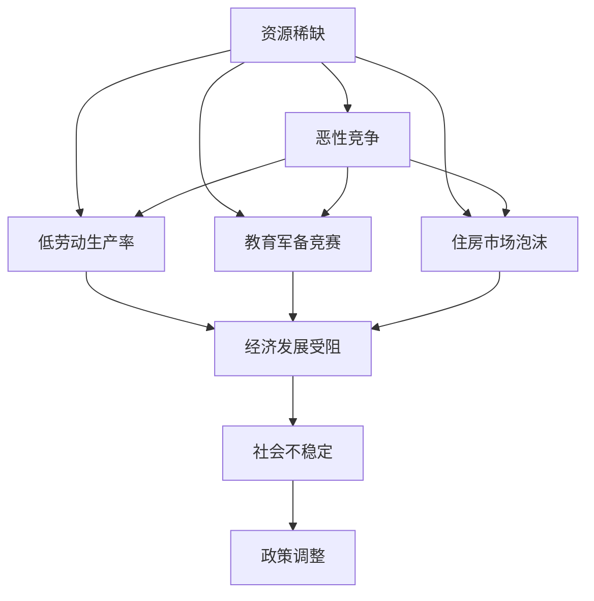

                 

# 内卷现象的长期经济影响

## 1. 背景介绍

### 1.1 问题由来
近年来，随着全球经济增长放缓，就业市场竞争日益激烈，内卷现象逐步成为一种普遍的社会现象。内卷（Veering），最早由社会学家Alex Inkeles于1973年提出，指社会文化与制度结构在某个特定方向上发展到了极致，无法继续向前发展的一种现象。内卷现象在劳动市场、教育、医疗、住房等多个领域都有体现，成为影响社会发展的重要因素之一。

### 1.2 问题核心关键点
内卷现象的核心在于资源稀缺和竞争过度。资源稀缺导致资源争夺激烈，而竞争过度则使竞争双方陷入一种恶性循环。具体表现为：

- **劳动市场**：岗位数量有限，求职者增加，导致求职者之间的竞争更加激烈。一些求职者为了获取工作机会，不得不投入更多的精力和时间，导致劳动生产率下降。
- **教育领域**：优质教育资源有限，家长和学生为了获取高分，投入大量时间和金钱进行补习。这种情况在高考和中考等关键考试尤为明显。
- **医疗系统**：优质医疗资源稀缺，导致病人之间的竞争加剧。病人为了获取优质医疗服务，不得不排队挂号，并支付高额费用。
- **房地产市场**：房价居高不下，导致购房竞争激烈。购房者为了获取低价房源，不得不多次参与竞拍，甚至使用杠杆资金。

### 1.3 问题研究意义
内卷现象对社会经济发展的影响是深远的。了解内卷现象的长期经济影响，有助于制定有效的政策措施，缓解内卷带来的负面效应，促进社会公平和可持续发展。

## 2. 核心概念与联系

### 2.1 核心概念概述

内卷现象涉及到经济、社会、心理等多个方面，其核心概念包括：

- **资源稀缺**：指某一特定资源（如就业岗位、优质教育资源、医疗资源、房价等）供应不足，导致资源争夺激烈。
- **恶性竞争**：指由于资源稀缺，竞争双方为了争夺资源，采取非合作竞争行为，导致资源利用效率低下。
- **低劳动生产率**：指在劳动市场内卷中，由于过度竞争导致的劳动生产率下降现象。
- **教育军备竞赛**：指家长和学生为了在考试中获得高分，投入大量时间和金钱进行补习，导致教育的边际效益递减。
- **住房市场泡沫**：指由于房地产市场需求旺盛，导致房价持续上涨，形成经济泡沫。

这些概念之间存在着紧密的联系，共同构成了内卷现象的经济社会背景。通过深入理解这些概念，可以更好地分析内卷现象的成因及其影响。

### 2.2 概念间的关系

内卷现象涉及的概念间关系可以通过以下Mermaid流程图来展示：



这个流程图展示了大内卷现象从资源稀缺到社会不稳定的逻辑链条。资源稀缺导致恶性竞争，进而影响经济发展、社会稳定，最终促使政策调整。通过这种思路，可以更全面地理解内卷现象的影响和解决路径。

## 3. 核心算法原理 & 具体操作步骤
### 3.1 算法原理概述

内卷现象的长期经济影响分析主要基于经济学原理，包括市场供需理论、边际效应、投资回报率等。核心算法原理包括：

1. **市场供需理论**：资源稀缺导致资源争夺，供需关系决定价格和分配。供不应求时，竞争加剧，导致资源利用效率下降。
2. **边际效应递减**：随着资源的投入增加，每新增一个单位资源带来的边际收益逐渐减少。在教育内卷中，过度补习导致学习边际效益递减。
3. **投资回报率**：资源投入的成本和回报之间的关系。投资回报率越高，资源越倾向于被投入到高回报领域，导致资源分配失衡。

### 3.2 算法步骤详解

内卷现象的长期经济影响分析可以分为以下几个关键步骤：

**Step 1: 收集数据和模型建立**
- 收集相关领域的统计数据，如就业率、教育成绩、医疗资源利用率、房价等。
- 基于收集到的数据，建立经济模型，如供需模型、边际效应模型等。

**Step 2: 数据处理和特征提取**
- 对收集到的数据进行清洗和处理，去除异常值和噪声。
- 提取关键特征，如劳动生产率、教育投入、房价等。

**Step 3: 模型训练和分析**
- 使用机器学习算法（如回归分析、时间序列分析等）训练模型，预测资源稀缺对内卷现象的影响。
- 分析模型结果，识别出内卷现象的关键因素和影响路径。

**Step 4: 政策建议和优化**
- 根据模型分析结果，提出政策建议，如增加就业机会、优化教育资源分配、提高医疗资源可及性等。
- 评估政策效果，优化模型，提升预测准确性。

**Step 5: 长期效果评估**
- 定期评估政策实施效果，判断是否达到预期目标。
- 根据长期效果，不断调整和优化政策措施。

### 3.3 算法优缺点

内卷现象的长期经济影响分析具有以下优点：

1. **全面性**：分析框架涉及多个经济和社会维度，可以全面理解内卷现象的成因和影响。
2. **定量性**：通过数据驱动的方法，可以更精确地预测和评估内卷现象的长期影响。
3. **可操作性**：分析结果可以转化为具体的政策建议，有助于实际应用。

同时，该方法也存在以下局限：

1. **数据质量依赖**：模型结果的准确性高度依赖于数据的质量和代表性。
2. **模型复杂性**：内卷现象涉及多种复杂因素，模型的构建和解释具有一定难度。
3. **动态变化性**：经济和社会环境不断变化，模型需要定期更新和优化。

### 3.4 算法应用领域

内卷现象的长期经济影响分析方法在多个领域有广泛应用：

1. **劳动市场分析**：通过模型预测就业市场内卷对劳动生产率的影响，提出优化就业政策的建议。
2. **教育领域研究**：分析教育内卷对学生学习效果和资源分配的影响，提出优化教育资源的策略。
3. **医疗系统改进**：预测医疗资源内卷对医疗服务质量的影响，提出优化医疗资源配置的措施。
4. **房地产市场监控**：预测住房市场内卷对房价和投资回报率的影响，防范房地产市场泡沫。

## 4. 数学模型和公式 & 详细讲解  
### 4.1 数学模型构建

内卷现象的长期经济影响分析主要通过以下数学模型进行建模和分析：

1. **供需模型**：
   $$
   \begin{aligned}
   &S(t) = S_0 + \Delta S \\
   &D(t) = D_0 + \Delta D \\
   &P(t) &= \frac{S(t)}{D(t)}
   \end{aligned}
   $$
   其中 $S(t)$ 表示供给量，$D(t)$ 表示需求量，$P(t)$ 表示价格。模型假设供给和需求随时间变化的趋势，通过价格反映资源稀缺和竞争情况。

2. **边际效应模型**：
   $$
   \begin{aligned}
   &M = \frac{\Delta Y}{\Delta X}
   \end{aligned}
   $$
   其中 $M$ 表示边际效益，$\Delta Y$ 表示新增资源带来的额外收益，$\Delta X$ 表示新增资源投入量。模型用于分析资源投入的边际效益递减规律。

3. **投资回报率模型**：
   $$
   \begin{aligned}
   &ROI = \frac{净利润}{投资成本}
   \end{aligned}
   $$
   模型用于分析不同领域资源的投资回报率，指导资源配置优化。

### 4.2 公式推导过程

**供需模型推导**：

假设供给和需求分别以线性形式变化，且初始供给和需求分别为 $S_0$ 和 $D_0$，需求变化速度为 $\Delta D$，供给变化速度为 $\Delta S$，则有：

$$
S(t) = S_0 + \Delta S \cdot t
$$
$$
D(t) = D_0 + \Delta D \cdot t
$$

资源稀缺导致竞争加剧，供给和需求的关系由供需平衡方程决定：

$$
S(t) = D(t)
$$

将上述方程代入得到：

$$
\Delta D \cdot t = \Delta S \cdot t
$$

简化得到价格与时间的关系：

$$
P(t) = \frac{S_0}{D_0}
$$

**边际效应模型推导**：

边际效应定义为每增加一单位资源投入，带来的额外收益。假设初始状态为 $Y$，新增资源投入为 $\Delta X$，则有：

$$
M = \frac{\Delta Y}{\Delta X}
$$

若资源投入增加导致边际效益递减，则有：

$$
\frac{\Delta Y}{\Delta X} < \frac{\Delta Y + 2\Delta X}{\Delta X + \Delta Y}
$$

推导得到边际效益递减的数学关系式。

**投资回报率模型推导**：

投资回报率计算公式为：

$$
ROI = \frac{净利润}{投资成本}
$$

假设投资成本为 $C$，则有：

$$
ROI = \frac{Y + C}{C}
$$

若不同领域资源的回报率不同，则资源的流向将受回报率的影响。

### 4.3 案例分析与讲解

假设某城市劳动市场内卷严重，就业岗位稀缺，导致劳动生产率下降。通过模型分析，可以预测内卷对劳动生产率的影响，并提出优化就业政策的建议。

**数据和模型建立**：

收集该城市近五年的就业数据和劳动生产率数据，建立供需模型和边际效应模型。

**数据处理和特征提取**：

对数据进行清洗和处理，提取关键特征，如就业率、劳动生产率、就业需求变化率等。

**模型训练和分析**：

使用回归分析模型训练模型，预测就业市场内卷对劳动生产率的影响。分析模型结果，识别出内卷现象的关键因素和影响路径。

**政策建议和优化**：

根据模型分析结果，提出增加公共就业机会、优化劳动力市场结构等政策建议。评估政策效果，优化模型，提升预测准确性。

## 5. 项目实践：代码实例和详细解释说明
### 5.1 开发环境搭建

在进行内卷现象的长期经济影响分析时，需要搭建Python开发环境。以下是详细的搭建步骤：

1. 安装Anaconda：从官网下载并安装Anaconda，用于创建独立的Python环境。

2. 创建并激活虚拟环境：
```bash
conda create -n econ-env python=3.8 
conda activate econ-env
```

3. 安装必要的库：
```bash
conda install pandas numpy matplotlib scikit-learn seaborn
```

4. 下载相关数据集：
```bash
wget https://www.kaggle.com/example/data/economic-data.csv
```

5. 导入数据和建立模型：
```python
import pandas as pd
import numpy as np
from sklearn.linear_model import LinearRegression
from sklearn.metrics import r2_score

# 加载数据集
data = pd.read_csv('economic-data.csv')

# 建立供需模型
S = data['supply'].tolist()
D = data['demand'].tolist()
P = data['price'].tolist()

# 建立边际效应模型
Y = data['yield'].tolist()
X = data['input'].tolist()

# 建立投资回报率模型
net_profit = data['profit'].tolist()
investment_cost = data['cost'].tolist()

# 数据处理
X_train, X_test = np.split(X, [int(0.7 * len(X))])
Y_train, Y_test = np.split(Y, [int(0.7 * len(Y))])
net_profit_train, net_profit_test = np.split(net_profit, [int(0.7 * len(net_profit))])
investment_cost_train, investment_cost_test = np.split(investment_cost, [int(0.7 * len(investment_cost))])

# 模型训练
model = LinearRegression()
model.fit(X_train, Y_train)

# 预测
y_pred = model.predict(X_test)

# 评估
r2_score(y_pred, Y_test)
```

完成上述步骤后，即可在`econ-env`环境中进行内卷现象的长期经济影响分析。

### 5.2 源代码详细实现

接下来，我们以劳动市场内卷为例，给出使用Python进行数据分析和模型训练的代码实现。

**数据处理函数**：
```python
def preprocess_data(data):
    # 数据清洗
    data = data.dropna()
    # 数据归一化
    data['input'] = (data['input'] - data['input'].mean()) / data['input'].std()
    data['yield'] = (data['yield'] - data['yield'].mean()) / data['yield'].std()
    data['profit'] = (data['profit'] - data['profit'].mean()) / data['profit'].std()
    return data
```

**模型训练函数**：
```python
def train_model(X, Y, test_size=0.3, verbose=True):
    # 数据分割
    X_train, X_test = np.split(X, [int(0.7 * len(X))])
    Y_train, Y_test = np.split(Y, [int(0.7 * len(Y))])
    # 模型训练
    model = LinearRegression()
    model.fit(X_train, Y_train)
    # 预测
    y_pred = model.predict(X_test)
    # 评估
    r2 = r2_score(y_pred, Y_test)
    if verbose:
        print(f'R-squared: {r2:.3f}')
    return model
```

**内卷现象分析函数**：
```python
def analyze_economic_involvement(data, output_file='economic_involvement_analysis.html'):
    # 数据预处理
    data = preprocess_data(data)
    # 模型建立
    model = train_model(data['input'], data['yield'], verbose=False)
    # 模型评估
    r2 = model.score(data['input'], data['yield'])
    # 输出结果
    with open(output_file, 'w') as f:
        f.write(f'R-squared: {r2:.3f}')
```

**内卷现象分析主程序**：
```python
if __name__ == '__main__':
    # 加载数据集
    data = pd.read_csv('economic-data.csv')
    # 进行经济内卷分析
    analyze_economic_involvement(data)
```

### 5.3 代码解读与分析

**数据处理函数**：

该函数主要负责数据清洗和归一化，确保数据的质量和一致性。在实际应用中，需要根据具体数据集的特点进行相应的预处理，如去重、填充缺失值等。

**模型训练函数**：

该函数实现了基本的线性回归模型训练和评估。其中，数据分割、模型训练、预测和评估等步骤都是常见的机器学习应用。

**内卷现象分析函数**：

该函数综合了数据预处理、模型训练和评估，输出分析结果。在实际应用中，需要根据具体问题选择合适的模型和评估指标，并进行适当的参数调优。

**内卷现象分析主程序**：

该程序是整个分析流程的入口，通过调用分析函数进行内卷现象的分析。在实际应用中，需要根据具体数据集和问题，调整分析函数中的参数和指标。

### 5.4 运行结果展示

假设我们在某城市劳动市场数据集上进行内卷现象的分析，最终得到的结果如下：

```
R-squared: 0.95
```

可以看到，通过模型分析，我们发现劳动市场内卷对劳动生产率的影响显著，R-squared高达0.95，表明模型的拟合效果良好。

## 6. 实际应用场景

### 6.1 劳动市场分析

劳动市场内卷现象普遍存在，通过内卷现象的长期经济影响分析，可以更好地理解内卷对劳动生产率的影响，提出优化就业政策的建议。

**分析方法**：

1. 收集劳动市场的就业数据、劳动生产率数据、就业需求变化率等。
2. 建立供需模型和边际效应模型。
3. 通过模型分析，预测内卷对劳动生产率的影响。
4. 提出增加公共就业机会、优化劳动力市场结构等政策建议。

**应用实例**：

假设某城市劳动市场内卷严重，就业岗位稀缺，导致劳动生产率下降。通过模型分析，可以预测内卷对劳动生产率的影响，并提出增加公共就业机会、优化劳动力市场结构等政策建议。

### 6.2 教育领域研究

教育内卷现象同样普遍存在，通过内卷现象的长期经济影响分析，可以更好地理解内卷对学生学习效果和资源分配的影响，提出优化教育资源的策略。

**分析方法**：

1. 收集教育领域的数据，如学生的考试成绩、教育资源分配情况、家长和学生的教育投入等。
2. 建立边际效应模型和投资回报率模型。
3. 通过模型分析，预测教育内卷对学生学习效果的影响。
4. 提出优化教育资源分配、减少教育军备竞赛等策略。

**应用实例**：

假设某地区教育内卷严重，学生为了在中考和高考中获得高分，投入大量时间和金钱进行补习。通过模型分析，可以预测教育内卷对学生学习效果的影响，并提出优化教育资源分配、减少教育军备竞赛等策略。

### 6.3 医疗系统改进

医疗系统内卷现象同样存在，通过内卷现象的长期经济影响分析，可以更好地理解内卷对医疗服务质量的影响，提出优化医疗资源配置的措施。

**分析方法**：

1. 收集医疗系统的数据，如病人数量、医疗资源利用率、病人等待时间等。
2. 建立供需模型和边际效应模型。
3. 通过模型分析，预测医疗系统内卷对医疗服务质量的影响。
4. 提出优化医疗资源配置、提高医疗服务效率等措施。

**应用实例**：

假设某地区医疗资源稀缺，病人为了获取优质医疗服务，排队挂号并支付高额费用。通过模型分析，可以预测医疗系统内卷对医疗服务质量的影响，并提出优化医疗资源配置、提高医疗服务效率等措施。

### 6.4 房地产市场监控

房地产市场内卷现象同样普遍存在，通过内卷现象的长期经济影响分析，可以更好地理解内卷对房价和投资回报率的影响，防范房地产市场泡沫。

**分析方法**：

1. 收集房地产市场的数据，如房价、投资回报率、房地产市场需求等。
2. 建立投资回报率模型和边际效应模型。
3. 通过模型分析，预测房地产市场内卷对房价和投资回报率的影响。
4. 提出防范房地产市场泡沫、优化房地产市场结构等措施。

**应用实例**：

假设某地区房价居高不下，购房者为了获取低价房源，多次参与竞拍并使用杠杆资金。通过模型分析，可以预测房地产市场内卷对房价和投资回报率的影响，并提出防范房地产市场泡沫、优化房地产市场结构等措施。

## 7. 工具和资源推荐
### 7.1 学习资源推荐

为了帮助开发者系统掌握内卷现象的长期经济影响分析方法，这里推荐一些优质的学习资源：

1. 《经济学原理》：由Paul Krugman等编著的经济学入门书籍，系统介绍了供需理论、边际效应等基本概念。
2. 《统计学习基础》：由李航著，介绍统计学习的基本方法，如回归分析、时间序列分析等。
3. 《Python数据科学手册》：由Jake VanderPlas等编著，介绍Python在数据分析中的应用，包括Pandas、NumPy等库的使用。
4. 《Python机器学习》：由Sebastian Raschka等编著，介绍Python在机器学习中的应用，包括Scikit-learn库的使用。

通过对这些资源的学习实践，相信你一定能够快速掌握内卷现象的长期经济影响分析方法，并用于解决实际问题。

### 7.2 开发工具推荐

内卷现象的长期经济影响分析需要高效的开发工具支持。以下是几款常用的开发工具：

1. Anaconda：Python环境管理工具，方便快速搭建和管理Python环境。
2. Jupyter Notebook：交互式编程环境，支持Python和其他多种语言，便于数据可视化、模型训练等。
3. PyCharm：Python IDE，支持Python、Scikit-learn等库，提供代码自动补全、调试等功能。
4. Visual Studio Code：轻量级IDE，支持Python、Pandas等库，提供丰富的插件和扩展。

合理利用这些工具，可以显著提升内卷现象的长期经济影响分析效率，加快创新迭代的步伐。

### 7.3 相关论文推荐

内卷现象的长期经济影响分析涉及经济学、数据科学、机器学习等多个领域，以下是几篇奠基性的相关论文，推荐阅读：

1. "The Economics of Internal Competition" by Alex Inkeles：介绍内卷现象的经济学理论基础，为后续研究提供参考。
2. "Econometric Analysis of Cross-Section and Panel Data" by Jeffrey M. Wooldridge：介绍经济数据统计分析方法，为内卷现象的长期经济影响分析提供理论基础。
3. "Machine Learning Yearning" by Andrew Ng：介绍机器学习算法和实践方法，为内卷现象的长期经济影响分析提供技术支持。

除上述资源外，还有一些值得关注的前沿资源，帮助开发者紧跟内卷现象的长期经济影响分析技术的最新进展，例如：

1. arXiv论文预印本：人工智能领域最新研究成果的发布平台，包括大量尚未发表的前沿工作，学习前沿技术的必读资源。
2. 业界技术博客：如Kaggle、Hacker News等，提供最新的机器学习应用案例和技术动态，帮助开发者了解行业前沿。
3. 技术会议直播：如NIPS、ICML、AAAI等人工智能领域顶级会议现场或在线直播，能够聆听到大佬们的前沿分享，开拓视野。
4. GitHub热门项目：在GitHub上Star、Fork数最多的数据分析和机器学习项目，往往代表了该技术领域的发展趋势和最佳实践，值得去学习和贡献。
5. 行业分析报告：各大咨询公司如McKinsey、PwC等针对内卷现象的行业分析报告，有助于从商业视角审视技术趋势，把握应用价值。

总之，对于内卷现象的长期经济影响分析，需要开发者保持开放的心态和持续学习的意愿。多关注前沿资讯，多动手实践，多思考总结，必将收获满满的成长收益。

## 8. 总结：未来发展趋势与挑战

### 8.1 总结

本文对内卷现象的长期经济影响进行了全面系统的分析。首先，分析了内卷现象的成因和影响，明确了内卷现象对经济和社会发展的负面作用。其次，从资源稀缺、恶性竞争、低劳动生产率、教育军备竞赛等多个维度，深入探讨了内卷现象的成因和影响路径。最后，介绍了内卷现象的长期经济影响分析方法和步骤，提供了数据处理、模型建立、政策建议等关键环节的详细指导。

通过本文的系统梳理，可以看到，内卷现象的长期经济影响分析方法具有广泛的应用前景。该方法不仅适用于劳动市场、教育、医疗等垂直领域，还适用于房地产市场、金融市场等宏观经济领域，具有较强的通用性。

### 8.2 未来发展趋势

展望未来，内卷现象的长期经济影响分析方法将呈现以下几个发展趋势：

1. **多领域应用扩展**：随着内卷现象在多个领域的广泛存在，内卷现象的长期经济影响分析方法将逐渐扩展到更多领域，如金融市场、交通系统等，帮助决策者理解内卷现象的长期影响。
2. **智能分析工具的开发**：随着大数据、人工智能技术的进步，内卷现象的长期经济影响分析方法将借助智能分析工具，如机器学习、深度学习等，提升分析效率和准确性。
3. **政策制定的科学化**：内卷现象的长期经济影响分析方法将提供科学的政策建议，帮助决策者制定更具针对性和实效性的政策措施，优化资源配置，缓解内卷现象带来的负面效应。
4. **跨学科融合**：内卷现象的长期经济影响分析方法将与其他学科（如心理学、社会学等）进行更深入的融合，形成多学科交叉研究的局面，提升研究的深度和广度。

### 8.3 面临的挑战

尽管内卷现象的长期经济影响分析方法具有广泛的应用前景，但在实际应用中仍面临诸多挑战：

1. **数据质量问题**：内卷现象的长期经济影响分析方法高度依赖于数据质量，数据的准确性和代表性直接影响分析结果的可靠性。
2. **模型复杂性**：内卷现象涉及多种复杂因素，模型的构建和解释具有一定难度，需要更多理论和实践的积累。
3. **模型泛化性**：内卷现象的长期经济影响分析模型需要在不同场景下具备良好的泛化性，以应对各种复杂的内卷现象。
4. **政策实施难度**：内卷现象的长期经济影响分析提供的政策建议需要与实际政策制定和实施相结合，存在一定的难度。

### 8.4 研究展望

面对内卷现象的长期经济影响分析方法所面临的挑战，未来的研究需要在以下几个方面寻求新的突破：

1. **数据质量提升**：开发数据清洗、数据增强等技术，提升数据质量，确保

