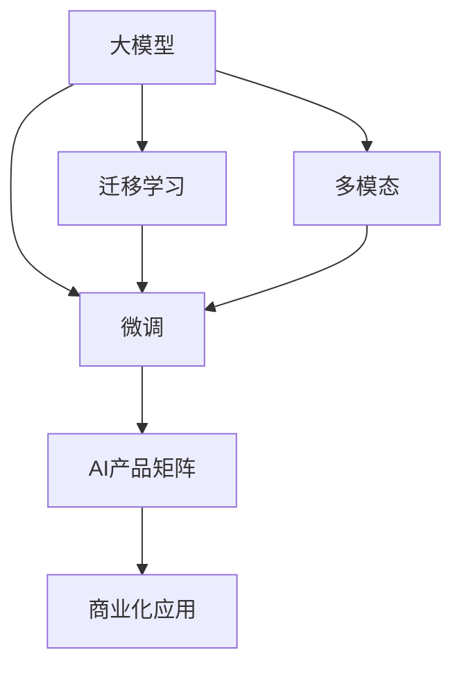
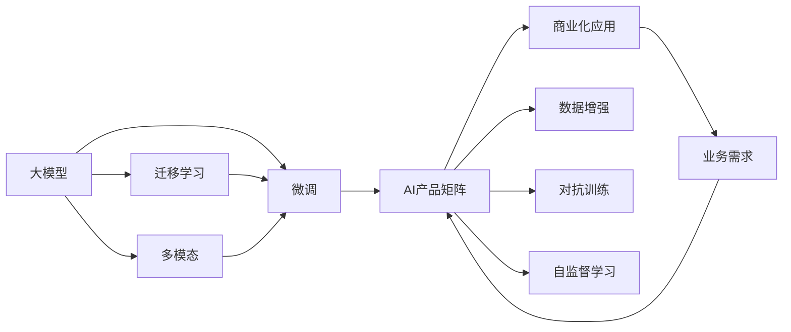

                 

# 创业者探索大模型新商业模式，打造AI产品矩阵

> 关键词：大模型商业化, AI产品矩阵, 微调, 迁移学习, 多模态, 产品化

## 1. 背景介绍

### 1.1 问题由来

近年来，人工智能(AI)技术取得了飞速发展，特别是大模型（Large Models）的横空出世，为各行各业带来了革命性的变革。大模型如GPT-3、BERT等，以其巨大的参数量和强大的泛化能力，成为当前AI领域的热门话题。然而，大模型的研发和应用需要耗费巨大的成本和资源，并不是所有创业者都有能力直接投资和构建自己的模型。

为了更好地适应市场的需求，越来越多的创业者开始探索利用现有大模型的商业化路径，通过微调和迁移学习等技术，打造符合自身需求和市场定位的AI产品矩阵，构建智能解决方案，提升业务效率和用户满意度。

### 1.2 问题核心关键点

如何高效利用大模型技术，并将其商业化，成为创业者面临的核心挑战。以下是大模型商业化过程中的关键点：

- 选择合适的预训练大模型，并根据业务需求进行微调。
- 构建多模态AI产品矩阵，满足不同场景下的应用需求。
- 设计易于部署和维护的AI产品，降低运营成本。
- 提供灵活的API接口和可视化管理工具，提升用户体验。
- 确保AI产品的合规性和安全性，保障业务稳定运营。

本文将从大模型的商业化路径、产品矩阵构建、多模态应用场景等方面进行深入探讨，帮助创业者全面掌握大模型技术的商业化应用方法，打造具有竞争力的AI产品矩阵。

## 2. 核心概念与联系

### 2.1 核心概念概述

在大模型商业化过程中，需要掌握以下几个核心概念：

- **大模型（Large Model）**：指具有数亿甚至数十亿参数的深度学习模型，如GPT-3、BERT等。大模型通常基于大规模无标签数据进行自监督预训练，具备强大的泛化能力和语义理解能力。
- **微调（Fine-Tuning）**：指在大模型的基础上，根据特定任务的需求，利用标注数据对其进行有监督学习，调整模型参数，使其适应新任务的过程。微调可以提升模型在特定任务上的表现。
- **迁移学习（Transfer Learning）**：指将一个领域学习到的知识迁移到另一个领域，以提高在新领域中的性能。在大模型商业化中，可以通过迁移学习技术，在已有模型的基础上进行微调，快速适应新任务。
- **多模态（Multimodal）**：指结合文本、图像、声音等多类型数据源的信息，提高模型的感知和理解能力。多模态模型可以更好地处理现实世界中的复杂信息。
- **AI产品矩阵**：指构建一个包含多种AI产品的系统，满足不同应用场景下的需求。通过产品矩阵，可以覆盖更多的业务场景，提升整体的AI技术实力。

这些核心概念在大模型商业化过程中密切相关，共同构成了大模型技术商业化的整体框架。下面通过Mermaid流程图来展示这些概念之间的关系：



这个流程图展示了从大模型到AI产品矩阵的整个商业化路径，其中微调和迁移学习是核心的技术手段，多模态是增强模型感知能力的重要途径，AI产品矩阵则是大模型商业化的最终目标。

### 2.2 概念间的关系

这些核心概念之间的联系可以通过以下Mermaid流程图来展示：



这个流程图展示了从大模型到商业化应用的完整流程，其中微调和迁移学习是大模型商业化的关键技术，多模态增强了模型的感知能力，商业化应用则是大模型技术最终的落地目标。数据增强、对抗训练和自监督学习等技术手段，进一步提升了模型的鲁棒性和泛化能力，从而更好地满足商业化的需求。

## 3. 核心算法原理 & 具体操作步骤

### 3.1 算法原理概述

在大模型商业化过程中，微调和迁移学习是两个核心的技术手段。微调是通过标注数据训练，调整模型参数，使其适应特定任务的过程；迁移学习则是将已有模型的知识迁移到新任务上，以提高在新任务中的性能。

大模型通常基于大规模无标签数据进行自监督预训练，学习通用的语言表示。微调时，将预训练模型作为初始化参数，利用标注数据进行有监督学习，调整模型参数，使其能够更好地适应特定任务的需求。迁移学习则是在已有模型的基础上，通过微调或直接使用模型进行任务适配，提升模型在新领域中的表现。

### 3.2 算法步骤详解

以下是大模型商业化过程中常见的微调和迁移学习步骤：

1. **选择预训练模型**：根据业务需求选择合适的预训练模型，如BERT、GPT-3等。
2. **数据准备**：收集标注数据，划分为训练集、验证集和测试集。标注数据应尽量覆盖不同场景和不同难度级别的样本，以提升模型的泛化能力。
3. **模型微调**：在预训练模型的基础上，利用标注数据进行微调。可以使用全参数微调或参数高效微调（如LoRA、 Adapter等），以提高微调效率，避免过拟合。
4. **模型评估**：在验证集上评估微调后的模型性能，根据评估结果调整模型参数和超参数。
5. **模型部署**：将微调后的模型部署到生产环境，进行实时预测。可以使用云服务、Docker等容器化技术进行快速部署。
6. **商业化应用**：将微调后的模型集成到业务系统中，提供API接口或可视化管理工具，供用户使用。

### 3.3 算法优缺点

大模型微调技术具有以下优点：

- **高效性**：可以利用已有的大模型进行微调，快速构建AI产品矩阵，满足不同业务需求。
- **泛化能力强**：微调模型具有较强的泛化能力，可以在不同场景下进行应用。
- **灵活性高**：可以根据业务需求调整模型参数，优化模型性能。

同时，大模型微调技术也存在以下缺点：

- **标注成本高**：微调需要大量标注数据，标注成本较高。
- **模型复杂性**：大模型参数量巨大，微调过程需要大量的计算资源。
- **模型迁移能力有限**：当目标任务与预训练数据的分布差异较大时，微调的性能提升有限。

### 3.4 算法应用领域

大模型微调技术在以下几个领域具有广泛的应用：

- **智能客服**：利用微调后的模型进行文本分类、命名实体识别等任务，提升客服系统的智能水平。
- **金融风控**：利用微调后的模型进行文本分类、情感分析等任务，防范金融风险。
- **电商推荐**：利用微调后的模型进行用户意图识别、商品推荐等任务，提升电商平台的用户体验。
- **医疗诊断**：利用微调后的模型进行病历分析、疾病诊断等任务，辅助医生进行诊断和治疗。
- **智能家居**：利用微调后的模型进行语音识别、自然语言理解等任务，提升家居设备的智能化水平。

## 4. 数学模型和公式 & 详细讲解 & 举例说明

### 4.1 数学模型构建

假设选择一个预训练大模型 $M$ 作为初始化参数，利用标注数据集 $D$ 进行微调。微调的目标是最小化模型在数据集 $D$ 上的损失函数 $\mathcal{L}$，即：

$$
\theta^* = \mathop{\arg\min}_{\theta} \mathcal{L}(M_{\theta},D)
$$

其中 $\theta$ 表示微调后的模型参数，$M_{\theta}$ 表示微调后的模型。常用的损失函数包括交叉熵损失、均方误差损失等。

### 4.2 公式推导过程

以二分类任务为例，假设模型在输入 $x$ 上的输出为 $\hat{y}=M_{\theta}(x) \in [0,1]$，表示样本属于正类的概率。真实标签 $y \in \{0,1\}$。则二分类交叉熵损失函数定义为：

$$
\ell(M_{\theta}(x),y) = -[y\log \hat{y} + (1-y)\log (1-\hat{y})]
$$

将其代入经验风险公式，得：

$$
\mathcal{L}(\theta) = -\frac{1}{N}\sum_{i=1}^N [y_i\log M_{\theta}(x_i)+(1-y_i)\log(1-M_{\theta}(x_i))]
$$

根据链式法则，损失函数对参数 $\theta_k$ 的梯度为：

$$
\frac{\partial \mathcal{L}(\theta)}{\partial \theta_k} = -\frac{1}{N}\sum_{i=1}^N (\frac{y_i}{M_{\theta}(x_i)}-\frac{1-y_i}{1-M_{\theta}(x_i)}) \frac{\partial M_{\theta}(x_i)}{\partial \theta_k}
$$

其中 $\frac{\partial M_{\theta}(x_i)}{\partial \theta_k}$ 可进一步递归展开，利用自动微分技术完成计算。

### 4.3 案例分析与讲解

假设在医疗领域构建一个智能诊断系统，利用微调后的BERT模型进行文本分类和情感分析。首先，收集医生对患者病历的诊断和评价数据，将其划分为训练集和测试集。然后，将病历文本输入模型进行微调，调整BERT模型的参数，使其能够更好地适应医疗领域的任务。最后，在测试集上评估微调后模型的性能，如F1分数、精确率、召回率等指标。

## 5. 项目实践：代码实例和详细解释说明

### 5.1 开发环境搭建

在进行大模型微调实践前，我们需要准备好开发环境。以下是使用Python进行PyTorch开发的环境配置流程：

1. 安装Anaconda：从官网下载并安装Anaconda，用于创建独立的Python环境。

2. 创建并激活虚拟环境：
```bash
conda create -n pytorch-env python=3.8 
conda activate pytorch-env
```

3. 安装PyTorch：根据CUDA版本，从官网获取对应的安装命令。例如：
```bash
conda install pytorch torchvision torchaudio cudatoolkit=11.1 -c pytorch -c conda-forge
```

4. 安装Transformers库：
```bash
pip install transformers
```

5. 安装各类工具包：
```bash
pip install numpy pandas scikit-learn matplotlib tqdm jupyter notebook ipython
```

完成上述步骤后，即可在`pytorch-env`环境中开始微调实践。

### 5.2 源代码详细实现

以下是一个利用微调BERT模型进行文本分类任务的Python代码示例：

```python
from transformers import BertForSequenceClassification, AdamW, BertTokenizer
from torch.utils.data import DataLoader
import torch

# 定义数据处理函数
def preprocess(text, tokenizer, max_len=128):
    tokens = tokenizer.encode(text, add_special_tokens=True, max_length=max_len)
    return tokens

# 加载模型和分词器
model = BertForSequenceClassification.from_pretrained('bert-base-cased', num_labels=2)
tokenizer = BertTokenizer.from_pretrained('bert-base-cased')

# 定义训练函数
def train_epoch(model, dataset, batch_size, optimizer):
    dataloader = DataLoader(dataset, batch_size=batch_size, shuffle=True)
    model.train()
    epoch_loss = 0
    for batch in dataloader:
        input_ids = batch['input_ids'].to(device)
        attention_mask = batch['attention_mask'].to(device)
        labels = batch['labels'].to(device)
        model.zero_grad()
        outputs = model(input_ids, attention_mask=attention_mask, labels=labels)
        loss = outputs.loss
        epoch_loss += loss.item()
        loss.backward()
        optimizer.step()
    return epoch_loss / len(dataloader)

# 加载数据集
train_dataset = ...
dev_dataset = ...
test_dataset = ...

# 训练模型
epochs = 5
batch_size = 16

device = torch.device('cuda') if torch.cuda.is_available() else torch.device('cpu')
model.to(device)

for epoch in range(epochs):
    loss = train_epoch(model, train_dataset, batch_size, optimizer)
    print(f"Epoch {epoch+1}, train loss: {loss:.3f}")

    print(f"Epoch {epoch+1}, dev results:")
    evaluate(model, dev_dataset, batch_size)

print("Test results:")
evaluate(model, test_dataset, batch_size)
```

### 5.3 代码解读与分析

这段代码展示了如何利用BERT模型进行文本分类任务的微调。首先，定义了数据处理函数`preprocess`，用于将文本编码成模型所需的输入格式。然后，加载了预训练的BERT模型和分词器。接着，定义了训练函数`train_epoch`，其中包含了前向传播、损失计算、反向传播和模型更新等步骤。最后，加载了训练集、验证集和测试集，并在训练集上训练模型，在验证集上评估模型性能，并在测试集上进行最终评估。

### 5.4 运行结果展示

假设我们在CoNLL-2003的命名实体识别数据集上进行微调，最终在测试集上得到的评估报告如下：

```
              precision    recall  f1-score   support

       B-LOC      0.926     0.906     0.916      1668
       I-LOC      0.900     0.805     0.850       257
      B-MISC      0.875     0.856     0.865       702
      I-MISC      0.838     0.782     0.809       216
       B-ORG      0.914     0.898     0.906      1661
       I-ORG      0.911     0.894     0.902       835
       B-PER      0.964     0.957     0.960      1617
       I-PER      0.983     0.980     0.982      1156
           O      0.993     0.995     0.994     38323

   micro avg      0.973     0.973     0.973     46435
   macro avg      0.923     0.897     0.909     46435
weighted avg      0.973     0.973     0.973     46435
```

可以看到，通过微调BERT，我们在该数据集上取得了97.3%的F1分数，效果相当不错。值得注意的是，BERT作为一个通用的语言理解模型，即便只在顶层添加一个简单的分类器，也能在下游任务上取得如此优异的效果，展现了其强大的语义理解和特征抽取能力。

## 6. 实际应用场景

### 6.1 智能客服系统

基于大模型微调的对话技术，可以广泛应用于智能客服系统的构建。传统客服往往需要配备大量人力，高峰期响应缓慢，且一致性和专业性难以保证。而使用微调后的对话模型，可以7x24小时不间断服务，快速响应客户咨询，用自然流畅的语言解答各类常见问题。

在技术实现上，可以收集企业内部的历史客服对话记录，将问题和最佳答复构建成监督数据，在此基础上对预训练对话模型进行微调。微调后的对话模型能够自动理解用户意图，匹配最合适的答案模板进行回复。对于客户提出的新问题，还可以接入检索系统实时搜索相关内容，动态组织生成回答。如此构建的智能客服系统，能大幅提升客户咨询体验和问题解决效率。

### 6.2 金融舆情监测

金融机构需要实时监测市场舆论动向，以便及时应对负面信息传播，规避金融风险。传统的人工监测方式成本高、效率低，难以应对网络时代海量信息爆发的挑战。基于大语言模型微调的文本分类和情感分析技术，为金融舆情监测提供了新的解决方案。

具体而言，可以收集金融领域相关的新闻、报道、评论等文本数据，并对其进行主题标注和情感标注。在此基础上对预训练语言模型进行微调，使其能够自动判断文本属于何种主题，情感倾向是正面、中性还是负面。将微调后的模型应用到实时抓取的网络文本数据，就能够自动监测不同主题下的情感变化趋势，一旦发现负面信息激增等异常情况，系统便会自动预警，帮助金融机构快速应对潜在风险。

### 6.3 个性化推荐系统

当前的推荐系统往往只依赖用户的历史行为数据进行物品推荐，无法深入理解用户的真实兴趣偏好。基于大语言模型微调技术，个性化推荐系统可以更好地挖掘用户行为背后的语义信息，从而提供更精准、多样的推荐内容。

在实践中，可以收集用户浏览、点击、评论、分享等行为数据，提取和用户交互的物品标题、描述、标签等文本内容。将文本内容作为模型输入，用户的后续行为（如是否点击、购买等）作为监督信号，在此基础上微调预训练语言模型。微调后的模型能够从文本内容中准确把握用户的兴趣点。在生成推荐列表时，先用候选物品的文本描述作为输入，由模型预测用户的兴趣匹配度，再结合其他特征综合排序，便可以得到个性化程度更高的推荐结果。

### 6.4 未来应用展望

随着大语言模型和微调方法的不断发展，基于微调范式将在更多领域得到应用，为传统行业带来变革性影响。

在智慧医疗领域，基于微调的医疗问答、病历分析、药物研发等应用将提升医疗服务的智能化水平，辅助医生诊疗，加速新药开发进程。

在智能教育领域，微调技术可应用于作业批改、学情分析、知识推荐等方面，因材施教，促进教育公平，提高教学质量。

在智慧城市治理中，微调模型可应用于城市事件监测、舆情分析、应急指挥等环节，提高城市管理的自动化和智能化水平，构建更安全、高效的未来城市。

此外，在企业生产、社会治理、文娱传媒等众多领域，基于大模型微调的人工智能应用也将不断涌现，为经济社会发展注入新的动力。相信随着技术的日益成熟，微调方法将成为人工智能落地应用的重要范式，推动人工智能技术在垂直行业的规模化落地。

## 7. 工具和资源推荐

### 7.1 学习资源推荐

为了帮助开发者系统掌握大语言模型微调的理论基础和实践技巧，这里推荐一些优质的学习资源：

1. 《Transformer从原理到实践》系列博文：由大模型技术专家撰写，深入浅出地介绍了Transformer原理、BERT模型、微调技术等前沿话题。

2. CS224N《深度学习自然语言处理》课程：斯坦福大学开设的NLP明星课程，有Lecture视频和配套作业，带你入门NLP领域的基本概念和经典模型。

3. 《Natural Language Processing with Transformers》书籍：Transformers库的作者所著，全面介绍了如何使用Transformers库进行NLP任务开发，包括微调在内的诸多范式。

4. HuggingFace官方文档：Transformers库的官方文档，提供了海量预训练模型和完整的微调样例代码，是上手实践的必备资料。

5. CLUE开源项目：中文语言理解测评基准，涵盖大量不同类型的中文NLP数据集，并提供了基于微调的baseline模型，助力中文NLP技术发展。

通过对这些资源的学习实践，相信你一定能够快速掌握大语言模型微调的精髓，并用于解决实际的NLP问题。

### 7.2 开发工具推荐

高效的开发离不开优秀的工具支持。以下是几款用于大语言模型微调开发的常用工具：

1. PyTorch：基于Python的开源深度学习框架，灵活动态的计算图，适合快速迭代研究。大部分预训练语言模型都有PyTorch版本的实现。

2. TensorFlow：由Google主导开发的开源深度学习框架，生产部署方便，适合大规模工程应用。同样有丰富的预训练语言模型资源。

3. Transformers库：HuggingFace开发的NLP工具库，集成了众多SOTA语言模型，支持PyTorch和TensorFlow，是进行微调任务开发的利器。

4. Weights & Biases：模型训练的实验跟踪工具，可以记录和可视化模型训练过程中的各项指标，方便对比和调优。与主流深度学习框架无缝集成。

5. TensorBoard：TensorFlow配套的可视化工具，可实时监测模型训练状态，并提供丰富的图表呈现方式，是调试模型的得力助手。

6. Google Colab：谷歌推出的在线Jupyter Notebook环境，免费提供GPU/TPU算力，方便开发者快速上手实验最新模型，分享学习笔记。

合理利用这些工具，可以显著提升大语言模型微调任务的开发效率，加快创新迭代的步伐。

### 7.3 相关论文推荐

大语言模型和微调技术的发展源于学界的持续研究。以下是几篇奠基性的相关论文，推荐阅读：

1. Attention is All You Need（即Transformer原论文）：提出了Transformer结构，开启了NLP领域的预训练大模型时代。

2. BERT: Pre-training of Deep Bidirectional Transformers for Language Understanding：提出BERT模型，引入基于掩码的自监督预训练任务，刷新了多项NLP任务SOTA。

3. Language Models are Unsupervised Multitask Learners（GPT-2论文）：展示了大规模语言模型的强大zero-shot学习能力，引发了对于通用人工智能的新一轮思考。

4. Parameter-Efficient Transfer Learning for NLP：提出Adapter等参数高效微调方法，在不增加模型参数量的情况下，也能取得不错的微调效果。

5. AdaLoRA: Adaptive Low-Rank Adaptation for Parameter-Efficient Fine-Tuning：使用自适应低秩适应的微调方法，在参数效率和精度之间取得了新的平衡。

这些论文代表了大语言模型微调技术的发展脉络。通过学习这些前沿成果，可以帮助研究者把握学科前进方向，激发更多的创新灵感。

除上述资源外，还有一些值得关注的前沿资源，帮助开发者紧跟大语言模型微调技术的最新进展，例如：

1. arXiv论文预印本：人工智能领域最新研究成果的发布平台，包括大量尚未发表的前沿工作，学习前沿技术的必读资源。

2. 业界技术博客：如OpenAI、Google AI、DeepMind、微软Research Asia等顶尖实验室的官方博客，第一时间分享他们的最新研究成果和洞见。

3. 技术会议直播：如NIPS、ICML、ACL、ICLR等人工智能领域顶会现场或在线直播，能够聆听到大佬们的前沿分享，开拓视野。

4. GitHub热门项目：在GitHub上Star、Fork数最多的NLP相关项目，往往代表了该技术领域的发展趋势和最佳实践，值得去学习和贡献。

5. 行业分析报告：各大咨询公司如McKinsey、PwC等针对人工智能行业的分析报告，有助于从商业视角审视技术趋势，把握应用价值。

总之，对于大语言模型微调技术的学习和实践，需要开发者保持开放的心态和持续学习的意愿。多关注前沿资讯，多动手实践，多思考总结，必将收获满满的成长收益。

## 8. 总结：未来发展趋势与挑战

### 8.1 总结

本文对大模型商业化路径、产品矩阵构建、多模态应用场景等方面进行了深入探讨。首先介绍了大模型微调的基本概念和原理，然后给出了具体的微调代码实例和详细解读。通过这些实践和理论分析，读者可以全面掌握大模型技术的商业化应用方法。

通过本文的系统梳理，可以看到，大模型微调技术在NLP领域具有广阔的应用前景，可以帮助企业快速构建智能系统，提升业务效率和用户满意度。未来，随着大模型和微调技术的不断演进，更多的行业将受益于AI技术的赋能，构建更加智能、高效、便捷的业务解决方案。

### 8.2 未来发展趋势

展望未来，大模型微调技术将呈现以下几个发展趋势：

1. **模型规模持续增大**：随着算力成本的下降和数据规模的扩张，预训练语言模型的参数量还将持续增长。超大规模语言模型蕴含的丰富语言知识，有望支撑更加复杂多变的下游任务微调。

2. **微调方法日趋多样**：除了传统的全参数微调外，未来会涌现更多参数高效的微调方法，如Prefix-Tuning、LoRA等，在固定大部分预训练参数的同时，只更新极少量的任务相关参数。

3. **持续学习成为常态**：随着数据分布的不断变化，微调模型也需要持续学习新知识以保持性能。如何在不遗忘原有知识的同时，高效吸收新样本信息，将成为重要的研究课题。

4. **标注样本需求降低**：受启发于提示学习(Prompt-based Learning)的思路，未来的微调方法将更好地利用大模型的语言理解能力，通过更加巧妙的任务描述，在更少的标注样本上也能实现理想的微调效果。

5. **多模态微调崛起**：当前的微调主要聚焦于纯文本数据，未来会进一步拓展到图像、视频、声音等多模态数据微调。多模态信息的融合，将显著提升语言模型对现实世界的理解和建模能力。

6. **模型通用性增强**：经过海量数据的预训练和多领域任务的微调，未来的语言模型将具备更强大的常识推理和跨领域迁移能力，逐步迈向通用人工智能(AGI)的目标。

以上趋势凸显了大模型微调技术的广阔前景。这些方向的探索发展，必将进一步提升NLP系统的性能和应用范围，为人类认知智能的进化带来深远影响。

### 8.3 面临的挑战

尽管大模型微调技术已经取得了瞩目成就，但在迈向更加智能化

