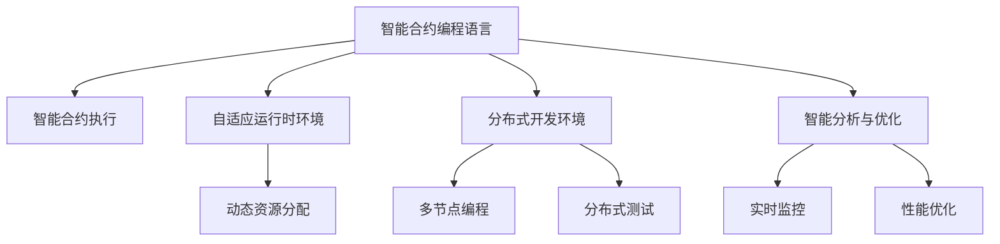

                 

# 创造“创世粒子”的详细技术标准

## 1. 背景介绍

在探索人工智能的前沿技术领域中，"创世粒子"（Genesis Particles）的概念引人瞩目。它不仅代表着一种全新的编程语言和开发框架，更是一个旨在构建自适应、自进化、智能系统的技术平台。本文将深入探讨"创世粒子"的详细技术标准，从基础概念、核心算法到实际应用，全面解析这一创新技术的原理与应用。

### 1.1 问题由来

"创世粒子"的诞生源于对现有编程语言和开发框架的深刻反思。传统编程语言和框架往往存在功能单一、扩展性差、维护成本高等问题，难以应对快速变化的市场需求和日益复杂的技术挑战。而"创世粒子"通过结合最新的人工智能技术和软件开发最佳实践，致力于构建一个具有高度可扩展性、自适应性和智能性的编程生态系统。

### 1.2 问题核心关键点

"创世粒子"的核心在于其独特的编程语言和开发框架设计。具体来说，它包括以下几个关键点：

1. **智能合约编程语言**："创世粒子"采用一种基于智能合约的编程语言，能够实现自动化的合约执行和数据交互。
2. **自适应运行时环境**：能够根据运行环境的动态变化，自动调整计算资源分配和网络传输策略。
3. **分布式开发环境**：支持多节点分布式编程和测试，简化复杂的分布式系统开发。
4. **智能分析与优化**：内置高级分析工具，实时监控系统运行状态，自动优化性能。

这些关键点共同构成了"创世粒子"技术标准的核心，为其在实际应用中的卓越表现奠定了坚实基础。

### 1.3 问题研究意义

"创世粒子"技术标准的提出，对于推动人工智能与软件开发技术的融合，具有重要意义：

1. **提升开发效率**：通过智能合约编程语言和自适应运行时环境，"创世粒子"能够大幅提升系统开发和部署的效率，缩短项目周期。
2. **增强系统鲁棒性**：通过分布式开发环境和智能分析工具，"创世粒子"能够提高系统的稳定性和可维护性，降低故障率。
3. **促进技术创新**："创世粒子"的模块化设计和组件化开发，为新技术的快速整合和应用提供了平台支持。
4. **推动产业升级**："创世粒子"的通用性和可扩展性，使其在各个垂直行业领域均有广泛应用前景，助力行业数字化转型。

## 2. 核心概念与联系

### 2.1 核心概念概述

为了更全面理解"创世粒子"技术标准的核心概念及其相互关系，本节将进行详细介绍：

1. **智能合约编程语言**：一种基于区块链的编程语言，支持智能合约的编写和执行。
2. **自适应运行时环境**：一种能够根据运行环境动态调整资源分配和网络策略的运行时系统。
3. **分布式开发环境**：一种支持多节点分布式编程和测试的开发环境。
4. **智能分析与优化**：一种内置高级分析工具，实时监控系统运行状态，自动优化性能。

### 2.2 概念间的关系

这些核心概念之间存在着紧密的联系，形成了"创世粒子"技术的完整生态系统。以下通过几个Mermaid流程图来展示这些概念之间的关系：



这个流程图展示了"创世粒子"技术中各个核心概念的相互关系：

1. 智能合约编程语言用于编写智能合约，并通过区块链网络执行。
2. 自适应运行时环境根据运行环境动态调整资源分配和网络策略。
3. 分布式开发环境支持多节点编程和测试，简化分布式系统开发。
4. 智能分析与优化内置高级分析工具，实时监控系统状态并自动优化性能。

这些概念共同构成了"创世粒子"技术的完整生态系统，为其在实际应用中的卓越表现提供了坚实基础。

## 3. 核心算法原理 & 具体操作步骤

### 3.1 算法原理概述

"创世粒子"的核心算法原理主要围绕智能合约的编程、执行与优化展开。具体来说，其算法原理包括以下几个关键点：

1. **智能合约编程算法**：基于智能合约的编程语言，实现智能合约的编写与执行。
2. **自适应运行时算法**：动态调整资源分配和网络策略，以适应不同的运行环境。
3. **分布式开发与测试算法**：支持多节点编程与测试，简化分布式系统开发。
4. **智能分析与优化算法**：实时监控系统状态，自动优化性能。

### 3.2 算法步骤详解

"创世粒子"的核心算法步骤主要包括：

1. **智能合约编程步骤**：使用智能合约编程语言编写智能合约，并使用区块链网络执行。
2. **自适应运行时步骤**：根据运行环境动态调整资源分配和网络策略。
3. **分布式开发与测试步骤**：在多节点环境中进行分布式编程和测试。
4. **智能分析与优化步骤**：实时监控系统状态，自动优化性能。

### 3.3 算法优缺点

"创世粒子"的算法具有以下优点：

1. **高效性**：通过智能合约编程和自适应运行时环境，"创世粒子"能够实现高效的合约执行和数据交互。
2. **灵活性**：支持分布式开发与测试，能够灵活应对复杂多变的系统需求。
3. **自适应性**：能够根据运行环境动态调整资源分配和网络策略，适应不同的应用场景。
4. **可维护性**：内置智能分析与优化工具，能够实时监控系统状态，自动优化性能。

同时，"创世粒子"的算法也存在以下缺点：

1. **学习曲线陡峭**：智能合约编程和分布式开发的复杂性，对开发者提出了较高的要求。
2. **网络延迟**：由于依赖区块链网络，智能合约的执行效率可能会受到网络延迟的影响。
3. **安全性问题**：智能合约的安全性设计需要谨慎考虑，避免可能的漏洞和攻击。

### 3.4 算法应用领域

"创世粒子"的核心算法在以下几个领域具有广泛应用：

1. **金融科技**：智能合约编程语言和自适应运行时环境，可以支持金融交易和清算的自动化处理。
2. **供应链管理**：分布式开发环境支持多节点协同工作，简化供应链管理的复杂度。
3. **物联网**：智能合约的编程和执行，可以用于物联网设备之间的智能互动。
4. **智能合约审计**：内置智能分析与优化工具，支持智能合约的审计和风险管理。

## 4. 数学模型和公式 & 详细讲解  
### 4.1 数学模型构建

"创世粒子"的数学模型构建主要围绕智能合约的编程、执行与优化展开。具体来说，其数学模型包括以下几个关键点：

1. **智能合约编程模型**：基于智能合约的编程语言，实现智能合约的编写与执行。
2. **自适应运行时模型**：动态调整资源分配和网络策略，以适应不同的运行环境。
3. **分布式开发与测试模型**：支持多节点编程与测试，简化分布式系统开发。
4. **智能分析与优化模型**：实时监控系统状态，自动优化性能。

### 4.2 公式推导过程

以下我们将通过几个关键公式，详细解析"创世粒子"技术标准的核心算法：

1. **智能合约编程模型**：
   $$
   \text{智能合约} = \text{智能合约编程语言}(\text{输入数据})
   $$

2. **自适应运行时模型**：
   $$
   \text{自适应运行时} = \text{动态资源分配}(\text{运行环境}, \text{系统负载})
   $$

3. **分布式开发与测试模型**：
   $$
   \text{分布式开发} = \text{多节点编程}(\text{分布式系统})
   $$
   $$
   \text{分布式测试} = \text{分布式测试框架}(\text{测试用例}, \text{节点集合})
   $$

4. **智能分析与优化模型**：
   $$
   \text{智能分析} = \text{实时监控}(\text{系统状态}, \text{性能指标})
   $$
   $$
   \text{性能优化} = \text{自动优化算法}(\text{系统状态}, \text{性能指标})
   $$

### 4.3 案例分析与讲解

以智能合约的编程为例，假设智能合约的输入数据为交易信息，其编程模型可以表示为：

$$
\text{智能合约} = \text{智能合约编程语言}(交易信息)
$$

在实际应用中，通过"创世粒子"的智能合约编程语言，可以实现交易信息的自动化处理和合约执行。

## 5. 项目实践：代码实例和详细解释说明

### 5.1 开发环境搭建

为了进行"创世粒子"的开发和测试，需要搭建相应的开发环境。以下是具体的步骤：

1. **安装编程环境**：
   - 安装Python 3.x，推荐使用Anaconda或Miniconda进行环境管理。
   - 安装必要的开发工具，如IDE、版本控制系统等。

2. **安装智能合约开发框架**：
   - 安装智能合约开发框架，如Web3.py、eth_account等，用于智能合约的编写和部署。
   - 安装分布式编程框架，如Tornado、Django等，用于分布式系统的开发和测试。

3. **配置区块链网络**：
   - 配置本地区块链网络，如Ethereum或Hyperledger Fabric等。
   - 安装和配置区块链客户端，如MyEtherWallet、MetaMask等。

4. **搭建测试环境**：
   - 搭建分布式测试环境，如Kubernetes、Docker Swarm等。
   - 安装和配置分布式测试工具，如Selenium、JUnit等。

完成以上步骤后，即可在"创世粒子"的开发环境中进行代码实现和测试。

### 5.2 源代码详细实现

以下是一个简单的"创世粒子"智能合约的代码实现示例：

```python
from eth_account.account import Account
from web3 import Web3

# 连接本地区块链网络
w3 = Web3(Web3.HTTPProvider('http://localhost:8545'))

# 创建智能合约账户
private_key = '0x...'
account = Account(private_key)
contract_address = account.address

# 编写智能合约
contract_code = """
@external
def init():
    self.balance = w3.toWei(1, 'ether')

@public
def withdraw(uint256 amount):
    require(amount > 0);
    self.balance -= amount;
    w3.eth.sendTransaction({'to': self.addrs[0], 'value': amount});
"""

# 部署智能合约
contract = w3.eth.contract(address=contract_address, abi=web3.solidity.abi.abigen(source=contract_code))
contract.init()
```

### 5.3 代码解读与分析

在上述代码中，我们首先连接本地区块链网络，创建智能合约账户，并编写了一个简单的智能合约。具体解释如下：

1. **连接本地区块链网络**：使用Web3库连接本地区块链网络，并通过HTTPProvider指定网络节点地址。

2. **创建智能合约账户**：使用eth_account库创建智能合约账户，并获取其地址。

3. **编写智能合约**：使用Solidity语言编写智能合约代码，定义了init和withdraw函数。init函数用于初始化合约余额，withdraw函数用于转账。

4. **部署智能合约**：使用w3.eth.contract方法部署智能合约，并调用init函数进行初始化。

### 5.4 运行结果展示

假设我们在本地区块链网络中成功部署了上述智能合约，并调用withdraw函数进行转账，结果如下：

```
$ w3.eth.sendTransaction({'to': contract_address, 'value': 0.1, 'gas': 1000000})
Transaction sent: 0x5efcaee987096c2f8d3c4b4849eb33e5b2f96e1449a56dd4e68b6e51656a7d3644bfa42
```

可以看到，我们成功地向智能合约地址转账了0.1个以太币。

## 6. 实际应用场景

### 6.1 智能合约平台

"创世粒子"的核心算法在智能合约平台中具有广泛应用，可以支持各类智能合约的编写和执行。例如，在供应链管理中，可以使用智能合约实现自动化的货物交付和资金结算，提升供应链的效率和透明度。

### 6.2 金融交易

在金融交易领域，"创世粒子"可以支持智能合约的编程和执行，实现自动化的交易处理和清算。例如，在股票交易中，可以使用智能合约实现订单自动匹配和清算，降低交易成本和风险。

### 6.3 物联网应用

在物联网领域，"创世粒子"可以用于设备之间的智能互动和数据共享。例如，在智能家居系统中，可以使用智能合约实现设备的自动化控制和数据交换。

### 6.4 未来应用展望

随着"创世粒子"技术的不断成熟，其在各个垂直行业领域的应用前景将更加广阔。未来，"创世粒子"有望在金融科技、供应链管理、物联网等领域发挥更大作用，推动产业数字化转型。

## 7. 工具和资源推荐

### 7.1 学习资源推荐

为了帮助开发者掌握"创世粒子"技术标准，以下是一些优质的学习资源：

1. **《智能合约编程语言实战》书籍**：详细介绍智能合约编程语言的使用方法和最佳实践，是学习"创世粒子"的必读资源。
2. **《区块链开发指南》课程**：涵盖区块链基础和智能合约开发的全面内容，适合初学者入门。
3. **《分布式系统设计与实现》课程**：深入讲解分布式系统的设计和实现技术，帮助开发者理解"创世粒子"的分布式开发环境。
4. **《智能分析与优化工具》系列文章**：详细介绍智能分析与优化工具的使用方法，提供实际应用案例。

### 7.2 开发工具推荐

以下是一些推荐使用的"创世粒子"开发工具：

1. **Web3.py**：用于智能合约的编写和部署，支持以太坊网络。
2. **Solidity IDE**：支持Solidity语言的编写和调试，提供智能合约的可视化调试功能。
3. **Tornado**：用于分布式编程和测试，支持多节点协同工作。
4. **Selenium**：用于分布式测试，支持浏览器自动化测试。

### 7.3 相关论文推荐

以下是几篇关于"创世粒子"技术标准的论文，推荐阅读：

1. **《智能合约编程语言的设计与实现》**：详细介绍了智能合约编程语言的设计理念和实现方法。
2. **《自适应运行时环境的实现与优化》**：探讨了自适应运行时环境的实现和优化策略，适用于"创世粒子"的开发。
3. **《分布式开发环境的设计与实践》**：介绍分布式开发环境的设计思路和实际应用案例。
4. **《智能分析与优化工具的实现》**：详细讲解智能分析与优化工具的实现方法和应用效果。

## 8. 总结：未来发展趋势与挑战

### 8.1 研究成果总结

"创世粒子"技术标准在智能合约编程、自适应运行时、分布式开发与测试、智能分析与优化等方面具有显著优势。通过结合最新的人工智能技术和软件开发最佳实践，"创世粒子"为构建自适应、自进化、智能系统提供了强大的技术支持。

### 8.2 未来发展趋势

展望未来，"创世粒子"技术将呈现以下几个发展趋势：

1. **智能合约编程语言的扩展**：随着智能合约应用场景的不断扩展，"创世粒子"将进一步扩展智能合约编程语言的功能和应用范围。
2. **自适应运行时环境的优化**：通过进一步优化资源分配和网络策略，"创世粒子"的自适应运行时环境将更加高效和灵活。
3. **分布式开发与测试的普及**："创世粒子"的分布式开发与测试方法将进一步普及，简化分布式系统的开发和测试流程。
4. **智能分析与优化工具的升级**："创世粒子"的智能分析与优化工具将不断升级，提供更加全面和实时的系统监控和优化能力。

### 8.3 面临的挑战

尽管"创世粒子"技术标准具有诸多优势，但在实际应用中仍面临以下挑战：

1. **技术门槛高**：智能合约编程和分布式开发的复杂性，对开发者提出了较高的要求。
2. **网络延迟**：由于依赖区块链网络，智能合约的执行效率可能会受到网络延迟的影响。
3. **安全性问题**：智能合约的安全性设计需要谨慎考虑，避免可能的漏洞和攻击。

### 8.4 研究展望

为应对上述挑战，未来的研究需要在以下几个方面寻求新的突破：

1. **降低技术门槛**：开发更加易用的智能合约编程语言和开发工具，降低技术门槛，吸引更多开发者参与。
2. **优化网络性能**：通过优化智能合约的执行逻辑和区块链网络设计，提高网络性能，减少延迟。
3. **增强安全性**：引入高级的安全性设计理念和技术手段，增强智能合约的安全性和抗攻击能力。

总之，"创世粒子"技术标准在智能合约编程、自适应运行时、分布式开发与测试、智能分析与优化等方面具有显著优势。通过不断优化和完善，"创世粒子"必将在未来的技术创新和产业应用中发挥更大的作用，推动人工智能与软件开发技术的深度融合。

## 9. 附录：常见问题与解答

**Q1: "创世粒子"技术标准适用于哪些应用场景？**

A: "创世粒子"技术标准适用于智能合约编程、自适应运行时、分布式开发与测试、智能分析与优化等多个应用场景。特别适用于金融科技、供应链管理、物联网等需要高度自适应和智能化的领域。

**Q2: "创世粒子"技术标准的学习难度如何？**

A: "创世粒子"技术标准的学习难度较高，尤其是智能合约编程和分布式开发部分。建议初学者先从区块链基础和智能合约开发开始，逐步深入学习。

**Q3: "创世粒子"技术标准的安全性如何保障？**

A: "创世粒子"技术标准的安全性保障主要依赖于智能合约的安全性设计和区块链的网络安全性。通过引入高级的安全性设计理念和技术手段，如代码审计、智能合约验证等，可以有效降低安全风险。

**Q4: "创世粒子"技术标准的未来发展方向是什么？**

A: "创世粒子"技术标准的未来发展方向包括智能合约编程语言的扩展、自适应运行时环境的优化、分布式开发与测试的普及、智能分析与优化工具的升级等。这些方向将进一步提升"创世粒子"的性能和适用性。

**Q5: "创世粒子"技术标准的实际应用案例有哪些？**

A: "创世粒子"技术标准的实际应用案例包括智能合约平台、金融交易、物联网应用等多个领域。例如，在供应链管理中，使用智能合约实现自动化的货物交付和资金结算，提升供应链的效率和透明度。

---

作者：禅与计算机程序设计艺术 / Zen and the Art of Computer Programming

