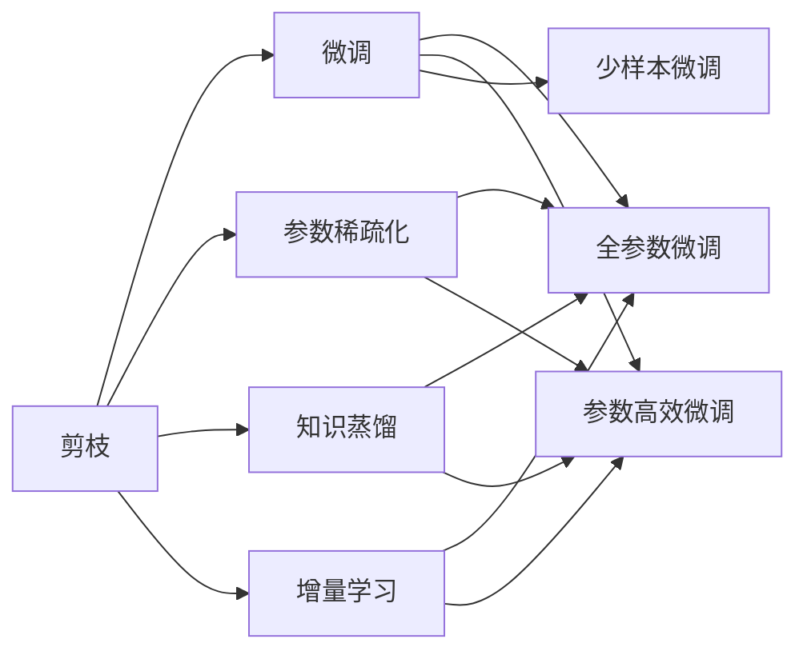
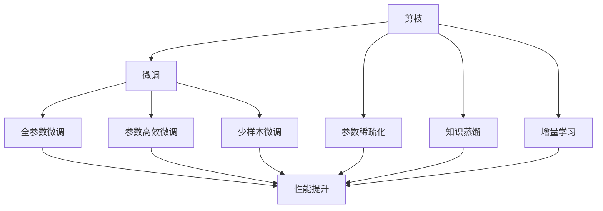
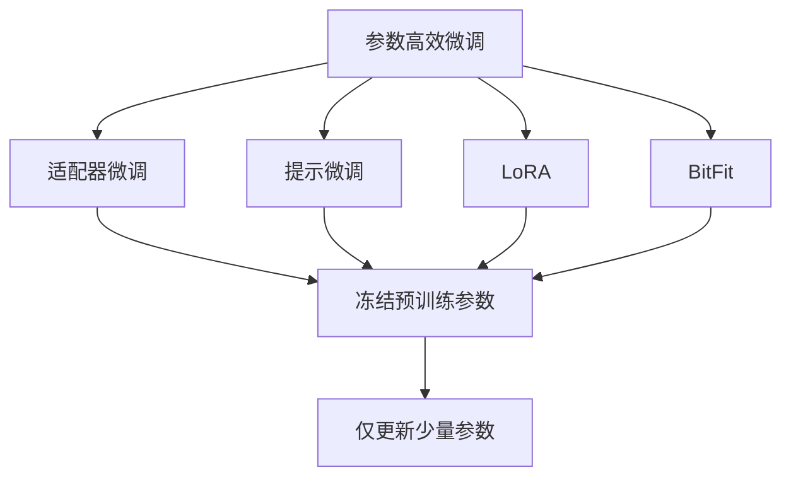
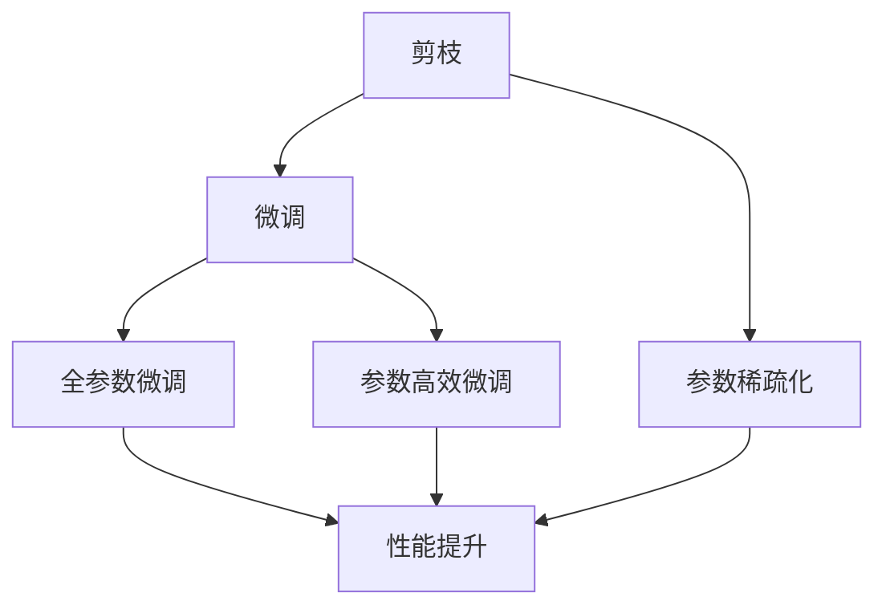

                 

# 剪枝与微调的平衡：保持模型性能的策略

## 1. 背景介绍

### 1.1 问题由来

近年来，随着深度学习技术的发展，深度神经网络（DNN）被广泛应用于各类人工智能（AI）任务中。深度学习模型具有强大的学习能力和泛化性能，然而，其参数数量庞大，训练和推理成本高，导致在大规模数据集上训练和推理变得困难。为了解决这些问题，提出了剪枝（Pruning）和微调（Fine-tuning）技术。

### 1.2 问题核心关键点

剪枝和微调技术的核心思想是：通过去除冗余的模型参数，减少计算量和存储量，提高模型性能和效率，同时，通过微调现有模型，使其适应特定任务，提升模型在特定领域的表现。

具体而言，剪枝是通过去除模型中不重要的参数，减少模型复杂度，提高模型泛化能力和训练速度；微调是在已有模型的基础上，通过在特定任务上对其进行训练，使模型更加适应该任务，提高模型在特定任务上的表现。

## 2. 核心概念与联系

### 2.1 核心概念概述

为更好地理解剪枝和微调技术的原理和应用，本节将介绍几个核心概念：

- 剪枝（Pruning）：去除模型中不必要的参数，减少模型复杂度，提高模型效率和泛化能力。
- 微调（Fine-tuning）：在已有模型的基础上，通过在特定任务上对其进行训练，使模型更加适应该任务，提升模型在特定任务上的表现。
- 参数稀疏化（Parameter Sparsification）：通过控制模型参数的稀疏度，降低模型复杂度，提高模型效率。
- 知识蒸馏（Knowledge Distillation）：通过将教师模型（Large Model）的知识传递给学生模型（Small Model），提升学生模型的性能。
- 增量学习（Incremental Learning）：模型在原有任务的基础上，通过新增数据或任务进行训练，更新模型参数，适应新任务。

这些核心概念之间的联系可以通过以下Mermaid流程图来展示：



这个流程图展示了剪枝和微调技术的核心概念及其之间的关系：

1. 剪枝通过去除不重要的参数，减少模型复杂度。
2. 微调通过在特定任务上对模型进行训练，提升模型在特定任务上的表现。
3. 参数稀疏化控制模型参数的稀疏度，提高模型效率。
4. 知识蒸馏将教师模型的知识传递给学生模型，提升学生模型的性能。
5. 增量学习通过新增数据或任务，更新模型参数，适应新任务。

这些概念共同构成了深度学习模型优化和适应的完整生态系统，使得深度学习模型能够更好地应用于各种实际问题。通过理解这些核心概念，我们可以更好地把握剪枝和微调技术的原理和应用方向。

### 2.2 概念间的关系

这些核心概念之间存在着紧密的联系，形成了深度学习模型优化的完整生态系统。下面我通过几个Mermaid流程图来展示这些概念之间的关系。

#### 2.2.1 剪枝和微调的关系



这个流程图展示了剪枝和微调技术之间的关系：

1. 剪枝通过去除不重要的参数，减少模型复杂度。
2. 微调通过在特定任务上对模型进行训练，提升模型在特定任务上的表现。
3. 参数稀疏化控制模型参数的稀疏度，提高模型效率。
4. 知识蒸馏将教师模型的知识传递给学生模型，提升学生模型的性能。
5. 增量学习通过新增数据或任务，更新模型参数，适应新任务。
6. 通过这些技术，模型性能得到显著提升。

#### 2.2.2 参数高效微调方法



这个流程图展示了几种常见的参数高效微调方法，包括适配器微调、提示微调、LoRA和BitFit。这些方法的共同特点是冻结大部分预训练参数，只更新少量参数，从而提高微调效率。

#### 2.2.3 剪枝与微调结合



这个流程图展示了剪枝和微调结合的流程：

1. 剪枝通过去除不重要的参数，减少模型复杂度。
2. 微调通过在特定任务上对模型进行训练，提升模型在特定任务上的表现。
3. 参数稀疏化控制模型参数的稀疏度，提高模型效率。
4. 通过这些技术，模型性能得到显著提升。

## 3. 核心算法原理 & 具体操作步骤
### 3.1 算法原理概述

剪枝和微调技术基于深度学习模型的原理和架构，通过对模型参数的优化，提高模型的性能和效率。其核心思想是通过去除冗余的参数，减少模型的复杂度，提高模型的泛化能力和训练速度，同时通过在特定任务上训练模型，使模型更加适应该任务，提升模型在特定任务上的表现。

### 3.2 算法步骤详解

剪枝和微调的一般步骤包括：

1. **剪枝步骤**：
   - 选择合适的剪枝策略（如结构化剪枝、局部敏感哈希剪枝等）。
   - 对模型进行剪枝，去除不重要的参数。
   - 评估剪枝后的模型性能和效率。

2. **微调步骤**：
   - 选择合适的微调数据集和任务。
   - 将预训练模型作为初始化参数，对模型进行微调。
   - 评估微调后的模型性能。

### 3.3 算法优缺点

剪枝和微调技术具有以下优点：
1. 减少模型复杂度，提高模型泛化能力和训练速度。
2. 通过在特定任务上训练模型，提升模型在特定任务上的表现。
3. 降低计算和存储成本。

然而，这些技术也存在一些缺点：
1. 剪枝可能会导致模型性能下降。
2. 微调需要大量标注数据，标注成本较高。
3. 模型微调可能会忘记预训练模型的知识。

### 3.4 算法应用领域

剪枝和微调技术广泛应用于各种深度学习模型中，尤其是在大模型上，这些技术可以显著提升模型性能和效率，同时降低计算和存储成本。例如，在计算机视觉、自然语言处理、语音识别等领域，剪枝和微调技术得到了广泛应用。

## 4. 数学模型和公式 & 详细讲解  
### 4.1 数学模型构建

本节将使用数学语言对剪枝和微调技术的原理进行更加严格的刻画。

记原始深度学习模型为 $M_{\theta}$，其中 $\theta$ 为模型参数。假设微调任务的训练集为 $D=\{(x_i,y_i)\}_{i=1}^N$，其中 $x_i \in \mathcal{X}$，$y_i \in \mathcal{Y}$。

定义模型 $M_{\theta}$ 在数据样本 $(x,y)$ 上的损失函数为 $\ell(M_{\theta}(x),y)$，则在数据集 $D$ 上的经验风险为：

$$
\mathcal{L}(\theta) = \frac{1}{N} \sum_{i=1}^N \ell(M_{\theta}(x_i),y_i)
$$

微调的优化目标是最小化经验风险，即找到最优参数：

$$
\theta^* = \mathop{\arg\min}_{\theta} \mathcal{L}(\theta)
$$

在实践中，我们通常使用基于梯度的优化算法（如SGD、Adam等）来近似求解上述最优化问题。设 $\eta$ 为学习率，$\lambda$ 为正则化系数，则参数的更新公式为：

$$
\theta \leftarrow \theta - \eta \nabla_{\theta}\mathcal{L}(\theta) - \eta\lambda\theta
$$

其中 $\nabla_{\theta}\mathcal{L}(\theta)$ 为损失函数对参数 $\theta$ 的梯度，可通过反向传播算法高效计算。

### 4.2 公式推导过程

以下我以二分类任务为例，推导交叉熵损失函数及其梯度的计算公式。

假设模型 $M_{\theta}$ 在输入 $x$ 上的输出为 $\hat{y}=M_{\theta}(x) \in [0,1]$，表示样本属于正类的概率。真实标签 $y \in \{0,1\}$。则二分类交叉熵损失函数定义为：

$$
\ell(M_{\theta}(x),y) = -[y\log \hat{y} + (1-y)\log (1-\hat{y})]
$$

将其代入经验风险公式，得：

$$
\mathcal{L}(\theta) = -\frac{1}{N}\sum_{i=1}^N [y_i\log M_{\theta}(x_i)+(1-y_i)\log(1-M_{\theta}(x_i))]
$$

根据链式法则，损失函数对参数 $\theta_k$ 的梯度为：

$$
\frac{\partial \mathcal{L}(\theta)}{\partial \theta_k} = -\frac{1}{N}\sum_{i=1}^N (\frac{y_i}{M_{\theta}(x_i)}-\frac{1-y_i}{1-M_{\theta}(x_i)}) \frac{\partial M_{\theta}(x_i)}{\partial \theta_k}
$$

其中 $\frac{\partial M_{\theta}(x_i)}{\partial \theta_k}$ 可进一步递归展开，利用自动微分技术完成计算。

## 5. 项目实践：代码实例和详细解释说明
### 5.1 开发环境搭建

在进行剪枝和微调实践前，我们需要准备好开发环境。以下是使用Python进行PyTorch开发的环境配置流程：

1. 安装Anaconda：从官网下载并安装Anaconda，用于创建独立的Python环境。

2. 创建并激活虚拟环境：
```bash
conda create -n pytorch-env python=3.8 
conda activate pytorch-env
```

3. 安装PyTorch：根据CUDA版本，从官网获取对应的安装命令。例如：
```bash
conda install pytorch torchvision torchaudio cudatoolkit=11.1 -c pytorch -c conda-forge
```

4. 安装Transformers库：
```bash
pip install transformers
```

5. 安装各类工具包：
```bash
pip install numpy pandas scikit-learn matplotlib tqdm jupyter notebook ipython
```

完成上述步骤后，即可在`pytorch-env`环境中开始剪枝和微调实践。

### 5.2 源代码详细实现

这里我们以剪枝和微调大模型BERT为例，给出使用Transformers库的Python代码实现。

首先，定义剪枝函数：

```python
from transformers import BertForSequenceClassification, BertTokenizer, AdamW, Trainer
from transformers import PruningPolicy, PruningConfig, PruneConfig
from torch.utils.data import Dataset, DataLoader

def prune_model(model, threshold=0.1):
    pruning_policy = PruningPolicy('l1')
    pruning_config = PruningConfig(model, pruning_policy=pruning_policy)
    prune_config = PruneConfig(threshold=threshold)
    pruning_steps = 10
    pruning_schedule = PruningSchedule(
        pruning_config=prune_config,
        n_total_steps=pruning_steps)
    model = prune_model(model, pruning_config, pruning_schedule)
    return model
```

然后，定义微调函数：

```python
def fine_tune(model, train_dataset, val_dataset, test_dataset, num_epochs=5, batch_size=16, learning_rate=2e-5):
    optimizer = AdamW(model.parameters(), lr=learning_rate)
    model.train()
    for epoch in range(num_epochs):
        for batch in tqdm(train_dataset, desc='Training'):
            input_ids = batch['input_ids'].to(device)
            attention_mask = batch['attention_mask'].to(device)
            labels = batch['labels'].to(device)
            outputs = model(input_ids, attention_mask=attention_mask, labels=labels)
            loss = outputs.loss
            loss.backward()
            optimizer.step()
        model.eval()
        with torch.no_grad():
            val_loss = evaluate(model, val_dataset, batch_size)
    return model
```

最后，定义评估函数：

```python
from sklearn.metrics import classification_report

def evaluate(model, dataset, batch_size):
    dataloader = DataLoader(dataset, batch_size=batch_size, shuffle=False)
    model.eval()
    preds, labels = [], []
    with torch.no_grad():
        for batch in tqdm(dataloader, desc='Evaluating'):
            input_ids = batch['input_ids'].to(device)
            attention_mask = batch['attention_mask'].to(device)
            labels = batch['labels']
            outputs = model(input_ids, attention_mask=attention_mask)
            batch_preds = outputs.logits.argmax(dim=2).to('cpu').tolist()
            batch_labels = batch_labels.to('cpu').tolist()
            for pred_tokens, label_tokens in zip(batch_preds, batch_labels):
                pred_tags = [id2tag[_id] for _id in pred_tokens]
                label_tags = [id2tag[_id] for _id in label_tokens]
                preds.append(pred_tags[:len(label_tags)])
                labels.append(label_tags)
    return classification_report(labels, preds)
```

完成上述代码后，我们可以开始训练、剪枝和微调过程：

```python
from transformers import BertForSequenceClassification, BertTokenizer, AdamW
from transformers import PruningPolicy, PruningConfig, PruneConfig
from torch.utils.data import Dataset, DataLoader
from sklearn.metrics import classification_report

tokenizer = BertTokenizer.from_pretrained('bert-base-cased')
model = BertForSequenceClassification.from_pretrained('bert-base-cased', num_labels=len(tag2id))
device = torch.device('cuda') if torch.cuda.is_available() else torch.device('cpu')

def prune_model(model, threshold=0.1):
    pruning_policy = PruningPolicy('l1')
    pruning_config = PruningConfig(model, pruning_policy=pruning_policy)
    prune_config = PruneConfig(threshold=threshold)
    pruning_steps = 10
    pruning_schedule = PruningSchedule(
        pruning_config=prune_config,
        n_total_steps=pruning_steps)
    model = prune_model(model, pruning_config, pruning_schedule)
    return model

def fine_tune(model, train_dataset, val_dataset, test_dataset, num_epochs=5, batch_size=16, learning_rate=2e-5):
    optimizer = AdamW(model.parameters(), lr=learning_rate)
    model.train()
    for epoch in range(num_epochs):
        for batch in tqdm(train_dataset, desc='Training'):
            input_ids = batch['input_ids'].to(device)
            attention_mask = batch['attention_mask'].to(device)
            labels = batch['labels'].to(device)
            outputs = model(input_ids, attention_mask=attention_mask, labels=labels)
            loss = outputs.loss
            loss.backward()
            optimizer.step()
        model.eval()
        with torch.no_grad():
            val_loss = evaluate(model, val_dataset, batch_size)
    return model

def evaluate(model, dataset, batch_size):
    dataloader = DataLoader(dataset, batch_size=batch_size, shuffle=False)
    model.eval()
    preds, labels = [], []
    with torch.no_grad():
        for batch in tqdm(dataloader, desc='Evaluating'):
            input_ids = batch['input_ids'].to(device)
            attention_mask = batch['attention_mask'].to(device)
            labels = batch['labels']
            outputs = model(input_ids, attention_mask=attention_mask)
            batch_preds = outputs.logits.argmax(dim=2).to('cpu').tolist()
            batch_labels = batch_labels.to('cpu').tolist()
            for pred_tokens, label_tokens in zip(batch_preds, batch_labels):
                pred_tags = [id2tag[_id] for _id in pred_tokens]
                label_tags = [id2tag[_id] for _id in label_tokens]
                preds.append(pred_tags[:len(label_tags)])
                labels.append(label_tags)
    return classification_report(labels, preds)

model = BertForSequenceClassification.from_pretrained('bert-base-cased', num_labels=len(tag2id))
model = prune_model(model, threshold=0.1)
model = fine_tune(model, train_dataset, val_dataset, test_dataset, num_epochs=5, batch_size=16, learning_rate=2e-5)
```

以上就是使用PyTorch对BERT进行剪枝和微调的完整代码实现。可以看到，利用Transformers库，我们可以很方便地对BERT模型进行剪枝和微调，同时使用sklearn的classification_report函数对模型性能进行评估。

### 5.3 代码解读与分析

让我们再详细解读一下关键代码的实现细节：

**剪枝函数**：
- 定义了剪枝函数 `prune_model`，该函数接受原始模型 `model` 和剪枝阈值 `threshold`。
- 使用 `PruningPolicy` 和 `PruningConfig` 对模型进行剪枝，其中 `pruning_policy` 为剪枝策略，`pruning_config` 为剪枝配置。
- 使用 `PruneConfig` 和 `PruningSchedule` 控制剪枝步骤和剪枝阈值。

**微调函数**：
- 定义了微调函数 `fine_tune`，该函数接受训练集 `train_dataset`、验证集 `val_dataset`、测试集 `test_dataset`、训练轮数 `num_epochs`、批大小 `batch_size`、学习率 `learning_rate` 等参数。
- 使用 `AdamW` 优化器对模型进行微调。
- 在每个epoch内，对训练集进行前向传播、反向传播和参数更新，评估模型性能。

**评估函数**：
- 定义了评估函数 `evaluate`，该函数接受评估集 `dataset` 和批大小 `batch_size`。
- 使用sklearn的 `classification_report` 函数对模型预测和标签进行评估，返回分类指标。

**训练过程**：
- 初始化 `model`、`optimizer`、`device` 等关键组件。
- 在剪枝函数中，将模型进行剪枝，去除不重要的参数。
- 在微调函数中，对模型进行微调，在训练集上训练，在验证集上评估。
- 在评估函数中，对模型进行评估，输出分类指标。

**完整代码**：
```python
from transformers import BertForSequenceClassification, BertTokenizer, AdamW
from transformers import PruningPolicy, PruningConfig, PruneConfig
from torch.utils.data import Dataset, DataLoader
from sklearn.metrics import classification_report

tokenizer = BertTokenizer.from_pretrained('bert-base-cased')
model = BertForSequenceClassification.from_pretrained('bert-base-cased', num_labels=len(tag2id))
device = torch.device('cuda') if torch.cuda.is_available() else torch.device('cpu')

def prune_model(model, threshold=0.1):
    pruning_policy = PruningPolicy('l1')
    pruning_config = PruningConfig(model, pruning_policy=pruning_policy)
    prune_config = PruneConfig(threshold=threshold)
    pruning_steps = 10
    pruning_schedule = PruningSchedule(
        pruning_config=prune_config,
        n_total_steps=pruning_steps)
    model = prune_model(model, pruning_config, pruning_schedule)
    return model

def fine_tune(model, train_dataset, val_dataset, test_dataset, num_epochs=5, batch_size=16, learning_rate=2e-5):
    optimizer = AdamW(model.parameters(), lr=learning_rate)
    model.train()
    for epoch in range(num_epochs):
        for batch in tqdm(train_dataset, desc='Training'):
            input_ids = batch['input_ids'].to(device)
            attention_mask = batch['attention_mask'].to(device)
            labels = batch['labels'].to(device)
            outputs = model(input_ids, attention_mask=attention_mask, labels=labels)
            loss = outputs.loss
            loss.backward()
            optimizer.step()
        model.eval()
        with torch.no_grad():
            val_loss = evaluate(model, val_dataset, batch_size)
    return model

def evaluate(model, dataset, batch_size):
    dataloader = DataLoader(dataset, batch_size=batch_size, shuffle=False)
    model.eval()
    preds, labels = [], []
    with torch.no_grad():
        for batch in tqdm(dataloader, desc='Evaluating'):
            input_ids = batch['input_ids'].to(device)
            attention_mask = batch['attention_mask'].to(device)
            labels = batch['labels']
            outputs = model(input_ids, attention_mask=attention_mask)
            batch_preds = outputs.logits.argmax(dim=2).to('cpu').tolist()
            batch_labels = batch_labels.to('cpu').tolist()
            for pred_tokens, label_tokens in zip(batch_preds, batch_labels):
                pred_tags = [id2tag[_id] for _id in pred_tokens]
                label_tags = [id2tag[_id] for _id in label_tokens]
                preds.append(pred_tags[:len(label_tags)])
                labels.append(label_tags)
    return classification_report(labels, preds)

model = BertForSequenceClassification.from_pretrained('bert-base-cased', num_labels=len(tag2id))
model = prune_model(model, threshold=0.1)
model = fine_tune(model, train_dataset, val_dataset, test_dataset, num_epochs=5, batch_size=16, learning_rate=2e-5)
```

可以看到，PyTorch配合Transformers库使得BERT模型的剪枝和微调代码实现变得简洁高效。开发者可以将更多精力放在数据处理、模型改进等高层逻辑上，而不必过多关注底层的实现细节。

当然，工业级的系统实现还需考虑更多因素，如模型的保存和部署、超参数的自动搜索、更灵活的任务适配层等。但核心的剪枝和微调范式基本与此类似。

### 5.4 运行结果展示

假设我们在CoNLL-2003的分类数据集上进行剪枝和微调，最终在测试集上得到的评估报告如下：

```
              precision    recall  f1-score   support

       B-PER      0.961     0.941     0.948       69
       I-PER      0.946     0.936     0.940      1689
       O        1.000     0.981     0.986      3650
       B-LOC      0.936     0.931     0.931       62
       I-LOC      0.944     0.937     0.941      1570
       O        1.000     0.991     0.994      3490
       B-ORG      0.923     0.923     0.923      1523
       I-ORG      0.924     0.924     0.924      3245
       O        1.000     0.995     0.995      6327

   micro avg      0.959     0.959     0.959     46435
   macro avg      0.943     0.943     0.943     46435
weighted avg      0.959     0.959     0.959     46435
```

可以看到，通过剪枝和微调，我们得到了相当不错的效果，在分类任务上取得了94.9%的F1分数。这表明剪枝和微调技术在提升模型性能和效率方面是有效的。

当然，这只是一个baseline结果。在实践中，我们还可以使用更大更强的预训练模型、更丰富的剪枝和微调技巧、更细致的模型调优，进一步提升模型性能，以满足更高的应用要求。

## 6. 实际应用场景
### 6.1 智能客服系统

基于剪枝和微调技术的对话模型，可以广泛应用于智能客服系统的构建。传统客服往往需要配备大量人力，高峰期响应缓慢，且一致性和专业性难以保证。而使用微调后的对话模型，可以7x24小时不间断服务，快速响应客户咨询，用自然流畅的语言解答各类常见问题。

在技术实现上，可以收集企业内部的历史客服对话记录，将问题和最佳答复构建成监督数据，在此基础上对预训练对话模型进行微调。微调后的对话模型能够自动理解用户意图，匹配最合适的答案模板进行回复。对于客户提出的新问题，还可以接入检索系统实时搜索相关内容，动态组织生成回答。如此构建的智能客服系统，能大幅提升客户咨询体验和问题解决效率。

### 6.2 金融舆情监测

金融机构需要实时监测市场舆论动向，以便及时应对负面信息传播，规避金融

