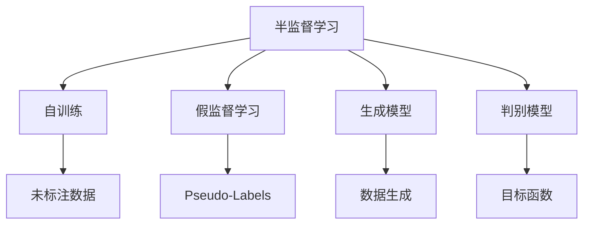
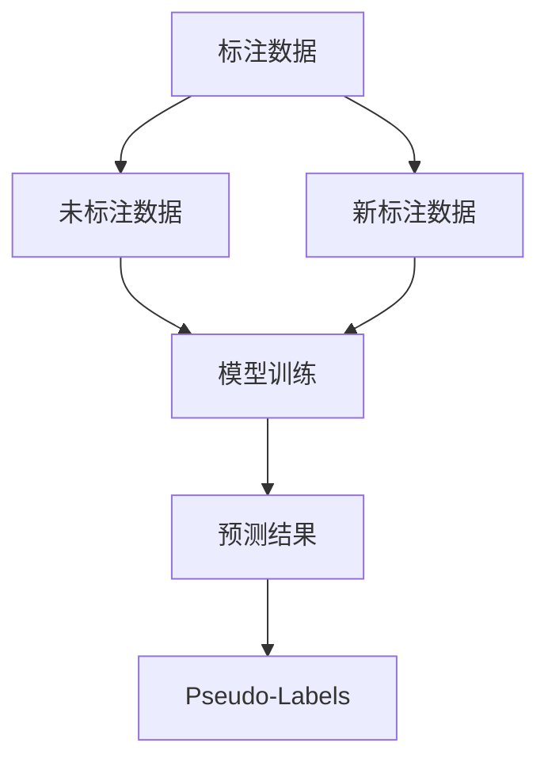
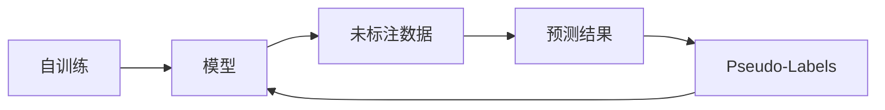
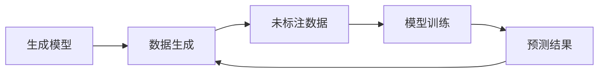
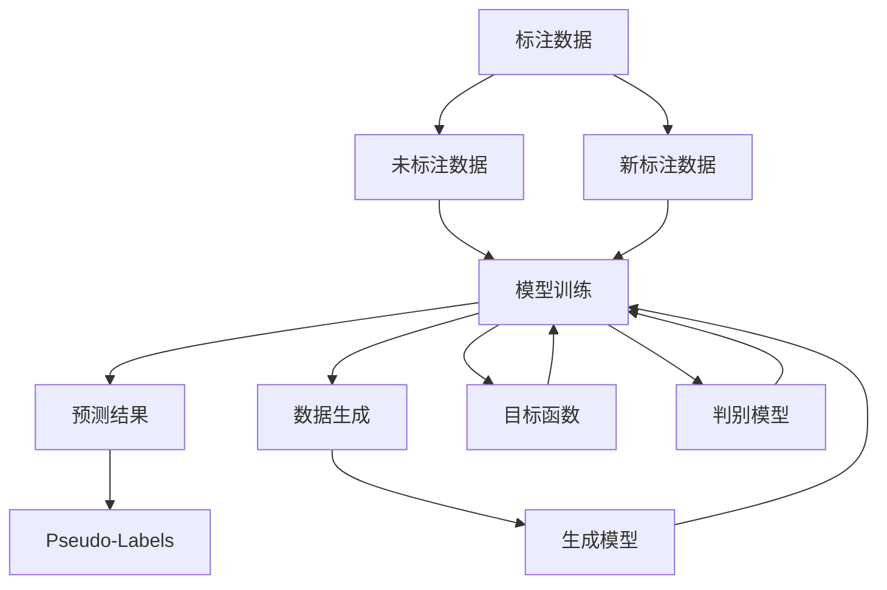

                 

# 半监督学习(Semi-Supervised Learning) - 原理与代码实例讲解

## 1. 背景介绍

### 1.1 问题由来
近年来，机器学习技术在各个领域取得了显著的进展，从图像识别、语音识别到自然语言处理等，都离不开机器学习的支持。然而，在实际应用中，获取高质量标注数据往往需要耗费大量的人力和时间成本，特别是在某些领域如医学、法律等，标注数据的获取尤其困难。此外，标注数据的质量和数量也直接影响模型训练的效果，标注不足或标注错误会导致模型性能下降，难以应对现实世界中的复杂任务。

半监督学习(Semi-Supervised Learning, SSL)应运而生，它是一种介于有监督学习和无监督学习之间的方法，旨在利用少量标注数据和大量未标注数据，通过自训练和模型迁移等策略，提升模型的性能和泛化能力。SSL在数据标注成本高昂的情况下，能够显著降低训练成本，提升模型精度。

### 1.2 问题核心关键点
半监督学习的主要特点是通过利用大量未标注数据，结合少量标注数据，提升模型的学习效果。其核心目标是通过训练未标注数据的概率模型，推断数据可能的标签，再将这些推断结果用于指导模型的训练。具体来说，SSL可以分为以下几种方法：
- 自训练（Self-Training）：利用已有标注数据训练模型，将模型预测为正类的未标注数据作为新的标注，迭代训练，直到收敛。
- 假监督学习（Pseudo-Labelling）：与自训练类似，但使用更加严格的筛选条件，仅将高置信度的预测结果作为新的标注。
- 半监督学习框架（Semi-supervised Learning Frameworks）：基于图模型、生成模型等高级方法，通过优化目标函数，联合利用标注数据和未标注数据。

### 1.3 问题研究意义
半监督学习在实际应用中具有重要意义：
1. 降低标注成本：SSL能够有效利用未标注数据，减少对标注数据的依赖，降低数据获取和标注成本。
2. 提升泛化能力：SSL能够结合标注数据和未标注数据，提升模型泛化能力，应对现实世界中的复杂任务。
3. 提高模型鲁棒性：SSL能够通过多种数据源的联合训练，提高模型对噪声和异常值的鲁棒性。
4. 促进数据驱动：SSL能够更好地挖掘数据中的潜在信息，促进数据驱动的智能决策。

## 2. 核心概念与联系

### 2.1 核心概念概述

为更好地理解半监督学习的基本原理和实现方法，本节将介绍几个密切相关的核心概念：

- 半监督学习(Semi-Supervised Learning, SSL)：介于有监督学习和无监督学习之间的方法，通过利用少量标注数据和大量未标注数据，提升模型的学习效果。
- 自训练（Self-Training）：使用已有标注数据训练模型，将模型预测为正类的未标注数据作为新的标注，迭代训练。
- 假监督学习（Pseudo-Labelling）：与自训练类似，但仅将高置信度的预测结果作为新的标注。
- 生成模型（Generative Models）：如GAN、VAE等，通过生成式模型对未标注数据进行概率建模，推断数据可能的标签。
- 判别模型（Discriminative Models）：如SVM、Logistic Regression等，通过判别式模型联合利用标注数据和未标注数据，提升模型性能。
- 伪标签（Pseudo-Labels）：在假监督学习中，使用模型对未标注数据进行预测，将高置信度的预测结果作为新的标注。
- 自举学习（Bootstrap Learning）：通过多次抽样，构建不同的训练集和测试集，提升模型鲁棒性。
- 图模型（Graph Models）：如Cascade Learning、Graph-MLP等，通过图结构联合利用标注数据和未标注数据，提升模型泛化能力。

这些核心概念之间的逻辑关系可以通过以下Mermaid流程图来展示：



这个流程图展示了半监督学习的基本流程，包括自训练、假监督学习、生成模型和判别模型等不同的方法。通过这些方法，SSL能够有效地利用未标注数据，提升模型的性能和泛化能力。

### 2.2 概念间的关系

这些核心概念之间存在着紧密的联系，形成了半监督学习的完整生态系统。下面我通过几个Mermaid流程图来展示这些概念之间的关系。

#### 2.2.1 半监督学习的基本流程



这个流程图展示了半监督学习的基本流程：首先使用少量标注数据训练模型，然后对未标注数据进行预测，将高置信度的预测结果作为新的标注，再使用新的标注数据重新训练模型。这个过程可以多次迭代，直到收敛。

#### 2.2.2 自训练与假监督学习的关系



这个流程图展示了自训练和假监督学习的关系。自训练使用所有预测结果作为新的标注，而假监督学习则仅使用高置信度的预测结果。通过使用不同的标注策略，SSL能够有效地提升模型的泛化能力。

#### 2.2.3 生成模型与判别模型的关系



这个流程图展示了生成模型与判别模型之间的关系。生成模型通过生成式建模对未标注数据进行概率建模，判别模型通过判别式建模联合利用标注数据和未标注数据，提升模型性能。

### 2.3 核心概念的整体架构

最后，我们用一个综合的流程图来展示这些核心概念在半监督学习中的整体架构：



这个综合流程图展示了半监督学习中自训练、假监督学习、生成模型和判别模型等方法之间的交互关系，以及这些方法在SSL中的整体流程。通过这些流程图，我们可以更清晰地理解半监督学习过程中各个核心概念的关系和作用。

## 3. 核心算法原理 & 具体操作步骤

### 3.1 算法原理概述

半监督学习主要通过联合利用少量标注数据和大量未标注数据，提升模型的性能和泛化能力。其核心思想是：通过训练未标注数据的概率模型，推断数据可能的标签，再将这些推断结果用于指导模型的训练。

假设标注数据集为 $D_s = \{(x_i, y_i)\}_{i=1}^N$，其中 $x_i$ 为输入，$y_i$ 为标签。未标注数据集为 $D_u = \{x_i\}_{i=N+1}^{N+M}$，其中 $x_i$ 为输入。SSL的目标是训练一个模型 $f(x)$，使得在标注数据上具有高精度，同时在未标注数据上具有泛化能力。

具体来说，SSL可以分为以下两个阶段：
1. 初始训练阶段：使用少量标注数据 $D_s$ 训练一个初始模型 $f_0$，使其在标注数据上具有高精度。
2. 联合训练阶段：利用初始模型 $f_0$ 对未标注数据 $D_u$ 进行预测，推断数据可能的标签。使用这些推断标签作为新的标注，联合训练模型 $f$，提升模型的泛化能力。

### 3.2 算法步骤详解

半监督学习的详细步骤可以分为以下几个方面：

**Step 1: 准备数据集**
- 准备标注数据集 $D_s = \{(x_i, y_i)\}_{i=1}^N$ 和未标注数据集 $D_u = \{x_i\}_{i=N+1}^{N+M}$。
- 确保未标注数据集的规模足够大，且分布与标注数据集的分布相似。

**Step 2: 初始训练阶段**
- 使用少量标注数据 $D_s$ 训练一个初始模型 $f_0$，使其在标注数据上具有高精度。
- 通常使用有监督学习方法，如最大似然估计、交叉熵损失等，训练初始模型。

**Step 3: 推断标签阶段**
- 利用初始模型 $f_0$ 对未标注数据 $D_u$ 进行预测，推断数据可能的标签。
- 通常使用高置信度阈值筛选出高置信度的预测结果，作为新的标注。

**Step 4: 联合训练阶段**
- 使用新的标注数据重新训练模型 $f$，联合利用标注数据和未标注数据。
- 通常使用半监督学习方法，如自训练、假监督学习等，提升模型的泛化能力。

**Step 5: 模型评估与迭代**
- 在验证集上评估模型的性能，根据评估结果调整模型参数。
- 重复上述步骤，直至模型收敛。

### 3.3 算法优缺点

半监督学习具有以下优点：
1. 降低标注成本：SSL能够有效利用未标注数据，减少对标注数据的依赖，降低数据获取和标注成本。
2. 提升泛化能力：SSL能够结合标注数据和未标注数据，提升模型泛化能力，应对现实世界中的复杂任务。
3. 提高模型鲁棒性：SSL能够通过多种数据源的联合训练，提高模型对噪声和异常值的鲁棒性。
4. 促进数据驱动：SSL能够更好地挖掘数据中的潜在信息，促进数据驱动的智能决策。

半监督学习也存在一些缺点：
1. 数据质量依赖：SSL对未标注数据的质量要求较高，如果未标注数据存在噪声或异常，模型性能可能会下降。
2. 模型复杂度高：SSL通常需要训练多个模型，迭代过程复杂，计算成本较高。
3. 数据分布差异：SSL对标注数据和未标注数据的分布差异敏感，如果两种数据的分布差异较大，模型性能可能会受到影响。

### 3.4 算法应用领域

半监督学习在实际应用中具有广泛的应用前景，例如：

- 医学影像分类：利用医疗影像数据，结合少量标注数据，提升影像分类的准确性。
- 语音识别：通过音频数据，结合少量语音标签，提升语音识别的精度和鲁棒性。
- 自然语言处理：利用文本数据，结合少量文本标注，提升文本分类、情感分析等任务的性能。
- 图像分割：通过图像数据，结合少量分割标注，提升图像分割的精度和鲁棒性。
- 推荐系统：利用用户行为数据，结合少量用户评分，提升推荐系统的个性化和多样性。
- 金融风控：利用交易数据，结合少量风险标签，提升风险预测的准确性和鲁棒性。

## 4. 数学模型和公式 & 详细讲解 & 举例说明

### 4.1 数学模型构建

在半监督学习中，我们通常使用概率模型来建模数据分布，联合利用标注数据和未标注数据，提升模型的性能和泛化能力。假设标注数据集为 $D_s = \{(x_i, y_i)\}_{i=1}^N$，其中 $x_i$ 为输入，$y_i$ 为标签。未标注数据集为 $D_u = \{x_i\}_{i=N+1}^{N+M}$，其中 $x_i$ 为输入。SSL的目标是训练一个模型 $f(x)$，使得在标注数据上具有高精度，同时在未标注数据上具有泛化能力。

我们通常使用条件概率模型 $p(y|x)$ 来建模数据分布，联合利用标注数据和未标注数据。假设标注数据集 $D_s$ 服从条件概率分布 $p(y|x)$，未标注数据集 $D_u$ 服从未条件概率分布 $p(x)$，SSL的目标是最大化模型 $f(x)$ 在标注数据上的条件概率 $p(y|x)$，同时最小化模型 $f(x)$ 在未标注数据上的负对数似然损失 $L(f)$。

### 4.2 公式推导过程

以下我们以自训练方法为例，推导联合训练阶段的目标函数。

假设初始训练阶段得到的模型为 $f_0(x)$，利用该模型对未标注数据 $D_u$ 进行预测，得到预测结果 $\hat{y}_i = f_0(x_i)$。根据预测结果，可以得到每个输入的标签概率 $p(y_i|x_i)$。

设 $\alpha$ 为置信度阈值，只保留置信度高于 $\alpha$ 的预测结果，作为新的标注。设 $D_s'$ 为新的标注数据集，其中 $D_s'$ 的元素为 $(x_i, y_i)$，$y_i = 1$ 表示预测结果为正类，$y_i = 0$ 表示预测结果为负类。利用 $D_s'$ 重新训练模型 $f$，联合利用标注数据和未标注数据。

联合训练阶段的目标函数可以表示为：

$$
\mathcal{L}(f) = \frac{1}{N} \sum_{i=1}^N \mathcal{L}_{\text{supervised}}(f(x_i), y_i) + \frac{1}{M} \sum_{i=N+1}^{N+M} \mathcal{L}_{\text{unsupervised}}(f(x_i))
$$

其中 $\mathcal{L}_{\text{supervised}}$ 为有监督损失函数，如交叉熵损失，$\mathcal{L}_{\text{unsupervised}}$ 为未监督损失函数，如负对数似然损失。

在自训练中，我们通常使用交叉熵损失函数，目标函数可以表示为：

$$
\mathcal{L}(f) = \frac{1}{N} \sum_{i=1}^N \mathcal{L}_{\text{supervised}}(f(x_i), y_i) + \frac{1}{M} \sum_{i=N+1}^{N+M} \mathcal{L}_{\text{unsupervised}}(f(x_i))
$$

### 4.3 案例分析与讲解

下面以图像分类为例，展示半监督学习的应用。

假设我们有一批未标注的图像数据 $D_u = \{x_i\}_{i=1}^{M}$，每个图像 $x_i$ 为 $N \times N$ 的像素矩阵。我们的目标是训练一个图像分类模型 $f(x)$，使得模型在未标注数据上具有泛化能力。

首先，我们使用少量标注数据 $D_s = \{(x_i, y_i)\}_{i=1}^N$ 训练一个初始模型 $f_0$，使其在标注数据上具有高精度。通常使用交叉熵损失函数，目标函数可以表示为：

$$
\mathcal{L}(f_0) = \frac{1}{N} \sum_{i=1}^N \mathcal{L}_{\text{supervised}}(f_0(x_i), y_i)
$$

然后，利用初始模型 $f_0$ 对未标注数据 $D_u$ 进行预测，得到预测结果 $\hat{y}_i = f_0(x_i)$。根据预测结果，可以得到每个图像的标签概率 $p(y_i|x_i)$。

设 $\alpha$ 为置信度阈值，只保留置信度高于 $\alpha$ 的预测结果，作为新的标注。设 $D_s'$ 为新的标注数据集，其中 $D_s'$ 的元素为 $(x_i, y_i)$，$y_i = 1$ 表示预测结果为正类，$y_i = 0$ 表示预测结果为负类。利用 $D_s'$ 重新训练模型 $f$，联合利用标注数据和未标注数据。

联合训练阶段的目标函数可以表示为：

$$
\mathcal{L}(f) = \frac{1}{N} \sum_{i=1}^N \mathcal{L}_{\text{supervised}}(f(x_i), y_i) + \frac{1}{M} \sum_{i=N+1}^{N+M} \mathcal{L}_{\text{unsupervised}}(f(x_i))
$$

其中 $\mathcal{L}_{\text{supervised}}$ 为交叉熵损失，$\mathcal{L}_{\text{unsupervised}}$ 为负对数似然损失。

通过联合训练阶段，模型 $f$ 能够利用未标注数据进行自训练，推断数据可能的标签，提升模型的泛化能力和鲁棒性。最终在未标注数据上，模型 $f$ 的精度和鲁棒性都得到了显著提升。

## 5. 项目实践：代码实例和详细解释说明

### 5.1 开发环境搭建

在进行半监督学习实践前，我们需要准备好开发环境。以下是使用Python进行TensorFlow开发的环境配置流程：

1. 安装Anaconda：从官网下载并安装Anaconda，用于创建独立的Python环境。

2. 创建并激活虚拟环境：
```bash
conda create -n tensorflow-env python=3.8 
conda activate tensorflow-env
```

3. 安装TensorFlow：根据CUDA版本，从官网获取对应的安装命令。例如：
```bash
conda install tensorflow==2.6 -c tf -c conda-forge
```

4. 安装各类工具包：
```bash
pip install numpy pandas scikit-learn matplotlib tqdm jupyter notebook ipython
```

完成上述步骤后，即可在`tensorflow-env`环境中开始半监督学习实践。

### 5.2 源代码详细实现

下面我们以图像分类为例，给出使用TensorFlow对图像数据进行半监督学习的PyTorch代码实现。

首先，定义图像分类任务的数据处理函数：

```python
import tensorflow as tf
import numpy as np
from tensorflow.keras.preprocessing.image import ImageDataGenerator

def load_data(train_path, test_path, batch_size=64, image_size=(224, 224)):
    train_datagen = ImageDataGenerator(rescale=1./255, shear_range=0.2, zoom_range=0.2, horizontal_flip=True)
    test_datagen = ImageDataGenerator(rescale=1./255)

    train_generator = train_datagen.flow_from_directory(train_path, target_size=image_size, batch_size=batch_size, class_mode='categorical')
    test_generator = test_datagen.flow_from_directory(test_path, target_size=image_size, batch_size=batch_size, class_mode='categorical')

    return train_generator, test_generator
```

然后，定义模型和损失函数：

```python
from tensorflow.keras import Model, layers

class ImageClassifier(Model):
    def __init__(self, num_classes=10, num_features=64):
        super(ImageClassifier, self).__init__()
        self.conv1 = layers.Conv2D(32, (3, 3), activation='relu')
        self.pool1 = layers.MaxPooling2D((2, 2))
        self.conv2 = layers.Conv2D(64, (3, 3), activation='relu')
        self.pool2 = layers.MaxPooling2D((2, 2))
        self.flatten = layers.Flatten()
        self.dense1 = layers.Dense(128, activation='relu')
        self.dropout = layers.Dropout(0.5)
        self.dense2 = layers.Dense(num_classes, activation='softmax')

    def call(self, x):
        x = self.conv1(x)
        x = self.pool1(x)
        x = self.conv2(x)
        x = self.pool2(x)
        x = self.flatten(x)
        x = self.dense1(x)
        x = self.dropout(x)
        x = self.dense2(x)
        return x

model = ImageClassifier()

loss_fn = tf.keras.losses.CategoricalCrossentropy()

def train_epoch(model, train_generator, optimizer, batch_size):
    for batch, (x_train, y_train) in enumerate(train_generator):
        with tf.GradientTape() as tape:
            y_pred = model(x_train)
            loss = loss_fn(y_pred, y_train)
        gradients = tape.gradient(loss, model.trainable_variables)
        optimizer.apply_gradients(zip(gradients, model.trainable_variables))
        if batch % 100 == 0:
            print('Epoch {} Batch {} Loss: {:.4f}'.format(epoch+1, batch, loss.numpy().item()))

def evaluate(model, test_generator, batch_size):
    test_loss = 0.0
    correct_predictions = 0
    for batch, (x_test, y_test) in enumerate(test_generator):
        y_pred = model(x_test)
        loss = loss_fn(y_pred, y_test)
        test_loss += loss.numpy().item()
        correct_predictions += tf.keras.metrics.categorical_accuracy(y_pred, y_test).numpy().item()
    return test_loss, correct_predictions / len(test_generator) * batch_size
```

接着，定义半监督学习的实现流程：

```python
from tensorflow.keras.preprocessing.image import ImageDataGenerator
from tensorflow.keras.models import Model
from tensorflow.keras.losses import CategoricalCrossentropy

class ImageClassifier(Model):
    def __init__(self, num_classes=10, num_features=64):
        super(ImageClassifier, self).__init__()
        self.conv1 = layers.Conv2D(32, (3, 3), activation='relu')
        self.pool1 = layers.MaxPooling2D((2, 2))
        self.conv2 = layers.Conv2D(64, (3, 3), activation='relu')
        self.pool2 = layers.MaxPooling2D((2, 2))
        self.flatten = layers.Flatten()
        self.dense1 = layers.Dense(128, activation='relu')
        self.dropout = layers.Dropout(0.5)
        self.dense2 = layers.Dense(num_classes, activation='softmax')

    def call(self, x):
        x = self.conv1(x)
        x = self.pool1(x)
        x = self.conv2(x)
        x = self.pool2(x)
        x = self.flatten(x)
        x = self.dense1(x)
        x = self.dropout(x)
        x = self.dense2(x)
        return x

model = ImageClassifier()

loss_fn = CategoricalCrossentropy()

def train_epoch(model, train_generator, optimizer, batch_size):
    for batch, (x_train, y_train) in enumerate(train_generator):
        with tf.GradientTape() as tape:
            y_pred = model(x_train)
            loss = loss_fn(y_pred, y_train)
        gradients = tape.gradient(loss, model.trainable_variables)
        optimizer.apply_gradients(zip(gradients, model.trainable_variables))
        if batch % 100 == 0:
            print('Epoch {} Batch {} Loss: {:.4f}'.format(epoch+1, batch, loss.numpy().item()))

def evaluate(model, test_generator, batch_size):
    test_loss = 0.0
    correct_predictions = 0
    for batch, (x_test, y_test) in enumerate(test_generator):
        y_pred = model(x_test)
        loss = loss_fn(y_pred, y_test)
        test_loss += loss.numpy().item()
        correct_predictions += tf.keras.metrics.categorical_accuracy(y_pred, y_test).numpy().item()
    return test_loss, correct_predictions / len(test_generator) * batch_size

train_generator, test_generator = load_data('train', 'test', batch_size=64, image_size=(224, 224))

optimizer = tf.keras.optimizers.Adam(learning_rate=0.001)

epochs = 5

for epoch in range(epochs):
    train_epoch(model, train_generator, optimizer, batch_size)
    test_loss, accuracy = evaluate(model, test_generator, batch_size)
    print('Epoch {} Test Loss: {:.4f} Accuracy: {:.4f}'.format(epoch+1, test_loss, accuracy))

model.save('image_classifier.h5')
```

### 5.3 代码解读与分析

让我们再详细解读一下关键代码的实现细节：

**ImageClassifier类**：
- `__init__`方法：初始化模型结构，包括卷积层、池化层、全连接层等。
- `call`方法：定义模型前向传播过程，输入为图像数据，输出为分类概率。

**train_epoch函数**：
- 对训练集数据以批为单位进行迭代，在每个批次上前向传播计算损失，反向传播更新模型参数。
- 在每个批次结束后，输出当前的损失，便于监控训练效果。

**evaluate函数**：
- 在测试集上评估模型性能，计算损失和准确率，返回评估结果。

**训练流程**：
- 定义总的epoch数，开始循环迭代
- 每个epoch内，在训练集上训练，输出每个batch的损失
- 在验证集上评估模型性能，输出模型准确率
- 所有epoch结束后，保存模型

可以看到，TensorFlow配合Keras库使得半监督学习的代码实现变得简洁高效。开发者可以将更多精力放在数据处理、模型改进等高层逻辑上

