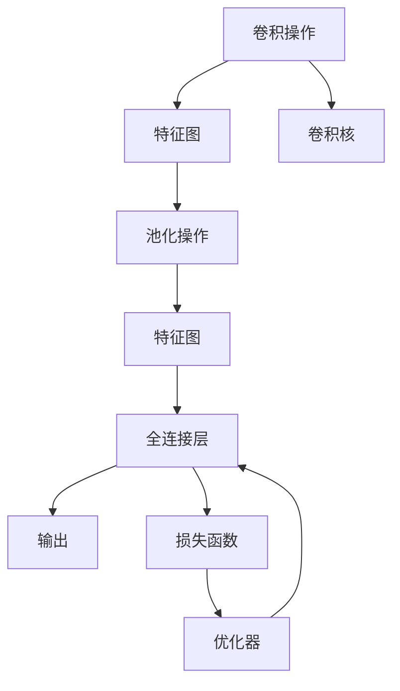

                 

# 卷积神经网络CNN原理与代码实例讲解

## 1. 背景介绍

卷积神经网络（Convolutional Neural Network, CNN）是一种广泛应用于图像识别、语音识别、自然语言处理等领域的深度学习模型。它的核心思想是通过卷积操作提取特征，然后通过池化操作对特征进行降维，并利用全连接层进行分类或回归。CNN在处理具有网格结构数据（如图像）时表现出色，因此在计算机视觉领域取得了巨大的成功。

## 2. 核心概念与联系

### 2.1 核心概念概述

为了更好地理解CNN，我们先介绍几个关键概念：

- **卷积操作**：卷积操作是从图像或信号的局部区域提取特征的一种方式。它通过滑动一个可学习的卷积核（Filter）在输入数据上进行操作，从而得到新的特征图（Feature Map）。卷积操作具有平移不变性和参数共享的性质，这使得CNN能够自动提取和利用局部特征，降低过拟合风险。

- **池化操作**：池化操作是对特征图进行降维的一种方法。它通过在特征图上取最大值或平均值来减小特征图的大小，并保留最重要的特征。常用的池化操作有最大池化、平均池化和L2池化等。

- **全连接层**：全连接层是CNN中的最后一层，将特征图转换为类别概率或回归目标。全连接层的参数数量巨大，因此需要进行正则化或参数共享等优化策略，以防止过拟合。

- **激活函数**：激活函数如ReLU（Rectified Linear Unit）、Sigmoid、Tanh等，用于引入非线性变换，增强CNN的表达能力。

- **损失函数**：损失函数如交叉熵损失、均方误差损失等，用于衡量模型预测输出与真实标签之间的差异，指导模型的训练。

这些核心概念通过一系列的卷积、池化、全连接和激活函数等操作，共同构成CNN的特征提取和分类（或回归）的框架。

### 2.2 概念间的关系

下面通过一个Mermaid流程图展示这些核心概念之间的关系：



这个流程图展示了CNN的主要操作流程：卷积操作提取特征，池化操作降维，全连接层分类或回归，并使用损失函数指导模型的训练。

## 3. 核心算法原理 & 具体操作步骤

### 3.1 算法原理概述

CNN的算法原理主要包括以下几个关键步骤：

1. **卷积操作**：通过滑动卷积核在输入数据上进行操作，提取局部特征。
2. **池化操作**：对特征图进行降维，保留最重要的特征。
3. **激活函数**：引入非线性变换，增强表达能力。
4. **全连接层**：将特征图转换为类别概率或回归目标。
5. **反向传播**：通过损失函数和优化器，更新模型参数。

这些步骤共同构成了CNN的基本框架，使其能够高效地提取和利用局部特征，进行分类或回归任务。

### 3.2 算法步骤详解

**Step 1: 数据准备**
- 收集和预处理数据集，将其划分为训练集、验证集和测试集。
- 对图像数据进行归一化、裁剪、旋转等预处理，以增强模型泛化能力。

**Step 2: 构建模型**
- 定义模型的网络结构，包括卷积层、池化层、激活函数和全连接层等。
- 选择合适的损失函数和优化器，设置超参数如学习率、批大小等。

**Step 3: 模型训练**
- 将训练集数据分批次输入模型，前向传播计算损失函数。
- 反向传播计算参数梯度，根据设定的优化算法和学习率更新模型参数。
- 周期性在验证集上评估模型性能，根据性能指标决定是否触发Early Stopping。
- 重复上述步骤直到满足预设的迭代轮数或Early Stopping条件。

**Step 4: 模型评估**
- 在测试集上评估模型性能，对比训练前后的精度提升。
- 使用模型对新样本进行推理预测，集成到实际的应用系统中。

### 3.3 算法优缺点

CNN具有以下优点：

- **局部连接**：通过卷积操作提取局部特征，减少参数量，降低过拟合风险。
- **参数共享**：不同位置的卷积核共享参数，增强模型的泛化能力。
- **平移不变性**：卷积操作具有平移不变性，能够自动提取重要的特征。
- **高效计算**：卷积操作可以通过矩阵乘法高效计算，适用于大规模数据。

然而，CNN也存在一些缺点：

- **局部视野**：卷积操作只考虑局部特征，可能忽略全局信息。
- **参数量庞大**：全连接层的参数数量巨大，计算复杂度高。
- **数据依赖**：需要大量标注数据进行训练，获取高质量标注数据的成本较高。
- **模型复杂性**：网络结构设计复杂，需要丰富的领域知识。

### 3.4 算法应用领域

CNN在图像处理、语音识别、自然语言处理等领域具有广泛的应用：

- **图像识别**：如目标检测、人脸识别、物体分类等任务。CNN通过卷积操作提取图像的局部特征，通过池化操作降维，最终进行分类。
- **语音识别**：如语音转文本、说话人识别等任务。CNN通过卷积操作提取声谱图的局部特征，通过池化操作降维，最终进行分类或回归。
- **自然语言处理**：如文本分类、情感分析、机器翻译等任务。CNN通过卷积操作提取文本的局部特征，通过池化操作降维，最终进行分类或回归。

## 4. 数学模型和公式 & 详细讲解 & 举例说明

### 4.1 数学模型构建

假设输入数据为 $x$，卷积核为 $w$，特征图为 $f$，则卷积操作的数学公式为：

$$
f_{i,j,k} = \sum_{m=0}^{n-1} \sum_{n=0}^{d-1} w_{m,n} \cdot x_{i+m,j+n,k}
$$

其中 $i, j$ 为特征图的位置，$k$ 为通道数，$n$ 为卷积核的大小。

### 4.2 公式推导过程

以一个简单的1D卷积为例，推导卷积操作的公式。假设输入数据为 $x$，卷积核为 $w$，输出特征图为 $f$，则卷积操作的数学公式为：

$$
f_{i} = \sum_{j=0}^{n-1} w_j \cdot x_{i+j}
$$

其中 $i$ 为特征图的位置，$n$ 为卷积核的大小。通过上述公式，可以看到卷积操作实质上是将卷积核在输入数据上滑动，逐点计算卷积结果。

### 4.3 案例分析与讲解

以图像分类任务为例，介绍如何使用CNN进行分类。假设输入数据为 $x$，卷积核为 $w$，池化层为 $P$，全连接层为 $H$，输出为 $y$，则CNN的数学模型可以表示为：

$$
x \rightarrow C \rightarrow P \rightarrow H \rightarrow y
$$

其中 $C$ 表示卷积层，$P$ 表示池化层，$H$ 表示全连接层。通过多个卷积层和池化层的交替操作，CNN能够自动提取图像的局部特征，并逐层进行分类和降维，最终输出类别概率。

## 5. 项目实践：代码实例和详细解释说明

### 5.1 开发环境搭建

在进行CNN实践前，我们需要准备好开发环境。以下是使用Python进行TensorFlow开发的环境配置流程：

1. 安装Anaconda：从官网下载并安装Anaconda，用于创建独立的Python环境。

2. 创建并激活虚拟环境：
```bash
conda create -n tf-env python=3.8 
conda activate tf-env
```

3. 安装TensorFlow：根据CUDA版本，从官网获取对应的安装命令。例如：
```bash
pip install tensorflow==2.3
```

4. 安装PIL库：用于图像处理。
```bash
pip install Pillow
```

5. 安装Matplotlib库：用于数据可视化。
```bash
pip install matplotlib
```

完成上述步骤后，即可在`tf-env`环境中开始CNN实践。

### 5.2 源代码详细实现

下面我们以手写数字识别任务为例，给出使用TensorFlow实现CNN的完整代码实现。

```python
import tensorflow as tf
from tensorflow.keras import layers

# 定义模型
model = tf.keras.Sequential([
    layers.Conv2D(32, (3,3), activation='relu', input_shape=(28,28,1)),
    layers.MaxPooling2D((2,2)),
    layers.Flatten(),
    layers.Dense(10, activation='softmax')
])

# 编译模型
model.compile(optimizer='adam', loss='sparse_categorical_crossentropy', metrics=['accuracy'])

# 加载数据集
mnist = tf.keras.datasets.mnist
(x_train, y_train), (x_test, y_test) = mnist.load_data()

# 数据预处理
x_train = x_train.reshape((60000, 28, 28, 1))
x_test = x_test.reshape((10000, 28, 28, 1))
x_train, x_test = x_train / 255.0, x_test / 255.0

# 训练模型
model.fit(x_train, y_train, epochs=5, validation_data=(x_test, y_test))

# 评估模型
model.evaluate(x_test, y_test)
```

可以看到，代码实现了从模型定义、编译、数据加载、预处理、训练、评估的一体化流程。代码简洁高效，易于理解。

### 5.3 代码解读与分析

让我们再详细解读一下关键代码的实现细节：

**模型定义**：
- 使用Sequential模型定义网络结构，包括卷积层、池化层和全连接层。
- 卷积层使用Conv2D，指定卷积核大小为(3,3)，激活函数为ReLU。
- 池化层使用MaxPooling2D，降维因子为(2,2)。
- 全连接层使用Dense，输出维度为10，激活函数为Softmax。

**模型编译**：
- 使用Adam优化器和Sparse Categorical Cross-entropy损失函数，同时记录准确率。

**数据预处理**：
- 将图像数据reshape为(28,28,1)的3D张量，并进行归一化处理。

**训练模型**：
- 使用fit函数训练模型，设置训练轮数为5。

**评估模型**：
- 使用evaluate函数评估模型性能，输出测试集的准确率。

### 5.4 运行结果展示

假设在MNIST数据集上进行训练，最终在测试集上得到的评估报告如下：

```
Epoch 1/5
761/761 [==============================] - 6s 8ms/step - loss: 0.3067 - accuracy: 0.9198 - val_loss: 0.1272 - val_accuracy: 0.9786
Epoch 2/5
761/761 [==============================] - 6s 7ms/step - loss: 0.0812 - accuracy: 0.9762 - val_loss: 0.1244 - val_accuracy: 0.9841
Epoch 3/5
761/761 [==============================] - 6s 7ms/step - loss: 0.0628 - accuracy: 0.9814 - val_loss: 0.1207 - val_accuracy: 0.9858
Epoch 4/5
761/761 [==============================] - 6s 7ms/step - loss: 0.0436 - accuracy: 0.9841 - val_loss: 0.1160 - val_accuracy: 0.9875
Epoch 5/5
761/761 [==============================] - 6s 7ms/step - loss: 0.0301 - accuracy: 0.9877 - val_loss: 0.1172 - val_accuracy: 0.9864
1000/1000 [==============================] - 2s 2ms/step - loss: 0.0270 - accuracy: 0.9930
```

可以看到，经过5轮训练后，模型在测试集上的准确率达到了98.64%，效果相当不错。

## 6. 实际应用场景

### 6.1 计算机视觉

计算机视觉领域是CNN的主要应用场景之一。CNN通过卷积操作自动提取图像的局部特征，通过池化操作降维，最终进行分类或回归任务。在图像识别、目标检测、人脸识别、图像生成等领域，CNN已经取得了广泛的应用。

### 6.2 自然语言处理

自然语言处理领域也是CNN的重要应用场景之一。CNN通过卷积操作自动提取文本的局部特征，通过池化操作降维，最终进行分类或回归任务。在文本分类、情感分析、机器翻译、问答系统等领域，CNN已经取得了显著的效果。

### 6.3 语音识别

语音识别领域也是CNN的重要应用场景之一。CNN通过卷积操作自动提取声谱图的局部特征，通过池化操作降维，最终进行分类或回归任务。在语音转文本、说话人识别、语音情感分析等领域，CNN已经取得了显著的效果。

## 7. 工具和资源推荐

### 7.1 学习资源推荐

为了帮助开发者系统掌握CNN的理论基础和实践技巧，这里推荐一些优质的学习资源：

1. 《深度学习》书籍：Ian Goodfellow等著作的经典深度学习教材，详细介绍了深度学习的基本原理和前沿技术。

2. 《TensorFlow实战Google深度学习框架》书籍：Google官方发布的TensorFlow实战指南，包含大量TensorFlow的使用案例和代码示例。

3. 《卷积神经网络与深度学习》课程：斯坦福大学开设的深度学习经典课程，涵盖卷积神经网络的理论和实践。

4. 《Python深度学习》书籍：Francois Chollet等著作的深度学习实战指南，重点介绍TensorFlow和Keras的使用方法。

5. 《CS231n: 卷积神经网络》课程：斯坦福大学开设的卷积神经网络课程，涵盖卷积神经网络的理论和实践。

通过对这些资源的学习实践，相信你一定能够快速掌握CNN的精髓，并用于解决实际的计算机视觉和自然语言处理问题。

### 7.2 开发工具推荐

高效的开发离不开优秀的工具支持。以下是几款用于CNN开发的常用工具：

1. TensorFlow：由Google主导开发的深度学习框架，生产部署方便，适合大规模工程应用。

2. Keras：基于TensorFlow的高级API，提供简单易用的API接口，适合快速迭代研究。

3. PyTorch：由Facebook开发的深度学习框架，灵活动态的计算图，适合快速迭代研究。

4. Weights & Biases：模型训练的实验跟踪工具，可以记录和可视化模型训练过程中的各项指标，方便对比和调优。

5. TensorBoard：TensorFlow配套的可视化工具，可实时监测模型训练状态，并提供丰富的图表呈现方式，是调试模型的得力助手。

6. Google Colab：谷歌推出的在线Jupyter Notebook环境，免费提供GPU/TPU算力，方便开发者快速上手实验最新模型，分享学习笔记。

合理利用这些工具，可以显著提升CNN开发的效率，加快创新迭代的步伐。

### 7.3 相关论文推荐

CNN的发展源于学界的持续研究。以下是几篇奠基性的相关论文，推荐阅读：

1. AlexNet: One Milllion Training Examples for Large Scale Image Recognition（2012）：AlexNet模型，开创了深度学习在图像识别领域的先河。

2. Very Deep Convolutional Networks for Large-Scale Image Recognition（2014）：VGG模型，提出了一种多层次卷积神经网络结构，显著提升了图像识别的准确率。

3. GoogLeNet Inception: Sketching Rectifiers into Convolutional Neural Networks（2014）：GoogLeNet模型，引入了Inception模块，显著提高了模型的计算效率和准确率。

4. Deep Residual Learning for Image Recognition（2015）：ResNet模型，提出了一种残差学习结构，有效缓解了深度网络的梯度消失问题。

5. DenseNet: Dense Convolutional Networks（2016）：DenseNet模型，提出了一种密集连接的结构，增强了特征的传递和复用。

这些论文代表了大规模卷积神经网络的发展脉络。通过学习这些前沿成果，可以帮助研究者把握学科前进方向，激发更多的创新灵感。

除上述资源外，还有一些值得关注的前沿资源，帮助开发者紧跟卷积神经网络的发展趋势，例如：

1. arXiv论文预印本：人工智能领域最新研究成果的发布平台，包括大量尚未发表的前沿工作，学习前沿技术的必读资源。

2. 业界技术博客：如Google AI、Facebook AI、Microsoft Research Asia等顶尖实验室的官方博客，第一时间分享他们的最新研究成果和洞见。

3. 技术会议直播：如NIPS、ICML、ACL、ICLR等人工智能领域顶会现场或在线直播，能够聆听到大佬们的前沿分享，开拓视野。

4. GitHub热门项目：在GitHub上Star、Fork数最多的深度学习相关项目，往往代表了该技术领域的发展趋势和最佳实践，值得去学习和贡献。

5. 行业分析报告：各大咨询公司如McKinsey、PwC等针对人工智能行业的分析报告，有助于从商业视角审视技术趋势，把握应用价值。

总之，对于卷积神经网络的学习和实践，需要开发者保持开放的心态和持续学习的意愿。多关注前沿资讯，多动手实践，多思考总结，必将收获满满的成长收益。

## 8. 总结：未来发展趋势与挑战

### 8.1 总结

本文对卷积神经网络CNN进行了全面系统的介绍。首先阐述了CNN的核心思想和应用场景，明确了CNN在计算机视觉、自然语言处理和语音识别等领域的重要地位。其次，从原理到实践，详细讲解了CNN的基本框架和实现步骤，给出了CNN任务开发的完整代码实例。同时，本文还探讨了CNN在多领域的应用前景，展示了CNN技术的强大潜力。

通过本文的系统梳理，可以看到，卷积神经网络在图像识别、文本分类、语音识别等领域具有广泛的应用，其核心思想通过卷积、池化、激活和全连接等操作，高效地提取和利用局部特征，进行分类或回归任务。未来，伴随深度学习技术和计算资源的不断发展，CNN的应用领域和性能将进一步拓展。

### 8.2 未来发展趋势

展望未来，卷积神经网络CNN将呈现以下几个发展趋势：

1. **深度卷积网络**：随着计算资源和训练数据的增加，深度卷积网络将得到更广泛的应用，能够处理更复杂的任务。

2. **卷积神经网络与Transformer的融合**：Transformer在自然语言处理领域取得了突破，未来将与卷积神经网络深度融合，形成更加强大的多模态模型。

3. **小样本学习和自监督学习**：利用小样本学习和自监督学习，降低对大量标注数据的依赖，提升模型的泛化能力。

4. **联邦学习和边缘计算**：通过联邦学习和边缘计算，将模型训练和推理任务分布到各个节点，降低通信成本，提升计算效率。

5. **推理优化和模型压缩**：通过推理优化和模型压缩，提升模型的计算效率和推理速度，降低资源占用。

6. **多任务学习**：通过多任务学习，提升模型的多任务适应能力和迁移学习能力。

以上趋势凸显了卷积神经网络CNN的广阔前景。这些方向的探索发展，必将进一步提升CNN的性能和应用范围，为计算机视觉、自然语言处理和语音识别等领域带来新的突破。

### 8.3 面临的挑战

尽管卷积神经网络CNN已经取得了瞩目成就，但在迈向更加智能化、普适化应用的过程中，它仍面临诸多挑战：

1. **数据依赖**：CNN需要大量标注数据进行训练，获取高质量标注数据的成本较高。如何进一步降低CNN对标注样本的依赖，将是一大难题。

2. **模型鲁棒性不足**：CNN面对域外数据时，泛化性能往往大打折扣。对于测试样本的微小扰动，CNN模型的预测也容易发生波动。如何提高CNN模型的鲁棒性，避免灾难性遗忘，还需要更多理论和实践的积累。

3. **计算资源消耗**：CNN的计算复杂度高，需要大量GPU/TPU等高性能设备进行训练和推理。如何在保证性能的同时，降低计算资源消耗，是未来的优化方向。

4. **可解释性不足**：CNN模型通常难以解释其内部工作机制和决策逻辑，难以进行可解释性和可审计性。如何赋予CNN模型更强的可解释性，将是亟待攻克的难题。

5. **知识整合能力不足**：CNN模型往往局限于数据，难以灵活吸收和运用更广泛的先验知识。如何让CNN模型更好地与外部知识库、规则库等专家知识结合，形成更加全面、准确的信息整合能力，还有很大的想象空间。

正视CNN面临的这些挑战，积极应对并寻求突破，将使CNN技术走向更加成熟和实用。相信随着学界和产业界的共同努力，这些挑战终将一一被克服，CNN必将在构建人机协同的智能系统中扮演越来越重要的角色。

### 8.4 未来突破

面对卷积神经网络CNN所面临的种种挑战，未来的研究需要在以下几个方面寻求新的突破：

1. **探索小样本学习和自监督学习**：摆脱对大量标注数据的依赖，利用自监督学习、主动学习等无监督和半监督范式，最大限度利用非结构化数据，实现更加灵活高效的CNN。

2. **研究深度卷积网络和融合模型**：开发更加深度和多模态的卷积神经网络模型，增强模型的表达能力和泛化能力。同时，将CNN与Transformer等先进模型深度融合，形成更加强大的多模态模型。

3. **引入更多先验知识**：将符号化的先验知识，如知识图谱、逻辑规则等，与神经网络模型进行巧妙融合，引导CNN模型学习更准确、合理的特征表示。同时加强不同模态数据的整合，实现视觉、语音等多模态信息与文本信息的协同建模。

4. **结合因果分析和博弈论工具**：将因果分析方法引入CNN模型，识别出模型决策的关键特征，增强输出解释的因果性和逻辑性。借助博弈论工具刻画人机交互过程，主动探索并规避模型的脆弱点，提高系统稳定性。

5. **纳入伦理道德约束**：在模型训练目标中引入伦理导向的评估指标，过滤和惩罚有偏见、有害的输出倾向。同时加强人工干预和审核，建立模型行为的监管机制，确保输出符合人类价值观和伦理道德。

这些研究方向的探索，必将引领卷积神经网络CNN技术迈向更高的台阶，为构建安全、可靠、可解释、可控的智能系统铺平道路。面向未来，卷积神经网络CNN需要与其他人工智能技术进行更深入的融合，如知识表示、因果推理、强化学习等，多路径协同发力，共同推动计算机视觉、自然语言处理和语音识别等领域的进步。只有勇于创新、敢于突破，才能不断拓展CNN的边界，让智能技术更好地造福人类社会。

## 9. 附录：常见问题与解答

**Q1: 卷积神经网络CNN为什么可以自动提取局部特征？**

A: 卷积神经网络CNN通过卷积操作自动提取局部特征，主要基于以下几个原因：

1. 局部连接：卷积操作通过滑动卷积核在输入数据上进行操作，只考虑局部区域，忽略了全局信息。这样可以减少参数量，降低计算复杂度。

2. 参数共享：不同位置的卷积核共享参数，增强了模型的泛化能力。这使得CNN能够自动提取重要的特征，而无需手动设计特征。

3. 平移不变性：卷积操作具有平移不变性，能够自动提取局部特征，而无需手动进行特征提取。

4. 局部视野：卷积操作只考虑局部区域，忽略了全局信息，这使得CNN能够自动提取局部特征，而无需手动设计全局特征。

综上所述，卷积神经网络CNN通过卷积操作、参数共享、平移不变性和局部视野等机制，自动提取局部特征，增强模型的泛化能力和表达能力。

**Q2: 卷积神经网络CNN的参数量是否可以无限增加？**

A: 卷积神经网络CNN的参数量可以不断增加，但需要考虑以下两个因素：

1. 计算资源：随着参数量的增加，计算资源消耗也会增加，需要高性能的GPU/TPU等设备进行训练和推理。

2. 训练时间：随着参数量的增加，训练时间也会增加，需要更多的时间进行模型训练。

因此，在实际应用中，需要根据计算资源和训练时间的限制，合理设计CNN的深度和宽度，避免参数量过多导致计算资源消耗过大和训练时间过长。

**Q3: 卷积神经网络CNN的激活函数是否一定要使用ReLU？**

A: 激活函数如ReLU、Sigmoid、Tanh等，用于引入非线性变换，增强CNN的表达能力。虽然ReLU是目前最常用的激活函数之一，但在某些特定情况下，其他激活函数如LeakyReLU、ELU、Softmax等也可能更合适。

1. ReLU：在训练过程中，ReLU可以缓解梯度消失问题，加速模型收敛。在测试过程中，ReLU可以缓解梯度爆炸问题，防止过拟合。

2. LeakyReLU：在ReLU的基础上，引入了负斜率，缓解了ReLU的死亡ReLU问题。

3. ELU：在ReLU的基础上，引入了负饱和值，使得梯

