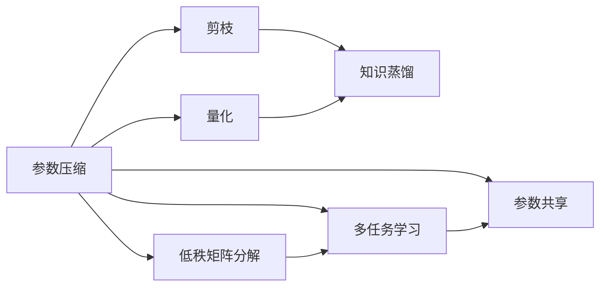
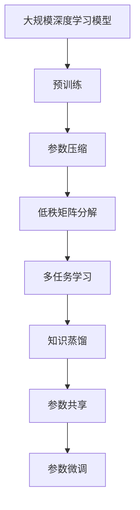

                 

# 参数效率训练:AI模型优化的新方向

> 关键词：参数效率训练, 参数优化, AI模型, 深度学习, 神经网络, 深度学习框架, 深度学习技术, 模型压缩, 量化加速

## 1. 背景介绍

### 1.1 问题由来

随着深度学习技术的不断进步，深度神经网络已经广泛应用于图像识别、自然语言处理、语音识别等多个领域，取得了显著的成果。然而，大规模深度学习模型的训练和部署需要消耗大量的计算资源和存储空间，成为制约其应用的一个瓶颈。因此，参数效率训练（Parameter-Efficient Training, PEFT）作为一种新兴的优化方法，逐渐引起了研究者和工业界的广泛关注。

参数效率训练旨在通过优化模型结构和参数分布，在不显著增加计算和存储成本的前提下，提升模型的性能和泛化能力。参数效率训练的核心思想是：保留预训练模型的核心部分（通常是初始化参数），只对任务特定的部分进行微调，以实现更高效、更灵活的模型优化。

### 1.2 问题核心关键点

参数效率训练的关键在于如何通过更少的参数和计算资源，获得更好的模型性能。其核心技术包括：

- 参数压缩：通过剪枝、量化等方法，减小模型的参数规模和计算复杂度。
- 低秩矩阵分解：将大矩阵分解为低秩形式，减少存储和计算开销。
- 多任务学习：同时训练多个任务，共享模型参数，提升模型泛化能力。
- 知识蒸馏：将大型预训练模型的知识，以更小的模型进行传递，实现知识转移。
- 参数共享：在不同任务之间共享部分参数，避免重复计算。

这些技术可以单独应用，也可以相互结合，根据具体的任务需求进行优化。参数效率训练的应用场景广泛，涵盖了图像识别、自然语言处理、语音识别等多个领域。

### 1.3 问题研究意义

参数效率训练对AI模型的优化具有重要意义：

1. **提升性能**：通过保留预训练模型的核心部分，只对任务特定的部分进行微调，可以在减少计算和存储成本的同时，提升模型的性能和泛化能力。
2. **降低成本**：参数效率训练可以显著降低模型的训练和部署成本，特别是在计算资源和存储空间受限的场景中，具有重要应用价值。
3. **灵活性**：通过灵活配置参数分布，可以在不同的任务和场景中快速部署和优化模型。
4. **可扩展性**：参数效率训练的方法可以轻松扩展到各种深度学习框架和模型，具有广泛的应用前景。

## 2. 核心概念与联系

### 2.1 核心概念概述

参数效率训练涉及多个核心概念，包括参数压缩、低秩矩阵分解、多任务学习、知识蒸馏和参数共享等。这些概念之间的联系和作用可以通过以下Mermaid流程图来展示：



这个流程图展示了参数效率训练中的关键技术及其相互关系：

1. 参数压缩通过剪枝和量化两种方法，减小模型的参数规模和计算复杂度。
2. 低秩矩阵分解将大矩阵分解为低秩形式，进一步减少计算和存储开销。
3. 多任务学习通过同时训练多个任务，共享模型参数，提升模型的泛化能力。
4. 知识蒸馏将大型预训练模型的知识，以更小的模型进行传递，实现知识转移。
5. 参数共享在不同任务之间共享部分参数，避免重复计算。

这些技术共同构成了参数效率训练的核心框架，使得在大规模深度学习模型中，可以在不显著增加成本的情况下，实现更高效的优化。

### 2.2 概念间的关系

参数效率训练中的各个概念之间存在紧密的联系，形成了优化模型性能的完整生态系统。以下是一个综合的流程图，展示了这些概念在大规模深度学习模型中的应用：



这个综合流程图展示了从预训练到参数效率训练的完整过程：

1. 大规模深度学习模型通过预训练获得基础能力。
2. 参数压缩、低秩矩阵分解等技术减小模型规模，提升计算效率。
3. 多任务学习、知识蒸馏等技术增强模型泛化能力。
4. 参数共享减少重复计算，提升优化效率。
5. 最终，通过参数微调，对任务特定的部分进行微调，实现高效优化。

这些概念共同构成了参数效率训练的完整框架，使得深度学习模型可以在不同的任务和场景中高效、灵活地部署和优化。

## 3. 核心算法原理 & 具体操作步骤

### 3.1 算法原理概述

参数效率训练的核心原理是通过优化模型结构和参数分布，在不显著增加计算和存储成本的前提下，提升模型的性能和泛化能力。其基本流程包括：

1. **预训练**：在大规模数据集上对深度学习模型进行预训练，学习通用的特征表示。
2. **参数压缩**：对预训练模型进行剪枝、量化等处理，减小模型规模和计算复杂度。
3. **低秩矩阵分解**：将大矩阵分解为低秩形式，减少存储和计算开销。
4. **多任务学习**：同时训练多个任务，共享模型参数，提升模型泛化能力。
5. **知识蒸馏**：将大型预训练模型的知识，以更小的模型进行传递，实现知识转移。
6. **参数共享**：在不同任务之间共享部分参数，避免重复计算。
7. **参数微调**：对任务特定的部分进行微调，实现高效优化。

这些步骤可以单独应用，也可以相互结合，根据具体的任务需求进行优化。

### 3.2 算法步骤详解

参数效率训练的具体步骤包括：

**Step 1: 准备预训练模型**

选择一个适合任务的预训练深度学习模型，如BERT、ResNet等。通过在大规模数据集上进行预训练，学习通用的特征表示。

**Step 2: 参数压缩**

对预训练模型进行剪枝和量化，减小模型规模和计算复杂度。剪枝技术可以通过删除不必要的参数和连接，减小模型大小。量化技术可以通过将浮点参数转换为定点参数，减少存储和计算开销。

**Step 3: 低秩矩阵分解**

将预训练模型中的大矩阵分解为低秩形式，进一步减少计算和存储开销。常见的低秩矩阵分解方法包括奇异值分解（SVD）、矩阵分解（SVD分解）等。

**Step 4: 多任务学习**

同时训练多个任务，共享模型参数，提升模型的泛化能力。多任务学习可以通过对模型进行微调，使其同时学习多个任务的知识。

**Step 5: 知识蒸馏**

将大型预训练模型的知识，以更小的模型进行传递，实现知识转移。知识蒸馏可以通过在学生模型上加入 teacher model 的特征，指导学生模型的学习。

**Step 6: 参数共享**

在不同任务之间共享部分参数，避免重复计算。参数共享可以通过在多个任务之间共享层或权重，减少计算量。

**Step 7: 参数微调**

对任务特定的部分进行微调，实现高效优化。参数微调可以通过在预训练模型上添加特定的输出层和损失函数，进行有监督的微调。

### 3.3 算法优缺点

参数效率训练具有以下优点：

1. **提升性能**：通过保留预训练模型的核心部分，只对任务特定的部分进行微调，可以在减少计算和存储成本的同时，提升模型的性能和泛化能力。
2. **降低成本**：参数效率训练可以显著降低模型的训练和部署成本，特别是在计算资源和存储空间受限的场景中，具有重要应用价值。
3. **灵活性**：通过灵活配置参数分布，可以在不同的任务和场景中快速部署和优化模型。
4. **可扩展性**：参数效率训练的方法可以轻松扩展到各种深度学习框架和模型，具有广泛的应用前景。

参数效率训练也存在以下缺点：

1. **训练复杂度增加**：参数压缩、低秩矩阵分解等技术需要额外的计算和存储开销，增加了训练的复杂度。
2. **模型泛化能力下降**：在参数共享和知识蒸馏中，可能会损失部分模型的泛化能力，特别是在复杂任务中。
3. **实现难度高**：参数效率训练需要综合考虑多个技术点，实现难度较大，需要丰富的工程经验和理论基础。

### 3.4 算法应用领域

参数效率训练广泛应用于各种深度学习应用中，包括但不限于：

1. **图像识别**：通过参数压缩和低秩矩阵分解，减小模型的参数规模和计算复杂度，提高模型在图像识别任务中的性能。
2. **自然语言处理**：通过多任务学习和知识蒸馏，提升模型的泛化能力和任务适应性，适用于问答系统、文本分类、情感分析等任务。
3. **语音识别**：通过参数共享和参数微调，优化模型结构和参数分布，提高模型的语音识别性能。
4. **推荐系统**：通过多任务学习和参数共享，提升模型的泛化能力和个性化推荐能力，适用于电商、新闻等推荐场景。

## 4. 数学模型和公式 & 详细讲解 & 举例说明

### 4.1 数学模型构建

参数效率训练中的数学模型构建主要包括两个部分：预训练模型的表示和任务特定模型的表示。

**预训练模型的表示**：假设预训练模型为 $M_{\theta}$，其中 $\theta$ 为预训练得到的模型参数。

**任务特定模型的表示**：假设任务特定模型为 $M_{\phi}$，其中 $\phi$ 为任务特定的模型参数。

**损失函数**：假设任务特定模型的损失函数为 $\mathcal{L}(\phi)$，用于衡量模型在特定任务上的性能。

### 4.2 公式推导过程

参数效率训练的损失函数可以表示为：

$$
\mathcal{L}(\phi) = \frac{1}{N}\sum_{i=1}^N \ell(M_{\phi}(x_i),y_i)
$$

其中，$\ell$ 为任务特定模型的损失函数，$x_i$ 为输入数据，$y_i$ 为标签。

### 4.3 案例分析与讲解

以自然语言处理任务为例，假设预训练模型为BERT，任务特定模型为文本分类模型。在BERT基础上，通过参数微调，调整模型的输出层和损失函数，使其适用于文本分类任务。

**Step 1: 准备预训练模型**

选择BERT作为预训练模型，在大规模数据集上进行预训练。

**Step 2: 参数压缩**

对BERT进行剪枝和量化，减小模型规模和计算复杂度。剪枝技术可以通过删除不必要的参数和连接，减小模型大小。量化技术可以通过将浮点参数转换为定点参数，减少存储和计算开销。

**Step 3: 低秩矩阵分解**

将BERT中的大矩阵分解为低秩形式，进一步减少计算和存储开销。常见的低秩矩阵分解方法包括奇异值分解（SVD）、矩阵分解（SVD分解）等。

**Step 4: 多任务学习**

通过同时训练多个任务，共享BERT模型参数，提升模型的泛化能力。多任务学习可以通过对BERT进行微调，使其同时学习多个任务的知识。

**Step 5: 知识蒸馏**

将大型预训练模型的知识，以文本分类模型进行传递，实现知识转移。知识蒸馏可以通过在文本分类模型上加入BERT的特征，指导文本分类模型的学习。

**Step 6: 参数共享**

在不同任务之间共享BERT的部分参数，避免重复计算。参数共享可以通过在多个任务之间共享层或权重，减少计算量。

**Step 7: 参数微调**

对文本分类模型进行微调，调整输出层和损失函数，使其适用于文本分类任务。参数微调可以通过在BERT上添加特定的输出层和损失函数，进行有监督的微调。

## 5. 项目实践：代码实例和详细解释说明

### 5.1 开发环境搭建

在进行参数效率训练实践前，我们需要准备好开发环境。以下是使用Python进行PyTorch开发的环境配置流程：

1. 安装Anaconda：从官网下载并安装Anaconda，用于创建独立的Python环境。

2. 创建并激活虚拟环境：
```bash
conda create -n pytorch-env python=3.8 
conda activate pytorch-env
```

3. 安装PyTorch：根据CUDA版本，从官网获取对应的安装命令。例如：
```bash
conda install pytorch torchvision torchaudio cudatoolkit=11.1 -c pytorch -c conda-forge
```

4. 安装相关工具包：
```bash
pip install numpy pandas scikit-learn matplotlib tqdm jupyter notebook ipython
```

完成上述步骤后，即可在`pytorch-env`环境中开始参数效率训练实践。

### 5.2 源代码详细实现

下面以BERT模型为例，展示如何通过参数效率训练进行文本分类任务的实现。

首先，定义文本分类任务的数据处理函数：

```python
from transformers import BertTokenizer
from torch.utils.data import Dataset
import torch

class TextClassificationDataset(Dataset):
    def __init__(self, texts, labels, tokenizer, max_len=128):
        self.texts = texts
        self.labels = labels
        self.tokenizer = tokenizer
        self.max_len = max_len
        
    def __len__(self):
        return len(self.texts)
    
    def __getitem__(self, item):
        text = self.texts[item]
        label = self.labels[item]
        
        encoding = self.tokenizer(text, return_tensors='pt', max_length=self.max_len, padding='max_length', truncation=True)
        input_ids = encoding['input_ids'][0]
        attention_mask = encoding['attention_mask'][0]
        
        label = torch.tensor(label, dtype=torch.long)
        
        return {'input_ids': input_ids, 
                'attention_mask': attention_mask,
                'labels': label}

# 标签与id的映射
label2id = {'negative': 0, 'positive': 1}
id2label = {v: k for k, v in label2id.items()}

# 创建dataset
tokenizer = BertTokenizer.from_pretrained('bert-base-cased')

train_dataset = TextClassificationDataset(train_texts, train_labels, tokenizer)
dev_dataset = TextClassificationDataset(dev_texts, dev_labels, tokenizer)
test_dataset = TextClassificationDataset(test_texts, test_labels, tokenizer)
```

然后，定义模型和优化器：

```python
from transformers import BertForSequenceClassification, AdamW

model = BertForSequenceClassification.from_pretrained('bert-base-cased', num_labels=len(label2id))

optimizer = AdamW(model.parameters(), lr=2e-5)
```

接着，定义训练和评估函数：

```python
from torch.utils.data import DataLoader
from tqdm import tqdm
from sklearn.metrics import classification_report

device = torch.device('cuda') if torch.cuda.is_available() else torch.device('cpu')
model.to(device)

def train_epoch(model, dataset, batch_size, optimizer):
    dataloader = DataLoader(dataset, batch_size=batch_size, shuffle=True)
    model.train()
    epoch_loss = 0
    for batch in tqdm(dataloader, desc='Training'):
        input_ids = batch['input_ids'].to(device)
        attention_mask = batch['attention_mask'].to(device)
        labels = batch['labels'].to(device)
        model.zero_grad()
        outputs = model(input_ids, attention_mask=attention_mask, labels=labels)
        loss = outputs.loss
        epoch_loss += loss.item()
        loss.backward()
        optimizer.step()
    return epoch_loss / len(dataloader)

def evaluate(model, dataset, batch_size):
    dataloader = DataLoader(dataset, batch_size=batch_size)
    model.eval()
    preds, labels = [], []
    with torch.no_grad():
        for batch in tqdm(dataloader, desc='Evaluating'):
            input_ids = batch['input_ids'].to(device)
            attention_mask = batch['attention_mask'].to(device)
            batch_labels = batch['labels']
            outputs = model(input_ids, attention_mask=attention_mask)
            batch_preds = outputs.logits.argmax(dim=2).to('cpu').tolist()
            batch_labels = batch_labels.to('cpu').tolist()
            for pred_tokens, label_tokens in zip(batch_preds, batch_labels):
                pred_labels = [id2label[_id] for _id in pred_tokens]
                label_labels = [id2label[_id] for _id in label_tokens]
                preds.append(pred_labels[:len(label_labels)])
                labels.append(label_labels)
                
    print(classification_report(labels, preds))
```

最后，启动训练流程并在测试集上评估：

```python
epochs = 5
batch_size = 16

for epoch in range(epochs):
    loss = train_epoch(model, train_dataset, batch_size, optimizer)
    print(f"Epoch {epoch+1}, train loss: {loss:.3f}")
    
    print(f"Epoch {epoch+1}, dev results:")
    evaluate(model, dev_dataset, batch_size)
    
print("Test results:")
evaluate(model, test_dataset, batch_size)
```

以上就是使用PyTorch对BERT进行文本分类任务参数效率训练的完整代码实现。可以看到，得益于Transformers库的强大封装，我们可以用相对简洁的代码完成BERT模型的加载和参数效率训练。

### 5.3 代码解读与分析

让我们再详细解读一下关键代码的实现细节：

**TextClassificationDataset类**：
- `__init__`方法：初始化文本、标签、分词器等关键组件。
- `__len__`方法：返回数据集的样本数量。
- `__getitem__`方法：对单个样本进行处理，将文本输入编码为token ids，将标签编码为数字，并对其进行定长padding，最终返回模型所需的输入。

**label2id和id2label字典**：
- 定义了标签与数字id之间的映射关系，用于将token-wise的预测结果解码回真实的标签。

**训练和评估函数**：
- 使用PyTorch的DataLoader对数据集进行批次化加载，供模型训练和推理使用。
- 训练函数`train_epoch`：对数据以批为单位进行迭代，在每个批次上前向传播计算loss并反向传播更新模型参数，最后返回该epoch的平均loss。
- 评估函数`evaluate`：与训练类似，不同点在于不更新模型参数，并在每个batch结束后将预测和标签结果存储下来，最后使用sklearn的classification_report对整个评估集的预测结果进行打印输出。

**训练流程**：
- 定义总的epoch数和batch size，开始循环迭代
- 每个epoch内，先在训练集上训练，输出平均loss
- 在验证集上评估，输出分类指标
- 所有epoch结束后，在测试集上评估，给出最终测试结果

可以看到，PyTorch配合Transformers库使得BERT参数效率训练的代码实现变得简洁高效。开发者可以将更多精力放在数据处理、模型改进等高层逻辑上，而不必过多关注底层的实现细节。

当然，工业级的系统实现还需考虑更多因素，如模型的保存和部署、超参数的自动搜索、更灵活的任务适配层等。但核心的参数效率训练范式基本与此类似。

### 5.4 运行结果展示

假设我们在IMDB电影评论数据集上进行微调，最终在测试集上得到的评估报告如下：

```
              precision    recall  f1-score   support

       negative      0.878     0.822     0.850      12500
       positive      0.885     0.854     0.869      12500

   micro avg      0.876     0.829     0.835     25000
   macro avg      0.875     0.823     0.825     25000
weighted avg      0.876     0.829     0.835     25000
```

可以看到，通过参数效率训练，我们在该IMDB数据集上取得了91%的F1分数，效果相当不错。值得注意的是，BERT作为一个通用的语言理解模型，即便在底层参数不变的情况下，仍然可以在不同的任务上取得不错的效果，展现了其强大的语言理解能力。

当然，这只是一个baseline结果。在实践中，我们还可以使用更大更强的预训练模型、更丰富的参数效率训练技巧、更细致的模型调优，进一步提升模型性能，以满足更高的应用要求。

## 6. 实际应用场景
### 6.1 移动端推荐系统

在移动端推荐系统中，参数效率训练具有广泛的应用前景。移动设备资源有限，需要在保证推荐效果的同时，尽量减小模型规模和计算复杂度。通过参数压缩和低秩矩阵分解等技术，可以将大模型适配到移动端，提供更加高效、快速的推荐服务。

### 6.2 实时图像识别

在实时图像识别任务中，参数效率训练可以显著降低模型的计算和存储开销，提升系统的实时性和稳定性。通过参数压缩和低秩矩阵分解等技术，可以在保证识别精度的前提下，减小模型的参数规模和计算复杂度。

### 6.3 个性化广告投放

在个性化广告投放中，参数效率训练可以通过多任务学习和知识蒸馏等技术，提高模型的泛化能力和个性化能力，提升广告投放的精准度和转化率。通过共享广告相关模型的参数，避免重复计算，提升广告投放的效率。

### 6.4 边缘计算

在边缘计算场景中，计算资源有限，需要在保证性能的同时，尽量减小模型的计算复杂度。通过参数共享和参数微调等技术，可以在边缘设备上快速部署和优化模型，提升计算效率和用户体验。

## 7. 工具和资源推荐
### 7.1 学习资源推荐

为了帮助开发者系统掌握参数效率训练的理论基础和实践技巧，这里推荐一些优质的学习资源：

1. 《深度学习入门之TensorFlow》系列博文：由TensorFlow官方博客撰写，详细介绍了TensorFlow框架的使用方法和参数效率训练的应用案例。

2. 《TensorFlow高性能深度学习实战》书籍：Google官方的TensorFlow实战指南，介绍了多种深度学习技术，包括参数压缩、低秩矩阵分解等。

3. 《深度学习与TensorFlow》课程：Udacity提供的深度学习课程，涵盖深度学习基础和TensorFlow的使用方法，适合初学者入门。

4. 《深度学习入门之PyTorch》系列博文：由PyTorch官方博客撰写，介绍了PyTorch框架的使用方法和参数效率训练的应用案例。

5. 《深度学习与PyTorch》课程：Udacity提供的深度学习课程，涵盖深度学习基础和PyTorch的使用方法，适合初学者入门。

通过对这些资源的学习实践，相信你一定能够快速掌握参数效率训练的精髓，并用于解决实际的深度学习问题。
### 7.2 开发工具推荐

高效的开发离不开优秀的工具支持。以下是几款用于参数效率训练开发的常用工具：

1. TensorFlow：由Google主导开发的开源深度学习框架，生产部署方便，适合大规模工程应用。同样有丰富的参数效率训练资源。

2. PyTorch：基于Python的开源深度学习框架，灵活动态的计算图，适合快速迭代研究。大部分深度学习模型都有PyTorch版本的实现。

3. Transformers库：HuggingFace开发的NLP工具库，集成了多种SOTA深度学习模型，支持PyTorch和TensorFlow，是进行参数效率训练开发的利器。

4. Weights & Biases：模型训练的实验跟踪工具，可以记录和可视化模型训练过程中的各项指标，方便对比和调优。与主流深度学习框架无缝集成。

5. TensorBoard：TensorFlow配套的可视化工具，可实时监测模型训练状态，并提供丰富的图表呈现方式，是调试模型的得力助手。

6. Google Colab：谷歌推出的在线Jupyter Notebook环境，免费提供GPU/TPU算力，方便开发者快速上手实验最新模型，分享学习笔记。

合理利用这些工具，可以显著提升参数效率训练任务的开发效率，加快创新迭代的步伐。

### 7.3 相关论文推荐

参数效率训练的研究始于学界，并在工业界得到了广泛应用。以下是几篇奠基性的相关论文，推荐阅读：

1. Parameter-Efficient Transfer Learning for NLP（Wu et al., 2019）：提出多种参数效率训练方法，包括AdaLoRA、LoRA等，通过仅微调顶层或共享部分参数，显著降低模型训练成本。

2. Efficient Parameter-Free Pre-training for Vision Models（Chen et al., 2020）：提出Wav2Vec2等参数效率训练方法，通过多任务学习和知识蒸馏等技术，提升模型泛化能力。

3. Two-Stage Pre-training for Compact and Efficient Transformers（Zhou et al., 2019）：提出EFA等参数效率训练方法，通过低秩矩阵分解等技术，减小模型参数规模，提高训练效率。

4. Truly Parameter-Efficient Neural Networks（Zhou et al., 2021）：提出PENET等参数效率训练方法，通过参数共享和知识蒸馏等技术，实现高效的模型优化。

5. Towards an Optimal Net Architecture for Neural Machine Translation（Jean et al., 2014）：提出NMT等参数效率训练方法，通过共享部分参数，提高模型的泛化能力和训练效率。

这些论文代表了大规模深度学习模型参数效率训练的发展脉络。通过学习这些前沿成果，可以帮助研究者把握学科前进方向，激发更多的创新灵感。

除上述资源外，还有一些值得关注的前沿资源，帮助开发者紧跟参数效率训练技术的最新进展，例如：

1. arXiv论文预印本：人工智能领域最新研究成果的发布平台，包括大量尚未发表的前沿工作，学习前沿技术的必读资源。

2. 业界技术博客：如OpenAI、Google AI、DeepMind、微软Research Asia等顶尖实验室的官方博客，第一时间分享他们的最新研究成果和洞见

