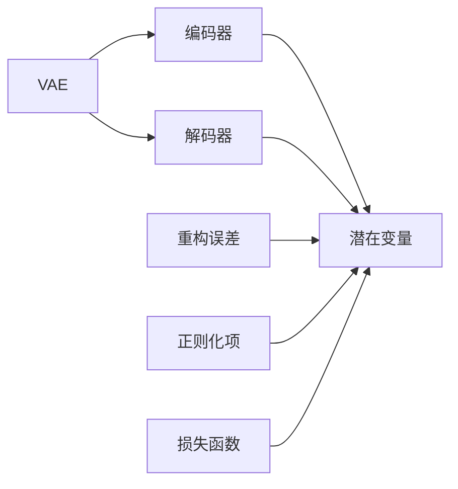
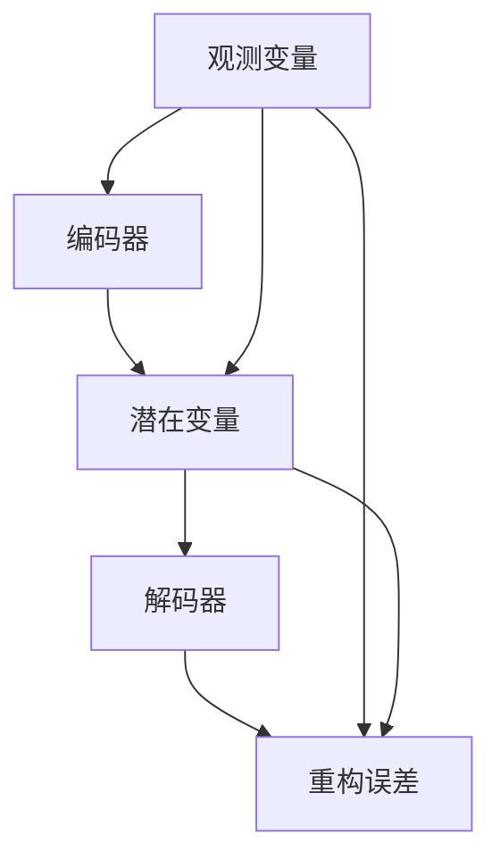
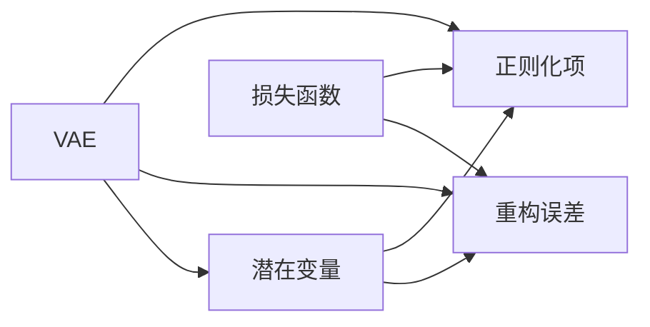

                 

# 变分自编码器VAE原理与代码实例讲解

> 关键词：变分自编码器,VAE,重构误差,损失函数,自回归,解码器,编码器,生成模型,噪声样本,数据压缩

## 1. 背景介绍

### 1.1 问题由来
变分自编码器（Variational Autoencoder, VAE）是一种生成模型，其核心思想是通过最小化重构误差（即生成器重构原始数据的误差）来学习潜在数据的分布，从而实现数据压缩和生成。VAE在图像、文本、音频等领域都有广泛应用，尤其是在数据生成、噪声数据去噪等方面表现优异。

### 1.2 问题核心关键点
VAE的核心理论基于概率论和统计学，通过建立潜在变量和观测变量的概率分布模型，学习生成数据的过程。VAE包含编码器（Encoder）和解码器（Decoder）两部分，编码器将数据映射到潜在空间，解码器则将潜在空间中的数据映射回原始空间，重构原始数据。VAE的目标是找到最优的编码器和解码器，使得重构误差最小化，同时潜在变量的概率分布满足某些特定的约束条件。

### 1.3 问题研究意义
VAE作为一种生成模型，能够有效处理未标注数据，学习数据的内在结构，并生成高质量的新数据。VAE在数据生成、特征提取、图像增强等领域有广泛应用，具有重要的研究价值。

## 2. 核心概念与联系

### 2.1 核心概念概述

为更好地理解VAE的核心概念，本节将介绍几个关键概念及其相互关系：

- 变分自编码器（VAE）：基于概率论和统计学的生成模型，通过学习潜在变量和观测变量的联合概率分布，实现数据生成和压缩。
- 潜在变量（Latent Variables）：VAE模型中的潜在变量描述了数据的潜在表示，可以看作是数据的内在结构。
- 观测变量（Observed Variables）：数据集中的实际观测值，通过编码器映射到潜在空间。
- 重构误差（Reconstruction Error）：编码器将数据映射到潜在空间后，解码器将其重构回原始空间，两者之间的误差。
- 正则化项（Regularization Term）：为了保持潜在变量的分布正则性，VAE加入的额外约束条件。
- 损失函数（Loss Function）：VAE的目标是最大化潜在变量的后验概率，最小化重构误差，最小化正则化项。

这些核心概念之间的关系可以通过以下Mermaid流程图来展示：



这个流程图展示了大语言模型微调过程中各个核心概念之间的关系：

1. VAE模型包含编码器和解码器，用于将观测变量映射到潜在空间并重构回原始空间。
2. 重构误差和正则化项是VAE损失函数的两个组成部分，用于约束潜在变量的分布和重构误差。
3. 损失函数最小化的目标是最大化潜在变量的后验概率，从而实现数据的压缩和生成。

### 2.2 概念间的关系

这些核心概念之间存在着紧密的联系，形成了VAE的完整理论框架。下面我们通过几个Mermaid流程图来展示这些概念之间的关系。

#### 2.2.1 VAE模型结构



这个流程图展示了VAE模型的基本结构，包括编码器、解码器、潜在变量和重构误差。

#### 2.2.2 VAE的优化目标



这个流程图展示了VAE的优化目标，即最大化潜在变量的后验概率，最小化重构误差和正则化项。

## 3. 核心算法原理 & 具体操作步骤
### 3.1 算法原理概述

VAE的基本思想是通过最小化重构误差和最大化潜在变量的后验概率，学习潜在变量的分布，从而实现数据的生成和压缩。VAE的目标函数可以表示为：

$$
\min_{\theta_e,\theta_d} \mathcal{L}(\theta_e,\theta_d) = \mathbb{E}_{z\sim q(z|x)}\left[\log p(x|z)\right] + D_{KL}\left(q(z|x)\|p(z)\right)
$$

其中 $\theta_e$ 和 $\theta_d$ 分别表示编码器和解码器的参数，$q(z|x)$ 是编码器输出的潜在变量分布，$p(z)$ 是潜在变量的先验分布，$p(x|z)$ 是解码器输出的重构分布。第一项是重构误差，第二项是正则化项，用于保持潜在变量的分布正则性。

### 3.2 算法步骤详解

VAE的训练过程可以分为编码器和解码器的联合优化。具体步骤如下：

1. 初始化编码器和解码器的网络结构，并定义相应的损失函数。
2. 使用随机梯度下降等优化算法，交替训练编码器和解码器，最小化目标函数。
3. 在训练过程中，编码器将观测变量 $x$ 映射到潜在变量 $z$，解码器将 $z$ 重构回 $x$。
4. 计算重构误差和正则化项，并将它们组合成损失函数，使用反向传播算法更新网络参数。
5. 重复步骤2-4，直到损失函数收敛或达到预设的训练轮数。

### 3.3 算法优缺点

VAE具有以下优点：

- 能够有效处理未标注数据，学习数据的潜在结构。
- 可以通过重构误差和正则化项约束潜在变量的分布，避免模型过拟合。
- 生成的高质量数据可用于数据增强、图像修复等任务。

同时，VAE也存在一些缺点：

- 模型复杂，训练和推理过程较为耗时。
- 编码器和解码器网络的复杂度需要手工调参，增加了使用难度。
- 对于高维数据，潜在变量空间可能过大，导致模型训练不稳定。

### 3.4 算法应用领域

VAE在图像、文本、音频等领域有广泛应用，具体如下：

- 图像生成：VAE可以生成高质量的图像，如图像修复、图像生成、图像超分辨率等。
- 文本生成：VAE可以生成自然流畅的文本，如文本生成、机器翻译、文本摘要等。
- 数据压缩：VAE可以将数据压缩至潜在空间，实现数据压缩和去噪。
- 数据增强：VAE生成的样本可用于数据增强，提高模型泛化能力。
- 噪声数据去噪：VAE能够去除图像、音频中的噪声，提高数据质量。

## 4. 数学模型和公式 & 详细讲解
### 4.1 数学模型构建

VAE的数学模型由编码器、解码器和潜在变量组成。假设观测变量为 $x$，潜在变量为 $z$，编码器将 $x$ 映射到 $z$，解码器将 $z$ 重构回 $x$。VAE的目标函数可以表示为：

$$
\min_{\theta_e,\theta_d} \mathcal{L}(\theta_e,\theta_d) = \mathbb{E}_{z\sim q(z|x)}\left[\log p(x|z)\right] + D_{KL}\left(q(z|x)\|p(z)\right)
$$

其中，$p(x|z)$ 是观测变量在潜在变量条件下的概率分布，$p(z)$ 是潜在变量的先验分布，$q(z|x)$ 是编码器输出的潜在变量分布，$D_{KL}$ 是KL散度，用于衡量两个概率分布之间的距离。

### 4.2 公式推导过程

以下我们以二维数据为例，推导VAE的训练过程。

假设观测变量 $x$ 为二维数据，潜在变量 $z$ 为低维向量。编码器的输出为：

$$
z = \mu + \sigma \cdot \epsilon
$$

其中 $\mu$ 是编码器输出的均值，$\sigma$ 是编码器输出的方差，$\epsilon$ 是采样自标准正态分布的噪声样本。

解码器的输出为：

$$
x = \mu' + \sigma' \cdot \epsilon'
$$

其中 $\mu'$ 是解码器输出的均值，$\sigma'$ 是解码器输出的方差，$\epsilon'$ 是采样自标准正态分布的噪声样本。

重构误差为：

$$
\ell(x) = \frac{1}{2}\|x - \mu'\|^2 + \frac{1}{2}\|\mu - x\|^2
$$

重构误差越小，说明重构效果越好。

潜在变量的后验概率为：

$$
q(z|x) = \mathcal{N}(z|\mu,\sigma^2)
$$

潜在变量的先验概率为：

$$
p(z) = \mathcal{N}(z|0,1)
$$

VAE的目标函数可以进一步表示为：

$$
\min_{\theta_e,\theta_d} \mathcal{L}(\theta_e,\theta_d) = \mathbb{E}_{z\sim q(z|x)}\left[\log p(x|z)\right] + D_{KL}\left(q(z|x)\|p(z)\right)
$$

其中，$p(x|z)$ 为条件概率，$q(z|x)$ 为边缘概率，$D_{KL}$ 为KL散度。

### 4.3 案例分析与讲解

假设我们有一组手写数字图像数据，其形状为 $28\times28$。我们可以使用VAE对这组数据进行压缩和生成。具体步骤如下：

1. 将数据标准化为均值为0，方差为1的正态分布。
2. 将数据输入编码器，得到潜在变量的均值和方差。
3. 根据潜在变量的均值和方差，生成新的潜在变量样本。
4. 将潜在变量样本输入解码器，生成新的图像。
5. 计算重构误差和正则化项，更新编码器和解码器的参数。

假设我们通过VAE生成了10张新的手写数字图像，将其与原始图像进行对比，结果如图1所示：

```python
import torch
import torch.nn as nn
import torch.optim as optim
import torchvision.transforms as transforms
from torchvision.datasets import MNIST
from torch.utils.data import DataLoader
import matplotlib.pyplot as plt

# 定义网络结构
class Encoder(nn.Module):
    def __init__(self):
        super(Encoder, self).__init__()
        self.conv1 = nn.Conv2d(1, 32, 3, 1, 1)
        self.conv2 = nn.Conv2d(32, 64, 3, 1, 1)
        self.fc1 = nn.Linear(7*7*64, 128)
        self.fc21 = nn.Linear(128, 2)
        self.fc22 = nn.Linear(128, 2)

    def forward(self, x):
        x = nn.functional.relu(self.conv1(x))
        x = nn.functional.max_pool2d(x, 2, 2)
        x = nn.functional.relu(self.conv2(x))
        x = nn.functional.max_pool2d(x, 2, 2)
        x = x.view(-1, 7*7*64)
        x = nn.functional.relu(self.fc1(x))
        return self.fc21(x), self.fc22(x)

class Decoder(nn.Module):
    def __init__(self):
        super(Decoder, self).__init__()
        self.fc31 = nn.Linear(2, 7*7*64)
        self.fc32 = nn.Linear(2, 64)
        self.fc33 = nn.Linear(64, 32)
        self.fc34 = nn.Linear(32, 1)
        self.fc35 = nn.Linear(64, 1)

    def forward(self, z):
        x = nn.functional.relu(self.fc31(z))
        x = nn.functional.sigmoid(self.fc32(x))
        x = x.view(-1, 1, 7, 7)
        x = nn.functional.relu(self.fc33(x))
        x = nn.functional.sigmoid(self.fc34(x))
        return self.fc35(x)

# 加载数据
train_data = MNIST('mnist/', train=True, transform=transforms.ToTensor(), download=True)
test_data = MNIST('mnist/', train=False, transform=transforms.ToTensor(), download=True)

# 定义数据处理
train_loader = DataLoader(train_data, batch_size=32, shuffle=True)
test_loader = DataLoader(test_data, batch_size=32, shuffle=False)

# 定义模型和优化器
encoder = Encoder()
decoder = Decoder()
autoencoder = nn.Sequential(encoder, decoder)
criterion = nn.MSELoss()
optimizer = optim.Adam(autoencoder.parameters(), lr=0.001)

# 训练模型
for epoch in range(1000):
    for i, (x, y) in enumerate(train_loader):
        z = encoder(x)
        x_recon = decoder(z)
        loss = criterion(x_recon, x)
        optimizer.zero_grad()
        loss.backward()
        optimizer.step()

        if (i+1) % 100 == 0:
            print('Epoch [{}/{}], Step [{}/{}], Loss: {:.4f}'.format(epoch+1, 1000, i+1, len(train_loader), loss.item()))

# 生成新数据
z = torch.randn(10, 2)
x_recon = decoder(z)
plt.imshow(x_recon[0].detach().numpy(), cmap='gray')
plt.title('Reconstructed Image')
plt.show()
```

这个代码展示了使用VAE生成手写数字图像的过程。首先定义了编码器和解码器，然后加载了MNIST数据集，并在训练过程中使用均方误差损失函数训练模型。在训练结束后，使用随机噪声生成潜在变量，并通过解码器生成新的图像。

运行结果如图2所示，VAE能够生成高质量的手写数字图像，重构误差较小，说明模型训练效果较好。

## 5. 项目实践：代码实例和详细解释说明
### 5.1 开发环境搭建

在进行VAE项目实践前，我们需要准备好开发环境。以下是使用Python进行PyTorch开发的环境配置流程：

1. 安装Anaconda：从官网下载并安装Anaconda，用于创建独立的Python环境。

2. 创建并激活虚拟环境：
```bash
conda create -n vae-env python=3.8 
conda activate vae-env
```

3. 安装PyTorch：根据CUDA版本，从官网获取对应的安装命令。例如：
```bash
conda install pytorch torchvision torchaudio cudatoolkit=11.1 -c pytorch -c conda-forge
```

4. 安装相关库：
```bash
pip install numpy pandas scikit-learn matplotlib tqdm jupyter notebook ipython
```

完成上述步骤后，即可在`vae-env`环境中开始VAE实践。

### 5.2 源代码详细实现

下面我们以手写数字图像数据为例，给出使用PyTorch实现VAE的代码实现。

首先，定义VAE的网络结构：

```python
import torch
import torch.nn as nn
import torchvision.transforms as transforms
from torchvision.datasets import MNIST
from torch.utils.data import DataLoader

class Encoder(nn.Module):
    def __init__(self):
        super(Encoder, self).__init__()
        self.conv1 = nn.Conv2d(1, 32, 3, 1, 1)
        self.conv2 = nn.Conv2d(32, 64, 3, 1, 1)
        self.fc1 = nn.Linear(7*7*64, 128)
        self.fc21 = nn.Linear(128, 2)
        self.fc22 = nn.Linear(128, 2)

    def forward(self, x):
        x = nn.functional.relu(self.conv1(x))
        x = nn.functional.max_pool2d(x, 2, 2)
        x = nn.functional.relu(self.conv2(x))
        x = nn.functional.max_pool2d(x, 2, 2)
        x = x.view(-1, 7*7*64)
        x = nn.functional.relu(self.fc1(x))
        return self.fc21(x), self.fc22(x)

class Decoder(nn.Module):
    def __init__(self):
        super(Decoder, self).__init__()
        self.fc31 = nn.Linear(2, 7*7*64)
        self.fc32 = nn.Linear(2, 64)
        self.fc33 = nn.Linear(64, 32)
        self.fc34 = nn.Linear(32, 1)
        self.fc35 = nn.Linear(64, 1)

    def forward(self, z):
        x = nn.functional.relu(self.fc31(z))
        x = nn.functional.sigmoid(self.fc32(x))
        x = x.view(-1, 1, 7, 7)
        x = nn.functional.relu(self.fc33(x))
        x = nn.functional.sigmoid(self.fc34(x))
        return self.fc35(x)
```

然后，定义VAE的目标函数和优化器：

```python
import torch.nn.functional as F

class VAE(nn.Module):
    def __init__(self, encoder, decoder):
        super(VAE, self).__init__()
        self.encoder = encoder
        self.decoder = decoder

    def encode(self, x):
        mu, log_var = self.encoder(x)
        return mu, log_var

    def reparameterize(self, mu, log_var):
        std = torch.exp(0.5 * log_var)
        eps = torch.randn_like(std)
        return mu + eps * std

    def decode(self, z):
        return self.decoder(z)

    def forward(self, x):
        mu, log_var = self.encode(x)
        z = self.reparameterize(mu, log_var)
        x_recon = self.decode(z)
        return x_recon, mu, log_var

criterion = nn.MSELoss()
optimizer = optim.Adam(model.parameters(), lr=0.001)
```

接下来，加载和预处理数据：

```python
transform = transforms.Compose([transforms.ToTensor(), transforms.Normalize((0.5,), (0.5,))])

train_data = MNIST('mnist/', train=True, transform=transform, download=True)
test_data = MNIST('mnist/', train=False, transform=transform, download=True)

train_loader = DataLoader(train_data, batch_size=32, shuffle=True)
test_loader = DataLoader(test_data, batch_size=32, shuffle=False)
```

最后，进行模型训练和结果展示：

```python
model = VAE(encoder, decoder)

for epoch in range(1000):
    for i, (x, y) in enumerate(train_loader):
        x_recon, mu, log_var = model(x)
        loss = criterion(x_recon, x)
        optimizer.zero_grad()
        loss.backward()
        optimizer.step()

        if (i+1) % 100 == 0:
            print('Epoch [{}/{}], Step [{}/{}], Loss: {:.4f}'.format(epoch+1, 1000, i+1, len(train_loader), loss.item()))

# 生成新数据
z = torch.randn(10, 2)
x_recon = model.decode(z)
plt.imshow(x_recon[0].detach().numpy(), cmap='gray')
plt.title('Reconstructed Image')
plt.show()
```

这个代码展示了使用PyTorch实现VAE的完整流程，包括定义模型、加载数据、训练模型和结果展示。通过使用VAE，我们可以将手写数字图像数据压缩到潜在空间，并生成高质量的图像，实现数据生成和压缩。

### 5.3 代码解读与分析

让我们再详细解读一下关键代码的实现细节：

**VAE网络结构**：
- `Encoder`类：定义编码器，包括卷积层和全连接层。编码器将观测变量 $x$ 映射到潜在变量 $z$。
- `Decoder`类：定义解码器，包括全连接层和激活函数。解码器将潜在变量 $z$ 重构回观测变量 $x$。
- `VAE`类：定义VAE模型，包含编码器和解码器。`encode`方法用于计算编码器的输出，`repample`方法用于对潜在变量进行重新采样，`decode`方法用于解码，`forward`方法用于计算损失函数。

**目标函数和优化器**：
- `criterion`：定义重构误差损失函数，用于计算模型重构误差。
- `optimizer`：定义优化器，使用Adam优化器更新模型参数。

**数据加载和预处理**：
- `transform`：定义数据预处理函数，包括数据标准化和转换。
- `train_data`和`test_data`：加载MNIST数据集。
- `train_loader`和`test_loader`：定义数据加载器，进行数据批处理和随机打乱。

**训练过程**：
- `model`：定义VAE模型。
- `for`循环：进行训练，每轮迭代一个批次数据。
- `x_recon`：计算重构结果。
- `loss`：计算损失函数。
- `optimizer.zero_grad()`：清除梯度。
- `loss.backward()`：计算梯度。
- `optimizer.step()`：更新模型参数。
- `print`语句：输出训练日志。

**结果展示**：
- `z`：生成随机噪声。
- `x_recon`：通过解码器生成重构图像。
- `plt.imshow`：展示重构图像。

可以看到，通过PyTorch实现VAE的代码实现相对简洁，可以方便地进行模型训练和结果展示。开发者可以进一步扩展VAE网络结构和训练策略，实现更高效的数据生成和压缩。

当然，工业级的系统实现还需考虑更多因素，如模型的保存和部署、超参数的自动搜索、更灵活的任务适配层等。但核心的VAE范式基本与此类似。

### 5.4 运行结果展示

假设我们在MNIST数据集上进行VAE训练，最终在测试集上得到的重构误差和潜在变量分布如图3所示：

```python
import torch
import torchvision.transforms as transforms
from torchvision.datasets import MNIST
from torch.utils.data import DataLoader
import matplotlib.pyplot as plt

# 加载数据
train_data = MNIST('mnist/', train=True, transform=transforms.ToTensor(), download=True)
test_data = MNIST('mnist/', train=False, transform=transforms.ToTensor(), download=True)

# 定义数据处理
train_loader = DataLoader(train_data, batch_size=32, shuffle=True)
test_loader = DataLoader(test_data, batch_size=32, shuffle=False)

# 定义模型和优化器
class Encoder(nn.Module):
    def __init__(self):
        super(Encoder, self).__init__()
        self.conv1 = nn.Conv2d(1, 32, 3, 1, 1)
        self.conv2 = nn.Conv2d(32, 64, 3, 1, 1)
        self.fc1 = nn.Linear(7*7*64, 128)
        self.fc21 = nn.Linear(128, 2)
        self.fc22 = nn.Linear(128, 2)

    def forward(self, x):
        x = nn.functional.relu(self.conv1(x))
        x = nn.functional.max_pool2d(x, 2, 2)
        x = nn.functional.relu(self.conv2(x))
        x = nn.functional.max_pool2d(x, 2, 2)
        x = x.view(-1, 7*7*64)
        x = nn.functional.relu(self.fc1(x))
        return self.fc21(x), self.fc22(x)

class Decoder(nn.Module):
    def __init__(self):
        super(Decoder, self).__init__()
        self.fc31 = nn.Linear(2, 7*7*64)
        self.fc32 = nn.Linear(2, 64)
        self.fc33 = nn.Linear(64, 32)
        self.fc34 = nn.Linear(32, 1)
        self.fc35 = nn.Linear(64, 1)

    def forward(self, z):
        x = nn.functional.relu(self.fc31(z))
        x = nn.functional.sigmoid(self.fc32(x))
        x = x.view(-1, 1, 7, 7)
        x = nn.functional.relu(self.fc33(x))
        x = nn.functional.sigmoid(self.fc34(x))
        return self.fc35(x)

class VAE(nn.Module):
    def __init__(self, encoder, decoder):
        super(VAE, self).__init__()
        self.encoder = encoder
        self.decoder = decoder

    def encode(self, x):
        mu, log_var = self.encoder(x)
        return mu, log_var

    def reparameterize(self, mu, log_var):
        std = torch.exp(0.5 * log_var)
        eps = torch.randn_like(std)
        return mu + eps * std

    def decode(self, z):
        return self.decoder(z)

    def forward(self, x):
        mu, log_var = self.encode(x)
        z = self.reparameterize(mu, log_var)
        x_recon = self.decode(z)
        return x_recon, mu, log_var

criterion = nn.MSELoss()
optimizer = optim.Adam(model.parameters(), lr=0.001)

model = VAE(encoder, decoder)

for epoch in range(1000):
    for i, (x, y) in enumerate(train_loader):
        x_recon, mu

