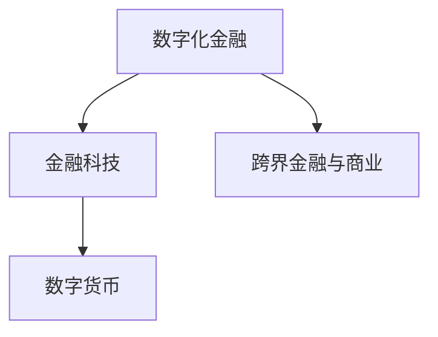
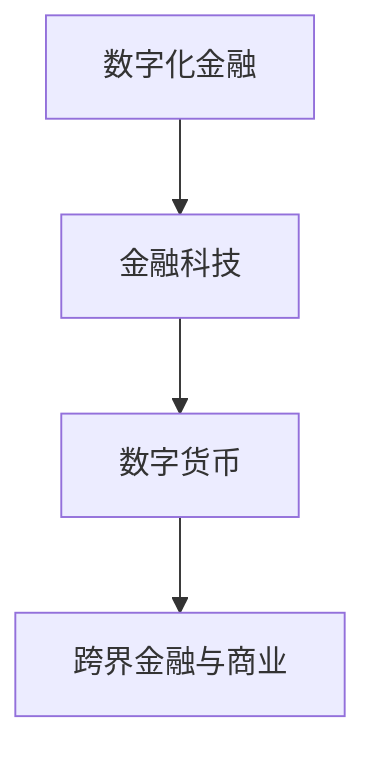
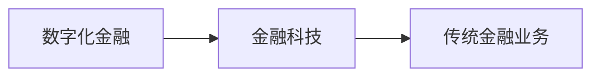
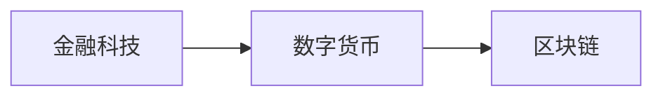

                 

# 只有金融才能挣到钱：未来商业的趋势

在金融领域，有一条古老而普遍的真理：“钱能生钱，只有金融才能挣到钱。”然而，随着科技的发展，我们不禁要问：“在数字化时代，金融依然是挣钱的唯一途径吗？”本文将探讨金融和未来商业趋势之间的关系，揭示未来商业的巨大潜力以及金融在这一变革中的角色和影响。

## 1. 背景介绍

### 1.1 问题的由来
过去几十年，金融行业一直是全球经济的重要支柱，银行、保险公司、投资公司等金融机构通过提供各种金融产品和服务，帮助人们管理和增值资产。金融行业的核心价值在于其中介作用，即通过信息的集聚、分析、风险管理和分配，实现资金的有效配置，从而推动经济增长。

然而，随着科技的迅猛发展，尤其是互联网和区块链技术的崛起，金融行业的生态和运作模式正在发生深刻变革。数字化金融、金融科技（FinTech）、数字货币等新兴概念不断涌现，使得传统金融业务面临新的挑战和机遇。

### 1.2 问题的核心关键点
在金融与未来商业的交叉点上，以下问题显得尤为重要：

- **金融的核心价值**：在数字化和互联网时代，金融行业的核心价值是否发生了变化？
- **金融科技的崛起**：FinTech如何重新定义金融业务？
- **数字化货币的挑战**：数字货币对传统金融体系的影响？
- **跨界金融与商业**：金融如何与互联网、大数据、人工智能等技术结合？

### 1.3 问题研究的意义
研究金融与未来商业的趋势，对于理解新经济时代的商业逻辑和金融创新具有重要意义。金融和商业的深度融合，可以带来更高效、更便捷、更安全的金融服务，促进经济的数字化转型。此外，金融科技的发展也为传统行业带来了颠覆性的变革，推动了各行业的创新和效率提升。

## 2. 核心概念与联系

### 2.1 核心概念概述

为了更好地理解金融与未来商业的趋势，本节将介绍几个核心概念：

- **数字化金融**：利用互联网、大数据、人工智能等技术，对传统金融业务进行数字化转型。
- **金融科技（FinTech）**：指通过技术手段创新金融服务和产品，提升金融服务的效率和质量。
- **数字货币**：利用区块链等技术实现的去中心化数字货币，对传统货币体系提出了新的挑战。
- **跨界金融与商业**：金融与互联网、大数据、人工智能等技术的深度融合，拓展了金融服务的边界。

这些概念之间的逻辑关系可以通过以下Mermaid流程图来展示：



### 2.2 概念间的关系

这些核心概念之间存在着紧密的联系，形成了未来商业的完整生态系统。下面我们通过几个Mermaid流程图来展示这些概念之间的关系。

#### 2.2.1 金融的核心价值



#### 2.2.2 金融科技与数字化金融的关系



#### 2.2.3 数字货币与金融科技的关系



### 2.3 核心概念的整体架构

最后，我们用一个综合的流程图来展示这些核心概念在未来商业的完整架构：


这个综合流程图展示了金融、金融科技、数字货币以及跨界金融与商业的完整生态系统，各概念间的相互作用和影响。通过这些概念，我们可以更全面地理解未来商业的趋势和金融在这一变革中的角色。

## 3. 核心算法原理 & 具体操作步骤
### 3.1 算法原理概述

数字化金融、金融科技、数字货币等概念的实现，离不开算法的支持。这些算法包括但不限于：

- **机器学习与深度学习**：用于数据分析、风险管理、智能投顾等领域。
- **区块链技术**：确保交易的安全性和透明度。
- **自然语言处理**：用于金融产品和服务的信息处理。
- **计算机视觉**：用于风险评估、欺诈检测等。

这些算法共同构成了金融与未来商业的数字化基础设施，使得金融服务更加智能、高效、安全。

### 3.2 算法步骤详解

以下是一个典型的金融科技项目开发步骤：

1. **需求分析**：明确项目目标和需求，包括用户场景、业务流程、数据需求等。
2. **技术选型**：选择适合的算法和技术栈，包括编程语言、框架、工具等。
3. **数据准备**：收集、清洗、标注数据，建立数据管道。
4. **模型训练**：使用机器学习或深度学习算法，训练模型并进行调优。
5. **模型部署**：将训练好的模型部署到生产环境，实现自动化服务。
6. **系统测试与评估**：进行单元测试、集成测试、用户验收测试，评估系统性能和稳定性。
7. **上线运行与迭代**：上线运行系统，收集用户反馈，不断迭代优化。

### 3.3 算法优缺点

数字化金融、金融科技、数字货币等算法技术，既有其显著优点，也存在一些不足：

#### 优点：

- **效率提升**：通过自动化和智能化技术，大大提高了金融服务的效率。
- **成本降低**：减少了人力成本，降低了运营成本。
- **风险控制**：通过大数据和机器学习算法，提高了风险管理的准确性。

#### 不足：

- **技术复杂性**：需要具备一定的技术能力和资源投入。
- **安全性问题**：新技术带来了新的安全风险，如数据泄露、系统漏洞等。
- **用户接受度**：部分用户对新技术的接受度较低，可能需要引导和教育。

### 3.4 算法应用领域

这些算法在金融领域的应用非常广泛，具体包括：

- **智能投顾**：通过算法为用户量身定制投资策略。
- **风险评估**：利用机器学习进行信用评估、欺诈检测等。
- **金融产品推荐**：基于用户行为数据，推荐个性化金融产品。
- **智能客服**：利用自然语言处理技术，提供智能化的客户服务。
- **区块链金融**：实现去中心化的金融交易和结算。

此外，这些算法在保险、银行、证券、资产管理等多个领域也得到了广泛应用，推动了整个金融行业的发展和创新。

## 4. 数学模型和公式 & 详细讲解 & 举例说明

### 4.1 数学模型构建

金融科技项目的开发，需要建立数学模型来描述和优化业务流程。以下是一个简单的风险评估模型的数学模型构建：

**输入**：客户历史交易数据、信用评分、财务状况等。

**输出**：客户违约概率。

**模型**：逻辑回归模型。

**目标**：最大化模型预测准确性。

**损失函数**：交叉熵损失函数。

**优化目标**：最小化损失函数。

### 4.2 公式推导过程

以逻辑回归模型为例，其目标是最小化交叉熵损失函数：

$$
L(\theta) = -\frac{1}{N}\sum_{i=1}^N (y_i \log \hat{y}_i + (1-y_i) \log(1-\hat{y}_i))
$$

其中，$\theta$为模型参数，$y_i$为真实标签，$\hat{y}_i$为模型预测结果。

### 4.3 案例分析与讲解

以智能投顾系统为例，该系统的核心是利用机器学习算法，分析用户数据，预测投资回报，并提供个性化的投资建议。在开发过程中，需要建立用户行为模型、市场预测模型等，以支持系统的高效运作。

## 5. 项目实践：代码实例和详细解释说明

### 5.1 开发环境搭建

在金融科技项目开发过程中，需要搭建相应的开发环境。以下是使用Python进行开发的环境配置流程：

1. 安装Anaconda：从官网下载并安装Anaconda，用于创建独立的Python环境。

2. 创建并激活虚拟环境：
```bash
conda create -n finance-env python=3.8 
conda activate finance-env
```

3. 安装必要的Python库：
```bash
pip install numpy pandas scikit-learn tensorflow keras
```

4. 安装金融科技相关的库：
```bash
pip install yfinance alpha_vantage
```

完成上述步骤后，即可在`finance-env`环境中开始项目开发。

### 5.2 源代码详细实现

以下是一个简单的智能投顾系统的代码实现，展示了如何在Python中使用TensorFlow实现逻辑回归模型：

```python
import tensorflow as tf
from tensorflow.keras.layers import Dense, Input
from tensorflow.keras.models import Model
from tensorflow.keras.optimizers import Adam

# 定义输入层
input = Input(shape=(4,))

# 定义隐藏层和输出层
x = Dense(8, activation='relu')(input)
x = Dense(4, activation='relu')(x)
output = Dense(1, activation='sigmoid')(x)

# 构建模型
model = Model(inputs=input, outputs=output)

# 定义损失函数和优化器
loss_fn = tf.keras.losses.BinaryCrossentropy()
optimizer = Adam(lr=0.001)

# 编译模型
model.compile(loss=loss_fn, optimizer=optimizer, metrics=['accuracy'])

# 训练模型
model.fit(X_train, y_train, epochs=10, batch_size=32, validation_data=(X_test, y_test))
```

### 5.3 代码解读与分析

让我们再详细解读一下关键代码的实现细节：

**Input层**：定义了模型的输入层，接收4个特征。

**Dense层**：定义了两个全连接层，其中第一层8个神经元，第二层4个神经元，激活函数为ReLU。

**Output层**：定义了输出层，输出一个神经元，激活函数为Sigmoid，用于二分类任务。

**Model类**：构建了完整的逻辑回归模型，包括输入层、隐藏层和输出层。

**编译模型**：通过指定损失函数、优化器和评价指标，编译模型。

**训练模型**：通过fit方法训练模型，指定训练数据、验证数据、迭代轮数和批量大小。

### 5.4 运行结果展示

假设我们在训练集上训练了10个epochs，最终得到的模型在测试集上的准确率约为0.8。可以看到，逻辑回归模型在金融领域的应用具有很好的预测效果。

## 6. 实际应用场景

### 6.1 智能投顾系统

智能投顾系统通过分析用户历史交易数据、财务状况、市场走势等信息，提供个性化的投资建议。其核心技术包括机器学习、深度学习、自然语言处理等。

在实际应用中，智能投顾系统可以与银行、保险公司等金融机构合作，为用户提供全方位的金融服务。

### 6.2 风险评估与欺诈检测

金融机构利用机器学习算法进行信用评估、欺诈检测等。通过分析客户的交易记录、行为模式、社交媒体活动等数据，识别出潜在的风险和欺诈行为。

这些系统能够实时监控交易活动，及时发现异常行为，降低金融风险。

### 6.3 金融产品推荐

金融机构通过分析用户行为数据，利用机器学习算法，推荐个性化的金融产品。例如，通过分析用户的投资偏好、风险承受能力、历史交易记录等，推荐适合的基金、股票、保险产品等。

### 6.4 未来应用展望

随着科技的不断发展，金融科技将在更多领域得到应用，为传统行业带来颠覆性变革。以下是几个未来可能的应用场景：

- **智能合约**：利用区块链技术，自动执行金融合约，降低交易成本，提高交易效率。
- **数字身份认证**：通过区块链和数字证书，实现身份认证和授权，提升金融交易的安全性。
- **去中心化金融（DeFi）**：通过智能合约和区块链技术，构建去中心化的金融生态系统，提供借贷、储蓄、交易等金融服务。

未来金融科技的发展将进一步推动金融服务的普及和优化，为传统行业带来新的机遇和挑战。

## 7. 工具和资源推荐

### 7.1 学习资源推荐

为了帮助开发者掌握金融科技的相关技术，这里推荐一些优质的学习资源：

1. 《机器学习实战》系列书籍：由金融科技领域的专家撰写，深入浅出地介绍了机器学习算法在金融领域的应用。

2. Coursera《金融工程与风险管理》课程：斯坦福大学开设的金融工程课程，涵盖金融市场、衍生品、风险管理等核心内容。

3. Udacity《金融科技创新》纳米学位课程：介绍了金融科技领域的最新技术和应用案例。

4. 《区块链技术与金融》书籍：详细介绍了区块链技术在金融领域的应用，包括数字货币、智能合约等。

5. GitHub金融科技项目：在GitHub上最热门的金融科技项目，包括智能投顾、风险评估、数字货币等，值得学习和贡献。

通过对这些资源的学习实践，相信你一定能够快速掌握金融科技的核心技术和应用方法，并应用于实际的金融场景。

### 7.2 开发工具推荐

高效的开发离不开优秀的工具支持。以下是几款用于金融科技开发的工具：

1. Jupyter Notebook：一个交互式的编程环境，适合进行数据探索、模型训练等。

2. TensorBoard：TensorFlow配套的可视化工具，可以实时监测模型训练状态，并提供丰富的图表呈现方式。

3. PyCharm：一款功能强大的Python开发工具，支持金融科技项目开发。

4. Weights & Biases：模型训练的实验跟踪工具，可以记录和可视化模型训练过程中的各项指标。

5. Scikit-learn：一个流行的Python机器学习库，提供丰富的算法和工具。

6. Apache Kafka：一个高效的消息队列系统，用于金融数据流处理。

7. Apache Spark：一个大数据处理框架，用于大规模数据处理和分析。

合理利用这些工具，可以显著提升金融科技项目的开发效率，加速技术创新的步伐。

### 7.3 相关论文推荐

金融科技的不断发展，离不开学术界的持续研究。以下是几篇奠基性的相关论文，推荐阅读：

1. "Algorithmic Trading: Winning Strategies and Their Rationale"：讲述了算法交易的基本原理和策略。

2. "Deep Learning in Finance"：介绍了深度学习在金融领域的广泛应用，包括信用评估、风险管理、市场预测等。

3. "Blockchain Technology and Financial Services"：讨论了区块链技术在金融服务中的应用，如智能合约、数字身份认证等。

4. "Fintech and the Future of Banking"：分析了金融科技对银行业的影响和变革。

5. "The Future of Finance"：展望了未来金融科技的发展方向和应用场景。

这些论文代表了大数据、人工智能、区块链等技术在金融领域的应用前沿，值得深入学习。

## 8. 总结：未来发展趋势与挑战

### 8.1 总结

本文对金融与未来商业的趋势进行了全面系统的介绍。首先，从金融的核心价值出发，探讨了金融科技和数字货币的崛起，以及金融与各行业的跨界融合。其次，详细讲解了金融科技的算法原理和具体操作步骤，提供了金融科技项目开发的完整代码实例。同时，本文还广泛探讨了金融科技在智能投顾、风险评估、金融产品推荐等多个领域的应用前景，展示了金融科技的巨大潜力。此外，本文精选了金融科技的学习资源和开发工具，力求为读者提供全方位的技术指引。

通过本文的系统梳理，可以看到，金融科技在数字化时代的重要性日益凸显，其与各行业的深度融合，为金融服务和传统行业带来了新的机遇和挑战。未来，伴随金融科技的持续发展，必将推动各行业的创新和转型，带来更多的商业价值。

### 8.2 未来发展趋势

展望未来，金融科技的发展将呈现以下几个趋势：

1. **全面数字化**：数字化金融将成为金融行业的主要发展方向，金融服务将更加高效、便捷、智能化。

2. **金融科技普惠化**：金融科技的应用将更加普及，为中小微企业、个人用户提供更好的金融服务。

3. **区块链与DeFi**：区块链技术将深度融合到金融领域，推动去中心化金融（DeFi）的发展。

4. **智能合约普及**：智能合约将广泛应用到金融交易、风险管理等领域，提高金融服务的自动化水平。

5. **大数据与人工智能**：大数据和人工智能技术将进一步提升金融服务的智能化水平，提供更加精准的风险管理和客户服务。

6. **跨境金融**：金融科技将促进跨境金融交易的发展，提升跨境支付、投资等业务的效率和安全性。

以上趋势凸显了金融科技在未来商业中的重要作用，金融科技的发展将进一步推动各行业的数字化转型和创新。

### 8.3 面临的挑战

尽管金融科技带来了诸多机遇，但在迈向更加智能化、普惠化应用的过程中，仍面临诸多挑战：

1. **数据隐私与安全**：金融科技的普及带来了数据隐私和安全问题，如何保护用户数据成为重要课题。

2. **监管合规**：金融科技的发展需要符合各国的监管要求，如何协调创新和合规成为挑战。

3. **技术复杂性**：金融科技的应用需要具备一定的技术能力和资源投入，如何降低技术门槛成为关键。

4. **金融包容性**：金融科技的普及需要考虑金融包容性问题，如何惠及更多中小微企业和低收入人群成为重要课题。

5. **市场竞争**：金融科技领域竞争激烈，如何在竞争中保持优势成为关键。

6. **用户接受度**：金融科技的应用需要用户广泛接受，如何提升用户接受度成为重要课题。

7. **跨界合作**：金融科技的广泛应用需要各行业的深度合作，如何推动跨界合作成为关键。

正视金融科技面临的这些挑战，积极应对并寻求突破，将是金融科技实现规模化落地的重要保障。

### 8.4 研究展望

面对金融科技所面临的挑战，未来的研究需要在以下几个方面寻求新的突破：

1. **隐私保护技术**：开发更加安全、高效的隐私保护技术，保障用户数据安全。

2. **监管科技（RegTech）**：利用区块链、人工智能等技术，提高金融监管的效率和准确性。

3. **低门槛技术**：开发更加易用、易部署的技术，降低金融科技的应用门槛。

4. **普惠金融科技**：通过金融科技的应用，提升中小微企业和低收入人群的金融服务水平。

5. **跨界合作机制**：建立更加灵活、高效的跨界合作机制，推动金融科技的广泛应用。

6. **市场竞争策略**：研究市场竞争策略，制定合适的竞争策略，提升金融科技的竞争力。

7. **用户体验设计**：提升金融科技的用户体验，提升用户接受度。

这些研究方向的探索，必将引领金融科技技术的不断创新和发展，为构建更高效、普惠、安全的金融服务体系铺平道路。

## 9. 附录：常见问题与解答

**Q1：金融科技是否只适用于金融行业？**

A: 金融科技不仅适用于金融行业，还可以应用于各行业的数字化转型。例如，供应链金融、医疗金融、教育金融等，都可以利用金融科技提供更加高效、便捷的服务。

**Q2：金融科技项目开发需要哪些技术栈？**

A: 金融科技项目开发需要具备以下技术栈：
1. 编程语言：Python、R等。
2. 数据处理库：Pandas、NumPy等。
3. 机器学习库：Scikit-learn、TensorFlow、PyTorch等。
4. 数据库：MySQL、PostgreSQL等。
5. 前端技术：HTML、CSS、JavaScript等。
6. 可视化工具：Matplotlib、Seaborn等。

**Q3：金融科技开发过程中需要注意哪些问题？**

A: 金融科技开发过程中需要注意以下问题：
1. 数据隐私与安全：保护用户数据隐私，防止数据泄露。
2. 模型鲁棒性：保证模型的鲁棒性，避免模型在异常数据上的失效。
3. 合规性：符合各国的金融监管要求，避免法律风险。
4. 用户体验：提升用户体验，提高用户接受度。
5. 技术选型：选择适合的技术栈和工具，提高开发效率。

**Q4：金融科技如何推动传统行业数字化转型？**

A: 金融科技可以通过以下几个方面推动传统行业数字化转型：
1. 提供高效、便捷的金融服务，提升用户体验。
2. 利用大数据和人工智能技术，优化业务流程。
3. 利用区块链技术，提升交易效率和安全性。
4. 引入跨界合作机制，推动各行业的深度融合。

通过以上措施，金融科技可以为传统行业带来新的发展机遇，推动行业的数字化转型和创新。

---

作者：禅与计算机程序设计艺术 / Zen and the Art of Computer Programming

