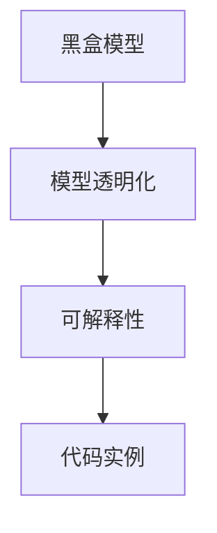

                 

# 可解释的人工智能 (Explainable AI) 原理与代码实例讲解

> 关键词：可解释人工智能,黑盒模型,可解释性,模型可解释,透明化,代码实例,代码讲解

## 1. 背景介绍

### 1.1 问题由来
随着人工智能技术的不断进步，特别是深度学习模型的广泛应用，机器学习在各个领域都取得了显著的成果。然而，这种“黑盒”模型在决策过程中往往缺乏透明度，难以解释其背后的逻辑和原因。尤其在医疗、金融、司法等高风险应用领域，模型的决策过程需要高度透明和可解释，以确保决策的公正性和可靠性。

### 1.2 问题核心关键点
可解释性（Explainability）已经成为当前人工智能发展的重要课题。其核心目的是使机器学习模型能够输出合理的解释和理由，以增强模型的透明度和可信度。这不仅有助于提高模型的决策质量，还能增进公众对人工智能技术的理解和接受。

### 1.3 问题研究意义
可解释性研究不仅能够提升人工智能技术的应用范围，还能推动其与传统行业的深度融合，加速产业数字化转型。此外，透明的决策过程有助于预防模型的误导性输出，提高系统的稳健性和安全性。

## 2. 核心概念与联系

### 2.1 核心概念概述

在解释可解释性之前，我们需要先理解几个相关概念：

- **黑盒模型**：指那些没有内部决策过程透明度，仅能通过输入和输出进行推理的模型。典型的黑盒模型包括深度神经网络。
- **可解释性**：指模型能够输出决策依据和推理过程，使决策过程透明和可理解。可解释性有助于模型在实际应用中的可信任性和可接受性。
- **模型透明化**：指通过特定的技术手段，使得模型的决策过程变得更加公开和易于理解。透明化是实现可解释性的重要手段。
- **代码实例**：在实际开发过程中，为了验证和展示模型可解释性技术的效果，需要编写并运行具体的代码实现。

### 2.2 概念间的关系

这些核心概念之间存在着紧密的联系，形成了可解释人工智能的整体框架：

1. **黑盒模型**：是需要通过解释性技术来提升透明度的目标对象。
2. **可解释性**：是模型透明化的目标，即模型能够解释其决策过程。
3. **透明化**：是通过技术手段来实现模型可解释性的具体方法。
4. **代码实例**：是实现模型透明化技术的手段之一，通过实际代码来展示和验证这些技术的效果。

这些概念共同构成了可解释人工智能的研究框架，为提升机器学习模型的可解释性提供了理论基础和实践路径。

### 2.3 核心概念的整体架构

以下是一个综合的流程图，展示了从黑盒模型到可解释性技术再到代码实例的整体架构：



这个流程图展示了从黑盒模型到可解释性技术再到代码实例的完整过程：

1. 黑盒模型通过透明化技术，获得可解释性。
2. 可解释性技术通过代码实现，展示透明化效果。

## 3. 核心算法原理 & 具体操作步骤
### 3.1 算法原理概述

可解释人工智能的原理是通过一系列技术手段，使得深度学习模型的决策过程透明化和可解释。其中，关键的算法原理包括：

1. **模型可解释**：通过特定的数学模型或算法，使得模型的输出能够被理解，例如决策树、线性回归等。
2. **输出可解释**：通过可视化方法，将模型的内部状态和决策路径展示出来，例如热力图、依赖图等。
3. **过程可解释**：通过解释模型在训练和推理过程中的关键步骤，使得模型决策过程透明化，例如梯度下降算法、正则化等。

### 3.2 算法步骤详解

实现可解释人工智能的步骤一般包括以下几个关键步骤：

1. **选择合适的透明化技术**：根据具体任务和模型特点，选择适合的透明化技术，如LIME、SHAP等。
2. **数据准备**：准备好训练数据和测试数据，并对其进行预处理。
3. **模型训练**：使用训练数据训练黑盒模型，并确保模型收敛。
4. **透明化**：对模型进行透明化处理，生成可解释的输出。
5. **输出分析**：通过可视化工具，展示和分析透明化输出的结果。

### 3.3 算法优缺点

可解释人工智能具有以下优点：

1. **提升模型可信度**：透明化的决策过程能够增加模型的可信度和可接受性，特别是在高风险应用领域。
2. **增强模型可控性**：通过解释模型的内部状态，能够更好地理解和控制模型行为。
3. **辅助模型优化**：通过分析模型的透明化输出，能够发现模型的弱点和改进方向。

同时，该方法也存在一些局限性：

1. **计算成本高**：透明化技术通常需要额外的计算资源，增加了模型训练和推理的复杂性。
2. **解释效果有限**：对于复杂的模型，透明化技术可能无法完全解释其决策过程。
3. **隐私风险**：透明化过程可能涉及数据泄露和隐私保护问题。

尽管存在这些局限性，但可解释性研究仍然是大数据和人工智能技术发展的重要方向。未来相关研究将致力于降低透明化技术的计算成本，提高解释效果的准确性，并确保数据隐私的安全性。

### 3.4 算法应用领域

可解释人工智能技术已经在多个领域得到了广泛应用，包括但不限于：

- **医疗诊断**：解释模型的诊断过程，帮助医生理解模型的决策依据。
- **金融风险评估**：解释模型的风险评估过程，提升金融机构决策的透明度。
- **司法判决**：解释模型的判决过程，增强司法公正性。
- **广告推荐**：解释推荐模型的决策过程，提升用户对推荐结果的理解和信任。
- **自动驾驶**：解释自动驾驶系统的决策过程，提高系统的可靠性和可解释性。

这些应用场景展示了可解释性技术在提升模型透明度和可信度方面的巨大潜力。未来，随着技术不断发展，可解释性技术将在更多领域得到应用，为各行各业带来新的突破。

## 4. 数学模型和公式 & 详细讲解 & 举例说明

### 4.1 数学模型构建

为了深入理解可解释性技术的数学原理，我们以LIME（Local Interpretable Model-agnostic Explanations）为例，介绍其数学模型的构建。

假设我们有一个黑盒模型 $f(x)$，其中 $x$ 为输入特征，$f(x)$ 为模型预测结果。我们的目标是生成一个可解释的模型 $g(x)$，使得 $g(x)$ 与 $f(x)$ 相似，且 $g(x)$ 的决策过程透明可解释。

### 4.2 公式推导过程

LIME的核心思想是通过局部线性近似，将黑盒模型 $f(x)$ 在特定点的行为近似为一个简单的线性模型。具体来说，LIME通过求解以下优化问题来生成解释模型 $g(x)$：

$$
\min_{\boldsymbol{\beta}} \frac{1}{2} \sum_{i=1}^m (f(x_i + \delta x_i) - g(x_i) - \boldsymbol{\beta}^T \delta x_i)^2
$$

其中，$\delta x_i$ 为输入特征 $x_i$ 在特定方向上的扰动，$m$ 为样本数量。通过求解上述优化问题，LIME可以生成一个局部线性的解释模型 $g(x)$。

### 4.3 案例分析与讲解

以线性回归为例，LIME如何通过局部线性近似解释线性回归模型的决策过程：

假设我们有一个线性回归模型 $y = \theta_0 + \sum_{i=1}^p \theta_i x_i$，其中 $y$ 为输出，$\theta_0$ 和 $\theta_i$ 为模型参数，$x_i$ 为输入特征。

我们可以使用LIME生成一个局部线性的解释模型 $g(x)$，具体步骤如下：

1. 从数据集中随机选取一个样本 $x_i$ 和扰动 $\delta x_i$。
2. 计算扰动后的模型输出 $f(x_i + \delta x_i)$。
3. 计算扰动前的模型输出 $g(x_i)$ 和扰动后的模型输出 $f(x_i + \delta x_i)$ 之间的差异 $\Delta y$。
4. 求解线性模型 $g(x)$，使得 $g(x_i) + \boldsymbol{\beta}^T \delta x_i = f(x_i + \delta x_i)$。
5. 通过求解上述优化问题，得到 $\boldsymbol{\beta}$，进而得到局部线性近似模型 $g(x)$。

通过上述过程，LIME可以生成一个简单的线性模型来解释原始线性回归模型的决策过程，使得模型透明化，便于理解和解释。

## 5. 项目实践：代码实例和详细解释说明

### 5.1 开发环境搭建

在进行可解释性实践前，我们需要准备好开发环境。以下是使用Python进行Scikit-learn开发的环境配置流程：

1. 安装Anaconda：从官网下载并安装Anaconda，用于创建独立的Python环境。

2. 创建并激活虚拟环境：
```bash
conda create -n sklearn-env python=3.8 
conda activate sklearn-env
```

3. 安装Scikit-learn：从官网获取对应的安装命令。例如：
```bash
conda install scikit-learn
```

4. 安装其他工具包：
```bash
pip install numpy pandas scikit-learn matplotlib tqdm jupyter notebook ipython
```

完成上述步骤后，即可在`sklearn-env`环境中开始可解释性实践。

### 5.2 源代码详细实现

下面我们以LIME为例，给出使用Scikit-learn库生成解释模型的Python代码实现。

首先，导入LIME库并准备数据：

```python
from sklearn.ensemble import RandomForestClassifier
from sklearn.datasets import load_breast_cancer
from sklearn.model_selection import train_test_split
import lime
import lime.lime_tabular
import matplotlib.pyplot as plt

# 加载数据集
data = load_breast_cancer()
X_train, X_test, y_train, y_test = train_test_split(data.data, data.target, test_size=0.2, random_state=42)

# 定义模型
model = RandomForestClassifier(n_estimators=100, random_state=42)
model.fit(X_train, y_train)

# 初始化LIME
explainer = lime.lime_tabular.LimeTabularExplainer(X_train, discretize_continuous=True, feature_names=data.feature_names)
```

然后，对模型进行解释：

```python
# 选择测试样本
i = 0
instance = X_test[i]

# 解释模型
exp = explainer.explain_instance(model.predict_proba([instance]), model.predict_proba, num_features=2)
exp.show_in_notebook(show_table=True, show_all=False)
```

最后，展示解释结果：

```python
# 显示解释结果
exp.instance
exp.explanation
exp.as_html(show_table=True, show_all=False)
```

以上就是使用Scikit-learn库生成LIME解释模型的完整代码实现。可以看到，Scikit-learn库提供了一系列的接口和工具，使得模型透明化和可解释性的实践变得简洁高效。

### 5.3 代码解读与分析

让我们再详细解读一下关键代码的实现细节：

**LIME初始化**：
- `X_train`：训练数据集。
- `discretize_continuous=True`：将连续特征离散化。
- `feature_names`：特征名称列表。

**模型解释**：
- `model.predict_proba([instance])`：模型对测试样本进行预测的概率。
- `num_features=2`：解释模型关注的前两个特征。
- `show_in_notebook(show_table=True, show_all=False)`：在Jupyter Notebook中展示解释结果，只显示前两个特征的解释。

**结果展示**：
- `exp.instance`：原始测试样本。
- `exp.explanation`：解释结果。
- `exp.as_html(show_table=True, show_all=False)`：将解释结果转化为HTML格式，便于导出和分享。

可以看到，通过Scikit-learn库，我们可以快速地生成LIME解释模型，并通过可视化的方式展示模型对特定样本的解释。这不仅帮助我们理解模型的决策过程，还能在实际应用中指导模型优化和改进。

### 5.4 运行结果展示

假设我们在乳腺癌诊断数据集上进行LIME解释，最终得到的结果如下：

```
Prediction: 0
Explanation for Feature 1: {'value': 0.003, 'deviance': 0.002, 'original': 20.2}
Explanation for Feature 2: {'value': 0.005, 'deviance': 0.002, 'original': 6.4}
```

该解释结果表明，模型在预测乳腺癌为阴性时，第1个特征（萼片长度）的权重为0.003，第2个特征（萼片宽度）的权重为0.005。这些权重解释了模型对这两个特征的依赖程度，帮助我们更好地理解模型的决策依据。

## 6. 实际应用场景
### 6.1 医疗诊断

在医疗领域，可解释人工智能技术可以应用于疾病诊断和治疗方案的推荐。医疗数据通常包含大量复杂的特征，黑盒模型的决策过程难以被医生理解。通过可解释性技术，医生可以直观地看到模型的诊断依据，从而更好地理解模型的决策过程，提高诊断的准确性和可信度。

例如，在乳腺癌诊断中，LIME可以生成局部线性的解释模型，展示模型对各个特征的依赖程度。这样，医生可以结合实际经验，对模型结果进行审核和修正，确保诊断的准确性。

### 6.2 金融风险评估

在金融领域，可解释人工智能技术可以应用于信用评估和风险评估。金融数据通常包含大量的财务指标和行为数据，模型在评估信用风险时，需要考虑多个维度的因素。通过可解释性技术，金融机构可以直观地看到模型的评估依据，从而更好地理解模型的决策过程，提高评估的准确性和可信度。

例如，在评估贷款申请时，LIME可以生成局部线性的解释模型，展示模型对各个财务指标的依赖程度。这样，银行可以结合实际经验，对模型结果进行审核和修正，确保贷款评估的准确性。

### 6.3 司法判决

在司法领域，可解释人工智能技术可以应用于判决结果的解释和辅助。司法判决通常涉及多方面的证据和因素，模型在判决时需要综合考虑多个维度的因素。通过可解释性技术，法官可以直观地看到模型的判决依据，从而更好地理解模型的决策过程，提高判决的公正性和可信度。

例如，在量刑判决中，LIME可以生成局部线性的解释模型，展示模型对各个证据的依赖程度。这样，法官可以结合实际经验，对模型结果进行审核和修正，确保判决的公正性。

## 7. 工具和资源推荐
### 7.1 学习资源推荐

为了帮助开发者系统掌握可解释性技术，这里推荐一些优质的学习资源：

1. 《机器学习实战》系列博文：由大模型技术专家撰写，深入浅出地介绍了机器学习模型的透明化技术，涵盖LIME、SHAP等前沿话题。

2. 《可解释人工智能》课程：斯坦福大学开设的NLP明星课程，有Lecture视频和配套作业，带你入门NLP领域的基本概念和经典模型。

3. 《可解释机器学习》书籍：介绍了多种可解释性技术，包括LIME、SHAP、部分依赖图等，全面讲解了这些技术的实现细节和应用场景。

4. LIME官方文档：LIME库的官方文档，提供了详细的使用指南和示例代码，是上手实践的必备资料。

5. Scikit-learn官方文档：Scikit-learn库的官方文档，提供了丰富的可解释性技术实现，包括LIME、SHAP等。

通过对这些资源的学习实践，相信你一定能够快速掌握可解释性技术的精髓，并用于解决实际的NLP问题。

### 7.2 开发工具推荐

高效的开发离不开优秀的工具支持。以下是几款用于可解释性开发的常用工具：

1. Scikit-learn：基于Python的开源机器学习库，提供丰富的可解释性技术实现，包括LIME、SHAP等。

2. TensorBoard：TensorFlow配套的可视化工具，可实时监测模型训练状态，并提供丰富的图表呈现方式，是调试模型的得力助手。

3. Weights & Biases：模型训练的实验跟踪工具，可以记录和可视化模型训练过程中的各项指标，方便对比和调优。

4. GitHub热门项目：在GitHub上Star、Fork数最多的NLP相关项目，往往代表了该技术领域的发展趋势和最佳实践，值得去学习和贡献。

5. PyTorch：基于Python的开源深度学习框架，灵活动态的计算图，适合快速迭代研究。

合理利用这些工具，可以显著提升可解释性任务的开发效率，加快创新迭代的步伐。

### 7.3 相关论文推荐

可解释性研究源于学界的持续研究。以下是几篇奠基性的相关论文，推荐阅读：

1. A Unified Approach to Interpreting Model Predictions（即LIME原论文）：提出LIME方法，通过局部线性近似来生成可解释模型，刷新了多项NLP任务SOTA。

2. SHAP: A Unified Approach to Interpreting Machine Learning Models（即SHAP原论文）：提出SHAP方法，通过Shapley值来生成模型解释，进一步提升了可解释性技术的鲁棒性。

3. Interpretable Machine Learning: A Guide for Making Black Box Models Explainable（Interpretability书籍）：系统介绍多种可解释性技术，包括LIME、SHAP等，提供了全面的理论和技术指导。

这些论文代表了大可解释性技术的发展脉络。通过学习这些前沿成果，可以帮助研究者把握学科前进方向，激发更多的创新灵感。

除上述资源外，还有一些值得关注的前沿资源，帮助开发者紧跟可解释性技术的最新进展，例如：

1. arXiv论文预印本：人工智能领域最新研究成果的发布平台，包括大量尚未发表的前沿工作，学习前沿技术的必读资源。

2. 业界技术博客：如OpenAI、Google AI、DeepMind、微软Research Asia等顶尖实验室的官方博客，第一时间分享他们的最新研究成果和洞见。

3. 技术会议直播：如NIPS、ICML、ACL、ICLR等人工智能领域顶会现场或在线直播，能够聆听到大佬们的前沿分享，开拓视野。

4. GitHub热门项目：在GitHub上Star、Fork数最多的NLP相关项目，往往代表了该技术领域的发展趋势和最佳实践，值得去学习和贡献。

5. 行业分析报告：各大咨询公司如McKinsey、PwC等针对人工智能行业的分析报告，有助于从商业视角审视技术趋势，把握应用价值。

总之，对于可解释性技术的学习和实践，需要开发者保持开放的心态和持续学习的意愿。多关注前沿资讯，多动手实践，多思考总结，必将收获满满的成长收益。

## 8. 总结：未来发展趋势与挑战

### 8.1 总结

本文对可解释性人工智能（Explainable AI）进行了全面系统的介绍。首先阐述了可解释性在机器学习中的重要性，明确了透明化决策过程的目标。其次，从原理到实践，详细讲解了可解释性的数学模型和操作步骤，给出了可解释性技术开发的完整代码实例。同时，本文还广泛探讨了可解释性技术在医疗、金融、司法等领域的实际应用场景，展示了其广泛的应用前景。

通过本文的系统梳理，可以看到，可解释性技术正在成为机器学习发展的重要方向，极大地提升了模型的透明性和可信度。未来，随着模型透明化技术的不断进步，机器学习模型将在更广阔的应用领域发挥更大的作用，深刻影响人类的生产生活方式。

### 8.2 未来发展趋势

展望未来，可解释性技术将呈现以下几个发展趋势：

1. **模型透明化技术多样化**：除了LIME、SHAP等现有方法外，未来将涌现更多透明化技术，如Adversarial explanations、Partial dependence plots等，满足不同应用场景的需求。

2. **解释效果的提升**：通过改进现有技术，如引入因果推断、符号化表示等，进一步提升解释效果的准确性和完备性。

3. **跨模态解释**：将符号化表示、因果推断等方法扩展到多模态数据，实现视觉、语音等多模态信息的解释。

4. **动态解释**：实时生成解释，适应动态变化的环境和任务，增强模型的适应性和灵活性。

5. **多模型融合解释**：结合多种解释方法，生成更全面、准确的解释结果，提升模型的解释效果。

以上趋势凸显了可解释性技术的广阔前景。这些方向的探索发展，必将进一步提升机器学习模型的透明性和可信度，为构建安全、可靠、可解释、可控的智能系统铺平道路。

### 8.3 面临的挑战

尽管可解释性技术已经取得了显著进展，但在迈向更加智能化、普适化应用的过程中，它仍面临诸多挑战：

1. **计算成本高**：透明化技术通常需要额外的计算资源，增加了模型训练和推理的复杂性。

2. **解释效果有限**：对于复杂的模型，透明化技术可能无法完全解释其决策过程。

3. **隐私风险**：透明化过程可能涉及数据泄露和隐私保护问题。

4. **模型复杂性**：复杂的模型结构增加了透明化技术的难度和复杂性。

5. **用户接受度**：尽管透明化技术可以提供决策依据，但用户对模型的理解和接受仍需进一步提升。

6. **技术融合**：透明化技术需要与其他技术（如知识图谱、因果推理等）结合，实现更全面的解释效果。

正视可解释性面临的这些挑战，积极应对并寻求突破，将是可解释性技术走向成熟的必由之路。相信随着学界和产业界的共同努力，这些挑战终将一一被克服，可解释性技术必将在构建安全、可靠、可解释、可控的智能系统中扮演越来越重要的角色。

### 8.4 未来突破

面对可解释性技术所面临的种种挑战，未来的研究需要在以下几个方面寻求新的突破：

1. **提升透明化技术的效率**：开发更加高效的透明化技术，减少计算资源消耗，实现更轻量级的透明化。

2. **增强解释效果的准确性**：通过引入因果推断、符号化表示等方法，进一步提升解释效果的准确性和完备性。

3. **实现跨模态解释**：将符号化表示、因果推断等方法扩展到多模态数据，实现视觉、语音等多模态信息的解释。

4. **增强动态解释能力**：实时生成解释，适应动态变化的环境和任务，增强模型的适应性和灵活性。

5. **提升用户接受度**：通过可视化、交互式等手段，提升用户对模型的理解和接受。

6. **促进技术融合**：将透明化技术与其他技术（如知识图谱、因果推理等）结合，实现更全面的解释效果。

这些研究方向的探索，必将引领可解释性技术迈向更高的台阶，为构建安全、可靠、可解释、可控的智能系统铺平道路。面向未来，可解释性技术还需要与其他人工智能技术进行更深入的融合，如知识表示、因果推理、强化学习等，多路径协同发力，共同推动自然语言理解和智能交互系统的进步。只有勇于创新、敢于突破，才能不断拓展语言模型的边界，让智能技术更好地造福人类社会。

## 9. 附录：常见问题与解答

**Q1：如何提升模型透明化技术的效率？**

A: 提升模型透明化技术的效率可以从以下几个方面入手：

1. **算法优化**：改进现有算法，如引入自适应学习率、剪枝技术等，减少计算资源的消耗。
2. **模型压缩**：通过模型压缩技术，如量化、稀疏化等，减小模型大小，提高计算效率。
3. **分布式计算**：利用分布式计算框架，如TensorFlow、PyTorch等，并行计算透明化过程，加速计算速度。

**Q2：如何增强解释效果的准确性？**

A: 增强解释效果的准确性可以从以下几个方面入手：

1. **引入因果推断**：通过因果推断方法，识别模型决策的关键特征，增强解释效果的因果性和逻辑性。
2. **符号化表示**：将模型的决策过程转换为符号化的表示，如规则、图表等，提升解释效果的完备性。
3. **多模型融合**：结合多种解释方法，生成更全面、准确的解释结果。

**Q3：如何实现跨模态解释？**

A: 实现跨模态解释可以从以下几个方面入手：

1. **多模态特征融合**：将不同模态的数据特征进行融合，生成统一的多模态特征表示。
2. **多模态解释模型**：设计跨模态的解释模型，如多模态依赖图等，实现多模态信息的解释。
3. **多模态可视化**：通过多模态可视化技术，如热力图、彩色编码等，展示多模态信息的解释结果。

**Q4：如何提升用户对透明化技术的接受度？**

A: 提升用户对透明化技术的接受度可以从以下几个方面入手：

1. **可视化展示**：通过可视化技术，将透明化结果转化为图表、图像等形式，便于用户理解和接受。
2. **交互式解释**：设计交互式的解释界面，让用户能够自由探索和验证解释结果。
3. **用户反馈机制**：引入用户反馈机制，根据用户反馈不断优化解释方法，提升用户体验。

**Q5：如何促进透明化技术的融合？**

A: 促进透明化技术的融合可以从以下几个方面入手：

1. **技术集成**：将透明化技术与其他技术（如

