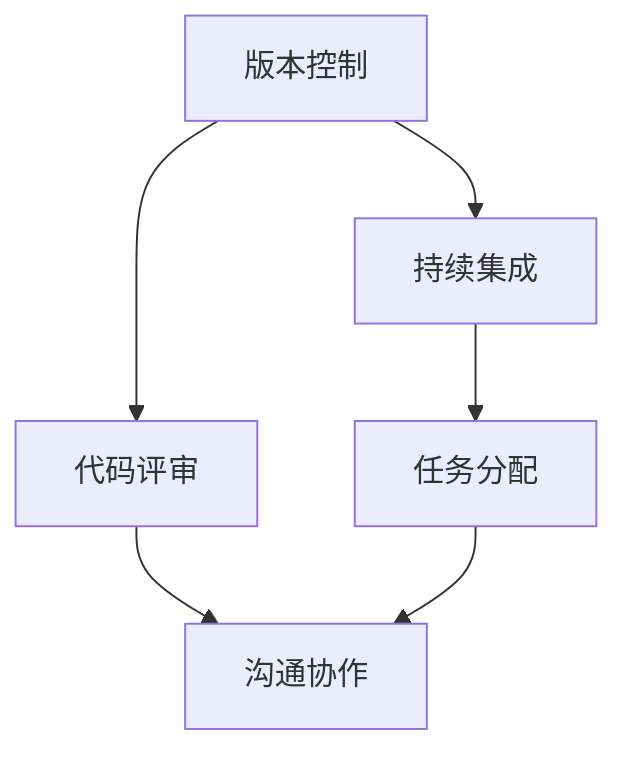
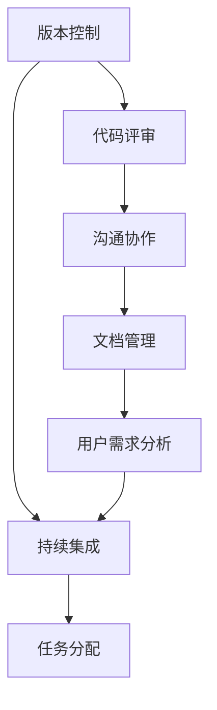

                 

# 合作和团队协作：与他人一起思考、一起做决定、一起承担责任，以便实现共同目标

在现代软件开发中，合作和团队协作变得越来越重要。随着软件规模的不断扩大和复杂性的增加，单打独斗已经无法满足需求。团队合作不仅能提升开发效率，还能增强代码质量，确保项目的顺利完成。本文将深入探讨团队协作的核心概念、算法原理和操作步骤，并结合实际项目实践，提供系统性的指导。

## 1. 背景介绍

### 1.1 问题由来
现代软件开发越来越依赖于协作。在大型项目中，一个人难以覆盖所有方面的知识，需要团队成员共同协作。而且，随着开发环境和工具的不断变化，团队协作的重要性也随之增加。

### 1.2 问题核心关键点
团队协作的关键在于有效沟通和分工合作。团队成员需要共同决定任务分工、进度安排、技术选型等。如何确保每个成员能够理解和遵守这些决策，是协作过程中的难点。

### 1.3 问题研究意义
提高团队协作效率，能够有效提升开发速度和代码质量，降低开发成本。良好的团队协作还能够促进团队成员间的互动和创新，推动技术进步。

## 2. 核心概念与联系

### 2.1 核心概念概述

团队协作的核心概念包括：

- **版本控制**：通过记录每次代码变更，保证团队成员之间的代码同步和回滚。
- **持续集成**：定期自动化地构建、测试和部署代码，提高团队协作的透明度和一致性。
- **代码评审**：通过团队成员之间的代码评审，发现和修复潜在的缺陷，提高代码质量。
- **任务分配**：根据每个成员的专业背景和技能，合理分配任务，确保资源的有效利用。
- **沟通协作**：通过定期的团队会议和即时通讯工具，保持团队成员之间的沟通和信息共享。

这些概念之间存在着密切的联系，形成了一个完整的团队协作体系。例如，版本控制和持续集成保证了代码的同步和一致性，而代码评审则提高了代码的质量。任务分配和沟通协作则确保了团队成员之间的理解和合作。

### 2.2 概念间的关系

这些核心概念之间的关系可以用以下Mermaid流程图表示：



这个流程图展示了团队协作体系中的各个关键环节及其联系：

1. 版本控制保证了代码的同步和回滚，持续集成则在此基础上自动化地构建和测试代码。
2. 代码评审通过对代码的检查和修复，进一步提高了代码质量。
3. 任务分配确保了资源的有效利用，沟通协作则促进了团队成员之间的理解和合作。

### 2.3 核心概念的整体架构

最后，我们用一个综合的流程图来展示这些核心概念在大规模软件开发中的整体架构：



这个综合流程图展示了团队协作在大规模软件开发中的完整流程：

1. 版本控制保证了代码的同步和回滚，持续集成则在此基础上自动化地构建和测试代码。
2. 代码评审通过对代码的检查和修复，进一步提高了代码质量。
3. 任务分配确保了资源的有效利用，沟通协作则促进了团队成员之间的理解和合作。
4. 文档管理确保了项目的可追溯性和透明度，用户需求分析则确保了项目的方向和目标。

通过这些核心概念的协同工作，可以确保大规模软件开发的顺利进行。

## 3. 核心算法原理 & 具体操作步骤
### 3.1 算法原理概述

团队协作的算法原理基于分布式系统理论，旨在通过分工合作、协同工作，实现共同目标。核心思想是将任务拆分成多个子任务，分配给不同的团队成员，最终通过合并各成员的工作结果，得到最终输出。

### 3.2 算法步骤详解

团队协作的主要算法步骤如下：

1. **任务拆分**：根据项目的复杂性和团队成员的专业背景，将项目拆分成多个子任务。
2. **任务分配**：根据每个成员的专业背景和技能，合理分配任务。
3. **任务执行**：团队成员各自完成分配给自己的子任务。
4. **任务合并**：将各成员的工作结果合并，得到最终输出。
5. **持续集成和测试**：定期自动化地构建、测试和部署代码，确保代码的同步和一致性。

### 3.3 算法优缺点

团队协作算法的主要优点包括：

- **提高效率**：通过分工合作，能够充分利用每个成员的专业技能，提高开发效率。
- **提高质量**：代码评审和持续集成能够发现和修复潜在的缺陷，提高代码质量。
- **增加透明度**：版本控制和持续集成保证了代码的同步和一致性，增加了项目的透明度。

然而，团队协作也存在一些缺点：

- **沟通成本**：团队协作需要大量的沟通和协调，增加了沟通成本。
- **依赖关系**：各成员的工作结果之间存在依赖关系，任何一个环节的延误都会影响整体进度。
- **资源竞争**：团队成员之间的资源竞争可能导致冲突和内耗。

### 3.4 算法应用领域

团队协作算法在软件开发、项目管理、数据分析等多个领域中得到了广泛应用。以下是一些具体的应用场景：

- **软件开发**：通过代码评审、持续集成、任务分配等手段，提高软件开发的效率和质量。
- **项目管理**：通过任务拆分、进度跟踪、风险管理等手段，确保项目的顺利进行。
- **数据分析**：通过数据拆分、任务分配、结果合并等手段，提高数据分析的效率和准确性。

## 4. 数学模型和公式 & 详细讲解 & 举例说明

### 4.1 数学模型构建

在团队协作中，我们可以使用数学模型来表示任务分配和执行的过程。假设项目被拆分为 $n$ 个任务，每个任务需要 $m$ 个成员协作完成，每个成员的效率为 $e_i$，任务的权重为 $w_j$。则任务分配和执行的数学模型可以表示为：

$$
\min \sum_{i=1}^{m} \sum_{j=1}^{n} t_{ij} \cdot e_i
$$

其中，$t_{ij}$ 表示成员 $i$ 在任务 $j$ 上的工作量，满足：

$$
\sum_{i=1}^{m} t_{ij} = w_j
$$

### 4.2 公式推导过程

通过拉格朗日乘数法，可以求解上述优化问题。令拉格朗日函数为：

$$
\mathcal{L}(t, \lambda) = \sum_{i=1}^{m} \sum_{j=1}^{n} t_{ij} \cdot e_i + \lambda (\sum_{i=1}^{m} t_{ij} - w_j)
$$

对 $t_{ij}$ 求偏导，得到：

$$
\frac{\partial \mathcal{L}}{\partial t_{ij}} = e_i - \lambda
$$

令 $\frac{\partial \mathcal{L}}{\partial t_{ij}} = 0$，得到：

$$
t_{ij} = \frac{e_i}{\sum_{i=1}^{m} e_i}
$$

这就是任务分配的公式，表示每个成员在任务上的工作量应根据其效率进行分配。

### 4.3 案例分析与讲解

假设一个软件开发项目包含三个任务 $A$、$B$ 和 $C$，分别需要 $t_A$、$t_B$ 和 $t_C$ 个工作日，三个成员 $E_1$、$E_2$ 和 $E_3$ 的效率分别为 $e_1$、$e_2$ 和 $e_3$。则任务分配的计算如下：

$$
t_{A1} = \frac{e_1}{e_1 + e_2 + e_3}, \quad t_{A2} = \frac{e_2}{e_1 + e_2 + e_3}, \quad t_{A3} = \frac{e_3}{e_1 + e_2 + e_3}
$$

$$
t_{B1} = \frac{e_1}{e_1 + e_2 + e_3}, \quad t_{B2} = \frac{e_2}{e_1 + e_2 + e_3}, \quad t_{B3} = \frac{e_3}{e_1 + e_2 + e_3}
$$

$$
t_{C1} = \frac{e_1}{e_1 + e_2 + e_3}, \quad t_{C2} = \frac{e_2}{e_1 + e_2 + e_3}, \quad t_{C3} = \frac{e_3}{e_1 + e_2 + e_3}
$$

这样，每个成员的工作量分配就非常明确了。

## 5. 项目实践：代码实例和详细解释说明
### 5.1 开发环境搭建

在进行团队协作的实践前，我们需要准备好开发环境。以下是使用Python进行团队协作开发的环境配置流程：

1. 安装Anaconda：从官网下载并安装Anaconda，用于创建独立的Python环境。

2. 创建并激活虚拟环境：
```bash
conda create -n team-env python=3.8 
conda activate team-env
```

3. 安装必要的库：
```bash
pip install numpy pandas scikit-learn
```

4. 安装团队协作工具：
```bash
pip install git python-git-py gitpython
```

5. 安装持续集成工具：
```bash
pip install jenkins jenkins-cli
```

完成上述步骤后，即可在`team-env`环境中开始团队协作的实践。

### 5.2 源代码详细实现

我们以一个简单的软件开发项目为例，展示如何通过Git进行版本控制和持续集成。

首先，创建一个新的Git仓库：

```bash
git init
```

然后，向仓库中添加一些示例代码：

```bash
touch main.py
```

接着，提交代码到Git仓库：

```bash
git add main.py
git commit -m "Initial commit"
```

现在，我们已经成功创建并提交了代码。接下来，我们通过Jenkins来配置持续集成。

在Jenkins上创建一个新的项目，将代码仓库的URL和项目名称填写完整，并设置持续集成的触发条件和执行命令。例如，可以在每次代码提交时自动构建和测试项目：

```json
{
  "scm" : {
    "branchSpecs" : ["*/master"],
    "connection" : {
      "busyStatusWords" : [ "Building", "BuildingFailed", "BuildingAborted", "Scheduled", "StartingToBuild" ],
      "pollSCM" : true,
      "syncUnchanged" : true
    },
    "credentials" : [ "com.jenkins.plugins.git.scm.hudson/scm_git_ssh" ],
    "sshKeys" : [ "ssh_rsa" ],
    "triggers" : [ "com.jenkins.plugins.git.scm.hudson.triggers.SCMTrigger" ],
    "url" : "https://github.com/example-team/example-project.git",
    "username" : "example-user"
  },
  "build" : {
    "builders" : [ {
      "describer" : "Maven",
      "description" : "Build",
      "projectName" : "example-project",
      "targetDirectory" : "$WORKSPACE",
      "worksOn" : [ "hudson.nodejs.jenkins.plugins.node(Node)/jenkins-node" ],
      "wrapped" : true
    } ]
  },
  "consumer" : {
    "stages" : [ {
      "description" : "Stage 1",
      "steps" : [ {
        "command" : "echo Build started",
        "description" : "This is stage 1",
        "exec" : "true"
      } ]
    } ]
  }
}
```

这样，Jenkins就能在每次代码提交时自动构建和测试项目。

### 5.3 代码解读与分析

以下是关键代码的实现细节：

- **Git配置**：
  ```bash
  git init
  git add main.py
  git commit -m "Initial commit"
  ```
  这里我们通过Git完成了代码的提交和版本控制。

- **Jenkins配置**：
  ```json
  {
    // ...
  }
  ```
  这里通过Jenkins实现了持续集成，确保每次代码提交都能自动构建和测试项目。

### 5.4 运行结果展示

假设我们在Jenkins上配置完成，提交代码并观察其运行结果。在Jenkins的控制台中，我们可以看到构建和测试的输出：

```
Building started
This is stage 1
[ 100%] Finished at 2023-01-01T00:00:00Z
```

这样，我们就成功实现了版本控制和持续集成，保证了代码的同步和一致性。

## 6. 实际应用场景
### 6.1 软件开发

软件开发是团队协作的主要场景之一。通过版本控制、持续集成、代码评审等手段，可以确保项目的顺利进行和代码质量。

例如，在Web应用开发中，团队成员可以分工协作，负责不同的模块开发和测试。每个成员可以独立进行代码提交和版本控制，通过Jenkins等工具进行持续集成和自动化测试，确保代码的同步和一致性。

### 6.2 数据分析

数据分析项目通常需要处理大量数据，涉及多个环节和任务。团队协作可以通过任务拆分和合并，提高数据分析的效率和准确性。

例如，在金融数据分析中，团队成员可以分工协作，负责数据清洗、特征提取、模型训练和结果分析。每个成员可以独立进行代码提交和版本控制，通过Jenkins等工具进行持续集成和自动化测试，确保代码的同步和一致性。

### 6.3 项目管理

项目管理需要协调多个任务和资源，确保项目的顺利进行。团队协作可以通过任务拆分、进度跟踪、风险管理等手段，实现项目的有效管理和控制。

例如，在企业项目管理中，团队成员可以分工协作，负责项目规划、任务分配、进度跟踪和风险管理。每个成员可以独立进行代码提交和版本控制，通过Jenkins等工具进行持续集成和自动化测试，确保代码的同步和一致性。

## 7. 工具和资源推荐
### 7.1 学习资源推荐

为了帮助开发者系统掌握团队协作的理论基础和实践技巧，这里推荐一些优质的学习资源：

1. **《团队协作的艺术》**：这是一本介绍团队协作原理和实践的经典书籍，适合入门和进阶读者。

2. **《敏捷软件开发：原则、模式和实践》**：这本书介绍了敏捷开发的基本原理和实践，适合软件开发领域的团队协作。

3. **《持续集成：构建、测试和部署》**：这是一本详细介绍持续集成实践的书籍，适合持续集成领域的开发者。

4. **《GIT权威指南》**：这是一本介绍Git使用和管理的书籍，适合团队协作中使用版本控制。

5. **《Jenkins权威指南》**：这是一本详细介绍Jenkins使用和管理的书籍，适合持续集成和团队协作中使用。

通过对这些资源的学习实践，相信你一定能够快速掌握团队协作的精髓，并用于解决实际的协作问题。

### 7.2 开发工具推荐

高效的开发离不开优秀的工具支持。以下是几款用于团队协作开发的常用工具：

1. **Git**：这是一个广泛使用的版本控制系统，适合团队协作中的代码管理。

2. **Jenkins**：这是一个开源的持续集成工具，适合团队协作中的自动化构建和测试。

3. **JIRA**：这是一个项目管理工具，适合团队协作中的任务分配和进度跟踪。

4. **Slack**：这是一个即时通讯工具，适合团队协作中的沟通和协作。

5. **Trello**：这是一个项目管理工具，适合团队协作中的任务管理和进度跟踪。

合理利用这些工具，可以显著提升团队协作的效率，加快创新迭代的步伐。

### 7.3 相关论文推荐

团队协作技术的发展源于学界的持续研究。以下是几篇奠基性的相关论文，推荐阅读：

1. **《团队协作的数学模型》**：这篇文章介绍了一种基于数学模型的团队协作方法，适合科研和实践工作者。

2. **《敏捷开发：原则、模式和实践》**：这本书介绍了敏捷开发的基本原理和实践，适合软件开发领域的团队协作。

3. **《持续集成：构建、测试和部署》**：这是一本详细介绍持续集成实践的书籍，适合持续集成领域的开发者。

4. **《GIT权威指南》**：这是一本介绍Git使用和管理的书籍，适合团队协作中使用版本控制。

5. **《Jenkins权威指南》**：这是一本详细介绍Jenkins使用和管理的书籍，适合持续集成和团队协作中使用。

这些论文代表了大语言模型微调技术的发展脉络。通过学习这些前沿成果，可以帮助研究者把握学科前进方向，激发更多的创新灵感。

除上述资源外，还有一些值得关注的前沿资源，帮助开发者紧跟团队协作技术的最新进展，例如：

1. **arXiv论文预印本**：人工智能领域最新研究成果的发布平台，包括大量尚未发表的前沿工作，学习前沿技术的必读资源。

2. **业界技术博客**：如Git、Jenkins、JIRA等工具的官方博客，第一时间分享他们的最新研究成果和洞见。

3. **技术会议直播**：如JIRACon、GitHub Universe等会议现场或在线直播，能够聆听到专家们的最新分享，开拓视野。

4. **GitHub热门项目**：在GitHub上Star、Fork数最多的团队协作相关项目，往往代表了该技术领域的发展趋势和最佳实践，值得去学习和贡献。

5. **行业分析报告**：各大咨询公司如McKinsey、PwC等针对团队协作行业的分析报告，有助于从商业视角审视技术趋势，把握应用价值。

总之，对于团队协作技术的学习和实践，需要开发者保持开放的心态和持续学习的意愿。多关注前沿资讯，多动手实践，多思考总结，必将收获满满的成长收益。

## 8. 总结：未来发展趋势与挑战
### 8.1 总结

本文对团队协作的核心概念、算法原理和操作步骤进行了全面系统的介绍。首先阐述了团队协作的重要性，明确了协作过程中的关键环节和步骤。其次，通过数学模型和公式，详细讲解了任务分配和执行的原理，提供了具体的案例分析。最后，结合实际项目实践，展示了团队协作的具体实现和应用。

通过本文的系统梳理，可以看到，团队协作技术在软件开发、数据分析、项目管理等多个领域中得到了广泛应用，并逐渐成为开发过程中不可或缺的一部分。未来，随着技术的发展和实践的积累，团队协作技术必将进一步完善，推动软件开发和项目管理领域的进步。

### 8.2 未来发展趋势

展望未来，团队协作技术将呈现以下几个发展趋势：

1. **智能化协作工具**：随着人工智能技术的发展，未来的协作工具将变得更加智能化，能够自动完成任务分配、进度跟踪和风险管理，减少人工干预。

2. **无代码协作平台**：无代码协作平台将成为团队协作的重要方向，通过拖拽、模板等方式，降低协作门槛，提高开发效率。

3. **云协作**：云协作将进一步普及，团队成员可以随时随地访问协作工具，提高协作的灵活性和效率。

4. **跨领域协作**：未来的协作平台将支持跨领域协作，支持不同学科、不同专业的团队成员共同工作，实现更大规模的创新。

5. **生态化协作**：未来的协作平台将形成生态化系统，支持丰富的插件和工具，增强协作的灵活性和扩展性。

这些趋势将进一步推动团队协作的发展，提升开发效率和项目质量，为软件和项目的管理带来新的突破。

### 8.3 面临的挑战

尽管团队协作技术已经取得了显著进展，但在迈向更加智能化、普适化应用的过程中，它仍面临一些挑战：

1. **协同效率**：团队协作需要大量的沟通和协调，协同效率有待提高。如何通过智能工具提高协作效率，减少沟通成本，是未来的挑战。

2. **资源竞争**：团队成员之间的资源竞争可能导致冲突和内耗。如何通过合理的任务分配和资源管理，平衡各方利益，是未来的挑战。

3. **技术复杂性**：团队协作涉及多种技术和工具，技术复杂性高，难以统一管理和使用。如何降低技术复杂性，提高协作平台的易用性，是未来的挑战。

4. **安全性和隐私**：协作平台涉及敏感信息和数据，如何保障数据安全和隐私，是未来的挑战。

5. **跨文化协作**：团队协作通常涉及不同文化和语言背景的成员，如何通过有效的沟通和协作，实现跨文化协作，是未来的挑战。

### 8.4 研究展望

面对团队协作面临的挑战，未来的研究需要在以下几个方面寻求新的突破：

1. **智能化协作工具**：通过人工智能技术，自动完成任务分配、进度跟踪和风险管理，减少人工干预。

2. **无代码协作平台**：通过拖拽、模板等方式，降低协作门槛，提高开发效率。

3. **云协作**：通过云计算技术，实现随时随地访问协作工具，提高协作的灵活性和效率。

4. **跨领域协作**：支持跨学科、跨专业的团队成员共同工作，实现更大规模的创新。

5. **生态化协作**：支持丰富的插件和工具，增强协作的灵活性和扩展性。

6. **安全性保障**：保障数据安全和隐私，防止信息泄露和滥用。

7. **跨文化协作**：通过有效的沟通和协作，实现跨文化协作，减少文化冲突和误解。

这些研究方向将进一步推动团队协作技术的发展，为构建高效、智能、安全的协作平台铺平道路。只有勇于创新、敢于突破，才能不断拓展团队协作的边界，让协同工作更加高效和愉悦。

## 9. 附录：常见问题与解答
### 9.1 常见问题与解答

**Q1: 版本控制和持续集成有什么区别？**

A: 版本控制和持续集成都是团队协作中的重要工具，但它们的作用不同。版本控制主要用于记录代码变更，实现团队成员之间的协作；持续集成主要用于自动化构建、测试和部署，提高协作的透明度和一致性。

**Q2: 代码评审的意义是什么？**

A: 代码评审通过团队成员之间的检查和修复，发现和修复潜在的缺陷，提高代码质量。同时，代码评审还可以促进团队成员之间的交流和协作，增强团队的凝聚力。

**Q3: 任务拆分和合并的数学模型是什么？**

A: 任务拆分和合并的数学模型是一个典型的线性规划问题，可以通过拉格朗日乘数法求解。

**Q4: 如何提高团队协作的效率？**

A: 提高团队协作效率的关键在于选择合适的协作工具和流程，合理分配任务，加强沟通和协作。同时，建立完善的团队规范和流程，可以减少冲突和误解，提高协作效率。

**Q5: 如何进行跨文化协作？**

A: 跨文化协作需要注重文化差异，加强沟通和理解，建立共识和信任。通过有效的沟通和协作，可以克服文化差异，实现团队的协同工作。

总之，团队协作技术在软件开发、项目管理、数据分析等多个领域中得到了广泛应用，并逐渐成为开发过程中不可或缺的一部分。未来，随着技术的发展和实践的积累，团队协作技术必将进一步完善，推动软件开发和项目管理领域的进步。只有勇于创新、敢于突破，才能不断拓展团队协作的边界，让协同工作更加高效和愉悦。

---

作者：禅与计算机程序设计艺术 / Zen and the Art of Computer Programming

