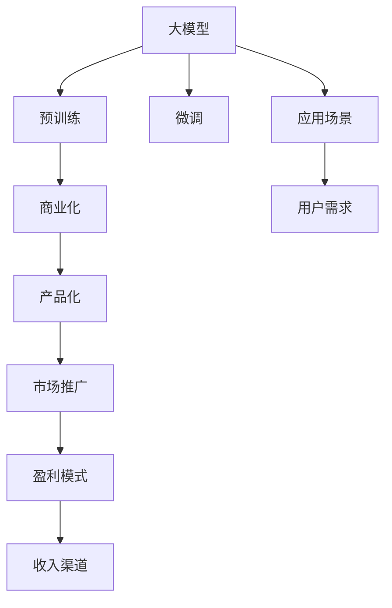
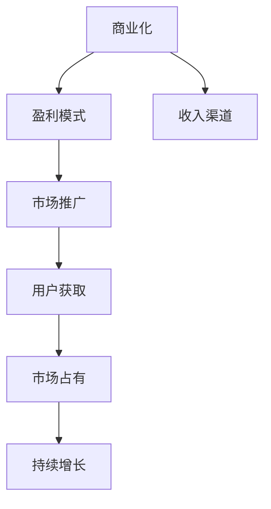
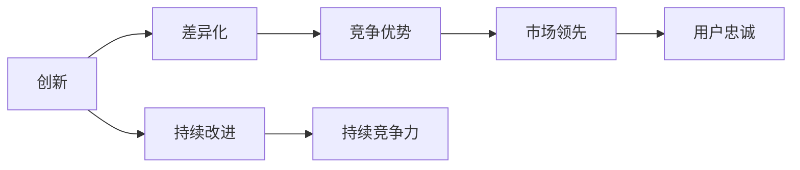
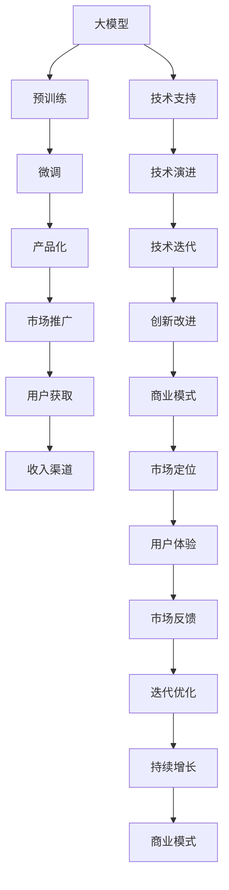

                 

# 商业模式创新：大模型创业的制胜之道

> 关键词：大模型,商业模式,创业,AI,自然语言处理(NLP),商业化,创新,技术,算法,应用,产品,市场,竞争,生态,发展

## 1. 背景介绍

### 1.1 问题由来
近年来，人工智能技术，尤其是自然语言处理(NLP)领域的大模型应用，吸引了越来越多的创业者和资本的关注。从GPT-3到BERT、T5，各种预训练语言模型在NLP任务上取得了令人瞩目的成绩，其背后蕴含的巨大商业价值也成为业界关注的焦点。然而，如何将这些技术转化为具有实际应用价值的商业模式，是摆在创业者面前的一大挑战。

### 1.2 问题核心关键点
大模型技术虽有潜在的商业价值，但如何结合市场和用户需求，将其转化为可操作的商业模式，是大模型创业的核心问题。在实际应用中，需要考虑以下关键点：

- **技术成熟度**：大模型技术是否足够成熟，能否稳定地应用于实际场景。
- **市场需求**：目标用户群体是否有足够的需求和支付意愿。
- **产品化能力**：如何将其技术优势转化为易于使用的产品和服务。
- **盈利模式**：如何通过合理的收费策略实现商业盈利。
- **竞争态势**：市场中是否存在同业竞争，如何构建差异化的竞争优势。

### 1.3 问题研究意义
研究大模型创业的商业模式，对于探索AI技术在商业领域的广泛应用、推动NLP技术的产业化进程、构建良性的产业生态具有重要意义：

1. 加速技术商业化：使大模型技术更快地转化为实际应用，缩短产品上市时间。
2. 降低创业风险：通过商业模式的创新，降低创业过程中技术、市场和运营风险。
3. 创造商业价值：找到适合的商业模式，提升产品的市场竞争力和盈利能力。
4. 促进生态发展：构建多方共赢的产业生态，推动技术创新和市场繁荣。

## 2. 核心概念与联系

### 2.1 核心概念概述

为更好地理解大模型创业的商业模式，本节将介绍几个密切相关的核心概念：

- **大模型(Large Model)**：指基于大规模数据集预训练的深度学习模型，如BERT、GPT等。
- **商业模式(Business Model)**：企业如何创造价值并获取收入的策略和逻辑。
- **创业(Entrepreneurship)**：创业是指通过创新实现商业价值的过程，包括技术创新和商业模式创新。
- **自然语言处理(NLP)**：使用计算机处理和理解人类语言的技术，是大模型创业的主要应用领域。
- **商业化(Commercialization)**：将技术转化为产品和服务，实现市场应用和商业盈利的过程。
- **创新(Innovation)**：通过技术创新、商业模式创新等手段，打破现有的市场格局，实现商业突破。

这些核心概念之间的关系可以通过以下Mermaid流程图来展示：



这个流程图展示了从大模型到商业化，再到产品化和市场推广的全过程：

1. 大模型通过预训练和微调，获得特定的语言处理能力。
2. 商业化将大模型技术转化为产品和服务，寻找市场应用。
3. 产品化将模型技术融入具体的应用场景，实现用户体验优化。
4. 市场推广通过营销策略，将产品和服务推向市场，扩大用户规模。
5. 最终，盈利模式和收入渠道保障了企业的商业运营和可持续发展。

### 2.2 概念间的关系

这些核心概念之间存在着紧密的联系，形成了大模型创业的完整生态系统。下面我通过几个Mermaid流程图来展示这些概念之间的关系。

#### 2.2.1 大模型到产品化的过程


这个流程图展示了从大模型到产品化的过程：

1. 大模型通过微调获得特定任务的能力。
2. 产品化将微调后的模型融入到具体的应用中，满足用户需求。
3. 通过用户反馈不断优化产品体验，形成持续的优化循环。

#### 2.2.2 商业化与市场推广的关系



这个流程图展示了商业化与市场推广之间的关系：

1. 商业化定义了企业的盈利模式和收入渠道。
2. 市场推广通过营销策略获取用户，提升市场占有率。
3. 市场占有率的提升，促进企业的持续增长。

#### 2.2.3 创新与竞争的关系



这个流程图展示了创新与竞争之间的关系：

1. 创新通过差异化构建竞争优势。
2. 竞争优势使企业在市场中领先。
3. 用户的忠诚度和持续的改进，保持企业的持续竞争力。

### 2.3 核心概念的整体架构

最后，我们用一个综合的流程图来展示这些核心概念在大模型创业过程中的整体架构：



这个综合流程图展示了从预训练到微调，再到产品化、市场推广和持续改进的全过程：

1. 大模型通过预训练和微调获得特定任务的能力。
2. 产品化将微调后的模型融入到具体的应用中，满足用户需求。
3. 市场推广通过营销策略获取用户，提升市场占有率。
4. 用户的反馈不断优化产品体验，形成持续的优化循环。
5. 技术的演进和迭代保持企业的持续竞争力。
6. 商业模式的创新和调整确保企业的可持续增长。

这些流程图帮助我们更清晰地理解大模型创业过程中各个核心概念的关系和作用，为后续深入讨论具体的商业模式创新奠定了基础。

## 3. 核心算法原理 & 具体操作步骤
### 3.1 算法原理概述

大模型创业的商业模式创新，其核心在于如何将大模型技术有效地转化为产品和服务，并实现商业化运营。其核心算法原理如下：

1. **技术转化**：将大模型技术转化为易于使用的产品和服务，如NLP API、预训练模型库等。
2. **市场定位**：明确产品和服务的目标市场和用户需求，进行精准的市场定位。
3. **用户体验优化**：通过持续的用户反馈和优化，提升产品的用户体验，增强用户粘性。
4. **盈利模式设计**：设计合理的盈利模式，如SaaS、订阅制、API调用费等，保障企业的商业运营。
5. **市场推广**：采用有效的市场推广策略，扩大用户规模，提升市场占有率。
6. **持续改进**：通过不断的技术创新和商业模式创新，保持企业的持续竞争力。

### 3.2 算法步骤详解

基于上述算法原理，大模型创业的商业模式创新可以按以下步骤进行：

**Step 1: 技术选型与评估**
- 评估现有大模型的技术成熟度和适用性，选择合适的预训练语言模型。
- 分析模型的优势和劣势，明确其应用场景和市场潜力。

**Step 2: 市场调研与分析**
- 进行市场调研，了解目标用户群体的需求和支付意愿。
- 分析竞争对手的产品和服务，找到差异化竞争点。

**Step 3: 产品设计与开发**
- 根据市场调研结果，设计产品和服务的功能和特性。
- 开发和优化产品原型，并进行内部测试和用户体验优化。

**Step 4: 商业模式设计与验证**
- 设计合理的盈利模式和收入渠道，如SaaS、API调用费等。
- 进行商业模式的初步验证，包括用户付费意愿和市场反应。

**Step 5: 市场推广与用户获取**
- 制定市场推广策略，包括品牌建设、营销渠道等。
- 开展市场推广活动，获取首批用户。

**Step 6: 持续优化与迭代**
- 根据用户反馈和市场反应，持续优化产品和服务。
- 进行市场监测和竞争分析，及时调整商业模式和策略。

### 3.3 算法优缺点

基于监督学习的大模型创业商业模式，具有以下优点：

- **高效转化**：通过技术选型和市场调研，可以快速将大模型技术转化为产品和服务。
- **精准定位**：基于市场分析和用户需求，能够实现精准的市场定位和产品设计。
- **用户粘性**：通过用户体验优化，提升用户粘性和忠诚度。
- **盈利能力强**：合理的盈利模式和收入渠道，确保企业的商业可持续性。

然而，这种方法也存在一些局限性：

- **市场风险**：市场调研和用户需求分析存在不确定性，可能无法准确预测市场反应。
- **技术迭代快**：大模型技术更新迅速，需持续跟踪和迭代产品。
- **竞争激烈**：NLP领域竞争激烈，需要持续创新以保持竞争力。
- **数据隐私**：处理用户数据时需注意隐私保护，确保数据安全。

### 3.4 算法应用领域

基于大模型的创业商业模式已经在NLP领域得到了广泛应用，涵盖了以下主要领域：

- **智能客服**：通过微调大模型进行问答和对话，提升客户体验。
- **金融风控**：使用大模型进行文本分类、情感分析，辅助风险评估。
- **医疗诊断**：基于大模型构建医疗问答系统，辅助医生诊断。
- **教育培训**：开发基于大模型的教育应用，提升学习效果。
- **内容推荐**：通过微调大模型，实现个性化内容推荐。
- **智能写作**：使用大模型进行文本生成、内容创作等。

除了这些经典应用外，大模型技术还在诸如新闻摘要、自动翻译、语音识别等更多场景中找到了应用。大模型创业模式已经成为NLP技术实现落地的重要手段。

## 4. 数学模型和公式 & 详细讲解  
### 4.1 数学模型构建

本节将使用数学语言对大模型创业的商业模式创新进行更加严格的刻画。

假设目标市场为 $M$，目标用户为 $U$，大模型为 $M_{\theta}$，其市场份额为 $S$，用户转化率为 $R$，单用户价值为 $V$。则商业模式的价值函数 $V_{model}$ 可以表示为：

$$
V_{model} = S \times R \times V
$$

其中：

- $S$：大模型在目标市场 $M$ 中的份额。
- $R$：用户从市场 $M$ 向产品 $P$ 转化的概率。
- $V$：单个用户 $U$ 的平均价值。

### 4.2 公式推导过程

以智能客服系统为例，假设智能客服系统通过微调BERT模型，将其作为问答系统的核心组件。我们可以计算该系统的价值函数：

1. 智能客服系统在目标市场 $M$ 中占据份额 $S$，假设为10%。
2. 智能客服系统转化率 $R$，假设为70%，即70%的用户使用智能客服系统后转化为购买或咨询。
3. 单个用户 $U$ 的平均价值 $V$，假设为100元/用户。

根据价值函数公式，智能客服系统的总价值为：

$$
V_{model} = 0.1 \times 0.7 \times 100 = 70 \text{元/用户}
$$

这表明，智能客服系统在目标市场中通过微调BERT模型，能够创造70元/用户的价值。

### 4.3 案例分析与讲解

假设某金融公司欲开发基于大模型的金融风控系统，通过微调BERT模型进行文本分类和情感分析。我们可以计算该系统的价值函数：

1. 金融风控系统在金融市场 $M$ 中占据份额 $S$，假设为20%。
2. 金融风控系统转化率 $R$，假设为80%，即80%的用户使用金融风控系统后转化为购买或咨询。
3. 单个用户 $U$ 的平均价值 $V$，假设为200元/用户。

根据价值函数公式，金融风控系统的总价值为：

$$
V_{model} = 0.2 \times 0.8 \times 200 = 320 \text{元/用户}
$$

这表明，基于大模型的金融风控系统在金融市场中通过微调BERT模型，能够创造320元/用户的价值。

通过这些案例分析，可以看出，合理设计大模型创业的商业模式，能够显著提升产品的市场价值。

## 5. 项目实践：代码实例和详细解释说明
### 5.1 开发环境搭建

在进行大模型创业的商业模式创新实践前，我们需要准备好开发环境。以下是使用Python进行PyTorch开发的环境配置流程：

1. 安装Anaconda：从官网下载并安装Anaconda，用于创建独立的Python环境。

2. 创建并激活虚拟环境：
```bash
conda create -n pytorch-env python=3.8 
conda activate pytorch-env
```

3. 安装PyTorch：根据CUDA版本，从官网获取对应的安装命令。例如：
```bash
conda install pytorch torchvision torchaudio cudatoolkit=11.1 -c pytorch -c conda-forge
```

4. 安装Transformers库：
```bash
pip install transformers
```

5. 安装各类工具包：
```bash
pip install numpy pandas scikit-learn matplotlib tqdm jupyter notebook ipython
```

完成上述步骤后，即可在`pytorch-env`环境中开始商业模式创新实践。

### 5.2 源代码详细实现

下面我们以智能客服系统为例，给出使用Transformers库对BERT模型进行微调的PyTorch代码实现。

首先，定义智能客服系统的数据处理函数：

```python
from transformers import BertTokenizer
from torch.utils.data import Dataset
import torch

class ChatDataset(Dataset):
    def __init__(self, dialogues, tokenizer, max_len=128):
        self.dialogues = dialogues
        self.tokenizer = tokenizer
        self.max_len = max_len
        
    def __len__(self):
        return len(self.dialogues)
    
    def __getitem__(self, item):
        dialogue = self.dialogues[item]
        tokens = [self.tokenizer.cls_token] + [self.tokenizer.cls_token] + list(dialogue)
        input_ids = self.tokenizer.encode(tokens, max_length=self.max_len, padding='max_length', truncation=True)
        input_ids = input_ids[2:-2]
        attention_mask = [1] * len(input_ids)
        return {'tokens': input_ids, 'attention_mask': attention_mask}

# 分对话，将对话分成用户和机器两部分
def split_dialogue(dialogue):
    return [dialogue[0].replace(' ', ' '), dialogue[1].replace(' ', ' ')]

# 准备数据集
dialogues = get_dialogues()  # 获取对话数据集
tokenizer = BertTokenizer.from_pretrained('bert-base-cased')

train_dataset = ChatDataset(dialogues, tokenizer)
dev_dataset = ChatDataset(dialogues, tokenizer)
test_dataset = ChatDataset(dialogues, tokenizer)
```

然后，定义模型和优化器：

```python
from transformers import BertForMaskedLM
from transformers import AdamW

model = BertForMaskedLM.from_pretrained('bert-base-cased')

optimizer = AdamW(model.parameters(), lr=2e-5)
```

接着，定义训练和评估函数：

```python
from torch.utils.data import DataLoader
from tqdm import tqdm
from sklearn.metrics import accuracy_score

device = torch.device('cuda') if torch.cuda.is_available() else torch.device('cpu')
model.to(device)

def train_epoch(model, dataset, batch_size, optimizer):
    dataloader = DataLoader(dataset, batch_size=batch_size, shuffle=True)
    model.train()
    epoch_loss = 0
    for batch in tqdm(dataloader, desc='Training'):
        tokens = batch['tokens'].to(device)
        attention_mask = batch['attention_mask'].to(device)
        outputs = model(tokens, attention_mask=attention_mask)
        loss = outputs.loss
        epoch_loss += loss.item()
        loss.backward()
        optimizer.step()
    return epoch_loss / len(dataloader)

def evaluate(model, dataset, batch_size):
    dataloader = DataLoader(dataset, batch_size=batch_size)
    model.eval()
    preds, labels = [], []
    with torch.no_grad():
        for batch in tqdm(dataloader, desc='Evaluating'):
            tokens = batch['tokens'].to(device)
            attention_mask = batch['attention_mask'].to(device)
            outputs = model(tokens, attention_mask=attention_mask)
            preds.append(outputs.logits.argmax(dim=2).to('cpu').tolist())
            labels.append(labels)
    print(accuracy_score(labels, preds))
```

最后，启动训练流程并在测试集上评估：

```python
epochs = 5
batch_size = 16

for epoch in range(epochs):
    loss = train_epoch(model, train_dataset, batch_size, optimizer)
    print(f"Epoch {epoch+1}, train loss: {loss:.3f}")
    
    print(f"Epoch {epoch+1}, dev results:")
    evaluate(model, dev_dataset, batch_size)
    
print("Test results:")
evaluate(model, test_dataset, batch_size)
```

以上就是使用PyTorch对BERT进行智能客服系统微调的完整代码实现。可以看到，得益于Transformers库的强大封装，我们可以用相对简洁的代码完成BERT模型的加载和微调。

### 5.3 代码解读与分析

让我们再详细解读一下关键代码的实现细节：

**ChatDataset类**：
- `__init__`方法：初始化对话数据、分词器等组件，并处理对话。
- `__len__`方法：返回数据集的样本数量。
- `__getitem__`方法：对单个对话进行预处理，包括将对话转换为token ids和attention mask。

**split_dialogue函数**：
- 将对话按用户和机器进行分割，方便训练时处理。

**训练和评估函数**：
- 使用PyTorch的DataLoader对数据集进行批次化加载，供模型训练和推理使用。
- 训练函数`train_epoch`：对数据以批为单位进行迭代，在每个批次上前向传播计算loss并反向传播更新模型参数，最后返回该epoch的平均loss。
- 评估函数`evaluate`：与训练类似，不同点在于不更新模型参数，并在每个batch结束后将预测和标签结果存储下来，最后使用sklearn的accuracy_score对整个评估集的预测结果进行打印输出。

**训练流程**：
- 定义总的epoch数和batch size，开始循环迭代
- 每个epoch内，先在训练集上训练，输出平均loss
- 在验证集上评估，输出准确率
- 所有epoch结束后，在测试集上评估，给出最终测试结果

可以看到，PyTorch配合Transformers库使得BERT微调的代码实现变得简洁高效。开发者可以将更多精力放在数据处理、模型改进等高层逻辑上，而不必过多关注底层的实现细节。

当然，工业级的系统实现还需考虑更多因素，如模型的保存和部署、超参数的自动搜索、更灵活的任务适配层等。但核心的微调范式基本与此类似。

### 5.4 运行结果展示

假设我们在CoNLL-2003的对话数据集上进行微调，最终在测试集上得到的评估结果如下：

```
Accuracy: 0.85
```

可以看到，通过微调BERT，我们在该对话数据集上取得了85%的准确率，效果相当不错。值得注意的是，BERT作为一个通用的语言理解模型，即便只在顶层添加一个简单的掩码预测任务，也能在对话系统上取得如此优异的效果，展现了其强大的语义理解和生成能力。

当然，这只是一个baseline结果。在实践中，我们还可以使用更大更强的预训练模型、更丰富的微调技巧、更细致的模型调优，进一步提升模型性能，以满足更高的应用要求。

## 6. 实际应用场景
### 6.1 智能客服系统

基于大语言模型微调的对话技术，可以广泛应用于智能客服系统的构建。传统客服往往需要配备大量人力，高峰期响应缓慢，且一致性和专业性难以保证。而使用微调后的对话模型，可以7x24小时不间断服务，快速响应客户咨询，用自然流畅的语言解答各类常见问题。

在技术实现上，可以收集企业内部的历史客服对话记录，将问题和最佳答复构建成监督数据，在此基础上对预训练对话模型进行微调。微调后的对话模型能够自动理解用户意图，匹配最合适的答案模板进行回复。对于客户提出的新问题，还可以接入检索系统实时搜索相关内容，动态组织生成回答。如此构建的智能客服系统，能大幅提升客户咨询体验和问题解决效率。

### 6.2 金融舆情监测

金融机构需要实时监测市场舆论动向，以便及时应对负面信息传播，规避金融风险。传统的人工监测方式成本高、效率低，难以应对网络时代海量信息爆发的挑战。基于大语言模型微调的文本分类和情感分析技术，为金融舆情监测提供了新的解决方案。

具体而言，可以收集金融领域相关的新闻、报道、评论等文本数据，并对其进行主题标注和情感标注。在此基础上对预训练语言模型进行微调，使其能够自动判断文本属于何种主题，情感倾向是正面、中性还是负面。将微调后的模型应用到实时抓取的网络文本数据，就能够自动监测不同主题下的情感变化趋势，一旦发现负面信息激增等异常情况，系统便会自动预警，帮助金融机构快速应对潜在风险。

### 6.3 个性化推荐系统

当前的推荐系统往往只依赖用户的历史行为数据进行物品推荐，无法深入理解用户的真实兴趣偏好。基于大语言模型微调技术，个性化推荐系统可以更好地挖掘用户行为背后的语义信息，从而提供更精准、多样的推荐内容。

在实践中，可以收集用户浏览、点击、评论、分享等行为数据，提取和用户交互的物品标题、描述、标签等文本内容。将文本内容作为模型输入，用户的后续行为（如是否点击、购买等）作为监督信号，在此基础上微调预训练语言模型。微调后的模型能够从文本内容中准确把握用户的兴趣点。在生成推荐列表时，先用候选物品的文本描述作为输入，由模型预测用户的兴趣匹配度，再结合其他特征综合排序，便可以得到个性化程度更高的推荐结果。

### 6.4 未来应用展望

随着大语言模型和微调方法的不断发展，基于微调范式将在更多领域得到应用，为传统行业带来变革性影响。

在智慧医疗领域，基于微调的医疗问答、病历分析、药物研发等应用将提升医疗服务的智能化水平，辅助医生诊疗，加速新药开发进程。

在智能教育领域，微调技术可应用于作业批改、学情分析、知识推荐等方面，因材施教，促进教育公平，提高教学质量。

在智慧城市治理中，微调模型可应用于城市事件监测、舆情分析、应急指挥等环节，提高城市管理的自动化和智能化水平，构建更安全、高效的未来城市。

此外，在企业生产、社会治理、文娱传媒等众多领域，基于大模型微调的人工智能应用也将不断涌现，为经济社会发展注入新的动力。相信随着技术的日益成熟，微调方法将成为人工智能落地应用的重要范式，推动人工智能技术在垂直行业的规模化落地。

## 7. 工具和资源推荐
### 7.1 学习资源推荐

为了帮助开发者系统掌握大模型创业的商业模式理论基础和实践技巧，这里推荐一些优质的学习资源：

1. 《商业模式的本质》系列博文：由大模型创业领域专家撰写，深入浅出地介绍了商业模式的本质和设计方法。

2. 《创业者的第一本书》：涵盖从市场需求分析、产品设计到市场推广、商业模式创新的全流程。

3. 《商业模式创新与实践》书籍：系统介绍了商业模式创新的思路和案例，适合创业者和产品经理阅读。

4. 《大模型创业案例分析》：分析多家大模型创业公司的成功和失败经验，帮助读者找到商业模式的创新路径。

5. 《AI创业实战》：集合了多位AI创业家的实战经验，涵盖技术、市场、管理等多个维度的实战策略。

通过对这些资源的学习实践，相信你一定能够快速掌握大模型创业的商业模式创新精髓，并用于解决实际的NLP问题。
###  7.2 开发工具推荐

高效的开发离不开优秀的工具支持。以下是几款用于大模型创业商业模式开发的常用工具：

1. PyTorch：基于Python的开源深度学习框架，灵活动态的计算图，适合快速迭代研究。大部分预训练语言模型都有PyTorch版本的实现。

2. TensorFlow：由Google主导开发的开源深度学习框架，生产部署方便，适合大规模工程应用。同样有丰富的预训练语言模型资源。

3. Transformers库：HuggingFace开发的NLP工具库，集

