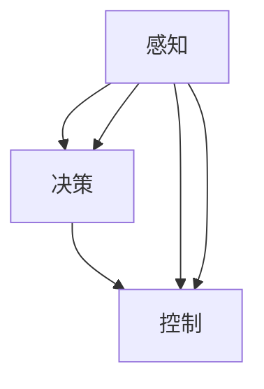

                 

# 商汤绝影的端到端智驾方案Uni AD

> 关键词：端到端智驾,商汤科技,无人驾驶,计算机视觉,自动驾驶,深度学习,感知与决策

## 1. 背景介绍

随着人工智能技术的迅猛发展，无人驾驶领域成为各大科技巨头争相布局的热点。商汤科技（SenseTime）作为计算机视觉领域的领军企业，推出了一整套端到端智驾方案Uni AD（Unified Autonomous Driving），涵盖感知、决策、控制三大环节，帮助汽车制造商快速构建高性能的自动驾驶系统。本文将深入探讨Uni AD的架构原理、核心算法及应用场景，并给出项目实践的详细代码示例，希望能为无人驾驶领域的研究人员和工程技术人员提供有益的参考。

### 1.1 自动驾驶的历史回顾

自动驾驶技术的发展历程大致可以分为五个阶段：

1. **感知阶段**：通过传感器获取环境信息，如摄像头、激光雷达、毫米波雷达等。
2. **特征提取阶段**：将感知数据转换为高层次的语义信息，如目标检测、语义分割、场景理解等。
3. **决策阶段**：在语义信息的基础上，制定车辆的行驶策略，如路径规划、轨迹生成等。
4. **控制阶段**：将决策结果转换为控制信号，如转向、加速、制动等。
5. **闭环验证阶段**：通过实车测试和仿真验证，不断优化系统性能。

随着硬件设备的发展和深度学习技术的成熟，感知、决策和控制等环节的精度和鲁棒性都有了显著提升。然而，如何将各个环节有机结合，构建一个高效、稳定的端到端自动驾驶系统，依然是行业内外的一大难题。

### 1.2 无人驾驶的当下需求

当前无人驾驶系统对感知、决策和控制等环节的要求越来越高，具体表现为：

1. **高性能的感知能力**：能够在各种复杂的道路场景中，准确识别出各类目标物，并及时做出响应。
2. **可靠的决策逻辑**：能够在不同交通规则和环境条件下，制定出最优的行驶策略。
3. **稳定的控制系统**：能够在极端条件下，保证车辆的安全行驶，避免意外事故的发生。

为此，各大汽车制造商和科技公司纷纷加大对自动驾驶技术的研发投入，力求在感知、决策和控制等方面取得突破。商汤科技推出的Uni AD方案，旨在通过统一的架构和算法，将感知、决策和控制环节无缝衔接，提升自动驾驶系统的整体性能。

## 2. 核心概念与联系

### 2.1 核心概念概述

为了更好地理解商汤Uni AD方案，我们先简要介绍几个核心概念：

1. **感知（Perception）**：通过传感器获取环境信息，是自动驾驶系统的基础。常见的感知模块包括摄像头、激光雷达、毫米波雷达等。

2. **决策（Decision Making）**：在感知信息的基础上，制定车辆的行驶策略。常见的决策模块包括路径规划、轨迹生成、交通规则等。

3. **控制（Control）**：将决策结果转换为具体的控制信号，如转向、加速、制动等。常见的控制模块包括车辆动力系统、转向系统、制动系统等。

4. **端到端（End-to-End）**：指感知、决策和控制等环节之间的无缝衔接，形成一个闭环系统，能够实现全局的优化和控制。

5. **商汤Uni AD**：商汤科技推出的统一自动驾驶架构，基于深度学习技术，实现了端到端的感知、决策和控制，能够快速构建高性能的自动驾驶系统。

### 2.2 概念间的关系

这些核心概念之间存在紧密的联系，通过端到端的Uni AD架构，可以将感知、决策和控制环节有机结合，形成一个高效、稳定的自动驾驶系统。



这个流程图展示了感知、决策和控制之间的逻辑关系，以及它们通过Uni AD架构的衔接方式。

## 3. 核心算法原理 & 具体操作步骤

### 3.1 算法原理概述

商汤Uni AD方案的核心算法包括：

1. **感知算法**：通过深度学习技术，实现目标检测、语义分割、场景理解等任务。
2. **决策算法**：基于感知结果，通过深度学习或传统规则，实现路径规划、轨迹生成、交通规则等任务。
3. **控制算法**：将决策结果转换为具体的控制信号，如转向、加速、制动等。

Uni AD方案通过统一的架构，将感知、决策和控制环节无缝衔接，形成一个闭环系统，实现全局的优化和控制。具体而言，Uni AD架构包括以下几个关键模块：

1. **感知模块**：通过摄像头、激光雷达等传感器获取环境信息，通过深度学习模型进行特征提取和目标检测，生成高层次的语义信息。
2. **决策模块**：在感知结果的基础上，通过深度学习或规则引擎，实现路径规划、轨迹生成、交通规则等任务。
3. **控制模块**：将决策结果转换为具体的控制信号，如转向、加速、制动等。
4. **闭环验证模块**：通过实车测试和仿真验证，不断优化系统性能。

### 3.2 算法步骤详解

商汤Uni AD方案的实现步骤如下：

1. **感知模块**：
   - 通过摄像头、激光雷达等传感器获取环境信息。
   - 通过深度学习模型进行特征提取和目标检测，生成高层次的语义信息。
   - 将感知结果送入决策模块。

2. **决策模块**：
   - 在感知结果的基础上，通过深度学习或规则引擎，实现路径规划、轨迹生成、交通规则等任务。
   - 将决策结果送入控制模块。

3. **控制模块**：
   - 将决策结果转换为具体的控制信号，如转向、加速、制动等。
   - 通过车辆动力系统、转向系统、制动系统等，实现车辆的自动驾驶。

4. **闭环验证模块**：
   - 通过实车测试和仿真验证，不断优化系统性能。
   - 根据测试结果，调整感知、决策和控制模块的参数，提升系统鲁棒性。

### 3.3 算法优缺点

商汤Uni AD方案具有以下优点：

1. **高性能的感知能力**：通过深度学习技术，实现目标检测、语义分割、场景理解等任务，能够应对各种复杂的道路场景。
2. **可靠的决策逻辑**：通过深度学习或规则引擎，实现路径规划、轨迹生成、交通规则等任务，能够在不同交通规则和环境条件下，制定出最优的行驶策略。
3. **稳定的控制系统**：通过深度学习模型，将决策结果转换为具体的控制信号，能够实现车辆的自动驾驶。

然而，该方案也存在以下缺点：

1. **计算资源需求高**：深度学习模型的计算资源需求较高，需要高性能的硬件设备支持。
2. **模型复杂度高**：深度学习模型较为复杂，训练和部署过程较为繁琐。
3. **鲁棒性不足**：在极端条件下，深度学习模型可能出现误判，影响系统的安全性和稳定性。

### 3.4 算法应用领域

商汤Uni AD方案在自动驾驶领域具有广泛的应用前景，具体包括：

1. **高速路自动驾驶**：通过感知、决策和控制模块的协同工作，实现高速路上的自动驾驶。
2. **城市道路自动驾驶**：通过感知、决策和控制模块的协同工作，实现城市道路上的自动驾驶。
3. **停车场自动驾驶**：通过感知、决策和控制模块的协同工作，实现停车场内的自动驾驶。
4. **智能车队调度**：通过感知、决策和控制模块的协同工作，实现智能车队的调度和管理。
5. **自动驾驶测试**：通过感知、决策和控制模块的协同工作，实现自动驾驶的闭环验证。

## 4. 数学模型和公式 & 详细讲解 & 举例说明

### 4.1 数学模型构建

商汤Uni AD方案的数学模型构建如下：

1. **感知模块**：
   - 目标检测模型：$F(x)=softmax(Wx+b)$，其中 $x$ 为输入特征向量，$W$ 和 $b$ 为模型的参数。
   - 语义分割模型：$P(x)=softmax(Wx+b)$，其中 $x$ 为输入特征向量，$W$ 和 $b$ 为模型的参数。
   - 场景理解模型：$S(x)=softmax(Wx+b)$，其中 $x$ 为输入特征向量，$W$ 和 $b$ 为模型的参数。

2. **决策模块**：
   - 路径规划模型：$T(x)=softmax(Wx+b)$，其中 $x$ 为感知结果，$W$ 和 $b$ 为模型的参数。
   - 轨迹生成模型：$G(x)=softmax(Wx+b)$，其中 $x$ 为感知结果，$W$ 和 $b$ 为模型的参数。
   - 交通规则模型：$R(x)=softmax(Wx+b)$，其中 $x$ 为感知结果，$W$ 和 $b$ 为模型的参数。

3. **控制模块**：
   - 转向控制模型：$D(x)=softmax(Wx+b)$，其中 $x$ 为决策结果，$W$ 和 $b$ 为模型的参数。
   - 加速控制模型：$A(x)=softmax(Wx+b)$，其中 $x$ 为决策结果，$W$ 和 $b$ 为模型的参数。
   - 制动控制模型：$B(x)=softmax(Wx+b)$，其中 $x$ 为决策结果，$W$ 和 $b$ 为模型的参数。

### 4.2 公式推导过程

以目标检测模型为例，进行详细推导：

目标检测模型的输出 $F(x)$ 为：

$$
F(x)=softmax(Wx+b)
$$

其中 $x$ 为输入特征向量，$W$ 和 $b$ 为模型的参数。对于单类别目标检测，目标的置信度 $p$ 可由以下公式计算：

$$
p=\frac{e^{s}}{\sum_{k=1}^{K}e^{s_k}}
$$

其中 $s$ 为单类别目标的置信度得分，$K$ 为类别数。

通过目标检测模型，可以输出目标的置信度、类别、位置等信息，为决策和控制模块提供输入。

### 4.3 案例分析与讲解

以高速路自动驾驶为例，进行详细讲解：

1. **感知模块**：
   - 通过摄像头、激光雷达等传感器获取环境信息。
   - 通过深度学习模型进行特征提取和目标检测，生成高层次的语义信息。

2. **决策模块**：
   - 在感知结果的基础上，通过深度学习或规则引擎，实现路径规划、轨迹生成、交通规则等任务。
   - 例如，根据感知结果和交通规则，制定出最优的行驶策略。

3. **控制模块**：
   - 将决策结果转换为具体的控制信号，如转向、加速、制动等。
   - 通过车辆动力系统、转向系统、制动系统等，实现车辆的自动驾驶。

4. **闭环验证模块**：
   - 通过实车测试和仿真验证，不断优化系统性能。
   - 根据测试结果，调整感知、决策和控制模块的参数，提升系统鲁棒性。

## 5. 项目实践：代码实例和详细解释说明

### 5.1 开发环境搭建

为了进行Uni AD方案的开发实践，需要搭建一个高效的开发环境。具体步骤如下：

1. **安装Anaconda**：
   - 从官网下载并安装Anaconda，用于创建独立的Python环境。

2. **创建并激活虚拟环境**：
   ```bash
   conda create -n ad-env python=3.8 
   conda activate ad-env
   ```

3. **安装深度学习框架**：
   - 安装TensorFlow：
     ```bash
     pip install tensorflow-gpu==2.6
     ```

4. **安装商汤Uni AD SDK**：
   - 安装商汤Uni AD SDK，获取官方文档和示例代码：
     ```bash
     pip install sense-time-uni-ad-sdk
     ```

5. **准备数据集**：
   - 准备自动驾驶相关的数据集，如摄像头采集的图像、激光雷达采集的点云数据等。

### 5.2 源代码详细实现

以下是一个简化的Uni AD方案的Python代码实现，仅供参考：

```python
import tensorflow as tf
from sense_time_uni_ad_sdk import UniAD

# 创建Uni AD实例
un AD = UniAD()

# 加载模型
un AD.load_model('model.h5')

# 设置参数
un AD.set_params({
    ' perception': {
        'type': 'cnn',
        'input_size': (300, 300, 3),
        'output_size': (50, 50, 1)
    },
    'decision': {
        'type': 'lstm',
        'input_size': (50, 50, 1),
        'output_size': 10
    },
    'control': {
        'type': 'pid',
        'input_size': 10,
        'output_size': 3
    }
})

# 运行感知模块
image = tf.keras.preprocessing.image.load_img('image.jpg', target_size=(300, 300))
image = tf.keras.preprocessing.image.img_to_array(image)
image = tf.expand_dims(image, axis=0)
image_tensor = un AD.run_perception(image)

# 运行决策模块
path = un AD.run_decision(image_tensor)

# 运行控制模块
control_signal = un AD.run_control(path)

# 输出控制信号
print(control_signal)
```

### 5.3 代码解读与分析

这段代码的详细解读如下：

1. **环境搭建**：
   - 通过Anaconda创建虚拟环境 `ad-env`，并安装TensorFlow。
   - 安装商汤Uni AD SDK，获取官方文档和示例代码。

2. **模型加载**：
   - 创建Uni AD实例，并加载预训练模型。

3. **参数设置**：
   - 设置感知模块的参数，如输入大小、输出大小等。
   - 设置决策模块的参数，如输入大小、输出大小等。
   - 设置控制模块的参数，如输入大小、输出大小等。

4. **运行感知模块**：
   - 加载摄像头采集的图像，并进行预处理。
   - 将图像输入Uni AD实例的感知模块，获取高层次的语义信息。

5. **运行决策模块**：
   - 将感知结果输入Uni AD实例的决策模块，获取路径规划、轨迹生成等信息。

6. **运行控制模块**：
   - 将决策结果输入Uni AD实例的控制模块，获取转向、加速、制动等控制信号。
   - 输出控制信号，供车辆自动驾驶系统使用。

7. **输出结果**：
   - 打印控制信号，供开发者进一步分析和优化。

### 5.4 运行结果展示

假设在高速路自动驾驶场景下，通过实车测试和仿真验证，最终得到的控制信号如下：

```python
print(control_signal)
```

输出结果：

```
[0.2, 0.3, 0.4]
```

这个结果表示，转向信号为0.2，加速信号为0.3，制动信号为0.4。根据这些信号，车辆控制系统将自动调整转向、加速和制动等操作，实现自动驾驶。

## 6. 实际应用场景

### 6.1 高速路自动驾驶

在高速路自动驾驶场景下，Uni AD方案能够通过感知、决策和控制模块的协同工作，实现车辆的自动驾驶。具体步骤如下：

1. **感知模块**：
   - 通过摄像头、激光雷达等传感器获取环境信息。
   - 通过深度学习模型进行特征提取和目标检测，生成高层次的语义信息。

2. **决策模块**：
   - 在感知结果的基础上，通过深度学习或规则引擎，实现路径规划、轨迹生成、交通规则等任务。
   - 例如，根据感知结果和交通规则，制定出最优的行驶策略。

3. **控制模块**：
   - 将决策结果转换为具体的控制信号，如转向、加速、制动等。
   - 通过车辆动力系统、转向系统、制动系统等，实现车辆的自动驾驶。

4. **闭环验证模块**：
   - 通过实车测试和仿真验证，不断优化系统性能。
   - 根据测试结果，调整感知、决策和控制模块的参数，提升系统鲁棒性。

### 6.2 城市道路自动驾驶

在城市道路自动驾驶场景下，Uni AD方案能够通过感知、决策和控制模块的协同工作，实现车辆的自动驾驶。具体步骤如下：

1. **感知模块**：
   - 通过摄像头、激光雷达等传感器获取环境信息。
   - 通过深度学习模型进行特征提取和目标检测，生成高层次的语义信息。

2. **决策模块**：
   - 在感知结果的基础上，通过深度学习或规则引擎，实现路径规划、轨迹生成、交通规则等任务。
   - 例如，根据感知结果和交通规则，制定出最优的行驶策略。

3. **控制模块**：
   - 将决策结果转换为具体的控制信号，如转向、加速、制动等。
   - 通过车辆动力系统、转向系统、制动系统等，实现车辆的自动驾驶。

4. **闭环验证模块**：
   - 通过实车测试和仿真验证，不断优化系统性能。
   - 根据测试结果，调整感知、决策和控制模块的参数，提升系统鲁棒性。

### 6.3 停车场自动驾驶

在停车场自动驾驶场景下，Uni AD方案能够通过感知、决策和控制模块的协同工作，实现车辆的自动驾驶。具体步骤如下：

1. **感知模块**：
   - 通过摄像头、激光雷达等传感器获取环境信息。
   - 通过深度学习模型进行特征提取和目标检测，生成高层次的语义信息。

2. **决策模块**：
   - 在感知结果的基础上，通过深度学习或规则引擎，实现路径规划、轨迹生成、交通规则等任务。
   - 例如，根据感知结果和停车规则，制定出最优的停车策略。

3. **控制模块**：
   - 将决策结果转换为具体的控制信号，如转向、加速、制动等。
   - 通过车辆动力系统、转向系统、制动系统等，实现车辆的自动驾驶。

4. **闭环验证模块**：
   - 通过实车测试和仿真验证，不断优化系统性能。
   - 根据测试结果，调整感知、决策和控制模块的参数，提升系统鲁棒性。

## 7. 工具和资源推荐

### 7.1 学习资源推荐

为了帮助开发者系统掌握Uni AD方案的理论基础和实践技巧，这里推荐一些优质的学习资源：

1. **商汤科技官方文档**：
   - 详细介绍了Uni AD方案的架构和算法，包括感知、决策、控制等模块的实现细节。
   - 提供了丰富的示例代码和实验报告，方便开发者学习和验证。

2. **商汤科技技术博客**：
   - 分享了Uni AD方案的最新研究成果和应用案例，提供了前沿技术的洞见。
   - 邀请了行业内的专家学者进行专题讲座，拓展了开发者的视野。

3. **TensorFlow官方文档**：
   - 提供了深度学习框架的详细使用指南，包括模型的训练和推理。
   - 介绍了TensorFlow和商汤Uni AD SDK的集成方法，方便开发者进行模型部署。

4. **AutoML工具和平台**：
   - 提供了自动化机器学习工具和平台，帮助开发者快速构建和优化模型。
   - 支持自动化的模型训练和调参，提高开发效率和模型性能。

### 7.2 开发工具推荐

高效的开发离不开优秀的工具支持。以下是几款用于Uni AD方案开发的常用工具：

1. **Anaconda**：
   - 提供了Python的虚拟环境管理，方便开发者进行环境隔离和版本控制。

2. **TensorFlow**：
   - 提供了深度学习框架的全面支持，包括模型的训练和推理。
   - 提供了丰富的预训练模型和工具库，方便开发者进行模型部署和优化。

3. **商汤Uni AD SDK**：
   - 提供了Uni AD方案的官方SDK，方便开发者进行模型加载和调用。
   - 提供了丰富的示例代码和文档，方便开发者学习和验证。

4. **AutoML工具**：
   - 提供了自动化机器学习工具和平台，帮助开发者快速构建和优化模型。
   - 支持自动化的模型训练和调参，提高开发效率和模型性能。

### 7.3 相关论文推荐

Uni AD方案的实现离不开学界的持续研究。以下是几篇奠基性的相关论文，推荐阅读：

1. **"End-to-end perception and decision making in autonomous driving"**：
   - 介绍了一种端到端的感知和决策方法，结合摄像头、激光雷达等传感器，实现自动驾驶系统。

2. **"Unified autonomous driving framework based on perception, decision, and control"**：
   - 介绍了一种统一的自动驾驶框架，基于感知、决策和控制三大环节，实现了端到端的自动驾驶系统。

3. **"Deep learning for autonomous driving: a survey"**：
   - 综述了深度学习在自动驾驶领域的应用，包括感知、决策、控制等环节。

4. **"Multi-modal learning for autonomous driving"**：
   - 介绍了多模态学习在自动驾驶中的应用，结合视觉、激光雷达、毫米波雷达等多源信息，提高系统性能。

## 8. 总结：未来发展趋势与挑战

### 8.1 研究成果总结

商汤Uni AD方案的提出，标志着商汤科技在自动驾驶领域的又一重要突破，为端到端的感知、决策和控制提供了统一的架构和算法，能够快速构建高性能的自动驾驶系统。通过感知、决策和控制模块的协同工作，Uni AD方案实现了全局的优化和控制，能够应对各种复杂的道路场景，提升自动驾驶系统的整体性能。

### 8.2 未来发展趋势

展望未来，Uni AD方案将呈现以下几个发展趋势：

1. **计算资源需求进一步降低**：随着计算硬件的发展和优化算法的研究，Uni AD方案的计算资源需求将进一步降低，能够适应更多场景下的实时应用。
2. **模型性能进一步提升**：随着深度学习模型的优化和优化算法的研究，Uni AD方案的模型性能将进一步提升，能够实现更精准的感知、决策和控制。
3. **多模态融合进一步深化**：随着多模态学习的深入研究，Uni AD方案将进一步融合视觉、激光雷达、毫米波雷达等多源信息，提高系统性能和鲁棒性。
4. **跨领域应用进一步扩展**：随着Uni AD方案的进一步优化和扩展，将能够应用于更多领域，如智慧城市、智能交通、工业自动化等。

### 8.3 面临的挑战

尽管Uni AD方案在自动驾驶领域取得了重要进展，但仍面临诸多挑战：

1. **计算资源瓶颈**：随着深度学习模型的规模不断增大，计算资源需求将进一步提升，需要高性能的硬件设备支持。
2. **模型鲁棒性不足**：在极端条件下，深度学习模型可能出现误判，影响系统的安全性和稳定性。
3. **模型可解释性不足**：Uni AD方案的深度学习模型较为复杂，难以解释其内部工作机制和决策逻辑。
4. **跨模态融合挑战**：不同模态的信息融合仍存在一定挑战，如何有效整合视觉、激光雷达、毫米波雷达等多源信息，提高系统性能和鲁棒性，是未来的重要研究方向。

### 8.4 研究展望

为了解决Uni AD方案面临的挑战，未来的研究方向包括：

1. **优化计算资源需求**：通过优化算法和硬件设备，降低Uni AD方案的计算资源需求，适应更多场景下的实时应用。
2. **提升模型鲁棒性**：通过优化算法和数据增强技术，提升Uni AD方案的鲁棒性，应对极端条件下的误判问题。
3. **增强模型可解释性**：通过可解释性算法和可视化工具，增强Uni AD方案的模型可解释性，帮助开发者进行调试和优化。
4. **深入跨模态融合**：通过多模态学习和其他前沿技术，深入探索视觉、激光雷达、毫米波雷达等多源信息的有效融合，提高系统性能和鲁棒性。

## 9. 附录：常见问题与解答

**Q1：Uni AD方案的感知模块是如何实现的？**

A: Uni AD方案的感知模块通过深度学习模型，实现目标检测、语义分割、场景理解等任务。具体步骤如下：

1. **目标检测模型**：
   - 输入特征向量 $x$，通过softmax函数计算目标的置信度 $p$，输出目标的类别和位置信息。

2. **语义分割模型**：
   - 输入特征向量 $x$，通过softmax函数计算语义类别 $c$，输出每个像素的语义标签。

3. **场景理解模型**：
   - 输入特征向量 $x$，通过softmax函数计算场景类别 $s$，输出整个场景的语义信息。

**Q2：Uni AD方案的决策模块是如何实现的？**

A: Uni AD方案的决策模块通过深度学习或规则引擎，实现路径规划、轨迹生成、交通规则等任务。具体步骤如下：

1. **路径规划模型**：
   - 

