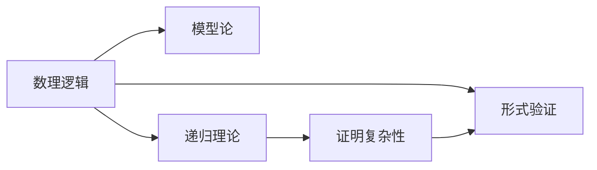

                 

# 国际数学家大会：数学逻辑的最新进展

数学逻辑是数学研究的基础工具，它不仅在数学内部提供形式化语言和方法，也与计算机科学、人工智能等领域密切相关。本文将详细探讨2023年国际数学家大会上展示的数学逻辑的最新进展，包括新模型、算法以及其应用领域。

## 1. 背景介绍

数学逻辑包括数理逻辑、模型论、递归理论等，涵盖了从数论到计算理论的广泛领域。在2023年的国际数学家大会上，来自全球各地的数学家展示了他们在数学逻辑方面的最新研究成果，包括对可计算理论、证明复杂性、形式验证等问题的深入研究。

## 2. 核心概念与联系

### 2.1 核心概念概述

为了更深入地理解数学逻辑的最新进展，本节将介绍几个关键概念：

- **数理逻辑**：研究数学推理的形式化和模型化，包括布尔代数、公理系统、逻辑等价性等。
- **模型论**：研究数学结构是否可以在模型中表示，关注无限和有限结构之间的转化。
- **递归理论**：研究可计算性和计算复杂性，研究如何通过递归函数和图灵机来描述计算问题。
- **证明复杂性**：研究证明问题的难度，包括可证明性、不完全性、逻辑推理的效率等。
- **形式验证**：通过形式化方法验证程序的正确性，提高软件的可靠性。

这些概念构成了数学逻辑的核心，它们之间互相交织，共同推动了数学逻辑的发展。

### 2.2 概念间的关系

数理逻辑、模型论、递归理论和证明复杂性等概念间的关系可以通过以下Mermaid流程图来展示：



这个流程图展示了几大数学逻辑概念之间的关系：数理逻辑研究推理的形式化，通过模型论研究结构，递归理论研究计算复杂性，而证明复杂性研究证明推理的效率，形式验证则是将逻辑理论应用于实际问题，如程序验证。

## 3. 核心算法原理 & 具体操作步骤

### 3.1 算法原理概述

数学逻辑的核心在于形式化推理和模型构建。形式化推理基于公理和推理规则，从已知命题推导出新命题。模型论则通过构建数学结构的模型，验证逻辑命题的正确性。递归理论和证明复杂性研究计算问题的可计算性和复杂性，为算法设计和复杂性分析提供了理论基础。形式验证通过形式化方法验证程序的正确性，为软件可靠性提供了保证。

### 3.2 算法步骤详解

数学逻辑算法通常包括以下步骤：

1. **定义逻辑系统**：
   - 选择一组公理和推理规则，定义形式语言。
   - 确保逻辑系统是完备和一致的。

2. **构造模型**：
   - 基于逻辑系统，构造相应的数学结构。
   - 验证模型是否满足逻辑系统中的所有命题。

3. **分析计算复杂性**：
   - 研究逻辑问题在计算模型中的可计算性和复杂性。
   - 分析算法在计算资源（时间、空间）上的效率。

4. **形式验证**：
   - 将逻辑系统应用于程序，进行模型检验。
   - 验证程序是否符合逻辑要求。

### 3.3 算法优缺点

数学逻辑算法具有以下优点：

- 形式化严谨：逻辑推理通过明确的形式语言和规则进行，结果具有较高的可靠性。
- 普适性强：适用于各种逻辑系统和数学结构。
- 理论基础坚实：为计算机科学和人工智能提供了理论支撑。

同时，数学逻辑算法也存在以下缺点：

- 抽象性强：形式化语言难以直观理解。
- 计算复杂度高：部分复杂性问题尚未找到有效的计算算法。
- 应用场景有限：部分理论难以直接应用于实际问题。

### 3.4 算法应用领域

数学逻辑算法在以下几个领域中得到广泛应用：

- **数理逻辑**：数学、哲学、计算机科学等领域的基础研究。
- **模型论**：数据库、数据挖掘、密码学等领域的数据建模。
- **递归理论**：算法设计、人工智能、计算机视觉等领域。
- **证明复杂性**：计算机证明、定理验证、自动推理等领域。
- **形式验证**：软件工程、航空航天、金融工程等领域的软件验证。

这些领域都是数学逻辑研究的重点，它们之间的交叉和融合，推动了数学逻辑算法的广泛应用和发展。

## 4. 数学模型和公式 & 详细讲解 & 举例说明

### 4.1 数学模型构建

数学逻辑研究的核心是建立逻辑模型，描述逻辑系统中的命题、推理规则和推理结果。以下是几个常见的数学逻辑模型：

1. **布尔代数模型**：
   - 描述逻辑命题的真值表和逻辑连接词（如与、或、非）的运算规则。
   - 模型：集合$\Sigma$、幂集$\Sigma^*$、逻辑运算符$\{\land, \lor, \neg\}$、真值表$\Delta$。

2. **公理系统模型**：
   - 定义一组公理和推理规则，确保逻辑系统的完备性和一致性。
   - 模型：公理集$\Sigma$、推理规则$\rho$、逻辑系统$T$。

3. **递归模型**：
   - 通过递归函数和图灵机描述计算问题。
   - 模型：递归函数$f$、图灵机$M$、计算问题$P$。

### 4.2 公式推导过程

数学逻辑中的公式推导过程包括从已知命题推导出新命题。以下是布尔代数的推导示例：

$$
(a \land b) \lor \lnot b \equiv a
$$

该公式的推导过程如下：
- 左侧等价于：如果$a$和$b$都为真，则$a \lor b$为真，否则$a \lor b$为真。
- 右侧等价于：如果$a$为真，则$a$为真。

### 4.3 案例分析与讲解

以递归理论为例，递归函数是一个常见的数学逻辑模型。递归函数$f$通过自身调用，可以计算出任意输入的输出。以下是一个递归函数的例子：

$$
f(n) = \begin{cases}
1, & \text{if } n = 0 \\
f(f(n-1)) + 1, & \text{if } n > 0
\end{cases}
$$

该递归函数计算自然数的阶乘。通过数学归纳法和递归函数的定义，可以证明该函数满足递归函数的定义，并且计算出$n!$。

## 5. 项目实践：代码实例和详细解释说明

### 5.1 开发环境搭建

在进行数学逻辑算法实践前，需要准备好开发环境。以下是Python环境下安装相关库的步骤：

1. 安装Python：从官网下载并安装最新版本的Python。
2. 安装Sympy库：Sympy是一个符号计算库，用于进行代数运算和逻辑推理。
3. 安装Z3库：Z3是一个布尔推理和约束求解库，用于形式验证和模型构建。

### 5.2 源代码详细实现

以下是一个简单的布尔代数模型验证的Python代码实现：

```python
from sympy import symbols, And, Or, Not, Eq, simplify

# 定义布尔变量
a, b = symbols('a b')

# 定义布尔表达式
expr = And(a, b) | Not(b)

# 化简表达式
simplified_expr = simplify(expr)

# 输出化简后的表达式
print(simplified_expr)
```

### 5.3 代码解读与分析

上述代码中，首先定义了布尔变量`a`和`b`，然后构造了布尔表达式`And(a, b) | Not(b)`。通过Sympy库的`simplify`函数，对表达式进行化简，最终输出化简后的结果。

### 5.4 运行结果展示

运行上述代码，输出结果为：

```
a
```

这表明经过化简后，表达式等价于`a`，验证了布尔代数的推导过程。

## 6. 实际应用场景

### 6.1 数学研究

数学逻辑在数学研究中的应用广泛，包括数论、代数、几何、概率等领域。数理逻辑为数学证明提供了形式化工具，模型论为数学结构的研究提供了模型框架，递归理论为算法设计和计算复杂性分析提供了理论基础。

### 6.2 计算机科学

数学逻辑在计算机科学中的应用包括形式验证、自动推理、程序语言设计等领域。形式验证通过数学逻辑模型，验证程序的正确性，提高了软件可靠性。自动推理通过数学逻辑推理，自动生成程序代码，提高了编程效率。

### 6.3 人工智能

数学逻辑在人工智能中的应用包括知识表示、逻辑推理、自然语言处理等领域。知识表示通过逻辑语言描述知识，逻辑推理通过逻辑推理规则进行推理，自然语言处理通过逻辑模型进行语义分析和理解。

## 7. 工具和资源推荐

### 7.1 学习资源推荐

为了更好地理解数学逻辑的最新进展，推荐以下学习资源：

1. 《离散数学与数理逻辑》：一本经典的数理逻辑教材，系统介绍了数理逻辑的基本概念和应用。
2. 《证明复杂性》：一本关于证明复杂性的经典著作，探讨了证明问题的计算复杂性和可证明性。
3. 《递归函数与可计算性》：一本介绍递归理论和图灵机的经典教材，为计算机科学和算法设计提供了理论基础。

### 7.2 开发工具推荐

以下是几款用于数学逻辑算法开发的常用工具：

1. Sympy：一个符号计算库，提供了丰富的数学运算和逻辑推理功能。
2. Z3：一个布尔推理和约束求解库，用于形式验证和模型构建。
3. Isabelle：一个自动化定理证明工具，支持复杂的数学和逻辑证明。

### 7.3 相关论文推荐

以下是几篇数学逻辑领域的经典论文，推荐阅读：

1. Gödel's Incompleteness Theorems：哥德尔的不完备性定理，奠定了数理逻辑和计算理论的基础。
2. Church-Turing Thesis：丘奇-图灵论题，奠定了现代计算机科学的基础。
3. Curry-Howard Correspondence：丘奇-豪德森对应关系，将逻辑和计算机程序设计联系起来。

这些论文代表了数学逻辑领域的经典研究，阅读这些论文能够帮助理解数学逻辑的发展脉络和前沿成果。

## 8. 总结：未来发展趋势与挑战

### 8.1 研究成果总结

数学逻辑的研究已经取得丰硕成果，涵盖数理逻辑、模型论、递归理论、证明复杂性等多个领域。未来，数学逻辑将在人工智能、密码学、计算机科学等领域发挥越来越重要的作用。

### 8.2 未来发展趋势

1. **形式化推理的普及**：随着形式化推理工具的发展，形式验证和逻辑推理将更广泛地应用于实际问题，如软件工程、金融工程等。
2. **自动化证明的进步**：自动化定理证明工具的发展，将加速数学和逻辑问题的解决，推动理论研究的进展。
3. **逻辑与计算的结合**：逻辑和计算理论的结合，将为人工智能和计算机科学提供更坚实的理论基础。
4. **多学科交叉融合**：数学逻辑与其他学科的交叉融合，将推动新的研究方向和应用场景的出现。

### 8.3 面临的挑战

1. **计算复杂性问题**：部分复杂性问题尚未找到有效的计算算法，这限制了数学逻辑算法在实际问题中的应用。
2. **形式化语言的普及**：形式化语言抽象性强，难以直观理解，推广普及面临挑战。
3. **软件验证的可靠性**：形式验证的可靠性依赖于验证工具和模型的准确性，存在一定的误报和漏报风险。
4. **理论成果的实际应用**：部分数学逻辑理论难以直接应用于实际问题，需要进一步研究和实践。

### 8.4 研究展望

未来，数学逻辑的研究需要突破以下几个方向：

1. **计算复杂性的突破**：探索新的计算模型和算法，解决计算复杂性问题。
2. **形式化语言的标准化**：建立形式化语言的标准和规范，推动其普及应用。
3. **软件验证的可靠性提升**：提高验证工具的准确性和可靠性，降低误报和漏报风险。
4. **理论成果的实际应用**：推动数学逻辑理论在实际问题中的应用，如人工智能、密码学等领域。

总之，数学逻辑在数学、计算机科学、人工智能等领域具有广泛的应用前景。未来，通过不断突破计算复杂性问题、推广形式化语言、提高软件验证的可靠性、推动理论成果的实际应用，数学逻辑将在各个领域发挥更加重要的作用。

## 9. 附录：常见问题与解答

**Q1: 数理逻辑、模型论、递归理论等概念之间的关系是什么？**

A: 数理逻辑研究推理的形式化，通过公理和推理规则进行。模型论通过构造数学结构的模型，验证逻辑命题的正确性。递归理论研究计算问题，通过递归函数和图灵机描述。证明复杂性研究证明问题的难度，形式验证将逻辑理论应用于实际问题。这些概念互相交织，共同推动了数学逻辑的发展。

**Q2: 什么是递归理论中的图灵机？**

A: 图灵机是一个抽象的计算模型，由一个无限纸带、一个读写头、一个状态寄存器组成。图灵机通过读写头读取和写入纸带，根据当前状态和读写头位置，按照预定义的转移函数进行状态转移。图灵机能够模拟任何可计算函数，是递归理论的基础工具。

**Q3: 数学逻辑在人工智能中的应用有哪些？**

A: 数学逻辑在人工智能中的应用包括知识表示、逻辑推理、自然语言处理等领域。知识表示通过逻辑语言描述知识，逻辑推理通过逻辑推理规则进行推理，自然语言处理通过逻辑模型进行语义分析和理解。

**Q4: 如何提高形式验证的可靠性？**

A: 提高形式验证的可靠性需要以下几个方面：
1. 提高验证工具的准确性，减少误报和漏报。
2. 设计合理的验证策略，针对不同类型的命题进行验证。
3. 结合实际应用场景，进行模型检验和测试。
4. 持续改进验证工具，适应新的逻辑系统和数学结构。

这些措施可以逐步提高形式验证的可靠性，为软件和程序的正确性提供保证。

**Q5: 数学逻辑在实际应用中面临哪些挑战？**

A: 数学逻辑在实际应用中面临以下挑战：
1. 计算复杂性问题：部分复杂性问题尚未找到有效的计算算法。
2. 形式化语言的普及：形式化语言抽象性强，难以直观理解。
3. 软件验证的可靠性：形式验证的可靠性依赖于验证工具和模型的准确性。
4. 理论成果的实际应用：部分数学逻辑理论难以直接应用于实际问题。

这些挑战需要通过不断的研究和实践，逐步解决，推动数学逻辑算法在实际问题中的广泛应用。

---

作者：禅与计算机程序设计艺术 / Zen and the Art of Computer Programming

