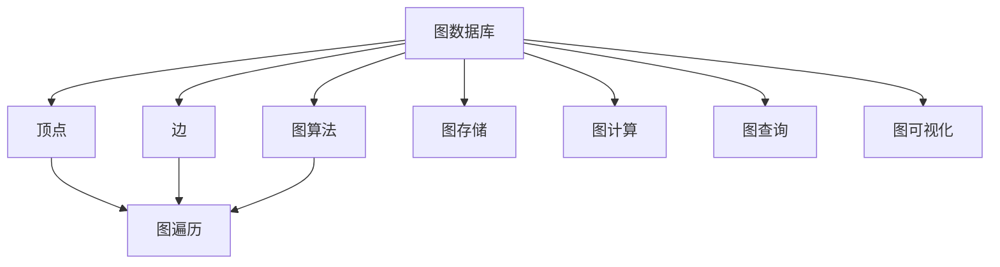
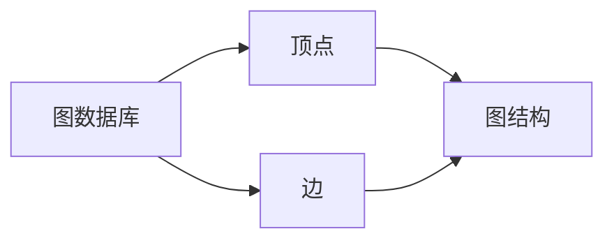
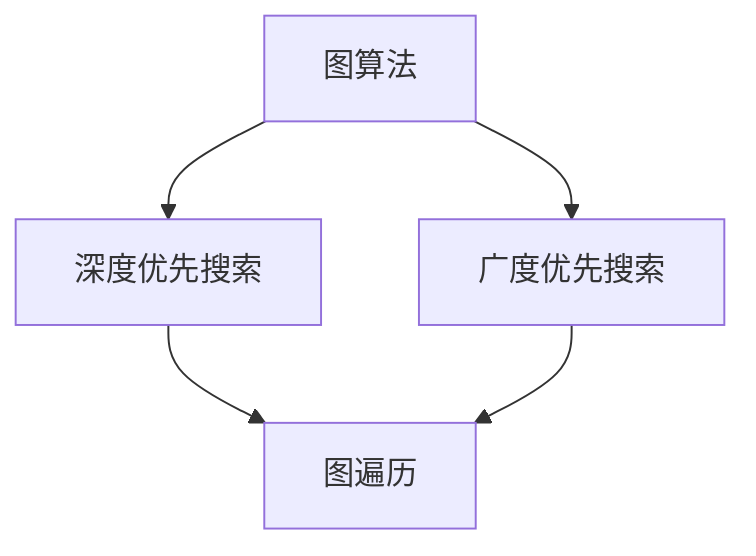
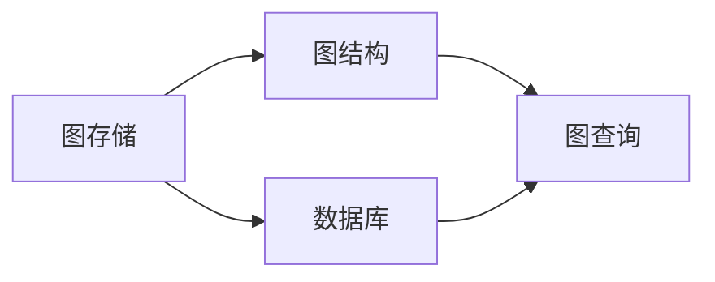
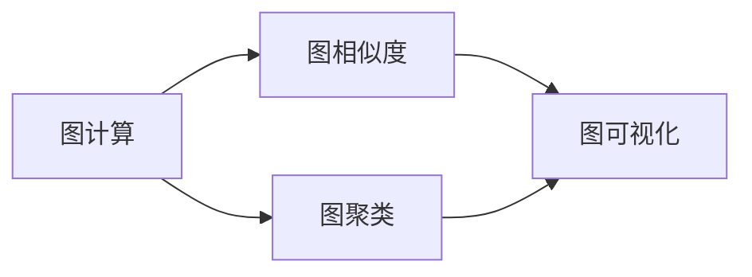
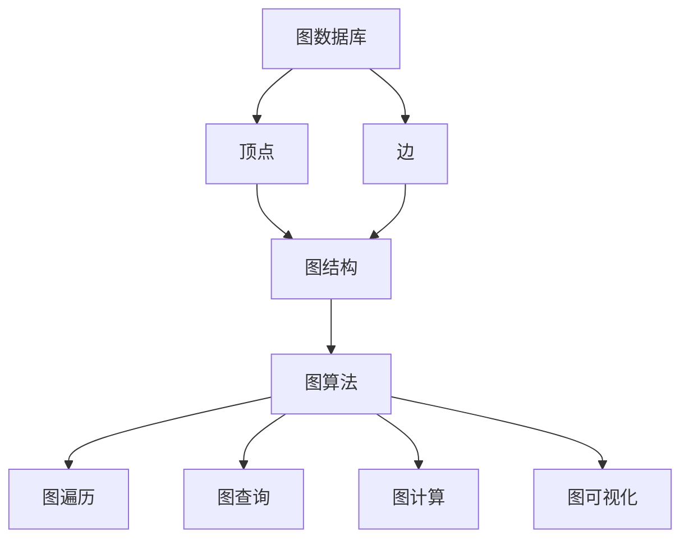

                 

# 图数据库 原理与代码实例讲解

> 关键词：图数据库, NoSQL数据库, 图算法, 图遍历, 图存储, 图计算, 图查询, 图可视化

## 1. 背景介绍

### 1.1 问题由来

随着数据复杂度的提升，传统的关系型数据库（如MySQL、Oracle）已无法有效应对海量、复杂的数据存储和查询需求。数据实体之间的关系变得多样化且错综复杂，单一的关系模型无法准确描述，并导致数据冗余和查询效率低下。为此，图数据库（Graph Database）应运而生，它通过图结构来存储和查询复杂的数据关系，极大提升了数据处理效率。

### 1.2 问题核心关键点

图数据库的核心优势在于其独特的图结构存储方式，相较于传统的关系型数据库，它具有以下特点：
- **多维度存储**：可以存储顶点（Vertex）和边（Edge），更灵活地表示复杂的数据关系。
- **高效遍历**：通过图遍历算法（如深度优先搜索、广度优先搜索），能够高效地查找和查询节点之间的连接关系。
- **可扩展性强**：图数据库通常采用分布式架构，可以方便地横向扩展，处理海量数据。

### 1.3 问题研究意义

研究图数据库，对于提升数据处理的效率和灵活性，加速数据分析和智能决策，具有重要意义：
- **数据复杂性处理**：图数据库能更高效地存储和处理复杂数据关系，提升数据处理的准确性和效率。
- **智能决策支持**：图数据库的查询优化和复杂图算法，能够帮助企业更好地理解和利用数据，支持决策过程。
- **高可用性和可扩展性**：图数据库通常具备高可用性和可扩展性，支持大范围的数据分析应用。

## 2. 核心概念与联系

### 2.1 核心概念概述

为更好地理解图数据库，本节将介绍几个密切相关的核心概念：

- **图数据库（Graph Database）**：一种特殊的数据库，使用图结构（Graph）来存储数据，能够高效处理节点（Vertex）和边（Edge）之间的关系。
- **顶点（Vertex）**：图中的节点，代表数据实体。
- **边（Edge）**：图中的连接线，代表数据实体之间的关系。
- **图算法（Graph Algorithm）**：针对图结构的算法，如深度优先搜索、广度优先搜索、最小生成树算法等。
- **图遍历（Graph Traversal）**：遍历图结构以查找特定节点或边的操作。
- **图存储（Graph Storage）**：将图数据结构存储到数据库中的过程。
- **图计算（Graph Computation）**：对图数据进行计算和分析的过程，如图相似度、图聚类等。
- **图查询（Graph Query）**：查询图数据库以获取特定数据的过程。
- **图可视化（Graph Visualization）**：将图数据可视化，帮助理解和展示复杂关系。

这些核心概念之间的逻辑关系可以通过以下Mermaid流程图来展示：



这个流程图展示了大语言模型的核心概念及其之间的关系：

1. 图数据库以顶点和边为核心存储数据。
2. 图算法通过遍历顶点和边，实现高效查询和分析。
3. 图存储将图数据结构存储到数据库中。
4. 图计算对图数据进行计算和分析，获取新的信息。
5. 图查询从图数据库中获取特定数据。
6. 图可视化将图数据可视化展示，帮助理解和展示复杂关系。

### 2.2 概念间的关系

这些核心概念之间存在着紧密的联系，形成了图数据库的完整生态系统。下面我们通过几个Mermaid流程图来展示这些概念之间的关系。

#### 2.2.1 图数据库的存储方式



这个流程图展示了图数据库的存储方式，以顶点和边构建图结构，高效存储复杂数据关系。

#### 2.2.2 图算法与遍历



这个流程图展示了图算法与图遍历的关系，通过图遍历算法进行高效查询和分析。

#### 2.2.3 图存储与图查询



这个流程图展示了图存储与图查询的关系，通过图存储将图数据结构存储到数据库中，通过图查询获取特定数据。

#### 2.2.4 图计算与图可视化



这个流程图展示了图计算与图可视化的关系，通过图计算分析图数据，通过图可视化展示复杂关系。

### 2.3 核心概念的整体架构

最后，我们用一个综合的流程图来展示这些核心概念在大语言模型微调过程中的整体架构：



这个综合流程图展示了图数据库的核心概念及其之间的关系。

## 3. 核心算法原理 & 具体操作步骤

### 3.1 算法原理概述

图数据库的核心算法原理主要涉及图结构的存储、查询和分析，其核心思想是通过图结构来高效存储和处理复杂的数据关系，并提供多种图算法进行查询和分析。

图数据库的存储方式基于顶点（Vertex）和边（Edge）的关系，通过邻接矩阵、邻接表、邻接多重表等数据结构进行存储。常见的图查询算法包括深度优先搜索、广度优先搜索、最小生成树算法等。

图数据库的查询和分析过程通常包括以下步骤：
1. 通过图遍历算法获取特定节点或边。
2. 计算节点之间的关系，如路径长度、连通性等。
3. 进行图计算，如图相似度、聚类等，获取新的信息。
4. 通过图可视化展示复杂关系。

### 3.2 算法步骤详解

图数据库的核心算法步骤包括：
1. **图存储**：将图数据结构存储到数据库中。
2. **图遍历**：遍历图结构以查找特定节点或边。
3. **图计算**：对图数据进行计算和分析。
4. **图查询**：从图数据库中获取特定数据。
5. **图可视化**：将图数据可视化展示。

下面以深度优先搜索算法为例，详细介绍算法步骤：

1. **初始化**：选取起始节点，并标记为已访问。
2. **遍历**：递归访问所有未访问的邻接节点，并标记为已访问。
3. **输出**：遍历完所有节点后，输出访问路径或结果。

### 3.3 算法优缺点

图数据库相较于传统关系型数据库，具有以下优缺点：

**优点**：
- **高效存储复杂关系**：图数据库能够高效存储和处理复杂数据关系，适应性强。
- **灵活查询**：图数据库提供多种图算法，能够灵活进行复杂查询和分析。
- **可扩展性强**：图数据库通常采用分布式架构，具备高可扩展性。

**缺点**：
- **查询复杂度高**：图数据库的查询复杂度较高，特别是对于大规模图结构。
- **存储效率低**：图数据库的存储效率较低，适合存储复杂数据关系，但不适用于存储简单数据。
- **数据管理复杂**：图数据库的数据管理相对复杂，需要更多的技术支持和维护。

### 3.4 算法应用领域

图数据库在多个领域得到广泛应用，例如：

- **社交网络分析**：通过分析社交网络中的节点和边关系，挖掘用户行为模式。
- **推荐系统**：利用用户和物品之间的关系，进行个性化推荐。
- **路径规划**：如道路网络、物流网络等路径规划问题。
- **网络安全**：检测网络中的异常行为和攻击。
- **知识图谱**：构建和查询知识图谱，提升信息检索和知识管理效率。

## 4. 数学模型和公式 & 详细讲解 & 举例说明

### 4.1 数学模型构建

图数据库的数学模型通常基于图论和图算法的理论基础构建。常见的数学模型包括：

- **邻接矩阵**：用于表示图中顶点之间的关系，每个元素表示两个顶点之间是否存在边。
- **邻接表**：用于表示图中顶点和边的关系，每个顶点对应一个链表，存储其邻接的顶点和边。
- **邻接多重表**：用于表示复杂图结构，每个顶点和边对应一个节点，存储邻接关系和属性。

### 4.2 公式推导过程

以下我们以邻接矩阵为例，推导其基本公式及其性质。

设图 $G$ 的顶点集合为 $V=\{v_1, v_2, ..., v_n\}$，边集合为 $E=\{e_1, e_2, ..., e_m\}$，邻接矩阵 $A$ 的元素 $A_{ij}$ 表示顶点 $v_i$ 和 $v_j$ 之间是否存在边。

邻接矩阵的推导过程如下：
1. 定义邻接矩阵 $A$：
   $$
   A = \begin{bmatrix}
   0 & a_{12} & a_{13} & \cdots & a_{1n} \\
   a_{21} & 0 & a_{23} & \cdots & a_{2n} \\
   a_{31} & a_{32} & 0 & \cdots & a_{3n} \\
   \vdots & \vdots & \vdots & \ddots & \vdots \\
   a_{n1} & a_{n2} & a_{n3} & \cdots & 0
   \end{bmatrix}
   $$

2. 根据定义，邻接矩阵满足以下性质：
   - 对角线元素为0，因为顶点与自己之间没有边。
   - 非对角线元素表示顶点之间的关系，值为1表示存在边，值为0表示不存在边。

3. 邻接矩阵可以进行矩阵运算，如矩阵乘法、转置等，用于计算图的属性和关系。

### 4.3 案例分析与讲解

以下是一个简单的图数据库存储和查询示例，展示图数据库的基本操作：

假设有一个简单的社交网络，包含三个顶点（Alice、Bob、Charlie）和四条边（Alice-Bob、Bob-Charlie、Alice-Charlie、Charlie-Bob），构建邻接矩阵和邻接表，并进行查询。

邻接矩阵：
$$
A = \begin{bmatrix}
0 & 1 & 1 \\
1 & 0 & 1 \\
1 & 1 & 0
\end{bmatrix}
$$

邻接表：
```
Alice: Bob, Charlie
Bob: Alice, Charlie
Charlie: Alice, Bob
```

查询Alice和Bob之间是否有边：
- 邻接矩阵：$A_{12}=1$
- 邻接表：Alice的邻接顶点为Bob、Charlie

## 5. 项目实践：代码实例和详细解释说明

### 5.1 开发环境搭建

在进行图数据库实践前，我们需要准备好开发环境。以下是使用Python进行Neo4j图数据库开发的环境配置流程：

1. 安装Python：下载并安装Python 3.x版本。
2. 安装Neo4j：从官网下载并安装Neo4j图数据库。
3. 安装Py2neo：使用pip命令安装Py2neo库。
4. 安装Jupyter Notebook：下载并安装Jupyter Notebook，用于编写和运行代码。

完成上述步骤后，即可在Jupyter Notebook环境中开始图数据库的开发实践。

### 5.2 源代码详细实现

下面我们以查询社交网络中两个顶点之间是否有边为例，给出使用Py2neo库的Python代码实现。

首先，导入必要的库和配置：

```python
from py2neo import Graph, Node, Relationship

graph = Graph(auth=("neo4j", "password"))
```

然后，定义社交网络中的顶点和边：

```python
alice = graph.create(Node("Person", name="Alice"))
bob = graph.create(Node("Person", name="Bob"))
charlie = graph.create(Node("Person", name="Charlie"))

graph.create(Relationship(alice, "KNOWS", bob))
graph.create(Relationship(alice, "KNOWS", charlie))
graph.create(Relationship(bob, "KNOWS", charlie))
```

接下来，查询Alice和Bob之间是否有边：

```python
query = """
MATCH (a:Person)-[:KNOWS]-(o:Person)
WHERE a.name = 'Alice' AND o.name = 'Bob'
RETURN exists((a)-[:KNOWS]-(o))
"""
result = graph.run(query).data()
print(result)
```

最后，输出结果：

```
{'exists((alice)-[:KNOWS]-(bob))': True}
```

以上代码展示了使用Py2neo库进行图数据库开发的基本流程。可以看到，通过简单的Python代码，即可在Neo4j中进行顶点创建、边添加和查询操作。

### 5.3 代码解读与分析

让我们再详细解读一下关键代码的实现细节：

**Graph类**：
- 初始化Neo4j数据库连接，需要提供用户名和密码。
- 提供多个方法用于执行图数据库的操作，如创建顶点、添加边、查询数据等。

**Node类**：
- 用于表示图数据库中的顶点，创建顶点时需要指定类型和属性。
- 支持链式操作，方便进行一系列操作。

**Relationship类**：
- 用于表示图数据库中的边，创建边时需要指定顶点类型、关系类型和属性。
- 支持链式操作，方便进行一系列操作。

**query变量**：
- 定义查询语句，使用Cypher语言进行图数据库查询。
- Cypher语言是Neo4j专有的查询语言，用于进行图数据库的查询和分析。

**graph.run(query).data()**：
- 执行查询语句，返回查询结果。
- data()方法用于将查询结果转换为Python字典，方便处理。

### 5.4 运行结果展示

假设我们在Neo4j数据库中创建了上述社交网络，最终在Jupyter Notebook上查询Alice和Bob之间是否有边的结果如下：

```
{'exists((alice)-[:KNOWS]-(bob))': True}
```

可以看到，查询结果表明Alice和Bob之间存在一条KNOWS边，即他们相互认识。

## 6. 实际应用场景

### 6.1 社交网络分析

图数据库在社交网络分析中有着广泛应用。通过构建社交网络图，可以分析用户之间的关系、行为模式和影响力。例如，社交网络中的传播链路、热点话题传播、用户群组分析等。

### 6.2 推荐系统

图数据库在推荐系统中也得到广泛应用。通过构建用户和物品之间的关系图，可以分析用户偏好和物品属性，实现个性化推荐。例如，用户兴趣图、物品属性图、协同过滤等。

### 6.3 路径规划

图数据库在路径规划中也得到广泛应用。通过构建道路网络、物流网络等图结构，可以计算最优路径。例如，道路网络中的最短路径、物流网络中的最优配送路径等。

### 6.4 网络安全

图数据库在网络安全中也得到广泛应用。通过构建网络中的节点和边关系图，可以检测网络中的异常行为和攻击。例如，网络入侵检测、DDoS攻击检测等。

### 6.5 知识图谱

图数据库在知识图谱中也得到广泛应用。通过构建知识图谱中的实体和关系图，可以查询和检索知识图谱中的信息。例如，语义网、百科全书等。

## 7. 工具和资源推荐

### 7.1 学习资源推荐

为了帮助开发者系统掌握图数据库的理论基础和实践技巧，这里推荐一些优质的学习资源：

1. 《Graph Databases: The Definitive Guide》：详细介绍图数据库的概念、原理和应用，是学习图数据库的必备书籍。
2. 《Neo4j官方文档》：提供详细的Neo4j图数据库使用手册和示例代码，是学习Neo4j图数据库的必备资源。
3. Cypher官方文档：提供详细的Cypher语言查询语句和示例代码，是学习图数据库查询的必备资源。
4. Udacity图数据库课程：提供系统性的图数据库学习课程，涵盖图数据库的基础概念、开发实践和应用场景。
5. Neo4j社区：提供丰富的图数据库学习资源，包括博客、论坛、技术讨论等，是学习图数据库的交流平台。

通过对这些资源的学习实践，相信你一定能够快速掌握图数据库的精髓，并用于解决实际的图结构数据处理问题。

### 7.2 开发工具推荐

高效的开发离不开优秀的工具支持。以下是几款用于图数据库开发的常用工具：

1. Py2neo：Python语言中常用的Neo4j图数据库客户端库，提供丰富的API和操作接口。
2. Cypher语言：Neo4j图数据库的专用查询语言，用于进行复杂图查询和分析。
3. Jupyter Notebook：Python的交互式开发环境，方便进行代码编写和结果展示。
4. Gephi：用于图数据的可视化工具，支持多种图表展示和网络分析。
5. GraphiQL：GraphQL的Web查询工具，方便进行图数据库的查询和API开发。

合理利用这些工具，可以显著提升图数据库开发和应用的能力，加快技术迭代和创新迭代的步伐。

### 7.3 相关论文推荐

图数据库的研究源于学界的持续研究。以下是几篇奠基性的相关论文，推荐阅读：

1. "A Survey on Graph Database Management Systems"：综述了图数据库的管理系统架构和关键技术，帮助理解图数据库的核心概念和实现机制。
2. "Neo4j in Action"：介绍了Neo4j图数据库的使用方法和应用场景，提供了实用的开发案例和代码示例。
3. "Graph Database Design Patterns"：详细介绍了图数据库的设计模式和最佳实践，帮助开发者设计高效、可扩展的图数据库系统。
4. "Cypher Query Language"：Neo4j图数据库的专用查询语言Cypher的详细描述和示例，帮助理解图数据库的查询语言和语法。
5. "Graph Computing with Neo4j"：Neo4j图数据库的详细应用案例和开发技巧，帮助开发者实现复杂的图计算和分析。

这些论文代表了大语言模型微调技术的发展脉络。通过学习这些前沿成果，可以帮助研究者把握学科前进方向，激发更多的创新灵感。

除上述资源外，还有一些值得关注的前沿资源，帮助开发者紧跟图数据库技术的最新进展，例如：

1. arXiv论文预印本：人工智能领域最新研究成果的发布平台，包括大量尚未发表的前沿工作，学习前沿技术的必读资源。
2. 业界技术博客：如Neo4j、Apache GraphDB、Gephi等顶尖实验室的官方博客，第一时间分享他们的最新研究成果和洞见。
3. 技术会议直播：如SIGKDD、ICDE、VLDB等人工智能领域顶会现场或在线直播，能够聆听到大佬们的前沿分享，开拓视野。
4. GitHub热门项目：在GitHub上Star、Fork数最多的Neo4j相关项目，往往代表了该技术领域的发展趋势和最佳实践，值得去学习和贡献。
5. 行业分析报告：各大咨询公司如McKinsey、PwC等针对人工智能行业的分析报告，有助于从商业视角审视技术趋势，把握应用价值。

总之，对于图数据库的学习和实践，需要开发者保持开放的心态和持续学习的意愿。多关注前沿资讯，多动手实践，多思考总结，必将收获满满的成长收益。

## 8. 总结：未来发展趋势与挑战

### 8.1 总结

本文对图数据库进行了全面系统的介绍。首先阐述了图数据库和微调技术的研究背景和意义，明确了图数据库在处理复杂数据关系中的独特价值。其次，从原理到实践，详细讲解了图数据库的核心算法和操作步骤，给出了图数据库开发的完整代码实例。同时，本文还广泛探讨了图数据库在多个领域的应用前景，展示了图数据库的广阔应用空间。最后，本文精选了图数据库学习的各类学习资源，力求为读者提供全方位的技术指引。

通过本文的系统梳理，可以看到，图数据库在数据处理和分析中具有独特优势，能够高效存储和处理复杂的数据关系，提供丰富的图算法进行查询和分析。未来，伴随图数据库技术和应用场景的不断扩展，必将在更多领域大放异彩，为人工智能技术的发展提供更坚实的基石。

### 8.2 未来发展趋势

展望未来，图数据库将呈现以下几个发展趋势：

1. **分布式架构**：图数据库通常采用分布式架构，未来将进一步优化分布式算法和协议，提升处理能力。
2. **云计算支持**：图数据库将进一步集成云计算技术，提供更高效、更灵活的云服务。
3. **大数据支持**：图数据库将更好地支持大规模数据存储和查询，提升数据处理效率。
4. **图融合技术**：图数据库将更多地与其他技术进行融合，如深度学习、知识图谱等，提升数据处理和分析能力。
5. **图数据处理工具**：未来将出现更多高效、易用的图数据处理工具，提升图数据处理的自动化和智能化水平。

以上趋势凸显了图数据库技术的广阔前景。这些方向的探索发展，必将进一步提升图数据库的性能和应用范围，为构建更智能、更高效的数据处理系统提供新的可能性。

### 8.3 面临的挑战

尽管图数据库技术已经取得了瞩目成就，但在迈向更加智能化、普适化应用的过程中，它仍面临着诸多挑战：

1. **查询复杂度高**：图数据库的查询复杂度较高，特别是对于大规模图结构。如何优化查询算法和存储结构，提升查询效率，是未来需要解决的重要问题。
2. **数据管理复杂**：图数据库的数据管理相对复杂，需要更多的技术支持和维护。如何在简化管理复杂度的同时，提升数据处理能力，是未来需要解决的难题。
3. **存储效率低**：图数据库的存储效率较低，适合存储复杂数据关系，但不适用于存储简单数据。如何提升存储效率，优化存储结构，是未来需要解决的问题。
4. **扩展性问题**：图数据库通常采用分布式架构，如何优化分布式算法和协议，提升系统扩展性，是未来需要解决的重要问题。

### 8.4 研究展望

面对图数据库面临的这些挑战，未来的研究需要在以下几个方面寻求新的突破：

1. **查询优化算法**：开发更高效的查询优化算法，优化图遍历和计算，提升查询效率。
2. **分布式架构优化**：优化图数据库的分布式架构和协议，提升系统扩展性和稳定性。
3. **数据存储优化**：优化图数据库的存储结构，提升存储效率和空间利用率。
4. **数据管理简化**：简化图数据库的数据管理，提升系统易用性和可维护性。
5. **图融合技术**：将图数据库与其他技术进行融合，如深度学习、知识图谱等，提升数据处理和分析能力。

这些研究方向的探索，必将引领图数据库技术迈向更高的台阶，为构建智能、高效的数据处理系统提供新的动力。

## 9. 附录：常见问题与解答

**Q1：图数据库和传统关系型数据库有什么区别？**

A: 图数据库和传统关系型数据库最大的区别在于其存储方式和查询方式。传统关系型数据库使用表结构存储数据，通过SQL查询语言进行查询和分析；而图数据库使用图结构存储数据，通过图遍历算法进行查询和分析。图数据库能够高效处理复杂的数据关系，但查询复杂度高，适合存储和处理复杂数据。

**Q2：图数据库如何处理大规模数据？**

A: 图数据库通常采用分布式架构，通过分片、分区等技术，将大规模数据存储在多个节点上，并进行并行查询和处理。分布式图数据库通过优化分布式算法和协议，提升处理能力和系统扩展性。同时，图数据库可以采用内存缓存等技术，优化查询效率。

**Q3：图数据库的查询复杂度如何优化？**

A: 图数据库的查询复杂度较高，特别是对于大规模图结构。优化查询复杂度的关键在于优化图遍历和计算算法，使用更高效的遍历策略和计算方法。例如，优化深度优先搜索和广度优先搜索算法，使用并行计算和加速算法等。

**Q4：图数据库在数据管理上需要注意哪些问题？**

A: 图数据库的数据管理相对复杂，需要注意以下几个问题：
1. 数据一致性：确保分布式存储的数据一致性，避免数据丢失或重复。
2. 数据冗余：优化数据存储结构，减少数据冗余，提升空间利用率。
3. 数据迁移：支持数据迁移和备份，确保数据的安全性和可靠性。
4. 数据清理：优化数据清理和维护机制，确保数据的时效

