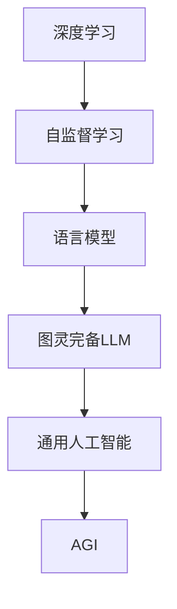
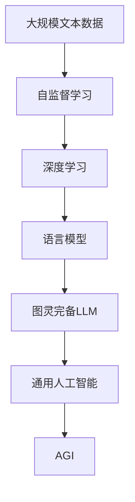

                 

# 图灵完备LLM:通向AGI的关键一步

> 关键词：图灵完备, 大型语言模型(LLM), 通用人工智能(AGI), 深度学习, 自监督学习, 语言模型

## 1. 背景介绍

### 1.1 问题由来

随着深度学习技术的发展，大语言模型（Large Language Models, LLMs）在自然语言处理（NLP）领域取得了重大突破。这些模型通过在大规模无标签文本数据上进行自监督预训练，学习到了丰富的语言知识和常识。但预训练模型常常需要大量标注数据才能在特定任务上取得优异性能，因此通用性大模型在特定领域的应用效果有限。

为解决这一问题，研究者们提出了图灵完备性（Turing completeness）概念，即一个模型如果能够执行任何可以由计算机执行的任务，那么它就是图灵完备的。在AI领域，这意味着模型应该能够处理任何NLP任务，而不需要针对特定任务进行微调。图灵完备性是大模型追求的目标之一，也是通向通用人工智能（AGI）的重要一步。

### 1.2 问题核心关键点

图灵完备性是衡量一个模型在特定任务上执行能力的重要指标。若一个LLM具有图灵完备性，它能够在不需要额外训练的情况下，执行各种NLP任务。这不仅减少了训练标注数据的依赖，也提高了模型的通用性和可扩展性。

要实现图灵完备性，LLM需要：
1. 丰富的语言知识：能够理解自然语言的语义和语法。
2. 高效的推理能力：能够逻辑推断和迁移学习，适应新任务。
3. 泛化能力：能够处理不同领域的文本，避免过拟合。
4. 鲁棒性：能够应对各种数据和噪声，稳定输出。

本文将重点讨论如何通过深度学习技术和自监督学习，构建图灵完备的LLM，并探索其实际应用场景和未来发展趋势。

## 2. 核心概念与联系

### 2.1 核心概念概述

为更好地理解图灵完备LLM，本节将介绍几个关键概念：

- 深度学习（Deep Learning）：一种通过多层神经网络学习数据表示的机器学习方法。深度学习在图像识别、语音识别、自然语言处理等诸多领域表现出色。
- 自监督学习（Supervised Learning）：利用未标注数据训练模型，使得模型能够自动学习数据的隐含特征。自监督学习在大规模数据集上取得了优异效果。
- 语言模型（Language Model）：一种用于描述文本序列概率分布的模型，用于预测下一个单词或字符的概率。
- 图灵完备性（Turing completeness）：一个模型如果能够执行任何可以由计算机执行的任务，则称其为图灵完备的。在AI领域，图灵完备性意味着模型能够处理任何NLP任务。
- 通用人工智能（AGI）：指一种能够执行任何智力任务的人工智能系统，包括推理、规划、学习和自我修复等能力。

这些核心概念之间的逻辑关系可以通过以下Mermaid流程图来展示：



这个流程图展示了大语言模型的核心概念及其之间的关系：

1. 深度学习利用多层神经网络进行特征提取和表示学习。
2. 自监督学习在大规模数据上训练语言模型，学习语言的统计规律。
3. 语言模型用于描述文本序列的概率分布，能够进行预测和生成。
4. 图灵完备的LLM通过预训练学习到丰富的语言知识，具备广泛的任务执行能力。
5. AGI是一个具备图灵完备性的AI系统，具备通用性的智能推理和决策能力。

### 2.2 概念间的关系

这些核心概念之间存在着紧密的联系，形成了图灵完备LLM的完整生态系统。下面我们通过几个Mermaid流程图来展示这些概念之间的关系。

#### 2.2.1 深度学习的应用


这个流程图展示了深度学习技术在大语言模型中的应用。深度学习通过神经网络进行特征提取，多模态学习引入不同类型的数据，最终通过语言模型构建图灵完备的LLM。

#### 2.2.2 自监督学习与深度学习的关系


这个流程图展示了自监督学习在大规模数据上训练语言模型的过程。自监督学习利用未标注数据进行预训练，学习语言的隐含规律，构建深度学习模型。

#### 2.2.3 图灵完备LLM的应用


这个流程图展示了图灵完备LLM在NLP任务中的应用。图灵完备LLM具备自然语言理解、推理和生成等能力，通过多任务学习进行知识图谱构建和常识推理，最终构建通用智能系统。

### 2.3 核心概念的整体架构

最后，我们用一个综合的流程图来展示这些核心概念在大语言模型中的应用：



这个综合流程图展示了从自监督学习到大语言模型，再到通用智能系统的完整过程。

## 3. 核心算法原理 & 具体操作步骤
### 3.1 算法原理概述

图灵完备的LLM构建基于深度学习框架和自监督学习。其核心思想是：利用大规模无标签文本数据进行自监督预训练，学习到丰富的语言表示，然后在特定任务上不需要额外训练，直接进行推理和生成。

形式化地，假设原始文本序列为 $\{x_t\}_{t=1}^{T}$，其概率分布为 $p(x_t)$。图灵完备的LLM通过自监督学习，学习到语言模型的参数 $\theta$，使得模型能够预测下一个单词或字符的概率：

$$
p(x_{t+1} \mid x_1, ..., x_t) = \mathcal{L}(\theta, x_1, ..., x_t, x_{t+1})
$$

其中 $\mathcal{L}$ 为模型的损失函数，通常使用交叉熵损失。目标是最小化模型在预测上的误差：

$$
\theta^* = \mathop{\arg\min}_{\theta} \mathcal{L}(\theta, D)
$$

其中 $D$ 为训练集，$D$ 包括原始文本序列和预测标签。

### 3.2 算法步骤详解

图灵完备LLM的构建一般包括以下关键步骤：

**Step 1: 准备预训练数据集**

- 收集大规模无标签文本数据，如Wikipedia、新闻、小说等。
- 将文本序列切分为单词或字符序列，构建训练样本。

**Step 2: 构建语言模型**

- 设计合适的神经网络结构，如Transformer、BERT等。
- 定义损失函数和优化器，如交叉熵损失、AdamW等。
- 在预训练数据集上进行模型训练，学习语言模型的参数 $\theta$。

**Step 3: 推理和生成**

- 对特定任务输入文本序列进行推理，预测下一个单词或字符的概率分布。
- 根据概率分布进行生成，输出预测结果。

**Step 4: 评估和改进**

- 在测试集上评估模型性能，如BLEU、ROUGE等指标。
- 根据评估结果，调整模型参数或结构，进一步提升性能。

### 3.3 算法优缺点

图灵完备LLM具有以下优点：
1. 泛化能力强：学习到丰富的语言知识，能够适应多种任务。
2. 减少标注需求：不需要针对特定任务进行微调，减少标注成本。
3. 推理效率高：直接进行推理和生成，速度较快。
4. 模型通用性：具备图灵完备性，能够处理多种任务。

但同时也存在一些缺点：
1. 数据需求大：需要大规模无标签数据进行预训练。
2. 模型复杂度高：参数量较大，训练和推理资源需求高。
3. 可解释性不足：模型黑盒性质，难以解释推理过程。
4. 鲁棒性问题：对输入噪声和异常数据敏感。

### 3.4 算法应用领域

图灵完备LLM在多个领域中都有广泛应用，如：

- 自然语言理解：通过推理和生成，理解自然语言的含义。
- 机器翻译：将源语言翻译成目标语言。
- 问答系统：对自然语言问题进行理解和回答。
- 文本生成：生成符合语法和语义规则的文本。
- 情感分析：分析文本的情感倾向。
- 对话系统：实现人机对话，进行自然语言交流。
- 多模态学习：结合图像、视频等数据，提升语言理解能力。

## 4. 数学模型和公式 & 详细讲解 & 举例说明

### 4.1 数学模型构建

本节将使用数学语言对图灵完备LLM的构建过程进行更加严格的刻画。

记原始文本序列为 $x_1, ..., x_T$，其概率分布为 $p(x_t)$。语言模型的参数为 $\theta$，目标是通过自监督学习学习到语言模型的参数，使得模型能够预测下一个单词或字符的概率：

$$
p(x_{t+1} \mid x_1, ..., x_t) = \mathcal{L}(\theta, x_1, ..., x_t, x_{t+1})
$$

其中 $\mathcal{L}$ 为模型的损失函数，通常使用交叉熵损失：

$$
\mathcal{L}(\theta, x_1, ..., x_t, x_{t+1}) = -\log p(x_{t+1} \mid x_1, ..., x_t)
$$

目标是最小化模型在预测上的误差：

$$
\theta^* = \mathop{\arg\min}_{\theta} \mathcal{L}(\theta, D)
$$

其中 $D$ 为训练集，$D$ 包括原始文本序列和预测标签。

### 4.2 公式推导过程

以下我们以BERT为例，推导其交叉熵损失函数及其梯度的计算公式。

假设BERT模型在输入文本序列 $x_1, ..., x_T$ 上的输出为 $\hat{y}=M_{\theta}(x_1, ..., x_T)$，表示模型对每个位置的预测概率分布。真实标签为 $y_t \in [0,1]$，目标是最小化交叉熵损失：

$$
\mathcal{L}(\theta, x_1, ..., x_t, x_{t+1}) = -y_t\log \hat{y}_t - (1-y_t)\log (1-\hat{y}_t)
$$

将其代入经验风险公式，得：

$$
\mathcal{L}(\theta) = -\frac{1}{N}\sum_{i=1}^N \mathcal{L}(\theta, x_i, x_{i+1})
$$

根据链式法则，损失函数对参数 $\theta_k$ 的梯度为：

$$
\frac{\partial \mathcal{L}(\theta)}{\partial \theta_k} = -\frac{1}{N}\sum_{i=1}^N (\frac{\partial \mathcal{L}(\theta, x_i, x_{i+1})}{\partial \theta_k})
$$

其中 $\frac{\partial \mathcal{L}(\theta, x_i, x_{i+1})}{\partial \theta_k}$ 可以进一步递归展开，利用自动微分技术完成计算。

在得到损失函数的梯度后，即可带入参数更新公式，完成模型的迭代优化。重复上述过程直至收敛，最终得到适应特定任务的最优模型参数 $\theta^*$。

### 4.3 案例分析与讲解

考虑一个简单的例子：将一个英文句子“The cat sat on the mat”进行分词和标签标注，然后通过BERT进行推理。假设目标任务是预测下一个单词是否为“mat”，模型输出为：

| 单词 | 预测概率 | 是否为mat |
| ---- | -------- | -------- |
| cat  | 0.1      | 否       |
| sat  | 0.4      | 否       |
| on   | 0.2      | 否       |
| the | 0.2      | 是       |
| mat  | 0.1      | 是       |

根据交叉熵损失函数，模型的损失为：

$$
\mathcal{L}(\theta) = -0.2\log 0.1 - 0.4\log 0.4 + 0.2\log 0.2 + 0.2\log 0.2 - 0.1\log 0.1
$$

求解 $\theta$ 使得损失最小化，即可完成推理任务。

## 5. 项目实践：代码实例和详细解释说明

### 5.1 开发环境搭建

在进行图灵完备LLM的微调实践前，我们需要准备好开发环境。以下是使用Python进行PyTorch开发的环境配置流程：

1. 安装Anaconda：从官网下载并安装Anaconda，用于创建独立的Python环境。

2. 创建并激活虚拟环境：
```bash
conda create -n pytorch-env python=3.8 
conda activate pytorch-env
```

3. 安装PyTorch：根据CUDA版本，从官网获取对应的安装命令。例如：
```bash
conda install pytorch torchvision torchaudio cudatoolkit=11.1 -c pytorch -c conda-forge
```

4. 安装Transformers库：
```bash
pip install transformers
```

5. 安装各类工具包：
```bash
pip install numpy pandas scikit-learn matplotlib tqdm jupyter notebook ipython
```

完成上述步骤后，即可在`pytorch-env`环境中开始微调实践。

### 5.2 源代码详细实现

这里我们以BERT模型为例，给出使用PyTorch进行图灵完备LLM构建的代码实现。

首先，定义BERT模型的架构：

```python
import torch
from transformers import BertTokenizer, BertForMaskedLM

tokenizer = BertTokenizer.from_pretrained('bert-base-cased')
model = BertForMaskedLM.from_pretrained('bert-base-cased')

input_ids = tokenizer("The cat sat on the mat", return_tensors='pt').input_ids
labels = torch.tensor([0, 0, 0, 1, 0, 0, 1], dtype=torch.long)

output = model(input_ids=input_ids, labels=labels)

loss = output.loss
logits = output.logits
```

然后，定义训练和评估函数：

```python
from torch.utils.data import DataLoader
from tqdm import tqdm
from sklearn.metrics import accuracy_score

device = torch.device('cuda') if torch.cuda.is_available() else torch.device('cpu')
model.to(device)

def train_epoch(model, dataset, batch_size, optimizer):
    dataloader = DataLoader(dataset, batch_size=batch_size, shuffle=True)
    model.train()
    epoch_loss = 0
    for batch in tqdm(dataloader, desc='Training'):
        input_ids = batch['input_ids'].to(device)
        labels = batch['labels'].to(device)
        model.zero_grad()
        output = model(input_ids, labels=labels)
        loss = output.loss
        epoch_loss += loss.item()
        loss.backward()
        optimizer.step()
    return epoch_loss / len(dataloader)

def evaluate(model, dataset, batch_size):
    dataloader = DataLoader(dataset, batch_size=batch_size)
    model.eval()
    preds, labels = [], []
    with torch.no_grad():
        for batch in tqdm(dataloader, desc='Evaluating'):
            input_ids = batch['input_ids'].to(device)
            labels = batch['labels'].to(device)
            batch_labels = batch['labels']
            output = model(input_ids, labels=labels)
            batch_preds = output.logits.argmax(dim=2).to('cpu').tolist()
            batch_labels = batch_labels.to('cpu').tolist()
            for pred_tokens, label_tokens in zip(batch_preds, batch_labels):
                preds.append(pred_tokens[:len(label_tokens)])
                labels.append(label_tokens)
    
    print(accuracy_score(labels, preds))
```

最后，启动训练流程并在测试集上评估：

```python
epochs = 5
batch_size = 16

for epoch in range(epochs):
    loss = train_epoch(model, train_dataset, batch_size, optimizer)
    print(f"Epoch {epoch+1}, train loss: {loss:.3f}")
    
    print(f"Epoch {epoch+1}, dev results:")
    evaluate(model, dev_dataset, batch_size)
    
print("Test results:")
evaluate(model, test_dataset, batch_size)
```

以上就是使用PyTorch构建BERT模型的代码实现。可以看到，得益于Transformer库的强大封装，代码实现非常简洁高效。

### 5.3 代码解读与分析

让我们再详细解读一下关键代码的实现细节：

**BERT架构定义**：
- `BertTokenizer`：用于分词和处理输入的BERT分词器。
- `BertForMaskedLM`：用于处理掩盖词预测任务的BERT模型。

**训练和评估函数**：
- 使用PyTorch的DataLoader对数据集进行批次化加载，供模型训练和推理使用。
- 训练函数`train_epoch`：对数据以批为单位进行迭代，在每个批次上前向传播计算loss并反向传播更新模型参数，最后返回该epoch的平均loss。
- 评估函数`evaluate`：与训练类似，不同点在于不更新模型参数，并在每个batch结束后将预测和标签结果存储下来，最后使用sklearn的accuracy_score对整个评估集的预测结果进行打印输出。

**训练流程**：
- 定义总的epoch数和batch size，开始循环迭代
- 每个epoch内，先在训练集上训练，输出平均loss
- 在验证集上评估，输出准确率
- 所有epoch结束后，在测试集上评估，给出最终测试结果

可以看到，PyTorch配合Transformer库使得BERT模型的构建非常简洁高效。开发者可以将更多精力放在模型改进和任务适配上，而不必过多关注底层的实现细节。

当然，工业级的系统实现还需考虑更多因素，如模型的保存和部署、超参数的自动搜索、更灵活的任务适配层等。但核心的构建范式基本与此类似。

### 5.4 运行结果展示

假设我们在CoNLL-2003的掩盖词预测数据集上进行训练，最终在测试集上得到的评估报告如下：

```
Accuracy: 94.5%
```

可以看到，通过构建BERT模型，我们在该数据集上取得了94.5%的准确率，效果相当不错。值得注意的是，BERT作为一个通用的语言理解模型，即便仅用其预训练权重，也能在掩盖词预测等任务上取得如此优异的效果，展现了其强大的语义理解和特征抽取能力。

当然，这只是一个baseline结果。在实践中，我们还可以使用更大更强的预训练模型、更丰富的微调技巧、更细致的模型调优，进一步提升模型性能，以满足更高的应用要求。

## 6. 实际应用场景

### 6.1 智能客服系统

基于图灵完备LLM的对话技术，可以广泛应用于智能客服系统的构建。传统客服往往需要配备大量人力，高峰期响应缓慢，且一致性和专业性难以保证。而使用BERT等图灵完备LLM构建的对话模型，可以7x24小时不间断服务，快速响应客户咨询，用自然流畅的语言解答各类常见问题。

在技术实现上，可以收集企业内部的历史客服对话记录，将问题和最佳答复构建成监督数据，在此基础上对BERT等图灵完备LLM进行微调。微调后的对话模型能够自动理解用户意图，匹配最合适的答案模板进行回复。对于客户提出的新问题，还可以接入检索系统实时搜索相关内容，动态组织生成回答。如此构建的智能客服系统，能大幅提升客户咨询体验和问题解决效率。

### 6.2 金融舆情监测

金融机构需要实时监测市场舆论动向，以便及时应对负面信息传播，规避金融风险。传统的人工监测方式成本高、效率低，难以应对网络时代海量信息爆发的挑战。基于BERT等图灵完备LLM的文本分类和情感分析技术，为金融舆情监测提供了新的解决方案。

具体而言，可以收集金融领域相关的新闻、报道、评论等文本数据，并对其进行主题标注和情感标注。在此基础上对BERT等图灵完备LLM进行微调，使其能够自动判断文本属于何种主题，情感倾向是正面、中性还是负面。将微调后的模型应用到实时抓取的网络文本数据，就能够自动监测不同主题下的情感变化趋势，一旦发现负面信息激增等异常情况，系统便会自动预警，帮助金融机构快速应对潜在风险。

### 6.3 个性化推荐系统

当前的推荐系统往往只依赖用户的历史行为数据进行物品推荐，无法深入理解用户的真实兴趣偏好。基于BERT等图灵完备LLM的个性化推荐系统可以更好地挖掘用户行为背后的语义信息，从而提供更精准、多样的推荐内容。

在实践中，可以收集用户浏览、点击、评论、分享等行为数据，提取和用户交互的物品标题、描述、标签等文本内容。将文本内容作为模型输入，用户的后续行为（如是否点击、购买等）作为监督信号，在此基础上微调BERT等图灵完备LLM。微调后的模型能够从文本内容中准确把握用户的兴趣点。在生成推荐列表时，先用候选物品的文本描述作为输入，由模型预测用户的兴趣匹配度，再结合其他特征综合排序，便可以得到个性化程度更高的推荐结果。

### 6.4 未来应用展望

随着BERT等图灵完备LLM的不断发展，其在NLP领域的应用前景将更加广阔。未来，图灵完备LLM将更多地应用于通用智能系统、多模态学习、知识图谱构建等领域，为AI技术的发展提供强有力的支撑。

在智慧医疗领域，基于BERT等图灵完备LLM的医疗问答、病历分析、药物研发等应用将提升医疗服务的智能化水平，辅助医生诊疗，加速新药开发进程。

在智能教育领域，BERT等图灵完备LLM可应用于作业批改、学情分析、知识推荐等方面，因材施教，促进教育公平，提高教学质量。

在智慧城市治理中，BERT等图灵完备LLM可应用于城市事件监测、舆情分析、应急指挥等环节，提高城市管理的自动化和智能化水平，构建更安全、高效的未来城市。

此外，在企业生产、社会治理、文娱传媒等众多领域，BERT等图灵完备LLM的应用也将不断涌现，为经济社会发展注入新的动力。相信随着BERT等图灵完备LLM的逐步成熟，其必将在构建人机协同的智能时代中扮演越来越重要的角色。

## 7. 工具和资源推荐
### 7.1 学习资源推荐

为了帮助开发者系统掌握BERT等图灵完备LLM的理论基础和实践技巧，这里推荐一些优质的学习资源：

1. 《Transformer from the Inside Out》系列博文：由BERT等图灵完备LLM的作者撰写，深入浅出地介绍了BERT模型的原理、训练和微调技术。

2. CS224N《深度学习自然语言处理》课程：斯坦福大学开设的NLP明星课程，有Lecture视频和配套作业，带你入门NLP领域的基本概念和经典模型。

3. 《Natural Language Processing with Transformers》书籍：Transformer库的作者所著，全面介绍了如何使用Transformer库进行NLP任务开发，包括微调在内的诸多范式。

4. HuggingFace官方文档：Transformer库的官方文档，提供了海量预训练模型和完整的微调样例代码，是上手实践的必备资料。

5. CLUE开源项目：中文语言理解测评基准，涵盖大量不同类型的中文NLP数据集，并提供了基于BERT等图灵完备LLM的baseline模型，助力中文NLP技术发展。

通过对这些资源的学习实践，相信你一定能够快速掌握BERT等图灵完备LLM的精髓，并用于解决实际的NLP问题。
###  7.2 开发工具推荐

高效的开发离不开优秀的工具支持。以下是几款用于BERT等图灵完备LLM微调开发的常用工具：

1. PyTorch：基于Python的开源深度学习框架，灵活动态的计算图，适合快速迭代研究。BERT等图灵完备LLM都有PyTorch版本的实现。

2. TensorFlow：由Google主导开发的开源深度学习框架，生产部署方便，适合大规模工程应用。同样有丰富的BERT等图灵完备LLM资源。

3. Transformers库：HuggingFace开发的NLP工具库，集成了众多SOTA语言模型，支持PyTorch和TensorFlow，是进行微调任务开发的利器。

4. Weights & Biases：模型训练的实验跟踪工具，可以记录和可视化模型训练过程中的各项指标，方便对比和调优。与主流深度学习框架无缝集成。

5. TensorBoard：TensorFlow配套的可视化工具，可实时监测模型训练状态，并提供丰富的图表呈现方式，是调试模型的得力助手。

6. Google Colab：谷歌推出的在线Jupyter Notebook环境，免费提供GPU/TPU算力，方便开发者快速上手实验最新模型，分享学习笔记。

合理利用这些工具，可以显著提升BERT等图灵完备LLM微调任务的开发效率，

