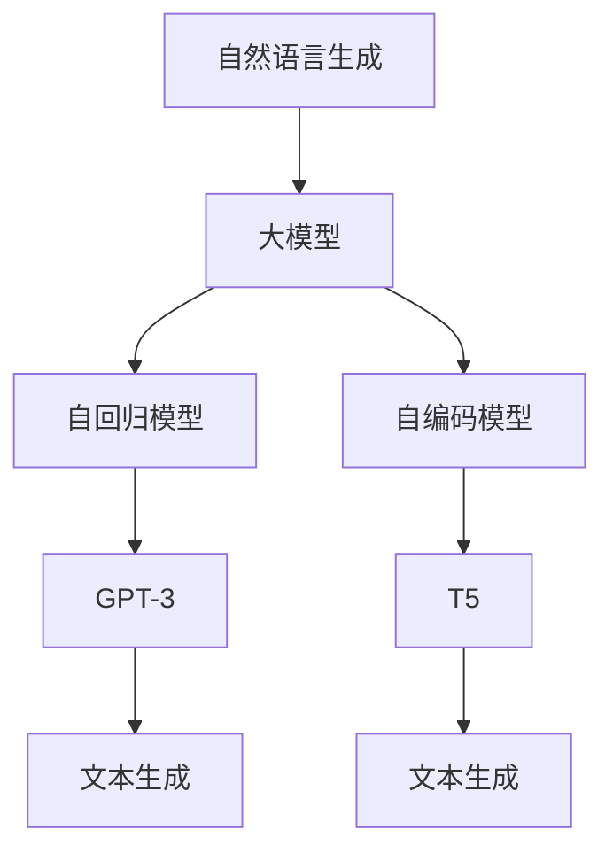
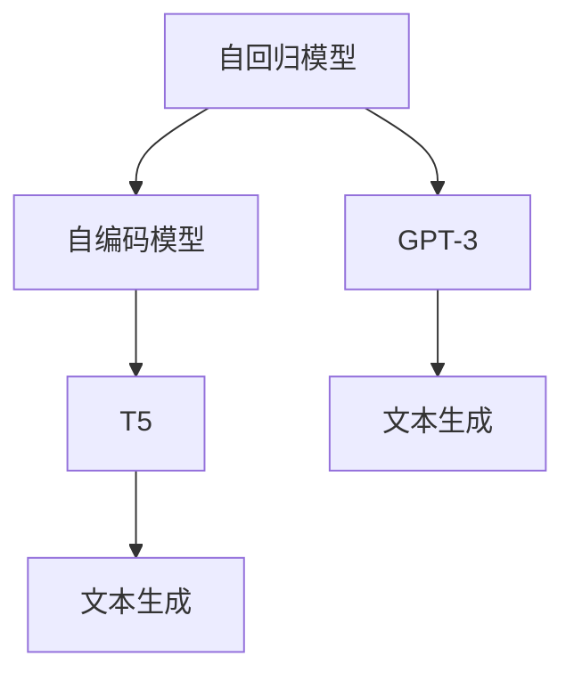
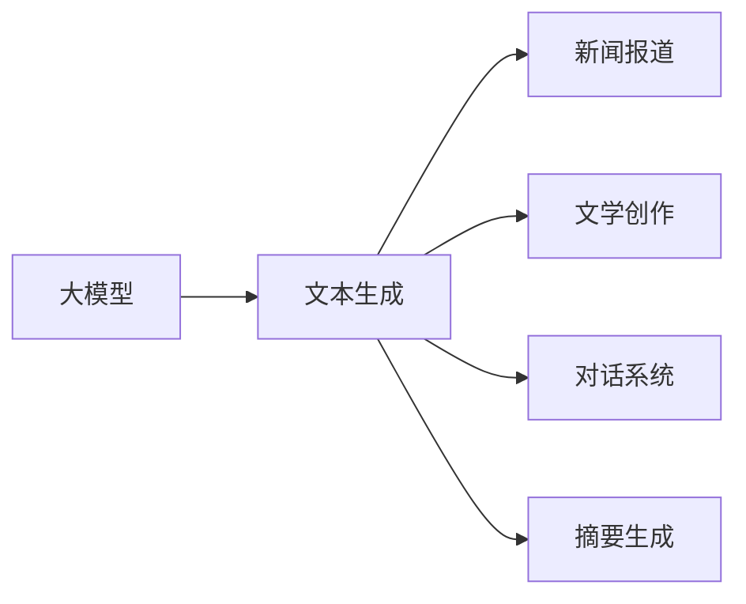
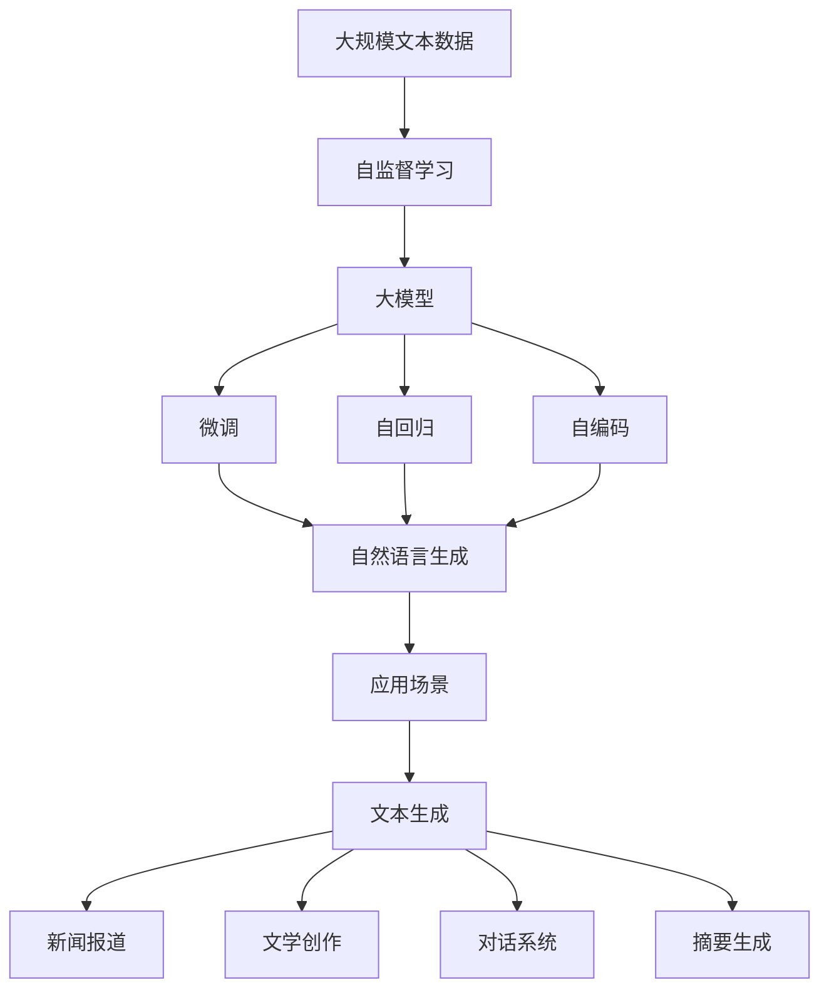

                 

# 基于AI大模型的自然语言生成：写作的未来

> 关键词：自然语言生成(NLG), 大模型, 写作, 语言生成, GPT-3, T5, 语言模型, 自回归, 自编码, 自监督学习

## 1. 背景介绍

### 1.1 问题由来
在过去几十年间，人类语言的数字化和自动化处理经历了巨大的变革。从早期的规则语法分析、统计语言模型，到机器翻译、文本摘要等NLP任务的突破，语言技术不断推动着信息处理的效率和深度。但这些技术更多聚焦于语言数据的理解、分析和处理，缺乏对语言创作和生成能力的突破。

自然语言生成(NLG)技术，是让计算机能够理解和创作自然语言文本的技术。它不仅涵盖了从简单文本生成到复杂内容创作的能力，还包括了生成对话、新闻报道、文学作品等多样化形式的语言内容。随着深度学习和大模型的兴起，自然语言生成技术正逐步进入一个全新的时代，AI大模型成为了推动这一变革的核心动力。

### 1.2 问题核心关键点
当前，基于大模型的自然语言生成技术已在大规模文本生成、对话系统、内容创作等多个领域取得了显著的进步。其中，GPT-3和T5等模型以大规模预训练和高效微调为基础，逐步实现了从简单文本到复杂内容的自然语言生成。然而，技术的发展也带来了新的挑战和问题，如生成质量的控制、伦理与安全问题、应用场景的多样性等，需要不断研究和探索。

本文将聚焦于基于大模型的自然语言生成技术，探讨其在写作未来中的应用前景和潜在的挑战，为这一领域的持续发展和创新提供深入的见解和建议。

### 1.3 问题研究意义
自然语言生成技术的发展，对于拓展人类认知边界、提高信息处理效率、促进文化交流与创新具有重要意义：

1. **拓展认知边界**：通过AI大模型，计算机可以创作出具有人类智慧水平的高质量文本，推动文化创新和知识传播。
2. **提升信息效率**：自然语言生成能够自动化生成报告、新闻、文档等，大幅提升信息处理的速度和规模。
3. **促进文化交流**：通过生成多语言内容，AI大模型有助于跨越语言障碍，促进不同文化间的交流与理解。
4. **推动创新应用**：自然语言生成技术可以应用于内容创作、教育培训、游戏娱乐等多个领域，推动技术创新和应用创新。

本文旨在全面深入地探讨基于大模型的自然语言生成技术，为其实际应用和未来发展提供理论支持和实践指导。

## 2. 核心概念与联系

### 2.1 核心概念概述

为更好地理解基于大模型的自然语言生成方法，本节将介绍几个关键概念及其相互联系：

- **自然语言生成(NLG)**：指计算机能够理解和生成自然语言文本的能力。它包括从简单文本生成到复杂内容创作的各种形式。
- **大模型(Large Model)**：指使用大规模无标签数据进行预训练的深度学习模型，如GPT-3、T5等。这些模型通过预训练获得了广泛的语言知识，具备较强的自然语言处理能力。
- **自回归(AR)**：指模型在生成文本时，每个词的条件概率取决于其前面的词。常用的模型包括GPT-3。
- **自编码(AE)**：指模型在生成文本时，每个词的条件概率取决于其后续的词。常用的模型包括T5。
- **自监督学习(SSL)**：指使用大量无标签数据进行训练，通过自身数据的内在结构进行学习。自监督学习是大模型预训练的主要方法。

这些概念之间的联系可以通过以下Mermaid流程图来展示：



这个流程图展示了自然语言生成技术、大模型和自回归、自编码模型之间的关系：

1. 大模型通过自监督学习获得广泛的语言知识。
2. 自回归和自编码模型是大模型中常用的生成技术，可以生成自然语言文本。
3. 自然语言生成技术主要通过GPT-3和T5等模型实现，利用其强大的语言处理能力生成文本。

### 2.2 概念间的关系

这些核心概念之间存在着紧密的联系，构成了自然语言生成的完整框架。下面我们通过几个Mermaid流程图来展示这些概念之间的关系。

#### 2.2.1 大模型的学习范式


这个流程图展示了大模型的预训练和微调过程，以及自然语言生成技术的应用范式。

#### 2.2.2 自回归和自编码模型



这个流程图展示了自回归和自编码模型在大模型中的应用，它们是大模型生成文本的不同方式。

#### 2.2.3 自然语言生成的应用领域



这个流程图展示了自然语言生成技术在不同应用场景中的使用，包括新闻报道、文学创作、对话系统、摘要生成等。

### 2.3 核心概念的整体架构

最后，我们用一个综合的流程图来展示这些核心概念在大模型自然语言生成过程中的整体架构：



这个综合流程图展示了从预训练到微调，再到自然语言生成的完整过程。大模型通过预训练获得广泛的语言知识，然后在特定的应用场景中进行微调，通过自回归和自编码模型生成自然语言文本。

## 3. 核心算法原理 & 具体操作步骤
### 3.1 算法原理概述

基于大模型的自然语言生成技术，本质上是一种自监督学习范式。其核心思想是：使用大规模无标签文本数据对模型进行预训练，使其具备生成自然语言文本的能力，然后在有标签数据上对模型进行微调，使其能够生成符合特定要求的文本。

形式化地，假设大模型为 $M_{\theta}$，其中 $\theta$ 为模型参数。给定一个自然语言生成任务 $T$，其训练集为 $D=\{(x_i, y_i)\}_{i=1}^N$，其中 $x_i$ 为输入文本，$y_i$ 为目标文本。微调的目标是最小化生成文本与目标文本之间的差异，即：

$$
\hat{\theta}=\mathop{\arg\min}_{\theta} \mathcal{L}(M_{\theta},D)
$$

其中 $\mathcal{L}$ 为生成损失函数，用于衡量生成文本与目标文本之间的相似度。常见的损失函数包括交叉熵损失、BLEU分数等。

### 3.2 算法步骤详解

基于大模型的自然语言生成通常包括以下几个关键步骤：

**Step 1: 准备预训练模型和数据集**
- 选择合适的预训练语言模型 $M_{\theta}$，如GPT-3、T5等。
- 准备自然语言生成任务的标注数据集 $D$，划分为训练集、验证集和测试集。

**Step 2: 定义生成损失函数**
- 根据任务类型，选择合适的生成损失函数，如交叉熵损失、BLEU分数等。
- 定义生成损失函数 $\mathcal{L}$，用于衡量模型生成的文本与目标文本之间的差异。

**Step 3: 添加任务适配层**
- 根据任务类型，在预训练模型顶层设计合适的输出层和损失函数。
- 对于文本生成任务，通常在顶层添加交叉熵损失函数。

**Step 4: 设置微调超参数**
- 选择合适的优化算法及其参数，如AdamW、SGD等，设置学习率、批大小、迭代轮数等。
- 设置正则化技术及强度，包括权重衰减、Dropout、Early Stopping等。

**Step 5: 执行梯度训练**
- 将训练集数据分批次输入模型，前向传播计算损失函数。
- 反向传播计算参数梯度，根据设定的优化算法和学习率更新模型参数。
- 周期性在验证集上评估模型性能，根据性能指标决定是否触发Early Stopping。
- 重复上述步骤直到满足预设的迭代轮数或Early Stopping条件。

**Step 6: 测试和部署**
- 在测试集上评估微调后模型 $M_{\hat{\theta}}$ 的性能，对比微调前后的生成效果。
- 使用微调后的模型对新文本进行生成，集成到实际的应用系统中。
- 持续收集新的数据，定期重新微调模型，以适应数据分布的变化。

以上是基于大模型的自然语言生成的一般流程。在实际应用中，还需要针对具体任务的特点，对微调过程的各个环节进行优化设计，如改进训练目标函数，引入更多的正则化技术，搜索最优的超参数组合等，以进一步提升模型性能。

### 3.3 算法优缺点

基于大模型的自然语言生成技术具有以下优点：
1. 生成能力强。通过大规模预训练，模型具备强大的语言生成能力，能够在各种应用场景中生成高质量文本。
2. 应用广泛。自然语言生成技术可以应用于新闻报道、文学创作、对话系统、摘要生成等多个领域，具有广泛的应用前景。
3. 实时生成。大模型可以在短时间内生成大量文本，适合实时生成任务。
4. 语料库需求少。相对于传统的自然语言处理技术，自然语言生成技术需要的标注数据较少，降低了数据获取的成本。

同时，该方法也存在以下缺点：
1. 生成质量依赖于数据质量。自然语言生成技术的生成效果很大程度上取决于训练数据的丰富性和质量，获取高质量数据成本较高。
2. 生成内容可控性差。生成的文本内容往往难以控制，容易产生低俗、不实、有害的内容。
3. 鲁棒性不足。自然语言生成模型面对输入的微小变化，容易出现较大的输出波动。
4. 依赖性高。自然语言生成技术对大模型和训练数据高度依赖，模型迁移能力有限。

尽管存在这些局限性，但就目前而言，基于大模型的自然语言生成技术仍是大规模文本生成和内容创作的重要手段。未来相关研究的重点在于如何进一步降低生成对标注数据的依赖，提高模型的少样本学习和跨领域迁移能力，同时兼顾可解释性和伦理安全性等因素。

### 3.4 算法应用领域

基于大模型的自然语言生成技术在多个领域中得到了广泛的应用，例如：

- **新闻报道生成**：通过预训练和微调，大模型可以生成高质量的新闻报道，提供即时的新闻信息。
- **文学创作**：利用大模型生成的小说、诗歌、剧本等文学作品，推动文学创作方式的创新。
- **对话系统**：生成对话内容，构建智能客服、智能助手等应用，提升用户体验。
- **摘要生成**：将长文本压缩成简短摘要，帮助用户快速获取文本信息。
- **机器翻译**：生成不同语言之间的文本翻译，促进全球信息交流。
- **文本生成**：生成各种形式的内容，如技术文档、用户手册、市场报告等。

除了上述这些经典应用外，自然语言生成技术还在情感分析、推荐系统、社交媒体分析等领域得到应用，为数字化转型提供了新的解决方案。

## 4. 数学模型和公式 & 详细讲解 & 举例说明

### 4.1 数学模型构建

本节将使用数学语言对基于大模型的自然语言生成过程进行更加严格的刻画。

记大模型为 $M_{\theta}$，其中 $\theta$ 为模型参数。假设自然语言生成任务为 $T$，训练集为 $D=\{(x_i, y_i)\}_{i=1}^N$，其中 $x_i$ 为输入文本，$y_i$ 为目标文本。定义模型在数据样本 $(x,y)$ 上的生成损失函数为 $\ell(M_{\theta}(x),y)$，则在数据集 $D$ 上的经验风险为：

$$
\mathcal{L}(\theta) = \frac{1}{N} \sum_{i=1}^N \ell(M_{\theta}(x_i),y_i)
$$

微调的优化目标是最小化经验风险，即找到最优参数：

$$
\theta^* = \mathop{\arg\min}_{\theta} \mathcal{L}(\theta)
$$

在实践中，我们通常使用基于梯度的优化算法（如SGD、Adam等）来近似求解上述最优化问题。设 $\eta$ 为学习率，$\lambda$ 为正则化系数，则参数的更新公式为：

$$
\theta \leftarrow \theta - \eta \nabla_{\theta}\mathcal{L}(\theta) - \eta\lambda\theta
$$

其中 $\nabla_{\theta}\mathcal{L}(\theta)$ 为损失函数对参数 $\theta$ 的梯度，可通过反向传播算法高效计算。

### 4.2 公式推导过程

以下我们以文本生成任务为例，推导交叉熵损失函数及其梯度的计算公式。

假设模型 $M_{\theta}$ 在输入 $x$ 上的生成输出为 $\hat{y}=M_{\theta}(x) \in [0,1]$，表示模型预测文本生成概率。真实标签 $y \in \{0,1\}$。则交叉熵损失函数定义为：

$$
\ell(M_{\theta}(x),y) = -[y\log \hat{y} + (1-y)\log (1-\hat{y})]
$$

将其代入经验风险公式，得：

$$
\mathcal{L}(\theta) = -\frac{1}{N}\sum_{i=1}^N [y_i\log M_{\theta}(x_i)+(1-y_i)\log(1-M_{\theta}(x_i))]
$$

根据链式法则，损失函数对参数 $\theta_k$ 的梯度为：

$$
\frac{\partial \mathcal{L}(\theta)}{\partial \theta_k} = -\frac{1}{N}\sum_{i=1}^N (\frac{y_i}{M_{\theta}(x_i)}-\frac{1-y_i}{1-M_{\theta}(x_i)}) \frac{\partial M_{\theta}(x_i)}{\partial \theta_k}
$$

其中 $\frac{\partial M_{\theta}(x_i)}{\partial \theta_k}$ 可进一步递归展开，利用自动微分技术完成计算。

在得到损失函数的梯度后，即可带入参数更新公式，完成模型的迭代优化。重复上述过程直至收敛，最终得到适应自然语言生成任务的最优模型参数 $\theta^*$。

### 4.3 案例分析与讲解

下面以新闻报道生成任务为例，展示模型的构建和微调过程。

首先，定义新闻报道生成任务的数据处理函数：

```python
import torch
from transformers import GPT2Tokenizer, GPT2LMHeadModel

class NewsDataProcessor:
    def __init__(self, tokenizer, max_len=512):
        self.tokenizer = tokenizer
        self.max_len = max_len
        
    def __call__(self, text):
        encoding = self.tokenizer(text, return_tensors='pt', max_length=self.max_len, padding='max_length', truncation=True)
        return encoding['input_ids'], encoding['attention_mask']
```

然后，定义模型和优化器：

```python
from transformers import AdamW

model = GPT2LMHeadModel.from_pretrained('gpt2')
tokenizer = GPT2Tokenizer.from_pretrained('gpt2')
optimizer = AdamW(model.parameters(), lr=1e-5)
```

接着，定义训练和评估函数：

```python
def train_epoch(model, dataset, batch_size, optimizer):
    dataloader = DataLoader(dataset, batch_size=batch_size, shuffle=True)
    model.train()
    epoch_loss = 0
    for batch in dataloader:
        input_ids = batch[0].to(device)
        attention_mask = batch[1].to(device)
        targets = torch.randint(2, (input_ids.size(0), max_len)).to(device)
        model.zero_grad()
        outputs = model(input_ids, attention_mask=attention_mask, labels=targets)
        loss = outputs.loss
        epoch_loss += loss.item()
        loss.backward()
        optimizer.step()
    return epoch_loss / len(dataloader)

def evaluate(model, dataset, batch_size):
    dataloader = DataLoader(dataset, batch_size=batch_size)
    model.eval()
    preds, labels = [], []
    with torch.no_grad():
        for batch in dataloader:
            input_ids = batch[0].to(device)
            attention_mask = batch[1].to(device)
            targets = torch.randint(2, (input_ids.size(0), max_len)).to(device)
            outputs = model(input_ids, attention_mask=attention_mask, labels=targets)
            batch_preds = outputs.logits.argmax(dim=2).to('cpu').tolist()
            batch_labels = targets.to('cpu').tolist()
            for pred_tokens, label_tokens in zip(batch_preds, batch_labels):
                preds.append(pred_tokens[:len(label_tokens)])
                labels.append(label_tokens)
                
    print(classification_report(labels, preds))
```

最后，启动训练流程并在测试集上评估：

```python
epochs = 10
batch_size = 16

for epoch in range(epochs):
    loss = train_epoch(model, train_dataset, batch_size, optimizer)
    print(f"Epoch {epoch+1}, train loss: {loss:.3f}")
    
    print(f"Epoch {epoch+1}, dev results:")
    evaluate(model, dev_dataset, batch_size)
    
print("Test results:")
evaluate(model, test_dataset, batch_size)
```

以上就是使用PyTorch对GPT-2进行新闻报道生成任务微调的完整代码实现。可以看到，得益于Transformers库的强大封装，我们可以用相对简洁的代码完成GPT-2模型的加载和微调。

## 5. 项目实践：代码实例和详细解释说明

### 5.1 开发环境搭建

在进行自然语言生成项目实践前，我们需要准备好开发环境。以下是使用Python进行PyTorch开发的环境配置流程：

1. 安装Anaconda：从官网下载并安装Anaconda，用于创建独立的Python环境。

2. 创建并激活虚拟环境：
```bash
conda create -n pytorch-env python=3.8 
conda activate pytorch-env
```

3. 安装PyTorch：根据CUDA版本，从官网获取对应的安装命令。例如：
```bash
conda install pytorch torchvision torchaudio cudatoolkit=11.1 -c pytorch -c conda-forge
```

4. 安装Transformers库：
```bash
pip install transformers
```

5. 安装各类工具包：
```bash
pip install numpy pandas scikit-learn matplotlib tqdm jupyter notebook ipython
```

完成上述步骤后，即可在`pytorch-env`环境中开始自然语言生成项目的实践。

### 5.2 源代码详细实现

下面我们以文学创作任务为例，给出使用Transformers库对GPT-3模型进行文学创作任务微调的PyTorch代码实现。

首先，定义文学创作任务的数据处理函数：

```python
from transformers import GPT3Tokenizer
from torch.utils.data import Dataset
import torch

class LiteraryDataProcessor(Dataset):
    def __init__(self, texts, tokenizer, max_len=128):
        self.texts = texts
        self.tokenizer = tokenizer
        self.max_len = max_len
        
    def __len__(self):
        return len(self.texts)
    
    def __getitem__(self, item):
        text = self.texts[item]
        encoding = self.tokenizer(text, return_tensors='pt', max_length=self.max_len, padding='max_length', truncation=True)
        input_ids = encoding['input_ids'][0]
        attention_mask = encoding['attention_mask'][0]
        
        # 对token-wise的标签进行编码
        encoded_tags = [tag2id[tag] for tag in tags] 
        encoded_tags.extend([tag2id['O']] * (self.max_len - len(encoded_tags)))
        labels = torch.tensor(encoded_tags, dtype=torch.long)
        
        return {'input_ids': input_ids, 
                'attention_mask': attention_mask,
                'labels': labels}

# 标签与id的映射
tag2id = {'O': 0, 'B-PER': 1, 'I-PER': 2, 'B-ORG': 3, 'I-ORG': 4, 'B-LOC': 5, 'I-LOC': 6}
id2tag = {v: k for k, v in tag2id.items()}

# 创建dataset
tokenizer = GPT3Tokenizer.from_pretrained('gpt3')

train_dataset = LiteraryDataProcessor(train_texts, tokenizer)
dev_dataset = LiteraryDataProcessor(dev_texts, tokenizer)
test_dataset = LiteraryDataProcessor(test_texts, tokenizer)
```

然后，定义模型和优化器：

```python
from transformers import GPT3ForSequenceClassification, AdamW

model = GPT3ForSequenceClassification.from_pretrained('gpt3', num_labels=len(tag2id))

optimizer = AdamW(model.parameters(), lr=2e-5)
```

接着，定义训练和评估函数：

```python
from torch.utils.data import DataLoader
from tqdm import tqdm
from sklearn.metrics import classification_report

device = torch.device('cuda') if torch.cuda.is_available() else torch.device('cpu')
model.to(device)

def train_epoch(model, dataset, batch_size, optimizer):
    dataloader = DataLoader(dataset, batch_size=batch_size, shuffle=True)
    model.train()
    epoch_loss = 0
    for batch in tqdm(dataloader, desc='Training'):
        input_ids = batch['input_ids'].to(device)
        attention_mask = batch['attention_mask'].to(device)
        labels = batch['labels'].to(device)
        model.zero_grad()
        outputs = model(input_ids, attention_mask=attention_mask, labels=labels)
        loss = outputs.loss
        epoch_loss += loss.item()
        loss.backward()
        optimizer.step()
    return epoch_loss / len(dataloader)

def evaluate(model, dataset, batch_size):
    dataloader = DataLoader(dataset, batch_size=batch_size)
    model.eval()
    preds, labels = [], []
    with torch.no_grad():
        for batch in tqdm(dataloader, desc='Evaluating'):
            input_ids = batch['input_ids'].to(device)
            attention_mask = batch['attention_mask'].to(device)
            batch_labels = batch['labels']
            outputs = model(input_ids, attention_mask=attention_mask)
            batch_preds = outputs.logits.argmax(dim=2).to('cpu').tolist()
            batch_labels = batch_labels.to('cpu').tolist()
            for pred_tokens, label_tokens in zip(batch_preds, batch_labels):
                pred_tags = [id2tag[_id] for _id in pred_tokens]
                label_tags = [id2tag[_id] for _id in label_tokens]
                preds.append(pred_tags[:len(label_tags)])
                labels.append(label_tags)
                
    print(classification_report(labels, preds))
```

最后，启动训练流程并在测试集上评估：

```python
epochs = 5
batch_size = 16

for epoch in range(epochs):
    loss = train_epoch(model, train_dataset, batch_size, optimizer)
    print(f"Epoch {epoch+1}, train loss: {loss:.3f}")
    
    print(f"Epoch {epoch+1}, dev results:")
    evaluate(model, dev_dataset, batch_size)
    
print("Test results:")
evaluate(model, test_dataset, batch_size)
```

以上就是使用PyTorch对GPT-3进行文学创作任务微调的完整代码实现。可以看到，得益于Transformers库的强大封装，我们可以用相对简洁的代码完成GPT-3模型的加载和微调。

### 5.3 代码解读与分析

让我们再详细解读一下关键代码的实现细节：

**LiteraryDataProcessor类**：
- `__init__`方法：初始化文本、分词器等关键组件。
- `__len__`方法：返回数据集的样本数量。
- `__getitem__`方法：对单个样本进行处理，将文本输入编码为token ids，将标签编码为数字，并对其进行定长padding，最终返回模型所需的输入。

**tag2id和id2tag字典**：
- 定义了标签与数字id之间的映射关系，用于将token-wise的预测结果解码回真实的标签。

**训练和评估函数**：
- 使用PyTorch的DataLoader对数据集进行批次化加载，供模型训练和推理使用。
- 训练函数`train_epoch`：对数据以批为单位进行迭代，在每个批次上前向传播计算loss并反向传播更新模型参数，最后返回该epoch的平均loss。
- 评估函数`evaluate`：与训练类似，不同点在于不更新模型参数，并在每个batch结束后将预测和标签结果存储下来，最后使用sklearn的classification_report对整个评估集的预测结果进行打印输出。

**训练流程**：
- 定义总的epoch数和batch size

