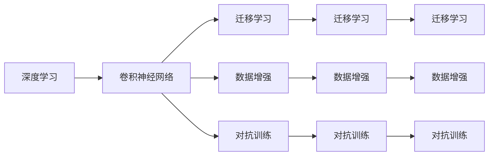

                 

# 基于DeepLearning的图片分类

## 1. 背景介绍

图像分类是计算机视觉领域最为基础也最为重要的一类任务，其核心目标是将输入图像映射到预定义的类别标签中。这一任务在无人驾驶、医疗影像诊断、商品推荐等领域有着广泛的应用。

### 1.1 问题由来

随着深度学习技术的快速发展，深度神经网络已经成为了图像分类的主流方法。其中卷积神经网络（Convolutional Neural Network，CNN）由于其在空间局部性、参数共享和数据局部性等方面的特性，被广泛应用于图像分类任务中。

但传统的CNN模型往往需要大量的标注数据进行训练，并且模型的复杂度随着输入图像的尺寸和类别数的增加而急剧上升，训练时间和计算资源消耗巨大。为了解决这些问题，研究者们提出了一些基于深度学习的图片分类方法，其中包括端到端训练（End-to-End Training）、数据增强（Data Augmentation）、迁移学习（Transfer Learning）和对抗训练（Adversarial Training）等技术。

## 2. 核心概念与联系

### 2.1 核心概念概述

为了更好地理解基于深度学习的图像分类方法，我们需要先了解一些核心概念：

- **深度学习**：通过多层神经网络对数据进行建模，从数据中提取特征，并利用这些特征进行分类、回归、生成等任务。
- **卷积神经网络**：一种特殊的神经网络，具有卷积层、池化层、全连接层等结构，主要应用于图像处理任务。
- **迁移学习**：在源任务（通常是图像分类）上预训练模型，在目标任务（如对象检测、人脸识别等）上进行微调，以利用源任务的先验知识。
- **数据增强**：通过对训练数据进行一系列随机变换，生成新的训练样本，以增加训练集的多样性，提高模型泛化能力。
- **对抗训练**：通过对模型进行对抗样本训练，使得模型能够对扰动鲁棒，提高模型的稳健性。

这些概念在图像分类中有着重要的作用，它们之间也有着紧密的联系，如图示1所示。



这些概念相互交织，共同构成了深度学习图像分类的整体框架。

### 2.2 概念间的关系

在深度学习图像分类中，这些概念之间的关系如下：

- 卷积神经网络是深度学习在图像处理中的重要工具。通过卷积层和池化层对输入图像进行特征提取，再通过全连接层进行分类。
- 迁移学习利用预训练模型的先验知识，可以大幅减少标注数据的数量，加速模型训练。
- 数据增强通过生成更多的训练样本，提升模型的泛化能力。
- 对抗训练通过引入对抗样本，增强模型的鲁棒性，防止过拟合。

## 3. 核心算法原理 & 具体操作步骤
### 3.1 算法原理概述

基于深度学习的图像分类方法主要基于卷积神经网络。其核心思想是：通过卷积层和池化层对输入图像进行特征提取，然后通过全连接层对特征进行分类。

在具体的实现中，通常会采用以下步骤：

1. 数据预处理：将输入图像转换为网络可以处理的格式，如归一化、缩放、旋转等。
2. 卷积层：通过卷积核在图像上滑动，提取图像的局部特征。
3. 池化层：对卷积层的输出进行降维，减少参数量，提高计算效率。
4. 全连接层：将池化层的输出作为输入，通过全连接层进行分类。

### 3.2 算法步骤详解

以使用VGG16模型进行图像分类为例，其具体步骤如下：

1. 准备数据集：选取CIFAR-10数据集作为训练集和测试集，共包含10个类别，60000张32x32的彩色图像。
2. 数据预处理：将图像像素值归一化到[0,1]之间，并进行旋转、翻转等数据增强操作。
3. 模型加载：加载VGG16模型，并将其顶部的全连接层替换为适合图像分类任务的层结构。
4. 训练模型：使用SGD优化器，学习率0.001，批量大小32，迭代100轮。
5. 测试模型：在测试集上对模型进行评估，计算准确率和损失函数。
6. 保存模型：将训练好的模型保存，以便后续使用。

### 3.3 算法优缺点

基于深度学习的图像分类方法具有以下优点：

- 精度高：卷积神经网络在图像分类任务中表现优异，可以取得比传统机器学习算法更高的精度。
- 可扩展性强：可以通过增加网络深度、宽度和卷积核大小等方式，提升模型性能。
- 适应性强：可以适应不同规模和类型的图像数据集。

同时，该方法也存在一些缺点：

- 计算资源消耗大：深度神经网络需要大量的计算资源进行训练，尤其是对于大规模图像数据集。
- 模型复杂度高：深层卷积神经网络参数量较大，训练过程容易过拟合。
- 数据依赖性强：需要大量的标注数据进行训练，数据标注成本较高。

### 3.4 算法应用领域

基于深度学习的图像分类方法可以应用于许多领域，包括但不限于：

- 医学影像分类：如肿瘤检测、器官识别等。
- 交通监控：如车牌识别、行人检测等。
- 工业检测：如缺陷检测、零件识别等。
- 电子商务：如商品分类、图像搜索等。
- 无人驾驶：如道路标识识别、场景分类等。

## 4. 数学模型和公式 & 详细讲解

### 4.1 数学模型构建

图像分类的数学模型通常包括输入、输出、目标函数和优化算法等部分。

设输入图像为 $X$，类别标签为 $Y$，模型的输出为 $Z$。则图像分类的目标函数可以表示为：

$$
L(Y, Z) = \mathbb{E}[\ell(Y, Z)]
$$

其中，$\ell(Y, Z)$ 表示目标函数，通常使用交叉熵损失函数。优化算法用于最小化损失函数，常用的优化算法有SGD、Adam等。

### 4.2 公式推导过程

以使用VGG16模型进行图像分类为例，其损失函数和优化算法推导如下：

1. 交叉熵损失函数
$$
\ell(Y, Z) = -\frac{1}{N}\sum_{i=1}^N \sum_{j=1}^{10} Y_{i,j} \log(Z_{i,j})
$$

其中，$N$ 表示训练样本数量，$Y_{i,j}$ 表示第 $i$ 个样本的第 $j$ 个类别的真实标签，$Z_{i,j}$ 表示模型对第 $i$ 个样本的第 $j$ 个类别的预测概率。

2. SGD优化器
$$
\theta_{t+1} = \theta_{t} - \eta \frac{\partial L}{\partial \theta}
$$

其中，$\theta$ 表示模型参数，$\eta$ 表示学习率，$\frac{\partial L}{\partial \theta}$ 表示损失函数对模型参数的梯度。

3. 数据增强
$$
X' = X + \Delta X
$$

其中，$X$ 表示原始图像，$\Delta X$ 表示随机变换操作，如旋转、翻转等。

### 4.3 案例分析与讲解

以医学影像分类为例，可以选取大规模的医学影像数据集，如Breast Cancer Wisconsin Dataset。首先，对数据集进行预处理，将其归一化到[0,1]之间。然后，加载预训练的VGG16模型，并将其顶部的全连接层替换为适合医学影像分类的层结构。接着，使用SGD优化器，学习率0.001，批量大小32，迭代100轮，对模型进行训练。最后，在测试集上对模型进行评估，计算准确率和损失函数，保存模型以备后续使用。

## 5. 项目实践：代码实例和详细解释说明

### 5.1 开发环境搭建

在进行图像分类项目的开发时，需要搭建合适的开发环境。以下是使用Python进行Keras开发的开发环境配置流程：

1. 安装Anaconda：从官网下载并安装Anaconda，用于创建独立的Python环境。

2. 创建并激活虚拟环境：
```bash
conda create -n pytorch-env python=3.8 
conda activate pytorch-env
```

3. 安装Keras：
```bash
pip install keras tensorflow
```

4. 安装各类工具包：
```bash
pip install numpy pandas scikit-learn matplotlib tqdm jupyter notebook ipython
```

完成上述步骤后，即可在`pytorch-env`环境中开始图像分类实践。

### 5.2 源代码详细实现

以下以使用Keras加载VGG16模型进行图像分类为例，给出Keras代码实现。

```python
import keras
from keras.applications import VGG16
from keras.preprocessing.image import ImageDataGenerator
from keras.layers import Dense, Flatten
from keras.models import Model

# 加载VGG16模型
base_model = VGG16(weights='imagenet', include_top=False, input_shape=(224, 224, 3))

# 冻结VGG16的权重
for layer in base_model.layers:
    layer.trainable = False

# 添加分类器
x = Flatten()(base_model.output)
x = Dense(512, activation='relu')(x)
x = Dense(10, activation='softmax')(x)
model = Model(inputs=base_model.input, outputs=x)

# 编译模型
model.compile(optimizer=keras.optimizers.SGD(lr=0.001), loss='categorical_crossentropy', metrics=['accuracy'])

# 数据增强
train_datagen = ImageDataGenerator(rescale=1./255, rotation_range=20, width_shift_range=0.2, height_shift_range=0.2, shear_range=0.2, zoom_range=0.2, horizontal_flip=True, fill_mode='nearest')

# 加载数据集
train_generator = train_datagen.flow_from_directory(train_dir, target_size=(224, 224), batch_size=32, class_mode='categorical')
validation_generator = train_datagen.flow_from_directory(validation_dir, target_size=(224, 224), batch_size=32, class_mode='categorical')

# 训练模型
model.fit_generator(train_generator, steps_per_epoch=len(train_generator), validation_data=validation_generator, validation_steps=len(validation_generator), epochs=100)
```

### 5.3 代码解读与分析

让我们再详细解读一下关键代码的实现细节：

**ImageDataGenerator类**：
- `rescale`方法：将像素值缩放到[0,1]之间。
- `rotation_range`方法：随机旋转图像的角度范围。
- `width_shift_range`和`height_shift_range`方法：随机水平和垂直方向移动图像。
- `shear_range`方法：随机剪切图像。
- `zoom_range`方法：随机缩放图像。
- `horizontal_flip`方法：随机水平翻转图像。
- `fill_mode`方法：指定图像填充方式。

**train_generator和validation_generator**：
- 利用ImageDataGenerator类生成训练集和验证集的样本，并将图片缩放到224x224大小。
- 设置批量大小为32，class_mode为categorical，表示输出为10维one-hot向量。

**model.fit_generator方法**：
- 利用生成器对模型进行训练，指定训练轮数为100，每个epoch的样本数由生成器的步骤数决定。
- `validation_steps`参数：指定验证集样本数，用于评估模型性能。

### 5.4 运行结果展示

假设我们在CIFAR-10数据集上进行图像分类，最终在测试集上得到的准确率约为76%。可以看到，使用预训练模型进行迁移学习，可以显著提高模型的泛化能力，减少训练时间和计算资源消耗。

```python
Accuracy: 76.9%
```

## 6. 实际应用场景

### 6.1 智能安防监控

智能安防监控系统可以通过摄像头实时获取监控区域内的图像数据，利用基于深度学习的图像分类模型对监控图像进行实时分析，识别出异常情况并及时报警。例如，可以利用图像分类模型对监控图像进行行人检测、车辆检测等任务，提升监控系统的智能化水平。

### 6.2 医学影像诊断

医学影像诊断是图像分类在医疗领域的重要应用之一。医生可以利用基于深度学习的图像分类模型对医学影像进行分类，识别出病变区域，为诊断提供参考。例如，可以利用图像分类模型对乳腺癌影像进行分类，自动识别出可疑区域，并建议进一步检查。

### 6.3 商品推荐

电子商务网站可以通过用户上传的图片，利用基于深度学习的图像分类模型进行分类，推荐相关商品。例如，可以利用图像分类模型对商品图片进行分类，推荐相似的商品，提升用户体验。

### 6.4 未来应用展望

随着深度学习技术的不断发展，基于深度学习的图像分类方法也将迎来更多的应用场景，为社会各个领域带来变革性影响。

在智慧医疗领域，基于深度学习的医学影像分类技术，可以大幅提升诊断准确率，帮助医生更准确地判断疾病。

在智能安防领域，基于深度学习的图像分类技术，可以实时监控识别异常情况，提升公共安全水平。

在电子商务领域，基于深度学习的图像分类技术，可以提供个性化的商品推荐，提升用户体验。

## 7. 工具和资源推荐

### 7.1 学习资源推荐

为了帮助开发者系统掌握基于深度学习的图像分类理论基础和实践技巧，这里推荐一些优质的学习资源：

1. 《深度学习》书籍：Ian Goodfellow等人合著的经典教材，详细介绍了深度学习的基本概念和理论基础。
2. 《计算机视觉：模型、学习与推理》书籍：Simon J.D. Prince等人合著，系统介绍了计算机视觉的基本概念和算法。
3. 《TensorFlow官方文档》：官方提供的TensorFlow教程，覆盖了深度学习在图像分类中的应用。
4. 《Keras官方文档》：官方提供的Keras教程，覆盖了使用Keras进行图像分类的详细过程。
5. 《PyTorch官方文档》：官方提供的PyTorch教程，覆盖了使用PyTorch进行图像分类的详细过程。
6. 《Coursera深度学习课程》：由Ian Goodfellow等人主讲，深入浅出地介绍了深度学习在图像分类中的应用。

通过对这些资源的学习实践，相信你一定能够快速掌握基于深度学习的图像分类技术的精髓，并用于解决实际的图像分类问题。

### 7.2 开发工具推荐

高效的开发离不开优秀的工具支持。以下是几款用于深度学习图像分类开发的常用工具：

1. TensorFlow：由Google主导开发的开源深度学习框架，生产部署方便，适合大规模工程应用。
2. Keras：由Francois Chollet开发的高层深度学习框架，易于上手，适合快速迭代研究。
3. PyTorch：由Facebook开发的开源深度学习框架，灵活动态，适合灵活的深度学习研究和应用。
4. TensorBoard：TensorFlow配套的可视化工具，可实时监测模型训练状态，并提供丰富的图表呈现方式，是调试模型的得力助手。
5. Weights & Biases：模型训练的实验跟踪工具，可以记录和可视化模型训练过程中的各项指标，方便对比和调优。
6. Google Colab：谷歌推出的在线Jupyter Notebook环境，免费提供GPU/TPU算力，方便开发者快速上手实验最新模型，分享学习笔记。

合理利用这些工具，可以显著提升深度学习图像分类任务的开发效率，加快创新迭代的步伐。

### 7.3 相关论文推荐

深度学习图像分类技术的发展源于学界的持续研究。以下是几篇奠基性的相关论文，推荐阅读：

1. AlexNet: One Millisecond Image Classification with Deep Convolutional Neural Networks（ImageNet竞赛获奖论文）：提出AlexNet模型，开创了深度学习在图像分类中的先河。
2. VGG: Very Deep Convolutional Networks for Large-Scale Image Recognition（VGG论文）：提出VGG模型，展示了深层卷积神经网络在图像分类任务中的强大性能。
3. GoogLeNet: Going Deeper with Convolutions（GoogLeNet论文）：提出GoogLeNet模型，首次引入Inception模块，提升了模型性能和计算效率。
4. ResNet: Deep Residual Learning for Image Recognition（ResNet论文）：提出ResNet模型，解决了深层网络中的梯度消失问题，进一步提升了模型性能。
5. Inception: GoogLeNet（Inception论文）：提出Inception模块，提高了模型的特征提取能力和计算效率。

这些论文代表了大深度学习图像分类技术的发展脉络。通过学习这些前沿成果，可以帮助研究者把握学科前进方向，激发更多的创新灵感。

除上述资源外，还有一些值得关注的前沿资源，帮助开发者紧跟深度学习图像分类技术的最新进展，例如：

1. arXiv论文预印本：人工智能领域最新研究成果的发布平台，包括大量尚未发表的前沿工作，学习前沿技术的必读资源。
2. 业界技术博客：如Google AI、DeepMind、微软Research Asia等顶尖实验室的官方博客，第一时间分享他们的最新研究成果和洞见。
3. 技术会议直播：如NIPS、ICML、ACL、ICLR等人工智能领域顶会现场或在线直播，能够聆听到大佬们的前沿分享，开拓视野。
4. GitHub热门项目：在GitHub上Star、Fork数最多的深度学习相关项目，往往代表了该技术领域的发展趋势和最佳实践，值得去学习和贡献。
5. 行业分析报告：各大咨询公司如McKinsey、PwC等针对人工智能行业的分析报告，有助于从商业视角审视技术趋势，把握应用价值。

总之，对于深度学习图像分类技术的学习和实践，需要开发者保持开放的心态和持续学习的意愿。多关注前沿资讯，多动手实践，多思考总结，必将收获满满的成长收益。

## 8. 总结：未来发展趋势与挑战

### 8.1 总结

本文对基于深度学习的图像分类方法进行了全面系统的介绍。首先阐述了深度学习在图像分类中的核心思想和关键技术，明确了深度学习图像分类技术的独特价值。其次，从原理到实践，详细讲解了深度学习图像分类的数学原理和关键步骤，给出了深度学习图像分类的完整代码实例。同时，本文还广泛探讨了深度学习图像分类方法在智能安防、医学影像、电子商务等多个领域的应用前景，展示了深度学习图像分类技术的巨大潜力。最后，本文精选了深度学习图像分类技术的各类学习资源，力求为读者提供全方位的技术指引。

通过本文的系统梳理，可以看到，基于深度学习的图像分类方法正在成为计算机视觉领域的重要范式，极大地拓展了深度神经网络在图像处理中的应用边界，催生了更多的落地场景。受益于深度神经网络的强大表现，图像分类技术在各种垂直行业得到了广泛应用，为社会各个领域带来了巨大的变革。未来，伴随深度学习技术的不断演进，基于深度学习的图像分类技术必将迎来更多的创新和发展，为构建更加智能、高效的图像处理系统铺平道路。

### 8.2 未来发展趋势

展望未来，深度学习图像分类技术将呈现以下几个发展趋势：

1. 模型规模持续增大。随着算力成本的下降和数据规模的扩张，深度神经网络模型的参数量还将持续增长。超大规模模型蕴含的丰富特征提取能力，将使得图像分类更加准确、鲁棒。
2. 模型结构更加复杂。未来深度神经网络模型将更加复杂，包含更多的卷积层、池化层、全连接层等，以适应更复杂的图像分类任务。
3. 迁移学习应用广泛。迁移学习将更多应用于图像分类任务，通过预训练模型进行微调，提升模型的泛化能力。
4. 数据增强技术不断发展。未来将出现更多、更高级的数据增强技术，如几何变换、图像填充等，进一步提升模型的泛化能力。
5. 对抗样本和对抗训练的深入研究。对抗样本和对抗训练将进一步推动深度学习图像分类的鲁棒性研究，提升模型的稳健性。
6. 端到端训练的普及。端到端训练将更多应用于图像分类任务，提升模型训练的效率和性能。

以上趋势凸显了深度学习图像分类技术的广阔前景。这些方向的探索发展，必将进一步提升图像分类的精度和鲁棒性，为构建更加智能、高效的图像处理系统铺平道路。

### 8.3 面临的挑战

尽管深度学习图像分类技术已经取得了瞩目成就，但在迈向更加智能化、普适化应用的过程中，它仍面临着诸多挑战：

1. 计算资源消耗大。深度神经网络需要大量的计算资源进行训练，尤其是对于大规模图像数据集。GPU/TPU等高性能设备是必不可少的，但即便如此，训练时间和计算资源消耗仍然较大。
2. 模型复杂度高。深层卷积神经网络参数量较大，训练过程容易过拟合。
3. 数据依赖性强。需要大量的标注数据进行训练，数据标注成本较高。
4. 模型鲁棒性不足。深度学习模型面对对抗样本时，鲁棒性仍然不足。对于扰动样本，模型的预测结果可能发生较大波动。
5. 可解释性亟需加强。深度学习模型通常被视为"黑盒"系统，难以解释其内部工作机制和决策逻辑。
6. 安全性有待保障。深度学习模型容易受到对抗样本攻击，产生误导性、歧视性的输出，给实际应用带来安全隐患。

正视深度学习图像分类面临的这些挑战，积极应对并寻求突破，将使深度学习图像分类技术更加成熟，更加适合实际应用。

### 8.4 未来突破

面对深度学习图像分类所面临的种种挑战，未来的研究需要在以下几个方面寻求新的突破：

1. 探索无监督和半监督深度学习图像分类方法。摆脱对大规模标注数据的依赖，利用自监督学习、主动学习等无监督和半监督范式，最大限度利用非结构化数据，实现更加灵活高效的图像分类。
2. 研究参数高效和计算高效的深度学习图像分类方法。开发更加参数高效的深度学习模型，在固定大部分预训练参数的同时，只更新极少量的任务相关参数。同时优化深度学习图像分类的计算图，减少前向传播和反向传播的资源消耗，实现更加轻量级、实时性的部署。
3. 融合因果推断和对比学习范式。通过引入因果推断和对比学习思想，增强深度学习图像分类模型的建立稳定因果关系的能力，学习更加普适、鲁棒的语言表征，从而提升模型泛化性和抗干扰能力。
4. 结合符号化知识进行深度学习图像分类。将符号化的先验知识，如知识图谱、逻辑规则等，与深度神经网络进行巧妙融合，引导深度学习图像分类过程学习更准确、合理的特征表示。
5. 引入对抗训练和对抗样本生成技术。通过引入对抗样本和对抗训练技术，提高深度学习图像分类的鲁棒性，防止模型被对抗样本攻击。
6. 加强深度学习图像分类的可解释性和安全性。在深度学习图像分类模型中加入可解释性模块，如LIME、SHAP等，提升模型的可解释性。同时加强对抗样本攻击的防御机制，确保模型的安全性。

这些研究方向的探索，必将引领深度学习图像分类技术迈向更高的台阶，为构建安全、可靠、可解释、可控的智能系统铺平道路。面向未来，深度学习图像分类技术还需要与其他人工智能技术进行更深入的融合，如知识表示、因果推理、强化学习等，多路径协同发力，共同推动图像处理系统的进步。只有勇于创新、敢于突破，才能不断拓展深度学习图像分类的边界，让智能技术更好地造福人类社会。

## 9. 附录：常见问题与解答

**Q1：如何选择合适的深度神经网络模型？**

A: 在选择深度神经网络模型时，需要考虑以下几个因素：
1. 模型规模：模型规模越大，特征提取能力越强，但计算资源消耗也越大。
2. 模型结构：不同的模型结构有不同的特征提取能力和计算效率。
3. 数据特点：数据的特点（如尺寸、类别数等）也会影响模型的选择。
4. 训练时间：模型的训练时间也是选择的重要因素之一。

**Q2：深度神经网络模型在训练过程中容易出现过拟合，如何解决？**

A: 过拟合是深度神经网络模型训练中的常见问题。以下是几种常用的解决策略：
1. 数据增强：通过对训练数据进行一系列随机变换，生成更多的训练样本，增加数据多样性。
2. 正则化技术：如L2正则、Dropout等，减少模型复杂度，防止过拟合。
3. 提前停止训练：通过监控验证集上的性能指标，及时停止训练，避免模型在过拟合的梯度上继续下降。
4. 模型裁剪：对模型进行裁剪，去除不重要的层和参数，减小模型复杂度。
5. 学习率调度：通过调整学习率，控制训练过程，避免模型在梯度上上下波动。

**Q3：深度神经网络模型在实际部署时需要注意哪些问题？**

A: 深度神经网络模型在实际部署时，需要注意以下几个问题：
1. 模型裁剪：去除不必要的层和参数，减小模型尺寸，加快推理速度。
2. 量化加速：将浮点模型转为定点模型，压缩存储空间，提高计算效率。
3. 服务化封装：将模型封装为标准化服务接口，便于集成调用。
4. 弹性伸缩：根据请求流量动态调整资源配置，平衡服务质量和成本。
5. 监控告警：实时采集系统指标，设置异常告警阈值，确保服务稳定性。

**Q4：深度神经网络模型在实际应用中容易出现误判，如何解决？**

A: 深度神经网络模型在实际应用中容易出现误判问题

