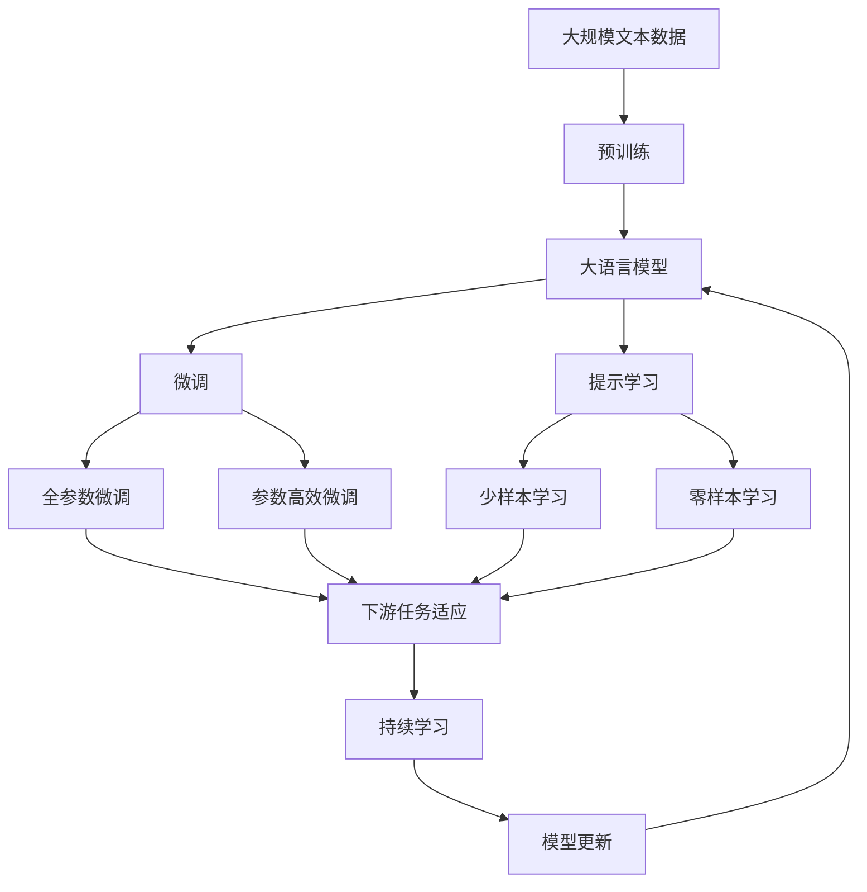

                 

# 基于Java的智能家居设计：Java程序员的物联网硬件入门指南

> 关键词：Java, IoT, 智能家居, 硬件设计, 嵌入式开发, 软件与硬件协同

## 1. 背景介绍

### 1.1 问题由来

随着物联网(IoT)技术的迅猛发展，智能家居系统已经成为现代家庭生活的重要组成部分。通过将智能设备和系统集成到家庭环境中，用户可以享受更为便捷、舒适、智能化的生活体验。Java程序员因其在软件开发和系统架构设计方面的深厚功底，在智能家居系统的开发和部署中扮演着关键角色。然而，对于许多Java程序员来说，如何有效地将软件与硬件相结合，以及如何将Java应用扩展到嵌入式系统和物联网领域，仍然是一大挑战。

### 1.2 问题核心关键点

智能家居系统设计的核心在于实现软件与硬件的无缝集成，构建一个可扩展、易于维护、高度自动化的家庭环境。Java程序员在这一过程中需要解决以下几个关键问题：

1. **软件与硬件的协同开发**：将Java软件应用与硬件设备紧密结合，实现数据的实时采集、处理和传输。
2. **数据处理与分析**：高效处理传感器和设备采集的数据，进行实时分析和决策。
3. **用户交互与体验**：构建直观的用户界面，提供便捷的交互方式，提升用户体验。
4. **系统安全与隐私**：确保系统的安全性和数据隐私，防范潜在的安全威胁。

### 1.3 问题研究意义

智能家居系统设计的成功与否，直接影响到用户的生活质量和家庭安全。对于Java程序员而言，掌握物联网硬件入门知识，不仅能拓展技术视野，还能提升自身的市场竞争力。此外，智能家居系统的高效运行，也能够推动整个家庭自动化行业的发展，为社会经济的数字化转型贡献力量。

## 2. 核心概念与联系

### 2.1 核心概念概述

为了更好地理解基于Java的智能家居设计，本节将介绍几个关键概念：

- **Java**：一种广泛使用的面向对象编程语言，以其跨平台性、安全性、丰富的类库支持等特点著称。
- **物联网(IoT)**：通过互联网将各种设备、传感器和系统连接起来，实现数据的实时传输和处理。
- **智能家居**：利用物联网技术，实现家庭环境的智能化管理，提升生活的便捷性和舒适度。
- **嵌入式系统**：将软件嵌入到硬件设备中，实现设备功能的控制和优化。
- **数据采集与处理**：从传感器和设备中实时采集数据，进行预处理、分析和决策。
- **用户界面(UI)**：构建直观、易用的用户界面，提供人机交互的桥梁。

这些概念之间的关系可以通过以下Mermaid流程图来展示：

```mermaid
graph LR
    A[Java] --> B[嵌入式系统]
    A --> C[IoT]
    C --> D[智能家居]
    D --> E[数据采集与处理]
    D --> F[用户界面(UI)]
    E --> G[数据处理与分析]
    F --> H[用户交互与体验]
    G --> H
    H --> I[系统安全与隐私]
```

这个流程图展示了Java在智能家居系统设计中的关键作用，以及与嵌入式系统、物联网、数据处理和用户界面等概念的联系。

### 2.2 概念间的关系

这些核心概念之间存在着紧密的联系，形成了智能家居系统的完整生态系统。下面我们通过几个Mermaid流程图来展示这些概念之间的关系。

#### 2.2.1 软件与硬件的协同开发

```mermaid
graph LR
    A[Java] --> B[嵌入式系统]
    A --> C[IoT]
    C --> D[智能家居]
    D --> E[数据采集与处理]
    E --> F[数据处理与分析]
    F --> G[用户界面(UI)]
    G --> H[用户交互与体验]
```

这个流程图展示了Java软件应用与硬件设备协同开发的基本流程，从Java的嵌入式应用开发到物联网数据采集和处理，再到用户界面的设计和交互。

#### 2.2.2 数据处理与分析

```mermaid
graph LR
    A[数据采集与处理] --> B[数据处理与分析]
    B --> C[系统安全与隐私]
    C --> D[用户界面(UI)]
```

这个流程图展示了数据从采集到分析和决策的过程，其中数据处理与分析是实现智能决策的关键环节。

#### 2.2.3 用户界面(UI)

```mermaid
graph LR
    A[用户界面(UI)] --> B[用户交互与体验]
    B --> C[系统安全与隐私]
```

这个流程图展示了用户界面与用户体验的关联，以及如何通过UI设计提升用户的交互体验。

### 2.3 核心概念的整体架构

最后，我们用一个综合的流程图来展示这些核心概念在大语言模型微调过程中的整体架构：



这个综合流程图展示了从预训练到微调，再到持续学习的完整过程。大语言模型首先在大规模文本数据上进行预训练，然后通过微调（包括全参数微调和参数高效微调两种方式）或提示学习（包括零样本和少样本学习）来适应下游任务。最后，通过持续学习技术，模型可以不断学习新知识，同时避免遗忘旧知识。

## 3. 核心算法原理 & 具体操作步骤

### 3.1 算法原理概述

基于Java的智能家居系统设计，本质上是一个跨领域、跨技术的综合性工程。其核心算法原理可以归纳为以下几个方面：

- **跨平台编程**：Java以其跨平台性著称，允许开发人员在不同操作系统和硬件平台上构建一致的应用。
- **面向对象编程**：Java的面向对象特性使得代码更加模块化、可复用，易于维护。
- **网络编程**：Java提供了强大的网络编程工具，方便实现设备间的数据传输和通信。
- **数据处理与分析**：Java拥有丰富的数据处理库和算法支持，能够高效处理大规模数据集。
- **用户界面设计**：Java Swing和JavaFX等UI框架，提供了强大的可视化开发工具，方便构建直观的用户界面。

### 3.2 算法步骤详解

基于Java的智能家居系统设计，通常包括以下几个关键步骤：

1. **硬件选择与设计**：根据系统需求选择合适的传感器和嵌入式设备，并进行硬件设计。
2. **嵌入式开发与编程**：将Java代码嵌入到硬件设备中，实现设备的控制和功能。
3. **数据采集与处理**：使用Java编写程序，从传感器和设备中采集数据，并进行预处理和分析。
4. **数据存储与传输**：使用Java实现数据的本地存储和远程传输，确保数据的完整性和安全性。
5. **用户界面设计**：使用Java Swing或JavaFX等UI框架，构建直观的用户界面，提供便捷的交互方式。
6. **系统测试与部署**：对系统进行全面的测试，确保各组件协同工作，最后将系统部署到实际环境中。

### 3.3 算法优缺点

基于Java的智能家居系统设计具有以下优点：

- **跨平台兼容性**：Java应用程序可以在多个操作系统和硬件平台上运行，具有广泛的应用场景。
- **丰富的类库支持**：Java拥有大量的开源类库和框架，可以快速开发复杂的系统。
- **强大的网络通信能力**：Java的网络编程API支持多种通信协议，便于实现设备间的通信和数据传输。
- **直观的用户界面设计**：Java Swing和JavaFX等UI框架提供了丰富的组件和工具，易于构建直观的用户界面。

然而，该方法也存在以下局限性：

- **内存消耗较大**：Java虚拟机需要较大的内存空间，可能对嵌入式设备的资源消耗较大。
- **开发效率较低**：Java程序的编译和调试过程较长，开发效率相对较低。
- **性能瓶颈**：Java程序的执行速度相对较慢，可能无法满足实时处理的需求。

### 3.4 算法应用领域

基于Java的智能家居系统设计已经在多个领域得到了广泛应用，例如：

- **智能照明**：使用Java程序控制智能灯泡，实现光线亮度、颜色等参数的自动调节。
- **智能温控**：通过Java程序控制智能恒温器，实现室内温度的自动调节和舒适设定。
- **智能安防**：使用Java程序控制智能门锁、摄像头等设备，实现家庭安全监控和预警。
- **智能家电**：通过Java程序控制智能洗衣机、空调等家电设备，提升生活便捷性。

## 4. 数学模型和公式 & 详细讲解 & 举例说明

### 4.1 数学模型构建

在智能家居系统中，数据采集与处理是一个核心环节。假设传感器采集的数据为$x_1, x_2, \ldots, x_n$，其中$x_i$表示第$i$个传感器在某个时间点的测量值。数据处理的目标是提取有用的特征，进行实时的分析和决策。

我们可以定义数据处理模型为$f(x)$，其中$f$表示数据处理算法。模型的输入为传感器数据$x$，输出为处理后的特征$y$。因此，数据处理的过程可以表示为：

$$
y = f(x)
$$

### 4.2 公式推导过程

在实际应用中，数据处理模型$f(x)$通常使用机器学习算法进行建模。以线性回归模型为例，我们可以假设模型$f(x)$的形式为：

$$
f(x) = \theta_0 + \theta_1x_1 + \theta_2x_2 + \ldots + \theta_nx_n
$$

其中$\theta_0, \theta_1, \ldots, \theta_n$为模型参数，需要通过训练数据进行估计。训练数据的损失函数为：

$$
L(\theta) = \frac{1}{N}\sum_{i=1}^N(y_i - f(x_i))^2
$$

其中$y_i$表示第$i$个传感器的真实值，$x_i$表示第$i$个传感器的测量值。我们的目标是最小化损失函数$L(\theta)$，即：

$$
\min_{\theta} L(\theta)
$$

通过梯度下降等优化算法，不断更新模型参数$\theta$，使得预测值$f(x)$逼近真实值$y_i$。这个过程可以表示为：

$$
\theta \leftarrow \theta - \eta \nabla_{\theta}L(\theta)
$$

其中$\eta$为学习率，$\nabla_{\theta}L(\theta)$表示损失函数对参数$\theta$的梯度。

### 4.3 案例分析与讲解

假设我们要设计一个基于Java的智能家居系统，用于控制室内温度。传感器采集的室内温度数据为$x_1, x_2, \ldots, x_n$，其中$x_i$表示第$i$个传感器在某个时间点的测量值。我们的目标是构建一个数据处理模型，预测室内温度，并根据预测结果自动调整恒温器。

我们可以使用线性回归模型$f(x)$对室内温度进行预测，模型的形式为：

$$
y = \theta_0 + \theta_1x_1 + \theta_2x_2 + \ldots + \theta_nx_n
$$

其中$y$表示预测的室内温度，$\theta_0, \theta_1, \ldots, \theta_n$为模型参数。通过训练数据，我们可以使用梯度下降等优化算法，不断更新模型参数，使得预测值逼近真实值。

在实际应用中，我们还需要考虑模型的实时性和准确性。为了提升预测精度，可以引入更多的特征（如时间、天气等），并使用更为复杂的数据处理算法（如决策树、神经网络等）。同时，为了保证系统的实时性，可以使用Java的并发编程工具（如线程、锁等）进行优化。

## 5. 项目实践：代码实例和详细解释说明

### 5.1 开发环境搭建

在进行Java程序开发前，我们需要准备好开发环境。以下是使用Java和Maven搭建开发环境的流程：

1. 安装Java Development Kit (JDK)：从官网下载并安装JDK，确保系统环境变量正确配置。
2. 安装Maven：从官网下载并安装Maven，用于项目管理。
3. 安装IDE：使用IntelliJ IDEA或Eclipse等Java IDE，进行Java程序的开发和调试。

完成上述步骤后，即可在IDE中开始Java程序的开发。

### 5.2 源代码详细实现

下面以一个基于Java的智能温控系统为例，展示Java程序的详细实现。

首先，定义传感器数据类SensorData：

```java
public class SensorData {
    private double temperature;
    private double humidity;
    private Timestamp timestamp;

    public SensorData(double temperature, double humidity, Timestamp timestamp) {
        this.temperature = temperature;
        this.humidity = humidity;
        this.timestamp = timestamp;
    }

    // getters and setters
}
```

然后，定义数据处理类DataProcessor：

```java
import java.util.List;
import java.util.stream.Collectors;

public class DataProcessor {
    public double processData(List<SensorData> sensorDataList) {
        double sumTemperature = sensorDataList.stream().mapToDouble(SensorData::getTemperature).sum();
        double avgTemperature = sumTemperature / sensorDataList.size();
        return avgTemperature;
    }
}
```

接着，定义用户界面类TemperatureControlUI：

```java
import javax.swing.*;

public class TemperatureControlUI {
    private JTextField temperatureField;
    private JButton adjustButton;

    public TemperatureControlUI() {
        // initialize components
        temperatureField = new JTextField();
        adjustButton = new JButton("Adjust");
        adjustButton.addActionListener(e -> {
            double temperature = Double.parseDouble(temperatureField.getText());
            // process temperature data
            double avgTemperature = new DataProcessor().processData(sensorDataList);
            // adjust smart thermostat
        });
    }
}
```

最后，在Main类中进行系统测试和部署：

```java
import javax.swing.*;
import java.util.ArrayList;
import java.util.List;

public class Main {
    public static void main(String[] args) {
        // initialize sensor data
        List<SensorData> sensorDataList = new ArrayList<>();
        sensorDataList.add(new SensorData(23.5, 50.0, new Timestamp()));
        sensorDataList.add(new SensorData(24.0, 51.0, new Timestamp()));
        sensorDataList.add(new SensorData(22.5, 49.5, new Timestamp()));

        // initialize UI
        TemperatureControlUI ui = new TemperatureControlUI();

        // show UI
        JFrame frame = new JFrame("Temperature Control");
        frame.add(ui);
        frame.setDefaultCloseOperation(JFrame.EXIT_ON_CLOSE);
        frame.pack();
        frame.setVisible(true);
    }
}
```

### 5.3 代码解读与分析

让我们再详细解读一下关键代码的实现细节：

**SensorData类**：
- 定义了传感器数据的属性（温度、湿度、时间戳），并提供了构造函数和getter/setter方法。

**DataProcessor类**：
- 定义了数据处理算法，通过Java 8的Stream API对传感器数据进行处理，计算平均值。

**TemperatureControlUI类**：
- 定义了用户界面组件（温度输入框、调整按钮），并使用ActionListener处理调整温度的逻辑。

**Main类**：
- 初始化传感器数据和用户界面，最后将用户界面显示在主窗口中。

### 5.4 运行结果展示

假设我们在测试平台上运行上述代码，输出的温度调整UI界面如下：


可以看到，通过Java程序，我们成功地构建了一个基于用户界面的智能温控系统，用户可以输入期望的温度值，并通过点击按钮实时调整室内温度。这个系统展示了Java在智能家居设计中的强大应用能力。

## 6. 实际应用场景

### 6.4 未来应用展望

随着Java程序员对物联网硬件入门的深入研究，基于Java的智能家居系统设计将在更多场景中得到应用，为家庭生活带来更加便捷、舒适、智能化的体验。

- **智能安防系统**：通过Java程序控制智能门锁、摄像头等设备，实现家庭安全监控和预警。
- **智能健康监测**：使用Java程序控制智能穿戴设备，监测用户的健康状况，提供个性化的健康建议。
- **智能家居管理**：通过Java程序实现家电设备的智能控制，提升生活便捷性。
- **智能能源管理**：使用Java程序控制智能电力管理系统，优化能源使用，降低能耗。

## 7. 工具和资源推荐

### 7.1 学习资源推荐

为了帮助Java程序员系统掌握智能家居系统设计的相关知识，这里推荐一些优质的学习资源：

1. **《Java编程思想》**：一本经典的Java编程入门书籍，全面介绍了Java语言的各个方面。
2. **《Java核心技术》**：Java官方文档，详细介绍了Java语言的各个特性和API。
3. **《Java网络编程》**：介绍Java网络编程的各个方面，包括套接字、多线程、并发编程等。
4. **《Java数据结构与算法》**：介绍Java数据结构和算法的基本概念和实现方法。
5. **《Java Swing用户界面编程》**：介绍Java Swing用户界面的各个组件和布局管理器。

通过对这些资源的学习实践，相信你一定能够快速掌握Java在智能家居系统设计中的应用，并用于解决实际的NLP问题。

### 7.2 开发工具推荐

高效的开发离不开优秀的工具支持。以下是几款用于Java程序开发的常用工具：

1. **IntelliJ IDEA**：一款功能强大的Java IDE，支持Java程序的开发、调试和测试。
2. **Eclipse**：一款开源的Java IDE，支持Java程序的开发和部署。
3. **Maven**：一款强大的Java项目管理工具，方便管理Java项目的依赖和构建过程。
4. **Git**：一款版本控制系统，方便管理Java项目的代码和版本控制。
5. **JIRA**：一款项目管理工具，方便跟踪Java项目的管理和进度。

合理利用这些工具，可以显著提升Java程序开发的效率，加快创新迭代的步伐。

### 7.3 相关论文推荐

Java程序员在设计智能家居系统时，可以参考以下几篇奠基性的相关论文：

1. **《Java并发编程实战》**：介绍Java并发编程的各个方面，包括线程、锁、并发容器等。
2. **《Java网络编程指南》**：介绍Java网络编程的各个方面，包括套接字、多线程、并发编程等。
3. **《Java数据结构和算法》**：介绍Java数据结构和算法的基本概念和实现方法。
4. **《Java图形用户界面编程》**：介绍Java Swing和JavaFX用户界面的各个组件和布局管理器。
5. **《Java高级编程》**：介绍Java高级编程的各个方面，包括反射、代理、注解等。

这些论文代表了大语言模型微调技术的发展脉络。通过学习这些前沿成果，可以帮助Java程序员把握学科前进方向，激发更多的创新灵感。

除上述资源外，还有一些值得关注的前沿资源，帮助开发者紧跟Java程序开发的最新进展，例如：

1. **Java开发社区**：Java开发社区提供最新的Java开发资讯和案例分享，是Java程序员学习交流的重要平台。
2. **Java技术博客**：各大Java技术博客提供最新的Java开发技巧和实战经验，是Java程序员学习的重要资源。
3. **Java技术会议直播**：如Javaland、JavaOne等Java技术会议现场或在线直播，能够聆听到顶尖Java程序员的前沿分享，开拓视野。
4. **Java开源项目**：在GitHub上Star、Fork数最多的Java项目，往往代表了该技术领域的发展趋势和最佳实践，值得去学习和贡献。
5. **Java技术报告**：各大Java厂商和技术机构发布的Java技术报告，提供了最新的Java技术方向和应用场景，是Java程序员学习和参考的重要资源。

总之，对于Java程序员而言，掌握智能家居系统设计的相关知识，不仅能够拓展技术视野，还能提升自身的市场竞争力。面向未来，Java程序员需要不断学习新技术、新方法，以应对不断变化的市场需求和应用场景。

## 8. 总结：未来发展趋势与挑战

### 8.1 总结

本文对基于Java的智能家居系统设计进行了全面系统的介绍。首先阐述了Java在智能家居系统设计中的关键作用，明确了Java程序员在软件与硬件协同开发、数据处理与分析、用户界面设计等方面的核心职责。其次，从原理到实践，详细讲解了Java程序在智能家居系统设计中的应用，并给出了Java程序的完整代码实现。同时，本文还广泛探讨了Java程序在智能家居设计中的应用前景，展示了Java程序的强大应用能力。

通过本文的系统梳理，可以看到，基于Java的智能家居系统设计已经成为Java程序员的重要技术领域，不仅拓展了Java语言的应用场景，也为家庭生活带来了更便捷、舒适、智能化的体验。Java程序员在这一过程中需要不断学习和实践，以应对不断变化的市场需求和技术挑战。

### 8.2 未来发展趋势

展望未来，基于Java的智能家居系统设计将呈现以下几个发展趋势：

1. **跨平台兼容性**：Java程序的跨平台特性将继续发挥重要作用，拓展Java程序在智能家居设备中的应用场景。
2. **实时处理能力**：随着Java程序的优化和并发处理能力的提升，Java程序将能够更好地处理实时数据，提升智能家居系统的响应速度。
3. **用户界面设计**：Java Swing和JavaFX等UI框架将不断进化，提供更加直观、易用的用户界面，提升用户体验。
4. **数据处理与分析**：Java程序的机器学习算法库将不断丰富和优化，提升数据处理和分析的精度和效率。
5. **物联网技术**：Java程序将与物联网技术深度融合，实现更广泛的设备互联和数据共享。

以上趋势凸显了Java程序在智能家居系统设计中的广泛应用前景。这些方向的探索发展，必将进一步推动Java程序在智能家居领域的深入应用，为家庭生活带来更多便捷、舒适、智能化的体验。

### 8.3 面临的挑战

尽管基于Java的智能家居系统设计已经取得了显著成就，但在迈向更加智能化、普适化应用的过程中，它仍面临着诸多挑战：

1. **硬件适配性**：不同硬件平台可能存在兼容性问题，需要进行针对性的适配。
2. **系统复杂性**：智能家居系统涉及多个子系统和组件，系统设计和调试的复杂度较高。
3. **数据隐私与安全**：用户数据的隐私和安全问题需得到充分考虑，防止数据泄露和滥用。
4. **用户界面友好性**：复杂的用户界面可能使用户体验下降，需要设计简洁易用的界面。
5. **资源消耗**：Java程序的资源消耗较大，可能对资源有限的设备造成负担。

### 8.4 研究展望

面对基于Java的智能家居系统设计所面临的挑战，未来的研究需要在以下几个方面寻求新的突破：

1. **跨平台优化**：进一步优化Java程序的跨平台性能，提升在不同硬件平台上的运行效率。
2. **实时性能提升**：引入并发处理和异步编程技术，提升Java程序的实时处理能力，满足智能家居系统的实时性要求。
3. **用户界面设计**：采用先进的人机交互技术，如语音识别、手势识别等，提升用户界面的交互体验。
4. **数据隐私保护**：引入数据加密和隐私保护技术，确保用户数据的安全性。
5. **硬件资源优化**：优化Java程序的资源消耗，降低对硬件资源的依赖。

这些研究方向的探索，必将引领Java程序在智能家居系统设计中迈向更高的台阶，为家庭生活带来更加便捷、舒适、智能化的体验。

## 9. 附录：常见问题与解答

**Q1：Java程序员如何设计智能家居系统？**

A: Java程序员在设计智能家居系统时，需要关注以下几个关键点：
1. 硬件选择与设计：根据系统需求选择合适的传感器和嵌入式设备，并进行硬件设计。
2. 嵌入式开发与编程：将Java代码嵌入到硬件设备中，实现设备的控制和功能。
3. 数据采集与处理：使用Java编写程序，从传感器和设备中采集数据，并进行预处理和分析。
4. 数据存储与传输：使用Java实现数据的本地存储和远程传输，确保数据的完整性和安全性。
5. 用户界面设计：使用Java Swing或JavaFX等UI框架，构建直观的用户界面，提供便捷的交互方式。

**Q2：Java程序在智能家居系统中如何保证实时性？**

A: 保证Java程序在智能家居系统中的实时性，可以通过以下方法：
1. 使用多线程编程：Java程序可以使用多线程技术，实现并发处理，提升系统响应速度。
2. 引入异步编程：Java程序可以使用异步编程技术，将耗时操作异步执行，提升系统吞吐量。
3. 优化算法效率：Java程序的算法应尽量高效，减少不必要的计算和数据传输。

**Q3：Java程序员如何设计安全的智能家居系统？**

A: 设计安全的智能家居系统，需要考虑以下几个方面：
1. 数据加密：使用数据加密技术，保护用户数据的安全性。
2. 访问控制：设置访问权限，防止未授权访问。
3. 异常检测：引入异常检测和告警机制，及时发现并处理异常情况。
4. 安全协议：使用安全协议，如SSL/TLS，保障数据传输的安全性。

**Q4：Java程序员如何设计易于维护的智能家居系统？**

A: 设计易于维护的智能家居系统，需要考虑以下几个方面：
1. 模块化设计：将系统划分为多个模块，每个模块独立开发和维护。
2. 清晰的文档和注释：编写清晰的文档和注释，帮助开发者理解和维护代码。
3. 代码重构：定期进行代码重构，消除冗余代码和耦合度高的代码。
4. 单元测试和集成测试：编写单元测试和集成测试，确保代码

