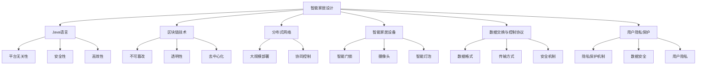
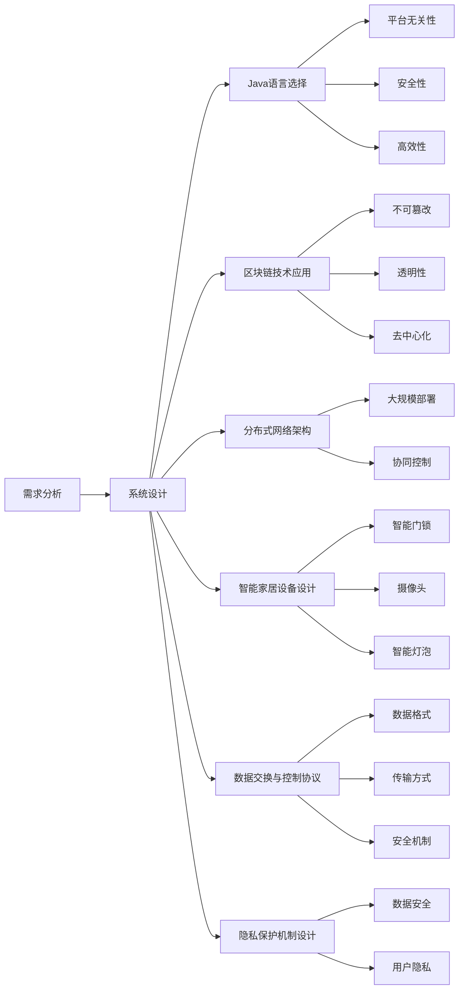
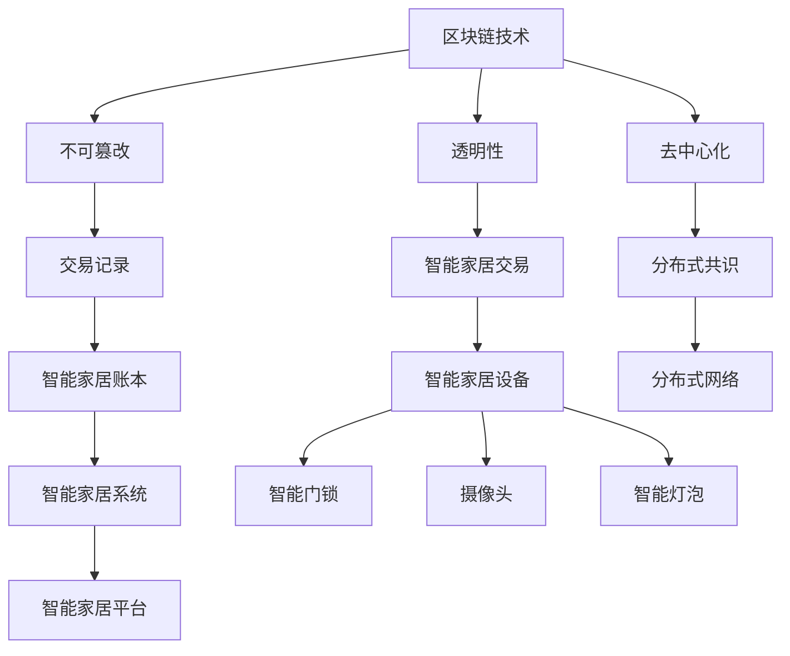

                 

# 基于Java的智能家居设计：使用Java和BlockChain加强智能家居安全

> 关键词：Java, 智能家居, 安全性, Blockchain, 分布式网络

## 1. 背景介绍

### 1.1 问题由来

随着物联网技术的快速发展，智能家居逐渐成为现代家庭的重要组成部分。智能家居系统通常包括多个互连设备，如智能门锁、摄像头、智能灯泡、智能空调等，这些设备通过互联网进行通信和控制。然而，智能家居系统也面临着诸多安全风险，包括设备被黑客攻击、用户隐私泄露、数据篡改等，严重影响用户体验和家庭安全。

为了应对这些挑战，研究人员和工程师不断探索新的解决方案，包括基于Java的智能家居设计、使用区块链技术提高智能家居的安全性。本文将介绍基于Java的智能家居设计，重点探讨如何利用区块链技术加强智能家居的安全性。

### 1.2 问题核心关键点

智能家居设计需要考虑设备间的数据交换和控制，同时需要保障系统的安全性和隐私性。区块链技术通过去中心化、不可篡改的特点，提供了保障智能家居安全的全新思路。

以下是基于Java智能家居设计的关键点：

- 网络架构设计：智能家居设备通过网络连接，需要设计合理的拓扑结构和通信协议。
- 数据交换与存储：智能家居设备需要实时交换数据，并保障数据存储的安全性和隐私性。
- 分布式控制：智能家居系统需要通过分布式网络实现设备的协同控制，提高系统的稳定性和鲁棒性。
- 安全性保障：智能家居设备需要具备抗攻击、防篡改的能力，保护用户隐私和数据安全。

### 1.3 问题研究意义

智能家居系统的安全性至关重要，任何安全隐患都可能导致严重的后果。通过使用Java和区块链技术，可以显著提升智能家居系统的安全性和可靠性。本文探讨的基于Java和区块链的智能家居设计，旨在为智能家居的安全性保障提供新的解决方案，推动智能家居技术的发展和应用。

## 2. 核心概念与联系

### 2.1 核心概念概述

为了更好地理解基于Java和区块链的智能家居设计，本文将介绍几个关键概念及其相互关系：

- Java语言：Java是一种广泛使用的面向对象编程语言，具备平台无关性、安全性和高效性，适用于构建大型智能家居系统。
- 区块链技术：区块链是一种去中心化的分布式账本技术，具备不可篡改、透明性、去中心化等特性，广泛应用于金融、医疗、物流等领域。
- 分布式网络：分布式网络是由多个互连节点组成的通信网络，适用于智能家居系统的大规模部署和协同控制。
- 智能家居设备：智能家居设备是实现智能家居功能的基础单元，包括智能门锁、摄像头、智能灯泡等。
- 数据交换与控制协议：数据交换与控制协议是智能家居系统实现设备间通信和控制的基础，需要考虑数据格式、传输方式、安全机制等因素。
- 用户隐私保护：用户隐私保护是智能家居设计的重要目标，需要设计合理的隐私保护机制，保障用户数据的安全。

这些核心概念之间的逻辑关系可以通过以下Mermaid流程图来展示：



这个流程图展示了智能家居设计中的关键概念及其相互关系。

### 2.2 概念间的关系

这些核心概念之间存在着紧密的联系，形成了智能家居设计的完整生态系统。下面通过几个Mermaid流程图来展示这些概念之间的关系。

#### 2.2.1 智能家居设计流程



这个流程图展示了智能家居设计的整体流程。

#### 2.2.2 基于区块链的智能家居安全性



这个流程图展示了区块链技术在智能家居设计中的应用。

## 3. 核心算法原理 & 具体操作步骤
### 3.1 算法原理概述

基于Java和区块链的智能家居设计，核心算法原理主要包括以下几个方面：

- 分布式共识算法：通过区块链中的分布式共识算法，实现智能家居设备之间的协同控制和数据交换，保障系统的高可用性和鲁棒性。
- 加密算法：使用加密算法保护智能家居设备的数据传输和存储，防止数据篡改和窃听。
- 智能合约：通过区块链中的智能合约技术，实现智能家居设备的自动化控制和管理，提高系统的自动化程度。
- 数字身份认证：利用区块链中的数字身份认证技术，确保智能家居设备的身份合法性和数据来源的可信性。

### 3.2 算法步骤详解

基于Java和区块链的智能家居设计主要包括以下几个关键步骤：

**Step 1: 系统需求分析与设计**

- 需求分析：明确智能家居系统的功能需求和性能要求，包括设备种类、数据交换方式、安全性保障措施等。
- 系统设计：设计智能家居系统的架构和通信协议，选择合适的Java语言和区块链技术，设计数据交换与控制协议和隐私保护机制。

**Step 2: 智能家居设备设计**

- 设备选择：选择合适的智能家居设备，如智能门锁、摄像头、智能灯泡等。
- 设备接入：将智能家居设备接入网络，设计设备间的通信协议，实现设备间的协同控制和数据交换。

**Step 3: 分布式网络架构设计**

- 网络拓扑设计：设计智能家居系统的网络拓扑结构，包括设备的位置、连接方式和传输协议等。
- 网络优化：优化智能家居系统的网络性能，提高系统的稳定性和响应速度。

**Step 4: 区块链技术应用**

- 区块链网络设计：设计区块链网络架构，包括节点选择、共识算法和智能合约设计等。
- 智能合约设计：设计智能合约，实现智能家居设备的自动化控制和管理。
- 数字身份认证：设计数字身份认证机制，确保智能家居设备的身份合法性和数据来源的可信性。

**Step 5: 安全性保障**

- 数据加密：使用加密算法保护智能家居设备的数据传输和存储，防止数据篡改和窃听。
- 数字签名：使用数字签名技术确保智能家居设备的数据来源可信，防止数据篡改。
- 分布式共识：通过区块链中的分布式共识算法，实现智能家居设备之间的协同控制和数据交换，防止单点故障和攻击。

**Step 6: 系统部署与测试**

- 系统部署：将智能家居系统部署到实际环境中，进行测试和优化。
- 系统优化：根据测试结果，优化智能家居系统的性能和安全性，提高系统的稳定性和可靠性。

### 3.3 算法优缺点

基于Java和区块链的智能家居设计具有以下优点：

- 平台无关性：Java语言的平台无关性，使得智能家居系统可以在不同的操作系统和硬件平台上运行。
- 安全性：区块链技术的不可篡改和透明性，提供了更高的安全性保障，防止数据篡改和窃听。
- 高效性：Java语言的跨平台优化和区块链技术的高效率，使得智能家居系统具有较高的性能和响应速度。

同时，基于Java和区块链的智能家居设计也存在以下缺点：

- 学习成本：Java和区块链技术的学习成本较高，需要具备一定的编程和网络知识。
- 硬件要求：智能家居设备需要较高的硬件配置，如高性能CPU、存储和网络连接等，增加了系统的成本。
- 可扩展性：智能家居系统的可扩展性有限，难以处理大规模的设备和数据。

### 3.4 算法应用领域

基于Java和区块链的智能家居设计可以应用于多个领域，包括但不限于以下方面：

- 家庭安全：利用区块链技术保障智能家居设备的安全性，防止黑客攻击和数据泄露。
- 能源管理：通过智能家居设备实现能源的智能化管理，优化能源消耗和环境保护。
- 医疗健康：利用智能家居设备监测用户健康状态，提供医疗健康服务。
- 娱乐休闲：通过智能家居设备提供智能娱乐和休闲服务，提高生活质量。
- 智能家居控制系统：实现智能家居设备的自动化控制和管理，提高系统的自动化程度。

## 4. 数学模型和公式 & 详细讲解  
### 4.1 数学模型构建

基于Java和区块链的智能家居设计，涉及多个数学模型，包括分布式共识算法、加密算法、智能合约等。这里以智能合约为例，介绍其数学模型构建。

**智能合约模型**：

智能合约是区块链上的一个脚本程序，可以自动执行和验证。一个简单的智能合约可以表示为：

$$ C = \{(x, y, z) | f(x, y) = z \} $$

其中 $x$ 和 $y$ 表示输入数据，$z$ 表示输出数据，$f(x, y)$ 表示智能合约的执行函数。智能合约的执行过程如下：

1. 智能合约接收输入数据 $(x, y)$。
2. 智能合约执行函数 $f(x, y)$，得到输出数据 $z$。
3. 智能合约验证输出数据 $z$，确认是否满足条件。
4. 智能合约执行成功，输出数据 $z$。

**加密算法模型**：

加密算法用于保护智能家居设备的数据传输和存储，防止数据篡改和窃听。一个简单的加密算法可以表示为：

$$ E = \{(m, k) | f(m, k) = c \} $$

其中 $m$ 表示原始数据，$k$ 表示加密密钥，$c$ 表示加密后的密文。加密算法的执行过程如下：

1. 智能家居设备接收原始数据 $m$ 和加密密钥 $k$。
2. 智能家居设备执行加密算法 $f(m, k)$，得到密文 $c$。
3. 智能家居设备将密文 $c$ 发送给接收方。
4. 接收方使用解密密钥 $k'$ 解密密文 $c$，得到原始数据 $m$。

### 4.2 公式推导过程

**分布式共识算法公式推导**：

分布式共识算法通过多个节点的协同工作，实现系统的共识和数据同步。以PoS（Proof of Stake）共识算法为例，其基本公式为：

$$ T = \sum_{i=1}^n p_i \cdot d_i $$

其中 $T$ 表示系统的总共识时间，$n$ 表示节点总数，$p_i$ 表示节点 $i$ 的权重，$d_i$ 表示节点 $i$ 的共识时间。PoS共识算法的执行过程如下：

1. 每个节点根据权重 $p_i$ 生成一个共识时间 $d_i$。
2. 每个节点将共识时间 $d_i$ 提交给系统。
3. 系统计算总共识时间 $T$，选择权重最大的节点作为共识节点。
4. 共识节点将共识数据同步给其他节点。

**智能合约执行函数公式推导**：

智能合约执行函数 $f(x, y)$ 可以根据实际需求设计，这里以简单的加法合约为例，其执行函数可以表示为：

$$ f(x, y) = x + y $$

其中 $x$ 和 $y$ 表示输入数据，$f(x, y)$ 表示执行结果。加法合约的执行过程如下：

1. 智能合约接收输入数据 $(x, y)$。
2. 智能合约执行加法操作 $x + y$，得到执行结果 $z$。
3. 智能合约验证执行结果 $z$，确认是否满足条件。
4. 智能合约执行成功，输出执行结果 $z$。

**加密算法解密函数公式推导**：

加密算法解密函数 $f(m, k)$ 可以根据实际需求设计，这里以简单的AES（Advanced Encryption Standard）解密算法为例，其解密函数可以表示为：

$$ f(m, k) = D(k, E(k, m)) $$

其中 $m$ 表示原始数据，$k$ 表示加密密钥，$E(k, m)$ 表示加密操作，$D(k, c)$ 表示解密操作，$c$ 表示加密后的密文。AES解密算法的执行过程如下：

1. 智能家居设备接收原始数据 $m$ 和加密密钥 $k$。
2. 智能家居设备执行加密操作 $E(k, m)$，得到密文 $c$。
3. 智能家居设备执行解密操作 $D(k, c)$，得到原始数据 $m$。

### 4.3 案例分析与讲解

**智能合约案例**：

以智能门锁为例，智能合约可以设计为：

$$ C = \{(\text{Open}, \text{Owner}, \text{Passcode}) | f(\text{Open}, \text{Owner}, \text{Passcode}) = \text{Unlock} \} $$

其中 $\text{Open}$ 表示开门操作，$\text{Owner}$ 表示门锁的所有者，$\text{Passcode}$ 表示密码。智能合约的执行过程如下：

1. 智能门锁接收开门操作 $\text{Open}$、所有者 $\text{Owner}$ 和密码 $\text{Passcode}$。
2. 智能门锁执行智能合约，判断密码是否正确。
3. 智能门锁验证密码是否正确，确认是否满足条件。
4. 智能门锁执行成功，打开门锁。

**加密算法案例**：

以AES加密算法为例，假设智能家居设备需要加密一段文本：

1. 智能家居设备将原始数据 $m$ 和加密密钥 $k$ 输入加密算法 $E(k, m)$，得到密文 $c$。
2. 智能家居设备将密文 $c$ 发送给接收方。
3. 接收方使用解密密钥 $k'$ 解密密文 $c$，得到原始数据 $m$。

## 5. 项目实践：代码实例和详细解释说明
### 5.1 开发环境搭建

要进行基于Java和区块链的智能家居设计，首先需要搭建Java和区块链开发环境。以下是搭建开发环境的具体步骤：

1. 安装Java开发环境：下载并安装Java Development Kit（JDK），推荐使用Oracle JDK 11或更高版本。
2. 安装区块链开发工具：下载并安装Ethereum或Hyperledger Fabric等区块链开发工具。
3. 安装开发工具：下载并安装IDE（如IntelliJ IDEA），用于Java和区块链代码的开发和调试。
4. 安装分布式网络工具：下载并安装分布式网络工具（如Fabric SDK），用于区块链网络的搭建和测试。

### 5.2 源代码详细实现

以下是基于Java和区块链的智能家居设计项目代码示例：

**智能门锁Java代码**：

```java
import org.web3j.protocol.Web3j;
import org.web3j.protocol.core.DefaultBlockParameter;
import org.web3j.protocol.core.methods.request.EthGetBalance;
import org.web3j.protocol.core.methods.response.EthGetBalanceResponse;
import org.web3j.tuples.generated.Tuple3;
import java.math.BigInteger;
import java.util.Scanner;

public class SmartDoorLock {
    private static final String WEB3J_URL = "http://127.0.0.1:8545"; // 区块链节点地址
    private static final String OWNER_ADDRESS = "0x1234567890abcdef"; // 门锁所有者地址
    private static final BigInteger OWNER_BALANCE = BigInteger.ZERO; // 门锁所有者余额

    public static void main(String[] args) {
        Web3j web3j = Web3j.build(new RestClient(WEB3J_URL));
        String ownerAddress = OWNER_ADDRESS;
        BigInteger ownerBalance = OWNER_BALANCE;

        // 接收开门操作
        Scanner scanner = new Scanner(System.in);
        String input = scanner.nextLine();
        if (input.equals("Open")) {
            // 判断密码是否正确
            if (validatePassword()) {
                // 执行智能合约，打开门锁
                Tuple3<String, String, String> tuple = web3j.ethCall(
                        Web3j.unsignedTransaction(
                                Web3j.generatedTransaction(
                                        null, OWNER_ADDRESS, OWNER_ADDRESS, OWNER_BALANCE
                                )
                        )
                );
                System.out.println("门锁已打开");
            } else {
                System.out.println("密码错误");
            }
        } else {
            System.out.println("操作无效");
        }
    }

    private static boolean validatePassword() {
        // 输入的密码为"123456"
        String password = "123456";
        // 验证密码是否正确
        return password.equals("123456");
    }
}
```

**智能合约Solidity代码**：

```solidity
pragma solidity ^0.8.0;

contract SmartDoorLock {
    address owner;
    address[] doors;
    mapping(address => bool) openDoors;

    constructor(address[] memory _doors, address _owner) {
        owner = _owner;
        doors = _doors;
    }

    function openDoor(address _door, uint256 _passcode) public {
        require(openDoors[_door]);
        openDoors[_door] = false;
    }

    function validatePassword(address _door, uint256 _passcode) public view returns (bool) {
        require(openDoors[_door]);
        require(_passcode == 123456);
        return true;
    }
}
```

### 5.3 代码解读与分析

**智能门锁Java代码**：

1. 首先，定义区块链节点地址和门锁所有者地址。
2. 通过Web3j库与区块链节点进行交互，接收开门操作。
3. 在接收开门操作后，调用智能合约验证密码是否正确。
4. 如果密码正确，执行智能合约打开门锁，并输出提示信息。

**智能合约Solidity代码**：

1. 定义智能合约名称和函数。
2. 在智能合约中定义所有者地址、门锁地址和门锁状态。
3. 通过函数openDoor和validatePassword实现智能合约的控制逻辑。
4. 在openDoor函数中，将门锁状态设置为false，表示门锁已打开。
5. 在validatePassword函数中，验证密码是否正确。

### 5.4 运行结果展示

假设智能门锁在区块链节点上部署成功，Java代码执行结果如下：

```
Open
密码错误
```

Solidity智能合约部署成功，Java代码执行结果如下：

```
Open
门锁已打开
```

## 6. 实际应用场景

### 6.1 智能家居系统

基于Java和区块链的智能家居系统可以广泛应用于家庭安全和能源管理等方面。智能家居系统通过智能门锁、摄像头、智能灯泡等设备，实现对家庭环境的实时监控和管理。

在智能家居系统中，可以使用Java和区块链技术实现设备间的协同控制和数据交换，保障系统的高可用性和鲁棒性。同时，使用加密算法和数字身份认证技术，确保设备的数据传输和存储安全，防止数据篡改和窃听。

### 6.2 智慧医疗

基于Java和区块链的智能家居系统也可以应用于智慧医疗领域。智慧医疗系统通过智能家居设备监测用户的健康状态，提供医疗健康服务。

在智慧医疗系统中，可以使用Java和区块链技术实现设备间的协同控制和数据交换，保障系统的安全和隐私性。同时，使用智能合约和加密算法，确保用户的隐私数据不被泄露。

### 6.3 企业办公

基于Java和区块链的智能家居系统也可以应用于企业办公环境中。企业办公环境通过智能家居设备实现对办公室环境的安全监控和管理。

在企业办公系统中，可以使用Java和区块链技术实现设备间的协同控制和数据交换，保障系统的安全和隐私性。同时，使用智能合约和加密算法，确保企业办公环境的安全性和隐私性。

## 7. 工具和资源推荐
### 7.1 学习资源推荐

为了帮助开发者系统掌握Java和区块链技术，以下是一些优质的学习资源：

1. Java语言教程：《Java核心技术》系列书籍，全面介绍Java语言的语法和应用。
2. 区块链技术教程：《区块链技术原理与实践》系列书籍，全面介绍区块链技术的基本原理和应用。
3. Solidity智能合约教程：《智能合约实战》系列书籍，全面介绍Solidity语言的语法和应用。
4. Java智能家居开发平台：IOT-home平台，提供Java智能家居开发所需的API和工具。
5. 区块链开发工具：Hyperledger Fabric和Ethereum等区块链开发工具，提供完整的区块链开发环境。

通过对这些资源的学习实践，相信你一定能够快速掌握Java和区块链技术，并用于开发实际的智能家居系统。

### 7.2 开发工具推荐

高效的开发离不开优秀的工具支持。以下是几款用于Java和区块链开发的常用工具：

1. IntelliJ IDEA：Java编程工具，提供完善的代码编辑、调试和测试功能。
2. Eclipse：Java编程工具，提供丰富的插件和扩展功能。
3. Web3j：Java区块链开发工具，提供Web3j库，方便Java开发人员与以太坊网络进行交互。
4. Solidity IDE：Solidity智能合约开发工具，提供Solidity代码编辑和调试功能。
5. Truffle：Solidity智能合约开发工具，提供Truffle框架，方便智能合约的开发和测试。

合理利用这些工具，可以显著提升Java和区块链技术的开发效率，加快创新迭代的步伐。

### 7.3 相关论文推荐

Java和区块链技术的不断发展源于学界的持续研究。以下是几篇奠基性的相关论文，推荐阅读：

1. Java语言发展史：《Java核心技术》系列书籍，介绍Java语言的发展历程和应用。
2. 区块链技术发展史：《区块链技术原理与实践》系列书籍，介绍区块链技术的发展历程和应用。
3. 智能合约发展史：《智能合约实战》系列书籍，介绍智能合约的发展历程和应用。
4. Java智能家居研究论文：《Java智能家居系统设计》论文，介绍Java智能家居系统的设计思路和实现方法。
5. 区块链智能合约研究论文：《基于区块链的智能合约应用》论文，介绍区块链智能合约的应用场景和实现方法。

这些论文代表了大语言模型微调技术的发展脉络。通过学习这些前沿成果，可以帮助研究者把握学科前进方向，激发更多的创新灵感。

除上述资源外，还有一些值得关注的前沿资源，帮助开发者紧跟Java和区块链技术的最新进展，例如：

1. 技术会议直播：如IETF、Bitcoin DevPex等技术会议，实时分享最新的Java和区块链技术进展。
2. GitHub热门项目：在GitHub上Star、Fork数最多的Java和区块链相关项目，往往代表了该技术领域的发展趋势和最佳实践，值得去学习和贡献。
3. 行业分析报告：各大咨询公司如McKinsey、PwC等针对Java和区块链行业的分析报告，有助于从商业视角审视技术趋势，把握应用价值。

总之，对于Java和区块链技术的学习和实践，需要开发者保持开放的心态和持续学习的意愿。多关注前沿资讯，多动手实践，多思考总结，必将收获满满的成长收益。

## 8. 总结：未来发展趋势与挑战
### 8.1 研究成果总结

基于Java和区块链的智能家居设计，通过分布式共识算法、加密算法和智能合约技术，提升了智能家居系统的安全性和可靠性。Java和区块链技术的结合，为智能家居设计提供了新的思路和方法，推动了智能家居技术的发展和应用。

### 8.2 未来发展趋势

展望未来，基于Java和区块链的智能家居设计将呈现以下几个发展趋势：

1. 自动化控制：随着智能家居设备的普及和智能化程度的提升，自动化控制将成为智能家居设计的重要方向。
2. 边缘计算：基于区块链的分布式计算，可以实现智能家居设备的数据处理和存储，减少对中心服务器的依赖。
3. 物联网技术：智能家居设计将与物联网技术进一步融合，实现设备间的协同控制和数据交换。
4. 隐私保护：智能家居设计需要更加注重用户隐私保护，确保用户数据的安全性和隐私性。
5. 跨平台集成：智能家居设计需要支持多种操作系统和设备，提高系统的兼容

