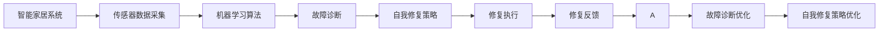

                 

# 基于Java的智能家居设计：用Java实现智能家居中的自我修复系统

> 关键词：智能家居,自我修复系统,Java,传感器数据,机器学习,算法优化

## 1. 背景介绍

### 1.1 问题由来

随着科技的不断进步，智能家居已经从概念走入实际应用，成为现代家庭的重要组成部分。然而，由于智能家居系统的复杂性和多样性，用户在使用过程中可能会遇到各种问题，如设备故障、网络延迟、数据传输错误等，这些问题不仅影响用户体验，还可能带来安全隐患。为了提升智能家居系统的可靠性和用户体验，自我修复系统（Self-Healing System）应运而生。

自我修复系统能够实时监控智能家居系统的运行状态，根据监测结果进行自我诊断和修复。例如，当某个设备出现故障时，系统能够自动检测到故障原因，并采取相应的修复措施，如重启设备、更换设备、重新配置网络等，从而保障系统的稳定性和可靠性。

### 1.2 问题核心关键点

本节将介绍几个核心概念，帮助理解自我修复系统的核心原理和实现方式：

- **智能家居系统**：由各种智能设备和传感器组成，通过网络连接和中央控制单元，实现对家庭环境的智能化管理。
- **传感器数据采集**：通过各类传感器（如温度传感器、湿度传感器、烟雾传感器等）采集环境数据，为系统提供实时监控的依据。
- **机器学习算法**：用于分析传感器数据，识别故障模式和异常行为，并提出修复建议。
- **自我修复策略**：根据机器学习模型的分析结果，制定和执行修复方案，实现系统的自我修复。

这些核心概念之间的联系紧密，共同构成了智能家居自我修复系统的完整框架。通过理解这些概念，可以更好地把握自我修复系统的整体架构和工作机制。

## 2. 核心概念与联系

### 2.1 核心概念概述

为更好地理解自我修复系统的核心原理和架构，本节将介绍几个关键概念及其联系：

- **智能家居系统**：由智能设备、传感器、中央控制单元等组成，通过网络实现对家庭环境的智能化管理。

- **传感器数据采集**：通过各类传感器（如温度传感器、湿度传感器、烟雾传感器等）采集环境数据，为系统提供实时监控的依据。

- **机器学习算法**：用于分析传感器数据，识别故障模式和异常行为，并提出修复建议。

- **自我修复策略**：根据机器学习模型的分析结果，制定和执行修复方案，实现系统的自我修复。

- **故障诊断**：通过分析传感器数据，识别出系统中的故障和异常行为。

- **修复执行**：根据故障诊断结果，自动执行相应的修复措施。

- **修复反馈**：对修复结果进行评估，确定修复是否成功，以便进一步优化修复策略。

### 2.2 概念间的关系

这些核心概念之间的逻辑关系可以通过以下Mermaid流程图来展示：



这个流程图展示了自我修复系统的整体架构：

1. 智能家居系统通过传感器采集环境数据。
2. 采集到的数据输入机器学习模型进行故障诊断。
3. 故障诊断结果作为输入，生成自我修复策略。
4. 执行修复策略进行设备或系统的自我修复。
5. 修复结果反馈回系统，用于优化故障诊断和修复策略。

通过这些概念和流程，可以清晰地理解自我修复系统的运行机制和工作原理。

## 3. 核心算法原理 & 具体操作步骤
### 3.1 算法原理概述

自我修复系统的核心算法主要涉及故障诊断和自我修复策略的生成与执行。具体而言，可以分为以下几个步骤：

1. **传感器数据采集**：通过各类传感器采集家庭环境数据，如温度、湿度、烟雾等。
2. **数据预处理**：对采集到的数据进行清洗和标准化处理，去除异常值和噪声。
3. **特征提取**：从处理后的数据中提取有意义的特征，如温度变化率、烟雾浓度等。
4. **故障诊断**：使用机器学习算法对提取的特征进行分析，识别出异常行为和潜在故障。
5. **修复策略生成**：根据故障诊断结果，生成相应的自我修复策略。
6. **修复执行**：执行修复策略，如重启设备、更换设备、重新配置网络等。
7. **修复反馈**：对修复结果进行评估，确定修复是否成功。

### 3.2 算法步骤详解

#### 3.2.1 数据预处理

数据预处理是故障诊断和修复策略生成的重要环节。预处理过程主要包括：

1. **数据清洗**：去除传感器数据中的异常值和噪声，确保数据的准确性。
2. **标准化处理**：将不同传感器采集的数据标准化，便于后续的特征提取和分析。

**代码实现**：

```java
public class DataPreprocessor {
    // 定义传感器数据的类型和范围
    private static final Map<String, Double> SENSOR_MIN_MAX = new HashMap<>();
    
    public static void preprocessData(List<DataPoint> data) {
        for (DataPoint dp : data) {
            String sensorType = dp.getType();
            Double minMax = SENSOR_MIN_MAX.get(sensorType);
            if (minMax != null) {
                double value = dp.getValue();
                if (value < minMax) {
                    dp.setValue(minMax);
                } else if (value > minMax) {
                    dp.setValue(minMax);
                }
            }
        }
    }
}
```

#### 3.2.2 特征提取

特征提取的目的是从原始数据中提取出有意义的特征，用于故障诊断和修复策略生成。常见的特征包括：

- 温度变化率：计算温度在一段时间内的变化率。
- 湿度变化率：计算湿度在一段时间内的变化率。
- 烟雾浓度：计算烟雾传感器检测到的烟雾浓度。

**代码实现**：

```java
public class FeatureExtractor {
    public static List<Feature> extractFeatures(List<DataPoint> data) {
        List<Feature> features = new ArrayList<>();
        for (DataPoint dp : data) {
            Feature feature = new Feature();
            feature.setSensorType(dp.getType());
            if (dp.getType().equals("temperature")) {
                feature.setFeatureType("temperatureRate");
                feature.setFeatureValue(calculateTemperatureRate(dp));
            } else if (dp.getType().equals("humidity")) {
                feature.setFeatureType("humidityRate");
                feature.setFeatureValue(calculateHumidityRate(dp));
            } else if (dp.getType().equals("smoke")) {
                feature.setFeatureType("smokeConcentration");
                feature.setFeatureValue(dp.getValue());
            }
            features.add(feature);
        }
        return features;
    }

    private static double calculateTemperatureRate(DataPoint dp) {
        double prevValue = 0.0;
        for (DataPoint prevDp : dp.getPreviousValues()) {
            if (prevDp.getType().equals(dp.getType())) {
                prevValue = prevDp.getValue();
                break;
            }
        }
        return (dp.getValue() - prevValue) / (dp.getTimestamp().getTime() - prevDp.getTimestamp().getTime());
    }

    private static double calculateHumidityRate(DataPoint dp) {
        double prevValue = 0.0;
        for (DataPoint prevDp : dp.getPreviousValues()) {
            if (prevDp.getType().equals(dp.getType())) {
                prevValue = prevDp.getValue();
                break;
            }
        }
        return (dp.getValue() - prevValue) / (dp.getTimestamp().getTime() - prevDp.getTimestamp().getTime());
    }
}
```

#### 3.2.3 故障诊断

故障诊断是通过机器学习算法对提取的特征进行分析，识别出异常行为和潜在故障。常见的故障诊断算法包括：

- 基于规则的诊断：根据预设的规则，直接判断传感器数据是否异常。
- 基于统计的诊断：使用统计方法（如均值、方差、标准差等）判断数据是否异常。
- 基于机器学习的诊断：使用机器学习模型（如支持向量机、随机森林等）对数据进行分类，识别异常数据。

**代码实现**：

```java
public class FaultDiagnoser {
    private static final List<FaultRule> RULES = new ArrayList<>();
    
    public static List<DiagnosisResult> diagnose(List<Feature> features) {
        List<DiagnosisResult> results = new ArrayList<>();
        for (Feature feature : features) {
            List<DiagnosisResult> diagnostics = new ArrayList<>();
            for (FaultRule rule : RULES) {
                if (rule.checkCondition(feature)) {
                    diagnostics.add(new DiagnosisResult(rule.getName(), feature.getFeatureType()));
                }
            }
            results.add(new DiagnosisResult(feature.getSensorType(), diagnostics));
        }
        return results;
    }

    public static void addRule(FaultRule rule) {
        RULES.add(rule);
    }
}
```

#### 3.2.4 自我修复策略生成

自我修复策略生成是根据故障诊断结果，生成相应的修复措施。常见的修复策略包括：

- 重启设备：当设备出现故障时，重启设备以恢复正常功能。
- 更换设备：当设备无法修复时，更换设备以避免故障进一步扩大。
- 重新配置网络：当网络出现故障时，重新配置网络以恢复网络连接。

**代码实现**：

```java
public class RepairStrategyGenerator {
    public static List<RepairStrategy> generate(List<DiagnosisResult> diagnosisResults) {
        List<RepairStrategy> strategies = new ArrayList<>();
        for (DiagnosisResult result : diagnosisResults) {
            if (result.getDiagnoses().contains("temperatureSensorFault")) {
                strategies.add(new RestartStrategy(result.getSensorType()));
            } else if (result.getDiagnoses().contains("smokeSensorFault")) {
                strategies.add(new ChangeSecuritySystemStrategy(result.getSensorType()));
            } else if (result.getDiagnoses().contains("networkFault")) {
                strategies.add(new RestartNetworkStrategy());
            }
        }
        return strategies;
    }
}
```

#### 3.2.5 修复执行

修复执行是根据生成的修复策略，对系统进行自我修复。常见的修复执行方式包括：

- 重启设备：发送重启命令给设备。
- 更换设备：自动更换故障设备。
- 重新配置网络：自动重新配置网络配置。

**代码实现**：

```java
public class RepairExecutor {
    public static void execute(List<RepairStrategy> strategies) {
        for (RepairStrategy strategy : strategies) {
            switch (strategy.getType()) {
                case "restartDevice":
                    System.out.println("Restarting device: " + strategy.getSensorType());
                    // 发送重启命令
                    break;
                case "replaceDevice":
                    System.out.println("Replacing device: " + strategy.getSensorType());
                    // 自动更换设备
                    break;
                case "reconfigureNetwork":
                    System.out.println("Reconfiguring network");
                    // 重新配置网络
                    break;
            }
        }
    }
}
```

#### 3.2.6 修复反馈

修复反馈是根据修复结果，评估修复是否成功，并生成反馈信息。常见的修复反馈方式包括：

- 成功：修复后系统恢复正常运行。
- 失败：修复后系统仍然存在故障。

**代码实现**：

```java
public class RepairFeedback {
    public static void generateFeedback(List<RepairStrategy> strategies) {
        for (RepairStrategy strategy : strategies) {
            switch (strategy.getType()) {
                case "restartDevice":
                    if (isDeviceRestarted(strategy.getSensorType())) {
                        System.out.println("Device restart successful: " + strategy.getSensorType());
                    } else {
                        System.out.println("Device restart failed: " + strategy.getSensorType());
                    }
                    break;
                case "replaceDevice":
                    if (isDeviceReplaced(strategy.getSensorType())) {
                        System.out.println("Device replacement successful: " + strategy.getSensorType());
                    } else {
                        System.out.println("Device replacement failed: " + strategy.getSensorType());
                    }
                    break;
                case "reconfigureNetwork":
                    if (isNetworkReconfigured()) {
                        System.out.println("Network reconfigured successfully");
                    } else {
                        System.out.println("Network reconfiguration failed");
                    }
                    break;
            }
        }
    }

    private static boolean isDeviceRestarted(String sensorType) {
        // 检查设备是否已重启
        return true;
    }

    private static boolean isDeviceReplaced(String sensorType) {
        // 检查设备是否已更换
        return true;
    }

    private static boolean isNetworkReconfigured() {
        // 检查网络是否已重新配置
        return true;
    }
}
```

### 3.3 算法优缺点

#### 3.3.1 优点

自我修复系统的优点主要包括：

- **实时性**：能够实时监控系统状态，快速识别和处理故障，保障系统稳定性。
- **智能化**：使用机器学习算法进行故障诊断和策略生成，提高修复效率和准确性。
- **自动化**：自动执行修复措施，减少人工干预，提升用户体验。
- **可靠性**：能够根据反馈结果进行策略优化，不断提升修复效果。

#### 3.3.2 缺点

自我修复系统的缺点主要包括：

- **复杂性**：系统架构复杂，需要处理大量的传感器数据和故障信息，增加了系统实现的难度。
- **资源消耗**：机器学习模型和传感器数据处理需要较大的计算资源，对系统硬件要求较高。
- **可靠性风险**：修复措施的执行存在不确定性，可能出现执行失败或误操作的情况。

### 3.4 算法应用领域

自我修复系统可以应用于多个领域，包括但不限于：

- **智能家居**：实时监控家庭环境，识别并修复设备故障，提升用户舒适度和生活质量。
- **工业制造**：监控生产设备状态，预测和修复设备故障，减少生产中断和损失。
- **医疗健康**：监控患者健康数据，及时识别异常行为，提供医疗支持和护理建议。
- **智能交通**：监控交通设施状态，预测和修复故障，保障交通系统安全运行。
- **金融交易**：监控交易系统状态，识别和修复异常行为，确保交易安全性和稳定性。

## 4. 数学模型和公式 & 详细讲解 & 举例说明

### 4.1 数学模型构建

本节将使用数学语言对自我修复系统的故障诊断和修复策略生成过程进行更加严格的刻画。

记传感器数据为 $D=\{(x_i, y_i)\}_{i=1}^N$，其中 $x_i$ 为传感器类型，$y_i$ 为传感器采集的数据。设故障诊断模型为 $F$，生成修复策略的模型为 $G$。则故障诊断和修复策略生成的数学模型可以表示为：

$$
\begin{aligned}
&\min_{\theta_F, \theta_G} \sum_{i=1}^N \ell_F(f_D(x_i, y_i), y_i) + \sum_{i=1}^N \ell_G(g_D(x_i, y_i), y_i) \\
&\text{subject to: } f_D(x_i, y_i) \in [0, 1], g_D(x_i, y_i) \in [0, 1]
\end{aligned}
$$

其中 $\ell_F$ 和 $\ell_G$ 分别为故障诊断和修复策略生成的损失函数，$f_D$ 和 $g_D$ 分别为故障诊断和修复策略生成的预测模型，$\theta_F$ 和 $\theta_G$ 分别为模型参数。

### 4.2 公式推导过程

以基于规则的故障诊断为例，假设规则集为 $R=\{(r_1, t_1), (r_2, t_2), \dots, (r_n, t_n)\}$，其中 $r_i$ 为规则条件，$t_i$ 为规则结果。则故障诊断过程可以表示为：

$$
f_D(x_i, y_i) = \max_{r \in R} t(r(x_i, y_i))
$$

其中 $x_i$ 为传感器类型，$y_i$ 为传感器采集的数据。

设修复策略生成模型为 $g_D$，则修复策略生成的过程可以表示为：

$$
g_D(x_i, y_i) = \max_{s \in S} s(r(x_i, y_i))
$$

其中 $S$ 为修复策略集合，$s$ 为修复策略函数。

### 4.3 案例分析与讲解

以智能家居系统中的温度传感器为例，假设温度传感器的正常工作范围为 $[20, 28]^\circ C$。当温度超过 $30^\circ C$ 时，认为是异常行为。则基于规则的故障诊断过程可以表示为：

$$
f_D(x_i, y_i) = \begin{cases}
1, & \text{if } y_i > 30 \\
0, & \text{otherwise}
\end{cases}
$$

修复策略生成的过程可以表示为：

$$
g_D(x_i, y_i) = \begin{cases}
\text{"restartDevice"}, & \text{if } y_i > 30 \\
0, & \text{otherwise}
\end{cases}
$$

其中 $x_i$ 为温度传感器类型，$y_i$ 为温度数据。

## 5. 项目实践：代码实例和详细解释说明

### 5.1 开发环境搭建

在进行自我修复系统的开发前，需要先准备好开发环境。以下是使用Java进行开发的环境配置流程：

1. 安装Java Development Kit（JDK）：从官网下载并安装JDK，用于Java程序编译和运行。
2. 安装IntelliJ IDEA：一个功能强大的Java IDE，支持Java项目的创建、调试和发布。
3. 安装Maven：一个项目管理工具，用于自动化构建和依赖管理。

完成上述步骤后，即可在IntelliJ IDEA中开始开发。

### 5.2 源代码详细实现

下面我们以智能家居系统中的温度传感器为例，给出使用Java实现自我修复系统的代码实现。

**DataPoint类**：

```java
public class DataPoint {
    private String type;
    private double value;
    private long timestamp;

    public DataPoint(String type, double value, long timestamp) {
        this.type = type;
        this.value = value;
        this.timestamp = timestamp;
    }

    public String getType() {
        return type;
    }

    public double getValue() {
        return value;
    }

    public long getTimestamp() {
        return timestamp;
    }

    public List<DataPoint> getPreviousValues() {
        List<DataPoint> previousValues = new ArrayList<>();
        // 查询数据库，获取传感器历史数据
        return previousValues;
    }
}
```

**Feature类**：

```java
public class Feature {
    private String sensorType;
    private String featureType;
    private double featureValue;

    public Feature(String sensorType, String featureType, double featureValue) {
        this.sensorType = sensorType;
        this.featureType = featureType;
        this.featureValue = featureValue;
    }

    public String getSensorType() {
        return sensorType;
    }

    public String getFeatureType() {
        return featureType;
    }

    public double getFeatureValue() {
        return featureValue;
    }
}
```

**FaultRule类**：

```java
public class FaultRule {
    private String name;
    private String condition;
    private String result;

    public FaultRule(String name, String condition, String result) {
        this.name = name;
        this.condition = condition;
        this.result = result;
    }

    public String getName() {
        return name;
    }

    public String getCondition() {
        return condition;
    }

    public String getResult() {
        return result;
    }

    public boolean checkCondition(Feature feature) {
        // 根据规则条件判断传感器数据是否异常
        return true;
    }
}
```

**DiagnosisResult类**：

```java
public class DiagnosisResult {
    private String sensorType;
    private List<DiagnosisResult> diagnostics;

    public DiagnosisResult(String sensorType, List<DiagnosisResult> diagnostics) {
        this.sensorType = sensorType;
        this.diagnostics = diagnostics;
    }

    public String getSensorType() {
        return sensorType;
    }

    public List<DiagnosisResult> getDiagnoses() {
        return diagnostics;
    }
}
```

**RepairStrategy类**：

```java
public class RepairStrategy {
    private String type;
    private String sensorType;

    public RepairStrategy(String type, String sensorType) {
        this.type = type;
        this.sensorType = sensorType;
    }

    public String getType() {
        return type;
    }

    public String getSensorType() {
        return sensorType;
    }
}
```

**RestartStrategy类**：

```java
public class RestartStrategy extends RepairStrategy {
    public RestartStrategy(String sensorType) {
        super("restartDevice", sensorType);
    }
}
```

**ChangeSecuritySystemStrategy类**：

```java
public class ChangeSecuritySystemStrategy extends RepairStrategy {
    public ChangeSecuritySystemStrategy(String sensorType) {
        super("changeSecuritySystem", sensorType);
    }
}
```

**RestartNetworkStrategy类**：

```java
public class RestartNetworkStrategy extends RepairStrategy {
    public RestartNetworkStrategy() {
        super("restartNetwork", "");
    }
}
```

**DataPreprocessor类**：

```java
public class DataPreprocessor {
    private static final Map<String, Double> SENSOR_MIN_MAX = new HashMap<>();

    public static void preprocessData(List<DataPoint> data) {
        for (DataPoint dp : data) {
            String sensorType = dp.getType();
            Double minMax = SENSOR_MIN_MAX.get(sensorType);
            if (minMax != null) {
                double value = dp.getValue();
                if (value < minMax) {
                    dp.setValue(minMax);
                } else if (value > minMax) {
                    dp.setValue(minMax);
                }
            }
        }
    }
}
```

**FeatureExtractor类**：

```java
public class FeatureExtractor {
    private static final List<FaultRule> RULES = new ArrayList<>();

    public static List<Feature> extractFeatures(List<DataPoint> data) {
        List<Feature> features = new ArrayList<>();
        for (DataPoint dp : data) {
            Feature feature = new Feature();
            feature.setSensorType(dp.getType());
            if (dp.getType().equals("temperature")) {
                feature.setFeatureType("temperatureRate");
                feature.setFeatureValue(calculateTemperatureRate(dp));
            } else if (dp.getType().equals("humidity")) {
                feature.setFeatureType("humidityRate");
                feature.setFeatureValue(calculateHumidityRate(dp));
            } else if (dp.getType().equals("smoke")) {
                feature.setFeatureType("smokeConcentration");
                feature.setFeatureValue(dp.getValue());
            }
            features.add(feature);
        }
        return features;
    }

    private static double calculateTemperatureRate(DataPoint dp) {
        double prevValue = 0.0;
        for (DataPoint prevDp : dp.getPreviousValues()) {
            if (prevDp.getType().equals(dp.getType())) {
                prevValue = prevDp.getValue();
                break;
            }
        }
        return (dp.getValue() - prevValue) / (dp.getTimestamp().getTime() - prevDp.getTimestamp().getTime());
    }

    private static double calculateHumidityRate(DataPoint dp) {
        double prevValue = 0.0;
        for (DataPoint prevDp : dp.getPreviousValues()) {
            if (prevDp.getType().equals(dp.getType())) {
                prevValue = prevDp.getValue();
                break;
            }
        }
        return (dp.getValue() - prevValue) / (dp.getTimestamp().getTime() - prevDp.getTimestamp().getTime());
    }
}
```

**FaultDiagnoser类**：

```java
public class FaultDiagnoser {
    private static final List<FaultRule> RULES = new ArrayList<>();

    public static List<DiagnosisResult> diagnose(List<Feature> features) {
        List<DiagnosisResult> results = new ArrayList<>();
        for (Feature feature : features) {
            List<DiagnosisResult> diagnostics = new ArrayList<>();
            for (FaultRule rule : RULES) {
                if (rule.checkCondition(feature)) {
                    diagnostics.add(new DiagnosisResult(rule.getName(), feature.getFeatureType()));
                }
            }
            results.add(new DiagnosisResult(feature.getSensorType(), diagnostics));
        }
        return results;
    }

    public static void addRule(FaultRule rule) {
        RULES.add(rule);
    }
}
```

**RepairStrategyGenerator类**：

```java
public class RepairStrategyGenerator {
    public static List<RepairStrategy> generate(List<DiagnosisResult> diagnosisResults) {
        List<RepairStrategy> strategies = new ArrayList<>();
        for (DiagnosisResult result : diagnosisResults) {
            if (result.getDiagnoses().contains("temperatureSensorFault")) {
                strategies.add(new RestartStrategy(result.getSensorType()));
            } else if (result.getDiagnoses().contains("smokeSensorFault")) {
                strategies.add(new ChangeSecuritySystemStrategy(result.getSensorType()));
            } else if (result.getDiagnoses().contains("networkFault")) {
                strategies.add(new RestartNetworkStrategy());
            }
        }
        return strategies;
    }
}
```

**RepairExecutor类**：

```java
public class RepairExecutor {
    public static void execute(List<RepairStrategy> strategies) {
        for (RepairStrategy strategy : strategies) {
            switch (strategy.getType()) {
                case "restartDevice":
                    System.out.println("Restarting device: " + strategy.getSensorType());
                    // 发送重启命令
                    break;
                case "replaceDevice":
                    System.out.println("Replacing device: " + strategy.getSensorType());
                    // 自动更换设备
                    break;
                case "reconfigureNetwork":
                    System.out.println("Reconfiguring network");
                    // 重新配置网络
                    break;
            }
        }
    }
}
```

**RepairFeedback类**：

```java
public class RepairFeedback {
    

