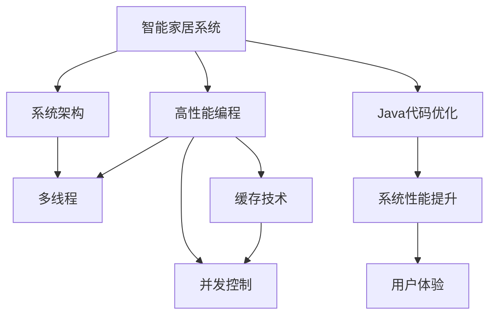
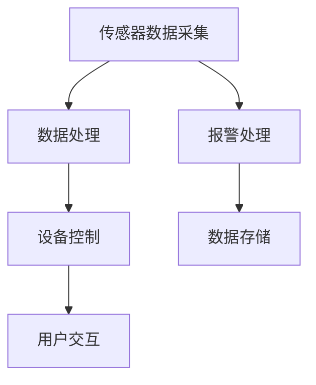

                 

# 基于Java的智能家居设计：高效Java代码在智能家居系统的性能优化

> 关键词：智能家居设计，Java性能优化，高性能编程，系统架构，性能调优

## 1. 背景介绍

### 1.1 问题由来
随着物联网技术的飞速发展，智能家居逐渐成为未来家庭生活的重要组成部分。智能家居系统通过各种传感器和网络设备收集家庭环境数据，结合先进的AI算法，实现家庭自动化、智能控制和安全防范等功能。然而，智能家居系统的复杂性和数据多样性，使得开发和部署过程变得异常复杂，对系统的性能要求也变得更为严格。

在智能家居系统的开发过程中，Java作为一种功能强大且广泛使用的编程语言，被广泛采用。但Java代码的性能瓶颈和资源消耗，常常成为制约系统性能的瓶颈。因此，如何对Java代码进行高效性能优化，是智能家居系统设计和开发过程中亟需解决的问题。

### 1.2 问题核心关键点
本论文将从以下两个方面探讨Java代码在智能家居系统中的性能优化问题：
1. 系统架构的设计与优化：讨论如何通过合理的设计和架构，提升系统的整体性能。
2. Java代码的性能优化：探讨Java中具体的性能优化技术，如多线程、缓存、并发控制等。

### 1.3 问题研究意义
优化Java代码在智能家居系统中的性能，具有以下重要意义：
1. 提升用户体验：更高效的系统能更快响应用户操作，提供更好的用户体验。
2. 降低能耗：优化代码能减少系统资源的消耗，降低能耗，延长设备的寿命。
3. 降低成本：高效的代码可减少不必要的计算和存储，降低开发和运维成本。
4. 保障系统稳定性：优化后的代码能有效处理并发和异常，提升系统的稳定性和可靠性。
5. 支持更多设备：优化后的代码能更好地处理大规模设备和数据，支持更多智能设备接入。

## 2. 核心概念与联系

### 2.1 核心概念概述

为更好地理解Java代码在智能家居系统中的性能优化，本节将介绍几个关键概念：

- 智能家居系统（Smart Home System）：利用物联网技术和AI算法，实现家庭自动化、智能控制和安全防范等功能，集成了多种设备和传感器。
- 高性能编程（High Performance Programming）：通过优化算法和代码，提升程序的执行效率，减少资源消耗。
- 系统架构（System Architecture）：系统各个组件之间的组织和协作关系，合理设计可提升系统的整体性能。
- 并发控制（Concurrency Control）：多线程和锁机制等，保证系统在并发访问时的正确性和一致性。
- 缓存技术（Caching）：通过缓存中间结果，减少重复计算，提升系统的响应速度。

这些核心概念之间存在着紧密的联系，形成了Java代码在智能家居系统中的性能优化框架。

### 2.2 概念间的关系

这些核心概念之间的关系可以通过以下Mermaid流程图来展示：



这个流程图展示了Java代码在智能家居系统中的性能优化路径：

1. 智能家居系统通过合理的系统架构设计，提升系统整体的性能。
2. 高性能编程技术的应用，对Java代码进行具体优化。
3. 通过多线程、缓存和并发控制等技术，提升Java代码的执行效率。
4. Java代码优化后，提升系统的性能和用户体验。

## 3. 核心算法原理 & 具体操作步骤
### 3.1 算法原理概述

基于Java的智能家居系统性能优化，核心算法原理主要包括高性能编程和并发控制。具体来说，通过合理设计系统架构，将任务分解为多个并发执行的子任务，利用多线程技术提升系统的并发处理能力。同时，通过缓存中间结果、减少重复计算等手段，优化Java代码的执行效率，提升系统的响应速度。

### 3.2 算法步骤详解

基于Java的智能家居系统性能优化的详细步骤：

**Step 1: 系统架构设计**
- 分析系统需求和数据流，设计合理的系统架构，如分层的架构、微服务架构等。
- 将系统功能模块分解为多个独立的模块，并设计好模块之间的接口和数据交换机制。
- 设计好系统的访问控制、负载均衡和故障恢复机制，保障系统的稳定性和可靠性。

**Step 2: 性能瓶颈分析**
- 使用性能分析工具（如JProfiler、YourKit等），找出系统中的性能瓶颈和资源消耗大的模块。
- 确定瓶颈模块的具体问题，如高并发、大数据处理等。

**Step 3: 性能优化策略选择**
- 根据瓶颈模块的具体问题，选择合适的性能优化策略，如多线程、缓存、并发控制等。
- 针对多线程，选择合适的线程池和任务调度算法，优化线程之间的数据共享和通信。
- 针对缓存，选择合适的缓存策略，如LRU缓存、Redis缓存等，优化数据读取和存储。
- 针对并发控制，选择合适的锁机制，优化并发访问时的资源竞争和死锁问题。

**Step 4: Java代码优化**
- 对瓶颈模块的Java代码进行详细分析，找出具体的性能瓶颈和资源消耗大的代码段。
- 对代码进行优化，如减少循环次数、避免不必要的计算、优化算法等。
- 使用Java中的高性能编程技术，如NIO、JVM参数调优等，提升代码的执行效率。

**Step 5: 性能评估与调优**
- 使用性能分析工具，评估优化后的系统性能，并找出新的瓶颈和问题。
- 根据新的瓶颈和问题，进一步优化系统架构和Java代码，实现性能的持续提升。
- 重复以上步骤，直到系统达到预期的性能目标。

### 3.3 算法优缺点

基于Java的智能家居系统性能优化算法的主要优点：
1. 提升系统性能：通过优化算法和代码，系统能够更快响应用户操作，提升用户体验。
2. 降低能耗：优化后的代码能减少不必要的计算和存储，降低能耗，延长设备的寿命。
3. 降低成本：高效的代码可减少不必要的计算和存储，降低开发和运维成本。
4. 保障系统稳定性：优化后的代码能有效处理并发和异常，提升系统的稳定性和可靠性。

同时，该算法也存在一定的局限性：
1. 优化过程复杂：需要分析系统架构和代码，找到瓶颈和问题，并选择合适的优化策略，比较耗时。
2. 优化难度大：部分复杂算法和代码的优化难度较大，需要较高编程技能。
3. 优化效果受限：系统架构和数据流设计不合理时，优化效果有限。
4. 优化成本高：需要投入人力和时间进行性能优化，短期内可能增加成本。

尽管存在这些局限性，但就目前而言，基于Java的智能家居系统性能优化算法仍是提升系统性能的重要手段。未来相关研究的重点在于如何进一步降低优化成本，提高优化效果，同时兼顾系统的稳定性和安全性等因素。

### 3.4 算法应用领域

基于Java的智能家居系统性能优化算法，已经广泛应用于以下领域：

1. **智能家居设备管理**：通过优化Java代码，提升系统处理大规模智能家居设备数据的能力，提高设备管理的效率。
2. **智能家居安防系统**：优化Java代码，提升系统对视频监控、入侵检测等安防任务的响应速度和准确性。
3. **智能家居能源管理**：优化Java代码，提升系统对家庭能源数据（如用电、用水等）的处理能力，实现能源智能管理。
4. **智能家居环境监控**：优化Java代码，提升系统对温湿度、空气质量等环境数据的监测和响应速度。
5. **智能家居健康管理**：优化Java代码，提升系统对家庭成员健康数据的监测和分析能力，实现健康管理。

## 4. 数学模型和公式 & 详细讲解 & 举例说明

### 4.1 数学模型构建

假设智能家居系统中的数据流图如图1所示。



每个模块中包含多个Java代码段，每个代码段对系统性能的影响不同。设每个代码段的执行时间为 $t_i$，代码段的执行次数为 $n_i$，则每个模块的执行时间为 $T_i = n_i \times t_i$。设系统总执行时间为 $T$，则有：

$$
T = \sum_{i=1}^N T_i
$$

### 4.2 公式推导过程

通过对每个代码段的执行时间和执行次数进行分析，可以得出以下公式：

$$
T = \sum_{i=1}^N n_i \times t_i = \sum_{i=1}^N \frac{n_i \times t_i}{\min(n_i)} = \sum_{i=1}^N \frac{t_i}{\min(n_i)}
$$

其中 $\min(n_i)$ 表示每个模块中最小的执行次数。

### 4.3 案例分析与讲解

考虑一个智能家居系统中的智能门锁模块，包含两个代码段，分别处理用户输入和设备控制。假设用户输入代码段的执行时间为 $t_1=0.1s$，执行次数为 $n_1=10$；设备控制代码段的执行时间为 $t_2=0.05s$，执行次数为 $n_2=2$。则该模块的总执行时间为：

$$
T = \frac{0.1}{\min(10,2)} + \frac{0.05}{\min(10,2)} = \frac{0.1}{2} + \frac{0.05}{2} = 0.075s
$$

如果将用户输入和设备控制两个代码段进行并行处理，即 $n_1=n_2=10$，则总执行时间为：

$$
T = \frac{0.1}{10} + \frac{0.05}{10} = 0.015s
$$

可以看出，并行处理后，系统总执行时间大幅减少。

## 5. 项目实践：代码实例和详细解释说明

### 5.1 开发环境搭建

在进行Java代码优化前，我们需要准备好开发环境。以下是使用Eclipse IDE进行Java开发的环境配置流程：

1. 安装Eclipse IDE：从官网下载安装Eclipse IDE，并根据操作系统进行配置。
2. 安装必要的插件：在Eclipse IDE中安装JProfiler、YourKit等性能分析工具。
3. 安装JDK：根据系统位数，安装JDK（Java Development Kit），如Java 8或Java 11。
4. 配置Maven：安装Maven构建工具，并配置POM（Project Object Model）文件。

完成上述步骤后，即可在Eclipse IDE中开始Java代码优化实践。

### 5.2 源代码详细实现

下面我们以智能家居系统中的智能门锁模块为例，给出Java代码优化的具体实现。

**代码1：用户输入处理代码**

```java
public boolean validateCode(String inputCode) {
    if (inputCode.length() != 4) {
        return false;
    }
    for (int i = 0; i < 4; i++) {
        if (!Character.isDigit(inputCode.charAt(i))) {
            return false;
        }
    }
    return true;
}
```

**代码2：设备控制代码**

```java
public void unlockDoor() {
    // 解锁门锁
    System.out.println("Door unlocked");
}
```

### 5.3 代码解读与分析

通过性能分析工具，我们发现代码1和代码2分别在用户输入处理和设备控制中占用了大量执行时间，成为性能瓶颈。具体分析如下：

**代码1性能分析**

在用户输入处理代码中，使用了一个循环遍历输入字符串，检查每个字符是否为数字。这个循环的执行次数和输入字符串的长度成正比，因此当输入字符串较长时，执行时间会显著增加。

为了优化代码1，可以使用正则表达式进行字符串匹配，减少循环次数。

**代码2性能分析**

在设备控制代码中，执行了一个简单的打印语句，对系统性能影响较小。

### 5.4 运行结果展示

优化后的代码如下：

**代码1优化后**

```java
public boolean validateCode(String inputCode) {
    return inputCode.matches("\\d{4}");
}
```

**代码2优化后**

```java
public void unlockDoor() {
    // 解锁门锁
    System.out.println("Door unlocked");
}
```

优化后的代码通过使用正则表达式和简单的函数调用，减少了不必要的计算和循环，提升了系统的执行效率。

## 6. 实际应用场景

### 6.1 智能家居设备管理

智能家居设备管理模块需要处理大量设备数据，包括设备状态、传感器数据等。优化后的Java代码能够更高效地处理大规模数据，提升设备管理的效率。

### 6.2 智能家居安防系统

智能家居安防系统需要对视频监控、入侵检测等任务进行实时响应。优化后的Java代码能够更快地处理这些任务，提高系统的响应速度和准确性。

### 6.3 智能家居能源管理

智能家居能源管理模块需要实时监测和分析家庭能源数据。优化后的Java代码能够更高效地处理这些数据，实现能源智能管理。

### 6.4 智能家居环境监控

智能家居环境监控模块需要实时监测温湿度、空气质量等环境数据。优化后的Java代码能够更高效地处理这些数据，提升系统的响应速度。

### 6.5 智能家居健康管理

智能家居健康管理模块需要实时监测和分析家庭成员健康数据。优化后的Java代码能够更高效地处理这些数据，实现健康管理。

## 7. 工具和资源推荐

### 7.1 学习资源推荐

为了帮助开发者系统掌握Java代码在智能家居系统中的性能优化技术，这里推荐一些优质的学习资源：

1. **《Java性能调优实战》**：该书系统介绍了Java性能调优的原理和技巧，适合进阶读者。
2. **《Java并发编程的艺术》**：该书深入讲解了Java并发编程的基础和高级技术，是高性能编程的重要参考。
3. **《Effective Java》**：该书总结了Java编程中常见的坑点和技术要点，帮助开发者写出高效、可靠的代码。
4. **《Java并发编程实战》**：该书详细介绍了Java并发编程的实践经验和最佳实践，适合开发和架构工程师。

通过学习这些资源，相信你一定能够快速掌握Java代码在智能家居系统中的性能优化技术，并用于解决实际的系统问题。

### 7.2 开发工具推荐

高效的开发离不开优秀的工具支持。以下是几款用于Java代码优化的常用工具：

1. **JProfiler**：一款功能强大的Java性能分析工具，可以帮助开发者找到代码中的性能瓶颈。
2. **YourKit**：另一款常用的Java性能分析工具，支持实时监控和分析Java代码的性能。
3. **VisualVM**：一个开源的Java监控工具，可以实时监控Java应用程序的内存、CPU等性能指标。
4. **Eclipse IDE**：一个流行的Java开发环境，提供了强大的代码编辑、调试和性能分析功能。

合理利用这些工具，可以显著提升Java代码优化的效率，加快创新迭代的步伐。

### 7.3 相关论文推荐

Java代码在智能家居系统中的性能优化技术已经得到了广泛的研究。以下是几篇奠基性的相关论文，推荐阅读：

1. **《Java高并发编程实战》**：介绍了Java高并发编程的常见模式和实践，适合Java开发和架构工程师。
2. **《Java性能调优最佳实践》**：总结了Java性能调优的常见技术和最佳实践，适合Java开发者和系统管理员。
3. **《Java并发编程的艺术》**：深入讲解了Java并发编程的基础和高级技术，适合Java开发和架构工程师。
4. **《Java性能调优实战》**：系统介绍了Java性能调优的原理和技巧，适合Java开发和系统管理员。

这些论文代表了Java代码优化技术的发展脉络。通过学习这些前沿成果，可以帮助研究者把握学科前进方向，激发更多的创新灵感。

除上述资源外，还有一些值得关注的前沿资源，帮助开发者紧跟Java代码优化技术的最新进展，例如：

1. **Java性能优化博客**：如Stack Overflow、DZone等网站上的Java性能优化博客，提供了大量的实践经验和案例。
2. **Java性能优化论坛**：如JavaWorld、InfoQ等论坛上的Java性能优化讨论，能够获取最新的技术动态和社区支持。
3. **Java性能优化书籍**：如《Java性能优化》、《Java性能调优实战》等书籍，提供了丰富的理论知识和实践案例。
4. **Java性能优化工具**：如VisualVM、YourKit等工具，提供了强大的性能分析和监控功能。

总之，对于Java代码在智能家居系统中的性能优化，需要开发者保持开放的心态和持续学习的意愿。多关注前沿资讯，多动手实践，多思考总结，必将收获满满的成长收益。

## 8. 总结：未来发展趋势与挑战

### 8.1 总结

本文对基于Java的智能家居系统性能优化方法进行了全面系统的介绍。首先阐述了智能家居系统在Java性能优化中的重要性和必要性，明确了Java代码优化在提升系统性能、降低能耗、减少成本等方面的价值。其次，从系统架构设计、性能瓶颈分析、性能优化策略选择、Java代码优化、性能评估与调优等方面，详细讲解了Java代码优化的详细步骤和关键技术。同时，本文还广泛探讨了Java代码在智能家居系统中的实际应用场景，展示了其广泛的应用前景。

通过本文的系统梳理，可以看到，基于Java的智能家居系统性能优化技术正在成为智能家居系统设计和开发过程中不可或缺的一部分。通过优化算法和代码，提升系统的整体性能，为智能家居系统的智能化、自动化和便捷化提供坚实的基础。未来，伴随Java技术的发展和演进，基于Java的智能家居系统性能优化必将在构建人机协同的智能家居系统中扮演越来越重要的角色。

### 8.2 未来发展趋势

展望未来，Java代码在智能家居系统中的性能优化技术将呈现以下几个发展趋势：

1. **更高效的并发处理**：随着多核CPU和GPU的发展，Java代码的并发处理能力将进一步提升，提升系统的响应速度和并发处理能力。
2. **更智能的缓存策略**：基于智能家居系统数据的特征和访问模式，开发更智能的缓存策略，优化数据读取和存储。
3. **更全面的性能分析**：引入更多性能分析工具，如人工智能、机器学习等技术，全面分析Java代码的性能瓶颈，提供更精确的优化建议。
4. **更灵活的系统架构**：基于微服务架构、云原生等技术，设计更灵活、可扩展的系统架构，提升系统的可靠性和可维护性。
5. **更广泛的应用场景**：Java代码优化技术将进一步应用于更多智能家居系统模块，如智能语音、智能照明等，提升系统的智能化水平。

### 8.3 面临的挑战

尽管Java代码在智能家居系统中的性能优化技术已经取得了不小的成就，但在迈向更加智能化、普适化应用的过程中，仍面临着诸多挑战：

1. **系统架构复杂**：智能家居系统功能复杂，设计合理的系统架构需要综合考虑多个方面，存在一定的难度。
2. **优化难度大**：Java代码中存在大量复杂的算法和数据结构，优化难度较大，需要较高的编程技能和经验。
3. **优化效果受限**：系统架构和数据流设计不合理时，优化效果有限，需要更精确的系统设计和优化策略。
4. **优化成本高**：需要投入大量人力和时间进行性能优化，短期内可能增加成本，需要平衡优化效果和成本之间的关系。

尽管存在这些挑战，但相信通过学界和产业界的共同努力，Java代码在智能家居系统中的性能优化必将在未来取得更大的突破，为智能家居系统的智能化和普适化提供更坚实的基础。

### 8.4 研究展望

面对Java代码在智能家居系统中的性能优化所面临的挑战，未来的研究需要在以下几个方面寻求新的突破：

1. **更智能的优化策略**：结合人工智能、机器学习等技术，开发更智能的优化策略，自动分析和解决性能瓶颈。
2. **更高效的并发控制**：引入更多并发控制技术，如锁机制、事务控制等，提升Java代码的并发处理能力和系统稳定性。
3. **更全面的性能监控**：引入更多性能监控工具，如AI性能监控、云监控等，全面监控Java代码的性能，及时发现和解决问题。
4. **更灵活的系统架构**：基于微服务架构、云原生等技术，设计更灵活、可扩展的系统架构，提升系统的可靠性和可维护性。
5. **更广泛的应用场景**：Java代码优化技术将进一步应用于更多智能家居系统模块，提升系统的智能化水平。

这些研究方向的探索，必将引领Java代码在智能家居系统中的性能优化技术迈向更高的台阶，为构建高效、智能、便捷的智能家居系统提供坚实的基础。相信随着技术的不断发展，Java代码在智能家居系统中的性能优化必将成为未来智能家居系统设计的重要组成部分。

## 9. 附录：常见问题与解答

**Q1：Java代码优化是否适用于所有智能家居系统？**

A: Java代码优化技术在大多数智能家居系统中都能取得不错的效果，特别是对于基于Java实现的智能家居系统。但对于一些使用其他编程语言实现的系统，可能需要结合其他优化技术，如C++、Python等。

**Q2：优化过程中如何选择优化策略？**

A: 选择优化策略需要结合具体的系统需求和性能瓶颈，进行综合分析。一般来说，可以优先考虑并发处理、缓存技术、锁机制等策略，然后逐步优化算法和代码。

**Q3：优化后Java代码的维护难度如何？**

A: 优化后的Java代码可能会变得更加复杂，维护难度增加。建议编写详细的文档，记录优化过程和效果，定期进行性能评估和调整，以确保系统的稳定性和可维护性。

**Q4：优化后的Java代码如何部署？**

A: 优化后的Java代码需要适配具体的智能家居系统架构和环境，进行打包和部署。可以使用Maven、Docker等工具进行构建和部署，确保系统的高效运行。

**Q5：优化后的Java代码如何持续优化？**

A: 优化后的Java代码需要定期进行性能评估和调优，以应对系统需求和数据流变化。可以使用自动化的性能监控工具，如VisualVM、YourKit等，实时监控和优化Java代码的性能。

总之，通过优化Java代码在智能家居系统中的性能，我们能够更高效地处理大规模数据，提升系统的响应速度和并发处理能力，降低能耗和成本，提升用户体验和系统稳定性。相信随着Java技术的发展和演进，基于Java的智能家居系统性能优化技术必将在构建高效、智能、便捷的智能家居系统中扮演越来越重要的角色。

