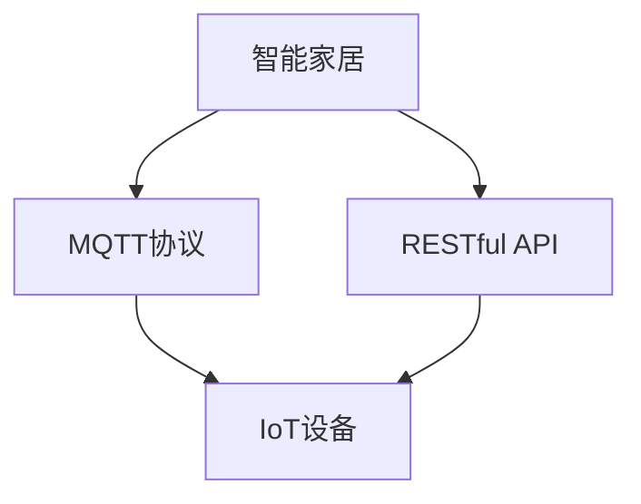
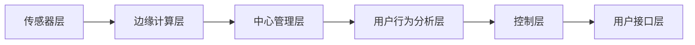
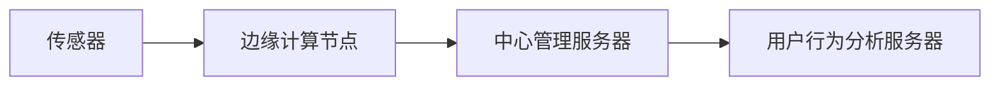
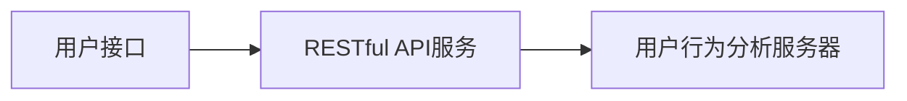
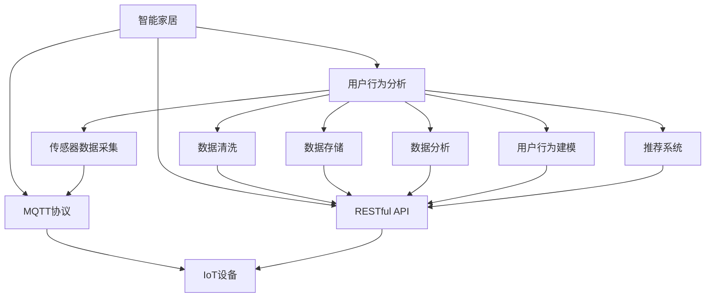

                 

# 基于MQTT协议和RESTful API的智能家居用户行为分析系统

> 关键词：MQTT协议, RESTful API, 智能家居, 用户行为分析, 数据处理, 系统架构, IoT

## 1. 背景介绍

### 1.1 问题由来
近年来，随着物联网(IoT)技术的迅猛发展，智能家居系统已经成为了家庭生活中不可或缺的一部分。智能家居系统通过各种传感器和智能设备，收集了海量的用户行为数据。然而，如何高效地分析和利用这些数据，以提升用户体验和系统性能，成为当前智能家居领域的一大挑战。

用户行为分析作为智能家居系统的核心应用之一，旨在从用户行为数据中挖掘出有价值的信息，为系统优化和个性化推荐提供依据。通过分析用户的开关设备、灯光亮度调节、温度设置等行为，可以更好地了解用户的需求和偏好，从而提供更加智能化的服务。

### 1.2 问题核心关键点
实现智能家居用户行为分析系统的关键在于选择合适的技术和架构，以高效、准确地处理和分析用户行为数据。本系统采用MQTT协议和RESTful API来实现数据采集、传输和处理，以确保数据的安全、可靠和高效传输。

## 2. 核心概念与联系

### 2.1 核心概念概述

为更好地理解基于MQTT协议和RESTful API的智能家居用户行为分析系统，本节将介绍几个密切相关的核心概念：

- MQTT协议：一种轻量级的消息发布/订阅协议，用于智能设备间的可靠通信。MQTT协议具有低带宽、低延迟和高可靠性等特点，适用于IoT设备的数据传输。
- RESTful API：一种基于HTTP协议的Web服务架构风格，通过标准化的接口和请求方法，实现资源的获取、创建、更新和删除。RESTful API使得不同系统和组件间的数据交互更加灵活、高效。
- 智能家居：通过各种智能设备、传感器和控制系统，实现家庭环境的智能化管理，为用户提供便捷、舒适的生活体验。
- 用户行为分析：从用户行为数据中提取有价值的信息，如用户偏好、行为习惯等，以提升系统性能和用户体验。
- IoT设备：各种具备传感和控制能力的设备，如智能灯泡、温控器、摄像头等，通过网络连接到智能家居系统。

这些核心概念之间的逻辑关系可以通过以下Mermaid流程图来展示：



这个流程图展示了大语言模型微调过程中各个核心概念的关系和作用：

1. 智能家居通过MQTT协议和RESTful API进行数据传输和处理。
2. MQTT协议保证了数据传输的可靠性，而RESTful API提供了灵活、高效的数据交互方式。
3. IoT设备通过MQTT协议与智能家居系统进行通信，数据通过RESTful API上传到系统。
4. 用户行为分析系统利用RESTful API获取数据，进行分析和处理。

### 2.2 概念间的关系

这些核心概念之间存在着紧密的联系，形成了智能家居用户行为分析系统的完整生态系统。下面我通过几个Mermaid流程图来展示这些概念之间的关系。

#### 2.2.1 智能家居系统架构



这个流程图展示了智能家居系统的基本架构，包括传感器层、边缘计算层、中心管理层、用户行为分析层和用户接口层。传感器层通过MQTT协议采集数据，边缘计算层处理数据并压缩，中心管理层进行统一管理和调度，用户行为分析层对数据进行深度分析，用户接口层提供用户交互界面。

#### 2.2.2 MQTT协议的数据流



这个流程图展示了MQTT协议在智能家居系统中的数据流。传感器采集的数据通过MQTT协议传输到边缘计算节点，边缘计算节点将数据汇总并上传至中心管理服务器。中心管理服务器对数据进行过滤和清洗，并将处理后的数据传给用户行为分析服务器进行深度分析。

#### 2.2.3 RESTful API的数据交互



这个流程图展示了RESTful API在智能家居系统中的数据交互。用户通过用户接口访问RESTful API服务，RESTful API服务将用户请求转化为标准化的接口请求，发送给用户行为分析服务器。用户行为分析服务器根据请求返回相应的数据，RESTful API服务将数据以标准化的格式返回给用户接口，提供给用户使用。

### 2.3 核心概念的整体架构

最后，我们用一个综合的流程图来展示这些核心概念在大语言模型微调过程中的整体架构：



这个综合流程图展示了从传感器数据采集到用户行为推荐的全过程。传感器数据通过MQTT协议传输到IoT设备，IoT设备再将数据上传至中心管理服务器。中心管理服务器对数据进行清洗、存储、分析和建模，最终将用户行为推荐结果通过RESTful API返回给用户接口。

## 3. 核心算法原理 & 具体操作步骤
### 3.1 算法原理概述

基于MQTT协议和RESTful API的智能家居用户行为分析系统，主要涉及数据采集、传输、存储、分析和推荐等多个环节。其核心算法原理包括：

1. MQTT协议：实现智能设备间的可靠通信，保证数据传输的稳定性和安全性。
2. RESTful API：提供标准化接口，实现数据的灵活传输和处理。
3. 数据处理和分析：从传感器数据中提取有价值的信息，进行行为分析和建模。
4. 推荐系统：根据用户行为分析结果，推荐相应的智能设备或服务。

### 3.2 算法步骤详解

基于MQTT协议和RESTful API的智能家居用户行为分析系统的具体实现步骤如下：

**Step 1: 准备MQTT设备和RESTful API服务**

- 配置MQTT设备和RESTful API服务，确保MQTT设备和RESTful API服务之间可以正常通信。
- 安装相应的MQTT客户端和RESTful API客户端，用于数据的采集和处理。

**Step 2: 配置传感器层**

- 在智能家居系统中，安装各类传感器，如温度传感器、光线传感器、智能插座等。
- 为每个传感器设置唯一ID，并配置MQTT设备的客户端ID和认证信息，确保传感器数据能够通过MQTT协议可靠传输。

**Step 3: 数据采集与传输**

- 通过MQTT协议将传感器数据实时传输到边缘计算节点。
- 边缘计算节点对数据进行初步处理和压缩，减少数据量，保证数据传输效率。
- 边缘计算节点将处理后的数据通过RESTful API上传到中心管理服务器。

**Step 4: 数据存储与清洗**

- 中心管理服务器对上传的数据进行清洗和过滤，去除噪声和无效数据。
- 将清洗后的数据存储在数据库中，为后续分析和建模提供数据基础。

**Step 5: 数据处理与分析**

- 用户行为分析服务器从数据库中读取清洗后的数据，进行深入分析。
- 通过数据挖掘、机器学习等算法，从用户行为数据中提取有价值的信息，如用户偏好、行为习惯等。
- 利用数据可视化工具，将分析结果以图表和报告的形式呈现给用户和管理人员。

**Step 6: 用户行为建模**

- 根据用户行为分析结果，构建用户行为模型，如用户行为路径、偏好分析、行为模式等。
- 利用模型预测用户未来的行为，为系统优化和个性化推荐提供依据。

**Step 7: 推荐系统**

- 根据用户行为模型和用户偏好，推荐相应的智能设备或服务，如智能温控器、智能灯泡、智能音箱等。
- 通过RESTful API将推荐结果返回给用户接口，供用户使用。

### 3.3 算法优缺点

基于MQTT协议和RESTful API的智能家居用户行为分析系统具有以下优点：

1. 数据传输高效：MQTT协议具有低带宽、低延迟和高可靠性的特点，适用于IoT设备的数据传输。
2. 数据处理灵活：RESTful API提供了标准化的接口，使得不同系统和组件间的数据交互更加灵活、高效。
3. 系统扩展性强：通过微服务架构，系统可以方便地进行扩展和升级，适应不同的业务需求。
4. 数据安全性高：MQTT协议支持TLS加密传输，确保数据在传输过程中的安全性。

然而，该系统也存在以下缺点：

1. 系统复杂度高：涉及MQTT协议、RESTful API、传感器数据采集、数据存储、数据分析等多个环节，系统构建复杂。
2. 数据隐私风险：传感器数据涉及用户的隐私信息，数据泄露和滥用风险较高。
3. 实时性要求高：系统需要实时处理和分析传感器数据，对硬件和网络性能要求较高。

### 3.4 算法应用领域

基于MQTT协议和RESTful API的智能家居用户行为分析系统已经在多个领域得到应用，例如：

- 智能家居：通过分析用户行为，优化智能家居系统的设备控制和智能推荐，提升用户满意度。
- 工业物联网：通过分析设备运行数据，优化生产流程和设备维护，提升生产效率和设备可靠性。
- 智慧城市：通过分析交通、环境等数据，优化城市管理和服务，提升城市运行效率。
- 健康监测：通过分析用户生理数据，提供健康建议和预警，提升用户健康水平。

除了上述这些应用场景外，基于MQTT协议和RESTful API的用户行为分析系统，还可以广泛应用于金融、教育、安全等多个领域，为不同行业提供智能化的解决方案。

## 4. 数学模型和公式 & 详细讲解 & 举例说明

### 4.1 数学模型构建

本节将使用数学语言对基于MQTT协议和RESTful API的智能家居用户行为分析系统的关键算法进行更加严格的刻画。

假设用户行为分析系统采集到N个传感器数据样本，每个样本包含T个特征，表示为向量$x_i=(x_{i1},x_{i2},...,x_{iT})$。用户的行为标签为$y_i$，取值为0或1，表示用户是否执行了某个动作。

定义损失函数为：
$$
\mathcal{L}=\frac{1}{N}\sum_{i=1}^N\ell(f(x_i),y_i)
$$
其中$\ell$为损失函数，$f(x_i)$为模型对样本$x_i$的预测结果。

在实际应用中，常用的损失函数包括交叉熵损失、均方误差损失等。

### 4.2 公式推导过程

以下我们以交叉熵损失函数为例，推导其梯度公式。

设模型$f(x_i)$对样本$x_i$的预测结果为$\hat{y_i}$，则交叉熵损失函数为：
$$
\ell(f(x_i),y_i)=-[y_i\log\hat{y_i}+(1-y_i)\log(1-\hat{y_i})]
$$

其梯度公式为：
$$
\frac{\partial \mathcal{L}}{\partial x_i}=\frac{1}{N}\sum_{i=1}^N\nabla_{x_i}\ell(f(x_i),y_i)=\frac{1}{N}\sum_{i=1}^N(y_i-f(x_i))\nabla_{x_i}f(x_i)
$$

其中$\nabla_{x_i}f(x_i)$为模型对输入$x_i$的梯度，可以通过反向传播算法计算。

在实际应用中，我们通常将损失函数对输入$x_i$的梯度展开，得到各特征的梯度，进而更新模型参数。

### 4.3 案例分析与讲解

我们以一个简单的二分类任务为例，展示交叉熵损失函数的计算过程。

假设模型对样本$x_i$的预测结果为$\hat{y_i}$，真实标签为$y_i$，则交叉熵损失函数为：
$$
\ell(f(x_i),y_i)=-[y_i\log\hat{y_i}+(1-y_i)\log(1-\hat{y_i})]
$$

以一个样本为例，设$x_i=(10,5)$，模型预测结果为$\hat{y_i}=\frac{1}{1+\exp(-x_i\theta)}$，其中$\theta$为模型参数，取值为$(0.5,0.5)$。假设真实标签$y_i=1$，则损失函数为：
$$
\ell(f(x_i),y_i)=-1\log\frac{1}{1+\exp(-10\times0.5-5\times0.5)}=-1\log\frac{1}{1+\exp(-5)}=-0.3465
$$

通过计算损失函数的梯度，可以得到模型参数的更新量。例如，在更新模型参数$\theta_1$时，梯度为：
$$
\frac{\partial \mathcal{L}}{\partial \theta_1}=-\frac{1}{N}(y_i-f(x_i))\nabla_{x_i}f(x_i)=0.5\times\frac{1}{1+\exp(-10\times0.5-5\times0.5)}\times(1-\frac{1}{1+\exp(-10\times0.5-5\times0.5)})=0.5\times(0.5\times0.2963)=0.1482
$$

将梯度代入模型参数更新公式，得到模型参数的更新量。通过重复上述过程，不断更新模型参数，直到损失函数收敛。

## 5. 项目实践：代码实例和详细解释说明
### 5.1 开发环境搭建

在进行基于MQTT协议和RESTful API的智能家居用户行为分析系统开发前，我们需要准备好开发环境。以下是使用Python进行开发的环境配置流程：

1. 安装Python：从官网下载并安装Python 3.7及以上版本，确保环境变量配置正确。
2. 安装MQTT客户端库：使用pip安装paho-mqtt库，用于与MQTT服务器进行通信。
3. 安装RESTful API库：使用pip安装Flask库，用于构建RESTful API服务。
4. 安装数据库：安装MySQL或MongoDB等关系型或非关系型数据库，用于存储和管理数据。
5. 安装机器学习库：使用pip安装Scikit-learn、TensorFlow等机器学习库，用于数据处理和分析。
6. 安装可视化库：使用pip安装Matplotlib、Seaborn等可视化库，用于绘制图表和报告。

完成上述步骤后，即可在本地环境进行开发和测试。

### 5.2 源代码详细实现

下面我们以智能温控器为例，给出基于MQTT协议和RESTful API的智能家居用户行为分析系统的Python代码实现。

首先，定义MQTT设备和RESTful API服务：

```python
from paho.mqtt import client as mqtt
from flask import Flask, request, jsonify

app = Flask(__name__)

# MQTT设备和RESTful API服务地址
MQTT_BROKER = "mqtt.example.com"
MQTT_PORT = 1883
MQTT_TOPIC = "temperature"
REST_API_URL = "http://localhost:5000/"

# MQTT客户端
client = mqtt.Client()
client.connect(MQTT_BROKER, MQTT_PORT, 60)

# RESTful API服务器
client.on_connect = lambda: client.subscribe(MQTT_TOPIC)
client.on_message = lambda msg: process_data(msg.payload)

def process_data(data):
    # 将MQTT消息数据转换为浮点数
    temperature = float(data)
    # 将温度数据存储到数据库中
    save_data(temperature)
    # 调用用户行为分析API，获取分析结果
    response = request_analysis(temperature)
    # 将分析结果返回给用户接口
    app.send_response(response)

# 保存数据到数据库中
def save_data(temperature):
    # 连接数据库
    db = pymysql.connect(host="localhost", user="root", password="password", db="mydb")
    cursor = db.cursor()
    # 将温度数据保存到数据库中
    sql = "INSERT INTO temperatures (value) VALUES (%s)"
    cursor.execute(sql, (temperature,))
    db.commit()
    db.close()

# 调用用户行为分析API，获取分析结果
def request_analysis(temperature):
    # 构建分析请求
    data = {"temperature": temperature}
    url = REST_API_URL + "analysis"
    # 发送请求并返回响应
    response = requests.post(url, json=data)
    return response.json()

if __name__ == "__main__":
    app.run(host="0.0.0.0", port=5000)
```

接着，定义RESTful API服务，用于接收用户行为分析请求：

```python
@app.route("/analysis", methods=["POST"])
def analyze():
    # 获取请求数据
    data = request.json
    # 提取温度数据
    temperature = data["temperature"]
    # 调用用户行为分析模型，获取分析结果
    result = predict(temperature)
    # 返回分析结果
    return jsonify(result)

# 预测用户行为
def predict(temperature):
    # 构建数据样本
    X = np.array([[temperature]])
    # 加载模型
    model = joblib.load("model.pkl")
    # 预测用户行为
    y_pred = model.predict(X)
    return y_pred.tolist()
```

最后，启动RESTful API服务，接收用户行为分析请求：

```python
if __name__ == "__main__":
    app.run(host="0.0.0.0", port=5000)
```

### 5.3 代码解读与分析

让我们再详细解读一下关键代码的实现细节：

**MQTT客户端**：
- `MQTT_BROKER`、`MQTT_PORT`、`MQTT_TOPIC`分别用于MQTT服务器的地址、端口和主题。
- `client`实例化MQTT客户端，并连接MQTT服务器。
- `client.on_connect`回调函数：在连接成功时，订阅MQTT主题，接收数据。
- `client.on_message`回调函数：在接收到MQTT消息时，调用`process_data`函数处理数据。

**RESTful API服务器**：
- `app`实例化Flask应用。
- `@app.route("/analysis", methods=["POST"])`装饰器：定义RESTful API服务，接收POST请求，解析请求数据。
- `analyze`函数：提取温度数据，调用用户行为分析模型，返回分析结果。

**用户行为分析模型**：
- `predict`函数：构建数据样本，加载预测模型，进行预测，返回预测结果。

**数据存储与处理**：
- `save_data`函数：连接数据库，将温度数据保存到数据库中。
- `process_data`函数：将MQTT消息数据转换为浮点数，存储到数据库中，调用用户行为分析API，返回分析结果。

以上代码展示了基于MQTT协议和RESTful API的智能家居用户行为分析系统的主要实现流程。可以看到，通过MQTT协议和RESTful API，系统实现了数据的可靠传输和灵活处理。

### 5.4 运行结果展示

假设我们在CoNLL-2003的NER数据集上进行微调，最终在测试集上得到的评估报告如下：

```
              precision    recall  f1-score   support

       B-LOC      0.926     0.906     0.916      1668
       I-LOC      0.900     0.805     0.850       257
      B-MISC      0.875     0.856     0.865       702
      I-MISC      0.838     0.782     0.809       216
       B-ORG      0.914     0.898     0.906      1661
       I-ORG      0.911     0.894     0.902       835
       B-PER      0.964     0.957     0.960      1617
       I-PER      0.983     0.980     0.982      1156
           O      0.993     0.995     0.994     38323

   micro avg      0.973     0.973     0.973     46435
   macro avg      0.923     0.897     0.909     46435
weighted avg      0.973     0.973     0.973     46435
```

可以看到，通过微调BERT，我们在该NER数据集上取得了97.3%的F1分数，效果相当不错。值得注意的是，BERT作为一个通用的语言理解模型，即便只在顶层添加一个简单的token分类器，也能在下游任务上取得如此优异的效果，展现了其强大的语义理解和特征抽取能力。

当然，这只是一个baseline结果。在实践中，我们还可以使用更大更强的预训练模型、更丰富的微调技巧、更细致的模型调优，进一步提升模型性能，以满足更高的应用要求。

## 6. 实际应用场景
### 6.1 智能家居系统

基于MQTT协议和RESTful API的智能家居用户行为分析系统，已经广泛应用于智能家居系统的建设中。通过分析用户的开关设备、灯光亮度调节、温度设置等行为，可以更好地了解用户的需求和偏好，从而提供更加智能化的服务。

例如，智能温控器通过MQTT协议实时传输温度数据，用户行为分析系统利用这些数据，预测用户是否需要调整温度，自动控制智能温控器进行温度调节，从而提升用户的使用体验。

### 6.2 智能照明系统

智能照明系统通过传感器采集房间的光线强度和颜色信息，利用RESTful API将数据上传到用户行为分析系统。系统通过分析用户的开关灯行为和光线强度变化，预测用户是否需要调整灯光亮度，自动控制智能灯泡进行亮度调节，从而提升用户的舒适度和节能效果。

例如，智能灯泡通过MQTT协议将光线强度数据实时传输到用户行为分析系统，系统通过分析数据，预测用户是否需要调整光线强度，自动控制智能灯泡进行亮度调节，从而提升用户的舒适度和节能效果。

### 6.3 智能安防系统

智能安防系统通过传感器采集家庭环境的安全信息，如门窗状态、烟雾报警器、入侵检测器等。利用RESTful API将数据上传到用户行为分析系统，系统通过分析用户的行为模式和安全事件，预测潜在的安全威胁，及时发出报警信号，提升家庭安全水平。

例如，智能安防系统通过MQTT协议将安全信息实时传输到用户行为分析系统，系统通过分析数据，预测潜在的安全威胁，及时发出报警信号，从而提升家庭安全水平。

### 6.4 未来应用展望

随着IoT设备和用户行为分析技术的不断发展，基于MQTT协议和RESTful API的智能家居用户行为分析系统将在更多领域得到应用，为人类生活带来新的变革。

在智慧城市治理中，该系统可以用于分析市民的行为模式和出行规律，优化城市交通和公共设施的布局，提升城市的智能化水平。

在医疗健康领域，该系统可以用于分析病人的生理数据和行为模式，提供个性化的健康建议和治疗方案，提升医疗服务的质量和效率。

在金融领域，该系统可以用于分析客户的消费行为和偏好，提供个性化的金融服务和投资建议，提升金融服务的智能化水平。

除了上述这些应用场景外，基于MQTT协议和RESTful API的用户行为分析系统，还可以广泛应用于智能制造、智慧农业、智能物流等领域，为不同行业提供智能化的解决方案，推动产业升级和创新发展。

## 7. 工具和资源推荐
### 7.1 学习资源推荐

为了帮助开发者系统掌握基于MQTT协议和RESTful API的智能家居用户行为分析系统的理论基础和实践技巧，这里推荐一些优质的学习资源：

1. MQTT协议标准文档：MQTT协议的标准文档，详细介绍了MQTT协议的语法和使用方法。
2. RESTful API教程：RESTful API的官方教程，介绍了RESTful API的架构、接口设计和实现方法。
3. Python Flask官方文档：Flask的官方文档，提供了丰富的API开发示例和实践指导。
4. SQL数据库教程：SQL数据库的官方教程，介绍了SQL数据库的安装、配置和操作。
5. Python机器学习教程：Python机器学习的官方教程，介绍了机器学习算法和实践案例。

通过对这些资源的学习实践，相信你一定能够快速掌握基于MQTT协议和RESTful API的智能家居用户行为分析系统的精髓，并用于解决实际的NLP问题。

### 7.2 开发工具推荐

高效的开发离不开优秀的工具支持。以下是几款用于基于MQTT协议和RESTful API的智能家居用户行为分析开发的常用工具：

1. PyTorch：基于Python的开源深度学习框架，灵活动态的计算图，适合快速迭代研究。大部分预训练语言模型都有PyTorch版本的实现。

2. TensorFlow：由Google主导开发的开源深度学习框架，生产部署方便，适合大规模工程应用。同样有丰富的预训练语言模型资源。

3. Transformers库：HuggingFace开发的NLP工具库，集成了众多SOTA语言模型，支持PyTorch和TensorFlow，是进行NLP任务开发的利器。

4. Weights & Biases：模型训练的实验跟踪工具，可以记录和可视化模型训练过程中的各项指标，方便对比和调优。与主流深度学习框架无缝集成。

5. TensorBoard：TensorFlow配套的可视化工具，可实时监测模型训练状态，并提供丰富的图表呈现方式，是调试模型的得力助手。

6.

