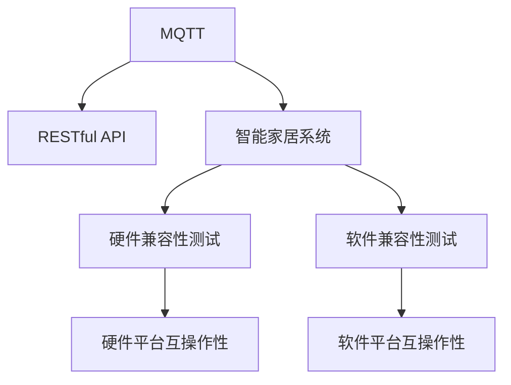
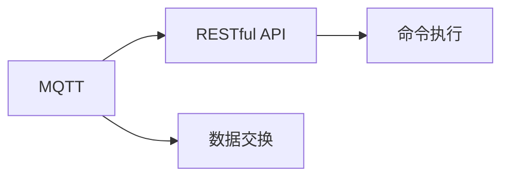
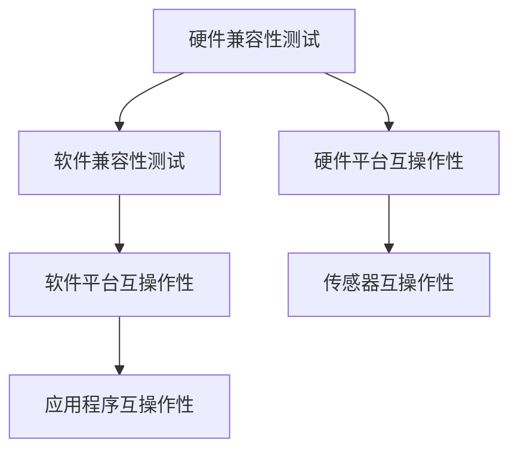
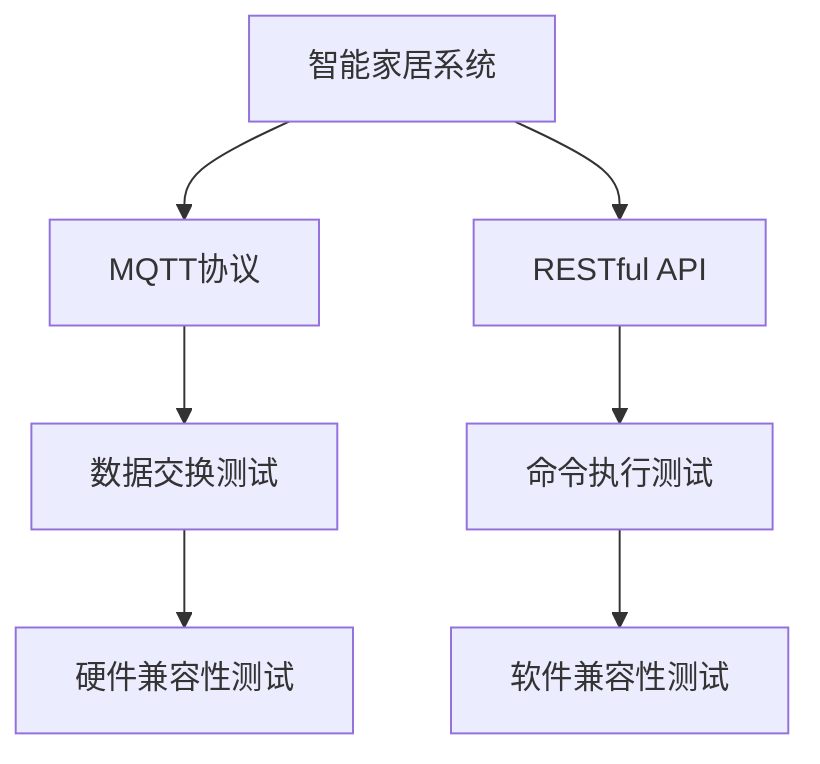
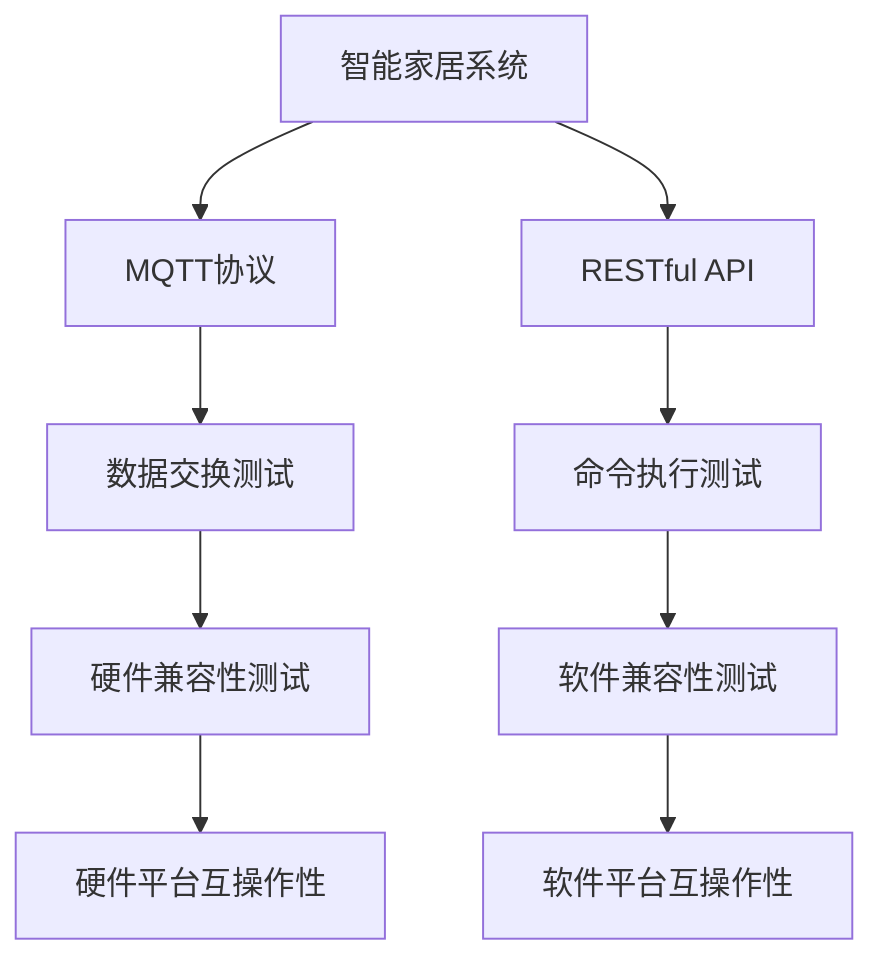

                 

# 基于MQTT协议和RESTful API的智能家居系统兼容性测试

> 关键词：MQTT, RESTful API, 智能家居, 兼容性测试, 互联互通, 标准化, 智能家居设备, 硬件兼容性, 软件兼容性

## 1. 背景介绍

### 1.1 问题由来
随着物联网技术的快速发展，智能家居系统成为了家庭自动化和智能化的重要趋势。智能家居系统通过各种传感器和设备采集数据，并利用先进的算法进行分析和决策，实现对家庭环境的智能化控制和管理。然而，由于不同厂商和设备之间的技术标准和协议不一致，智能家居系统往往存在兼容性问题，影响了系统的稳定性和用户体验。

### 1.2 问题核心关键点
本文聚焦于基于MQTT协议和RESTful API的智能家居系统的兼容性测试方法，旨在通过系统化、标准化的测试手段，验证不同设备之间的数据交换和命令执行能力，确保智能家居系统的高效运行。

### 1.3 问题研究意义
研究智能家居系统的兼容性测试，对于构建稳定可靠、互联互通的智能家居环境，提升用户体验，推动智能家居技术的产业化进程，具有重要意义：

1. 提高系统稳定性。通过兼容性测试，确保不同设备之间的数据互通，避免因协议差异引起的故障。
2. 优化用户体验。减少因设备不兼容带来的不便，提高用户操作的便捷性和流畅性。
3. 加速产业化进程。兼容性测试为智能家居设备的标准化提供了技术保障，促进了设备的广泛应用和市场接受度。
4. 促进技术创新。测试过程中发现的兼容性问题，可以推动技术改进和升级，提升系统性能。
5. 增强安全性。通过兼容性测试，识别并修复潜在的安全漏洞，保障用户数据和隐私的安全性。

## 2. 核心概念与联系

### 2.1 核心概念概述

为更好地理解基于MQTT协议和RESTful API的智能家居系统兼容性测试方法，本节将介绍几个密切相关的核心概念：

- **MQTT (Message Queuing Telemetry Transport)**：一种轻量级、高效、可靠的发布/订阅消息传输协议，广泛用于物联网设备之间通信，支持异步消息传递，适用于资源受限的设备。
- **RESTful API (Representational State Transfer)**：一种基于HTTP协议的Web API设计风格，遵循REST架构原则，支持资源的CRUD操作，具有简单易用、可扩展性强等优点。
- **智能家居系统**：由各种智能设备（如智能照明、智能安防、智能温控等）组成，通过网络实现对家庭环境的智能化控制和管理。
- **兼容性测试**：通过测试验证系统各个组成部分之间的互操作性，确保系统正常运行。
- **硬件兼容性**：指不同设备硬件平台之间的互操作性，如不同型号的传感器、控制器等。
- **软件兼容性**：指不同设备软件平台之间的互操作性，如操作系统、应用程序、协议栈等。

这些核心概念之间的逻辑关系可以通过以下Mermaid流程图来展示：



这个流程图展示了MQTT协议和RESTful API在智能家居系统兼容性测试中的作用和关系：

1. MQTT和RESTful API作为智能家居系统的主要通信协议，确保不同设备之间的数据交换和命令执行。
2. 通过硬件兼容性和软件兼容性测试，验证设备之间的互操作性。
3. 硬件平台和软件平台互操作性测试，确保不同设备能够正常运行。

### 2.2 概念间的关系

这些核心概念之间存在着紧密的联系，形成了智能家居系统兼容性测试的完整生态系统。下面我们通过几个Mermaid流程图来展示这些概念之间的关系。

#### 2.2.1 MQTT协议和RESTful API的关系



这个流程图展示了MQTT协议和RESTful API在数据交换和命令执行中的作用。MQTT协议提供异步消息传递，支持不同设备之间的数据交换，而RESTful API提供标准化的接口，支持设备之间命令的执行。

#### 2.2.2 硬件兼容性和软件兼容性的关系



这个流程图展示了硬件兼容性和软件兼容性的关系。硬件兼容性测试验证传感器等设备之间的互操作性，而软件兼容性测试验证操作系统、应用程序等软件平台之间的互操作性。

#### 2.2.3 智能家居系统的兼容性测试架构



这个流程图展示了智能家居系统的兼容性测试架构。通过MQTT协议和RESTful API，实现数据交换和命令执行，并通过硬件兼容性和软件兼容性测试，验证系统的互操作性。

### 2.3 核心概念的整体架构

最后，我们用一个综合的流程图来展示这些核心概念在大语言模型微调过程中的整体架构：



这个综合流程图展示了智能家居系统兼容性测试的整体架构。不同设备通过MQTT协议和RESTful API进行数据交换和命令执行，通过硬件兼容性和软件兼容性测试，验证系统的互操作性，确保系统的稳定运行。

## 3. 核心算法原理 & 具体操作步骤
### 3.1 算法原理概述

基于MQTT协议和RESTful API的智能家居系统兼容性测试，本质上是通过测试手段验证不同设备之间的互操作性，确保系统的高效运行。其核心思想是：设计一系列测试用例，模拟不同设备之间的通信和操作，通过测试结果评估系统的兼容性。

形式化地，假设智能家居系统由N个设备组成，每个设备具有不同的功能和服务，系统通过MQTT协议和RESTful API进行通信。兼容性测试的目标是找到最小的测试集，确保系统满足预期的互操作性要求，即：

$$
\min \{C_i\}_{i=1}^N \text{ s.t. } \bigwedge_{j=1}^N C_j
$$

其中 $C_i$ 表示设备 $i$ 的互操作性测试结果，$\bigwedge$ 表示所有设备都通过测试。

### 3.2 算法步骤详解

基于MQTT协议和RESTful API的智能家居系统兼容性测试一般包括以下几个关键步骤：

**Step 1: 准备测试环境**
- 搭建多个物理或虚拟的智能家居设备，覆盖不同品牌和型号。
- 配置MQTT消息发布订阅、RESTful API接口等通信方式。
- 设计并部署测试监控和日志记录工具，记录测试过程中的通信数据和操作记录。

**Step 2: 设计测试用例**
- 根据智能家居系统的功能和需求，设计各种测试用例，如传感器数据交换、设备控制命令执行等。
- 编写测试用例的脚本和代码，包括数据生成、通信协议调用、结果验证等。
- 确保测试用例能够覆盖所有关键功能和操作路径。

**Step 3: 执行测试**
- 启动所有设备，开始执行测试用例。
- 记录和监控通信数据和操作日志，确保测试执行过程中数据交换和命令执行的正常进行。
- 根据测试用例的定义，验证设备之间的数据交换和命令执行结果。

**Step 4: 分析测试结果**
- 汇总测试结果，统计各设备的通过率和失败率。
- 分析测试失败的原因，确定设备之间的互操作性问题。
- 生成详细的测试报告，提出改进措施和优化建议。

**Step 5: 持续测试与优化**
- 定期重复执行测试，验证系统性能的稳定性。
- 根据测试结果和用户反馈，持续优化测试用例和系统架构。
- 跟踪最新技术发展，引入新技术和方法，提升系统兼容性。

以上是基于MQTT协议和RESTful API的智能家居系统兼容性测试的一般流程。在实际应用中，还需要针对具体设备和技术特点，对测试步骤进行优化设计，以确保测试的高效性和准确性。

### 3.3 算法优缺点

基于MQTT协议和RESTful API的智能家居系统兼容性测试，具有以下优点：

1. 系统化、规范化：通过标准化的测试流程和方法，确保测试结果的可信度和可重复性。
2. 高效性：采用异步消息传递和标准化的接口，提高测试执行效率。
3. 适用性广：适用于多种智能家居设备和通信协议，能够验证设备的互操作性。

同时，该方法也存在以下局限性：

1. 复杂度较高：需要搭建多个设备和测试环境，设计大量的测试用例，测试过程复杂。
2. 成本较高：需要投入较多的人力物力，进行测试设计、执行和分析，成本较高。
3. 依赖技术：测试效果依赖于通信协议和接口的实现，不同设备之间的差异可能影响测试结果。
4. 缺乏自动化：测试执行和结果分析过程依赖人工干预，缺乏自动化工具支持。

尽管存在这些局限性，但就目前而言，基于MQTT协议和RESTful API的智能家居系统兼容性测试仍是智能家居系统开发和部署的重要环节，具有重要的实际应用价值。

### 3.4 算法应用领域

基于MQTT协议和RESTful API的智能家居系统兼容性测试，已经在智能家居系统开发和部署中得到了广泛应用，包括：

- 智能照明系统：验证不同灯具之间的互操作性，确保灯光控制和场景切换的流畅性。
- 智能安防系统：验证摄像头、传感器等设备之间的数据交换和报警处理能力。
- 智能温控系统：验证温控器、传感器等设备之间的温度感知和调控功能。
- 智能窗帘系统：验证窗帘控制器、传感器等设备之间的操作和反馈能力。
- 智能门锁系统：验证门锁、传感器等设备之间的访问控制和报警处理能力。

除了上述这些常见应用外，基于MQTT协议和RESTful API的智能家居系统兼容性测试，还被创新性地应用到更多场景中，如智慧办公、智能农业、智能医疗等，为各领域的信息化建设提供了有力支持。

## 4. 数学模型和公式 & 详细讲解 & 举例说明

### 4.1 数学模型构建

本节将使用数学语言对基于MQTT协议和RESTful API的智能家居系统兼容性测试进行更加严格的刻画。

记智能家居系统由N个设备组成，每个设备具有不同的功能和服务。假设设备 $i$ 的互操作性测试结果为 $C_i \in \{0,1\}$，其中 $C_i=1$ 表示设备 $i$ 通过测试，$C_i=0$ 表示设备 $i$ 未通过测试。

定义系统总体的互操作性为 $C=\sum_{i=1}^N C_i$，目标是最小化测试集的规模，即：

$$
\min \{C_i\}_{i=1}^N \text{ s.t. } C=1
$$

在实际测试过程中，可以通过设计各种测试用例，验证设备之间的互操作性。每个测试用例 $T_k$ 可以表示为 $(\text{Test}, \text{Expected Result}, \text{Actual Result})$，其中 $\text{Test}$ 表示测试步骤，$\text{Expected Result}$ 表示预期结果，$\text{Actual Result}$ 表示实际结果。

测试用例 $T_k$ 可以通过下面的形式进行建模：

$$
T_k = \begin{cases}
1 & \text{if } \text{Actual Result} = \text{Expected Result} \\
0 & \text{if } \text{Actual Result} \neq \text{Expected Result}
\end{cases}
$$

通过这些测试用例的执行和结果，可以评估系统整体的互操作性。

### 4.2 公式推导过程

以下我们以传感器数据交换为例，推导测试用例的数学模型。

假设智能家居系统中有两个传感器，传感器1和传感器2，它们通过MQTT协议进行数据交换。定义测试用例 $T_k$ 如下：

- 测试步骤：传感器1发送数据到传感器2，传感器2接收并验证数据是否正确。
- 预期结果：传感器2正确接收并验证数据。
- 实际结果：传感器2正确接收并验证数据。

假设传感器1发送的数据为 $D_1$，传感器2接收的数据为 $D_2$，则测试用例可以表示为：

$$
T_k = \begin{cases}
1 & \text{if } D_2 = D_1 \\
0 & \text{if } D_2 \neq D_1
\end{cases}
$$

将测试用例 $T_k$ 应用于两个传感器，可以得到如下的互操作性测试结果：

- 传感器1和传感器2之间的互操作性 $C_{12} = T_k$
- 传感器1和传感器2之间的互操作性 $C_{21} = T_k$

根据定义，系统整体的互操作性为：

$$
C = C_{12} + C_{21}
$$

由于每个传感器独立执行互操作性测试，可以得到以下公式：

$$
C = \sum_{i=1}^N C_i = \sum_{k=1}^M T_k
$$

其中 $M$ 表示测试用例的数量。通过最小化测试集规模 $M$，可以最大化系统整体的互操作性 $C$。

### 4.3 案例分析与讲解

假设在智能家居系统中，有两个智能灯泡和一个智能开关。智能灯泡通过MQTT协议接收开关命令，通过RESTful API控制亮度。智能开关通过RESTful API接收亮度命令，通过MQTT协议发送开关命令。设计以下测试用例：

- 测试用例1：智能开关关闭，智能灯泡亮度调高。
- 测试用例2：智能开关开启，智能灯泡亮度调低。

测试用例的数学模型如下：

$$
T_1 = \begin{cases}
1 & \text{if } \text{智能灯泡亮度调高} \\
0 & \text{if } \text{智能灯泡亮度未调高}
\end{cases}
$$

$$
T_2 = \begin{cases}
1 & \text{if } \text{智能灯泡亮度调低} \\
0 & \text{if } \text{智能灯泡亮度未调低}
\end{cases}
$$

将测试用例应用于智能开关和智能灯泡，可以得到如下的互操作性测试结果：

- 智能开关和智能灯泡之间的互操作性 $C_{12} = T_1 \times T_2$
- 智能开关和智能灯泡之间的互操作性 $C_{21} = T_1 \times T_2$

根据定义，系统整体的互操作性为：

$$
C = C_{12} + C_{21} = T_1 \times T_2 + T_1 \times T_2
$$

在实际测试过程中，通过执行测试用例，记录和分析测试结果，可以评估系统整体的互操作性。例如，如果测试用例1和测试用例2都通过，则系统整体的互操作性为1；如果测试用例1或测试用例2未通过，则系统整体的互操作性为0。

## 5. 项目实践：代码实例和详细解释说明
### 5.1 开发环境搭建

在进行基于MQTT协议和RESTful API的智能家居系统兼容性测试实践前，我们需要准备好开发环境。以下是使用Python进行MQTT和RESTful API测试的开发环境配置流程：

1. 安装Anaconda：从官网下载并安装Anaconda，用于创建独立的Python环境。

2. 创建并激活虚拟环境：
```bash
conda create -n mqtt-env python=3.8 
conda activate mqtt-env
```

3. 安装MQTT和RESTful API测试工具：
```bash
conda install paho-mqtt requests
```

4. 安装Python测试框架：
```bash
pip install pytest
```

5. 安装数据可视化工具：
```bash
pip install matplotlib pandas seaborn
```

完成上述步骤后，即可在`mqtt-env`环境中开始测试实践。

### 5.2 源代码详细实现

下面我们以智能灯泡控制为例，给出使用Python进行MQTT和RESTful API测试的代码实现。

首先，定义MQTT和RESTful API客户端：

```python
import paho.mqtt.client as mqtt
import requests

def on_connect(client, userdata, flags, rc):
    print("Connected with result code "+str(rc))
    # 订阅MQTT主题
    client.subscribe("light/state")

def on_message(client, userdata, msg):
    # 处理接收到的MQTT消息
    print("Received message: "+msg.payload.decode())
    # 发送RESTful API请求
    response = requests.post("http://127.0.0.1:8000/light/control", json={"command": msg.payload.decode()})
    print("RESTful API response: "+response.text)

# 创建MQTT客户端
client = mqtt.Client()
client.on_connect = on_connect
client.on_message = on_message

# 连接MQTT服务器
client.connect("localhost", 1883, 60)

# 启动MQTT客户端
client.loop_forever()
```

然后，定义RESTful API接口和测试函数：

```python
from flask import Flask, request

app = Flask(__name__)

@app.route('/light/control', methods=['POST'])
def light_control():
    command = request.json.get('command')
    # 控制智能灯泡亮度
    # ...
    return "OK"

# 启动RESTful API服务
if __name__ == '__main__':
    app.run(host='127.0.0.1', port=8000)
```

最后，启动测试：

```python
# 执行测试用例
def test_smoke():
    # 测试用例1：智能开关关闭，智能灯泡亮度调高
    client.publish("light/command", "high")
    response = requests.post("http://127.0.0.1:8000/light/control", json={"command": "high"})
    assert response.status_code == 200, "RESTful API response: {}".format(response.text)
    # 测试用例2：智能开关开启，智能灯泡亮度调低
    client.publish("light/command", "low")
    response = requests.post("http://127.0.0.1:8000/light/control", json={"command": "low"})
    assert response.status_code == 200, "RESTful API response: {}".format(response.text)

# 运行测试用例
test_smoke()
```

以上就是使用Python进行基于MQTT协议和RESTful API的智能家居系统兼容性测试的完整代码实现。可以看到，通过Python的MQTT和RESTful API测试工具，可以方便地实现设备之间的通信和数据交换，进行系统兼容性测试。

### 5.3 代码解读与分析

让我们再详细解读一下关键代码的实现细节：

**MQTT客户端**：
- 定义了`on_connect`和`on_message`两个回调函数，分别处理MQTT连接和消息接收。
- 使用`client.subscribe`订阅MQTT主题，接收来自智能开关的命令。
- 使用`client.publish`发布MQTT消息，控制智能灯泡亮度。

**RESTful API接口**：
- 定义了`light_control`函数，处理来自智能开关的亮度命令。
- 使用`requests`库发送POST请求，控制智能灯泡亮度。

**测试函数**：
- 定义了`test_smoke`函数，模拟智能开关关闭和开启的情况。
- 使用`client.publish`发布MQTT命令，模拟智能开关控制智能灯泡亮度。
- 使用`requests.post`发送RESTful API请求，验证亮度控制结果。

**运行测试**：
- 调用`test_smoke`函数，执行测试用例。
- 使用断言函数，验证RESTful API响应结果是否正确。

可以看到，通过Python的MQTT和RESTful API测试工具，可以方便地实现设备之间的通信和数据交换，进行系统兼容性测试。在实际应用中，开发者可以根据具体任务和设备特点，对测试代码进行优化设计，以确保测试的高效性和准确性。

## 6. 实际应用场景
### 6.1 智能照明系统

基于MQTT协议和RESTful API的智能家居系统兼容性测试，可以广泛应用于智能照明系统的构建。智能照明系统通过各种传感器和设备采集数据，并利用先进的算法进行分析和决策，实现对室内光环境的高效控制和管理。

在技术实现上，可以收集照明系统中的各类传感器和设备，如亮度传感器、光线感应器、智能灯泡等，并设计多种测试用例，验证这些设备之间的互操作性。例如：

- 测试用例1：手动开关智能灯泡，通过RESTful API发送亮度命令。
- 测试用例2：光线感应器检测环境光线变化，通过MQTT协议控制智能灯泡亮度。

通过这些测试用例，可以确保智能照明系统各设备之间的通信和操作正常，实现亮度调节和场景切换的流畅性。

### 6.2 智能安防系统

基于MQTT协议和RESTful API的智能家居系统兼容性测试，可以应用于智能安防系统的构建。智能安防系统通过各类传感器和设备采集家庭安全信息，并利用先进的算法进行分析和决策，实现对家庭安全的智能化控制和管理。

在技术实现上，可以收集智能安防系统中的各类传感器和设备，如摄像头、烟雾探测器、门窗传感器等，并设计多种测试用例，验证这些设备之间的互操作性。例如：

- 测试用例1：门窗传感器检测门窗异常打开，通过RESTful API发送警报信息。
- 测试用例2：摄像头检测异常入侵行为，通过MQTT协议控制警报设备。

通过这些测试用例，可以确保智能安防系统各设备之间的通信和操作正常，实现实时监控和警报处理。

### 6.3 智能温控系统

基于MQTT协议和RESTful API的智能家居系统兼容性测试，可以应用于智能温控系统的构建。智能温控系统通过各类传感器和设备采集家庭温度信息，并利用先进的算法进行分析和决策，实现对家庭环境的智能化控制和管理。

在技术实现上，可以收集智能温控系统中的各类传感器和设备，如温湿度传感器、温控器、智能空调等，并设计多种测试用例，验证这些设备之间的互操作性。例如：

- 测试用例1：温湿度传感器检测环境温度变化，通过RESTful API发送温控命令。
- 测试用例2：温控器接收用户温度设置，通过MQTT协议控制智能空调。

通过这些测试用例，可以确保智能温控系统各设备之间的通信和操作正常，实现温度调节和舒适度优化。

### 6.4 未来应用展望

随着MQTT协议和RESTful API的广泛应用，基于其兼容性测试的方法将在更多领域得到应用，为各领域的信息化建设提供有力支持。

在智慧办公领域，基于MQTT协议和RESTful API的智能家居系统兼容性测试，可以应用于会议室灯光控制、空调控制、安防监控等场景，为智慧办公提供高效便捷的智能环境。

在智能农业领域，基于MQTT协议和RESTful API的智能家居系统兼容性测试，可以应用于温室环境监测、智能灌溉、农作物检测等环节，提升农业生产效率和质量。

在智能医疗领域，基于MQTT协议和RESTful API的智能家居系统兼容性测试，可以应用于医疗监测、远程诊疗、智能病房等场景，提升医疗服务的智能化水平。

除了上述这些常见应用外，基于MQTT协议和RESTful API的智能家居系统兼容性测试，还被创新性地应用到更多场景中，如智能城市、智能交通、智能旅游等，为各领域的信息化建设提供有力支持。

## 7. 工具和资源推荐
### 7.1 学习资源推荐

为了帮助开发者系统掌握基于MQTT协议和RESTful API的智能家居系统兼容性测试的理论基础和实践技巧，这里推荐一些优质的学习资源：

1. MQTT协议入门教程：详细讲解MQTT协议的基本概念和使用方法，适合初学者入门。
2. RESTful API设计指南：详细介绍RESTful API的设计原则和最佳实践，适合开发者实践。
3. 智能家居系统设计：涵盖智能家居系统的设计原理和常见架构，适合系统设计者参考。
4. MQTT协议实战指南：结合具体案例，介绍MQTT协议的实际应用，适合开发者实践。
5. RESTful API实战指南：结合具体案例，介绍RESTful API的实际应用，适合开发者实践。

通过对这些资源的学习实践，相信你一定能够快速掌握基于MQTT协议和RESTful API的智能家居系统兼容性测试的核心概念和实施方法，并将其应用于实际项目中。

### 7.2 开发工具推荐

高效的开发离不开优秀的工具支持。以下是几款用于基于MQTT协议和RESTful API的智能家居系统兼容性测试开发的常用工具：

1. MQTT客户端：如mosquitto、Paho MQTT等，支持MQTT协议的客户端实现。
2. RESTful API客户端：如requests、Flask等，支持RESTful API的客户端实现。
3. MQTT服务器：如mosquitto、Eclipse Paho等，支持

