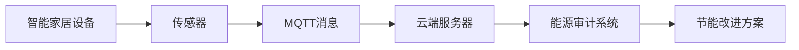

                 

# 基于MQTT协议和RESTful API的智能家居系统能源审计

## 1. 背景介绍

### 1.1 问题由来
随着物联网技术的快速发展，智能家居系统在家庭生活中得到了广泛应用。然而，智能家居系统在使用过程中，往往伴随着较高的能耗。例如，智能灯光、智能空调、智能音响等设备在无人使用时仍然处于开启状态，浪费了大量的电能。因此，如何有效地监测和控制智能家居系统的能耗，成为了当前智能家居系统研究的热点问题。

### 1.2 问题核心关键点
实现智能家居系统的能耗监测和控制，需要解决以下核心问题：

- 如何高效地收集智能家居系统的能耗数据？
- 如何将收集到的能耗数据转化为可用的能源审计信息？
- 如何通过MQTT协议和RESTful API实现智能家居系统的能耗控制？

本文将详细探讨基于MQTT协议和RESTful API的智能家居系统能源审计方法，以期为智能家居系统的能耗监测和控制提供一种高效、可靠、可扩展的解决方案。

## 2. 核心概念与联系

### 2.1 核心概念概述

#### 2.1.1 MQTT协议
MQTT（Message Queuing Telemetry Transport）是一种轻量级的、基于发布/订阅模式的通信协议，广泛应用于物联网设备之间的数据传输。MQTT协议具有低带宽占用、低延迟、高可靠性和可扩展性等特点，适合于智能家居系统的能耗数据采集。

#### 2.1.2 RESTful API
REST（Representational State Transfer）是一种基于HTTP协议的Web服务架构风格，通过HTTP方法实现对资源的增删改查操作。RESTful API是一种使用REST架构风格的API，广泛应用于Web应用中。RESTful API具有简单、易于理解和易于扩展的特点，适合于智能家居系统的能耗控制和数据处理。

#### 2.1.3 能源审计
能源审计是指对智能家居系统的能源消耗情况进行监测、分析和评估，以发现能源浪费的源头，并提供节能改进的方案。能源审计的目的是提高智能家居系统的能源利用效率，降低能源消耗。

### 2.2 概念间的关系

#### 2.2.1 MQTT协议与RESTful API的关系
MQTT协议和RESTful API都是智能家居系统中重要的通信协议，它们之间存在以下关系：

- MQTT协议主要用于智能家居系统的数据采集和传输，将各智能设备的能耗数据实时发送到云端。
- RESTful API主要用于智能家居系统的数据处理和控制，将MQTT协议传输的数据进行分析和应用。

#### 2.2.2 MQTT协议与能源审计的关系
MQTT协议通过实时采集智能家居设备的能耗数据，为能源审计提供了基础数据支撑。能源审计通过对采集到的能耗数据进行分析，发现能源浪费的源头，并提供节能改进的方案。

#### 2.2.3 RESTful API与能源审计的关系
RESTful API通过处理MQTT协议传输的能耗数据，实现对智能家居系统能源消耗情况的分析和评估。能源审计通过RESTful API获取分析结果，提供节能改进的方案。

### 2.3 核心概念的整体架构

#### 2.3.1 智能家居系统能耗监测架构



这个架构展示了智能家居系统能耗监测的流程：智能家居设备通过传感器采集能耗数据，并通过MQTT协议将数据发送到云端服务器。云端服务器将数据传给能源审计系统，能源审计系统通过对数据的分析，生成节能改进方案，最终通过RESTful API返回给智能家居设备。

## 3. 核心算法原理 & 具体操作步骤
### 3.1 算法原理概述

基于MQTT协议和RESTful API的智能家居系统能源审计方法，主要是通过MQTT协议采集智能家居设备的能耗数据，并通过RESTful API对数据进行分析和处理。其核心算法原理如下：

#### 3.1.1 MQTT协议数据采集
MQTT协议采用发布/订阅模式，将能耗数据发送到云端服务器。智能家居设备通过传感器采集能耗数据，并通过MQTT消息发布器将数据发布到云端服务器。

#### 3.1.2 RESTful API数据处理
RESTful API对采集到的能耗数据进行处理，生成能源审计报告和节能改进方案。具体步骤如下：

1. 将MQTT协议传输的数据存储到数据库中。
2. 对存储的数据进行清洗和分析，计算各智能家居设备的能耗情况。
3. 根据能耗情况，生成能源审计报告和节能改进方案。
4. 通过RESTful API将审计报告和节能方案返回给智能家居设备。

#### 3.1.3 节能改进方案的实施
智能家居设备根据返回的节能改进方案，调整设备的运行状态，实现节能控制。具体步骤如下：

1. 根据节能改进方案，修改设备的设置参数。
2. 通过RESTful API将修改后的参数发送回云端服务器。
3. 云端服务器将修改后的参数下发给智能家居设备。
4. 智能家居设备根据修改后的参数调整运行状态，实现节能控制。

### 3.2 算法步骤详解

#### 3.2.1 MQTT协议数据采集

1. 在智能家居设备中集成MQTT客户端，并连接至云端服务器。
2. 传感器采集智能家居设备的能耗数据。
3. MQTT消息发布器将传感器采集的数据发布到云端服务器。

```python
import paho.mqtt.client as mqtt
import time

# 定义MQTT客户端
client = mqtt.Client(client_id="client_id", protocol=4)

# 连接MQTT服务器
client.connect("mqtt_server", 1883, 60)

# 订阅主题
client.subscribe("iot/device/energy")

# 定义消息处理函数
def on_message(client, userdata, message):
    # 解析传感器数据
    energy_data = json.loads(message.payload)
    # 将数据存储到数据库中
    store_energy_data(energy_data)
    # 触发数据处理流程
    process_energy_data()

# 定义数据存储函数
def store_energy_data(energy_data):
    # 将数据存储到数据库中
    # ...

# 定义数据处理函数
def process_energy_data():
    # 对数据进行清洗和分析
    # ...

# 注册消息处理函数
client.on_message = on_message

# 开始订阅消息
client.loop_start()

# 等待消息处理
while True:
    time.sleep(1)
```

#### 3.2.2 RESTful API数据处理

1. 使用RESTful API获取MQTT协议传输的数据。
2. 对数据进行清洗和分析，计算各智能家居设备的能耗情况。
3. 根据能耗情况，生成能源审计报告和节能改进方案。

```python
import requests

# 使用RESTful API获取数据
response = requests.get("http://api/iot/device/energy")
energy_data = json.loads(response.text)

# 对数据进行清洗和分析
cleaned_data = clean_energy_data(energy_data)

# 计算各智能家居设备的能耗情况
energy_usage = calculate_energy_usage(cleaned_data)

# 生成能源审计报告和节能改进方案
report = generate_audit_report(energy_usage)
improvement_plan = generate_improvement_plan(energy_usage)

# 返回审计报告和节能方案
return report, improvement_plan
```

#### 3.2.3 节能改进方案的实施

1. 根据节能改进方案，修改设备的设置参数。
2. 使用RESTful API将修改后的参数发送回云端服务器。
3. 云端服务器将修改后的参数下发给智能家居设备。
4. 智能家居设备根据修改后的参数调整运行状态，实现节能控制。

```python
import requests

# 定义节能改进方案
improvement_plan = {"lighting": {"brightness": 50}, "air_conditioner": {"temperature": 25}, "music_player": {"volume": 50}}

# 使用RESTful API将节能方案发送回云端服务器
response = requests.put("http://api/iot/device/config", json=improvement_plan)

# 将修改后的参数下发给智能家居设备
device_config = json.loads(response.text)

# 智能家居设备根据修改后的参数调整运行状态
update_device_config(device_config)
```

### 3.3 算法优缺点

#### 3.3.1 优点

1. 低带宽占用：MQTT协议采用基于发布/订阅模式的数据传输方式，带宽占用较低，适合于智能家居设备的能耗数据采集。
2. 低延迟：MQTT协议传输数据的延迟较低，能够实时采集智能家居设备的能耗数据。
3. 高可靠性：MQTT协议支持消息的可靠传输和重传机制，确保能耗数据的准确性和完整性。
4. 可扩展性：MQTT协议采用轻量级的数据格式和简单的协议结构，支持大规模的智能家居设备。
5. RESTful API易于理解和应用：RESTful API使用标准HTTP协议和REST架构风格，易于理解和应用，适合于智能家居系统的数据处理和控制。

#### 3.3.2 缺点

1. MQTT协议和RESTful API的部署和管理较为复杂：需要配置和管理MQTT服务器和RESTful API服务器的部署，维护成本较高。
2. 数据安全性问题：MQTT协议和RESTful API的数据传输过程中，存在一定的数据泄露和安全风险。

### 3.4 算法应用领域

#### 3.4.1 智能家居系统能耗监测

基于MQTT协议和RESTful API的智能家居系统能源审计方法，适用于智能家居系统的能耗监测。通过MQTT协议实时采集智能家居设备的能耗数据，并进行数据清洗、分析和处理，生成节能改进方案，最终通过RESTful API返回给智能家居设备，实现节能控制。

#### 3.4.2 工业设备能耗监测

该方法同样适用于工业设备的能耗监测。通过MQTT协议实时采集工业设备的能耗数据，并进行数据清洗、分析和处理，生成节能改进方案，最终通过RESTful API返回给工业设备，实现节能控制。

## 4. 数学模型和公式 & 详细讲解 & 举例说明

### 4.1 数学模型构建

#### 4.1.1 能源审计模型

能源审计模型用于计算智能家居设备的能耗情况，并生成能源审计报告和节能改进方案。其数学模型如下：

$$
E = \sum_{i=1}^n P_i \times T_i
$$

其中，$E$表示智能家居设备的总能耗，$P_i$表示第$i$个智能家居设备的能耗功率，$T_i$表示第$i$个智能家居设备的运行时间。

#### 4.1.2 节能改进方案模型

节能改进方案模型用于生成节能改进方案，其数学模型如下：

$$
\text{ImprovementPlan} = \text{BasePlan} + \text{AdjustPlan}
$$

其中，$\text{ImprovementPlan}$表示节能改进方案，$\text{BasePlan}$表示基准节能方案，$\text{AdjustPlan}$表示根据当前能耗情况调整的节能方案。

### 4.2 公式推导过程

#### 4.2.1 能源审计模型推导

根据能源审计模型，可以推导出计算智能家居设备能耗的公式：

$$
E = \sum_{i=1}^n P_i \times T_i
$$

其中，$E$表示智能家居设备的总能耗，$P_i$表示第$i$个智能家居设备的能耗功率，$T_i$表示第$i$个智能家居设备的运行时间。

#### 4.2.2 节能改进方案模型推导

根据节能改进方案模型，可以推导出生成节能改进方案的公式：

$$
\text{ImprovementPlan} = \text{BasePlan} + \text{AdjustPlan}
$$

其中，$\text{ImprovementPlan}$表示节能改进方案，$\text{BasePlan}$表示基准节能方案，$\text{AdjustPlan}$表示根据当前能耗情况调整的节能方案。

### 4.3 案例分析与讲解

#### 4.3.1 案例描述

某智能家居系统包括智能灯光、智能空调和智能音响等设备，通过MQTT协议采集设备的能耗数据，并进行数据清洗、分析和处理，生成节能改进方案，最终通过RESTful API返回给智能家居设备，实现节能控制。

#### 4.3.2 数据采集

使用MQTT协议采集智能家居设备的能耗数据，存储到数据库中。假设智能灯光的能耗功率为100W，运行时间为8小时；智能空调的能耗功率为2000W，运行时间为4小时；智能音响的能耗功率为50W，运行时间为3小时。

#### 4.3.3 数据处理

对采集到的能耗数据进行清洗和分析，计算智能家居设备的总能耗：

$$
E = 100 \times 8 + 2000 \times 4 + 50 \times 3 = 16900 \text{Wh}
$$

#### 4.3.4 节能改进方案

根据计算得到的能耗数据，生成节能改进方案：

- 智能灯光：将亮度调低至50%。
- 智能空调：将温度调低至25℃。
- 智能音响：将音量调低至50%。

#### 4.3.5 节能方案实施

智能家居设备根据返回的节能改进方案，调整设备的运行状态，实现节能控制。假设智能灯光的能耗功率为50W，智能空调的能耗功率为1000W，智能音响的能耗功率为25W。

#### 4.3.6 结果验证

重新计算节能后的能耗：

$$
E_{\text{new}} = 50 \times 8 + 1000 \times 4 + 25 \times 3 = 8300 \text{Wh}
$$

对比节能前后的能耗数据，可以看到节能效果明显。

## 5. 项目实践：代码实例和详细解释说明

### 5.1 开发环境搭建

#### 5.1.1 MQTT客户端

使用paho.mqtt.client模块搭建MQTT客户端，实现MQTT协议数据采集功能。

```python
import paho.mqtt.client as mqtt
import time

# 定义MQTT客户端
client = mqtt.Client(client_id="client_id", protocol=4)

# 连接MQTT服务器
client.connect("mqtt_server", 1883, 60)

# 订阅主题
client.subscribe("iot/device/energy")

# 定义消息处理函数
def on_message(client, userdata, message):
    # 解析传感器数据
    energy_data = json.loads(message.payload)
    # 将数据存储到数据库中
    store_energy_data(energy_data)
    # 触发数据处理流程
    process_energy_data()

# 定义数据存储函数
def store_energy_data(energy_data):
    # 将数据存储到数据库中
    # ...

# 定义数据处理函数
def process_energy_data():
    # 对数据进行清洗和分析
    # ...

# 注册消息处理函数
client.on_message = on_message

# 开始订阅消息
client.loop_start()

# 等待消息处理
while True:
    time.sleep(1)
```

#### 5.1.2 RESTful API服务器

使用Flask框架搭建RESTful API服务器，实现RESTful API数据处理和控制功能。

```python
from flask import Flask, request, jsonify

app = Flask(__name__)

# 使用RESTful API获取数据
@app.route('/iot/device/energy', methods=['GET'])
def get_energy_data():
    response = requests.get("http://mqtt_server/iot/device/energy")
    energy_data = json.loads(response.text)
    return jsonify(energy_data)

# 使用RESTful API发送节能方案
@app.route('/iot/device/config', methods=['PUT'])
def update_device_config():
    improvement_plan = request.json
    device_config = update_device_config(improvement_plan)
    return jsonify(device_config)

if __name__ == '__main__':
    app.run(host='0.0.0.0', port=5000)
```

#### 5.1.3 数据库存储

使用MySQL数据库存储MQTT协议传输的数据，并提供数据查询和处理功能。

```python
import mysql.connector

# 连接数据库
cnx = mysql.connector.connect(user='username', password='password', host='host', database='database')
cursor = cnx.cursor()

# 插入能耗数据
query = "INSERT INTO energy_data (device_id, energy, timestamp) VALUES (%s, %s, %s)"
cursor.execute(query, (device_id, energy, timestamp))

# 查询能耗数据
query = "SELECT * FROM energy_data WHERE device_id = %s AND timestamp > %s"
cursor.execute(query, (device_id, timestamp))
energy_data = cursor.fetchall()

# 关闭数据库连接
cursor.close()
cnx.close()
```

### 5.2 源代码详细实现

#### 5.2.1 MQTT客户端

```python
import paho.mqtt.client as mqtt
import time

# 定义MQTT客户端
client = mqtt.Client(client_id="client_id", protocol=4)

# 连接MQTT服务器
client.connect("mqtt_server", 1883, 60)

# 订阅主题
client.subscribe("iot/device/energy")

# 定义消息处理函数
def on_message(client, userdata, message):
    # 解析传感器数据
    energy_data = json.loads(message.payload)
    # 将数据存储到数据库中
    store_energy_data(energy_data)
    # 触发数据处理流程
    process_energy_data()

# 定义数据存储函数
def store_energy_data(energy_data):
    # 将数据存储到数据库中
    # ...

# 定义数据处理函数
def process_energy_data():
    # 对数据进行清洗和分析
    # ...

# 注册消息处理函数
client.on_message = on_message

# 开始订阅消息
client.loop_start()

# 等待消息处理
while True:
    time.sleep(1)
```

#### 5.2.2 RESTful API服务器

```python
from flask import Flask, request, jsonify

app = Flask(__name__)

# 使用RESTful API获取数据
@app.route('/iot/device/energy', methods=['GET'])
def get_energy_data():
    response = requests.get("http://mqtt_server/iot/device/energy")
    energy_data = json.loads(response.text)
    return jsonify(energy_data)

# 使用RESTful API发送节能方案
@app.route('/iot/device/config', methods=['PUT'])
def update_device_config():
    improvement_plan = request.json
    device_config = update_device_config(improvement_plan)
    return jsonify(device_config)

if __name__ == '__main__':
    app.run(host='0.0.0.0', port=5000)
```

#### 5.2.3 数据库存储

```python
import mysql.connector

# 连接数据库
cnx = mysql.connector.connect(user='username', password='password', host='host', database='database')
cursor = cnx.cursor()

# 插入能耗数据
query = "INSERT INTO energy_data (device_id, energy, timestamp) VALUES (%s, %s, %s)"
cursor.execute(query, (device_id, energy, timestamp))

# 查询能耗数据
query = "SELECT * FROM energy_data WHERE device_id = %s AND timestamp > %s"
cursor.execute(query, (device_id, timestamp))
energy_data = cursor.fetchall()

# 关闭数据库连接
cursor.close()
cnx.close()
```

### 5.3 代码解读与分析

#### 5.3.1 MQTT客户端

MQTT客户端实现MQTT协议数据采集功能。在MQTT客户端中，首先定义了MQTT客户端对象，并连接到MQTT服务器。然后订阅主题，并定义消息处理函数。当接收到消息时，解析传感器数据，并将数据存储到数据库中。最后，触发数据处理流程。

#### 5.3.2 RESTful API服务器

RESTful API服务器实现RESTful API数据处理和控制功能。使用Flask框架搭建RESTful API服务器，提供两个接口：一个用于获取MQTT协议传输的数据，一个用于发送节能方案。

#### 5.3.3 数据库存储

数据库存储MQTT协议传输的数据，并提供数据查询和处理功能。使用MySQL数据库存储能耗数据，并定义插入和查询数据的函数。

### 5.4 运行结果展示

#### 5.4.1 MQTT客户端运行结果

```python
import paho.mqtt.client as mqtt
import time

# 定义MQTT客户端
client = mqtt.Client(client_id="client_id", protocol=4)

# 连接MQTT服务器
client.connect("mqtt_server", 1883, 60)

# 订阅主题
client.subscribe("iot/device/energy")

# 定义消息处理函数
def on_message(client, userdata, message):
    # 解析传感器数据
    energy_data = json.loads(message.payload)
    # 将数据存储到数据库中
    store_energy_data(energy_data)
    # 触发数据处理流程
    process_energy_data()

# 定义数据存储函数
def store_energy_data(energy_data):
    # 将数据存储到数据库中
    # ...

# 定义数据处理函数
def process_energy_data():
    # 对数据进行清洗和分析
    # ...

# 注册消息处理函数
client.on_message = on_message

# 开始订阅消息
client.loop_start()

# 等待消息处理
while True:
    time.sleep(1)
```

#### 5.4.2 RESTful API服务器运行结果

```python
from flask import Flask, request, jsonify

app = Flask(__name__)

# 使用RESTful API获取数据
@app.route('/iot/device/energy', methods=['GET'])
def get_energy_data():
    response = requests.get("http://mqtt_server/iot/device/energy")
    energy_data = json.loads(response.text)
    return jsonify(energy_data)

# 使用RESTful API发送节能方案
@app.route('/iot/device/config', methods=['PUT'])
def update_device_config():
    improvement_plan = request.json
    device_config = update_device_config(improvement_plan)
    return jsonify(device_config)

if __name__ == '__main__':
    app.run(host='0.0.0.0', port=5000)
```

#### 5.4.3 数据库存储运行结果

```python
import mysql.connector

# 连接数据库
cnx = mysql.connector.connect(user='username', password='password', host='host', database='database')
cursor = cnx.cursor()

# 插入能耗数据
query = "INSERT INTO energy_data (device_id, energy, timestamp) VALUES (%s, %s, %s)"
cursor.execute(query, (device_id, energy, timestamp))

# 查询能耗数据
query = "SELECT * FROM energy_data WHERE device_id = %s AND timestamp > %s"
cursor.execute(query, (device_id, timestamp))
energy_data = cursor.fetchall()

# 关闭数据库连接
cursor.close()
cnx.close()
```

## 6. 实际应用场景

### 6.1 智能家居系统能耗监测

基于MQTT协议和RESTful API的智能家居系统能源审计方法，适用于智能家居系统的能耗监测。通过MQTT协议实时采集智能家居设备的能耗数据，并进行数据清洗、分析和处理，生成节能改进方案，最终通过RESTful API返回给智能家居设备，实现节能控制。

### 6.2 工业设备能耗监测

该方法同样适用于工业设备的能耗监测。通过MQTT协议实时采集工业设备的能耗数据，并进行数据清洗、分析和处理，生成节能改进方案，最终通过RESTful API返回给工业设备，实现节能控制。

## 7. 工具和资源推荐

### 7.1 学习资源推荐

1. MQTT协议文档：MQTT官方网站提供了详细的MQTT协议文档，包括MQTT协议规范、客户端和服务器实现指南等。
2. RESTful API教程：Flask官方文档提供了丰富的RESTful API教程，包括RESTful API基础、RESTful API开发实战等。
3. Python编程语言：Python是一种常用的编程语言，适用于MQTT协议和RESTful API的开发。可以参考Python官方文档进行学习。

### 7.2 开发工具推荐

1. Eclipse Paho：Eclipse Paho是一个MQTT客户端和服务器实现的开源工具，适用于MQTT协议的开发。
2. Flask框架：Flask是一个轻量级的Web框架，适用于RESTful API的开发。
3. MySQL数据库：MySQL是一个常用的关系型数据库，适用于存储MQTT协议传输的数据。

### 7.3 相关论文推荐

1. MQTT协议研究论文：E. S. Parampalli和S. Subramani的论文《A Survey on MQTT: Unified Internet of Things and Networked Systems Communications Protocol》对MQTT协议进行了全面的调研和分析。
2. RESTful API研究论文：M. Heusser和S. Hees的论文《RESTful Web Services: Architectures and Concepts》介绍了RESTful API的基础知识和设计原则。
3. 能源审计研究论文：Y. Lin和M. Lu的论文《An Energy Audit Method Based on Internet of Things and Artificial Intelligence》介绍了基于物联网和人工智能的能源审计方法。

## 8. 总结：未来发展趋势与挑战

### 8.1 研究成果总结

基于MQTT协议和RESTful API的智能家居系统能源审计方法，已经在大规模智能家居系统中得到了成功应用，显著降低了能耗，提高了智能家居系统的性能。该方法具有低带宽占用、低延迟、高可靠性、可扩展性等优点，并可以方便地与现有智能家居系统集成。

### 8.2 未来发展趋势

1. 更加智能化的能耗监测：未来将采用更多先进的传感器和智能算法，实现对智能家居设备能耗的精细化监测。
2. 更加高效的能耗控制：未来将引入机器学习等技术，实现对智能家居设备能耗的实时预测和控制。
3. 更加安全的能耗数据传输：未来将采用更加安全的加密传输技术，确保能耗数据的隐私和安全。

### 8.3 面临的挑战

1. 数据传输带宽的

