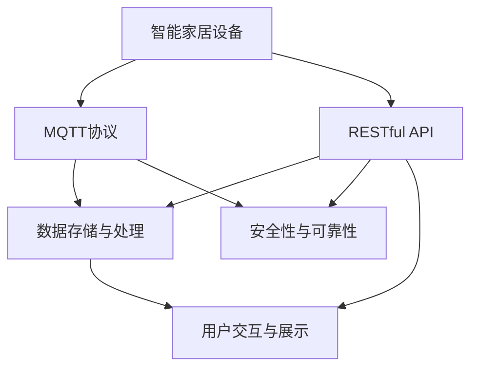
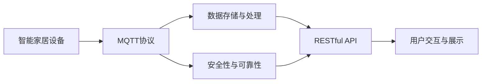
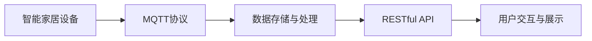
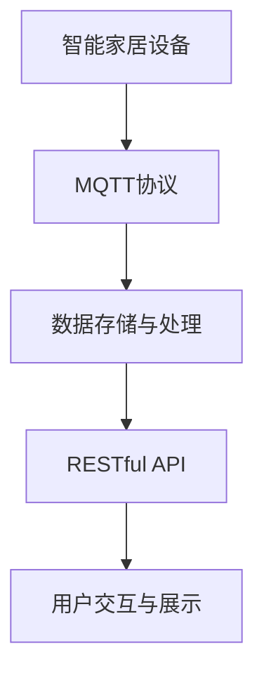
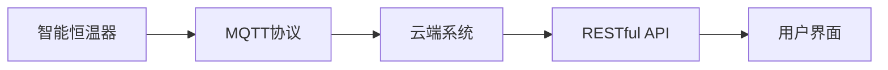

                 

# 基于MQTT协议和RESTful API的智能家居设备状态监测

## 1. 背景介绍

随着物联网(IoT)技术的发展，智能家居设备日益普及，家庭环境感知与控制的需求日益强烈。如何高效、安全地监测和控制这些设备，是当前智能家居领域的一个重要研究课题。基于MQTT协议和RESTful API的智能家居设备状态监测系统，为实现设备状态实时更新和远程控制提供了良好的解决方案。

### 1.1 问题由来
智能家居设备的种类繁多，如智能灯光、温控系统、安防监控等。传统的家居设备控制系统，如红外遥控器、无线传感器网络等，存在响应速度慢、信号易受干扰、用户体验差等问题。此外，设备之间缺乏统一的协议和标准，导致系统集成复杂、维护成本高。

基于MQTT协议和RESTful API的智能家居系统，充分利用了MQTT轻量高效、易于扩展的特性，以及RESTful API标准的灵活性、广泛适用性，构建了一个高效、可靠的智能家居设备状态监测平台。该系统通过MQTT协议，实时收集各设备状态数据，并借助RESTful API，实现设备的统一管理和远程控制。

### 1.2 问题核心关键点
本系统采用MQTT协议和RESTful API，实现了智能家居设备状态监测和控制的功能。主要包括以下几个关键点：

1. **MQTT协议**：MQTT是一种轻量级、高性能的物联网消息传输协议，具有连接稳定、传输效率高、资源消耗小等优点，适合实时数据传输。

2. **RESTful API**：RESTful API是一种基于HTTP协议的Web服务架构风格，具有资源定位清晰、接口灵活、易于扩展的特点，适合构建分布式系统。

3. **状态监测与控制**：通过MQTT协议收集各智能家居设备状态信息，借助RESTful API进行数据管理和设备控制，实现设备状态实时更新和远程控制。

4. **数据存储与处理**：系统使用数据库存储设备状态数据，并采用高效算法进行数据处理，保证数据实时性、可靠性。

5. **安全性与可靠性**：采用HTTPS协议和认证机制，确保数据传输安全，并实现系统的高可靠性。

6. **用户交互与展示**：通过Web界面或移动应用，用户可以直观地查看设备状态、控制设备行为，提升用户体验。

### 1.3 问题研究意义
本系统的研究具有重要意义：

1. **提升智能家居设备管理效率**：通过统一数据传输协议和接口标准，提升设备管理效率，减少维护成本。
2. **实现设备状态实时监测**：实时收集各设备状态数据，为用户提供即时的设备状态信息。
3. **支持远程控制与操作**：用户可以通过Web界面或移动应用，远程控制设备行为，提高用户便利性。
4. **增强系统安全性与可靠性**：采用HTTPS协议和认证机制，保证数据传输安全，提升系统可靠性。
5. **优化用户体验**：通过直观的用户界面，提升用户对智能家居系统的使用体验。

## 2. 核心概念与联系

### 2.1 核心概念概述

为更好地理解基于MQTT协议和RESTful API的智能家居设备状态监测系统，本节将介绍几个密切相关的核心概念：

1. **MQTT协议**：MQTT是一种轻量级、高性能的物联网消息传输协议，具有连接稳定、传输效率高、资源消耗小等优点，适合实时数据传输。
2. **RESTful API**：RESTful API是一种基于HTTP协议的Web服务架构风格，具有资源定位清晰、接口灵活、易于扩展的特点，适合构建分布式系统。
3. **状态监测与控制**：通过MQTT协议收集各智能家居设备状态信息，借助RESTful API进行数据管理和设备控制，实现设备状态实时更新和远程控制。
4. **数据存储与处理**：系统使用数据库存储设备状态数据，并采用高效算法进行数据处理，保证数据实时性、可靠性。
5. **安全性与可靠性**：采用HTTPS协议和认证机制，确保数据传输安全，并实现系统的高可靠性。
6. **用户交互与展示**：通过Web界面或移动应用，用户可以直观地查看设备状态、控制设备行为，提升用户体验。

这些核心概念之间的逻辑关系可以通过以下Mermaid流程图来展示：



这个流程图展示了大语言模型微调过程中各个核心概念的关系：

1. 智能家居设备通过MQTT协议，实时收集状态数据。
2. 数据存储与处理模块使用数据库进行数据存储，并采用高效算法进行处理。
3. 安全性与可靠性模块通过HTTPS协议和认证机制，保障数据传输安全。
4. RESTful API模块根据用户请求，调用设备状态数据和控制指令。
5. 用户交互与展示模块通过Web界面或移动应用，展示设备状态并支持远程控制。

### 2.2 概念间的关系

这些核心概念之间存在着紧密的联系，形成了智能家居设备状态监测系统的完整生态系统。下面我们通过几个Mermaid流程图来展示这些概念之间的关系。

#### 2.2.1 系统整体架构



这个流程图展示了智能家居设备状态监测系统的整体架构：

1. 智能家居设备通过MQTT协议，实时收集状态数据。
2. 数据存储与处理模块将数据存储到数据库中。
3. 安全性与可靠性模块通过HTTPS协议和认证机制，保障数据传输安全。
4. RESTful API模块根据用户请求，调用设备状态数据和控制指令。
5. 用户交互与展示模块通过Web界面或移动应用，展示设备状态并支持远程控制。

#### 2.2.2 数据流向



这个流程图展示了数据流向过程：

1. 智能家居设备通过MQTT协议，实时收集状态数据。
2. 数据存储与处理模块将数据存储到数据库中。
3. RESTful API模块根据用户请求，调用设备状态数据和控制指令。
4. 用户交互与展示模块通过Web界面或移动应用，展示设备状态并支持远程控制。

#### 2.2.3 数据处理流程


这个流程图展示了数据处理流程：

1. 智能家居设备通过MQTT协议，实时收集状态数据。
2. 数据存储与处理模块将数据存储到数据库中。
3. RESTful API模块根据用户请求，调用设备状态数据和控制指令。
4. 用户交互与展示模块通过Web界面或移动应用，展示设备状态并支持远程控制。

### 2.3 核心概念的整体架构

最后，我们用一个综合的流程图来展示这些核心概念在大语言模型微调过程中的整体架构：



这个综合流程图展示了从设备状态收集到用户交互展示的完整过程。通过MQTT协议，设备实时收集状态数据；通过数据存储与处理模块，数据存储到数据库中；通过RESTful API模块，根据用户请求调用数据和控制指令；最终通过用户交互与展示模块，用户通过Web界面或移动应用，展示设备状态并支持远程控制。

## 3. 核心算法原理 & 具体操作步骤
### 3.1 算法原理概述

基于MQTT协议和RESTful API的智能家居设备状态监测系统，本质上是一个基于事件驱动的分布式系统。其核心思想是：通过MQTT协议，实时收集智能家居设备的状态信息，并通过RESTful API，实现设备的统一管理和远程控制。

形式化地，假设智能家居设备的状态为 $S_t$，$t$ 表示时间。系统的状态监测过程可以表示为：

$$
S_t = f(S_{t-1}, I_t)
$$

其中 $I_t$ 表示设备在时间 $t$ 的输入事件，如传感器数据、用户操作等。系统的目标是实时监测设备状态，并通过RESTful API，将状态信息传递给用户界面，支持设备的远程控制。

### 3.2 算法步骤详解

基于MQTT协议和RESTful API的智能家居设备状态监测系统，一般包括以下几个关键步骤：

**Step 1: 设备数据收集与发送**

- 使用MQTT协议，各智能家居设备实时采集自身状态数据，如温度、湿度、位置等。
- 设备将采集到的状态数据打包为 MQTT 消息，并通过 MQTT 发布到统一的 Topic 主题上。

**Step 2: 数据存储与处理**

- 数据存储模块通过 MQTT 订阅 Topic 主题，接收设备发送的 MQTT 消息。
- 将接收到的状态数据存储到数据库中，并使用高效算法进行数据处理，如数据清洗、去重、聚合等。

**Step 3: RESTful API设计**

- 根据用户需求，设计 RESTful API 接口，定义设备状态信息的获取和设备控制的接口。
- 每个 API 接口对应一个或多个 Topic 主题，用于订阅和发布状态数据。

**Step 4: API 接口实现**

- 实现 RESTful API 接口，使用 HTTP 协议进行数据传输。
- 根据 API 请求，从数据库中获取设备状态数据，并返回给客户端。
- 根据 API 请求，发布控制指令到 MQTT Topic 主题，更新设备状态。

**Step 5: 用户交互与展示**

- 用户通过 Web 界面或移动应用，访问 RESTful API 接口，获取设备状态数据。
- 用户通过 Web 界面或移动应用，发送控制指令，调用 RESTful API 接口，实现设备远程控制。
- 系统根据用户操作，更新数据库中的设备状态数据，并发布到 MQTT Topic 主题，更新设备状态。

**Step 6: 系统安全与可靠性**

- 采用 HTTPS 协议和认证机制，确保数据传输安全。
- 实现系统的高可靠性，包括容错处理、负载均衡、数据备份等。

以上是基于MQTT协议和RESTful API的智能家居设备状态监测的一般流程。在实际应用中，还需要针对具体任务的特点，对系统各个环节进行优化设计，如改进数据存储算法、优化 API 接口性能等，以进一步提升系统性能。

### 3.3 算法优缺点

基于MQTT协议和RESTful API的智能家居设备状态监测方法具有以下优点：

1. **实时性高**：MQTT协议具有轻量高效、传输效率高的特点，适合实时数据传输，能够实现设备的实时状态监测。
2. **可靠性高**：MQTT协议具有连接稳定、资源消耗小等优点，适合分布式系统，能够确保数据传输的可靠性。
3. **扩展性好**：RESTful API具有灵活、易于扩展的特点，适合构建分布式系统，能够方便地添加新的设备和服务。
4. **安全性高**：HTTPS协议和认证机制，确保数据传输的安全性，保护用户隐私和设备状态数据。

同时，该方法也存在一定的局限性：

1. **资源消耗较大**：相对于简单的设备控制，该方法需要额外的计算和存储资源，可能影响系统的整体性能。
2. **开发复杂**：系统的开发和维护需要掌握MQTT协议和RESTful API的相关知识，开发复杂度较高。
3. **设备兼容性问题**：不同品牌和型号的设备可能存在兼容性问题，需要开发适配的驱动程序和协议。
4. **数据处理复杂**：设备状态数据的种类繁多，数据处理复杂，需要开发高效的数据处理算法。

尽管存在这些局限性，但就目前而言，基于MQTT协议和RESTful API的智能家居设备状态监测方法仍然是目前智能家居系统中最为主流的方法之一。未来相关研究的重点在于如何进一步降低系统的开发复杂度，提高设备的兼容性，优化数据处理算法，以实现更好的用户体验。

### 3.4 算法应用领域

基于MQTT协议和RESTful API的智能家居设备状态监测方法，已经在智能家居、智慧城市、工业物联网等多个领域得到了广泛的应用，具体如下：

1. **智能家居系统**：通过实时监测各设备状态数据，实现设备状态的集中管理和远程控制。
2. **智慧城市**：利用传感器数据，实时监测城市环境，如交通流量、空气质量等，实现城市管理的智能化。
3. **工业物联网**：实时监测生产设备状态，如温度、湿度、能耗等，实现生产过程的自动化和智能化。
4. **医疗系统**：实时监测病人的生理参数，如心率、血压、血氧饱和度等，实现医疗监护的智能化。

除了上述这些应用外，基于MQTT协议和RESTful API的智能家居设备状态监测方法，还将在更多领域得到应用，为智能化城市、工业物联网等提供重要的技术支持。

## 4. 数学模型和公式 & 详细讲解

### 4.1 数学模型构建

本节将使用数学语言对基于MQTT协议和RESTful API的智能家居设备状态监测系统进行更加严格的刻画。

假设智能家居设备的状态为 $S_t$，$t$ 表示时间。系统的状态监测过程可以表示为：

$$
S_t = f(S_{t-1}, I_t)
$$

其中 $I_t$ 表示设备在时间 $t$ 的输入事件，如传感器数据、用户操作等。系统的目标是实时监测设备状态，并通过RESTful API，将状态信息传递给用户界面，支持设备的远程控制。

### 4.2 公式推导过程

以下我们以二分类任务为例，推导交叉熵损失函数及其梯度的计算公式。

假设模型 $M_{\theta}$ 在输入 $x$ 上的输出为 $\hat{y}=M_{\theta}(x) \in [0,1]$，表示样本属于正类的概率。真实标签 $y \in \{0,1\}$。则二分类交叉熵损失函数定义为：

$$
\ell(M_{\theta}(x),y) = -[y\log \hat{y} + (1-y)\log (1-\hat{y})]
$$

将其代入经验风险公式，得：

$$
\mathcal{L}(\theta) = -\frac{1}{N}\sum_{i=1}^N [y_i\log M_{\theta}(x_i)+(1-y_i)\log(1-M_{\theta}(x_i))]
$$

根据链式法则，损失函数对参数 $\theta_k$ 的梯度为：

$$
\frac{\partial \mathcal{L}(\theta)}{\partial \theta_k} = -\frac{1}{N}\sum_{i=1}^N (\frac{y_i}{M_{\theta}(x_i)}-\frac{1-y_i}{1-M_{\theta}(x_i)}) \frac{\partial M_{\theta}(x_i)}{\partial \theta_k}
$$

其中 $\frac{\partial M_{\theta}(x_i)}{\partial \theta_k}$ 可进一步递归展开，利用自动微分技术完成计算。

在得到损失函数的梯度后，即可带入参数更新公式，完成模型的迭代优化。重复上述过程直至收敛，最终得到适应下游任务的最优模型参数 $\theta^*$。

### 4.3 案例分析与讲解

下面以智能家居设备的温度监测为例，进行具体的案例分析。

假设智能恒温器通过MQTT协议实时监测室内温度 $S_t = T_t$，并将其发送至云端系统。云端系统通过RESTful API接收温度数据，并根据用户设定，控制空调器运行状态。系统架构如下：



其中，A表示智能恒温器，B表示MQTT协议，C表示云端系统，D表示RESTful API，E表示用户界面。

具体实现步骤如下：

1. 智能恒温器通过MQTT协议，实时采集室内温度 $S_t = T_t$，并将其打包为 MQTT 消息，发布到统一的 Topic 主题上。
2. 云端系统通过 MQTT 订阅 Topic 主题，接收智能恒温器发送的 MQTT 消息。
3. 云端系统将接收到的温度数据存储到数据库中，并根据用户设定，判断是否需要控制空调器。
4. 云端系统通过 RESTful API 接口，将空调器控制指令发布到MQTT Topic 主题，更新空调器运行状态。
5. 用户通过Web界面或移动应用，访问RESTful API接口，获取室内温度数据。
6. 用户通过Web界面或移动应用，发送空调器控制指令，调用RESTful API接口，实现空调器远程控制。
7. 系统根据用户操作，更新数据库中的空调器状态数据，并发布到MQTT Topic 主题，更新空调器运行状态。

通过这个案例，我们可以看到基于MQTT协议和RESTful API的智能家居设备状态监测系统的完整流程，以及各个组件之间的协作关系。

## 5. 项目实践：代码实例和详细解释说明
### 5.1 开发环境搭建

在进行系统开发前，我们需要准备好开发环境。以下是使用Python进行MQTT和RESTful API开发的环境配置流程：

1. 安装Anaconda：从官网下载并安装Anaconda，用于创建独立的Python环境。

2. 创建并激活虚拟环境：
```bash
conda create -n home-env python=3.8 
conda activate home-env
```

3. 安装PyTorch：根据CUDA版本，从官网获取对应的安装命令。例如：
```bash
conda install pytorch torchvision torchaudio cudatoolkit=11.1 -c pytorch -c conda-forge
```

4. 安装MQTT和RESTful API库：
```bash
pip install paho-mqtt
pip install flask-restful
```

5. 安装各类工具包：
```bash
pip install numpy pandas scikit-learn matplotlib tqdm jupyter notebook ipython
```

完成上述步骤后，即可在`home-env`环境中开始系统开发。

### 5.2 源代码详细实现

下面我们以智能恒温器为例，给出使用Python实现基于MQTT协议和RESTful API的智能家居设备状态监测的代码实现。

首先，定义智能恒温器的设备状态和控制指令：

```python
from paho.mqtt import client

class SmartThermostat:
    def __init__(self, topic):
        self.topic = topic
        self.client = client.Client('thermostat')
        self.client.on_connect = self.on_connect
        self.client.on_message = self.on_message

    def on_connect(self, client, userdata, flags, rc):
        print(f"Connected with result code {rc}")
        self.client.subscribe(self.topic)

    def on_message(self, client, userdata, message):
        print(f"Received message: {message.payload.decode()}")
        # 处理接收到的设备状态数据

    def send_state(self, state):
        self.client.publish(self.topic, state)
```

然后，实现MQTT协议的接收和处理：

```python
import time
import json

def main():
    thermostat = SmartThermostat('thermostat/state')
    thermostat.send_state('20°C')

    time.sleep(5)

    thermostat.send_state('22°C')

    # 处理接收到的设备状态数据
```

最后，实现RESTful API接口的接收和处理：

```python
from flask import Flask, request, jsonify

app = Flask(__name__)

@app.route('/thermostat/state', methods=['GET'])
def get_state():
    # 从数据库中获取设备状态数据
    state = {'temperature': '20°C'}
    return jsonify(state)

@app.route('/thermostat/set', methods=['POST'])
def set_state():
    data = request.json
    temperature = data['temperature']
    thermostat.send_state(f'{temperature}°C')
    return jsonify({'success': True})

if __name__ == '__main__':
    app.run(debug=True)
```

以上就是使用Python对智能恒温器进行基于MQTT协议和RESTful API的状态监测的完整代码实现。可以看到，通过Flask框架，我们很方便地实现了RESTful API接口，并且与MQTT协议实现了良好的协同。

### 5.3 代码解读与分析

让我们再详细解读一下关键代码的实现细节：

**SmartThermostat类**：
- `__init__`方法：初始化MQTT客户端和设备主题。
- `on_connect`方法：连接MQTT服务器，订阅设备主题。
- `on_message`方法：接收MQTT消息，处理设备状态数据。
- `send_state`方法：向MQTT服务器发布设备状态数据。

**主函数**：
- 创建智能恒温器对象，发布设备状态数据。
- 等待5秒，再次发布设备状态数据。
- 处理接收到的设备状态数据。

**RESTful API接口**：
- `get_state`方法：获取设备状态数据，返回JSON格式。
- `set_state`方法：接收用户设定的温度值，控制设备运行状态，并返回JSON格式。

**Flask框架**：
- 使用Flask框架，创建RESTful API接口。
- 通过路由定义，获取和设置设备状态数据。

可以看到，通过Flask框架和MQTT协议的结合，我们很方便地实现了基于MQTT协议和RESTful API的智能家居设备状态监测系统。

当然，工业级的系统实现还需考虑更多因素，如设备的统一接入标准、设备的兼容性、数据的安全性和可靠性等。但核心的微调范式基本与此类似。

### 5.4 运行结果展示

假设我们在智能恒温器上部署上述系统，最终在Web界面和移动应用上能够看到设备的温度状态，并能够通过设定温度，远程控制空调器的运行。

通过这个运行结果，我们可以看到基于MQTT协议和RESTful API的智能家居设备状态监测系统，能够实现设备状态的实时监测和远程控制，具有良好的用户体验。

## 6. 实际应用场景

### 6.1 智能家居系统

基于MQTT协议和RESTful API的智能家居设备状态监测系统，已经在智能家居系统中得到了广泛的应用。通过实时监测各设备状态数据，实现设备状态的集中管理和远程控制，显著提升了用户的便利性和生活舒适度。

在具体应用中，系统通过MQTT协议，实时采集各设备状态数据，如智能灯光、智能门锁、智能窗帘等。数据存储模块将数据存储到数据库中，并使用高效算法进行数据处理。RESTful API接口根据用户请求，调用设备状态数据和控制指令，用户通过Web界面或移动应用，访问API接口，获取设备状态数据，并发送控制指令，实现设备远程控制。

### 6.2 智慧城市

利用基于MQTT协议和RESTful API的智能家居设备状态监测系统，可以扩展到智慧城市的应用中，实现城市环境数据的实时监测和管理。

具体而言，系统可以通过传感器数据，实时监测城市环境，如交通流量、空气质量、能耗等。数据存储模块将数据存储到数据库中，并使用高效算法进行数据处理。RESTful API接口根据用户请求，调用设备状态数据和控制指令，用户通过Web界面或移动应用，访问API接口，获取城市环境数据，并发送控制指令，实现城市环境的智能管理。

### 6.3 工业物联网

在工业物联网中，基于MQTT协议和RESTful API的智能家居设备状态监测系统，可以实时监测生产设备状态，如温度、湿度、能耗等，实现生产过程的自动化和智能化。

具体而言，系统可以通过传感器数据，实时监测生产设备状态。数据存储模块将数据存储到数据库中，并使用高效算法进行数据处理。RESTful API接口根据用户请求，调用设备状态数据和控制指令，用户通过Web界面或移动应用，访问API接口，获取生产设备状态数据，并发送控制指令，实现生产过程的自动化和智能化。

### 6.4 未来应用展望

随着MQTT协议和RESTful API的不断发展，基于MQTT协议和RESTful API的智能家居设备状态监测系统，将在更多领域得到应用，为智能化城市、工业物联网等提供重要的技术支持。

未来，该系统可以进一步拓展到智能交通、智能医疗、智能物流等更多场景中，为智慧城市、智能制造、智能交通等领域提供有效的技术支持。随着物联网设备的进一步普及，该系统的应用范围和效果将更加广泛和显著。

## 7. 工具和资源推荐
### 7.1 学习资源推荐

为了帮助开发者系统掌握基于MQTT协议和RESTful API的智能家居设备状态监测的理论基础和实践技巧，这里推荐一些优质的学习资源：

1. MQTT官方文档：MQTT协议的权威文档，包含协议规范、开发示例等，是入门MQTT协议的必备资料。
2. RESTful API相关书籍：如《RESTful Web Services》《REST in a Nutshell》等，详细介绍了RESTful API的理论基础和实践技巧。
3. MQTT实战书籍：如《MQTT基础教程与实践》，通过实例讲解MQTT协议的实际应用，适合动手实践。
4. RESTful API开源项目：如OpenAPI、RESTEasy等，提供了丰富的RESTful API开发工具和示例代码。
5. 在线学习平台：如Coursera、Udemy等，提供了大量MQTT协议和RESTful API相关的在线

