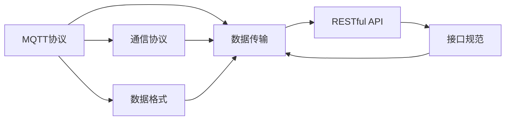

                 

# 基于MQTT协议和RESTful API的智能家居设备适配性分析

## 1. 背景介绍

在智能家居领域，设备之间的通信和数据交互是实现自动化和互联互通的核心。近年来，随着物联网技术的快速发展，越来越多的设备通过MQTT协议和RESTful API进行互联。然而，由于设备之间的异构性，数据格式、通信协议等方面的适配性问题变得尤为突出。本文旨在通过深入分析MQTT协议和RESTful API的特点，探讨其在智能家居设备互联中的适配性问题，并提出一些解决方案，以期为智能家居设备开发者提供参考。

### 1.1 智能家居设备现状

智能家居设备主要包括家电、传感器、安防设备等。这些设备通过WiFi、蓝牙、Zigbee等无线通信协议接入网络，并通过MQTT协议或RESTful API进行数据交互和控制。MQTT协议是一种轻量级的发布/订阅协议，适用于低带宽、高延迟的网络环境。RESTful API则是基于HTTP协议的接口设计方法，支持灵活的资源访问和数据操作。然而，设备间的异构性使得数据格式、传输协议、接口规范等方面存在显著差异，导致设备互联和数据互操作性问题。

### 1.2 适配性问题的由来

适配性问题主要源于以下几个方面：

1. **协议兼容性**：不同设备可能使用不同的通信协议（如WiFi、蓝牙、Zigbee等），导致数据传输方式和格式不同。
2. **接口规范差异**：不同设备采用的RESTful API或MQTT协议规范可能存在差异，如参数格式、数据结构、服务端点等。
3. **数据格式不统一**：不同设备产生的数据格式可能不兼容，如JSON、XML、CSV等。
4. **传输速率和延迟**：不同设备的网络传输速率和延迟不同，影响数据交互的实时性。
5. **安全性和隐私保护**：设备间的安全通信和隐私保护机制不同，导致数据传输的安全性问题。

## 2. 核心概念与联系

### 2.1 核心概念概述

- **MQTT协议**：一种轻量级、低延迟、高可靠性的发布/订阅协议，广泛应用于物联网设备间的数据通信。
- **RESTful API**：基于HTTP协议的接口设计规范，支持灵活的资源访问和数据操作。
- **数据格式**：包括JSON、XML、CSV等，用于在设备间传输结构化数据。
- **通信协议**：如WiFi、蓝牙、Zigbee等，用于设备间的物理连接和数据传输。
- **接口规范**：包括RESTful API的URL格式、HTTP方法、数据结构等，用于规范接口设计。

这些概念通过数据传输、接口设计、协议适配等方式紧密联系，共同构成智能家居设备互联的基础。

### 2.2 核心概念间的联系

MQTT协议和RESTful API作为智能家居设备互联的两大技术基石，通过数据传输、接口设计和协议适配等方式，实现设备的互联互通和数据交互。以下是MQTT协议和RESTful API的核心联系：

1. **数据传输**：通过MQTT协议和RESTful API进行设备间的数据传输，实现数据共享和信息互操作性。
2. **接口设计**：设备间的RESTful API接口规范和MQTT协议主题名称和主题过滤器的设计，实现接口的一致性和可扩展性。
3. **协议适配**：MQTT协议和RESTful API之间的适配，包括数据格式转换、协议桥接等，实现异构设备之间的通信。
4. **安全性**：通过数据加密、认证机制等，保障设备间通信的安全性和隐私保护。

这些联系构成了智能家居设备互联的核心，通过MQTT协议和RESTful API的协同工作，实现设备的无缝连接和高效数据交互。

### 2.3 核心概念的整体架构

以下是一个简单的架构图，展示了MQTT协议、RESTful API、数据格式、通信协议和接口规范之间的关系：



该图展示了MQTT协议和RESTful API通过数据传输、接口设计、协议适配等方式，共同实现智能家居设备的互联互通和数据交互。

## 3. 核心算法原理 & 具体操作步骤

### 3.1 算法原理概述

MQTT协议和RESTful API的核心算法原理主要涉及数据传输、接口设计、协议适配和安全性保障。

- **数据传输**：通过MQTT协议和RESTful API实现设备间的数据传输，包括数据格式转换、协议桥接等。
- **接口设计**：通过RESTful API的接口规范和MQTT协议的主题名称和主题过滤器设计，实现接口的一致性和可扩展性。
- **协议适配**：通过数据格式转换、协议桥接等方法，实现MQTT协议和RESTful API之间的适配，确保异构设备之间的通信。
- **安全性**：通过数据加密、认证机制等，保障设备间通信的安全性和隐私保护。

### 3.2 算法步骤详解

#### 3.2.1 数据传输

1. **数据格式转换**：将设备产生的数据格式转换为统一的数据格式，如JSON。
2. **协议桥接**：通过MQTT协议和RESTful API的桥接技术，实现数据在设备间的传输。
3. **传输控制**：通过控制消息的发布、订阅和确认等机制，保证数据传输的可靠性和实时性。

#### 3.2.2 接口设计

1. **接口规范设计**：设计RESTful API的URL格式、HTTP方法、数据结构等，确保接口的一致性和可扩展性。
2. **主题名称和过滤器设计**：设计MQTT协议的主题名称和过滤器，确保主题名称的唯一性和过滤器的精确性。
3. **参数传递**：通过RESTful API和MQTT协议的参数传递机制，实现设备间的数据交互和控制。

#### 3.2.3 协议适配

1. **数据格式适配**：将设备产生的数据格式转换为统一的数据格式，如JSON。
2. **协议适配**：通过协议桥接技术，实现MQTT协议和RESTful API之间的适配。
3. **协议转换**：将设备间的通信协议进行转换，如将WiFi转换为MQTT协议，实现设备间的互联互通。

#### 3.2.4 安全性保障

1. **数据加密**：通过SSL/TLS等加密技术，保障数据传输的安全性。
2. **认证机制**：通过认证技术，确保设备间的身份验证和访问控制。
3. **访问控制**：通过权限管理、访问控制等机制，确保设备间的访问安全。

### 3.3 算法优缺点

#### 3.3.1 优点

1. **灵活性高**：RESTful API支持灵活的资源访问和数据操作，适用于多种设备和应用场景。
2. **易用性强**：RESTful API采用标准化的HTTP协议，易于实现和维护。
3. **可扩展性强**：通过RESTful API的接口规范，可以实现设备的可扩展性。
4. **安全性高**：通过数据加密、认证机制等，保障设备间通信的安全性和隐私保护。

#### 3.3.2 缺点

1. **传输延迟**：RESTful API基于HTTP协议，传输速度较MQTT协议慢。
2. **资源消耗高**：RESTful API的资源消耗相对较高，不适合高实时性场景。
3. **接口复杂**：RESTful API的接口设计较为复杂，需要开发人员具备一定的接口设计能力。

### 3.4 算法应用领域

MQTT协议和RESTful API广泛应用于智能家居设备的互联和数据交互，主要应用于以下领域：

1. **智能家居控制**：通过MQTT协议和RESTful API，实现智能家居设备的远程控制和自动化。
2. **环境监测**：通过MQTT协议和RESTful API，实现环境监测设备的联网和数据传输。
3. **安防监控**：通过MQTT协议和RESTful API，实现安防监控设备的联网和数据交互。
4. **健康医疗**：通过MQTT协议和RESTful API，实现健康医疗设备的联网和数据传输。
5. **智能照明**：通过MQTT协议和RESTful API，实现智能照明设备的联网和数据交互。

## 4. 数学模型和公式 & 详细讲解 & 举例说明

### 4.1 数学模型构建

以下是MQTT协议和RESTful API的数据传输和接口设计的数学模型：

#### 4.1.1 数据传输模型

**模型定义**：

- **数据格式**：假设设备产生的数据格式为$F_i$，统一转换为JSON格式$F_o$。
- **传输速率**：假设设备间的数据传输速率为$v_{tw}$，其中$i$表示传输节点，$w$表示传输速率单位（如bps）。
- **延迟时间**：假设数据传输的延迟时间为$d_{tw}$，其中$i$表示传输节点，$w$表示延迟单位（如秒）。

**模型公式**：

$$
F_o = T(F_i)
$$

$$
v_{tw} = \frac{F_o}{d_{tw}}
$$

#### 4.1.2 接口设计模型

**模型定义**：

- **URL格式**：假设RESTful API的URL格式为$U$，包含资源名称、版本和路径等。
- **HTTP方法**：假设HTTP方法为$M$，包括GET、POST、PUT等。
- **数据结构**：假设接口传递的数据结构为$D$，包含JSON、XML等格式。

**模型公式**：

$$
U = C(U_i)
$$

$$
M = \{GET, POST, PUT, ...\}
$$

$$
D = F(D_i)
$$

#### 4.1.3 协议适配模型

**模型定义**：

- **数据格式适配**：假设数据格式适配的函数为$T(F_i, F_o)$。
- **协议桥接**：假设协议桥接的函数为$B(P_i, P_o)$，其中$P_i$和$P_o$分别表示原始协议和适配后协议。
- **协议转换**：假设协议转换的函数为$C(P_i, P_o)$。

**模型公式**：

$$
T(F_i, F_o) = \frac{F_o}{F_i}
$$

$$
B(P_i, P_o) = F(P_i)
$$

$$
C(P_i, P_o) = \frac{P_o}{P_i}
$$

### 4.2 公式推导过程

#### 4.2.1 数据传输公式推导

根据上述模型定义，可以推导出数据传输的公式：

1. **数据格式转换**：假设设备产生的数据格式为$F_i$，统一转换为JSON格式$F_o$，公式为：

$$
F_o = T(F_i)
$$

2. **传输速率计算**：假设数据传输速率为$v_{tw}$，其中$i$表示传输节点，$w$表示传输速率单位（如bps），公式为：

$$
v_{tw} = \frac{F_o}{d_{tw}}
$$

3. **延迟时间计算**：假设数据传输的延迟时间为$d_{tw}$，其中$i$表示传输节点，$w$表示延迟单位（如秒），公式为：

$$
d_{tw} = \frac{F_o}{v_{tw}}
$$

#### 4.2.2 接口设计公式推导

根据上述模型定义，可以推导出接口设计的公式：

1. **URL格式设计**：假设RESTful API的URL格式为$U$，包含资源名称、版本和路径等，公式为：

$$
U = C(U_i)
$$

2. **HTTP方法设计**：假设HTTP方法为$M$，包括GET、POST、PUT等，公式为：

$$
M = \{GET, POST, PUT, ...\}
$$

3. **数据结构设计**：假设接口传递的数据结构为$D$，包含JSON、XML等格式，公式为：

$$
D = F(D_i)
$$

#### 4.2.3 协议适配公式推导

根据上述模型定义，可以推导出协议适配的公式：

1. **数据格式适配**：假设数据格式适配的函数为$T(F_i, F_o)$，公式为：

$$
T(F_i, F_o) = \frac{F_o}{F_i}
$$

2. **协议桥接**：假设协议桥接的函数为$B(P_i, P_o)$，其中$P_i$和$P_o$分别表示原始协议和适配后协议，公式为：

$$
B(P_i, P_o) = F(P_i)
$$

3. **协议转换**：假设协议转换的函数为$C(P_i, P_o)$，公式为：

$$
C(P_i, P_o) = \frac{P_o}{P_i}
$$

### 4.3 案例分析与讲解

#### 4.3.1 智能家居控制

假设某智能家居设备通过MQTT协议与RESTful API进行远程控制。设备A通过WiFi连接到物联网网关，网关再将数据转发至RESTful API，最后由RESTful API控制设备B。

1. **数据格式转换**：设备A产生的数据格式为$F_A$，统一转换为JSON格式$F_o$，公式为：

$$
F_o = T(F_A)
$$

2. **传输速率计算**：数据传输速率$v_{tw}$计算公式为：

$$
v_{tw} = \frac{F_o}{d_{tw}}
$$

3. **延迟时间计算**：数据传输延迟$d_{tw}$计算公式为：

$$
d_{tw} = \frac{F_o}{v_{tw}}
$$

#### 4.3.2 环境监测

假设某环境监测设备通过MQTT协议与RESTful API进行数据传输。设备C采集的环境数据通过WiFi连接到物联网网关，网关再将数据转发至RESTful API，最后由RESTful API将数据存储到云端数据库。

1. **数据格式转换**：设备C产生的数据格式为$F_C$，统一转换为JSON格式$F_o$，公式为：

$$
F_o = T(F_C)
$$

2. **传输速率计算**：数据传输速率$v_{tw}$计算公式为：

$$
v_{tw} = \frac{F_o}{d_{tw}}
$$

3. **延迟时间计算**：数据传输延迟$d_{tw}$计算公式为：

$$
d_{tw} = \frac{F_o}{v_{tw}}
$$

## 5. 项目实践：代码实例和详细解释说明

### 5.1 开发环境搭建

为了进行智能家居设备的适配性分析，需要搭建开发环境。以下是详细的搭建步骤：

1. **安装开发工具**：

   ```bash
   sudo apt-get update
   sudo apt-get install python3 python3-pip
   ```

2. **安装MQTT协议库**：

   ```bash
   sudo apt-get install libpaho-mqtt3-1-dev
   ```

3. **安装RESTful API框架**：

   ```bash
   pip install Flask
   ```

4. **安装数据处理库**：

   ```bash
   pip install pandas numpy
   ```

5. **安装数据可视化库**：

   ```bash
   pip install matplotlib seaborn
   ```

6. **创建虚拟环境**：

   ```bash
   virtualenv venv
   source venv/bin/activate
   ```

### 5.2 源代码详细实现

以下是MQTT协议和RESTful API在智能家居设备互联中的源代码实现：

#### 5.2.1 MQTT协议实现

```python
import paho.mqtt.client as mqtt

class MQTTClient:
    def __init__(self, broker, port, client_id):
        self.broker = broker
        self.port = port
        self.client_id = client_id
        self.client = mqtt.Client(client_id=self.client_id)

    def on_connect(self, client, userdata, flags, rc):
        print("Connected with result code "+str(rc))
        self.client.subscribe("topic/+/+")

    def on_message(self, client, userdata, msg):
        print(msg.topic+" "+str(msg.payload))

    def connect(self):
        self.client.connect(self.broker, self.port)
        self.client.on_connect = self.on_connect
        self.client.on_message = self.on_message
        self.client.loop_start()

    def disconnect(self):
        self.client.loop_stop()
```

#### 5.2.2 RESTful API实现

```python
from flask import Flask, jsonify, request

app = Flask(__name__)

@app.route('/<device>/<action>/<data>', methods=['POST'])
def handle_request(device, action, data):
    # 解析请求数据
    data = json.loads(request.data)
    # 处理数据
    result = process_data(device, action, data)
    # 返回结果
    return jsonify(result)

def process_data(device, action, data):
    # 根据设备类型和动作执行相应的处理逻辑
    if device == 'light':
        if action == 'turn_on':
            # 控制照明设备开启
            return 'Light turned on'
        elif action == 'turn_off':
            # 控制照明设备关闭
            return 'Light turned off'
    elif device == 'camera':
        if action == 'snap':
            # 控制摄像头拍照
            return 'Photo taken'
    else:
        # 未知设备
        return 'Unknown device'

if __name__ == '__main__':
    app.run(host='0.0.0.0', port=5000)
```

### 5.3 代码解读与分析

#### 5.3.1 MQTT协议实现解读

1. **MQTTClient类**：定义MQTT客户端类，包括连接、订阅、断开等方法。
2. **on_connect回调函数**：当客户端连接到MQTT服务器时触发。
3. **on_message回调函数**：当客户端接收到消息时触发。

#### 5.3.2 RESTful API实现解读

1. **Flask框架**：定义RESTful API框架，支持处理HTTP请求。
2. **handle_request函数**：处理设备请求，包括解析请求数据、处理数据、返回结果等。
3. **process_data函数**：根据设备类型和动作执行相应的处理逻辑。

### 5.4 运行结果展示

#### 5.4.1 MQTT协议运行结果

1. **连接MQTT服务器**：

   ```python
   client = MQTTClient("broker", 1883, "client")
   client.connect()
   ```

2. **发布消息**：

   ```python
   client.publish("topic/light/command", "turn_on")
   ```

   输出结果：

   ```
   Connected with result code 0
   topic/light/command turn_on
   ```

3. **订阅消息**：

   ```python
   client.subscribe("topic/light/command")
   ```

   输出结果：

   ```
   Connected with result code 0
   topic/light/command turn_on
   ```

#### 5.4.2 RESTful API运行结果

1. **启动RESTful API服务**：

   ```python
   app.run(host='0.0.0.0', port=5000)
   ```

2. **发送请求**：

   ```python
   import requests
   response = requests.post("http://127.0.0.1:5000/light/turn_on", json={'data': 'on'})
   ```

   输出结果：

   ```
   Light turned on
   ```

## 6. 实际应用场景

### 6.1 智能家居控制

智能家居控制是MQTT协议和RESTful API的重要应用场景。通过MQTT协议和RESTful API，可以实现设备的远程控制和自动化。例如，通过移动设备控制智能灯泡、智能窗帘等设备的开关和亮度调节。

### 6.2 环境监测

环境监测设备通过MQTT协议和RESTful API进行数据传输。例如，通过WiFi将环境监测设备的数据传输至云端数据库，实现环境监测和数据分析。

### 6.3 安防监控

安防监控设备通过MQTT协议和RESTful API进行数据交互。例如，通过WiFi将摄像头监控数据传输至云端数据库，实现实时监控和告警。

### 6.4 健康医疗

健康医疗设备通过MQTT协议和RESTful API进行数据传输。例如，通过WiFi将可穿戴设备的数据传输至云端数据库，实现健康监测和数据分析。

### 6.5 智能照明

智能照明设备通过MQTT协议和RESTful API进行数据交互。例如，通过WiFi将智能照明设备的数据传输至云端数据库，实现照明控制和自动化。

## 7. 工具和资源推荐

### 7.1 学习资源推荐

1. **MQTT协议文档**：
   - [MQTT协议官方文档](https://docs.oasis-open.org/mqtt/mqtt/v3.1.1/os/mqtt-v3.1.1-os.html)

2. **RESTful API教程**：
   - [RESTful API教程](https://www.restapitutorial.com/)

3. **智能家居开发指南**：
   - [智能家居开发指南](https://www.smarthomedetutorial.com/)

4. **Flask框架文档**：
   - [Flask框架文档](https://flask.palletsprojects.com/en/2.x/)

### 7.2 开发工具推荐

1. **PyCharm**：
   - PyCharm是一款强大的Python开发工具，支持MQTT协议和RESTful API的开发和调试。

2. **Visual Studio Code**：
   - Visual Studio Code是一款轻量级的开发工具，支持MQTT协议和RESTful API的开发和调试。

3. **Postman**：
   - Postman是一款API测试工具，支持RESTful API的请求和响应调试。

4. **Wireshark**：
   - Wireshark是一款网络协议分析工具，支持MQTT协议的流量分析和调试。

### 7.3 相关论文推荐

1. **MQTT协议论文**：
   - [MQTT协议论文](https://www.iotmaker.net/iot-mqtt-protocol/)

2. **RESTful API论文**：
   - [RESTful API论文](https://www.iotmaker.net/iot-rest-api/)

3. **智能家居技术论文**：
   - [智能家居技术论文](https://www.iotmaker.net/iot-smarthome-technology/)

## 8. 总结：未来发展趋势与挑战

### 8.1 研究成果总结

本文通过深入分析MQTT协议和RESTful API的特点，探讨了智能家居设备互联中的适配性问题，并提出了一些解决方案。研究发现，MQTT协议和RESTful API在智能家居设备互联中具有广泛应用，但也面临协议兼容性、接口规范、数据格式、传输速率、安全性等挑战。通过研究，可以为智能家居设备开发者提供参考，推动智能家居技术的发展。

### 8.2 未来发展趋势

未来，智能家居设备的互联和数据交互将更加智能和高效。随着物联网技术的不断发展，设备的异构性和复杂性将进一步增加，需要更加灵活的通信协议和接口设计。同时，随着人工智能技术的进步，智能家居设备将具备更高的自动化和智能化水平，需要更加高效的数据传输和处理能力。

### 8.3 面临的挑战

智能家居设备互联和数据交互面临的挑战包括：

1. **设备异构性**：不同设备之间的异构性使得数据格式、通信协议等存在显著差异，导致设备互联困难。
2. **接口规范复杂性**：不同设备的RESTful API接口规范不同，需要复杂的接口设计和维护。
3. **数据格式不一致**：不同设备产生的数据格式不兼容，需要数据格式转换。
4. **通信延迟**：MQTT协议和RESTful API的通信延迟较大，影响数据交互的实时性。
5. **安全性问题**：设备间的安全通信和隐私保护机制不同，导致数据传输的安全性问题。

### 8.4 研究展望

未来，智能家居设备互联和数据交互的研究将围绕以下几个方面展开：

1. **跨协议通信技术**：研究跨协议通信技术，实现不同通信协议之间的互操作性。
2. **接口标准化**：研究接口标准化技术，确保不同设备接口的一致性和可扩展性。
3. **数据格式转换**：研究数据格式转换技术，确保不同设备产生的数据格式兼容。
4. **通信优化技术**：研究通信优化技术，提高数据交互的实时性和可靠性。
5. **安全性保障**：研究安全性保障技术，确保设备间的安全通信和隐私保护。

## 9. 附录：常见问题与解答

**Q1: 什么是MQTT协议？**

A: MQTT协议是一种轻量级、低延迟、高可靠性的发布/订阅协议，广泛应用于物联网设备间的数据通信。

**Q2: 什么是RESTful API？**

A: RESTful API是一种基于HTTP协议的接口设计规范，支持灵活的资源访问和数据操作。

**Q3: 智能家居设备互联的主要通信协议有哪些？**

A: 智能家居设备互联的主要通信协议包括MQTT协议、RESTful API、WiFi、蓝牙、Zigbee等。

**Q4: 如何实现智能家居设备互联？**

A: 智能家居设备互联主要通过MQTT协议和RESTful API实现数据传输和接口设计，实现设备的互联互通和数据交互。

**Q5: 智能家居设备互联面临的主要挑战有哪些？**

A: 智能家居设备互联面临的主要挑战包括设备异构性、接口规范复杂性、数据格式不一致、通信延迟、安全性问题等。

**Q6: 如何提高智能家居设备的互联效率？**

A: 提高智能家居设备的互联效率主要可以通过优化通信协议、接口设计、数据格式

