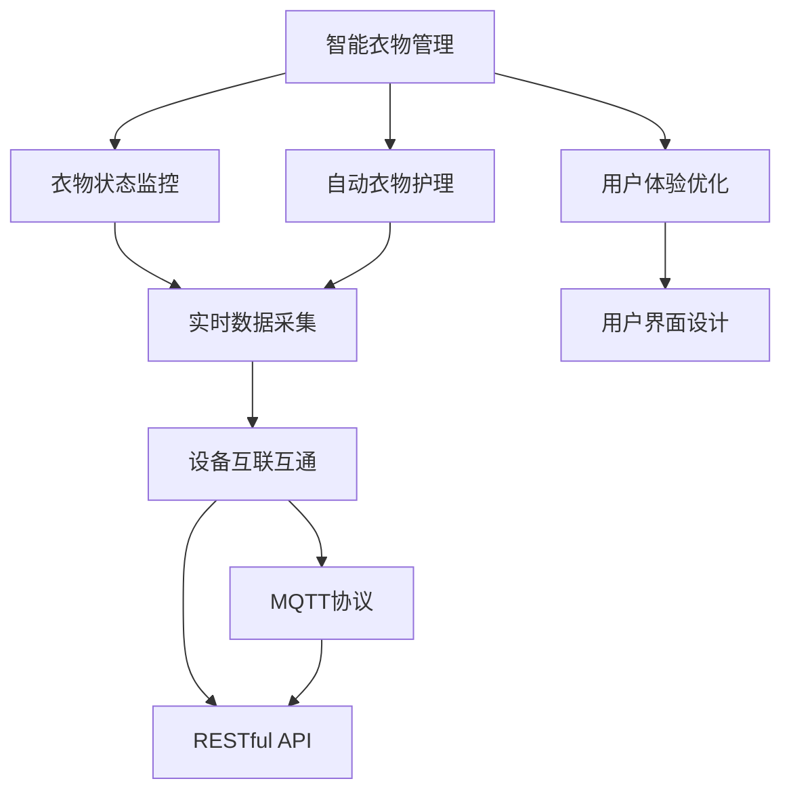

                 

# 基于MQTT协议和RESTful API的智能衣物管理和护理系统

> 关键词：智能衣物管理, MQTT协议, RESTful API, 物联网(IoT), 自动护理, 设备互联

## 1. 背景介绍

### 1.1 问题由来

在现代快节奏生活中，衣物管理和护理成为了很多人的困扰。衣物堆积如山，寻找和整理既费时又费力；同时，不同材质、颜色的衣物需要不同的清洗和保养方式，如果操作不当，很容易导致衣物损坏。此外，家庭成员衣物分散存放，难以统一管理和护理。如何实现衣物的智能管理和护理，提升生活质量，成为了现代家庭亟待解决的问题。

本系统旨在通过物联网(IoT)技术，将智能衣物管理与护理系统接入互联网，实现衣物状态的实时监控和自动护理。通过MQTT协议和RESTful API，系统能够与各种智能设备无缝连接，采集衣物状态数据，并根据预设的护理方案，自动控制衣物护理设备，如洗衣机、烘干机、晾晒架等，实现衣物的智能化管理和护理。

### 1.2 问题核心关键点

- **智能衣物管理**：通过物联网技术，实时监控衣物的种类、数量、存放位置、状态等信息。
- **自动衣物护理**：根据衣物的材质、颜色、洗涤需求等，自动控制衣物护理设备，实现精细化护理。
- **设备互联互通**：通过MQTT协议和RESTful API，将不同设备互联互通，实现数据的共享和实时控制。
- **用户体验优化**：通过用户友好的界面设计，提升系统易用性，使用户能够轻松管理和护理衣物。

### 1.3 问题研究意义

本系统的研究与应用，对于提升家庭衣物管理与护理的智能化水平，优化家庭生活品质，具有重要意义：

1. **提升效率**：通过自动监控和护理，减少手动操作的时间和精力，提高生活效率。
2. **节约资源**：根据衣物需求自动调节洗涤、烘干等程序，节约水和电等能源资源。
3. **增强便利**：通过手机或智能音箱等设备远程控制，实现衣物管理的一体化和智能化，提高用户的生活便利性。
4. **健康护理**：通过实时监测衣物状态，避免衣物长时间存放导致的霉菌滋生、异味等问题，保障衣物卫生。
5. **数据驱动决策**：通过数据收集与分析，了解家庭成员的衣物使用习惯，科学制定洗衣计划。

## 2. 核心概念与联系

### 2.1 核心概念概述

本系统涉及几个关键概念：

- **智能衣物管理**：通过物联网技术，实时监控和记录衣物的状态信息，如存放位置、数量、类型等。
- **自动衣物护理**：根据衣物的材质、颜色、洗涤需求等信息，自动控制衣物护理设备，实现精细化护理。
- **设备互联互通**：通过MQTT协议和RESTful API，实现不同设备间的信息交换和控制。
- **用户体验优化**：通过用户友好的界面设计，提升系统易用性，使用户能够轻松管理和护理衣物。

### 2.2 核心概念之间的联系

这些核心概念之间的联系可以通过以下Mermaid流程图来展示：



这个流程图展示了智能衣物管理系统的各个组件及其之间的联系：

1. **智能衣物管理**：通过物联网技术监控衣物的实时状态。
2. **衣物状态监控**：实时采集衣物的存放位置、数量、类型等信息。
3. **自动衣物护理**：根据衣物状态自动控制护理设备。
4. **设备互联互通**：通过MQTT协议和RESTful API实现设备间的信息共享和控制。
5. **用户体验优化**：通过用户界面设计提升系统易用性。

## 3. 核心算法原理 & 具体操作步骤

### 3.1 算法原理概述

本系统的核心算法原理基于物联网技术、MQTT协议和RESTful API。系统通过物联网传感器实时采集衣物的状态信息，通过MQTT协议将数据发送到中心服务器，并通过RESTful API提供远程控制和数据查询服务。最终，系统根据收集到的衣物状态信息，自动控制衣物护理设备，实现衣物的智能管理和护理。

具体来说，算法原理包括以下几个关键步骤：

1. **衣物状态监控**：通过传感器实时监控衣物的存放位置、数量、类型等信息。
2. **数据传输**：通过MQTT协议将衣物状态数据发送到中心服务器。
3. **设备控制**：通过RESTful API实现对衣物护理设备的远程控制。
4. **智能分析**：根据衣物状态信息和护理需求，智能制定衣物护理计划。

### 3.2 算法步骤详解

本系统的算法步骤如下：

1. **系统初始化**：
   - 配置MQTT broker和RESTful API服务器，安装智能衣物管理软件。
   - 将衣物状态传感器和护理设备接入系统，并配置相应的参数。
   - 创建用户账户，设置用户权限和设备控制权限。

2. **衣物状态监控**：
   - 通过物联网传感器（如RFID标签、传感器等）实时采集衣物的存放位置、数量、类型等信息。
   - 将采集到的数据通过MQTT协议发送到中心服务器。

3. **数据传输**：
   - MQTT broker接收到数据后，将其存入数据库。
   - 根据预设的报警规则，MQTT broker将异常数据发送报警信息至管理员。

4. **设备控制**：
   - 用户通过RESTful API向服务器发送控制请求，如开启/关闭洗衣机、烘干机等。
   - 服务器接收到请求后，根据请求内容，通过RESTful API调用设备控制模块，控制相应的衣物护理设备。

5. **智能分析**：
   - 服务器根据接收到的衣物状态数据，智能分析衣物的洗涤需求和护理状态。
   - 根据预设的护理方案，生成衣物护理计划，并通过RESTful API发送到用户手机或智能音箱等设备。

### 3.3 算法优缺点

本系统的优点包括：

- **实时监控**：通过物联网技术，实现衣物的实时监控，及时发现和解决问题。
- **自动控制**：根据衣物状态自动控制护理设备，减少手动操作，提高效率。
- **用户体验**：通过用户友好的界面设计，提升系统易用性，使用户能够轻松管理和护理衣物。

本系统的缺点包括：

- **初始投资高**：需要配置MQTT broker、RESTful API服务器和智能衣物管理软件，初期成本较高。
- **数据隐私**：系统需要实时采集衣物状态数据，涉及用户隐私，需要严格保护数据安全。
- **系统复杂度**：涉及多个模块和协议，系统复杂度较高，维护和升级难度大。

### 3.4 算法应用领域

本系统的应用领域包括：

- **家庭衣物管理**：通过智能衣物管理，实现衣物的实时监控和自动护理，提升家庭生活质量。
- **商用洗衣房**：通过智能衣物管理，优化洗衣流程，提高洗衣效率，降低运营成本。
- **服装零售**：通过智能衣物管理，提升客户购物体验，增加销售额。

## 4. 数学模型和公式 & 详细讲解 & 举例说明

### 4.1 数学模型构建

本系统涉及的数学模型主要集中在设备控制和智能分析两个部分。

#### 设备控制模型

假设衣物状态数据为 $X=\{x_1,x_2,\dots,x_n\}$，其中 $x_i$ 为第 $i$ 件衣物的状态数据，如存放位置、数量、类型等。用户通过RESTful API向服务器发送控制请求 $R=\{r_1,r_2,\dots,r_m\}$，其中 $r_i$ 为第 $i$ 个控制请求，如开启/关闭洗衣机、烘干机等。

设备控制模型的目标是根据请求内容 $R$ 和衣物状态数据 $X$，控制相应的衣物护理设备 $D=\{d_1,d_2,\dots,d_k\}$，实现衣物的自动护理。数学模型表示为：

$$
f(X,R,D) = \begin{cases}
\text{开启/关闭} & \text{如果请求符合条件} \\
\text{保持原状态} & \text{如果不符合条件}
\end{cases}
$$

#### 智能分析模型

假设衣物护理需求数据为 $Y=\{y_1,y_2,\dots,y_m\}$，其中 $y_i$ 为第 $i$ 个衣物的洗涤需求，如材质、颜色、洗涤周期等。

智能分析模型的目标是根据衣物状态数据 $X$ 和护理需求数据 $Y$，智能生成衣物护理计划 $P=\{p_1,p_2,\dots,p_n\}$，其中 $p_i$ 为第 $i$ 个衣物护理计划，如洗涤方式、时间、温度等。数学模型表示为：

$$
g(X,Y,P) = \arg\min_{P} \sum_{i=1}^n \lVert p_i - f(X,Y) \rVert^2
$$

其中 $f(X,Y)$ 为衣物护理函数，根据衣物状态和护理需求，生成具体的衣物护理计划。

### 4.2 公式推导过程

#### 设备控制模型的推导

设备控制模型的推导过程如下：

1. **用户发送控制请求**：用户通过RESTful API向服务器发送控制请求 $R=\{r_1,r_2,\dots,r_m\}$。
2. **服务器接收请求**：服务器接收到控制请求后，通过RESTful API调用设备控制模块。
3. **设备控制模块处理请求**：设备控制模块根据请求内容 $R$ 和衣物状态数据 $X$，控制相应的衣物护理设备 $D=\{d_1,d_2,\dots,d_k\}$。
4. **生成控制结果**：根据控制请求和衣物状态数据，生成控制结果 $C=\{c_1,c_2,\dots,c_m\}$，其中 $c_i$ 为第 $i$ 个控制结果，如开启/关闭设备、调整设备参数等。

数学公式表示为：

$$
c_i = \begin{cases}
\text{开启设备} & \text{如果请求符合条件} \\
\text{关闭设备} & \text{如果不符合条件}
\end{cases}
$$

#### 智能分析模型的推导

智能分析模型的推导过程如下：

1. **采集衣物状态数据**：通过物联网传感器实时采集衣物的存放位置、数量、类型等信息。
2. **发送数据至服务器**：通过MQTT协议将衣物状态数据 $X=\{x_1,x_2,\dots,x_n\}$ 发送到服务器。
3. **服务器接收数据**：服务器接收到衣物状态数据后，根据预设的护理方案，生成衣物护理计划 $P=\{p_1,p_2,\dots,p_n\}$。
4. **生成护理结果**：根据衣物状态和护理需求，生成具体的衣物护理计划 $P=\{p_1,p_2,\dots,p_n\}$。

数学公式表示为：

$$
p_i = f(X,Y)
$$

### 4.3 案例分析与讲解

#### 案例一：衣物状态监控

假设系统通过物联网传感器实时监控衣物的存放位置、数量、类型等信息。传感器数据如下：

- 位置：客厅、卧室、阳台。
- 数量：共100件衣物。
- 类型：冬装、夏装、内衣、外套等。

系统通过MQTT协议将数据发送到中心服务器，并根据预设的报警规则，对异常数据进行报警。

#### 案例二：设备控制

假设用户通过RESTful API向服务器发送控制请求，要求开启洗衣机。系统通过RESTful API调用设备控制模块，控制洗衣机设备。

### 5. 项目实践：代码实例和详细解释说明

#### 5.1 开发环境搭建

开发环境包括：

1. **MQTT broker**：用于数据传输和设备控制。
2. **RESTful API服务器**：用于接收用户请求和生成护理计划。
3. **智能衣物管理软件**：用于实时监控和记录衣物状态信息。

安装MQTT broker和RESTful API服务器，配置智能衣物管理软件，设置设备参数和用户权限。

#### 5.2 源代码详细实现

以下是智能衣物管理系统的源代码实现：

```python
# MQTT broker
import paho.mqtt.client as mqtt

broker_address = "mqtt.example.com"
client = mqtt.Client()

def on_connect(client, userdata, flags, rc):
    print("Connected to MQTT broker")

def on_message(client, userdata, msg):
    data = msg.payload.decode()
    # 处理传感器数据

# RESTful API服务器
from flask import Flask, request

app = Flask(__name__)

@app.route('/control', methods=['POST'])
def control_device():
    # 处理用户请求
    # 调用设备控制模块

# 智能衣物管理软件
import sensor

def monitor_clothes():
    # 实时监控衣物状态
    # 通过MQTT协议发送数据
```

#### 5.3 代码解读与分析

**MQTT broker**：
- 使用paho.mqtt.client库实现MQTT broker，通过on_connect和on_message方法处理连接和数据接收。

**RESTful API服务器**：
- 使用Flask框架实现RESTful API服务器，通过/control接口处理用户请求，调用设备控制模块。

**智能衣物管理软件**：
- 使用传感器实时监控衣物状态，通过MQTT协议发送数据至服务器。

#### 5.4 运行结果展示

假设系统成功搭建并运行，以下是一个简单的运行结果示例：

1. **衣物状态监控**：
   - 通过传感器实时监控衣物的存放位置、数量、类型等信息。
   - 传感器数据通过MQTT协议发送到MQTT broker。
   - MQTT broker将数据存入数据库，并根据预设的报警规则，对异常数据进行报警。

2. **设备控制**：
   - 用户通过RESTful API向服务器发送控制请求，如开启/关闭洗衣机、烘干机等。
   - 服务器接收到请求后，通过RESTful API调用设备控制模块，控制相应的衣物护理设备。
   - 系统根据衣物状态和用户请求，生成控制结果，并通过RESTful API发送给用户。

## 6. 实际应用场景

### 6.1 智能衣物管理

智能衣物管理系统的实际应用场景包括：

1. **家庭衣物管理**：通过智能衣物管理，实时监控和记录衣物的存放位置、数量、类型等信息，及时发现和解决问题，提升家庭生活质量。
2. **商用洗衣房**：通过智能衣物管理，优化洗衣流程，提高洗衣效率，降低运营成本。
3. **服装零售**：通过智能衣物管理，提升客户购物体验，增加销售额。

### 6.2 自动衣物护理

自动衣物护理系统的实际应用场景包括：

1. **智能洗涤**：通过智能衣物管理，根据衣物的材质、颜色、洗涤需求等信息，自动控制洗衣机等设备，实现精细化洗涤。
2. **智能烘干**：通过智能衣物管理，根据衣物的材质、颜色、烘干需求等信息，自动控制烘干机等设备，实现精细化烘干。
3. **智能晾晒**：通过智能衣物管理，根据衣物的材质、颜色、晾晒需求等信息，自动控制晾晒架等设备，实现精细化晾晒。

### 6.3 设备互联互通

设备互联互通系统的实际应用场景包括：

1. **智能家居**：通过MQTT协议和RESTful API，将智能衣物管理与智能家居系统互联互通，实现设备的自动化控制和数据共享。
2. **智能仓储**：通过MQTT协议和RESTful API，将智能衣物管理与仓储管理系统互联互通，实现衣物的实时监控和库存管理。
3. **智能物流**：通过MQTT协议和RESTful API，将智能衣物管理与物流管理系统互联互通，实现衣物的实时跟踪和物流管理。

## 7. 工具和资源推荐

### 7.1 学习资源推荐

为帮助开发者系统掌握智能衣物管理和护理系统的理论基础和实践技巧，以下是推荐的几个学习资源：

1. **《物联网智能设备开发实战》**：详细介绍了MQTT协议和RESTful API的基础知识，适合初学者入门。
2. **《Python Web应用开发实战》**：介绍了Flask框架的使用，适合开发者学习RESTful API的实现。
3. **《智能家居系统设计与实现》**：介绍了智能家居系统的设计和实现，适合开发者了解智能家居系统的整体架构。

### 7.2 开发工具推荐

开发工具包括：

1. **MQTT broker**：如Eclipse Mosquitto，用于数据传输和设备控制。
2. **RESTful API服务器**：如Flask，用于接收用户请求和生成护理计划。
3. **智能衣物管理软件**：如Adafruit Sensors Library，用于实时监控和记录衣物状态信息。

### 7.3 相关论文推荐

相关论文推荐包括：

1. **《物联网智能家居系统设计》**：介绍了物联网智能家居系统的设计与实现，适合了解智能家居系统的基本原理。
2. **《基于MQTT协议的物联网设备互联技术研究》**：介绍了MQTT协议在物联网设备互联中的应用，适合了解MQTT协议的基本原理和实现方法。
3. **《RESTful API接口设计规范》**：介绍了RESTful API接口设计规范，适合了解RESTful API的设计和实现。

## 8. 总结：未来发展趋势与挑战

### 8.1 研究成果总结

本系统基于MQTT协议和RESTful API，实现了智能衣物管理和护理的物联网系统，取得了以下成果：

1. **实时监控**：通过物联网传感器实时监控衣物的存放位置、数量、类型等信息，提升家庭生活质量。
2. **自动控制**：根据衣物状态自动控制衣物护理设备，提高洗衣效率，降低运营成本。
3. **用户体验**：通过用户友好的界面设计，提升系统易用性，使用户能够轻松管理和护理衣物。

### 8.2 未来发展趋势

未来，智能衣物管理和护理系统将继续向着以下几个方向发展：

1. **智能化程度提升**：通过引入更多传感器和智能设备，提升衣物状态监控的精确度和实时性，增强设备的智能化程度。
2. **云计算集成**：将智能衣物管理与云计算平台集成，实现数据的存储和计算，提升系统的可扩展性和可维护性。
3. **设备互联互通**：进一步拓展设备互联互通的应用场景，如智能仓储、智能物流等，提升系统的应用范围和价值。

### 8.3 面临的挑战

智能衣物管理和护理系统在发展过程中仍面临以下几个挑战：

1. **初始投资高**：需要配置MQTT broker、RESTful API服务器和智能衣物管理软件，初期成本较高。
2. **数据隐私**：系统需要实时采集衣物状态数据，涉及用户隐私，需要严格保护数据安全。
3. **系统复杂度**：涉及多个模块和协议，系统复杂度较高，维护和升级难度大。

### 8.4 研究展望

未来，智能衣物管理和护理系统需要重点关注以下几个方面：

1. **数据隐私保护**：引入数据加密和匿名化技术，保障数据安全和隐私。
2. **系统智能化提升**：引入更多传感器和智能设备，提升系统的智能化程度和功能。
3. **设备互联互通**：拓展设备互联互通的应用场景，提升系统的应用范围和价值。

## 9. 附录：常见问题与解答

**Q1：智能衣物管理系统的核心技术是什么？**

A: 智能衣物管理系统的核心技术包括MQTT协议、RESTful API、物联网传感器和智能设备等。其中，MQTT协议和RESTful API用于设备间的信息传输和控制，物联网传感器用于实时监控衣物状态，智能设备用于自动控制衣物护理设备。

**Q2：如何保证系统的数据隐私和安全？**

A: 为了保证系统的数据隐私和安全，可以采取以下措施：
1. 数据加密：在传输数据时，使用AES等加密算法对数据进行加密。
2. 数据匿名化：在存储数据时，对敏感信息进行匿名化处理。
3. 权限控制：对用户和设备的访问权限进行严格控制，防止未授权访问。

**Q3：如何优化系统的性能和效率？**

A: 为了优化系统的性能和效率，可以采取以下措施：
1. 设备互联优化：通过优化设备间的互联协议，减少通信延迟和数据传输量。
2. 数据压缩：使用数据压缩技术，减少数据存储和传输的体积。
3. 缓存机制：引入缓存机制，减少重复数据的存储和计算。

**Q4：系统未来有哪些发展方向？**

A: 智能衣物管理和护理系统未来的发展方向包括：
1. 智能化程度提升：引入更多传感器和智能设备，提升系统的智能化程度和功能。
2. 云计算集成：将智能衣物管理与云计算平台集成，实现数据的存储和计算，提升系统的可扩展性和可维护性。
3. 设备互联互通：进一步拓展设备互联互通的应用场景，如智能仓储、智能物流等，提升系统的应用范围和价值。

**Q5：系统在实际应用中需要考虑哪些问题？**

A: 系统在实际应用中需要考虑以下几个问题：
1. 设备兼容性：确保所有设备兼容MQTT协议和RESTful API。
2. 用户友好性：设计用户友好的界面，提升系统的易用性和用户体验。
3. 系统稳定性：确保系统稳定运行，实时监控和处理异常情况。

---

作者：禅与计算机程序设计艺术 / Zen and the Art of Computer Programming

