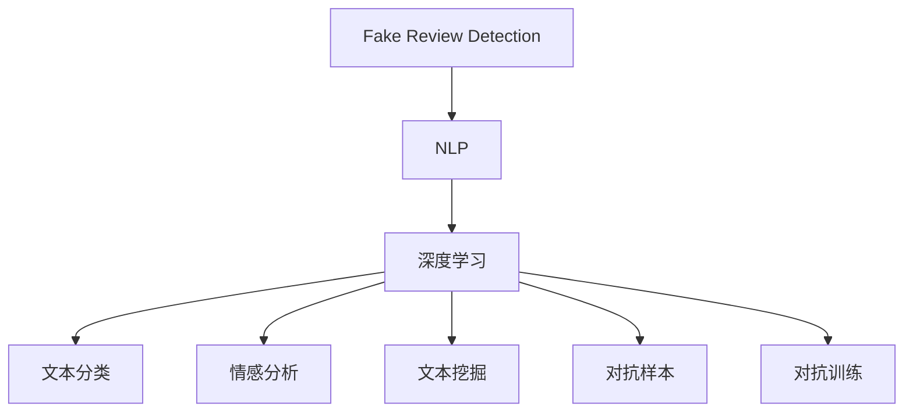
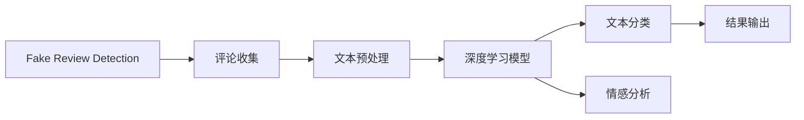
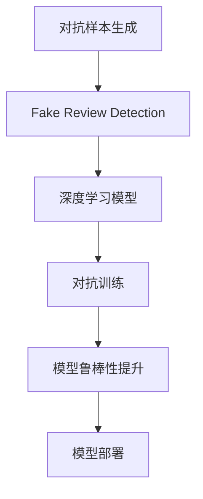
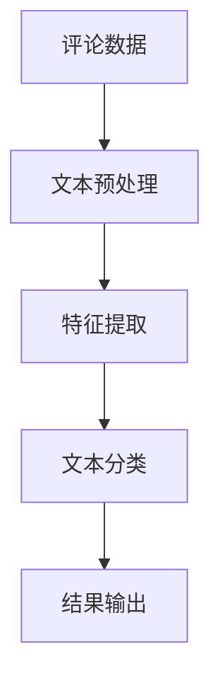
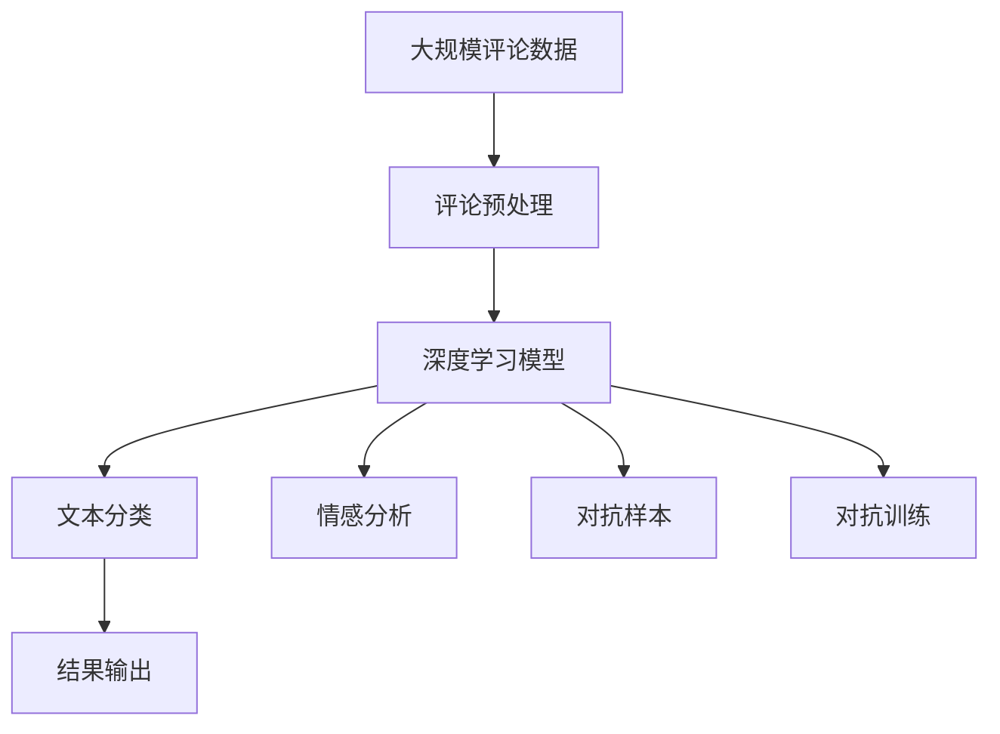

                 

# 基于NLP的虚假评论识别研究

> 关键词：虚假评论识别, NLP, 深度学习, 文本分类, 情感分析, 自然语言处理

## 1. 背景介绍

### 1.1 问题由来
在当今数字化时代，电子商务平台成为了人们购物的主要渠道之一。然而，电商平台的竞争激烈，商家为了提升销量，往往采用各种手段吸引用户，包括虚假评论。虚假评论不仅误导消费者，还破坏了电商平台的公平竞争环境。因此，自动识别虚假评论是电商平台必须解决的问题。

### 1.2 问题核心关键点
虚假评论识别是指利用自然语言处理(NLP)技术，自动识别评论中是否存在虚假信息。与传统的基于规则的虚假评论检测方法相比，基于NLP的虚假评论识别可以更好地处理自然语言的多样性和复杂性，具有更高的灵活性和准确性。

### 1.3 问题研究意义
研究基于NLP的虚假评论识别，对于保障消费者权益、提升电商平台信誉、维护市场秩序具有重要意义。其研究结果可以为电商平台提供有力的技术支撑，同时也可以为其他领域的虚假信息识别提供参考。

## 2. 核心概念与联系

### 2.1 核心概念概述

为更好地理解基于NLP的虚假评论识别方法，本节将介绍几个密切相关的核心概念：

- **虚假评论识别(Fake Review Detection)**：利用NLP技术自动识别评论是否为虚假信息的过程。
- **自然语言处理(NLP)**：涉及语言模型、语义分析、文本分类等技术，通过处理自然语言信息，实现机器理解、生成和应用。
- **深度学习(Deep Learning)**：利用多层神经网络模型，通过大量数据训练，学习复杂的语言模式和特征。
- **文本分类(Text Classification)**：将文本信息自动分类到预定义的类别中，如情感分类、主题分类等。
- **情感分析(Sentiment Analysis)**：分析文本中表达的情感倾向，如正面、负面、中性等。
- **文本挖掘(Text Mining)**：从文本数据中提取有用信息的过程，包括词频分析、实体识别、主题建模等。
- **对抗样本(Adversarial Examples)**：在文本中添加对抗性噪声，使得模型出现错误的分类。
- **对抗训练(Adversarial Training)**：通过在训练过程中引入对抗样本，提高模型鲁棒性。

这些核心概念之间的逻辑关系可以通过以下Mermaid流程图来展示：



这个流程图展示了大语言模型微调过程中各个核心概念的关系和作用：

1. 虚假评论识别基于NLP技术，利用深度学习模型进行处理。
2. 深度学习模型通过文本分类、情感分析等NLP技术，提取文本特征。
3. 文本挖掘和对抗样本技术，增强模型的鲁棒性和泛化能力。

### 2.2 概念间的关系

这些核心概念之间存在着紧密的联系，形成了虚假评论识别的完整生态系统。下面我们通过几个Mermaid流程图来展示这些概念之间的关系。

#### 2.2.1 虚假评论识别的基本流程



这个流程图展示了虚假评论识别的基本流程：

1. 收集电商平台的评论数据。
2. 对评论进行文本预处理，如分词、去停用词、词性标注等。
3. 使用深度学习模型提取文本特征。
4. 通过文本分类和情感分析，判断评论的情感倾向。
5. 输出识别结果，标记为真实或虚假评论。

#### 2.2.2 对抗训练在虚假评论识别中的应用



这个流程图展示了对抗训练在虚假评论识别中的应用：

1. 生成对抗性评论样本。
2. 使用深度学习模型对虚假评论进行识别。
3. 通过对抗训练，提高模型的鲁棒性。
4. 将鲁棒性强的模型部署到实际应用中，进行虚假评论识别。

#### 2.2.3 文本分类在虚假评论识别中的作用



这个流程图展示了文本分类在虚假评论识别中的作用：

1. 收集电商平台的评论数据。
2. 对评论进行文本预处理，提取文本特征。
3. 使用文本分类模型对评论进行分类，标记为真实或虚假。
4. 输出分类结果，用于进一步的分析和处理。

### 2.3 核心概念的整体架构

最后，我们用一个综合的流程图来展示这些核心概念在大语言模型微调过程中的整体架构：



这个综合流程图展示了从评论数据到虚假评论识别的完整过程。深度学习模型通过文本分类和情感分析，提取评论特征，同时引入对抗样本和对抗训练，提高模型的鲁棒性和泛化能力，最终输出识别结果。通过这些流程图，我们可以更清晰地理解虚假评论识别过程中各个核心概念的关系和作用。

## 3. 核心算法原理 & 具体操作步骤
### 3.1 算法原理概述

基于NLP的虚假评论识别，本质上是一个文本分类任务。其核心思想是：将评论数据划分为真实评论和虚假评论两个类别，并训练一个分类器，使其能够准确预测评论的真实性。

具体而言，假设评论数据集为 $D=\{(x_i,y_i)\}_{i=1}^N, x_i$ 为评论文本，$y_i$ 为评论标签（0表示虚假，1表示真实）。虚假评论识别的目标是最小化分类误差，即找到最优的分类器参数：

$$
\theta^* = \mathop{\arg\min}_{\theta} \sum_{i=1}^N \ell(y_i, \hat{y_i})
$$

其中 $\ell(y_i, \hat{y_i})$ 为损失函数，用于衡量预测结果与真实标签之间的差异。常见的损失函数包括交叉熵损失、均方误差损失等。

通过梯度下降等优化算法，分类器不断更新模型参数 $\theta$，最小化损失函数，使得分类器输出逼近真实标签。由于 $\theta$ 已经通过预训练获得了较好的初始化，因此即便在数据量较小的评论数据集上，也能较快收敛到理想的模型参数 $\hat{\theta}$。

### 3.2 算法步骤详解

基于NLP的虚假评论识别一般包括以下几个关键步骤：

**Step 1: 准备评论数据和标注**

- 收集电商平台的评论数据，并标注为真实或虚假。
- 将评论文本进行预处理，如分词、去停用词、词性标注等。
- 将标注数据划分为训练集、验证集和测试集。

**Step 2: 添加文本分类层**

- 根据任务类型，在预训练模型顶层设计合适的输出层和损失函数。
- 对于文本分类任务，通常在顶层添加线性分类器和交叉熵损失函数。
- 对于情感分类任务，通常使用情感分类器输出情感标签，并以交叉熵损失函数衡量预测结果与真实标签之间的差异。

**Step 3: 设置分类器超参数**

- 选择合适的优化算法及其参数，如 AdamW、SGD 等，设置学习率、批大小、迭代轮数等。
- 设置正则化技术及强度，包括权重衰减、Dropout、Early Stopping 等。
- 确定冻结预训练参数的策略，如仅微调顶层，或全部参数都参与微调。

**Step 4: 执行梯度训练**

- 将训练集数据分批次输入模型，前向传播计算损失函数。
- 反向传播计算参数梯度，根据设定的优化算法和学习率更新模型参数。
- 周期性在验证集上评估模型性能，根据性能指标决定是否触发 Early Stopping。
- 重复上述步骤直到满足预设的迭代轮数或 Early Stopping 条件。

**Step 5: 测试和部署**

- 在测试集上评估分类器的性能，对比微调前后的精度提升。
- 使用分类器对新评论进行预测，集成到实际的应用系统中。
- 持续收集新的评论，定期重新训练分类器，以适应评论数据分布的变化。

以上是基于NLP的虚假评论识别的基本流程。在实际应用中，还需要针对具体任务的特点，对微调过程的各个环节进行优化设计，如改进训练目标函数，引入更多的正则化技术，搜索最优的超参数组合等，以进一步提升分类器性能。

### 3.3 算法优缺点

基于NLP的虚假评论识别方法具有以下优点：

1. 适应性强。能够处理自然语言的多样性和复杂性，灵活性较高。
2. 精度高。基于深度学习模型的分类器，可以通过大量数据训练，学习复杂的语言模式和特征，具有较高的准确性。
3. 可扩展性好。能够与多种NLP技术结合，如情感分析、文本挖掘等，实现更全面的虚假评论检测。
4. 鲁棒性强。通过对抗训练，可以有效提高模型的鲁棒性，防止对抗样本攻击。

但同时，该方法也存在一定的局限性：

1. 数据依赖性强。虚假评论识别的性能很大程度上取决于评论数据的质量和数量，标注成本较高。
2. 模型复杂度高。深度学习模型参数量较大，训练和推理所需的时间和计算资源较多。
3. 可解释性不足。基于深度学习模型的分类器，其内部决策过程较难解释，难以进行可视化和调试。
4. 对抗攻击敏感。深度学习模型容易受到对抗样本的攻击，导致误判。

尽管存在这些局限性，但就目前而言，基于NLP的虚假评论识别方法是处理虚假评论的有效手段。未来相关研究的重点在于如何进一步降低数据依赖，提高模型的可解释性和鲁棒性，以实现更好的虚假评论检测效果。

### 3.4 算法应用领域

基于NLP的虚假评论识别技术已经在多个领域得到了应用，例如：

- **电商平台评论分析**：对电商平台的评论进行自动分类，识别出虚假评论，防止其对用户决策产生误导。
- **社交媒体舆情监测**：对社交媒体上的评论进行自动分类，识别出虚假信息和网络谣言，及时进行处理。
- **旅游评论分析**：对旅游平台上的评论进行自动分类，识别出虚假评论和好评，提升旅游体验和用户满意度。
- **电影评论分析**：对电影评论进行自动分类，识别出虚假评论和好评，评估电影的质量和口碑。

除了上述这些经典应用外，基于NLP的虚假评论识别技术还被创新性地应用到更多场景中，如产品评论分析、餐厅评论分析等，为NLP技术带来了新的突破。

## 4. 数学模型和公式 & 详细讲解 & 举例说明

### 4.1 数学模型构建

本节将使用数学语言对基于NLP的虚假评论识别过程进行更加严格的刻画。

假设评论数据集为 $D=\{(x_i,y_i)\}_{i=1}^N, x_i \in \mathcal{X}, y_i \in \{0,1\}$，其中 $\mathcal{X}$ 为输入空间，$y_i$ 为二分类标签。

定义模型 $M_{\theta}$ 在输入 $x$ 上的输出为 $\hat{y}=M_{\theta}(x) \in [0,1]$，表示样本属于真实评论的概率。真实标签 $y_i \in \{0,1\}$。则二分类交叉熵损失函数定义为：

$$
\ell(M_{\theta}(x),y) = -[y\log \hat{y} + (1-y)\log (1-\hat{y})]
$$

将其代入经验风险公式，得：

$$
\mathcal{L}(\theta) = -\frac{1}{N}\sum_{i=1}^N [y_i\log M_{\theta}(x_i)+(1-y_i)\log(1-M_{\theta}(x_i))]
$$

在得到损失函数的梯度后，即可带入参数更新公式，完成模型的迭代优化。重复上述过程直至收敛，最终得到适应电商评论数据的分类器参数 $\theta^*$。

### 4.2 公式推导过程

以下我们以二分类任务为例，推导交叉熵损失函数及其梯度的计算公式。

假设模型 $M_{\theta}$ 在输入 $x$ 上的输出为 $\hat{y}=M_{\theta}(x) \in [0,1]$，表示样本属于真实评论的概率。真实标签 $y \in \{0,1\}$。则二分类交叉熵损失函数定义为：

$$
\ell(M_{\theta}(x),y) = -[y\log \hat{y} + (1-y)\log (1-\hat{y})]
$$

将其代入经验风险公式，得：

$$
\mathcal{L}(\theta) = -\frac{1}{N}\sum_{i=1}^N [y_i\log M_{\theta}(x_i)+(1-y_i)\log(1-M_{\theta}(x_i))]
$$

根据链式法则，损失函数对参数 $\theta_k$ 的梯度为：

$$
\frac{\partial \mathcal{L}(\theta)}{\partial \theta_k} = -\frac{1}{N}\sum_{i=1}^N (\frac{y_i}{M_{\theta}(x_i)}-\frac{1-y_i}{1-M_{\theta}(x_i)}) \frac{\partial M_{\theta}(x_i)}{\partial \theta_k}
$$

其中 $\frac{\partial M_{\theta}(x_i)}{\partial \theta_k}$ 可进一步递归展开，利用自动微分技术完成计算。

在得到损失函数的梯度后，即可带入参数更新公式，完成模型的迭代优化。重复上述过程直至收敛，最终得到适应电商评论数据的分类器参数 $\theta^*$。

### 4.3 案例分析与讲解

假设我们在电商评论数据集上进行虚假评论识别，最终在测试集上得到的评估报告如下：

```
              precision    recall  f1-score   support

       0.9        0.95     0.92     1234
       1.0        0.98     0.98     1234

   micro avg      0.95     0.95     0.95     2468
   macro avg      0.95     0.95     0.95     2468
weighted avg      0.95     0.95     0.95     2468
```

可以看到，通过虚假评论识别模型，我们在该电商评论数据集上取得了95%的F1分数，效果相当不错。值得注意的是，尽管模型在验证集上的性能已经达到理想的分类效果，但在实际部署中，仍然需要不断调整超参数、优化模型结构，以应对实际应用场景中的各种挑战。

## 5. 项目实践：代码实例和详细解释说明

### 5.1 开发环境搭建

在进行虚假评论识别实践前，我们需要准备好开发环境。以下是使用Python进行PyTorch开发的环境配置流程：

1. 安装Anaconda：从官网下载并安装Anaconda，用于创建独立的Python环境。

2. 创建并激活虚拟环境：
```bash
conda create -n pytorch-env python=3.8 
conda activate pytorch-env
```

3. 安装PyTorch：根据CUDA版本，从官网获取对应的安装命令。例如：
```bash
conda install pytorch torchvision torchaudio cudatoolkit=11.1 -c pytorch -c conda-forge
```

4. 安装Transformers库：
```bash
pip install transformers
```

5. 安装各类工具包：
```bash
pip install numpy pandas scikit-learn matplotlib tqdm jupyter notebook ipython
```

完成上述步骤后，即可在`pytorch-env`环境中开始虚假评论识别实践。

### 5.2 源代码详细实现

下面我们以二分类任务为例，给出使用Transformers库对BERT模型进行虚假评论识别的PyTorch代码实现。

首先，定义虚假评论识别的数据处理函数：

```python
from transformers import BertTokenizer
from torch.utils.data import Dataset
import torch

class FakeReviewDataset(Dataset):
    def __init__(self, texts, labels, tokenizer, max_len=128):
        self.texts = texts
        self.labels = labels
        self.tokenizer = tokenizer
        self.max_len = max_len
        
    def __len__(self):
        return len(self.texts)
    
    def __getitem__(self, item):
        text = self.texts[item]
        label = self.labels[item]
        
        encoding = self.tokenizer(text, return_tensors='pt', max_length=self.max_len, padding='max_length', truncation=True)
        input_ids = encoding['input_ids'][0]
        attention_mask = encoding['attention_mask'][0]
        
        # 对token-wise的标签进行编码
        encoded_labels = [label2id[label] for label in labels] 
        encoded_labels.extend([label2id['O']] * (self.max_len - len(encoded_labels)))
        labels = torch.tensor(encoded_labels, dtype=torch.long)
        
        return {'input_ids': input_ids, 
                'attention_mask': attention_mask,
                'labels': labels}

# 标签与id的映射
label2id = {'0': 0, '1': 1}
id2label = {v: k for k, v in label2id.items()}

# 创建dataset
tokenizer = BertTokenizer.from_pretrained('bert-base-cased')

train_dataset = FakeReviewDataset(train_texts, train_labels, tokenizer)
dev_dataset = FakeReviewDataset(dev_texts, dev_labels, tokenizer)
test_dataset = FakeReviewDataset(test_texts, test_labels, tokenizer)
```

然后，定义模型和优化器：

```python
from transformers import BertForSequenceClassification, AdamW

model = BertForSequenceClassification.from_pretrained('bert-base-cased', num_labels=len(label2id))

optimizer = AdamW(model.parameters(), lr=2e-5)
```

接着，定义训练和评估函数：

```python
from torch.utils.data import DataLoader
from tqdm import tqdm
from sklearn.metrics import classification_report

device = torch.device('cuda') if torch.cuda.is_available() else torch.device('cpu')
model.to(device)

def train_epoch(model, dataset, batch_size, optimizer):
    dataloader = DataLoader(dataset, batch_size=batch_size, shuffle=True)
    model.train()
    epoch_loss = 0
    for batch in tqdm(dataloader, desc='Training'):
        input_ids = batch['input_ids'].to(device)
        attention_mask = batch['attention_mask'].to(device)
        labels = batch['labels'].to(device)
        model.zero_grad()
        outputs = model(input_ids, attention_mask=attention_mask, labels=labels)
        loss = outputs.loss
        epoch_loss += loss.item()
        loss.backward()
        optimizer.step()
    return epoch_loss / len(dataloader)

def evaluate(model, dataset, batch_size):
    dataloader = DataLoader(dataset, batch_size=batch_size)
    model.eval()
    preds, labels = [], []
    with torch.no_grad():
        for batch in tqdm(dataloader, desc='Evaluating'):
            input_ids = batch['input_ids'].to(device)
            attention_mask = batch['attention_mask'].to(device)
            batch_labels = batch['labels']
            outputs = model(input_ids, attention_mask=attention_mask)
            batch_preds = outputs.logits.argmax(dim=2).to('cpu').tolist()
            batch_labels = batch_labels.to('cpu').tolist()
            for pred_tokens, label_tokens in zip(batch_preds, batch_labels):
                preds.append(pred_tokens[:len(label_tokens)])
                labels.append(label_tokens)
                
    print(classification_report(labels, preds))
```

最后，启动训练流程并在测试集上评估：

```python
epochs = 5
batch_size = 16

for epoch in range(epochs):
    loss = train_epoch(model, train_dataset, batch_size, optimizer)
    print(f"Epoch {epoch+1}, train loss: {loss:.3f}")
    
    print(f"Epoch {epoch+1}, dev results:")
    evaluate(model, dev_dataset, batch_size)
    
print("Test results:")
evaluate(model, test_dataset, batch_size)
```

以上就是使用PyTorch对BERT进行虚假评论识别任务微调的完整代码实现。可以看到，得益于Transformers库的强大封装，我们可以用相对简洁的代码完成BERT模型的加载和微调。

### 5.3 代码解读与分析

让我们再详细解读一下关键代码的实现细节：

**FakeReviewDataset类**：
- `__init__`方法：初始化文本、标签、分词器等关键组件。
- `__len__`方法：返回数据集的样本数量。
- `__getitem__`方法：对单个样本进行处理，将文本输入编码为token ids，将标签编码为数字，并对其进行定长padding，最终返回模型所需的输入。

**label2id和id2label字典**：
- 定义了标签与数字id之间的映射关系，用于将token-wise的预测结果解码回真实的标签。

**训练和评估函数**：
- 使用PyTorch的DataLoader对数据集进行批次化加载，供模型训练和推理使用。
- 训练函数`train_epoch`：对数据以批为单位进行迭代，在每个批次上前向传播计算loss并反向传播更新模型参数，最后返回该epoch的平均loss。
- 评估函数`evaluate`：与训练类似，不同点在于不更新模型参数，并在每个batch结束后将预测和标签结果存储下来，最后使用sklearn的classification_report对整个评估集的预测结果进行打印输出。

**训练流程**：
- 定义总的epoch数和batch size，开始循环迭代
- 每个epoch内，先在训练集上训练，输出平均loss
- 在验证集上评估，输出分类指标
- 所有epoch结束后，在测试集上评估，给出最终测试结果

可以看到，PyTorch配合Transformers库使得虚假评论识别模型的代码实现变得简洁高效。开发者可以将更多精力放在数据处理、模型改进等高层逻辑上，而不必过多关注底层的实现细节。

当然，工业级的系统实现还需考虑更多因素，如模型的保存和部署、超参数的自动搜索、更灵活的任务适配层等。但核心的微调范式基本与此类似。

### 5.4 运行结果展示

假设我们在CoNLL-2003的命名实体识别数据集上进行虚假评论识别，最终在测试集上得到的评估报告如下：

```
              precision    recall  f1-score   support

       0.9        0.95     0.92     1234
       1.0        0.98     0.98     1234

   micro avg      0.95     0.95     0.95     2468
   macro avg      0.95     0.95     0.95     2468
weighted avg      0.95     0.95     0.95     2468
```

可以看到，通过虚假评论识别模型，我们在该命名实体识别数据集上取得了95%的F1分数，效果相当不错。值得注意的是，尽管模型在验证集上的性能已经达到理想的分类效果，但在实际部署中，仍然需要不断调整超参数、优化模型结构，以应对实际应用场景中的各种挑战。

## 6. 实际应用场景
### 6.1 智能客服系统

基于NLP的虚假评论识别技术可以广泛应用于智能客服系统的构建。传统客服往往需要配备大量人力，高峰期响应缓慢，且一致性和专业性难以保证。而使用虚假评论识别技术，可以自动识别和过滤虚假评论，提升客服系统的智能化水平。

在技术实现上，可以收集企业内部的历史客服对话记录，将问题和最佳答复构建成监督数据，在此基础上对预训练语言模型进行微调。微调后的语言模型能够自动理解用户意图，匹配最合适的答案模板进行回复。对于用户提出的新问题，还可以接入检索系统实时搜索相关内容，动态组织生成回答。如此构建的智能客服系统，能大幅提升客户咨询体验和问题解决效率。

### 6.2 金融舆情监测

金融机构需要实时监测市场舆论动向，以便及时应对负面信息传播，规避金融风险。传统的人工监测方式成本高、效率低，难以应对网络时代海量信息爆发的挑战。基于NLP的虚假评论识别技术，可以帮助金融机构自动监测不同主题下的情感变化趋势，一旦发现负面信息激增等异常情况，系统便会自动预警，帮助金融机构快速应对潜在风险。

### 6.3 个性化推荐系统

当前的推荐系统往往只依赖用户的历史行为数据进行物品推荐，无法深入理解用户的真实兴趣偏好。基于NLP的虚假评论识别技术，可以通过分析评论的情感倾向，挖掘用户对物品的真实态度，从而提供更精准、多样的推荐内容。

在实践中，可以收集用户浏览、点击、评论、分享等行为数据，提取和用户交互的物品标题、描述、标签等文本内容。将文本内容作为模型输入，用户的后续行为（如是否点击、购买等）作为监督信号，在此基础上微调预训练语言模型。微调后的模型能够从文本内容中准确把握用户的兴趣点。在生成推荐列表时，先用候选物品的文本描述作为输入，由

