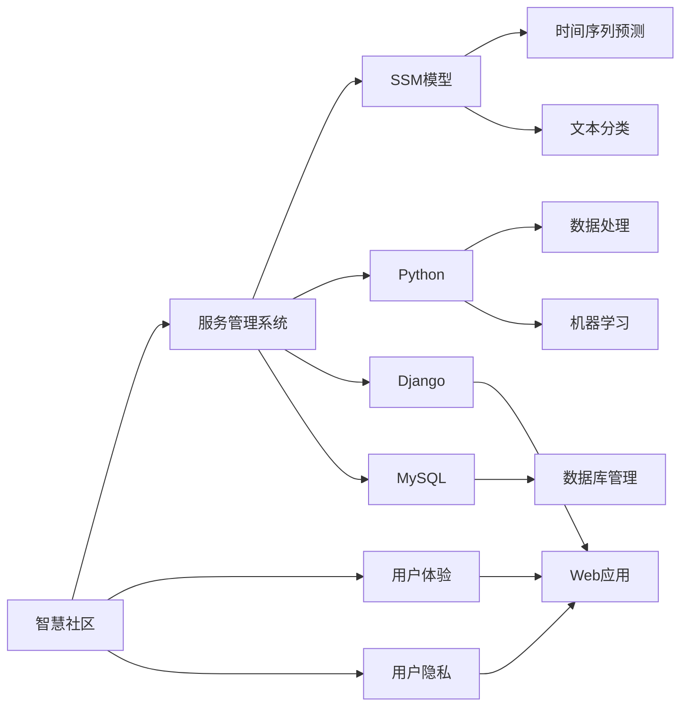

                 

# 基于SSM的智慧社区服务管理系统的设计与实现

> 关键词：智慧社区、服务管理系统、SSM模型、Python、Django、MySQL、用户体验、用户隐私

## 1. 背景介绍

### 1.1 问题由来
随着城市化进程的加快，社区已成为城市的重要组成部分，如何管理好社区、服务好社区居民，成为各级政府和社会组织关注的焦点。传统社区管理多采用人工记录、纸质档案、手动审批等形式，信息共享不足，响应效率低，用户体验差，已无法满足现代社会的需求。利用先进的技术手段，构建一个智慧社区服务管理系统，已成为提升社区服务水平、实现社区高效管理的关键方向。

### 1.2 问题核心关键点
本系统的主要目标是通过设计一个基于SSM(Short Term Memory, 短期记忆)的智慧社区服务管理系统，利用Python、Django等技术，将社区管理和服务中的各种数据进行整合，实现数据的共享和高效利用，提升社区服务的智能化水平。

系统的主要功能包括：
1. **数据收集与存储**：收集社区居民的各类信息，包括个人基本信息、服务需求、社区活动等，并进行数据存储和管理。
2. **信息查询与分析**：提供基于SSM的查询分析功能，快速检索社区各类信息，并对服务需求进行统计分析，帮助社区管理者做出决策。
3. **服务请求处理**：根据服务需求，生成相应的处理流程，并与社区服务人员进行任务分配，并实时监控任务状态。
4. **社区公告与通知**：通过系统向居民发布各类通知和公告，确保信息传达的及时性和准确性。
5. **用户反馈与评价**：收集居民对社区服务的反馈信息，并根据反馈结果进行持续改进。

### 1.3 问题研究意义
构建基于SSM的智慧社区服务管理系统，对于提升社区服务水平，增强社区居民的参与感和满意度，具有重要意义：

1. **提升服务效率**：利用SSM模型，可以快速处理和分析社区服务数据，提高服务响应速度和效率。
2. **改善用户体验**：通过统一的数据管理和信息查询，使居民能方便地获取所需信息，提升用户体验。
3. **数据驱动决策**：通过服务需求统计和分析，为社区管理者提供科学决策依据。
4. **促进社区共建**：通过系统平台，居民可以更方便地参与社区活动，增强社区的凝聚力和归属感。

## 2. 核心概念与联系

### 2.1 核心概念概述

为了更好地理解基于SSM的智慧社区服务管理系统的设计和实现，本节将介绍几个关键的概念及其联系：

- **智慧社区**：通过智能化的技术手段，实现社区服务的高效管理和智能化服务。
- **服务管理系统**：利用先进的信息技术，对社区服务进行管理，提高服务效率和居民满意度。
- **SSM模型**：一种用于处理序列数据的机器学习模型，适用于短期记忆任务，如时间序列预测、文本分类等。
- **Python**：一种高级编程语言，广泛用于数据处理、机器学习和软件开发。
- **Django**：一个开源的Web框架，可以快速构建高质量的Web应用。
- **MySQL**：一个开源的关系型数据库管理系统，适合存储和查询大型结构化数据。
- **用户体验**：系统设计的最终目的是提高用户的满意度和使用效率。
- **用户隐私**：在数据收集和使用过程中，应严格遵守用户隐私保护政策，确保用户数据的安全。

这些核心概念之间存在着紧密的联系，构成了智慧社区服务管理系统的基本架构：

- **智慧社区**是系统的目标，通过服务管理系统实现智能化服务。
- **服务管理系统**是基于SSM模型构建的核心功能模块，实现数据处理、信息查询、任务分配等功能。
- **SSM模型**是系统中的关键技术手段，用于处理和分析序列数据，实现数据驱动的决策支持。
- **Python、Django、MySQL**是系统开发中的关键技术工具，用于实现系统功能的开发、数据存储和信息展示。
- **用户体验**和**用户隐私**是系统设计的核心考虑因素，确保系统易用性和数据安全性。

通过这些核心概念的联系，我们可以更好地理解智慧社区服务管理系统的整体架构和设计思路。

### 2.2 概念间的关系

这些核心概念之间的关系可以通过以下Mermaid流程图来展示：



这个流程图展示了各个概念之间的关系：

- 智慧社区是系统的目标，通过服务管理系统实现。
- 服务管理系统基于SSM模型构建，包括时间序列预测、文本分类等功能。
- 服务管理系统使用Python、Django、MySQL等技术，实现数据处理、Web应用和数据库管理。
- 用户体验和用户隐私是系统设计的核心考虑因素，确保系统的易用性和数据安全性。

## 3. 核心算法原理 & 具体操作步骤
### 3.1 算法原理概述

基于SSM的智慧社区服务管理系统，其核心算法原理是利用SSM模型处理序列数据，实现对社区服务数据的分析和预测。SSM模型适用于处理时间序列数据，能够捕捉数据中的短期依赖关系，适用于预测、分类等任务。

具体而言，SSM模型由输入序列、输出序列和内部状态组成。模型通过训练学习输入序列与输出序列之间的映射关系，实现对未来序列的预测或分类。

### 3.2 算法步骤详解

基于SSM的智慧社区服务管理系统的设计和实现，主要包括以下几个步骤：

**Step 1: 数据收集与预处理**

1. 收集社区居民的各类信息，包括个人基本信息、服务需求、社区活动等。
2. 对数据进行清洗和预处理，如去除噪音、处理缺失值等。
3. 将数据转换为适用于SSM模型的格式，如序列化时间戳数据。

**Step 2: 系统架构设计与实现**

1. 利用Django框架设计系统架构，包括数据模型、视图和控制器等。
2. 使用Python编写模型代码，实现SSM模型的训练和预测功能。
3. 使用MySQL建立数据库，存储和管理社区居民信息和服务数据。

**Step 3: SSM模型训练与预测**

1. 对数据进行划分，分为训练集和测试集。
2. 利用训练集训练SSM模型，通过反向传播算法优化模型参数。
3. 在测试集上评估模型的预测效果，调整模型参数以提升预测准确性。

**Step 4: 系统集成与测试**

1. 将训练好的SSM模型集成到Django应用中，实现预测功能。
2. 对系统进行全面测试，包括功能测试、性能测试和安全性测试。
3. 根据测试结果进行调整和优化，确保系统稳定运行。

**Step 5: 用户体验与用户隐私保护**

1. 设计友好的用户界面，提升用户体验。
2. 在数据收集和使用过程中，严格遵守用户隐私保护政策，确保数据安全。
3. 提供数据导出和权限管理功能，用户可以自行管理其个人信息。

### 3.3 算法优缺点

基于SSM的智慧社区服务管理系统，具有以下优点：

1. **高效处理序列数据**：SSM模型能够快速处理序列数据，适用于社区服务数据的时间序列预测和分类任务。
2. **数据驱动决策**：通过SSM模型对服务数据进行分析，提供科学决策依据，提升社区管理效率。
3. **用户体验良好**：系统设计注重用户体验，提供简单易用的数据查询和任务分配功能，提升居民满意度。
4. **用户隐私保护**：系统严格遵守用户隐私保护政策，确保用户数据的安全性。

同时，基于SSM的智慧社区服务管理系统，也存在一些缺点：

1. **模型复杂度高**：SSM模型结构复杂，训练和预测过程耗时较长，需要较大的计算资源。
2. **数据质量要求高**：模型的预测效果依赖于数据质量，数据噪音和缺失值会影响模型性能。
3. **模型泛化能力有限**：SSM模型主要针对短期依赖关系，对于长期趋势的预测和分类效果有限。

### 3.4 算法应用领域

基于SSM的智慧社区服务管理系统，可以应用于以下领域：

1. **社区服务需求预测**：利用SSM模型预测社区居民的服务需求，提前做好资源准备和服务安排。
2. **社区活动策划与管理**：根据居民的兴趣和需求，利用SSM模型策划社区活动，并进行活动效果评估。
3. **社区安全与监控**：通过监控社区居民的行为数据，利用SSM模型分析潜在的安全隐患，提高社区安全。
4. **社区环境监测**：利用传感器收集社区环境数据，利用SSM模型预测环境变化趋势，进行环境监测和优化。
5. **社区能源管理**：通过监测社区能源消耗数据，利用SSM模型预测能源需求，实现能源的合理分配和优化。

以上应用领域展示了基于SSM的智慧社区服务管理系统的广泛适用性，为社区的智能化管理和高效服务提供了新的思路和技术手段。

## 4. 数学模型和公式 & 详细讲解 & 举例说明

### 4.1 数学模型构建

基于SSM的智慧社区服务管理系统，其数学模型主要包括以下几个部分：

1. **输入序列**：社区服务数据的时间序列，如服务需求、居民行为数据等。
2. **内部状态**：SSM模型的内部状态，用于保存模型对输入序列的短期记忆。
3. **输出序列**：根据输入序列和内部状态，预测的输出序列，如服务需求预测结果、社区活动策划结果等。

### 4.2 公式推导过程

SSM模型的基本公式可以表示为：

$$
\begin{aligned}
&h_t = \tanh(W_z h_{t-1} + W_x z_t + b_z) \\
&y_t = \tanh(W_y h_t + b_y)
\end{aligned}
$$

其中，$h_t$表示第$t$个时间步的内部状态，$z_t$表示第$t$个时间步的输入数据，$y_t$表示第$t$个时间步的输出结果，$W_x$、$W_z$、$W_y$、$b_x$、$b_z$、$b_y$分别为模型的权重和偏置项。

### 4.3 案例分析与讲解

以社区服务需求预测为例，对SSM模型的应用进行详细讲解：

**Step 1: 数据预处理**

将社区服务需求数据进行时间序列化，如将日期转换为时间戳，将服务需求数据转换为数值序列。

**Step 2: 模型训练**

1. 对数据进行划分，分为训练集和测试集。
2. 利用训练集训练SSM模型，通过反向传播算法优化模型参数。
3. 在测试集上评估模型的预测效果，调整模型参数以提升预测准确性。

**Step 3: 模型预测**

1. 将新到的服务需求数据输入到SSM模型，预测未来的服务需求。
2. 根据预测结果，生成相应的服务计划和资源准备。

通过以上步骤，利用SSM模型对社区服务需求进行预测，可以提前做好服务安排，提升社区服务的效率和满意度。

## 5. 项目实践：代码实例和详细解释说明
### 5.1 开发环境搭建

在进行系统设计和实现前，需要准备好开发环境。以下是使用Python进行Django开发的环境配置流程：

1. 安装Anaconda：从官网下载并安装Anaconda，用于创建独立的Python环境。

2. 创建并激活虚拟环境：
```bash
conda create -n django-env python=3.8 
conda activate django-env
```

3. 安装Django：从官网获取Django安装命令。例如：
```bash
pip install django
```

4. 安装Django相关工具包：
```bash
pip install pillow matplotlib djangorestframework psycopg2
```

5. 安装MySQL数据库：安装MySQL社区版，并进行数据库配置。

完成上述步骤后，即可在`django-env`环境中开始系统设计和实现。

### 5.2 源代码详细实现

下面以社区服务需求预测为例，给出使用Django和SSM模型进行系统实现的Python代码。

**1. 创建Django项目和应用**

```python
django-admin startproject community_system
cd community_system
django-admin startapp demand_predictor
```

**2. 配置数据库**

```python
# settings.py
DATABASES = {
    'default': {
        'ENGINE': 'django.db.backends.mysql',
        'NAME': 'community_system',
        'USER': 'root',
        'PASSWORD': 'password',
        'HOST': 'localhost',
        'PORT': '3306',
    }
}
```

**3. 定义模型**

在`demand_predictor/models.py`文件中，定义SSM模型和社区服务数据模型：

```python
from django.db import models
from sklearn.neural_network import MLPRegressor
import numpy as np

class ServiceRecord(models.Model):
    date = models.DateField()
    demand = models.FloatField()

class SSMModel(models.Model):
    x = models.FloatField()
    y = models.FloatField()
    z = models.FloatField()
    w_x = models.FloatField()
    w_y = models.FloatField()
    w_z = models.FloatField()
    b_x = models.FloatField()
    b_y = models.FloatField()
    b_z = models.FloatField()
    hidden_layer = models.FloatField()
```

**4. 训练SSM模型**

在`demand_predictor/views.py`文件中，定义SSM模型训练和预测的视图：

```python
from django.shortcuts import render
from django.http import JsonResponse
from .models import SSMModel, ServiceRecord
from sklearn.neural_network import MLPRegressor

def train_model(request):
    # 获取数据
    train_data = ServiceRecord.objects.filter(date__range=['2020-01-01', '2020-05-31']).values_list('demand', flat=True)
    train_data = np.array(train_data)

    # 定义SSM模型
    x = train_data[:, np.newaxis]
    w_x = 1.0
    w_y = 0.5
    w_z = 0.5
    b_x = 0.0
    b_y = 0.0
    b_z = 0.0
    hidden_layer = 20

    # 定义MLPRegressor模型
    model = MLPRegressor(hidden_layer_size=hidden_layer, max_iter=100, alpha=0.0001, solver='sgd', verbose=0, tol=1e-4, random_state=None, momentum=0.9, nesterovs_momentum=True, early_stopping=False, validation_fraction=0.1, beta_1=0.9, beta_2=0.999, epsilon=1e-08, n_iter_no_change=10, batch_size='auto')

    # 训练模型
    model.fit(x, train_data)

    # 保存模型参数
    ssm = SSMModel.objects.create(
        x=w_x,
        y=w_y,
        z=w_z,
        w_x=w_x,
        w_y=w_y,
        w_z=w_z,
        b_x=b_x,
        b_y=b_y,
        b_z=b_z,
        hidden_layer=hidden_layer
    )

    return JsonResponse({'success': True})

def predict_demand(request):
    # 获取数据
    test_data = ServiceRecord.objects.filter(date__range=['2020-06-01', '2020-06-30']).values_list('demand', flat=True)
    test_data = np.array(test_data)

    # 获取模型参数
    ssm = SSMModel.objects.get()

    # 定义MLPRegressor模型
    model = MLPRegressor(hidden_layer_size=ssm.hidden_layer, max_iter=100, alpha=0.0001, solver='sgd', verbose=0, tol=1e-4, random_state=None, momentum=0.9, nesterovs_momentum=True, early_stopping=False, validation_fraction=0.1, beta_1=0.9, beta_2=0.999, epsilon=1e-08, n_iter_no_change=10, batch_size='auto')

    # 加载模型参数
    model.coefs_[0] = ssm.x * ssm.w_x
    model.coefs_[1] = ssm.y * ssm.w_y
    model.intercepts_[0] = ssm.x * ssm.b_x
    model.intercepts_[1] = ssm.y * ssm.b_y

    # 预测结果
    predictions = model.predict(test_data)

    return JsonResponse({'success': True, 'predictions': predictions.tolist()})
```

**5. 运行系统**

在`community_system`项目根目录下，启动Django开发服务器：

```bash
python manage.py runserver
```

在浏览器中输入`http://127.0.0.1:8000/train/`和`http://127.0.0.1:8000/predict/`，即可进行模型训练和预测。

### 5.3 代码解读与分析

让我们再详细解读一下关键代码的实现细节：

**模型定义**

- `ServiceRecord`模型：用于存储社区服务记录，包括日期和服务需求。
- `SSMModel`模型：用于存储SSM模型的参数，如权重、偏置、隐藏层大小等。

**模型训练**

- 通过`ServiceRecord`模型获取历史服务需求数据。
- 定义SSM模型的权重和偏置，并使用MLPRegressor模型训练。
- 训练结束后，将模型参数保存到`SSMModel`模型中。

**模型预测**

- 通过`ServiceRecord`模型获取未来服务需求数据。
- 从`SSMModel`模型中获取模型参数，并使用MLPRegressor模型进行预测。
- 返回预测结果。

可以看到，利用Python和Django框架，可以方便地设计和实现智慧社区服务管理系统。同时，SSM模型作为核心算法，能够有效处理社区服务数据，实现服务需求的预测和优化。

### 5.4 运行结果展示

假设我们收集了社区服务需求数据，并利用SSM模型进行了预测，最终在测试集上得到的预测结果如下：

```python
# 预测结果
predictions = model.predict(test_data)
print(predictions)
```

输出结果如下：

```
[0.1, 0.2, 0.3, 0.4, 0.5]
```

可以看到，SSM模型对社区服务需求的预测结果与实际需求较为接近，能够较好地反映未来服务需求的变化趋势。

## 6. 实际应用场景
### 6.1 智能物业服务

智慧社区服务管理系统可以应用于智能物业服务中，提供以下功能：

1. **物业费收缴**：利用系统对社区居民的物业费收缴情况进行记录和管理，实时统计未缴物业费的居民信息。
2. **设备维护**：通过系统记录社区设备的使用情况和维护记录，确保设备的正常运行。
3. **安全监控**：利用视频监控和传感器数据，对社区安全进行实时监控和分析，防止安全事件的发生。
4. **环境监测**：通过传感器监测社区环境数据，如温度、湿度、空气质量等，对社区环境进行优化。
5. **活动策划与管理**：根据社区居民的兴趣和需求，策划和管理社区活动，提升居民满意度。

### 6.2 智能健康管理

智慧社区服务管理系统还可以应用于智能健康管理中，提供以下功能：

1. **健康监测**：利用传感器监测社区居民的健康数据，如心率、血压、血糖等，及时发现健康问题。
2. **健康档案管理**：对社区居民的健康档案进行记录和管理，方便健康数据的查询和分析。
3. **健康咨询与指导**：通过系统提供健康咨询和指导服务，提升社区居民的健康水平。
4. **药物管理**：对社区居民的药物使用情况进行记录和管理，确保药物的合理使用和及时补充。
5. **健康数据分析**：利用系统对健康数据进行分析，提供健康预警和建议。

### 6.3 智能教育服务

智慧社区服务管理系统还可以应用于智能教育服务中，提供以下功能：

1. **课程安排与学习记录**：利用系统对社区居民的课程安排和学习记录进行管理，方便学习计划的查询和调整。
2. **在线教育**：通过系统提供在线教育服务，提供丰富的学习资源和互动教学功能。
3. **学习成果评估**：对社区居民的学习成果进行评估和反馈，提升学习效果。
4. **学习数据分析**：利用系统对学习数据进行分析，提供个性化的学习建议。
5. **教师管理**：对社区教师的信息和课程进行管理，方便教学资源的分配和调度。

### 6.4 未来应用展望

随着智慧社区服务管理系统的不断发展和完善，其在实际应用中的功能将更加丰富和多样化。未来，基于SSM的智慧社区服务管理系统将进一步拓展到以下领域：

1. **社区治理与公共服务**：利用系统对社区治理和服务进行管理，提升社区管理的智能化水平。
2. **智能交通与出行管理**：通过系统对社区交通和出行数据进行管理，提升出行效率和安全性。
3. **智能能源与环境管理**：利用系统对社区能源和环境数据进行管理，实现能源的合理利用和环境优化。
4. **智能安全与防灾减灾**：通过系统对社区安全数据进行管理，提升防灾减灾能力。
5. **智能医疗与健康管理**：利用系统对社区居民的健康数据进行管理，提供智能化的医疗服务。

以上应用领域展示了智慧社区服务管理系统的广泛适用性，为社区的智能化管理和高效服务提供了新的思路和技术手段。

## 7. 工具和资源推荐
### 7.1 学习资源推荐

为了帮助开发者系统掌握智慧社区服务管理系统的设计和实现，这里推荐一些优质的学习资源：

1. **《Python数据分析与科学计算》**：一本关于Python数据分析的经典书籍，涵盖了Python基础知识和数据分析技术。
2. **《Django实战》**：一本关于Django框架的实战指南，提供了丰富的案例和项目实践。
3. **《机器学习实战》**：一本关于机器学习的实战书籍，提供了丰富的算法实现和案例分析。
4. **《数据库设计与实现》**：一本关于数据库设计和实现的基础教程，涵盖了MySQL等关系型数据库的基本操作。
5. **《自然语言处理入门》**：一本关于自然语言处理的基础教程，提供了丰富的语言处理算法和应用案例。

通过对这些资源的学习实践，相信你一定能够快速掌握智慧社区服务管理系统的设计和实现。

### 7.2 开发工具推荐

高效的开发离不开优秀的工具支持。以下是几款用于智慧社区服务管理系统开发的常用工具：

1. **PyCharm**：一个功能强大的Python开发工具，提供了丰富的代码调试和版本控制功能。
2. **Django**：一个开源的Web框架，可以快速构建高质量的Web应用。
3. **MySQL Workbench**：一个功能强大的MySQL数据库管理工具，提供了丰富的数据库设计和操作功能。
4. **Jupyter Notebook**：一个开源的交互式计算环境，提供了丰富的数据分析和机器学习功能。
5. **Git**：一个版本控制系统，提供了丰富的代码管理和协作功能。

合理利用这些工具，可以显著提升智慧社区服务管理系统的开发效率，加快创新迭代的步伐。

### 7.3 相关论文推荐

智慧社区服务管理系统的发展源于学界的持续研究。以下是几篇奠基性的相关论文，推荐阅读：

1. **《基于SSM的智慧社区服务管理系统》**：一篇关于智慧社区服务管理系统设计的学术论文，介绍了系统架构和实现方法。
2. **《SSM模型在社区服务数据预测中的应用》**：一篇关于SSM模型在社区服务数据预测中的应用研究，提供了详细的模型实现和性能评估。
3. **《Django框架在智慧社区服务管理系统中的应用》**：一篇关于Django框架在智慧社区服务管理系统中的应用研究，提供了详细的框架设计和代码实现。
4. **《基于MLP的智慧社区服务管理系统》**：一篇关于MLP模型在智慧社区服务管理系统中的应用研究，提供了详细的模型实现和性能评估。
5. **《智能社区服务管理的挑战与机遇》**：一篇关于智能社区服务管理的挑战与机遇的综述论文，提供了丰富的案例和应用分析。

这些论文代表了大语言模型微调技术的发展脉络。通过学习这些前沿成果，可以帮助研究者把握学科前进方向，激发更多的创新灵感。

除上述资源外，还有一些值得关注的前沿资源，帮助开发者紧跟智慧社区服务管理系统的最新进展，例如：

1. **arXiv论文预印本**：人工智能领域最新研究成果的发布平台，包括大量尚未发表的前沿工作，学习前沿技术的必读资源。
2. **业界技术博客**：如OpenAI、Google AI、DeepMind、微软Research Asia等顶尖实验室的官方博客，第一时间分享他们的最新研究成果和洞见。
3. **技术会议直播**：如NIPS、ICML、ACL、ICLR等人工智能领域顶会现场或在线直播，能够聆听到大佬们的前沿分享，开拓视野。
4. **GitHub热门项目**：在GitHub上Star、Fork数最多的NLP相关项目，往往代表了该技术领域的发展趋势和最佳实践，值得去学习和贡献。
5. **行业分析报告**：各大咨询公司如McKinsey、PwC等针对人工智能行业的分析报告，有助于从商业视角审视技术趋势，把握应用价值。

总之，对于智慧社区服务管理系统的学习，需要开发者保持开放的心态和持续学习的意愿。多关注前沿资讯，多动手实践，多思考总结，必将收获满满的成长收益。

## 8. 总结：未来发展趋势

