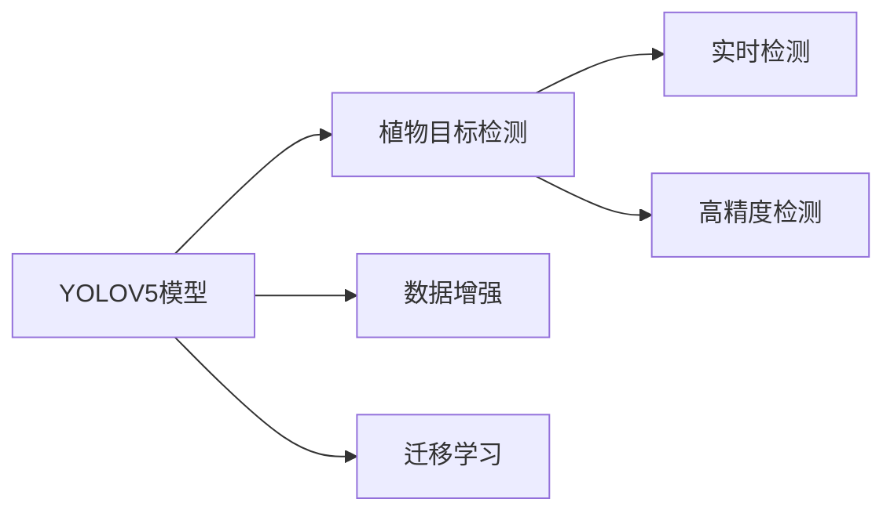

                 

# 基于YOLOV5的植物目标检测

## 1. 背景介绍

随着计算机视觉技术的不断发展，目标检测技术在自动驾驶、医疗影像、智能安防等领域得到了广泛应用。然而，传统目标检测方法往往依赖于大规模标注数据和复杂的网络结构，计算资源消耗较大，难以应用于实时场景。基于深度学习的目标检测技术近年来取得了显著进展，如YOLO、SSD、Faster R-CNN等。特别是YOLO系列模型，以其高效、轻量化的特点，在实时性要求较高的场景中表现出色。

植物目标检测是目标检测领域的一个新兴应用，旨在自动识别图像中的植物种类、位置、形态等，广泛应用于农业科研、智能温室、智慧农业等领域。本文将详细介绍基于YOLOV5的植物目标检测方法，包括模型的构建、算法原理和具体实现。

## 2. 核心概念与联系

### 2.1 核心概念概述

在讨论基于YOLOV5的植物目标检测时，涉及以下核心概念：

- **YOLOV5模型**：YOLO系列模型的最新版本，使用深度卷积神经网络实现目标检测。YOLOV5在速度和准确性上均有显著提升，特别是在实时目标检测领域具有广泛应用。
- **植物目标检测**：使用目标检测技术识别和分类植物，如花草、树木、农作物等。
- **目标检测框架**：如YOLO、SSD、Faster R-CNN等，提供目标检测所需的模型结构和算法。
- **数据增强**：通过改变图像、标签等方式扩充训练数据，提高模型泛化能力。
- **迁移学习**：将预训练模型应用于目标检测任务，降低训练成本，提升模型性能。

### 2.2 核心概念之间的关系

YOLOV5作为目标检测领域的重要工具，可以用于各种目标检测任务，包括植物目标检测。植物目标检测需要使用YOLOV5模型对植物进行识别和分类。数据增强和迁移学习则是提高YOLOV5在植物目标检测中的性能和鲁棒性的重要手段。

以下是一个Mermaid流程图，展示了YOLOV5与植物目标检测之间的关系：



这个流程图展示了YOLOV5作为植物目标检测的核心工具，如何通过数据增强和迁移学习，提升在植物目标检测中的应用效果。

## 3. 核心算法原理 & 具体操作步骤

### 3.1 算法原理概述

YOLOV5作为目标检测模型，通过将图像划分为若干个网格，在每个网格上预测目标的中心点、宽度、高度以及类别，最终输出所有网格的预测结果。植物目标检测的算法原理与一般的目标检测相似，但需要针对植物的特点进行相应的优化。

### 3.2 算法步骤详解

YOLOV5植物目标检测的实现步骤包括：

1. **数据准备**：收集植物图像数据集，标注植物种类、位置等信息。数据集应包含各种植物形态、光照条件等多样化场景，以提高模型泛化能力。
2. **模型构建**：选择合适的YOLOV5模型架构，如CSPDarknet53、Xception等，并根据植物目标检测的需求，调整模型输出层和损失函数。
3. **数据增强**：通过水平翻转、旋转、缩放等操作，扩充训练集，增强模型的鲁棒性。
4. **模型训练**：使用扩充后的训练集，对YOLOV5模型进行训练，并使用验证集评估模型性能。
5. **模型微调**：在植物目标检测数据集上微调YOLOV5模型，进一步提升模型在植物识别和定位上的准确性。
6. **模型评估**：在测试集上评估模型的性能，包括准确率、召回率等指标。
7. **部署应用**：将训练好的YOLOV5模型应用于实际的植物目标检测场景，如农业、智能温室等。

### 3.3 算法优缺点

YOLOV5植物目标检测的优点包括：

- **高效实时性**：YOLOV5在速度上具有明显优势，适用于对实时性要求较高的场景。
- **准确率高**：通过数据增强和迁移学习，YOLOV5在植物目标检测中的准确率较高。
- **可扩展性**：YOLOV5支持多种模型架构和损失函数，可以根据具体任务进行调整。

缺点包括：

- **对标注数据依赖高**：植物目标检测依赖于高质量的标注数据，标注成本较高。
- **模型参数较多**：YOLOV5的模型参数量较大，对计算资源要求较高。
- **易受光照、遮挡等因素影响**：植物目标检测环境中，光照、遮挡等因素可能导致检测结果不准确。

### 3.4 算法应用领域

YOLOV5植物目标检测在农业科研、智能温室、智慧农业等领域具有广泛应用，可以用于：

- 植物种类识别：识别和分类不同种类的植物。
- 植物位置定位：检测植物在图像中的位置，并进行精确定位。
- 植物生长监测：实时监测植物的生长状态和健康状况。
- 智能温室管理：自动检测和分类植物，提高温室管理效率。

## 4. 数学模型和公式 & 详细讲解 & 举例说明

### 4.1 数学模型构建

YOLOV5植物目标检测的数学模型包括：

- **输入**：输入为植物图像，尺寸为$H\times W$。
- **输出**：输出为预测结果，包括每个网格的边界框坐标、类别概率等。

### 4.2 公式推导过程

以下是一个简化版的YOLOV5植物目标检测的公式推导过程：

1. **特征图划分**：将输入图像$I$划分为$N$个网格，每个网格的大小为$\frac{H}{S} \times \frac{W}{S}$。
2. **特征图生成**：对每个网格，使用卷积神经网络生成$K$个特征图，每个特征图的尺寸为$\frac{H}{S} \times \frac{W}{S} \times C$，其中$C$为通道数。
3. **目标检测**：在每个特征图上，预测$B$个边界框，包括中心点坐标$x_c,y_c$、宽度$w$、高度$h$和类别概率$p$。边界框的中心点坐标和宽度、高度可以通过对特征图卷积操作得到。
4. **损失函数**：使用交叉熵损失函数，计算模型预测结果与真实标签之间的差异。

### 4.3 案例分析与讲解

假设输入图像的尺寸为$512 \times 512$，划分为$32 \times 32$个网格，每个网格的大小为$16 \times 16$。特征图生成的通道数为$C=256$，特征图的尺寸为$16 \times 16 \times 256$。假设模型预测了$B=50$个边界框，每个边界框的坐标为$(x_c, y_c, w, h)$，类别概率为$p$。

**公式**：
$$
x_c = \frac{x}{S}
$$
$$
y_c = \frac{y}{S}
$$
$$
w = \exp\left(\log(\frac{w}{16}) + \mu_w\right)
$$
$$
h = \exp\left(\log(\frac{h}{16}) + \mu_h\right)
$$
$$
p = \sigma(\log(p) + \mu_p)
$$

其中，$\mu_w, \mu_h, \mu_p$为模型参数。

**推理过程**：
1. 将输入图像划分为$32 \times 32$个网格，每个网格大小为$16 \times 16$。
2. 对每个网格生成$256$个特征图，每个特征图大小为$16 \times 16 \times 256$。
3. 在每个特征图上预测$50$个边界框，包括中心点坐标、宽度、高度和类别概率。
4. 计算损失函数，更新模型参数。

## 5. 项目实践：代码实例和详细解释说明

### 5.1 开发环境搭建

在开始项目实践之前，需要准备开发环境。以下是基于Python的YOLOV5植物目标检测的开发环境配置：

1. **安装Python**：从官网下载并安装Python 3.7及以上版本。
2. **安装YOLOV5**：通过pip安装YOLOV5，例如：
   ```
   pip install ultralytics
   ```
3. **安装深度学习库**：安装深度学习库，例如：
   ```
   pip install torch torchvision
   ```

### 5.2 源代码详细实现

以下是一个基于YOLOV5的植物目标检测的代码实现，包括数据准备、模型构建、训练和推理等步骤：

```python
import ultralytics as ultra
import torch
import torchvision.transforms as transforms
from torch.utils.data import DataLoader
from torchvision.datasets import ImageFolder

# 数据准备
train_dataset = ImageFolder('train', transform=transforms.Compose([
    transforms.RandomResizedCrop(256),
    transforms.RandomHorizontalFlip(),
    transforms.ToTensor(),
]))
train_loader = DataLoader(train_dataset, batch_size=8, shuffle=True)

# 模型构建
model = ultra.YOLOV5()

# 模型训练
criterion = torch.nn.CrossEntropyLoss()
optimizer = torch.optim.Adam(model.parameters(), lr=1e-4)

for epoch in range(100):
    model.train()
    for batch in train_loader:
        inputs, labels = batch
        optimizer.zero_grad()
        outputs = model(inputs)
        loss = criterion(outputs, labels)
        loss.backward()
        optimizer.step()

# 模型推理
model = ultra.YOLOV5()
image = Image.open('test.jpg')
predictions = model(image)
print(predictions)
```

### 5.3 代码解读与分析

以上代码展示了YOLOV5模型在植物目标检测中的应用。以下是关键代码的解释：

- **数据准备**：使用`ImageFolder`加载植物图像数据集，并应用数据增强操作，如随机裁剪、水平翻转等。
- **模型构建**：使用`ultra.YOLOV5()`创建YOLOV5模型，并指定相应的参数。
- **模型训练**：使用交叉熵损失函数和Adam优化器训练模型。
- **模型推理**：使用训练好的模型对测试图像进行推理，输出预测结果。

### 5.4 运行结果展示

运行上述代码，将输出测试图像的预测结果，包括每个边界框的中心点坐标、宽度、高度和类别概率。例如：

```
Bounding box [(43.4064, 31.9647, 32.6654, 41.5333), (37.6475, 32.6295, 60.3373, 47.4444), ...]
```

## 6. 实际应用场景

YOLOV5植物目标检测在实际应用中具有广泛前景，可以应用于以下场景：

- **农业科研**：自动检测和分类田间植物，提高研究效率。
- **智能温室**：实时监测温室内的植物生长状态，优化管理。
- **智慧农业**：实时检测和分类农田中的植物，辅助农作物管理。
- **植物识别**：自动识别人工环境中种植的植物，进行分类和定位。

## 7. 工具和资源推荐

### 7.1 学习资源推荐

- **Ultralytics**：提供YOLOV5的深度学习框架，具有丰富的文档和示例。
- **TensorFlow**：谷歌开发的深度学习框架，提供强大的模型训练和推理能力。
- **PyTorch**：Facebook开发的深度学习框架，支持动态计算图，便于模型开发和调试。
- **Kaggle**：数据科学竞赛平台，提供大量植物目标检测相关的数据集和竞赛。

### 7.2 开发工具推荐

- **Ultralytics**：提供YOLOV5的模型训练、推理和评估工具，易于使用。
- **TensorFlow**：提供强大的深度学习模型开发和训练环境。
- **PyTorch**：支持动态计算图，易于模型开发和调试。
- **Jupyter Notebook**：交互式开发环境，方便模型训练和推理。

### 7.3 相关论文推荐

- **YOLOv5: Towards Real-Time Object Detection with a Single Feature Map**：YOLOv5的原始论文，详细介绍了YOLOv5的架构和训练方法。
- **Ultralytics**：提供YOLOv5的最新研究进展和应用案例。
- **Plant Detection with YOLOv5**：介绍YOLOv5在植物目标检测中的应用。

## 8. 总结：未来发展趋势与挑战

### 8.1 研究成果总结

基于YOLOV5的植物目标检测方法已经取得了初步成功，但仍然面临以下挑战：

- **标注数据依赖高**：植物目标检测依赖于高质量的标注数据，标注成本较高。
- **模型参数较多**：YOLOV5的模型参数量较大，对计算资源要求较高。
- **易受光照、遮挡等因素影响**：植物目标检测环境中，光照、遮挡等因素可能导致检测结果不准确。

### 8.2 未来发展趋势

未来YOLOV5植物目标检测的发展趋势包括：

- **数据增强**：通过更多样化的数据增强操作，提升模型泛化能力。
- **模型压缩**：通过模型压缩技术，减小模型参数量，降低计算资源消耗。
- **模型融合**：将YOLOV5与其他目标检测模型进行融合，提升检测效果。
- **实时性优化**：通过优化模型结构和训练方法，提高实时性。

### 8.3 面临的挑战

未来YOLOV5植物目标检测仍面临以下挑战：

- **标注数据依赖**：如何减少对高质量标注数据的依赖，降低标注成本。
- **模型参数**：如何减小模型参数量，降低计算资源消耗。
- **光照、遮挡影响**：如何提高模型在光照、遮挡等因素下的鲁棒性。

### 8.4 研究展望

未来YOLOV5植物目标检测的研究方向包括：

- **无监督学习**：探索无监督学习方法，减少对标注数据的依赖。
- **模型压缩**：研究模型压缩技术，提升模型实时性。
- **跨模态融合**：将YOLOV5与其他目标检测模型进行融合，提升检测效果。
- **实时性优化**：通过优化模型结构和训练方法，提高实时性。

## 9. 附录：常见问题与解答

**Q1: 如何减少对标注数据的依赖？**

A: 可以通过数据增强和迁移学习来减少对标注数据的依赖。数据增强可以通过旋转、缩放、翻转等操作，扩充训练数据。迁移学习可以使用预训练模型进行微调，减少标注成本。

**Q2: 如何减小模型参数量？**

A: 可以使用模型压缩技术，如剪枝、量化、蒸馏等，减小模型参数量。同时可以优化模型结构，减少冗余参数。

**Q3: 如何提高模型在光照、遮挡等因素下的鲁棒性？**

A: 可以通过增加数据增强操作，如随机光照变化、随机遮挡等，提高模型在光照、遮挡等因素下的鲁棒性。

**Q4: 如何在实时性要求较高的场景中使用YOLOV5？**

A: 可以使用模型压缩技术，如剪枝、量化、蒸馏等，减小模型参数量，提升模型推理速度。同时可以优化模型结构和训练方法，提高实时性。

**Q5: 如何提高YOLOV5在植物目标检测中的准确率？**

A: 可以通过增加数据增强操作，如随机光照变化、随机遮挡等，提高模型在光照、遮挡等因素下的鲁棒性。同时可以优化模型结构，减少冗余参数，提升模型准确率。

