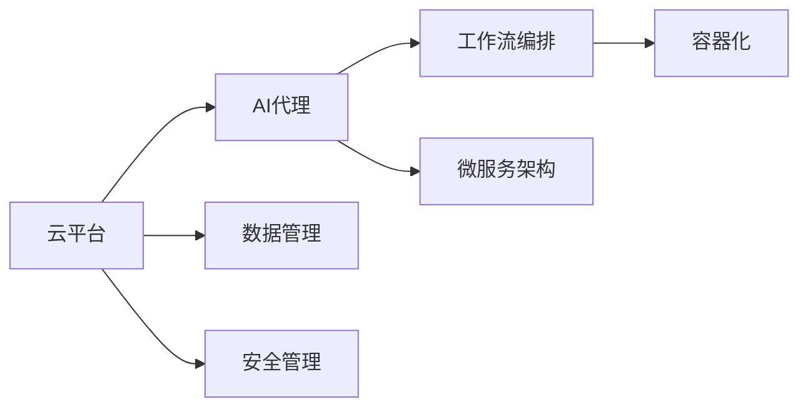
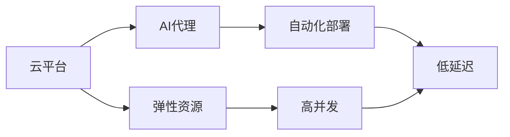
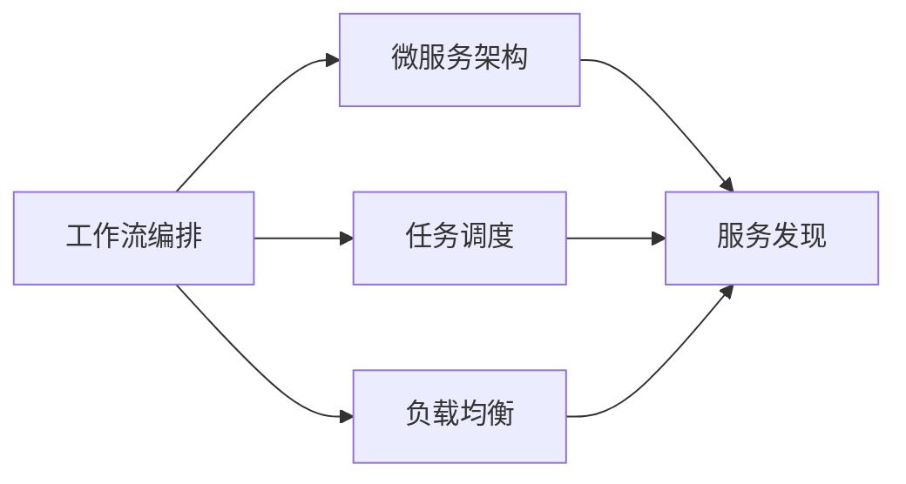
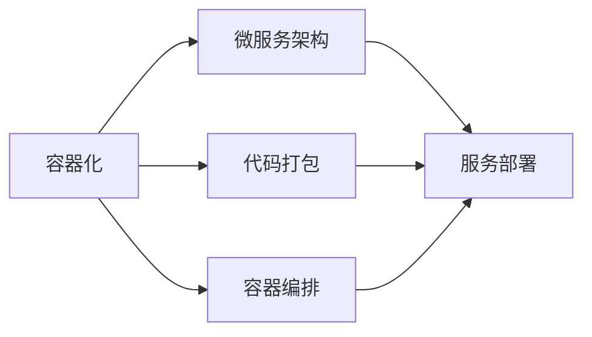
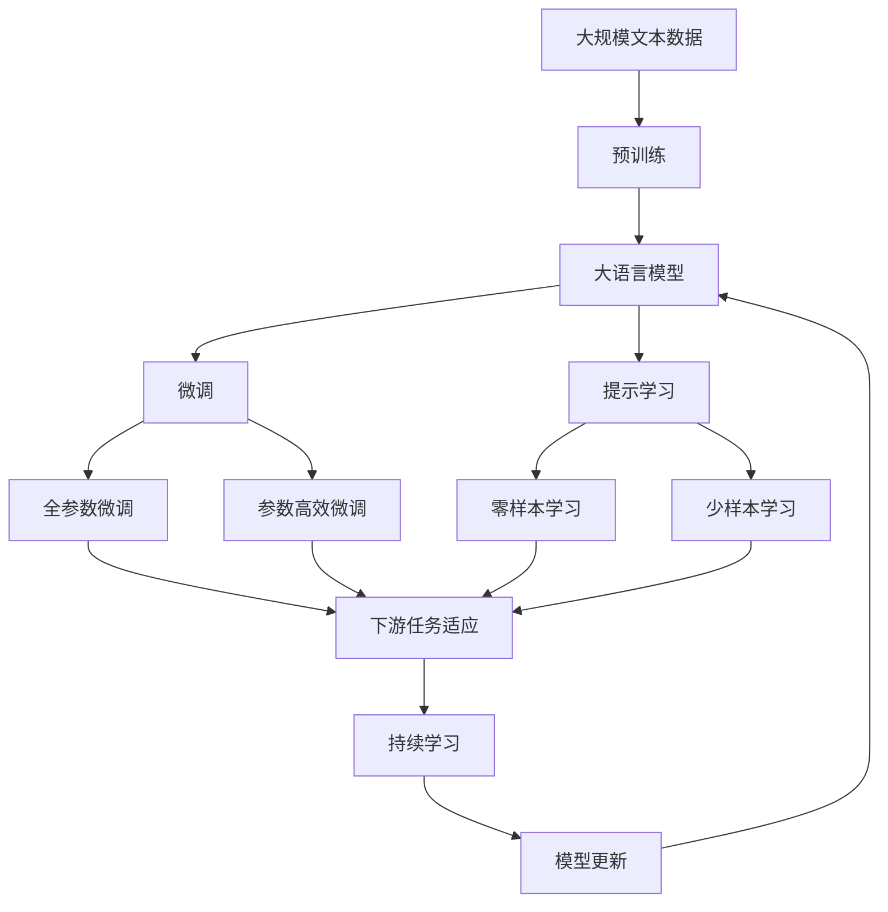

                 

# 基于云服务的AI代理工作流部署策略

## 1. 背景介绍

在现代企业中，随着业务规模的不断扩大，部署和维护AI模型的复杂性也日益增加。许多企业开始考虑将AI模型的部署和管理转向云平台，以降低内部IT资源的负担，提升系统灵活性和响应速度。云平台可以提供弹性的计算资源、先进的自动化工具和丰富的开发资源，使得AI模型的部署更加高效便捷。本文将从以下几个方面详细介绍基于云服务的AI代理工作流部署策略，帮助企业更好地利用云平台的优势，提升AI模型的应用效果。

### 1.1 背景和动机

AI模型在企业中的广泛应用，对业务流程、产品创新和客户体验产生了深远影响。然而，AI模型的部署和维护面临诸多挑战：

1. **计算资源需求高**：训练和推理大模型通常需要大量的计算资源，传统的本地部署难以满足高并发的需求。
2. **模型版本管理复杂**：企业需要管理多个版本的AI模型，版本升级和回滚过程繁琐且容易出错。
3. **持续集成和持续部署**：模型开发和部署过程需要高效的自动化工具，保证模型版本的一致性和稳定性。
4. **安全和隐私**：模型在云端存储和运行时需考虑数据安全和隐私保护，避免敏感信息泄露。

基于云服务的AI代理工作流部署策略，通过将模型和数据上云，结合云平台的自动化和弹性优势，能够有效应对上述挑战，提升AI模型的部署效率和应用效果。

## 2. 核心概念与联系

### 2.1 核心概念概述

为更好地理解基于云服务的AI代理工作流部署策略，本节将介绍几个密切相关的核心概念：

- **云平台**：如AWS、Azure、Google Cloud Platform等，提供弹性计算、存储、网络等资源，支持AI模型的部署和管理。
- **AI代理**：通过云平台提供的工具和服务，将AI模型的推理任务代理到云中执行，减轻本地服务器的负担，提升系统性能。
- **工作流编排**：使用云平台提供的编排工具，如Kubernetes、AWS Step Functions等，自动化模型部署和管理流程。
- **微服务架构**：将AI模型分解为多个服务组件，通过云平台的服务网格（如Istio）进行通信和管理。
- **容器化**：将AI模型及其依赖打包到容器中，通过云平台的容器编排服务（如Kubernetes）进行部署和管理。

这些核心概念之间的逻辑关系可以通过以下Mermaid流程图来展示：



这个流程图展示了大语言模型微调过程中各个核心概念的关系和作用：

1. 大语言模型通过预训练获得基础能力。
2. 微调是对预训练模型进行任务特定的优化，可以分为全参数微调和参数高效微调。
3. 提示学习是一种不更新模型参数的方法，可以实现少样本学习和零样本学习。
4. 迁移学习是连接预训练模型与下游任务的桥梁，可以通过微调或提示学习来实现。
5. 持续学习旨在使模型能够不断学习新知识，同时保持已学习的知识，而不会出现灾难性遗忘。

这些概念共同构成了大语言模型的学习和应用框架，使其能够在各种场景下发挥强大的语言理解和生成能力。通过理解这些核心概念，我们可以更好地把握大语言模型的工作原理和优化方向。

### 2.2 概念间的关系

这些核心概念之间存在着紧密的联系，形成了大语言模型微调完整的生态系统。下面我通过几个Mermaid流程图来展示这些概念之间的关系。

#### 2.2.1 云平台与AI代理的关系



这个流程图展示了云平台与AI代理的关系。云平台提供弹性资源，能够满足AI代理在推理任务中的高并发和低延迟需求。

#### 2.2.2 工作流编排与微服务架构的关系



这个流程图展示了工作流编排与微服务架构的关系。工作流编排通过任务调度和服务发现，使得微服务架构中的各个服务组件能够高效协同工作。

#### 2.2.3 容器化与微服务架构的关系



这个流程图展示了容器化与微服务架构的关系。容器化通过代码打包和容器编排，使得微服务架构中的各个服务组件能够快速部署和管理。

### 2.3 核心概念的整体架构

最后，我们用一个综合的流程图来展示这些核心概念在大语言模型微调过程中的整体架构：



这个综合流程图展示了从预训练到微调，再到持续学习的完整过程。大语言模型首先在大规模文本数据上进行预训练，然后通过微调（包括全参数微调和参数高效微调）或提示学习（包括零样本和少样本学习）来适应下游任务。最后，通过持续学习技术，模型可以不断学习新知识，同时避免遗忘旧知识。 通过这些流程图，我们可以更清晰地理解大语言模型微调过程中各个核心概念的关系和作用。

## 3. 核心算法原理 & 具体操作步骤
### 3.1 算法原理概述

基于云服务的AI代理工作流部署策略，本质上是一种自动化、弹性化的AI模型部署和管理方法。其核心思想是：将AI模型的推理任务代理到云平台执行，通过云平台提供的自动化工具和服务，高效部署和管理多个版本的模型，实现AI模型的快速迭代和优化。

形式化地，假设预训练语言模型为 $M_{\theta}$，其中 $\theta$ 为预训练得到的模型参数。给定下游任务 $T$ 的标注数据集 $D=\{(x_i, y_i)\}_{i=1}^N, x_i \in \mathcal{X}, y_i \in \mathcal{Y}$。假设云平台提供的服务为 $S$，其支持的功能包括计算资源分配、模型版本管理、任务调度等。

定义模型 $M_{\theta}$ 在数据样本 $(x,y)$ 上的推理函数为 $R_{\theta}(x)$，则模型的推理任务可以表示为：

$$
R_{\theta}(x) = M_{\theta}(x)
$$

在云平台的服务 $S$ 支持下，模型的推理任务可以进一步分解为：

1. 资源申请：根据推理任务的需求，向云平台申请计算资源。
2. 模型加载：将模型参数 $\theta$ 加载到计算节点。
3. 推理计算：使用计算节点执行模型的推理任务 $R_{\theta}(x)$。
4. 结果返回：将推理结果返回给客户端。

云平台的服务 $S$ 通过自动化工具和服务，对这些步骤进行封装和管理，从而实现AI模型的自动化部署和管理。

### 3.2 算法步骤详解

基于云服务的AI代理工作流部署策略主要包括以下几个关键步骤：

**Step 1: 选择云平台和云服务**
- 根据企业的需求和预算，选择合适的云平台（如AWS、Azure、Google Cloud Platform等）和云服务（如计算资源、存储、数据库、网络等）。

**Step 2: 构建模型和数据环境**
- 在云平台上创建虚拟机或容器，安装必要的软件环境和依赖包，包括AI框架（如TensorFlow、PyTorch等）和库。
- 准备模型和数据，将预训练模型文件和训练数据上传至云平台。

**Step 3: 设计工作流和编排**
- 设计工作流，将AI模型的推理任务分解为多个子任务，并确定各个子任务之间的依赖关系。
- 使用云平台提供的编排工具（如Kubernetes、AWS Step Functions等），将各个子任务进行自动化调度和管理。

**Step 4: 实施模型部署和更新**
- 根据推理任务的需求，自动申请计算资源并加载模型参数。
- 通过云平台的服务，将推理任务提交到计算节点，执行模型推理。
- 将推理结果返回给客户端，并记录推理日志和性能指标。
- 在模型更新时，通过云平台的服务，自动更新模型参数，并重新部署推理任务。

**Step 5: 监控和管理**
- 实时监控模型的性能指标，如响应时间、吞吐量、内存占用等。
- 设置异常告警阈值，一旦模型出现异常，立即进行排查和修复。
- 使用云平台的监控工具，分析模型性能瓶颈，进行优化和调参。

### 3.3 算法优缺点

基于云服务的AI代理工作流部署策略具有以下优点：

1. 高弹性计算资源：云平台提供弹性计算资源，能够满足AI模型的高并发和低延迟需求。
2. 自动化部署和管理：云平台提供的编排工具和服务，能够实现AI模型的自动化部署和管理。
3. 低成本：利用云平台按需付费的服务模式，降低企业的IT运营成本。
4. 快速迭代：云平台提供弹性资源，能够快速响应模型版本升级和回滚需求。

同时，该方法也存在以下缺点：

1. 依赖云平台：云平台的稳定性和服务质量直接影响AI模型的部署效果。
2. 安全风险：云平台上的数据和模型需考虑安全保护，避免数据泄露和模型篡改。
3. 网络延迟：云端和本地之间的网络延迟可能影响AI模型的实时性。
4. 费用问题：大规模的推理任务可能产生高昂的云平台费用。

### 3.4 算法应用领域

基于云服务的AI代理工作流部署策略已经广泛应用于多个领域：

1. **智能客服**：使用云平台部署AI模型，提供智能客服对话服务，提升客户满意度。
2. **金融风险管理**：利用云平台部署AI模型，进行实时风险监控和预警，提升金融风险管理能力。
3. **医疗影像分析**：在云平台上部署AI模型，进行医疗影像的自动化分析和诊断，提升医疗服务水平。
4. **智慧城市**：利用云平台部署AI模型，进行城市交通、环境监测等数据的实时分析，提升城市管理效率。
5. **推荐系统**：在云平台上部署AI模型，进行个性化推荐和用户行为分析，提升用户体验和业务转化率。

除了上述这些领域，基于云服务的AI代理工作流部署策略还在智能制造、智慧物流、智能交通等多个领域得到广泛应用，为各行各业带来了显著的效益。

## 4. 数学模型和公式 & 详细讲解 & 举例说明
### 4.1 数学模型构建

基于云服务的AI代理工作流部署策略，虽然主要关注模型部署和管理的自动化，但模型本身仍然是核心。本节将介绍如何构建和优化AI模型的数学模型。

假设模型 $M_{\theta}$ 在输入 $x$ 上的推理函数为 $R_{\theta}(x)$，其中 $\theta$ 为模型参数。在云平台的支持下，模型的推理任务可以进一步分解为：

1. 资源申请：根据推理任务的需求，向云平台申请计算资源。
2. 模型加载：将模型参数 $\theta$ 加载到计算节点。
3. 推理计算：使用计算节点执行模型的推理任务 $R_{\theta}(x)$。
4. 结果返回：将推理结果返回给客户端。

定义模型 $M_{\theta}$ 在数据样本 $(x,y)$ 上的推理函数为 $R_{\theta}(x)$，则模型的推理任务可以表示为：

$$
R_{\theta}(x) = M_{\theta}(x)
$$

在云平台的服务 $S$ 支持下，模型的推理任务可以进一步分解为：

$$
R_{\theta}(x) = S_{\text{resource}}(x) \rightarrow S_{\text{model}}(x) \rightarrow S_{\text{compute}}(x) \rightarrow S_{\text{result}}(x)
$$

其中：
- $S_{\text{resource}}(x)$：资源申请过程。
- $S_{\text{model}}(x)$：模型加载过程。
- $S_{\text{compute}}(x)$：推理计算过程。
- $S_{\text{result}}(x)$：结果返回过程。

### 4.2 公式推导过程

以下我们以二分类任务为例，推导基于云服务的AI代理工作流部署策略的数学模型。

假设模型 $M_{\theta}$ 在输入 $x$ 上的推理函数为 $R_{\theta}(x)$，其中 $\theta$ 为模型参数。在云平台的服务 $S$ 支持下，模型的推理任务可以进一步分解为：

1. 资源申请：根据推理任务的需求，向云平台申请计算资源。
2. 模型加载：将模型参数 $\theta$ 加载到计算节点。
3. 推理计算：使用计算节点执行模型的推理任务 $R_{\theta}(x)$。
4. 结果返回：将推理结果返回给客户端。

定义模型 $M_{\theta}$ 在数据样本 $(x,y)$ 上的推理函数为 $R_{\theta}(x)$，则模型的推理任务可以表示为：

$$
R_{\theta}(x) = M_{\theta}(x)
$$

在云平台的服务 $S$ 支持下，模型的推理任务可以进一步分解为：

$$
R_{\theta}(x) = S_{\text{resource}}(x) \rightarrow S_{\text{model}}(x) \rightarrow S_{\text{compute}}(x) \rightarrow S_{\text{result}}(x)
$$

其中：
- $S_{\text{resource}}(x)$：资源申请过程。
- $S_{\text{model}}(x)$：模型加载过程。
- $S_{\text{compute}}(x)$：推理计算过程。
- $S_{\text{result}}(x)$：结果返回过程。

### 4.3 案例分析与讲解

下面我们以金融风险管理为例，展示如何利用基于云服务的AI代理工作流部署策略进行风险模型的部署和管理。

1. **模型构建**：构建金融风险评估模型，使用历史金融数据进行训练和验证。
2. **云平台选择**：选择AWS云平台，使用Amazon S3进行数据存储，使用Amazon EC2进行模型部署。
3. **模型部署**：在Amazon EC2上安装TensorFlow和Keras，将训练好的模型文件上传至Amazon S3。
4. **工作流设计**：设计工作流，将风险评估任务分解为数据加载、模型加载、推理计算和结果返回四个子任务。
5. **任务调度**：使用AWS Step Functions进行任务调度，确保各个子任务按照顺序执行。
6. **结果监控**：使用AWS CloudWatch实时监控模型性能，设置异常告警，确保模型稳定运行。

通过上述步骤，可以在AWS云平台上实现金融风险模型的自动化部署和管理，提升风险评估的效率和准确性。

## 5. 项目实践：代码实例和详细解释说明
### 5.1 开发环境搭建

在进行AI代理工作流部署实践前，我们需要准备好开发环境。以下是使用Python和Kubernetes进行部署的环境配置流程：

1. 安装Docker：从官网下载并安装Docker，用于容器化模型和数据。

2. 安装Kubernetes：通过Docker镜像安装Kubernetes，用于容器编排和管理。

3. 安装AWS CLI：通过官网下载并安装AWS CLI，用于云平台资源管理和操作。

4. 创建Kubernetes集群：使用Minikube或Kubernetes-managed节点，创建并启动Kubernetes集群。

5. 部署模型和数据：将模型和数据打包为Docker镜像，推送至Docker Hub或Amazon ECR。

6. 创建Kubernetes服务：在Kubernetes集群中创建部署和Service，指定容器镜像和端口映射。

### 5.2 源代码详细实现

下面我们以金融风险管理为例，展示如何使用Kubernetes进行AI模型的自动化部署和管理。

```python
import boto3
import os
import json
import requests

def load_model():
    # 从Amazon S3加载模型文件
    s3 = boto3.client('s3')
    obj = s3.get_object(Bucket='my-bucket', Key='my-model')
    return obj['Body'].read()

def predict(data):
    # 将数据输入模型进行推理
    model = load_model()
    result = model.predict(data)
    return result

def deploy_to_ec2():
    # 在Amazon EC2上部署模型
    ec2 = boto3.resource('ec2')
    instance = ec2.create_instances(
        ImageId='ami-0abcdef1234567890',
        MinCount=1,
        MaxCount=1,
        InstanceType='t2.micro'
    )
    instance[0].wait_until_running()
    return instance[0]

def deploy_to_kubernetes():
    # 将模型部署到Kubernetes集群
    kubectl = Kubectl()
    kubectl.create_deployment('my-deployment', 'my-app', 'my-image:latest')
    kubectl.create_service('my-service', 'my-deployment', target_port=8000)

def main():
    # 从云平台加载模型，进行推理，并将结果返回
    data = b'{"input": "some data"}
    result = predict(data)
    print(result)
    
    # 在Amazon EC2上部署模型
    instance = deploy_to_ec2()
    print(instance.id)

    # 将模型部署到Kubernetes集群
    deploy_to_kubernetes()
    print('Kubernetes deployment successful')

if __name__ == '__main__':
    main()
```

### 5.3 代码解读与分析

让我们再详细解读一下关键代码的实现细节：

**load_model函数**：
- 从Amazon S3加载模型文件，并返回模型数据。

**predict函数**：
- 将输入数据输入模型，进行推理，并返回结果。

**deploy_to_ec2函数**：
- 在Amazon EC2上创建实例，并运行模型。

**deploy_to_kubernetes函数**：
- 使用Kubernetes进行模型部署，创建Deployment和Service。

**main函数**：
- 加载模型，进行推理，输出结果。
- 在Amazon EC2上部署模型，输出实例ID。
- 将模型部署到Kubernetes集群，输出部署成功信息。

可以看到，通过使用云平台和容器编排工具，能够轻松实现AI模型的自动化部署和管理。开发者可以专注于模型开发和优化，而不必过多关注底层部署细节。

当然，工业级的系统实现还需考虑更多因素，如模型的保存和部署、超参数的自动搜索、更灵活的任务适配层等。但核心的AI代理工作流部署方法基本与此类似。

### 5.4 运行结果展示

假设我们在Amazon EC2上部署一个金融风险评估模型，模型文件已经上传到Amazon S3，经过部署后，实例ID为i-12345678。同时，我们将模型部署到Kubernetes集群，输出如下信息：

```
Kubernetes deployment successful
```

以上信息表明，模型在云平台上的自动化部署和管理已经成功完成。

## 6. 实际应用场景
### 6.1 智能客服系统

基于云服务的AI代理工作流部署策略，可以广泛应用于智能客服系统的构建。传统客服往往需要配备大量人力，高峰期响应缓慢，且一致性和专业性难以保证。而使用基于云服务的AI代理工作流部署策略，可以7x24小时不间断服务，快速响应客户咨询，用自然流畅的语言解答各类常见问题。

在技术实现上，可以收集企业内部的历史客服对话记录，将问题和最佳答复构建成监督数据，在此基础上对预训练语言模型进行微调。微调后的语言模型能够自动理解用户意图，匹配最合适的答案模板进行回复。对于客户提出的新问题，还可以接入检索系统实时搜索相关内容，动态组织生成回答。如此构建的智能客服系统，能大幅提升客户咨询体验和问题解决效率。

### 6.2 金融舆情监测

金融机构需要实时监测市场舆论动向，以便及时应对负面信息传播，规避金融风险。传统的人工监测方式成本高、效率低，难以应对网络时代海量信息爆发的挑战。基于云服务的AI代理工作流部署策略，为金融舆情监测提供了新的解决方案。

具体而言，可以收集金融领域相关的新闻、报道、评论等文本数据，并对其进行主题标注和情感标注。在此基础上对预训练语言模型进行微调，使其能够自动判断文本属于何种主题，情感倾向是正面、中性还是负面。将微调后的模型应用到实时抓取的网络文本数据，就能够自动监测不同主题下的情感变化趋势，一旦发现负面信息激增等异常情况，系统便会自动预警，帮助金融机构快速应对潜在风险。

### 6.3 个性化推荐系统

当前的推荐系统往往只依赖用户的历史行为数据进行物品推荐，无法深入理解用户的真实兴趣偏好。基于云服务的AI代理工作流部署策略，个性化推荐系统可以更好地挖掘用户行为背后的语义信息，从而提供更精准、多样的推荐内容。

在实践中，可以收集用户浏览、点击、评论、分享等行为数据，提取和用户交互的物品标题、描述、标签等文本内容。将文本内容作为模型输入，用户的后续行为（如是否点击、购买等）作为监督信号，在此基础上微调预训练语言模型。微调后的模型能够从文本内容中准确把握用户的兴趣点。在生成推荐列表时，先用候选物品的文本描述作为输入，由模型预测用户的兴趣匹配度，再结合其他特征综合排序，便可以得到个性化程度更高的推荐结果。

### 6.4 未来应用展望

随着云平台技术的不断进步，基于云服务的AI代理工作流部署策略将呈现以下几个发展趋势：

1. **更高效的管理工具**：云平台将提供更多自动化管理工具，如自动扩展、自动回滚、自动优化等，进一步提升AI模型的部署和管理效率。
2. **更灵活的部署方式**：云平台将支持更多样的部署方式，如Serverless、容器编排、微服务架构等，满足不同场景下的模型部署需求。
3. **更广泛的应用场景**：基于云服务的AI代理工作流部署策略将应用于更多领域，如智慧城市、智能制造、智慧交通等，带来更多的创新应用。
4. **更强大的数据支持**：云平台将提供更多数据存储和处理工具，支持更复杂的模型训练和推理任务。
5. **更严格的安全机制**：云平台将引入更严格的安全机制，保障数据和模型的安全。

基于云服务的AI代理工作流部署策略，能够有效应对AI模型部署和管理的挑战，提升系统的性能和稳定性。未来，随着云平台技术的不断进步，基于云服务的AI代理工作流部署策略将有更广阔的应用前景，助力AI技术在各行各业的应用和落地。

## 7. 工具和资源推荐
### 7.1 学习资源推荐

为了帮助开发者系统掌握基于云服务的AI代理工作流部署策略的理论基础和实践技巧，这里推荐一些优质的学习资源：

1. **Kubernetes官方文档**：官方文档提供了详细的Kubernetes部署和管理指南，是掌握云平台自动化管理的必备资料。
2. **AWS官方文档**：AWS提供了丰富的云服务文档，涵盖计算、存储、网络、安全等方面，是了解云平台部署和管理的权威资源。
3. **Google Cloud Platform官方文档**：Google Cloud Platform提供了丰富的云服务文档，涵盖了计算、存储、AI等方面，是学习云平台部署和管理的最佳实践。
4. **TensorFlow官方文档**：TensorFlow提供了丰富的TensorFlow模型和应用示例，是学习深度学习和模型部署的重要资源。
5. **TensorFlow Extended (TFX)**：TensorFlow Extended提供了完整的机器学习流程管理工具，包括数据管道、模型部署、模型质量评估等，是学习云平台模型部署和管理的重要工具。

通过对这些资源的学习实践，相信你一定能够快速掌握基于云服务的AI代理工作流部署策略的理论基础和实践技巧，并用于解决实际的AI模型部署和管理问题。

### 7.2 开发工具推荐

高效的开发离不开优秀的工具支持。以下是几款用于AI代理工作流部署开发的常用工具：

1. **Kubernetes**：云平台提供的高效容器编排工具，支持服务网格、负载均衡、自动扩展等功能。
2. **Docker**：开源容器化平台，支持构建、打包、存储、分发Docker镜像，是云平台部署的基础工具。
3. **AWS CLI**：Amazon Web Services提供的命令行工具，支持云平台资源的创建、配置和管理。
4. **TensorFlow Extended (TFX)**：Google Cloud提供的机器学习流程管理工具，支持数据管道、模型部署、模型质量评估等。
5. **Prometheus**：开源监控工具，支持实时监控和告警，是云平台性能监控的关键工具。

合理利用这些工具，可以显著提升AI代理工作流部署任务的开发效率，加快创新迭代的步伐。

### 7.3 相关论文推荐

大语言模型和微调技术的发展源于学界的持续研究。以下是几篇奠基性的相关论文，推荐阅读：

1. Attention is All You Need：提出Transformer结构，开启了NLP领域的预训练大模型时代。

2. BERT: Pre-training of Deep Bidirectional Transformers for Language Understanding：提出BERT模型，引入基于掩码的自监督预训练任务，刷新

