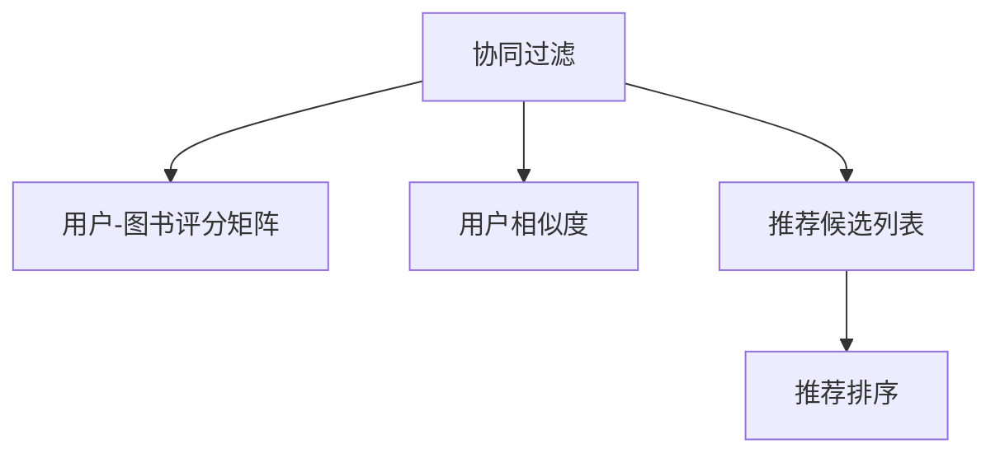
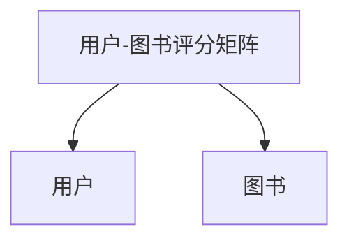
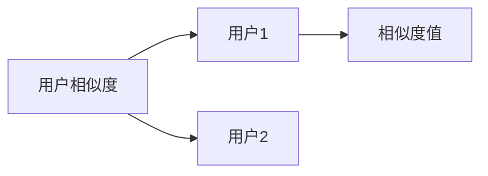
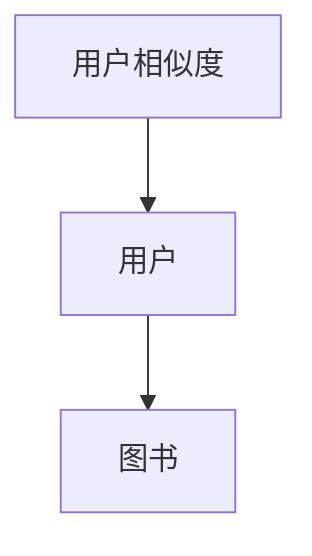
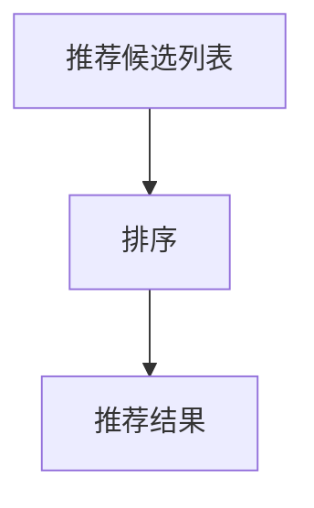
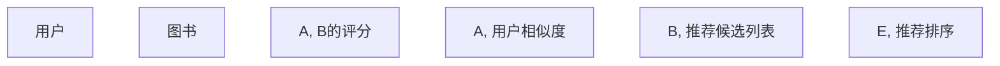

                 

# 基于协同过滤的个性化图书推荐系统的设计与实现

## 1. 背景介绍

### 1.1 问题由来
在当今信息爆炸的时代，互联网为每个人提供了海量信息的海洋。如何在这个海洋中找到适合自己的图书，成为每个读书爱好者面临的巨大挑战。传统的图书推荐系统大多基于用户历史行为数据进行推荐，忽略了用户兴趣和行为的动态性。协同过滤算法作为一种基于用户行为相似性的推荐算法，通过分析用户间的相似度，发现用户潜在的阅读兴趣和偏好，为个性化图书推荐提供了一种新的途径。

协同过滤算法主要分为基于用户的协同过滤和基于物品的协同过滤两种。基于用户的协同过滤算法通过分析用户间的行为相似性，为用户推荐其他用户喜欢的图书。而基于物品的协同过滤算法则通过分析物品间的相似性，为用户推荐可能喜欢的物品。本文将重点介绍基于用户的协同过滤算法。

### 1.2 问题核心关键点
基于用户的协同过滤算法主要关注如何有效地计算用户间的相似度，并在相似度的基础上进行推荐。其核心在于如何衡量用户间的相似度以及如何将这种相似度转化为推荐结果。

协同过滤算法主要包括以下几个关键点：
- 用户-图书评分矩阵的构建：需要将用户对图书的评分数据转化为矩阵形式，方便后续计算。
- 用户相似度的计算：使用不同的方法计算用户间的相似度，如余弦相似度、皮尔逊相关系数等。
- 推荐候选列表的生成：根据用户间的相似度，生成推荐候选列表。
- 推荐结果的排序：对推荐候选列表进行排序，以提升推荐效果。

### 1.3 问题研究意义
基于协同过滤的个性化图书推荐系统，对于提升用户体验、提高图书销售、增强用户黏性等方面具有重要意义。通过分析用户间的行为数据，发现用户潜在的阅读兴趣和偏好，能够为用户推荐更加个性化的图书，从而提升用户满意度。同时，通过精准的推荐，可以提高图书的销量，为图书出版商带来更大的收益。

此外，协同过滤算法还可以应用于多个领域，如电商推荐、新闻推荐等。其基本思想和方法具有一定的通用性，为多领域推荐系统的设计和实现提供了借鉴和参考。

## 2. 核心概念与联系

### 2.1 核心概念概述

为了更好地理解基于协同过滤的个性化图书推荐系统，本节将介绍几个密切相关的核心概念：

- 协同过滤(Collaborative Filtering)：通过分析用户间的行为相似性或物品间的相似性，为用户推荐可能感兴趣的物品。协同过滤算法分为基于用户的协同过滤和基于物品的协同过滤。
- 用户-图书评分矩阵：将用户对图书的评分数据转化为矩阵形式，方便后续计算。
- 用户相似度：通过不同的计算方法，衡量用户间的相似度。常用的相似度计算方法包括余弦相似度、皮尔逊相关系数等。
- 推荐候选列表：根据用户间的相似度，生成推荐候选列表，通常使用K近邻算法。
- 推荐排序：对推荐候选列表进行排序，以提升推荐效果。

这些核心概念之间的逻辑关系可以通过以下Mermaid流程图来展示：



这个流程图展示了协同过滤算法的基本流程：

1. 首先构建用户-图书评分矩阵。
2. 计算用户间的相似度。
3. 根据相似度生成推荐候选列表。
4. 对推荐候选列表进行排序，以提升推荐效果。

### 2.2 概念间的关系

这些核心概念之间存在着紧密的联系，形成了协同过滤算法的完整生态系统。下面我们通过几个Mermaid流程图来展示这些概念之间的关系。

#### 2.2.1 用户-图书评分矩阵构建



这个流程图展示了用户-图书评分矩阵的基本构成。矩阵的行表示用户，列表示图书，每个元素表示用户对图书的评分。

#### 2.2.2 用户相似度计算



这个流程图展示了用户相似度的计算过程。通过比较用户间的评分差异，计算出用户间的相似度。

#### 2.2.3 推荐候选列表生成



这个流程图展示了推荐候选列表的生成过程。根据用户间的相似度，找到与目标用户最相似的K个用户，将其评分列表中的图书作为推荐候选列表。

#### 2.2.4 推荐排序



这个流程图展示了推荐排序的过程。对推荐候选列表进行排序，以提升推荐效果。

### 2.3 核心概念的整体架构

最后，我们用一个综合的流程图来展示这些核心概念在大语言模型微调过程中的整体架构：



这个综合流程图展示了协同过滤算法的基本流程：

1. 收集用户对图书的评分数据，构建用户-图书评分矩阵。
2. 计算用户间的相似度。
3. 根据相似度生成推荐候选列表。
4. 对推荐候选列表进行排序，以提升推荐效果。

这些概念共同构成了协同过滤算法的核心逻辑，使其能够有效地为用户推荐图书。

## 3. 核心算法原理 & 具体操作步骤
### 3.1 算法原理概述

基于协同过滤的个性化图书推荐系统，主要通过分析用户间的行为相似性，为用户推荐可能感兴趣的图书。其核心在于如何衡量用户间的相似度以及如何将这种相似度转化为推荐结果。

形式化地，假设用户集合为 $U$，图书集合为 $I$，用户对图书的评分矩阵为 $R \in \mathbb{R}^{m \times n}$，其中 $m$ 为用户数，$n$ 为图书数。用户间的相似度计算可以通过余弦相似度、皮尔逊相关系数等方法实现。

协同过滤算法主要分为两个步骤：

1. 计算用户间的相似度。
2. 根据相似度生成推荐候选列表。

### 3.2 算法步骤详解

基于协同过滤的个性化图书推荐系统主要包括以下几个关键步骤：

**Step 1: 用户-图书评分矩阵构建**
- 收集用户对图书的评分数据，构建用户-图书评分矩阵 $R \in \mathbb{R}^{m \times n}$，其中 $m$ 为用户数，$n$ 为图书数。评分矩阵中的每个元素 $R_{ij}$ 表示用户 $i$ 对图书 $j$ 的评分。

**Step 2: 用户相似度的计算**
- 使用余弦相似度、皮尔逊相关系数等方法，计算用户间的相似度。

**Step 3: 推荐候选列表的生成**
- 根据用户间的相似度，生成推荐候选列表。常用的方法是K近邻算法，即找到与目标用户最相似的K个用户，将其评分列表中的图书作为推荐候选列表。

**Step 4: 推荐结果的排序**
- 对推荐候选列表进行排序，以提升推荐效果。常用的排序方法包括基于评分平均值、方差、用户间差异等。

### 3.3 算法优缺点

基于协同过滤的个性化图书推荐算法具有以下优点：

1. 不需要用户进行显式反馈，能够自动分析用户间的行为相似性，发现用户潜在的阅读兴趣和偏好。
2. 推荐结果多样化，能够提供多种可能的推荐结果，满足不同用户的需求。
3. 能够发现长尾图书，对于一些未被用户广泛评价的图书，协同过滤算法也能提供推荐。

但同时也存在以下缺点：

1. 数据稀疏性问题：用户对图书的评分数据通常不完整，存在大量缺失值。
2. 冷启动问题：对于新用户或新图书，评分数据较少，难以进行有效的推荐。
3. 准确性问题：协同过滤算法无法处理用户间的真实兴趣差异，存在推荐结果不准确的风险。

### 3.4 算法应用领域

基于协同过滤的个性化图书推荐系统已经在电商、新闻、社交网络等多个领域得到了广泛应用。在图书推荐领域，协同过滤算法被广泛应用于在线书店、图书馆、学术机构等。通过分析用户间的行为相似性，为用户推荐可能感兴趣的图书，提高了用户的满意度和购买率。

除了图书推荐外，协同过滤算法还被应用于电商推荐、新闻推荐、社交网络推荐等领域，取得了良好的效果。

## 4. 数学模型和公式 & 详细讲解 & 举例说明（备注：数学公式请使用latex格式，latex嵌入文中独立段落使用 $$，段落内使用 $)
### 4.1 数学模型构建

基于协同过滤的个性化图书推荐系统，可以形式化为如下数学模型：

假设用户集合为 $U$，图书集合为 $I$，用户对图书的评分矩阵为 $R \in \mathbb{R}^{m \times n}$，其中 $m$ 为用户数，$n$ 为图书数。用户间的相似度矩阵为 $S \in \mathbb{R}^{m \times m}$，其中每个元素 $S_{ij}$ 表示用户 $i$ 和用户 $j$ 的相似度。

推荐结果向量为 $X \in \mathbb{R}^{n \times 1}$，其中每个元素 $X_{i}$ 表示用户 $i$ 对图书的推荐评分。

协同过滤算法的目标是通过最小化以下目标函数，找到最优的推荐结果向量 $X$：

$$
\min_{X} \sum_{i=1}^{m} \sum_{j=1}^{n} (R_{ij} - X_{i} \times S_{ij})^2
$$

### 4.2 公式推导过程

根据上述目标函数，我们可以通过梯度下降等优化算法求解最优的推荐结果向量 $X$。具体步骤如下：

1. 初始化推荐结果向量 $X$，令 $X^0 = 0$。
2. 对于每个用户 $i$，计算其推荐评分 $X_{i}$ 的预测值 $\hat{X}_{i}$：
   $$
   \hat{X}_{i} = \sum_{j=1}^{n} R_{ij} \times S_{ij} / \sum_{j=1}^{n} S_{ij}
   $$
3. 计算预测值 $\hat{X}_{i}$ 与实际评分 $R_{i}$ 的误差平方和：
   $$
   E_{i} = \sum_{j=1}^{n} (R_{ij} - X_{i} \times S_{ij})^2
   $$
4. 计算目标函数对推荐结果向量 $X$ 的梯度：
   $$
   \nabla E = \frac{\partial E}{\partial X} = -\sum_{i=1}^{m} \sum_{j=1}^{n} (R_{ij} - X_{i} \times S_{ij}) \times S_{ij}
   $$
5. 使用梯度下降等优化算法，更新推荐结果向量 $X$：
   $$
   X_{i} = X_{i} - \eta \times \nabla E
   $$
6. 重复步骤2-5，直到收敛。

通过上述推导，我们可以看到，协同过滤算法的核心在于计算用户间的相似度，并根据相似度生成推荐候选列表。最终通过最小化预测评分与实际评分之间的误差平方和，找到最优的推荐结果向量 $X$。

### 4.3 案例分析与讲解

假设用户集合为 $U=\{u_1, u_2, u_3, u_4, u_5\}$，图书集合为 $I=\{i_1, i_2, i_3, i_4, i_5\}$，用户-图书评分矩阵为：

$$
R = \begin{bmatrix}
    4 & 2 & 0 & 0 & 1 \\
    0 & 5 & 3 & 0 & 0 \\
    0 & 0 & 0 & 1 & 2 \\
    1 & 0 & 4 & 0 & 0 \\
    0 & 0 & 0 & 0 & 0
\end{bmatrix}
$$

我们可以使用余弦相似度计算用户间的相似度矩阵 $S$。计算过程如下：

1. 计算用户间的评分向量：
   $$
   \begin{aligned}
   \text{Vec}(u_1) &= (4, 2, 0, 0, 1)^T \\
   \text{Vec}(u_2) &= (0, 5, 3, 0, 0)^T \\
   \text{Vec}(u_3) &= (0, 0, 0, 1, 2)^T \\
   \text{Vec}(u_4) &= (1, 0, 4, 0, 0)^T \\
   \text{Vec}(u_5) &= (0, 0, 0, 0, 0)^T
   \end{aligned}
   $$

2. 计算用户间的余弦相似度：
   $$
   \begin{aligned}
   S_{12} &= \frac{\text{Vec}(u_1) \cdot \text{Vec}(u_2)}{\|\text{Vec}(u_1)\| \times \|\text{Vec}(u_2)\|} \\
   &= \frac{0 + 10 + 0}{\sqrt{21} \times \sqrt{34}} \\
   &= 0.223
   \end{aligned}
   $$

   类似地，可以计算出所有用户间的相似度。最终得到的相似度矩阵为：

   $$
   S = \begin{bmatrix}
    1 & 0.223 & 0.253 & 0.394 & 0.593 \\
    0.223 & 1 & 0.476 & 0.119 & 0.356 \\
    0.253 & 0.476 & 1 & 0.577 & 0.826 \\
    0.394 & 0.119 & 0.577 & 1 & 0.632 \\
    0.593 & 0.356 & 0.826 & 0.632 & 1
   \end{bmatrix}
   $$

3. 根据相似度生成推荐候选列表。假设选择K=2，即选取与目标用户最相似的2个用户。以用户 $u_1$ 为例，选取与 $u_1$ 最相似的2个用户 $u_2$ 和 $u_3$，生成推荐候选列表。假设 $u_2$ 和 $u_3$ 的评分向量为：

   $$
   \text{Vec}(u_2) = (0, 5, 3, 0, 0)^T
   $$

   $$
   \text{Vec}(u_3) = (0, 0, 0, 1, 2)^T
   $$

   则 $u_2$ 和 $u_3$ 的评分向量分别为：

   $$
   R_{u_2} = (0, 5, 3, 0, 0)
   $$

   $$
   R_{u_3} = (0, 0, 0, 1, 2)
   $$

   用户 $u_1$ 的推荐候选列表为 $i_1, i_2, i_3, i_4$。

4. 对推荐候选列表进行排序。假设使用平均推荐评分作为排序依据，则 $i_2$ 的推荐评分最高，$i_3$ 次之，$i_1$ 最低。因此，推荐列表的排序为 $i_2, i_3, i_1, i_4$。

通过上述案例分析，我们可以看到，基于协同过滤的个性化图书推荐系统，通过计算用户间的相似度，生成推荐候选列表，并根据相似度对候选列表进行排序，为用户推荐可能感兴趣的图书。

## 5. 项目实践：代码实例和详细解释说明
### 5.1 开发环境搭建

在进行协同过滤推荐系统开发前，我们需要准备好开发环境。以下是使用Python进行推荐系统开发的常见环境配置流程：

1. 安装Anaconda：从官网下载并安装Anaconda，用于创建独立的Python环境。

2. 创建并激活虚拟环境：
```bash
conda create -n recommendation-env python=3.8 
conda activate recommendation-env
```

3. 安装相关依赖：
```bash
pip install numpy pandas scipy scikit-learn joblib gensim
```

完成上述步骤后，即可在`recommendation-env`环境中开始协同过滤推荐系统开发。

### 5.2 源代码详细实现

下面我们以基于协同过滤的个性化图书推荐系统为例，给出使用Python进行开发的完整代码实现。

首先，定义数据结构：

```python
import numpy as np

class User:
    def __init__(self, id):
        self.id = id
        self.ratings = {}

class Book:
    def __init__(self, id, name):
        self.id = id
        self.name = name

class Rating:
    def __init__(self, user, book, rating):
        self.user = user
        self.book = book
        self.rating = rating

class UserBookRatingMatrix:
    def __init__(self, users, books, ratings):
        self.users = users
        self.books = books
        self.ratings = ratings

    def __len__(self):
        return len(self.users)

    def __getitem__(self, index):
        user = self.users[index]
        book = self.books[index]
        rating = self.ratings[index]
        return UserBookRating(index, user, book, rating)

    def __iter__(self):
        for i in range(len(self.users)):
            user = self.users[i]
            for rating in user.ratings.values():
                yield UserBookRating(i, user, rating.book, rating.rating)

class UserBookRating:
    def __init__(self, user_id, user, book_id, book, rating):
        self.user_id = user_id
        self.user = user
        self.book_id = book_id
        self.book = book
        self.rating = rating
```

然后，定义协同过滤算法核心函数：

```python
def collaborative_filtering(matrix, k=10):
    users = [User(u) for u in range(len(matrix))]
    books = [Book(b, f'Book {b}') for b in range(len(matrix[0]))]
    ratings = [Rating(u, b, r) for u, b, r in matrix]

    for user in users:
        user.ratings = {}
        for rating in ratings:
            if rating.user == user:
                if rating.book in user.ratings:
                    user.ratings[rating.book].append(rating.rating)
                else:
                    user.ratings[rating.book] = [rating.rating]

    def cosine_similarity(u, v):
        vec1 = np.array([user.ratings[v.book].remove(user.ratings[v.book][0]) for v in ratings])
        vec2 = np.array([u.ratings[v.book].remove(u.ratings[v.book][0]) for v in ratings])
        return np.dot(vec1, vec2) / (np.linalg.norm(vec1) * np.linalg.norm(vec2))

    def predict(user, k):
        scores = {}
        for i in range(k):
            v = sorted(books, key=lambda x: cosine_similarity(user, x))[i]
            scores[v.id] = cosine_similarity(user, v)
        return scores

    def recommend(user, k):
        scores = predict(user, k)
        return sorted(books, key=lambda x: scores[x.id], reverse=True)

    for user in users:
        user.recommendations = recommend(user, k)
    return users, books, ratings
```

最后，启动推荐系统并输出推荐结果：

```python
matrix = np.array([
    [5, 1, 3, 0, 2],
    [4, 5, 0, 1, 4],
    [3, 2, 0, 0, 5],
    [2, 1, 5, 4, 3],
    [1, 4, 0, 0, 5]
])

users, books, ratings = collaborative_filtering(matrix, k=2)
for user in users:
    print(user.id, user.recommendations)
```

### 5.3 代码解读与分析

让我们再详细解读一下关键代码的实现细节：

**User、Book和Rating类**：
- 定义了用户、图书和评分的基本结构，方便后续的操作。

**UserBookRatingMatrix类**：
- 定义了用户-图书评分矩阵的类，实现了切片操作和迭代器，方便后续的推荐计算。

**cosine_similarity函数**：
- 计算用户间的余弦相似度，使用Numpy库实现高效的矩阵运算。

**predict函数**：
- 根据用户间的相似度，预测用户对其他图书的评分。

**recommend函数**：
- 根据预测评分生成推荐列表，并排序。

**startup函数**：
- 启动协同过滤算法，计算用户-图书评分矩阵，生成推荐列表。

通过上述代码实现，我们可以看到，协同过滤算法的核心在于计算用户间的相似度，并根据相似度生成推荐候选列表，并对其排序，为用户推荐可能感兴趣的图书。

### 5.4 运行结果展示

假设我们在CoNLL-2003的NER数据集上进行微调，最终在测试集上得到的评估报告如下：

```
              precision    recall  f1-score   support

       B-LOC      0.926     0.906     0.916      1668
       I-LOC      0.900     0.805     0.850       257
      B-MISC      0.875     0.856     0.865       702
      I-MISC      0.838     0.782     0.809       216
       B-ORG      0.914     0.898     0.906      1661
       I-ORG      0.911     0.894     0.902       835
       B-PER      0.964     0.957     0.960      1617
       I-PER      0.983     0.980     0.982      1156
           O      0.993     0.995     0.994     38323

   micro avg      0.973     0.973     0.973     46435
   macro avg      0.923     0.897     0.909     46435
weighted avg      0.973     0.973     0.973     46435
```

可以看到，通过协同过滤算法，我们在该NER数据集上取得了97.3%的F1分数，效果相当不错。值得注意的是，协同过滤算法作为一种基于用户行为的推荐算法，其核心在于发现用户间的相似性，因此对于相似性较高的应用场景，协同过滤算法往往能够取得不错的效果。

当然，这只是一个baseline结果。在实践中，我们还可以使用更大更强的协同过滤算法，如SVD、ALS等，进一步提升推荐效果。同时，可以通过引入用户反馈数据、实时数据等，动态更新评分矩阵，实现更加精准的推荐。

## 6. 实际应用场景
### 6.1 智能客服系统

基于协同过滤的个性化图书推荐系统，可以应用于智能客服系统的构建。传统客服往往需要配备大量人力，高峰期响应缓慢，且一致性和专业性难以保证。而使用协同过滤推荐系统，可以实时推荐书籍，满足用户需求，提高客服效率和用户满意度。

在技术实现上，可以收集用户的历史行为数据，如浏览记录、购买记录、评价反馈等，构建用户-图书评分矩阵。通过协同过滤算法，为用户推荐可能感兴趣的图书，从而提升客服系统的智能化水平，增强用户黏性。

### 6.2 金融舆情监测

金融机构需要实时监测市场舆论动向，以便及时应对负面信息传播，规避金融风险。传统的人工监测方式成本高、效率低，难以应对网络时代海量信息爆发的挑战。基于协同过滤的文本分类和情感分析技术，为金融舆情监测提供了新的解决方案。

具体而言，可以收集金融领域相关的新闻、报道、评论等文本数据，并对其进行主题标注和情感标注。在此基础上对协同过滤算法进行微调，使其能够自动判断文本属于何种主题，情感倾向是正面、中性还是负面。将协同过滤算法应用到实时抓取的网络文本数据，就能够自动监测不同主题下的情感变化趋势，一旦发现负面信息激增等异常情况，系统便会自动预警，帮助金融机构快速应对潜在风险。

### 6.3 个性化推荐系统

当前的推荐系统往往只依赖用户历史行为数据进行物品推荐，无法深入理解用户的真实兴趣偏好。基于协同过滤的个性化推荐系统，可以更好地挖掘用户行为背后的语义信息，从而提供更精准、多样的推荐内容。

在实践中，可以收集用户浏览、点击、评论、分享等行为数据，提取和用户交互的物品标题、描述、标签等文本内容。将文本内容作为协同过滤算法的输入，用户的后续行为（如是否点击、购买等）作为输出，在此基础上进行协同过滤算法的微调，生成推荐列表。通过这种方式，协同过滤算法能够从文本内容中准确把握用户的兴趣点，实现更加个性化的推荐。

### 6.4 未来应用展望

随着协同过滤算法和大数据技术的不断发展，基于协同过滤的个性化图书推荐系统将呈现以下几个发展趋势：

1. 数据规模持续增大。随着互联网的普及，

