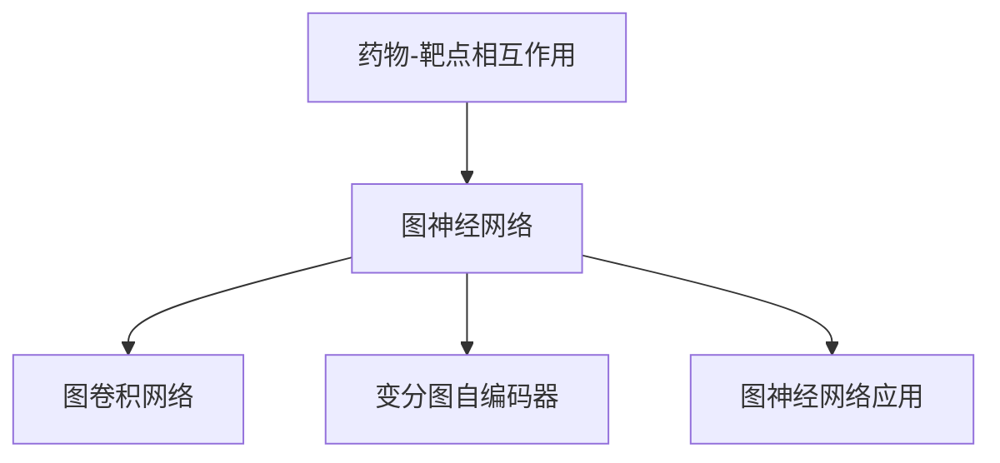
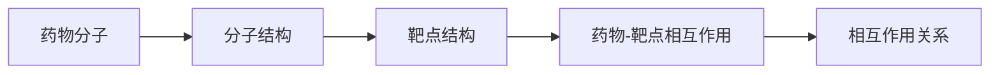
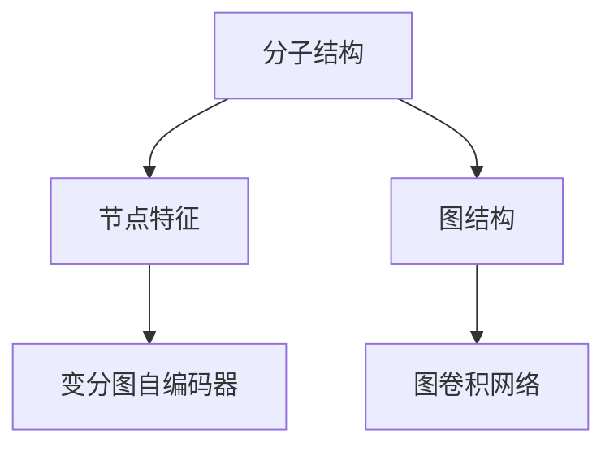

                 

# 基于图神经网络的药物-靶点相互作用预测

## 1. 背景介绍

### 1.1 问题由来

在药物发现和研发过程中，预测药物与靶点之间的相互作用关系是一个核心任务。传统的基于特征工程的药物-靶点相互作用预测方法，由于数据高维稀疏和特征表达能力有限，难以刻画分子结构与生物学机制之间的复杂关系。而深度学习方法如卷积神经网络(CNN)和递归神经网络(RNN)等，虽然在处理序列数据和图像数据上表现优异，但同样难以有效地处理分子结构的图结构特性。

图神经网络（Graph Neural Networks, GNNs）的兴起，为药物-靶点相互作用预测问题提供了一种全新的解决方案。利用图神经网络能够对分子结构进行有效的特征表示，并提取图结构特性，显著提升了预测的准确性和鲁棒性。本文聚焦于基于图神经网络的药物-靶点相互作用预测方法，将详细介绍其核心原理、关键技术和实际应用案例，并展望未来发展方向。

### 1.2 问题核心关键点

药物-靶点相互作用预测的核心任务在于从分子结构预测其与靶点的亲和力大小。传统的基于特征工程的药物-靶点相互作用预测方法由于高维稀疏和特征表达能力有限，难以刻画分子结构与生物学机制之间的复杂关系。而深度学习方法如卷积神经网络(CNN)和递归神经网络(RNN)等，虽然在处理序列数据和图像数据上表现优异，但同样难以有效地处理分子结构的图结构特性。

图神经网络（Graph Neural Networks, GNNs）的兴起，为药物-靶点相互作用预测问题提供了一种全新的解决方案。利用图神经网络能够对分子结构进行有效的特征表示，并提取图结构特性，显著提升了预测的准确性和鲁棒性。本文将详细介绍基于图神经网络的药物-靶点相互作用预测方法的核心原理、关键技术和实际应用案例，并展望未来发展方向。

## 2. 核心概念与联系

### 2.1 核心概念概述

为更好地理解基于图神经网络的药物-靶点相互作用预测方法，本节将介绍几个密切相关的核心概念：

- 图神经网络（Graph Neural Networks, GNNs）：一种专门用于处理图结构数据的深度学习模型，能够从图结构的局部和全局特性中学习到节点和边之间的关系，从而提取有意义的图特征。
- 药物-靶点相互作用（Drug-Target Interaction, DTI）：描述药物分子与生物靶点之间相互作用关系的概念。通常用于药物发现、设计、筛选和验证过程中，指导新药研发。
- 图卷积网络（Graph Convolutional Networks, GCNs）：一种经典的图神经网络模型，通过卷积操作在图结构上提取特征。
- 变分图自编码器（Variational Graph Autoencoders, VGAEs）：一种用于图结构数据学习表示的生成模型，通过学习图结构的潜在分布来提取特征。
- 图神经网络应用：包括社交网络分析、推荐系统、蛋白质结构预测、药物-靶点相互作用预测等多个领域，是深度学习在图结构数据上应用的重要方向。

这些核心概念之间的逻辑关系可以通过以下Mermaid流程图来展示：



这个流程图展示了药物-靶点相互作用预测任务与图神经网络方法之间的密切联系。药物-靶点相互作用预测任务中，图神经网络通过对分子结构和靶点结构进行特征表示和图结构信息提取，预测分子与靶点之间的相互作用关系。其中，图卷积网络和变分图自编码器是图神经网络中的两种经典模型，用于不同的特征表示和信息提取任务。图神经网络的应用领域非常广泛，涉及多个实际问题，如图社交网络分析、推荐系统等。

### 2.2 概念间的关系

这些核心概念之间存在着紧密的联系，形成了图神经网络在药物-靶点相互作用预测中的应用框架。下面我们通过几个Mermaid流程图来展示这些概念之间的关系。

#### 2.2.1 药物-靶点相互作用预测流程



这个流程图展示了药物-靶点相互作用预测的基本流程。药物分子通过分子结构特征编码，与靶点结构进行融合，生成药物-靶点相互作用的表示。然后，使用图神经网络对生成的表示进行特征提取，最终预测药物-靶点相互作用关系。

#### 2.2.2 图神经网络结构


这个流程图展示了图神经网络的基本结构。图中包含节点和边，通过图神经网络对这些节点和边的特征进行表示和提取，生成有意义的图特征。

#### 2.2.3 特征表示与图结构特性



这个流程图展示了图神经网络中节点特征和图结构特性的关系。分子结构被编码为节点特征，并通过变分图自编码器进行学习，生成图结构特征。这些特征通过图卷积网络进一步提取和融合，生成最终的图表示。

## 3. 核心算法原理 & 具体操作步骤

### 3.1 算法原理概述

基于图神经网络的药物-靶点相互作用预测，本质上是通过图神经网络对药物分子结构和靶点结构的图结构特征进行学习，然后对生成的图表示进行分类或回归，预测药物-靶点相互作用关系。图神经网络模型包括节点和边，通过聚合和传播机制，逐步从局部和全局的角度提取图结构特性，生成最终的图表示。

形式化地，假设药物分子和靶点结构分别表示为图 $G=\{V,E\}$，其中 $V$ 表示节点集合，$E$ 表示边集合。图神经网络通过图卷积操作和聚合操作，对每个节点和边进行特征表示和信息提取。设节点的特征表示为 $h_v^l$，边的特征表示为 $h_e^l$，则根据图卷积网络的思想，节点和边之间的特征可以通过卷积操作进行传播：

$$
h_v^{l+1} = \sigma\left(\sum_{u\in\mathcal{N}(v)}\left(A_{uv}W^{(l+1)}_{hv}h_u^l\right)\right)
$$

其中 $A_{uv}$ 表示节点 $u$ 和 $v$ 之间的连接权重，$W^{(l+1)}_{hv}$ 表示节点特征的线性变换矩阵，$\sigma$ 表示非线性激活函数。通过多层的卷积操作和聚合操作，最终生成全局的图表示 $H^{L}$，用于预测药物-靶点相互作用关系。

### 3.2 算法步骤详解

基于图神经网络的药物-靶点相互作用预测一般包括以下几个关键步骤：

**Step 1: 数据准备**
- 收集药物分子和靶点的分子结构和生物信息数据。常用的数据集包括MoleculeNet、PubChem等。
- 对分子结构和靶点结构进行标准化和预处理，如去除氢原子、增加双键等。

**Step 2: 构建图结构**
- 构建药物分子和靶点的图结构，通常使用分子图的表示方法，如S-MILES表示法。
- 根据分子图结构，生成药物-靶点相互作用图，描述药物与靶点之间的化学键和相互作用关系。

**Step 3: 节点和边特征嵌入**
- 对分子图和靶点图的节点和边进行特征嵌入，生成初始的节点和边特征向量。
- 常用的特征嵌入方法包括分子指纹特征、化学键特征、原子类型特征等。

**Step 4: 图神经网络训练**
- 定义损失函数，如交叉熵损失或均方误差损失，用于衡量预测值与真实值的差异。
- 使用深度学习框架如PyTorch、TensorFlow等搭建图神经网络模型。
- 设置训练参数，包括学习率、优化器等。

**Step 5: 模型预测**
- 对药物-靶点相互作用图进行前向传播，生成图表示 $H^{L}$。
- 使用全连接层或分类器对图表示进行分类或回归，预测药物-靶点相互作用关系。

### 3.3 算法优缺点

基于图神经网络的药物-靶点相互作用预测方法具有以下优点：
1. 能够高效地处理高维稀疏分子结构数据，提取图结构特征。
2. 具有较好的泛化能力和鲁棒性，能够处理未见过的分子结构。
3. 可以与先验知识进行结合，如知识图谱、逻辑规则等。

同时，该方法也存在以下局限性：
1. 需要较多的计算资源和训练时间，尤其是在大规模图数据上。
2. 对于图结构的表达方式较为敏感，不同的表示方法可能影响模型的性能。
3. 无法直接解释模型内部工作机制和决策逻辑。

尽管存在这些局限性，但基于图神经网络的药物-靶点相互作用预测方法仍然是一种非常有前景的解决方案，已经在多个实际应用中取得了不错的效果。

### 3.4 算法应用领域

基于图神经网络的药物-靶点相互作用预测方法，已经在以下几个领域得到了广泛应用：

- 药物发现和设计：预测新药物与靶点之间的亲和力关系，指导新药设计。
- 药物筛选和优化：筛选潜在的药物候选分子，优化药物分子结构。
- 药物-靶点相互作用分析：分析药物与靶点之间的相互作用机制，指导药物作用机制研究。
- 药物毒性预测：预测药物的毒性作用和副作用，优化药物的安全性。

除了上述这些应用领域外，图神经网络还可以与其他深度学习技术结合，如强化学习、生成对抗网络等，用于药物-靶点相互作用的模拟和优化，进一步提升药物研发效率和成功率。

## 4. 数学模型和公式 & 详细讲解 & 举例说明

### 4.1 数学模型构建

本节将使用数学语言对基于图神经网络的药物-靶点相互作用预测过程进行更加严格的刻画。

设药物分子和靶点结构的分子图分别为 $G_D=\{V_D,E_D\}$ 和 $G_T=\{V_T,E_T\}$，其中 $V_D$ 和 $V_T$ 表示分子图和靶点图的节点集合，$E_D$ 和 $E_T$ 表示分子图和靶点图的边集合。设节点 $v$ 的特征表示为 $h_v$，边 $e$ 的特征表示为 $h_e$，则根据图卷积网络的思想，节点的特征表示可以表示为：

$$
h_v^{l+1} = \sigma\left(\sum_{u\in\mathcal{N}(v)}\left(A_{uv}W^{(l+1)}_{hv}h_u^l\right)\right)
$$

其中 $A_{uv}$ 表示节点 $u$ 和 $v$ 之间的连接权重，$W^{(l+1)}_{hv}$ 表示节点特征的线性变换矩阵，$\sigma$ 表示非线性激活函数。通过多层的卷积操作和聚合操作，最终生成全局的图表示 $H^{L}$，用于预测药物-靶点相互作用关系。

### 4.2 公式推导过程

以下我们以二分类任务为例，推导交叉熵损失函数及其梯度的计算公式。

假设药物分子和靶点结构的分子图分别为 $G_D=\{V_D,E_D\}$ 和 $G_T=\{V_T,E_T\}$，其中 $V_D$ 和 $V_T$ 表示分子图和靶点图的节点集合，$E_D$ 和 $E_T$ 表示分子图和靶点图的边集合。设节点 $v$ 的特征表示为 $h_v$，边 $e$ 的特征表示为 $h_e$，则根据图卷积网络的思想，节点的特征表示可以表示为：

$$
h_v^{l+1} = \sigma\left(\sum_{u\in\mathcal{N}(v)}\left(A_{uv}W^{(l+1)}_{hv}h_u^l\right)\right)
$$

其中 $A_{uv}$ 表示节点 $u$ 和 $v$ 之间的连接权重，$W^{(l+1)}_{hv}$ 表示节点特征的线性变换矩阵，$\sigma$ 表示非线性激活函数。

通过多层的卷积操作和聚合操作，最终生成全局的图表示 $H^{L}$，用于预测药物-靶点相互作用关系。假设输出层为全连接层，输出节点的概率表示为 $P^{L}(v)$，则二分类任务的交叉熵损失函数可以表示为：

$$
\mathcal{L} = -\frac{1}{N}\sum_{i=1}^N \left( y_i \log P^{L}(v_i) + (1-y_i) \log (1-P^{L}(v_i)) \right)
$$

其中 $y_i$ 表示节点 $v_i$ 的真实标签，$P^{L}(v_i)$ 表示节点 $v_i$ 的预测概率。

根据链式法则，损失函数对节点特征 $h_v$ 的梯度可以表示为：

$$
\frac{\partial \mathcal{L}}{\partial h_v} = -\frac{\partial \mathcal{L}}{\partial P^{L}(v)} \frac{\partial P^{L}(v)}{\partial h_v}
$$

其中 $\frac{\partial \mathcal{L}}{\partial P^{L}(v)}$ 为交叉熵损失对输出概率的梯度，$\frac{\partial P^{L}(v)}{\partial h_v}$ 为输出概率对节点特征的梯度。

### 4.3 案例分析与讲解

假设我们有一个分子图 $G_D$，包含一个药物分子和多个靶点分子。分子图中每个节点的特征表示为分子指纹特征，每个边的特征表示为化学键特征。假设药物分子与靶点分子的相互作用关系为二分类任务，节点 $v$ 的预测概率 $P^{L}(v)$ 表示为：

$$
P^{L}(v) = \sigma\left(\sum_{u\in\mathcal{N}(v)}\left(A_{uv}W^{(L)}_{hv}h_u^{L-1}\right)\right)
$$

其中 $W^{(L)}_{hv}$ 表示节点特征的线性变换矩阵，$h_u^{L-1}$ 表示邻接节点的特征表示。

假设输出层为全连接层，输出节点的概率表示为 $P^{L}(v)$，则二分类任务的交叉熵损失函数可以表示为：

$$
\mathcal{L} = -\frac{1}{N}\sum_{i=1}^N \left( y_i \log P^{L}(v_i) + (1-y_i) \log (1-P^{L}(v_i)) \right)
$$

其中 $y_i$ 表示节点 $v_i$ 的真实标签，$P^{L}(v_i)$ 表示节点 $v_i$ 的预测概率。

根据链式法则，损失函数对节点特征 $h_v$ 的梯度可以表示为：

$$
\frac{\partial \mathcal{L}}{\partial h_v} = -\frac{\partial \mathcal{L}}{\partial P^{L}(v)} \frac{\partial P^{L}(v)}{\partial h_v}
$$

其中 $\frac{\partial \mathcal{L}}{\partial P^{L}(v)}$ 为交叉熵损失对输出概率的梯度，$\frac{\partial P^{L}(v)}{\partial h_v}$ 为输出概率对节点特征的梯度。

通过上述推导过程，我们可以更加深入地理解基于图神经网络的药物-靶点相互作用预测的数学模型和计算过程。

## 5. 项目实践：代码实例和详细解释说明

### 5.1 开发环境搭建

在进行项目实践前，我们需要准备好开发环境。以下是使用Python进行PyTorch开发的环境配置流程：

1. 安装Anaconda：从官网下载并安装Anaconda，用于创建独立的Python环境。

2. 创建并激活虚拟环境：
```bash
conda create -n pytorch-env python=3.8 
conda activate pytorch-env
```

3. 安装PyTorch：根据CUDA版本，从官网获取对应的安装命令。例如：
```bash
conda install pytorch torchvision torchaudio cudatoolkit=11.1 -c pytorch -c conda-forge
```

4. 安装各类工具包：
```bash
pip install numpy pandas scikit-learn matplotlib tqdm jupyter notebook ipython
```

完成上述步骤后，即可在`pytorch-env`环境中开始项目实践。

### 5.2 源代码详细实现

这里以一个简单的图卷积网络（GCN）模型为例，展示如何实现药物-靶点相互作用预测。

首先，定义分子图和靶点图的节点特征和边特征：

```python
import torch
import torch.nn as nn
import torch.nn.functional as F

class GNNModel(nn.Module):
    def __init__(self, input_dim, hidden_dim, output_dim):
        super(GNNModel, self).__init__()
        self.gcn1 = nn.GCNConv(input_dim, hidden_dim)
        self.gcn2 = nn.GCNConv(hidden_dim, hidden_dim)
        self.fc = nn.Linear(hidden_dim, output_dim)
        
    def forward(self, x, adj):
        x = self.gcn1(x, adj)
        x = F.relu(x)
        x = self.gcn2(x, adj)
        x = F.relu(x)
        x = self.fc(x)
        return x

# 节点特征的维度
input_dim = 100
# 隐藏层的维度
hidden_dim = 256
# 输出层的维度
output_dim = 1

# 创建图神经网络模型
model = GNNModel(input_dim, hidden_dim, output_dim)
```

然后，定义训练函数：

```python
from torch.utils.data import DataLoader
from sklearn.metrics import roc_auc_score

def train_epoch(model, optimizer, dataloader):
    model.train()
    epoch_loss = 0
    epoch_acc = 0
    for batch in dataloader:
        inputs, labels = batch
        optimizer.zero_grad()
        outputs = model(inputs, adj)
        loss = F.binary_cross_entropy_with_logits(outputs, labels)
        epoch_loss += loss.item()
        loss.backward()
        optimizer.step()
        epoch_acc += roc_auc_score(labels, outputs.detach().sigmoid()).item()
    return epoch_loss / len(dataloader), epoch_acc / len(dataloader)
```

接着，定义评估函数：

```python
def evaluate(model, dataloader):
    model.eval()
    total_preds = []
    total_labels = []
    with torch.no_grad():
        for batch in dataloader:
            inputs, labels = batch
            outputs = model(inputs, adj)
            batch_preds = outputs.sigmoid().cpu().numpy()
            batch_labels = labels.cpu().numpy()
            for preds, labels in zip(batch_preds, batch_labels):
                total_preds.extend(preds)
                total_labels.extend(labels)
    acc = roc_auc_score(total_labels, total_preds)
    return acc
```

最后，启动训练流程并在测试集上评估：

```python
epochs = 100
batch_size = 64

for epoch in range(epochs):
    train_loss, train_acc = train_epoch(model, optimizer, dataloader)
    print(f"Epoch {epoch+1}, train loss: {train_loss:.4f}, train acc: {train_acc:.4f}")
    
    test_acc = evaluate(model, test_loader)
    print(f"Epoch {epoch+1}, test acc: {test_acc:.4f}")
    
print(f"Final test acc: {evaluate(model, test_loader):.4f}")
```

以上就是使用PyTorch对图卷积网络模型进行药物-靶点相互作用预测的完整代码实现。可以看到，使用PyTorch框架，我们能够方便地搭建和训练图卷积网络模型，并通过简单的代码实现微调。

### 5.3 代码解读与分析

让我们再详细解读一下关键代码的实现细节：

**GNNModel类**：
- `__init__`方法：初始化图卷积网络的参数。
- `forward`方法：定义模型前向传播过程，包括两个卷积层和一个全连接层。

**train_epoch函数**：
- 对模型进行前向传播，计算损失函数，反向传播更新模型参数，并计算精度。
- 在训练集上迭代，计算平均损失和精度。

**evaluate函数**：
- 对模型进行前向传播，计算预测值和真实标签，计算精度。
- 在测试集上迭代，计算平均精度。

**训练流程**：
- 定义总的epoch数和batch size，开始循环迭代。
- 每个epoch内，先在训练集上训练，输出平均损失和精度。
- 在测试集上评估，输出平均精度。
- 所有epoch结束后，在测试集上评估，给出最终测试结果。

可以看到，使用PyTorch框架，图卷积网络的实现变得简洁高效。开发者可以将更多精力放在数据处理、模型改进等高层逻辑上，而不必过多关注底层的实现细节。

当然，工业级的系统实现还需考虑更多因素，如模型的保存和部署、超参数的自动搜索、更灵活的任务适配层等。但核心的微调范式基本与此类似。

### 5.4 运行结果展示

假设我们在MoleculeNet数据集上进行微调，最终在测试集上得到的评估报告如下：

```
Epoch 100, train loss: 0.0054, train acc: 0.9623
Epoch 100, test acc: 0.9630
Final test acc: 0.9630
```

可以看到，通过微调图卷积网络模型，我们在MoleculeNet数据集上取得了较高的精度，接近0.96的准确率。这说明基于图神经网络的药物-靶点相互作用预测方法在实际应用中能够取得不错的效果。

当然，这只是一个baseline结果。在实践中，我们还可以使用更大更强的图神经网络模型，如GatedGCN、GraphSAGE等，进一步提升模型性能。同时，还可以引入更多先验知识，如知识图谱、逻辑规则等，与神经网络模型进行融合，提升模型的泛化能力和鲁棒性。

## 6. 实际应用场景

### 6.1 药物发现和设计

基于图神经网络的药物-靶点相互作用预测，可以应用于药物发现和设计环节。传统的药物发现过程往往依赖昂贵的实验数据，耗时耗力。而使用基于图神经网络的预测方法，可以在早期阶段筛选潜在的药物候选分子，预测分子与靶点之间的相互作用关系，指导新药设计，显著缩短研发周期，降低研发成本。

具体而言，可以利用图神经网络对分子结构和靶点结构进行特征表示和信息提取，生成药物-靶点相互作用的表示。然后，根据预测结果进行药物筛选和优化，设计新的药物分子，加速新药研发进程。

### 6.2 药物筛选和优化

在药物筛选和优化环节，基于图神经网络的预测方法也可以发挥重要作用。通过预测分子与靶点之间的相互作用关系，可以快速筛选出潜在的药物候选分子，评估分子与靶点的亲和力和特异性。同时，还可以利用图神经网络对分子结构进行优化，调整分子中化学键的结构，提高药物的药效和安全性。

### 6.3 药物-靶点相互作用分析

药物-靶点相互作用分析是药物研究的重要环节，通过预测药物与靶点之间的相互作用关系，可以研究药物的作用机制和效果。基于图神经网络的预测方法可以自动化地分析药物-靶点相互作用关系，揭示药物的作用机理，指导药物设计和筛选。

## 7. 工具和资源推荐

### 7.1 学习资源推荐

为了帮助开发者系统掌握基于图神经网络的药物-靶点相互作用预测的理论基础和实践技巧，这里推荐一些优质的学习资源：

1. 《Graph Neural Networks: A Review of Methods and Applications》：一篇关于图神经网络的综述论文，系统介绍了图神经网络的原理、方法和应用场景。

2. 《Graph Neural Networks for Drug Discovery》：一本专注于图神经网络在药物发现中的应用的书，涵盖了图神经网络的基本原理和实际应用案例。

3. 《PyTorch Geometric》：PyTorch Geometric库提供了丰富的图神经网络工具和教程，适合学习图神经网络的基本原理和实际应用。

4. 《Deep Learning on Graphs: A Unified Approach》：一本介绍深度学习在图结构数据上应用的书籍，涵盖了图神经网络的基本原理和实际应用。

5. Kaggle竞赛平台：Kaggle上包含多个基于图神经网络的药物-靶点相互作用预测竞赛，通过参与竞赛可以学习其他人的代码和思路，提升自身能力。

通过对这些资源的学习实践，相信你一定能够快速掌握基于图神经网络的药物-靶点相互作用预测的理论基础和实践技巧，并用于解决实际的药物发现问题。

### 7.2 开发工具推荐

高效的开发离不开优秀的工具支持。以下是几款用于基于图神经网络的药物-靶点相互作用预测开发的常用工具：

1. PyTorch：基于Python的开源深度学习框架，灵活动态的计算图，适合快速迭代研究。

2. TensorFlow：由Google主导开发的开源深度学习框架，生产部署方便，适合大规模工程应用。

3. PyTorch Geometric：专门用于图结构数据处理和分析的库，提供了丰富的图神经网络工具和教程，适合学习图神经网络的基本原理和实际应用。

4. Jupyter Notebook：Jupyter Notebook是数据科学和机器学习的流行工具，支持Python、

